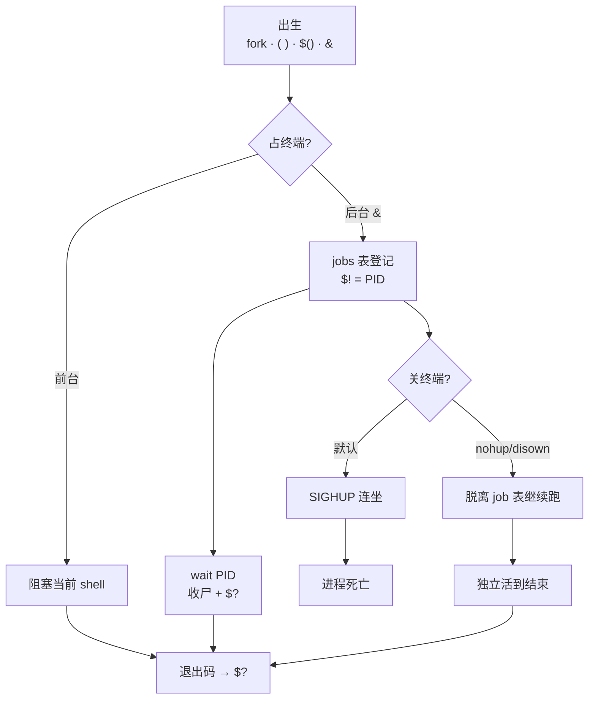
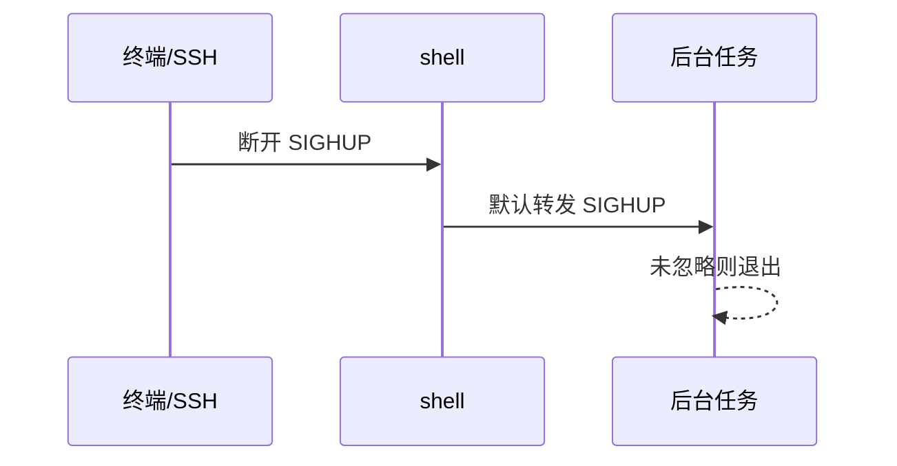
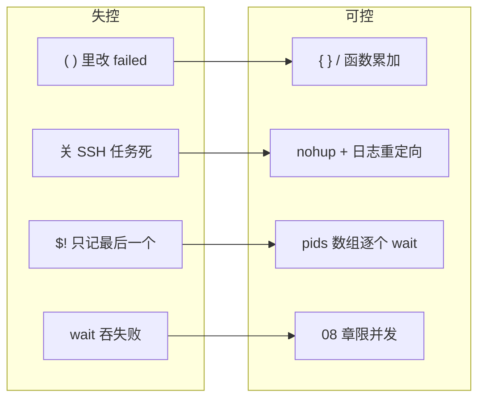
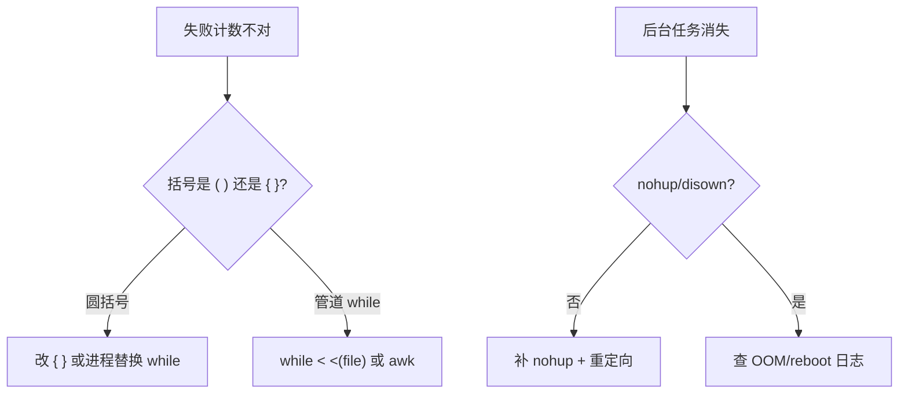

# 07｜进程作业与 subshell · SRE 开发能力

> 批量巡检脚本在 `( for h in ...; do ssh "$h" check; done )` 里改了 `failed=0`，循环外 `echo $failed` 仍是 0；有人 `nohup ./sync.sh &` 关掉笔记本以为任务在跑，第二天发现 SIGHUP 把进程带走了；还有人 `jobs` 看不到昨晚的后台任务——**不是命令不会写，是不懂子进程从 fork 到收尸的整条命**。
> **本章回答**：一个**子进程**从 subshell/`&` 出生、在后台或前台干活、被 `wait`/`jobs` 认领、到 `nohup`/`disown` 脱离终端或随 shell 死亡——以及为什么 `( )` 里改的变量父 shell 看不见。
> **不讲**：三开关与 `trap` → [02](../02-脚本骨架与三开关/)；管道与 `PIPESTATUS` → [06](../06-管道重定向与PIPESTATUS/)；并发上限与 `xargs -P` → [08](../08-并发与限流/)；`getopts` 与 `--dry-run` → [09](../09-参数解析与dry-run/)。

**标记**：🎯重点 · 🔥难点 · ⭐常考 · 🔧实操

## 面试怎么考

| 标记 | 考点 |
|------|------|
| **核心** | `( )` 与 `{ }` 谁开 subshell；`$()` 捕输出也开 subshell；子 shell 里改变量不影响父 shell |
| **必会** | `cmd &` 后台；`wait` 收尸与退出码；`jobs`/`fg`/`bg`；`nohup` + 重定向 |
| **常用** | `disown -h` 防 HUP；`$$`/`$!`/`$?`；SSH 批量为何变量「丢失」 |
| **常考** | 为什么 `( failed=1 )` 外面还是 0；关掉终端后台任务会不会死；`wait` 与 `set -e` |

**30 秒怎么说**：Bash 里 `( )`、`$()`、管道、`&` 都会 fork **subshell**——子进程有父变量的**拷贝**，里面 `failed=1` 改不到外面。前台一条命令占着终端；`cmd &` 放后台，`$!` 记 PID，`wait` 等它结束并拿退出码。关终端发 SIGHUP，默认连坐子进程——`nohup` 或 `disown` 让任务脱离。生产批量失败汇总别包在 `( )` 里，用 `{ }` 或函数 + `local`。

---

## 能力边界

| 维度 | subshell / jobs | 同 shell `{ }` / 函数 | systemd / cron |
|------|-----------------|----------------------|----------------|
| **适合** | 隔离环境、捕输出、临时 `cd` | 循环内累加 `failed[]` | 常驻、开机自启、日志轮转 |
| **不适合** | 在 `( )` 里改父 shell 状态 | 需要真并行（仍单进程） | 5 分钟 ad-hoc 刀（过重） |
| **变量** | 子改父不见 | 同进程共享（注意 `local`） | 环境由 unit 文件定 |
| **终端** | `&`/`nohup` 管生命周期 | 占着当前 shell | 无 TTY |

- `( )` 解决环境隔离、`cd` 不污染；**不解决**父子变量同步
- `nohup` 解决关终端不收尸；**不解决**机器重启、OOM
- `wait` 解决等后台、汇总退出码；**不解决**并发上限（见 08）
- `disown` 解决从 job 表摘掉；**不解决**已死的进程

> **记住**：subshell 是**拷贝进子进程**，不是「子进程里有个魔法指针指回父变量」——失败列表、计数器必须在**同一 shell** 里累加。

---

## 语言最小集

读写生产脚本，进程层只需认这些：

```bash
#!/usr/bin/env bash
set -euo pipefail

# subshell：括号组
( cd /tmp && tar czf backup.tgz /var/log )   # 父 shell 的 $PWD 不变

# 命令替换 subshell
out="$(hostname -f)"                         # stdout 进变量；stderr 仍上终端

# 后台与收尸
long_task.sh &
pid=$!
wait "$pid"                                  # 退出码进 $?

# 脱离终端
nohup ./sync.sh >>/var/log/sync.log 2>&1 &
disown -h                                    # 可选：防 HUP

# 同 shell 分组（不开 subshell）
{
  failed=()
  for h in host1 host2; do
    ping -c1 "$h" || failed+=("$h")
  done
  printf '%s\n' "${failed[@]}"
}
```

| 符号 | 是否 subshell | 典型用途 |
|------|:-------------:|----------|
| `( … )` | 是 | 隔离 `cd`、环境变量、管道左侧组 |
| `{ …; }` | 否 | 同 shell 多命令、重定向一组 |
| `$( … )` | 是 | 捕 stdout |
| `cmd &` | 新进程 | 后台，不占前台 |
| `wait` | 否 | 等子进程，收退出码 |

---

## 一、一张图：一个子进程的一生

> 🎯 **一句话**：**出生（fork/subshell/`&`）→ 干活（前台或后台）→ 登记（jobs/`$!`）→ 收尸（`wait`/shell 退出）→ 或脱离（`nohup`/`disown`）**。



**读图**：从左「出生」跟 PID——`( )`/`$()`/`&` 都会多出子进程（`{ }` 不会）。前台命令卡着终端直到结束；`&` 立刻还你提示符，`$!` 记最新后台 PID。关笔记本/SSH 断线时内核给会话发 SIGHUP，没 `nohup` 的后台任务常被带走；`wait` 是父 shell **主动收尸**，不等则子进程变僵尸直到父退出。监控里看的是「进程还在不在」和退出码，不是 `jobs` 表里还有没有行。

---

## 二、出生：fork、subshell 与 `$!` ⭐

> 🎯 **一句话**：每次 `( )`、`$()`、管道、外部命令、`&`，都可能多一个**子进程**——父子各有内存拷贝。

### 谁会产生 subshell

```bash
# 1. 圆括号组
( export FOO=1; cd /tmp; pwd )    # 父 shell 里 echo $FOO 仍空，$PWD 仍是原目录

# 2. 命令替换
x=$(echo hi)                      # $( ) 内是 subshell

# 3. 管道（bash 默认）
echo foo | while read -r line; do count=$((count+1)); done
echo "$count"                     # 常是空——while 在 subshell

# 4. 后台
sleep 60 &
echo "bg pid=$!"

# 5. 外部命令（总是新进程）
date                              # /bin/date 是子进程，改不了 bash 变量
```

> 💡 **打个比方**：subshell 像**复印一份工牌进隔壁房间**——你在隔壁房间改名牌，大厅前台屏幕上的名字不会变。

### `$$`、`$!`、`$?`

- `$$`——当前 shell 的 PID，常用于锁文件 `/tmp/deploy.$$`
- `$!`——最近一个后台命令的 PID，`cmd &` 后立刻 `wait $!`
- `$?`——上一条**前台**命令退出码，`wait` 后也是该子进程码

```bash
sleep 2 &
bg_pid=$!
wait "$bg_pid"
echo "child exited with $?"
```

> ⚠️ **别混**：`$!` 只记**最后一个** `&`——连续起多个后台要每个立刻存 PID，别等第三个再读 `$!`。

### `( )` vs `{ }` ⭐🔥

```bash
# subshell——里面 failed=1 不影响外面
failed=0
( failed=1 )
echo "$failed"    # 0

# 同 shell 分组——必须有空格和分号
failed=0
{ failed=1; }
echo "$failed"    # 1
```

> 📝 **面试**：「批量 SSH 失败计数别写 `( for h ...; do ...; done )`，用 `{ ...; }` 或函数里的 `local failed`。」

---

## 三、变量：为什么在子进程里「丢失」 ⭐🔥

> 🎯 **一句话**：不是变量丢了，是你在**另一份拷贝**里改的——父 shell 从未收到写回。

### 经典翻车：管道 + while

```bash
#!/usr/bin/env bash
count=0
cat hosts.txt | while read -r h; do
  ping -c1 -W1 "$h" &>/dev/null && count=$((count+1))
done
echo "up: $count"    # 永远是 0
```

修法（任选）：

```bash
# A. 进程替换，while 不在 subshell
count=0
while read -r h; do
  ping -c1 -W1 "$h" &>/dev/null && count=$((count+1))
done < <(cat hosts.txt)
echo "up: $count"

# B. 结果写文件/临时变量在 subshell 外合并（08 章并发版用文件更安全）

# C. 不用 bash 计数，用 awk 汇总
```

### `export` 也救不了「写回」

```bash
export failed=0
( failed=1 )       # 子改 export 变量，父仍 0
echo "$failed"
```

`export` 只是让**子进程继承初始值**，不是共享内存。要共享状态用**文件**、**fd**、或**别用 subshell**。

### `$()` 只捕 stdout，变量仍隔离

```bash
result="$(deploy_host db01 2>&1)"    # deploy_host 里 failed=1 外面看不见
if deploy_host db01; then ...         # 用退出码判成败——对
```

> 🔍 **现场**：

```bash
# 看是不是 subshell
echo $$
( echo $$ )           # 两个 PID 不同 ← subshell
{ echo $$; }          # 与外面相同 ← 同 shell
```

---

## 四、前台与后台：`&`、`jobs`、`fg`、`bg`

> 🎯 **一句话**：`&` 把命令**登记到 job 表**并立刻还提示符；`fg`/`bg` 在**同一终端会话**里切换前后台。

### 基本操作

```bash
sleep 300 &
jobs -l                  # [1]+ 12345 Running sleep 300 &
kill %1                  # 按 job 号杀，不必记 PID
fg %1                    # 拉回前台（占终端）
# Ctrl+Z 暂停 → bg %1 继续后台
```

- `cmd &`——后台启动，打印 `[n] pid`
- `jobs`——当前 shell 的 job 表
- `fg %n` / `bg %n`——前后台切换
- `kill %n`——向 job 发信号

> ⚠️ **别混**：`jobs` 只对**当前交互 shell** 有效——`cron`、CI、非交互 `ssh remote 'cmd &'` 里通常**没有** job 表给你 `fg`。

### 非交互脚本里的后台

```bash
#!/usr/bin/env bash
set -euo pipefail

pids=()
for h in "${hosts[@]}"; do
  probe_one "$h" &
  pids+=("$!")
done

for pid in "${pids[@]}"; do
  wait "$pid" || failed+=("$pid")
done
```

> 📝 **面试**：「脚本里不用 `jobs`，自己维护 `pids[]` + `wait`——可控、可汇总失败。」

### `wait` 与退出码 🔥

> 💡 **打个比方**：`wait` 像去快递柜**取件签收**——你不签，包裹（子进程）就一直占着格子（僵尸状态）；签收时还要看一眼包裹上的破损标记（退出码）。

```bash
false &
wait $!
echo $?    # 1

# wait 多个：bash 4.3+ 最后完成的码；要逐个判：
for pid in "${pids[@]}"; do
  wait "$pid" || failed+=("$pid")
done
```

`set -e` 下：**`wait` 返回非零会触发退出**——循环里用 `wait "$pid" || true` 会吞失败；应 `wait "$pid" || failed+=("$pid")`（与 02 章批处理一致）。

---

## 五、脱离：关终端、SIGHUP、`nohup`、`disown`

> 🎯 **一句话**：SSH 断开时会话 leader 收 SIGHUP，默认**广播给 job 表里的进程**——`nohup` 忽略 HUP，`disown` 从表上除名。

### 关终端时发生什么



> 💡 **打个比方**：`nohup` 像给进程办了「**不随班组解散而离职**」——终端关了，任务仍挂在 init/systemd 下。

### `nohup` 标准写法

```bash
nohup ./full-sync.sh >>/var/log/sync.log 2>&1 &
echo "started pid=$! log=/var/log/sync.log"
```

- `nohup`：忽略 SIGHUP；stdout/stderr 默认追加到 `nohup.out`——**生产必须自己重定向**。
- 仍可能被 OOM、机器重启杀掉——长跑任务用 **systemd unit** 或 **cron @reboot**。

### `disown`

```bash
./long.sh &
disown -h          # -h：标记不因 HUP 退出（bash）
# 或
disown -a          # 摘掉所有 job
```

- `nohup cmd &`——一条命令扔出去，最简单
- `cmd &` + `disown`——已启动后补救
- `systemd-run` / unit——生产常驻、自动重启

> 🔍 **现场**：

```bash
# 误在笔记本上跑了一宿同步
ps -p 12345 -o pid,cmd,stat    # 还在不在
tail -f /var/log/sync.log

# 已断线且进程没了：查 nohup.out 或当时是否重定向
ls -la nohup.out ~/nohup.out
```

> 📝 **面试**：「`nohup` 防关终端；不防杀 -9、不防重启。生产用 systemd `Type=simple` + `Restart=on-failure`。」

---

## 六、收束：子进程凭什么「可控」 ⭐



**可背清单**：

1. `( )`、`$()`、管道左侧、`&` 会 fork——变量改不回父 shell
2. 失败列表用 `{ }`、函数、`while < file`，别用 `( while ... )`
3. 后台：`pids+=($!)` + 循环 `wait`，别只靠 `$!`
4. 长跑：`nohup ... >>log 2>&1 &` 或 systemd
5. `wait` 的码进 `$?`；`set -e` 下用 `|| failed+=` 汇总
6. 交互才用 `jobs`/`fg`；脚本用 PID 数组
7. `disown` 是补救，不是首选
8. 真并行 + 上限 → [08](../08-并发与限流/)

> ⚠️ **别混**：subshell **不保证**并行加速——`( for ...; do cmd; done )` 仍是串行；并行靠 `&` + `wait` 或 `xargs -P`。

---

## 七、作战：「变量怎么一直是 0」与「后台任务没了」

| 现象 | 先做 | 别做 |
|------|------|------|
| 循环外 `failed` 始终 0 | 查是否 `( )` 或管道 `while` | 去掉 `set -e`「糊弄」 |
| SSH 断开任务停 | `ps` 看进程；查是否 nohup | 以为 `&` 就一定存活 |
| 僵尸 `[defunct]` | 父进程是否还在 `wait` | 随便 kill 父进程 |
| `$!` 不对 | 是否连续 `&` 没存 PID | 用最后一个 `$!` 代表全部 |
| `wait: pid not a child` | PID 是否本 shell 起的 | 对别的会话 `wait` |

**60 秒剧本** 🔧：

| 时段 | 动作 |
|------|------|
| 0–10s | `head -30 script.sh` 搜 `( `、`while read` 是否在管道右端 |
| 10–30s | `bash -x script.sh` 看 `failed` 赋值在哪个 PID |
| 30–45s | 后台：`jobs -l` 或 `ps -ef \| grep script` |
| 45–60s | 要长跑：`nohup ... >>log 2>&1 &` + 记 PID 到文件 |



---

## 生产模板

### 模板 1：同 shell 批量探活（正确累加 failed）

```bash
#!/usr/bin/env bash
set -euo pipefail

HOSTS_FILE="${1:-hosts.txt}"
failed=()

probe() {
  local h=$1
  ping -c1 -W2 "$h" &>/dev/null
}

while read -r h; do
  [[ -z "$h" || "$h" =~ ^# ]] && continue
  probe "$h" || failed+=("$h")
done <"$HOSTS_FILE"

if ((${#failed[@]} > 0)); then
  printf 'down: %s\n' "${failed[*]}" >&2
  exit 1
fi
```

### 模板 2：有限后台 + wait 汇总

```bash
#!/usr/bin/env bash
set -euo pipefail

PARALLEL="${PARALLEL:-5}"
hosts=( $(<hosts.txt) )
failed=()
running=0

for h in "${hosts[@]}"; do
  while (( running >= PARALLEL )); do
    wait -n 2>/dev/null || wait -n
    ((running--)) || true
  done
  (
    ssh -n "$h" 'systemctl is-active nginx'
  ) &
  pids[$!]=$h
  ((running++))
done

for pid in "${!pids[@]}"; do
  wait "$pid" || failed+=("${pids[$pid]}")
done

((${#failed[@]})) && { printf 'fail: %s\n' "${failed[*]}"; exit 1; }
```

> 完整限流与 `xargs -P` → [08](../08-并发与限流/)。

### 模板 3：nohup 长跑同步

```bash
#!/usr/bin/env bash
set -euo pipefail

LOG=/var/log/rsync-pull.log
PIDFILE=/var/run/rsync-pull.pid

if [[ -f $PIDFILE ]] && kill -0 "$(<"$PIDFILE")" 2>/dev/null; then
  echo "already running pid=$(<"$PIDFILE")" >&2
  exit 1
fi

nohup rsync -az backup@src:/data/ /data/mirror/ >>"$LOG" 2>&1 &
echo $! >"$PIDFILE"
echo "started pid=$! log=$LOG"
```

### 模板 4：隔离 `cd` 的 subshell（正确用法）

```bash
#!/usr/bin/env bash
set -euo pipefail

ROOT=$(pwd)
artifact=$(mktemp)

(
  cd "$ROOT/build"
  tar czf "$artifact" dist/
)
# 父 shell 仍在 $ROOT
scp "$artifact" deploy@bastion:/incoming/
rm -f "$artifact"
```

---

## 踩坑清单

| 现象 | 原因 | 修法 |
|------|------|------|
| `failed` 永远 0 | `( )` 或 `\| while` subshell | `{ }` / `while < file` |
| 关笔记本任务停 | 无 nohup | `nohup ... >>log 2>&1 &` |
| `$!` 只有一个 PID | 连续 `&` 未存 | 每次 `pids+=($!)` |
| `wait` 后脚本莫名退出 | `set -e` + `wait` 非零 | `wait \|\| failed+=` |
| `nohup.out` 撑满磁盘 | 未重定向 | 指定 log + logrotate |
| `jobs` 为空 | 非交互 shell | 用 `ps` + PID 文件 |
| 管道 `count` 不对 | while 在 subshell | 进程替换 |
| `disown` 无效 | 子已死或不同 shell | 启动时就 nohup |
| 僵尸堆积 | 父从不 wait | 循环 wait 或勿乱 `&` |

---

## 必会 · 常考

| 说法 | 对错 | 口径 |
|------|:----:|------|
| `( )` 里改变量父 shell 可见 | 错 | subshell 拷贝 |
| `{ }` 与 `( )` 一样 | 错 | `{ }` 同 shell |
| `$()` 会开 subshell | 对 | 且只捕 stdout |
| `&` 后立刻关终端任务必活 | 错 | 要 nohup/disown |
| `nohup` 防 reboot | 错 | 只防 SIGHUP |
| `$!` 是所有后台 PID | 错 | 仅最后一个 |
| `wait` 能 wait 任意 PID | 错 | 须本 shell 子进程 |
| 管道右端 `while` 能改父变量 | 错 | bash 默认 subshell |
| `export` 让子写回父 | 错 | 只继承初值 |
| `jobs` 在 cron 里好用 | 错 | 非交互无 job 表 |

**数字**：`$?` 0 成功；`wait` 非零 = 子进程失败；SIGHUP 常导致 SSH 后台任务退出。

---

## 命令速查 🔧

```bash
echo $$ $! $?                 # 当前 shell / 最近后台 / 上条退出码
( echo subshell $$ )          # PID 与外面不同
jobs -l                       # 交互式 job 表
wait $pid                     # 收尸
nohup cmd >>log 2>&1 &        # 脱离终端
disown -h %1                  # 防 HUP
ps -o pid,ppid,cmd -p $pid    # 看父子关系
kill -0 $pid                  # 探测是否存活
```

---

## 面试锚点

| 问 | 30 秒答 |
|----|---------|
| `( )` 和 `{ }` 区别？ | `( )` 开 subshell，变量隔离；`{ }` 同 shell，需 `;` 和空格 |
| 为什么管道 while 改不了 count？ | while 在 subshell，父 shell 看不见 |
| `nohup` 干什么？ | 忽略 SIGHUP，关终端不杀；要重定向日志 |
| `$!` 是什么？ | 最近一个 `&` 的后台 PID |
| `wait` 和 `jobs`？ | `wait` 收尸拿退出码；`jobs` 看表，仅交互 shell |
| 后台任务怎么汇总失败？ | `pids+=($!)` 循环 `wait \|\| failed+=` |

---

## 合上书，问自己

- [ ] 默画「子进程一生」：出生 → 前后台 → jobs/`$!` → wait → nohup/disown。
- [ ] `( failed=1 )` 后父 shell `echo $failed` 是多少？为什么？
- [ ] `cat f | while read` 与 `while read < f` 对变量累加差在哪？
- [ ] SSH 断开时，什么情况下 `sleep 3600 &` 还会活？
- [ ] 连续起三个 `cmd &`，如何拿到三个 PID 并等它们全部结束？
- [ ] `set -e` 下 `wait $pid` 失败脚本会怎样？正确汇总写法？
- [ ] 什么时候**应该**用 `( )`（举两个 SRE 场景）？
- [ ] `nohup` 和 systemd 长跑任务，你怎么选？

八题能口述，进程与 subshell 就过关。下一章在「会起后台」之上加**并发上限与 flock**。
