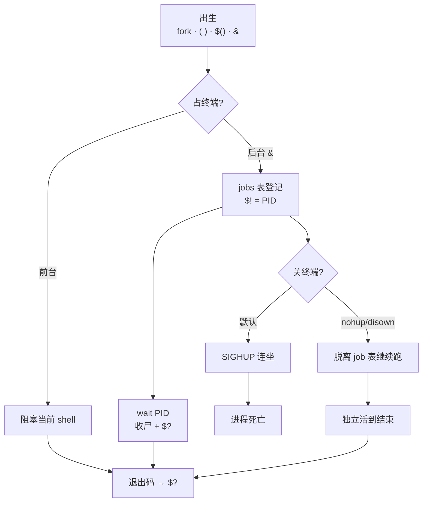
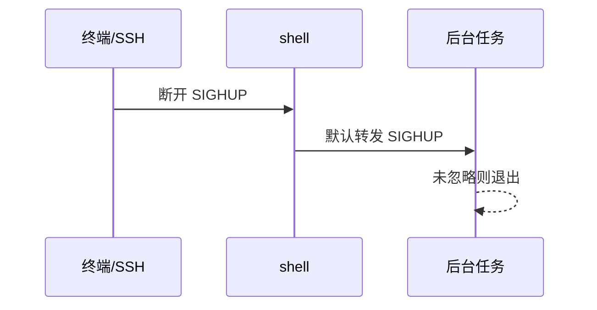
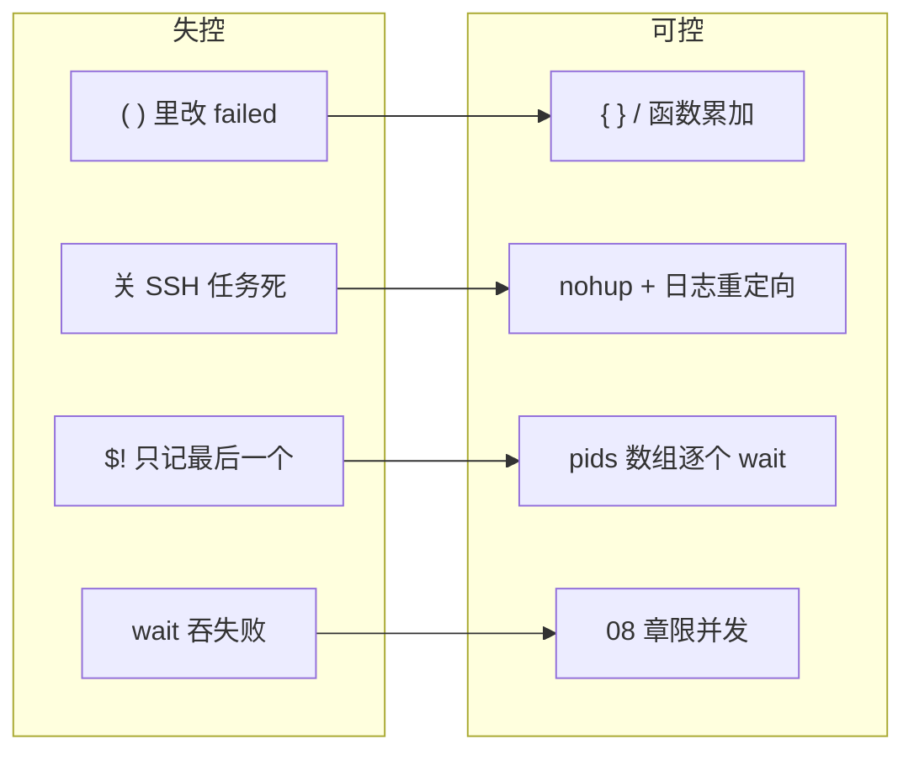
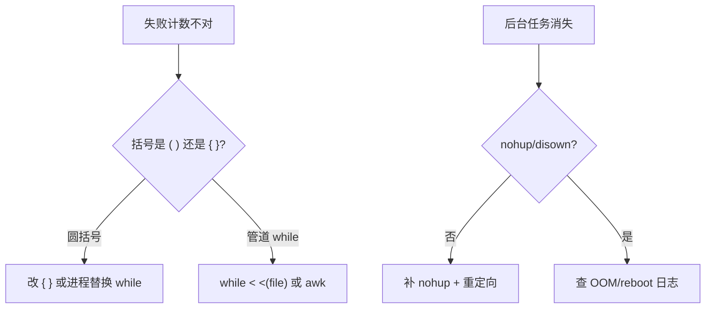

# 07｜进程作业与 subshell · SRE 开发能力

> 批量巡检 `( for h in ...; do ssh "$h" check; done )` 里改了 `failed=0`，循环外仍是 0；`nohup ./sync.sh &` 关掉笔记本以为还在跑，第二天 SIGHUP 已带走；`jobs` 看不到昨晚后台——群里喊「脚本逻辑写错了」。
> **本章回答**：一个**子进程**从 subshell/`&` 出生、前后台干活、`wait`/`jobs` 收尸、到 `nohup`/`disown` 脱离——以及为什么 `( )` 里改的变量父 shell 看不见。
> **不讲**：三开关与 `trap` → [02](../02-脚本骨架与三开关/)；管道与 `PIPESTATUS` → [06](../06-管道重定向与PIPESTATUS/)；并发上限与 `xargs -P` → [08](../08-并发与限流/)；`getopts` 与 `--dry-run` → [09](../09-参数解析与dry-run/)。

**标记**：🎯重点 · 🔥难点 · ⭐常考 · 🔧实操

---

## 面试怎么考

| 标记 | 考点 |
|------|------|
| **核心** | `( )` 与 `{ }` 谁开 subshell；`$()` 捕输出也开；子改变量父不见 |
| **必会** | `cmd &`；`wait` 收尸与退出码；`jobs`/`fg`/`bg`；`nohup` + 重定向 |
| **常用** | `disown -h`；`$$`/`$!`/`$?`；SSH 批量变量「丢失」 |
| **常考** | `( failed=1 )` 外面仍 0；关终端会不会死；`wait` 与 `set -e` |

> 📝 **面试（30 秒）**：`( )`、`$()`、管道、`&` 都会 fork **subshell**——子拿到父变量**拷贝**，`failed=1` 写不回父。`cmd &` 放后台，`$!` 记 PID，`wait` 收尸拿码。关终端发 SIGHUP——`nohup`/`disown` 脱离。失败汇总别包 `( )`，用 `{ }` 或函数 + `local`。

---

## 能力边界

| 维度 | subshell / jobs | 同 shell `{ }` / 函数 | systemd / cron |
|------|-----------------|----------------------|----------------|
| **适合** | 隔离环境、捕输出、临时 `cd` | 循环内累加 `failed[]` | 常驻、开机自启、日志轮转 |
| **不适合** | 在 `( )` 里改父状态 | 需要真并行（仍单进程） | 5 分钟 ad-hoc（过重） |
| **变量** | 子改父不见 | 同进程共享（注意 `local`） | 环境由 unit 定 |
| **终端** | `&`/`nohup` 管生命周期 | 占着当前 shell | 无 TTY |

- 🔑 **各管一段**
  - `( )`：环境隔离、`cd` 不污染——**不**解决父子变量同步
  - `nohup`：关终端不收尸——**不**防重启 / OOM
  - `wait`：等后台、汇总退出码——**不**管并发上限（见 08）
  - `disown`：从 job 表摘掉——**不**救已死进程

> ⚠️ **别混**：subshell 是**拷贝进子进程**，不是魔法指针指回父变量——失败列表、计数器必须在**同一 shell** 累加。

---

## 语言最小集

```bash
#!/usr/bin/env bash
set -euo pipefail

( cd /tmp && tar czf backup.tgz /var/log )   # 父 $PWD 不变
out="$(hostname -f)"                         # stdout 进变量

long_task.sh &
pid=$!
wait "$pid"                                  # 退出码进 $?

nohup ./sync.sh >>/var/log/sync.log 2>&1 &
disown -h                                    # 可选：防 HUP

{
  failed=()
  for h in host1 host2; do
    ping -c1 "$h" || failed+=("$h")
  done
  printf '%s\n' "${failed[@]}"
}
```

| 符号 | subshell？ | 典型用途 |
|------|:----------:|----------|
| `( … )` | 是 | 隔离 `cd`、环境 |
| `{ …; }` | 否 | 同 shell 多命令 |
| `$( … )` | 是 | 捕 stdout |
| `cmd &` | 新进程 | 后台 |
| `wait` | 否 | 收尸拿退出码 |

零件认完，上主图。

---

## 一、一张图：一个子进程的一生

> 🎯 **一句话**：**出生（fork/`( )`/`$()`/`&`）→ 干活（前/后台）→ 登记（jobs/`$!`）→ 收尸（`wait`）→ 或脱离（`nohup`/`disown`）**。



- 📖 **读图**
  - 🛤️ 主线「出生 → 前后台 → 登记 → 收尸/脱离」；`( )`/`$()`/`&` 多出子进程，`{ }` 不会
  - 🔪 开篇三现场：变量仍 0 → 出生在 subshell；关本死任务 → 缺 nohup；`jobs` 空 → 非交互无表（Q1、Q7、Q14）

本节对应练习题 Q1、Q14。

---

## 二、出生：fork、subshell 与 `$!` ⭐

> 🎯 **一句话**：每次 `( )`、`$()`、管道、外部命令、`&`，都可能多一个**子进程**——父子各有内存拷贝。

### 🐣 谁会产生 subshell

```bash
( export FOO=1; cd /tmp; pwd )    # 父：FOO 仍空，$PWD 原目录
x=$(echo hi)                      # $( ) 内是 subshell
echo foo | while read -r line; do count=$((count+1)); done
echo "$count"                     # 常空——while 在 subshell
sleep 60 &
echo "bg pid=$!"
date                              # /bin/date 是子进程，改不了 bash 变量
```

> 💡 **打个比方**：subshell 像**复印工牌进隔壁房间**——隔壁改名牌，大厅前台屏幕不变。

### 🔢 `$$`、`$!`、`$?`

- `$$`——当前 shell PID，常用于锁文件 `/tmp/deploy.$$`
- `$!`——最近一个后台 PID，`cmd &` 后立刻存
- `$?`——上一条**前台**退出码；`wait` 后也是该子进程码

```bash
sleep 2 &
bg_pid=$!
wait "$bg_pid"
echo "child exited with $?"
```

> ⚠️ **别混**：`$!` 只记**最后一个** `&`——连续起多个要每个立刻 `pids+=($!)`，别等第三个再读。

### 📦 `( )` vs `{ }` ⭐🔥

```bash
failed=0
( failed=1 )
echo "$failed"    # 0

failed=0
{ failed=1; }     # 必须有空格和分号
echo "$failed"    # 1
```

#### ❓ 为什么 `( failed=1 )` 外面还是 0？

- 🔥 高频错答：「子进程有个指针指回父变量」——**没有**
- ✅ subshell **fork 后拷贝**；子改的是自己那份，父从未收到写回
- 🛠️ 要累加：用 `{ }`、函数 + `local`、或进程替换 `while … < <(…)`

> 📝 **面试**：批量 SSH 失败计数别写 `( for h ...; do ...; done )`，用 `{ ...; }` 或函数里 `local failed`。⭐（Q4、Q10）

> 🔍 **现场**：

```bash
echo $$
( echo $$ )           # ← 两个 PID 不同 = subshell
{ echo $$; }          # ← 与外面相同 = 同 shell
```

本节对应练习题 Q4、Q10。

---

## 三、变量：为什么在子进程里「丢失」 ⭐🔥

> 🎯 **一句话**：不是变量丢了，是你在**另一份拷贝**里改的——父 shell 从未收到写回。

### 💥 经典翻车：管道 + while

```bash
#!/usr/bin/env bash
count=0
cat hosts.txt | while read -r h; do
  ping -c1 -W1 "$h" &>/dev/null && count=$((count+1))
done
echo "up: $count"    # 永远是 0
```

#### ❓ 为什么管道右边 `while` 改不了 `count`？

- 🔥 bash **默认**把管道各段放进 subshell（右侧 `while` 也是）
- ✅ 修法 A：进程替换，`while` 留在当前 shell

```bash
count=0
while read -r h; do
  ping -c1 -W1 "$h" &>/dev/null && count=$((count+1))
done < <(cat hosts.txt)
echo "up: $count"
```

- ✅ 修法 B：结果写文件 / 临时变量在 subshell 外合并（并发版见 08）
- ✅ 修法 C：不用 bash 计数，用 `awk` 汇总

### 📤 `export` 也救不了「写回」

```bash
export failed=0
( failed=1 )       # 子改 export 变量，父仍 0
echo "$failed"
```

#### ❓ 为什么 `export` 不能让子写回父？

- `export` 只让**子进程继承初始值**，不是共享内存
- 要共享状态：用**文件**、**fd**、或**别用 subshell**

### 🎣 `$()` 只捕 stdout，变量仍隔离

```bash
result="$(deploy_host db01 2>&1)"    # deploy_host 里 failed=1 外面看不见
if deploy_host db01; then ...         # 用退出码判成败——对
```

本节对应练习题 Q1、Q2、Q3。

---

## 四、前台与后台：`&`、`jobs`、`fg`、`bg`

> 🎯 **一句话**：`&` 把命令**登记到 job 表**并立刻还提示符；`fg`/`bg` 在**同一终端会话**里切换前后台。

### 🎮 基本操作

```bash
sleep 300 &
jobs -l                  # [1]+ 12345 Running sleep 300 &
kill %1                  # 按 job 号杀
fg %1                    # 拉回前台（占终端）
# Ctrl+Z 暂停 → bg %1 继续后台
```

- `cmd &`——后台启动，打印 `[n] pid`
- `jobs`——当前 shell 的 job 表
- `fg %n` / `bg %n`——前后台切换
- `kill %n`——向 job 发信号

> ⚠️ **别混**：`jobs` 只对**当前交互 shell** 有效——`cron`、CI、非交互 `ssh remote 'cmd &'` 里通常**没有** job 表给你 `fg`。

### 📜 非交互脚本里的后台

```bash
#!/usr/bin/env bash
set -euo pipefail

pids=()
for h in "${hosts[@]}"; do
  probe_one "$h" &
  pids+=("$!")
done

for pid in "${pids[@]}"; do
  wait "$pid" || failed+=("$pid")
done
```

> 📝 **面试**：脚本里不用 `jobs`，自己维护 `pids[]` + `wait`——可控、可汇总失败。⭐（Q5、Q11）

### ⚰️ `wait` 与退出码 🔥

> 💡 **打个比方**：`wait` 像去快递柜**取件签收**——不签，包裹（子进程）占着格子（僵尸）；签收时看破损标记（退出码）。

```bash
false &
wait $!
echo $?    # 1

# wait 多个：要逐个判
for pid in "${pids[@]}"; do
  wait "$pid" || failed+=("$pid")
done
```

#### ❓ 为什么 `set -e` 下 `wait` 非零会杀脚本？

- `wait` 返回非零 = 子进程失败 → 触发 `-e` 退出
- ❌ `wait "$pid" || true` 会**吞失败**
- ✅ `wait "$pid" || failed+=("$pid")`（与 02 章批处理一致）

本节对应练习题 Q5、Q6、Q11。

---

## 五、脱离：关终端、SIGHUP、`nohup`、`disown`

> 🎯 **一句话**：SSH 断开时会话 leader 收 SIGHUP，默认**广播给 job 表里的进程**——`nohup` 忽略 HUP，`disown` 从表上除名。

### 📡 关终端时发生什么



- 📖 **读图**：断线 → shell 收 HUP → 默认转发给 job 表进程；没 `nohup`/`disown` 就死

> 💡 **打个比方**：`nohup` 像给进程办「**不随班组解散而离职**」——终端关了，任务仍挂在 init/systemd 下。

#### ❓ 为什么 `&` 后立刻关终端任务还会死？

- `&` 只放后台，**仍挂在会话 job 表**上
- 关终端发 SIGHUP → 默认连坐
- 要留命：启动时 `nohup`，或已启动后 `disown`

### 🛡️ `nohup` 标准写法

```bash
nohup ./full-sync.sh >>/var/log/sync.log 2>&1 &
echo "started pid=$! log=/var/log/sync.log"
```

- `nohup`：忽略 SIGHUP；stdout/stderr 默认追加 `nohup.out`——**生产必须自己重定向**
- 仍可能被 OOM、机器重启杀掉——长跑用 **systemd unit** 或 **cron @reboot**

### 🏷️ `disown`

```bash
./long.sh &
disown -h          # -h：标记不因 HUP 退出（bash）
# 或
disown -a          # 摘掉所有 job
```

- `nohup cmd &`——一条扔出去，最简单
- `cmd &` + `disown`——已启动后补救
- `systemd-run` / unit——生产常驻、自动重启

#### ❓ `nohup` 和 `disown` 怎么选？

- 新起长跑 → **`nohup … >>log 2>&1 &`**（首选）
- 已经 `&` 出去才想起来 → **`disown -h`**（补救）
- 要重启自启、失败重启 → **systemd**，不是 nohup

> 🔍 **现场**：

```bash
ps -p 12345 -o pid,cmd,stat    # ← 还在不在
tail -f /var/log/sync.log
ls -la nohup.out ~/nohup.out   # ← 断线后查有没有默认落盘
```

> 📝 **面试**：`nohup` 防关终端；不防 `kill -9`、不防重启。生产用 systemd `Type=simple` + `Restart=on-failure`。⭐（Q7、Q8、Q9）

本节对应练习题 Q7、Q8、Q9。

---

## 六、收束：子进程凭什么「可控」 ⭐



- 📖 **读图**：左列四类翻车 → 右列四把刀；作战节按这四对定责

**可背清单**：

1. `( )`、`$()`、管道左侧、`&` 会 fork——变量改不回父 shell
2. 失败列表用 `{ }`、函数、`while < file`，别用 `( while ... )`
3. 后台：`pids+=($!)` + 循环 `wait`，别只靠 `$!`
4. 长跑：`nohup ... >>log 2>&1 &` 或 systemd
5. `wait` 的码进 `$?`；`set -e` 下用 `|| failed+=` 汇总
6. 交互才用 `jobs`/`fg`；脚本用 PID 数组
7. `disown` 是补救，不是首选
8. 真并行 + 上限 → [08](../08-并发与限流/)

> ⚠️ **别混**：subshell **不保证**并行加速——`( for ...; do cmd; done )` 仍是串行；并行靠 `&` + `wait` 或 `xargs -P`。

本节对应练习题 Q14。

---

## 七、作战：「变量怎么一直是 0」与「后台任务没了」

回到开篇：`failed` 仍 0、关本任务没了——按这棵树定责。



- 📖 **读图**：左分叉「变量」→ 括号/管道；右分叉「任务没了」→ 有无 nohup，再查 OOM/重启

| 现象 | 先做 | 别做 |
|------|------|------|
| 循环外 `failed` 始终 0 | 查是否 `( )` 或管道 `while` | 去掉 `set -e`「糊弄」 |
| SSH 断开任务停 | `ps` 看进程；查是否 nohup | 以为 `&` 就一定存活 |
| 僵尸 `[defunct]` | 父进程是否还在 `wait` | 随便 kill 父进程 |
| `$!` 不对 | 是否连续 `&` 没存 PID | 用最后一个 `$!` 代表全部 |
| `wait: pid not a child` | PID 是否本 shell 起的 | 对别的会话 `wait` |

**60 秒剧本** 🔧：

```text
0–10s   head -30 script.sh 搜 ( 、while read 是否在管道右端
10–30s  bash -x script.sh 看 failed 赋值在哪个 PID
30–45s  后台：jobs -l 或 ps -ef | grep script
45–60s  要长跑：nohup ... >>log 2>&1 & + 记 PID 到文件
```

本节对应练习题 Q1、Q7、Q13。

---

## 生产模板

### 模板 1：同 shell 批量探活（正确累加 failed）

```bash
#!/usr/bin/env bash
set -euo pipefail

HOSTS_FILE="${1:-hosts.txt}"
failed=()

probe() {
  local h=$1
  ping -c1 -W2 "$h" &>/dev/null
}

while read -r h; do
  [[ -z "$h" || "$h" =~ ^# ]] && continue
  probe "$h" || failed+=("$h")
done <"$HOSTS_FILE"

if ((${#failed[@]} > 0)); then
  printf 'down: %s\n' "${failed[*]}" >&2
  exit 1
fi
```

### 模板 2：有限后台 + wait 汇总

```bash
#!/usr/bin/env bash
set -euo pipefail

PARALLEL="${PARALLEL:-5}"
hosts=( $(<hosts.txt) )
failed=()
running=0

for h in "${hosts[@]}"; do
  while (( running >= PARALLEL )); do
    wait -n 2>/dev/null || wait -n
    ((running--)) || true
  done
  (
    ssh -n "$h" 'systemctl is-active nginx'
  ) &
  pids[$!]=$h
  ((running++))
done

for pid in "${!pids[@]}"; do
  wait "$pid" || failed+=("${pids[$pid]}")
done

((${#failed[@]})) && { printf 'fail: %s\n' "${failed[*]}"; exit 1; }
```

> 完整限流与 `xargs -P` → [08](../08-并发与限流/)。

### 模板 3：nohup 长跑同步

```bash
#!/usr/bin/env bash
set -euo pipefail

LOG=/var/log/rsync-pull.log
PIDFILE=/var/run/rsync-pull.pid

if [[ -f $PIDFILE ]] && kill -0 "$(<"$PIDFILE")" 2>/dev/null; then
  echo "already running pid=$(<"$PIDFILE")" >&2
  exit 1
fi

nohup rsync -az backup@src:/data/ /data/mirror/ >>"$LOG" 2>&1 &
echo $! >"$PIDFILE"
echo "started pid=$! log=$LOG"
```

### 模板 4：隔离 `cd` 的 subshell（正确用法）

```bash
#!/usr/bin/env bash
set -euo pipefail

ROOT=$(pwd)
artifact=$(mktemp)

(
  cd "$ROOT/build"
  tar czf "$artifact" dist/
)
# 父 shell 仍在 $ROOT
scp "$artifact" deploy@bastion:/incoming/
rm -f "$artifact"
```

本节对应练习题 Q8、Q12。

---

## 踩坑清单

| 现象 | 原因 | 修法 |
|------|------|------|
| `failed` 永远 0 | `( )` 或 `\| while` subshell | `{ }` / `while < file` |
| 关笔记本任务停 | 无 nohup | `nohup ... >>log 2>&1 &` |
| `$!` 只有一个 PID | 连续 `&` 未存 | 每次 `pids+=($!)` |
| `wait` 后脚本莫名退出 | `set -e` + `wait` 非零 | `wait \|\| failed+=` |
| `nohup.out` 撑满磁盘 | 未重定向 | 指定 log + logrotate |
| `jobs` 为空 | 非交互 shell | 用 `ps` + PID 文件 |
| 管道 `count` 不对 | while 在 subshell | 进程替换 |
| `disown` 无效 | 子已死或不同 shell | 启动时就 nohup |
| 僵尸堆积 | 父从不 wait | 循环 wait 或勿乱 `&` |

---

## 必会 · 常考

| 说法 | 对错 | 口径 |
|------|:----:|------|
| `( )` 里改变量父 shell 可见 | 错 | subshell 拷贝 |
| `{ }` 与 `( )` 一样 | 错 | `{ }` 同 shell |
| `$()` 会开 subshell | 对 | 且只捕 stdout |
| `&` 后立刻关终端任务必活 | 错 | 要 nohup/disown |
| `nohup` 防 reboot | 错 | 只防 SIGHUP |
| `$!` 是所有后台 PID | 错 | 仅最后一个 |
| `wait` 能 wait 任意 PID | 错 | 须本 shell 子进程 |
| 管道右端 `while` 能改父变量 | 错 | bash 默认 subshell |
| `export` 让子写回父 | 错 | 只继承初值 |
| `jobs` 在 cron 里好用 | 错 | 非交互无 job 表 |

---

## 收口

### 命令速查 🔧

```bash
echo $$ $! $?                 # 当前 shell / 最近后台 / 上条退出码
( echo subshell $$ )          # PID 与外面不同
jobs -l                       # 交互式 job 表
wait $pid                     # 收尸
nohup cmd >>log 2>&1 &        # 脱离终端
disown -h %1                  # 防 HUP
ps -o pid,ppid,cmd -p $pid    # 看父子关系
kill -0 $pid                  # 探测是否存活
```

### 面试锚点

| 问 | 30 秒答 |
|----|---------|
| `( )` 和 `{ }` 区别？ | `( )` 开 subshell，变量隔离；`{ }` 同 shell，需 `;` 和空格 |
| 为什么管道 while 改不了 count？ | while 在 subshell，父看不见 |
| `nohup` 干什么？ | 忽略 SIGHUP，关终端不杀；要重定向日志 |
| `$!` 是什么？ | 最近一个 `&` 的后台 PID |
| `wait` 和 `jobs`？ | `wait` 收尸拿退出码；`jobs` 看表，仅交互 shell |
| 后台任务怎么汇总失败？ | `pids+=($!)` 循环 `wait \|\| failed+=` |

### 易错一句话对照

```text
错：( ) 里改 failed 外面可见
对：subshell 拷贝；用 { } / 函数累加

错：{ } 和 ( ) 一样
对：{ } 同 shell；( ) 开子进程

错：export 让子写回父
对：只继承初值，不是共享内存

错：管道 while 能改父 count
对：bash 默认 subshell；用进程替换

错：& 后关终端任务必活
对：要 nohup / disown；& 仍挂 job 表

错：nohup 防 reboot / OOM
对：只防 SIGHUP；长跑用 systemd

错：$! 是所有后台 PID
对：仅最后一个；要 pids+=($!)

错：wait 能等任意 PID
对：须本 shell 子进程

错：jobs 在 cron 里好用
对：非交互无 job 表；脚本用 PID 数组

错：wait || true 安全汇总
对：吞失败；用 || failed+=
```

### 数字墙

> `$?` **0** = 成功；`wait` 非零 = 子失败。SIGHUP 常带走 SSH 后台任务。`nohup` 默认写 **`nohup.out`**——生产必须重定向。并发上限见 08（常用 `xargs -P 10`）。

---

## 合上书

- [ ] **默画**「子进程一生」：出生 → 前后台 → jobs/`$!` → wait → nohup/disown（Q1、Q14）
- [ ] `( failed=1 )` 后父 shell `echo $failed` 是多少？为什么？（Q1）
- [ ] `cat f | while read` 与 `while read < f` 对变量累加差在哪？（Q3）
- [ ] SSH 断开时，什么情况下 `sleep 3600 &` 还会活？（Q7、Q8）
- [ ] 连续起三个 `cmd &`，如何拿到三个 PID 并等它们全部结束？（Q4、Q5）
- [ ] `set -e` 下 `wait $pid` 失败脚本会怎样？正确汇总写法？（Q6）
- [ ] 什么时候**应该**用 `( )`（举两个 SRE 场景）？（Q2、Q12）
- [ ] `nohup` 和 systemd 长跑任务，你怎么选？（Q8、Q9）

全部打勾后，找同事十分钟讲清「开篇 `( failed=1 )` 外面仍 0、关终端任务没了——各自错在哪」。讲得下来，这章就过关。

下一章：[08 并发与限流](../08-并发与限流/)——在「会起后台」之上加并发上限与 flock。
