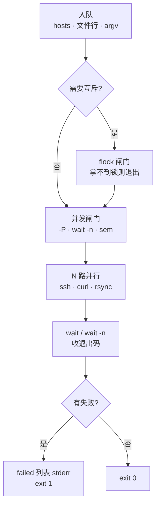
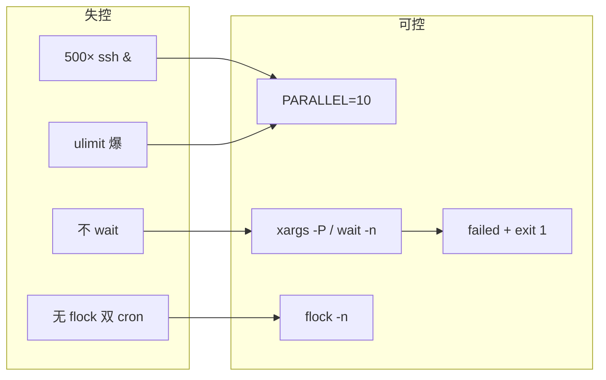
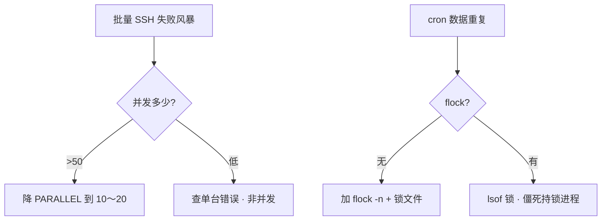

# 08｜并发与限流 · SRE 开发能力

> 大家好，欢迎来到这次分享。开讲之前，先带大家回到一个很多值班同学都踩过的现场：
> 发版脚本对 500 台机器同时 `ssh`，堡垒机 `MaxStartups` 打满、本机 `ulimit -n` 爆掉、一半主机 `Connection refused`；有人用 `for h; do ssh "$h" & done` 却从不 `wait`，CI 绿着僵尸堆了一桌；还有人两个 cron 同时跑全量同步，把对象存储打穿——群里已经有人在喊「再跑一遍就行」。
> 这一章讲完，你会知道当时那几个人各自错在哪——**不是不会 `&`，是不懂一批任务从起跑到收尸的并发契约**。
> **本章回答的问题**：一批**并发任务**从入队、受控并行（`wait -n`/`xargs -P`/信号量）、`flock` 互斥、到失败汇总与退出码——以及为什么「无限 `&`」比串行更危险。
> **本章不讲**：subshell 与 `$!` 基础 → [07](../07-进程作业与subshell/)；三开关与 `failed[]` 模式 → [02](../02-脚本骨架与三开关/)；`getopts` 传 `-j` → [09](../09-参数解析与dry-run/)。

**标记**：🎯重点 · 🔥难点 · ⭐常考 · 🔧实操

**怎么听这场分享**：先把「一批并发任务的一生」主图装进脑子——入队 → 限流起跑 → 收尸汇总 → 互斥防重叠；放慢 `xargs -P`/`wait -n`/`flock`；作战节专门讲开头那个「全 `&` 打穿堡垒机」。每一节讲完会提示对应练习题，趁热打铁。

## 面试怎么考

| 标记 | 考点 |
|------|------|
| **核心** | 并发 = 多个子进程 + **上限**；`xargs -P N`；`wait`/`wait -n` 收尸与汇总 |
| **必会** | `flock` 防 cron 重叠；信号量文件 / 命名管道限流；失败列表 + `exit 1` |
| **常用** | `PARALLEL=10` 环境变量；SSH 批量默认并发；`GNU parallel` 与 xargs 选型 |
| **常考** | 为什么「全 `&`」会假绿；`flock -n` 与 `exit 0`；`xargs` 空输入行为 |

**30 秒怎么说**：批量任务默认**串行**最安全；要加速就设**并发上限**——`xargs -P 10` 或自己维护 `running` 计数 + `wait -n`。每个后台任务必须 `wait` 并记失败 host，最后 `exit 1`。cron 互斥用 `flock -n` 拿不到锁就退出。别把 500 个 `ssh &` 一次扔出去——打满连接表、错误风暴、更难定责。危险变更仍要 `DRY_RUN`（09 章）。

---

## 能力边界

| 维度 | Shell 并发 | Ansible `forks` | 消息队列 Worker |
|------|------------|-----------------|-----------------|
| **适合** | 10～500 台探活、拉日志、scp | 幂等、审计、回滚 | 持续流量、削峰 |
| **不适合** | 万级 fan-out、复杂 DAG | 临时 3 台刀 | 一次性脚本 |
| **上限** | `ulimit -n`、SSH、目标 rate limit | 控制节点资源 | broker 吞吐 |
| **失败** | `failed[]` + exit 1 | unreachable 汇总 | 重试/DLQ |

各机制的边界：`xargs -P` 解决简单并行 + 上限，但管不了复杂依赖图；`flock` 解决单实例互斥，但不是分布式锁（多机要 etcd）；信号量文件是 bash 原生限流，但不能跨机器协调；`wait -n` 解决动态补位，但 bash < 4.3 没有它。

> **记住**：并发不是「越快越好」，是**在资源边界内尽快且可汇总地失败**。

---

好，边界清楚了。咱们先把主图装进脑子——后面每一节都是这张图上的一段。

## 语言最小集

```bash
#!/usr/bin/env bash
set -euo pipefail

PARALLEL="${PARALLEL:-10}"

# xargs 并行
grep -v '^#' hosts.txt | xargs -r -P "$PARALLEL" -I{} ssh -n {} 'hostname'

# 手写池：wait -n（bash 4.3+）
running=0
for h in "${hosts[@]}"; do
  while (( running >= PARALLEL )); do
    wait -n || true
    ((running--)) || true
  done
  ssh -n "$h" check &
  ((running++))
done
while (( running > 0 )); do wait -n || true; ((running--)) || true; done

# flock 互斥
exec 9>/var/lock/sync.lock
flock -n 9 || { echo "already running"; exit 0; }
```

四种写法的并发上限与失败汇总难度：串行 `for` 上限 1、失败汇总最简单；`xargs -P` 上限就是 `-P` 值、失败汇总中等（要包装脚本）；`&` + `wait -n` 自管上限、失败汇总中等；全 `&` 不 wait 上限无限、失败汇总极难（假绿）。

---

## 一、一张图：一批任务并发执行的一生

> 🎯 **一句话**：**入队 → 限流闸门（-P / 信号量 / flock）→ 并行干活 → wait 收尸 → 失败汇总 → exit 码交 CI**。



**读图**：任务从文件或数组「入队」后，先过两道闸——**互斥**（同一 job 只跑一份）和**并发**（同时最多 N 个）。干活阶段每个子进程独立；父 shell 必须在终点 `wait` 收齐退出码，写入 `failed[]`，不能只靠「我都 `&` 出去了」。监控看：并发数、失败率、锁是否长期占用、SSH 拒绝连接率。

---

本节对应练习题 Q1、Q14。

好，主图装进脑子了。咱们继续往下走——大家想想：500 个 `ssh &` 一次性扔出去，最先爆的是哪一层？

## 二、入队：任务从哪来、怎么喂 ⭐

> 🎯 **一句话**：并发池的输入最好是**一行一个任务**的流——文件、`printf`、`find`，别在 shell 里一次展开万个参数。

### 常见入队方式

```bash
# 文件行 → 数组（中小规模）
mapfile -t hosts < <(grep -v '^#' hosts.txt)

# 流式（大规模）
grep -v '^#' hosts.txt | while read -r h; do echo "$h"; done

# xargs 直接吃 stdin（推荐）
grep -v '^#' hosts.txt | xargs -r -P 10 -I{} deploy_one {}
```

> ⚠️ **别混**：`ssh host1 host2 ...` 一次传 500 个参数会碰 `ARG_MAX`——用 `xargs` 或 `while read`。

### 包装「单行命令」为可失败汇总

```bash
deploy_one() {
  local h=$1
  if [[ "${DRY_RUN:-true}" == true ]]; then
    echo "[DRY-RUN] $h" >&2
    return 0
  fi
  ssh -n "$h" 'nginx -t && systemctl reload nginx'
}

export -f deploy_one    # xargs 子 shell 要导出函数时小心——更稳是独立脚本
```

生产更稳：**每个任务一个可执行脚本** `bin/deploy-one.sh "$host"`，xargs 调脚本，避免 `export -f` 在 macOS 默认 bash 3.2 上踩坑。

> 🔍 **现场**：

```bash
ulimit -n                    # 1024 常见 ← 并发 500 ssh 易炸
grep -c . hosts.txt
```

---

本节对应练习题 Q1、Q9。

## 三、闸门一：`xargs -P` 并行 ⭐🔥

🔥 大白话：`-P N` = **最多同时跑 N 个工人**。没有上限的并发不是加速，是打穿。

> 🎯 **一句话**：`xargs -P N` 是**最省心的并发上限**——GNU xargs 帮你维持最多 N 个并行子进程。

### 基本用法

```bash
PARALLEL="${PARALLEL:-10}"

grep -v '^#' hosts.txt | xargs -r -P "$PARALLEL" -n1 -I{} \
  bash -c 'ssh -o ConnectTimeout=5 -n "$1" "uptime"' _ {}
```

关键选项：`-P N` 最多 N 个并行；`-n1` 每次喂 1 个参数（一行一 host）；`-I{}` 替换串；`-r` 空输入不跑（GNU 扩展）。

```bash
# macOS：可能无 GNU xargs -r，用
if [[ -s hosts.txt ]]; then
  xargs -P 10 -n1 < hosts.txt ...
fi
```

### 失败汇总模式

`xargs` 默认：**任一子进程非零 → xargs 最终非零**（GNU 行为），但**不知道哪台**——要脚本自己打日志：

```bash
#!/usr/bin/env bash
set -euo pipefail

deploy_one() {
  local h=$1
  ssh -n "$h" 'nginx -t' || { echo "$h" >> /tmp/failed.$$; return 1; }
}

export -f deploy_one
: > /tmp/failed.$$
grep -v '^#' hosts.txt | xargs -r -P 10 -n1 -I{} bash -c 'deploy_one "$@"' _ {} || true
if [[ -s /tmp/failed.$$ ]]; then
  cat /tmp/failed.$$
  rm -f /tmp/failed.$$
  exit 1
fi
rm -f /tmp/failed.$$
```

> 📝 **面试**：「xargs -P 适合同质任务；失败 host 要写文件或带 host 的 stderr，别只看 xargs 退出码。」

> 💡 **打个比方**：`-P` 像银行**只开 N 个窗口**——队还在，但不会 500 人同时挤进大厅。

---

本节对应练习题 Q2、Q3、Q9。

## 四、闸门二：`&` + `wait` / `wait -n` 线程池 ⭐🔥

🔥 开头那个「从不 `wait`、CI 假绿」就在这里。口诀：**后台必 wait，失败进列表，最后 exit 1**。

> 🎯 **一句话**：自己维护 `running` 计数，满则 `wait -n` 腾坑，再 `cmd &`——bash 4.3+ 的 **`wait -n`** 等任意一个子进程结束。

### 固定池（map PID → host）

```bash
#!/usr/bin/env bash
set -euo pipefail

PARALLEL="${PARALLEL:-10}"
declare -A pid_host=()
failed=()
running=0

for h in "${hosts[@]}"; do
  while (( running >= PARALLEL )); do
    if ! wait -n -p finished 2>/dev/null; then
      wait -n || true
      finished=$!
    fi
    rc=$?
    host="${pid_host[$finished]:-}"
    unset 'pid_host[$finished]'
    ((running--)) || true
    (( rc != 0 )) && [[ -n "$host" ]] && failed+=("$host")
  done

  ssh -n "$h" 'true' &
  pid_host[$!]=$h
  ((running++))
done

while (( running > 0 )); do
  wait -n -p finished || { wait -n; finished=$!; }
  rc=$?
  host="${pid_host[$finished]}"
  unset 'pid_host[$finished]'
  ((running--)) || true
  (( rc != 0 )) && failed+=("$host")
done

((${#failed[@]})) && { printf 'failed: %s\n' "${failed[*]}" >&2; exit 1; }
```

老 bash 无 `wait -n`：用**命名管道信号量**（下一节）或降到 `xargs -P`。

> 💡 **打个比方**：`wait -n` 像停车场——车位满了就在出口等，谁开走（子进程结束）就放下一辆进来，而不是一次性放 500 辆车进来堵死。

> ⚠️ **别混**：`wait -n` 在 `set -e` 下子失败会触发退出——循环里用 `wait -n || true` 但要**自己记 `rc`**，别吞了不记 host。

---

本节对应练习题 Q4、Q5、Q11。

## 五、闸门三：信号量文件与 `flock` ⭐🔥

🔥 双 cron 打穿对象存储——根因是**没有互斥闸门**。`flock -n` 拿不到锁就退出，别硬挤。

> 🎯 **一句话**：**`flock`** 是内核 advisory 锁——同一机器上「只跑一个实例」和「最多 N 并发」都能做。

### cron 互斥（单实例）

```bash
#!/usr/bin/env bash
set -euo pipefail

LOCK=/var/lock/nightly-sync.lock
exec 9>"$LOCK"
flock -n 9 || { echo "another sync running, skip" >&2; exit 0; }

main() { rsync -az ...; }
main "$@"
```

> 💡 **打个比方**：`flock` 像公共厕所的门锁——进去的人从里面锁上，外面的人拧不动把手（`-n`）就走了（exit 0），不用敲门问「有人吗」。锁随脚本生命周期（`exec 9>`），人出来自动开锁。

| 选项 | 含义 |
|------|------|
| `flock -n` | 非阻塞，拿不到立即失败 |
| `flock -w 30` | 最多等 30 秒 |
| `exec 9>file` | 锁 fd 随脚本生命周期 |

> 📝 **面试**：「拿不到锁 `exit 0` 还是 `exit 1`？cron 重叠常选 **0** 表示故意跳过；CI 门禁选 **1** 表示异常重叠。」

### 并发信号量（bash + flock）

```bash
#!/usr/bin/env bash
# 最多 PARALLEL 个并发：预创建 N 个锁文件，任务前 flock 占一个，结束释放

PARALLEL=10
SEM_DIR=$(mktemp -d)
trap 'rm -rf "$SEM_DIR"' EXIT

for ((i=0; i<PARALLEL; i++)); do touch "$SEM_DIR/$i"; done

acquire_sem() {
  local i
  for i in "$SEM_DIR"/*; do
    exec 8>"$i"
    flock -n 8 && return 0
  done
  # 全满则阻塞等任意
  flock 8< <(ls "$SEM_DIR"/* | head -1)
}

# 简化版：用 GNU sem（parallel 套件）——现场常手写 xargs -P
```

更常见的生产写法仍是 **`xargs -P`** 或 **`flock` 单实例** + 合理 `PARALLEL`，不要手写复杂 sem 除非不能装 GNU 工具。

### 信号量**文件**计数（跨简单场景）

```bash
# 不推荐长期维护，但面试会问原理：
# 目录里最多 N 个 .slot 文件，任务启动创建 slot.$$，满则 sleep
```

> 🔍 **现场**：

```bash
flock -n /var/lock/job.lock echo ok    # 测试能否拿锁
lsof /var/lock/job.lock                # 谁占着
```

---

本节对应练习题 Q6、Q7、Q13。

## 六、收尸与失败汇总 🔥

> 🎯 **一句话**：并发脚本的全局契约仍是 **02 章**：局部可继续，全局 `failed[]` 非空则 `exit 1`。

### 三种假绿

三种假绿写法：全 `&` 不 `wait`——父进程先 exit 0；`wait || true` 不记 host——CI 绿但不知道谁挂；子脚本里 `exit 0` 吞 ssh 失败——要 `set -e` + 正确判码。

```bash
# ✅ 正例
for pid in "${pids[@]}"; do
  wait "$pid" || failed+=("${pid_host[$pid]}")
done
```

### 与 `DRY_RUN` 联用

```bash
DRY_RUN="${DRY_RUN:-true}"
run_one() {
  local h=$1
  if [[ "$DRY_RUN" == true ]]; then
    log "[DRY-RUN] would ssh $h"
    return 0
  fi
  ssh -n "$h" '...'
}
```

并发只改变**时间**，不改变**安全默认**（09 章）。

---

本节对应练习题 Q3、Q4。

## 七、收束：一批并发凭什么「可控」



**可背清单**：

1. 默认串行；加速必须显式 `PARALLEL`
2. `xargs -r -P N -n1` 是最小并行模板
3. 手写池：`wait -n` + `pid→host` 映射
4. cron 重叠：`flock -n` + 文档化 exit 0/1
5. 每个任务结束要进 `failed[]` 或失败文件
6. 查 `ulimit -n`、SSH `MaxStartups`、目标 rate limit
7. 空输入：`xargs -r` 或 `[[ -s file ]]`
8. macOS 注意 bash 3.2 / xargs 差异——脚本写 `#!/usr/bin/env bash` 指 Homebrew bash 或降功能

> ⚠️ **别混**：`flock` **不**跨 NFS 老实现 / 多机——多机互斥要上分布式锁，不是 shell 一把梭。

---

本节对应练习题 Q14。

## 八、作战：「并发一打就挂」与「双 cron」

| 现象 | 先做 | 别做 |
|------|------|------|
| `Too many open files` | `ulimit -n`；降 `PARALLEL` | 继续加 `&` |
| SSH `Connection refused` | 堡垒机连接数、MaxStartups | 重试风暴不加 backoff |
| CI 绿但部分没执行 | 查是否 `wait` | 只看 xargs 0 |
| 两份同步写坏数据 | `flock` / PID 文件 | 靠「应该不会重叠」 |
| xargs 瞬间退出 | 空输入、`-r` | 以为跑完了 |

**60 秒剧本** 🔧：

| 时段 | 动作 |
|------|------|
| 0–10s | `grep PARALLEL\|xargs\|flock` 脚本头 |
| 10–30s | `wc -l hosts` vs 实际 `ps` 里 ssh 计数 |
| 30–45s | `ulimit -n`；堡垒机日志 |
| 45–60s | 失败文件 `/tmp/failed.*` 或 stderr 里 host 列表 |



---

本节对应练习题 Q1、Q6、Q8。

## 生产模板

下面是可复制的生产模板（**代码块一字不改**，直接拿走）。

### 模板 1：`xargs -P` 批量 reload（GNU）

```bash
#!/usr/bin/env bash
set -euo pipefail

DRY_RUN="${DRY_RUN:-true}"
PARALLEL="${PARALLEL:-10}"
HOSTS="${1:-hosts.txt}"

deploy_one() {
  local h=$1
  if [[ "$DRY_RUN" == true ]]; then
    printf '[DRY-RUN] %s nginx -t && reload\n' "$h" >&2
    return 0
  fi
  ssh -o ConnectTimeout=10 -n "$h" \
    'nginx -t && systemctl reload nginx'
}

export -f deploy_one
export DRY_RUN

failed_file=$(mktemp)
trap 'rm -f "$failed_file"' EXIT

grep -v '^#' "$HOSTS" | xargs -r -P "$PARALLEL" -n1 -I{} \
  bash -c 'deploy_one "$1" || echo "$1" >> "$2"' _ {} "$failed_file" || true

if [[ -s "$failed_file" ]]; then
  echo "failed hosts:" >&2
  cat "$failed_file" >&2
  exit 1
fi
echo "ok"
```

### 模板 2：`wait -n` 线程池（bash 4.3+）

```bash
#!/usr/bin/env bash
set -euo pipefail

PARALLEL="${PARALLEL:-10}"
mapfile -t hosts < <(grep -v '^#' hosts.txt)
declare -A pid_host=()
failed=()
running=0

work() { ssh -o ConnectTimeout=5 -n "$1" 'hostname'; }

for h in "${hosts[@]}"; do
  while (( running >= PARALLEL )); do
    wait -n -p p 2>/dev/null || { wait -n; p=$!; }
    wait "$p"; rc=$?
    [[ -n "${pid_host[$p]:-}" ]] && (( rc != 0 )) && failed+=("${pid_host[$p]}")
    unset 'pid_host[$p]'; ((running--)) || true
  done
  work "$h" & pid_host[$!]=$h; ((running++))
done
while (( running > 0 )); do
  wait -n -p p 2>/dev/null || { wait -n; p=$!; }
  wait "$p"; rc=$?
  [[ -n "${pid_host[$p]:-}" ]] && (( rc != 0 )) && failed+=("${pid_host[$p]}")
  unset 'pid_host[$p]'; ((running--)) || true
done

((${#failed[@]})) && { printf 'failed: %s\n' "${failed[*]}"; exit 1; }
```

### 模板 3：flock + cron 全量同步

```bash
#!/usr/bin/env bash
set -euo pipefail

LOCK=/var/lock/rsync-full.lock
LOG=/var/log/rsync-full.log

exec 9>"$LOCK"
flock -n 9 || { echo "$(date -Is) skip overlap" >>"$LOG"; exit 0; }

{
  echo "$(date -Is) start"
  rsync -az --delete src/ dst/
  echo "$(date -Is) done"
} >>"$LOG" 2>&1
```

### 模板 4：串行 fallback（最安全）

```bash
#!/usr/bin/env bash
set -euo pipefail

failed=()
while read -r h; do
  [[ -z "$h" || "$h" =~ ^# ]] && continue
  ssh -n "$h" 'systemctl is-active app' || failed+=("$h")
done <hosts.txt

((${#failed[@]})) && { printf '%s\n' "${failed[@]}"; exit 1; }
```

---

本节对应练习题 Q2、Q5、Q10。

## 踩坑清单

| 现象 | 原因 | 修法 |
|------|------|------|
| Too many open files | 并发 > `ulimit -n` | 降 `PARALLEL` |
| xargs 没跑 | 空 stdin、无 `-r` | `[[ -s file ]]` |
| 不知哪台失败 | xargs 只给总码 | 失败写文件带 host |
| 双 cron 毁数据 | 无 flock | `flock -n` |
| CI 假绿 | 未 wait | 等齐子进程 |
| macOS 不行 | bash 3.2 / BSD xargs | 指定 bash 4+ 或串行 |
| `export -f` 失败 | 非 bash / 子 shell | 独立 `deploy-one.sh` |
| 锁永不释放 | 持锁进程僵死 | trap EXIT `flock -u` |

---

## 必会 · 常考

| 说法 | 对错 | 口径 |
|------|:----:|------|
| `for i; do cmd & done` 不用 wait | 错 | 假绿 + 僵尸 |
| `xargs -P` 自动记失败 host | 错 | 要自己写 |
| `flock` 跨机房多机 | 错 | 单机 advisory |
| cron 重叠 flock 失败应 exit 1 | 看策略 | 常 skip 用 0 |
| 并发越高越快 | 错 | 有拐点，打满更慢 |
| `PARALLEL=500` 合理 | 错 | 10～32 常见 |
| `wait -n` 所有 bash 都有 | 错 | 4.3+ |
| 信号量能代替 `-P` | 理论能 | 生产优先 xargs |
| DRY_RUN 与并发无关 | 错 | 先 dry 再提并发 |
| Ansible forks 与 xargs -P 一样 | 近似 | Ansible 有 facts/幂等 |

**数字**：SSH 批量 `PARALLEL` 常用 **10～20**；`ulimit -n` 默认 **1024** 量级要心里有数。

---

## 命令速查 🔧

```bash
grep -v '^#' hosts | xargs -r -P 10 -n1 -I{} cmd {}
ulimit -n
wait -n
flock -n /var/lock/a.lock echo ok
lsof /var/lock/a.lock
ps aux | grep -c '[s]sh'
PARALLEL=5 DRY_RUN=false ./deploy.sh
```

---

## 面试锚点

遮住右列自问自答，卡壳的行回去重读对应小节。

| 问 | 30 秒答 |
|----|---------|
| 怎么限制 ssh 并发？ | `xargs -P N` 或 `&`+`wait -n`，N 用 10～20 |
| `flock` 干什么？ | 单实例锁，防 cron 重叠 |
| 并发脚本怎么不让 CI 假绿？ | 等齐 `wait`，`failed[]`，`exit 1` |
| `xargs -P` 缺点？ | 失败定责要额外写 host 到文件 |
| 为什么不全 `&`？ | 打满 fd/SSH，难汇总，错误风暴 |

---

## 合上书，问自己

学到这里，先别急着翻下一章。合上书，试试下面这几件事能不能做到——卡住的那一条，就回到对应小节再听一遍：

- [ ] 默画「一批任务并发一生」：入队 → flock → -P/wait-n → wait → failed → exit（对应练习题 Q1、Q14）。
- [ ] `xargs -r -P 10 -n1` 每个选项干什么（Q2、Q9）？
- [ ] `for h; do ssh & done` 不加 wait 会怎样（Q4）？
- [ ] cron 重叠为什么用 `flock -n`？exit 0 还是 1 怎么选（Q6、Q7）？
- [ ] `wait -n` 和逐个 `wait $pid` 适用场景（Q5、Q11）？
- [ ] 失败 host 怎么从 xargs 池里汇总出来（Q3）？
- [ ] `ulimit -n` 和 `PARALLEL` 什么关系（Q8、Q10）？
- [ ] 串行、`xargs -P`、手写池你怎么选（Q12、Q14）？

全部打勾之后，找一位同事十分钟讲清「开头那个 500 台同时 ssh、从不 wait、双 cron——各自错在哪」。讲得下来，你就是下一个能拦住「再跑一遍就行」冲动的人。

八题能口述，并发与限流就过关。下一章把 **`--dry-run` 和 `getopts`** 钉进脚本入口。