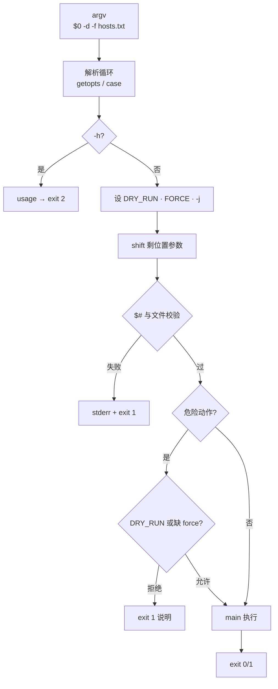
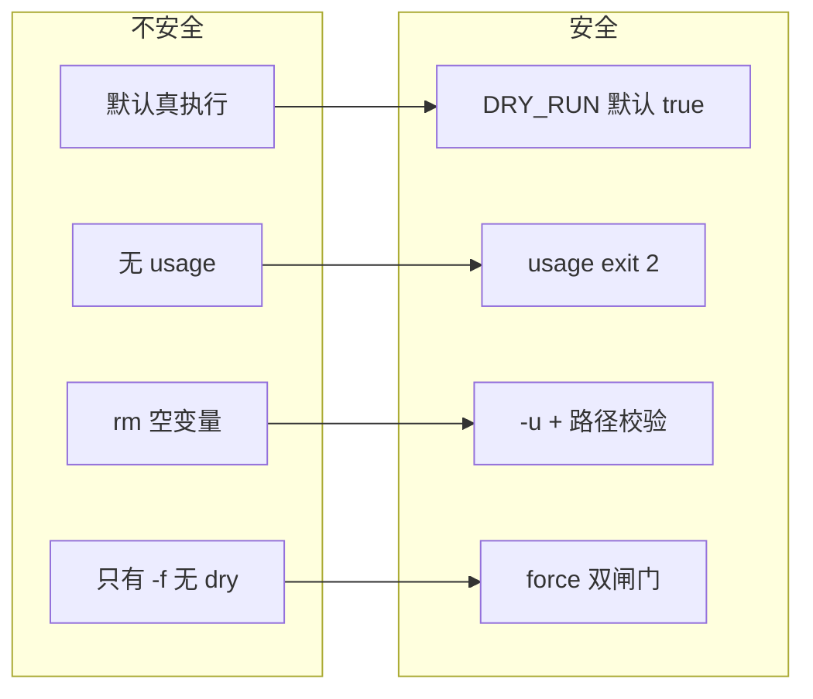
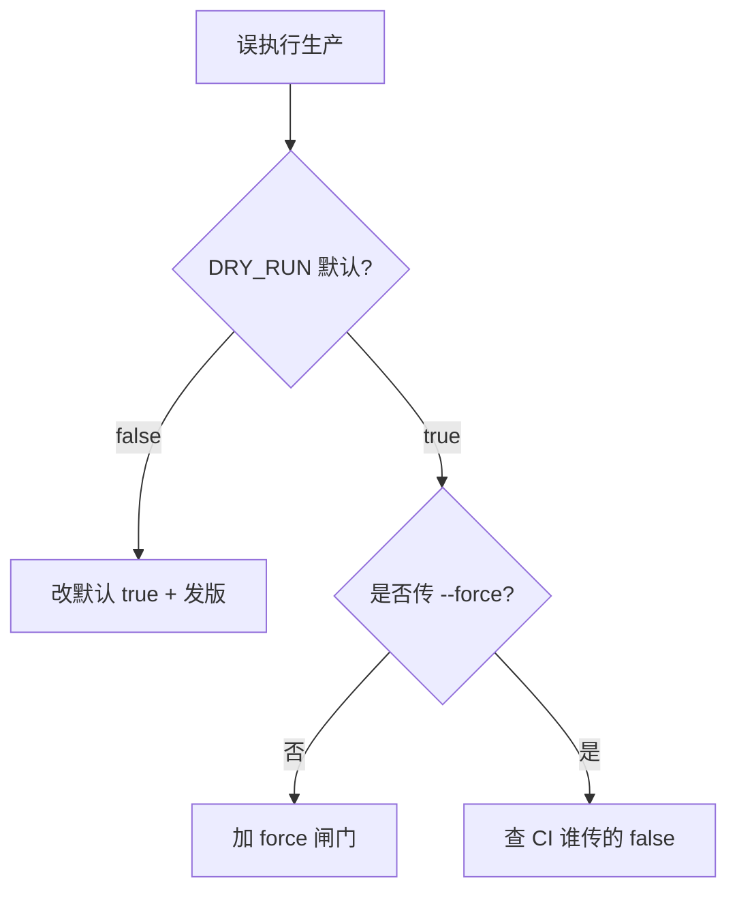

# 09｜参数解析与 dry-run

> 新人跑 `./purge-cache.sh --env prod` 没加 `--dry-run`，CDN 全量刷新把源站打穿；有人 `getopts` 只认 `-d` 不认 `--dry-run`，文档和脚本行为对不上；还有人 `rm -rf "$TARGET"/*` 在 `TARGET` 为空时删光根——群里喊「赶紧回滚」。
> **本章回答**：参数从 `argv` 进门到危险动作执行——解析、`usage`/`exit 2`、`DRY_RUN` 默认 true、`--force` 双闸门、`main` 真/假执行。
> **不讲**：三开关与 `trap` → [02](../02-脚本骨架与三开关/)；`failed[]` 批处理 → [02](../02-脚本骨架与三开关/)、[08](../08-并发与限流/)；复杂 CLI → Python `argparse`（[05-02-Python/06](../../02-Python/06-argparse与配置管理/)）。

**标记**：🎯重点 · 🔥难点 · ⭐常考 · 🔧实操

---

## 面试怎么考

| 标记 | 考点 |
|------|------|
| **核心** | `getopts` 只短选项；`usage` + `exit 2`；`DRY_RUN` 默认 true |
| **必会** | 危险操作双闸门：`DRY_RUN` + `--force`；位置参数在选项后；`OPTIND`/`shift` |
| **常用** | 环境变量覆盖；`--` 结束选项；`-h` 帮助 |
| **常考** | 为什么默认 dry-run；`getopts` 不认长选项；空变量 `rm` |

> 📝 **面试（30 秒）**：入口用 `case`（长短选项）或 `getopts`（仅短）。`usage` 打 stderr，`exit 2`。`DRY_RUN` 默认 **true**，真变更要显式关并常配 `--force`。危险 `rm`/reload 要：**非 dry-run 且 force**。位置参数在选项后，`shift` 完再校验 `$#`。

---

## 能力边界

| 维度 | Bash `getopts` | 手写 `case` 扫 argv | Python `argparse` |
|------|----------------|---------------------|-------------------|
| **适合** | 5～10 个短旗标 | 要 `--long-opt` | 子命令、互斥组、类型 |
| **不适合** | 复杂子命令树 | 选项组合爆炸 | 一行 kubectl 刀 |
| **长选项** | 需自己 `case` | 自然支持 | 内置 |

- 🔑 **四道闸各防什么**
  - `DRY_RUN=true` 默认 → 手滑真执行；**不防**故意 `DRY_RUN=false`
  - `--force` → 误确认；**不防**恶意 insider
  - `usage` + 校验 `$#` → 参数传错；**不防**传对但文件内容错
  - `-u` + 必填检查 → 空变量展开；**不防**逻辑 bug

> ⚠️ **别混**：闸门保证「**默认演练、显式危险**」——权限仍靠 RBAC / sudo；与三开关同一套 SRE 伦理（02）。

---

## 语言最小集

```bash
#!/usr/bin/env bash
set -euo pipefail

DRY_RUN=${DRY_RUN:-true}
FORCE=false

usage() {
  cat >&2 <<EOF
Usage: $0 [OPTIONS] hosts.txt
  -d, --dry-run   print only (default: on)
  -f, --force     allow destructive changes
  -h              help
EOF
  exit 2
}

parse_args() {
  while [[ $# -gt 0 ]]; do
    case $1 in
      -d|--dry-run)  DRY_RUN=true; shift ;;
      -f|--force)    FORCE=true; shift ;;
      -h|--help)     usage ;;
      --)            shift; break ;;
      -*)            echo "unknown: $1" >&2; usage ;;
      *)             break ;;
    esac
  done
  HOSTS_FILE=${1:-}; [[ -n "$HOSTS_FILE" ]] || usage
  [[ -f "$HOSTS_FILE" ]] || { echo "missing: $HOSTS_FILE" >&2; exit 1; }
  if [[ "$DRY_RUN" != true && "$FORCE" != true ]]; then
    echo "refusing: need --force for real run" >&2; exit 1
  fi
}
```

- 🧩 **四行钉子**
  - `DRY_RUN=${DRY_RUN:-true}` → 默认演练
  - `case` 统一长短选项 → 文档里的 `--dry-run` 真能用
  - `usage` → stderr + `exit 2`
  - 真跑校验 → `DRY_RUN=false` 还要 `--force`

最小集认完，上主图。

---

## 一、一张图：参数从 argv 到执行的一生

> 🎯 **一句话**：**argv → 解析 → 默认值 → 校验位置参数 → 危险闸门 → main 真/假执行 → exit 码**。



- 📖 **读图**
  - 🛤️ 解析阶段只改标志位，不碰生产；`usage` 是**正常**分支，码 **2** ≠ 业务失败 **1**
  - 🚪 位置参数在 `--` 或第一个非 `-` 之后；`main` 里危险步骤先打 `[DRY-RUN] would`，真跑还要 `FORCE`
  - 📋 审计日志记：**谁、什么参数、是否 dry-run**（Q1、Q14）

本节对应练习题 Q1、Q14。

---

## 二、出生：argv、`$0`、`$@`、`shift` ⭐

> 🎯 **一句话**：参数是**字符串数组**——`$0` 脚本名，`$1..$n` 位置参数，`shift` 吃掉已解析选项。

### 📬 核心符号

```bash
#!/usr/bin/env bash
echo "argc=$# argv=$*"
# ./deploy.sh -d hosts.txt
# argc=2 argv=-d hosts.txt

shift                 # 吃掉 -d
echo "now $1"         # hosts.txt
```

- 🔑 **符号钉死**
  - `$#` → 个数；`"$1"` → 第 1 个（永远加引号）
  - `"$@"` → 全部、每个独立单词；透传唯一正解
  - `$*` → IFS 合成一串；**几乎不用**
  - `$0` → 脚本路径/名；写 usage 用
  - `shift n` → 左移 n 个；吃完选项才剩 hosts 文件

> ⚠️ **别混**：未加引号的 `$*` / `$@` 会拆词——`main "$@"`、透传统一 **`"$@"`**（见 [05](../05-函数与作用域/)）。

> ⭐ **常考**：`getopts` 吃完后 `shift $((OPTIND-1))` 把位置参数对齐——口述高频。

> 🔍 **现场**：

```bash
bash -x ./script.sh --dry-run prod-hosts.txt
# ← 看哪一步 shift 后 $1 变成 hosts 文件
```

本节对应练习题 Q3、Q9、Q10。

---

## 三、解析：`getopts` 与长选项 🎯⭐🔥

> 🎯 **一句话**：`getopts` 只处理 **`-` 单字母**；`--dry-run` 要 **`while case` 手写**（或先扫长选项再 `getopts`）。

### 🔤 纯 `getopts`

```bash
DRY_RUN=true
FORCE=false
PARALLEL=10

while getopts ':dfhj:' opt; do
  case $opt in
    d) DRY_RUN=true ;;
    f) FORCE=true ;;
    j) PARALLEL=$OPTARG ;;
    h) usage ;;
    :) echo "option -$OPTARG needs arg" >&2; usage ;;
    \?) echo "unknown -$OPTARG" >&2; usage ;;
  esac
done
shift $((OPTIND - 1))
```

- 🔑 **三件套**
  - 选项串前导 `:` → 缺参时 `opt=:`，`OPTARG` 是缺参的字母
  - `OPTIND` → 下一个待处理参数下标
  - `shift $((OPTIND-1))` → 把位置参数留给 hosts 文件

#### ❓ 为什么 `getopts` 不认 `--dry-run`？

- 📜 **POSIX 设计**：`getopts` 只吃**单字符**短选项；长选项不是它的活
- ✅ **生产做法**：统一手写 `case $1 in -d|--dry-run)`；或短用 `getopts`、长选项先扫一遍
- ❌ **别静默忽略**：未知 `--foo` 必须报错进 `usage`，别当位置参数吞掉

> 📝 **面试**：`getopts` 不认长选项；生产长短统一 `case`，或短 `getopts` + 长 `case`。⭐

### 🛠️ 推荐：case 统一长短选项

```bash
parse_args() {
  DRY_RUN=${DRY_RUN:-true}
  FORCE=false
  PARALLEL=10
  while [[ $# -gt 0 ]]; do
    case $1 in
      -d|--dry-run)  DRY_RUN=true; shift ;;
      -n|--no-dry-run|--execute)
        DRY_RUN=false; shift ;;
      -f|--force)    FORCE=true; shift ;;
      -j|--jobs)
        PARALLEL=$2; shift 2 ;;
      -h|--help)     usage ;;
      --)            shift; break ;;
      -?*)           echo "bad opt $1" >&2; usage ;;
      *)             break ;;
    esac
  done
  REST=("$@")
}
```

- 📖 **读图**：`--` 之后全部当位置参数——防止形如 `host-name` 被当选项（少见但规范）

> 💡 **打个比方**：`getopts` 像只认**简写工牌**的门禁；`--dry-run` 是全名，要前台 `case` 人工核对。

本节对应练习题 Q2、Q11、Q13。

---

## 四、默认值：`DRY_RUN` 与双闸门 🔥⭐

> 🎯 **一句话**：**默认演练（dry-run true）**；真执行要显式关 dry-run，危险动作还要 **`--force`**。

🔥 开篇 CDN 打穿的保险丝。口诀：**默认安全、显式危险**。

### 🧱 分层闸门

```bash
DRY_RUN=${DRY_RUN:-true}    # 环境可覆盖，默认 true

require_real_run() {
  if [[ "$DRY_RUN" == true ]]; then
    log "[DRY-RUN] skipped real action: $*"
    return 0
  fi
  if [[ "$FORCE" != true ]]; then
    log "ERROR: need --force for destructive ops" >&2
    exit 1
  fi
}

purge_cdn() {
  require_real_run purge
  api_call DELETE "/cache/*"
}
```

```text
默认          → 只打印 would
DRY_RUN=false → 仍可能被 FORCE 挡
false + force → 真执行
```

#### ❓ 为什么默认 dry-run，而不是默认真跑？

- 🛡️ **防手滑**：拷贝脚本、CI 误触、文档漏写参数——默认演练代价最低
- 📋 **变更流程**：先演练后执行；真跑要变更单 + 显式旗标
- ❌ **默认真跑**：新人第一次跑就打生产——开头那个 CDN 现场

#### ❓ 为什么 `DRY_RUN=false` 还不够，还要 `--force`？

- 🎚️ **两层独立**：`DRY_RUN` 管全局「只打印」；`FORCE` 管「允许危险真执行」
- 👻 **只关 dry-run**：环境变量泄漏、CI 全局 `DRY_RUN=false`、拷贝错命令——仍可能误删
- ✅ **双闸**：要故意两次——关演练 + 显式 force；策略可简化，但面试要能讲清「为什么推荐双闸」

> ⚠️ **别混**：`DRY_RUN=false` **单独**不够——还要 `FORCE`、hosts 校验、变更单（平台层）。

### 📐 优先级约定

```bash
# 解析前：环境给默认
DRY_RUN=${DRY_RUN:-true}
# 解析中：-d 显式 true，--execute 显式 false
# 推荐：命令行 > 环境 > 默认 true（写进 -h）
```

```bash
# 演练（默认）
./purge.sh hosts.txt

# 真执行
DRY_RUN=false ./purge.sh --force hosts.txt
```

> ⭐ **常考**：「为什么默认 dry-run？」——防手滑、防 CI 误触、先演练后执行。

本节对应练习题 Q1、Q5、Q6。

---

## 五、usage 与退出码 ⭐

> 🎯 **一句话**：**`usage` → stderr + `exit 2`**（用法错误）；业务/校验失败 **`exit 1`**；成功 **`exit 0`**。

```bash
usage() {
  cat >&2 <<'EOF'
Usage: ...
EOF
  exit 2
}
```

| 码 | 含义 | CI / 包装脚本 |
|----|------|---------------|
| 0 | 成功 | 绿 |
| 1 | 业务失败 | 红（可能要回滚） |
| 2 | 用法错误 | 红（改参数，别回滚） |

#### ❓ 为什么 usage 要 `exit 2` 而不是 `exit 1`？

- 🏷️ **定责**：2 =「你不会用 / 参数错」；1 =「用对了但部署失败」
- 🤖 **Jenkins 只认 0/非 0**，但包装脚本 / SRE 平台可用 2 提示「改参数」而非「回滚」
- 📢 **stderr**：`usage` 打 stderr，避免污染 stdout 管道

> 📝 **面试**：`exit 2` 区分『你不会用』和『用对了但部署失败』。⭐

### ✅ 位置参数与危险路径

```bash
HOSTS=${1:-}
[[ -n "$HOSTS" ]] || usage
[[ -f "$HOSTS" ]] || { echo "not a file: $HOSTS" >&2; exit 1; }
[[ -s "$HOSTS" ]] || { echo "empty hosts file" >&2; exit 1; }
```

```bash
# 危险路径再加
[[ "$TARGET" == /* ]] || { echo "refuse relative TARGET"; exit 1; }
[[ "$TARGET" != "/" ]] || { echo "refuse /"; exit 1; }
```

> ⭐ **常考**：危险路径校验——绝对路径、非 `/`、`${dir:?}` 防空——口述顺序不能颠倒。

本节对应练习题 Q4。

---

## 六、执行：`main` 里每个动作认闸门 🔥

> 🎯 **一句话**：解析只设标志；**每个** `rm`/`reload`/`kubectl delete` 在函数里检查 `DRY_RUN` 并打日志。

🔥 空变量 `rm -rf "$TARGET"/*` 能删光根——闸门不只看旗标，还要参数非空。

```bash
log() { printf '[%s] %s\n' "$(date '+%F %T')" "$*" >&2; }

reload_nginx() {
  local host=$1
  if [[ "$DRY_RUN" == true ]]; then
    log "[DRY-RUN] $host: nginx -t && systemctl reload nginx"
    return 0
  fi
  ssh -n "$host" 'nginx -t && systemctl reload nginx'
}

main() {
  parse_args "$@"
  log "start user=$(whoami) dry_run=$DRY_RUN force=$FORCE hosts=$HOSTS_FILE"
  while read -r h; do
    [[ -z "$h" || "$h" =~ ^# ]] && continue
    reload_nginx "$h" || failed+=("$h")
  done <"$HOSTS_FILE"
  ((${#failed[@]})) && exit 1
}
```

#### ❓ 为什么解析完还要在每个危险函数里再查一遍 `DRY_RUN`？

- 🚪 **入口闸**拦「整脚本真跑」；**函数闸**拦「漏改某个危险步骤」
- 👻 **只在 `parse_args` 设标志、main 里裸 `rm`**：后人加函数容易忘看旗标
- ✅ **口诀**：危险动作进函数，函数第一句认 `DRY_RUN`（要 force 再认 `FORCE`）

### 🛡️ 空变量 `rm` 防护

```bash
safe_clean() {
  local dir=$1
  [[ -n "$dir" ]] || { echo "empty dir"; exit 1; }
  [[ "$dir" == /* ]] || { echo "must be absolute"; exit 1; }
  [[ "$dir" != "/" ]] || { echo "refuse /"; exit 1; }
  if [[ "$DRY_RUN" == true ]]; then
    log "[DRY-RUN] would rm -rf ${dir:?}/*"
    return 0
  fi
  [[ "$FORCE" == true ]] || { echo "need --force"; exit 1; }
  rm -rf "${dir:?}"/*
}
```

- 🔑 **`${dir:?}`**：空则直接报错退出——配 `set -u`，防 `rm -rf /*`

> 🔍 **现场**：

```bash
bash -x ./script.sh -d hosts.txt 2>&1 | grep DRY-RUN
# ← 每个危险步骤都应出现 would / skipped
```

本节对应练习题 Q7、Q8、Q12。

---

## 七、收束：参数生命周期凭什么「安全」

> 🎯 **一句话**：安全 = **默认演练 + 可解析长选项 + 用法码 2 + 双闸 + 路径校验 + 审计日志**。



- 📖 **读图**
  - 左列四类事故 → 右列四类对策；是**映射**，不是「多写几行漂亮代码」
  - ⚠️ 右列**不替代**权限控制——脚本仍靠 RBAC、sudo、K8s RBAC

**可背清单（八条）**：

1. `parse_args` + `main "$@"`，不在全局裸解析
2. 长短选项 `case`；`getopts` 仅短选项
3. `DRY_RUN` 默认 true；文档写真跑命令
4. 危险操作要 `--force`（推荐）
5. `usage` stderr，`exit 2`
6. 位置参数：`shift` 后校验 `$#`、文件存在非空
7. 日志打 dry_run / force / user / 目标文件
8. `-j` / `PARALLEL` 与 08 章并发对齐

> 📝 **面试**：八条按「解析 / 默认 / 闸门 / 交卷」四组背；前四条够应付追问。⭐

本节对应练习题 Q14。

---

## 八、作战：「一跑就真删了」与「参数不认」🔧

> 🎯 **一句话**：先看 `-h` 默认与示例，再 `bash -x` 看 `DRY_RUN`——别先怪运维没看文档。

| 现象 | 先做 | 别做 |
|------|------|------|
| 没 dry-run 就执行 | `grep DRY_RUN` 默认值 | 怪运维没看文档 |
| `--dry-run` 无效 | 是否只实现了 `-d` | 静默忽略未知长选项 |
| `unknown option` | 补 `case --dry-run)` | 让用户改 `-d` 了事 |
| `rm` 删错 | `set -u`、路径前缀、`${d:?}` | 靠 `--force` 当唯一闸 |
| CI 参数错 | 看 exit 2 vs 1 | 全当部署失败回滚 |

### 60 秒剧本 🔧

> 🔍 **现场**：接到「脚本误删 / 参数不认」，60 秒走完再改生产。

```text
① 0–10s   ./script.sh -h → 默认与示例
② 10–30s  bash -x ./script.sh -d hosts.txt → 看 DRY_RUN
③ 30–45s  故意 ./script.sh 无参 → 应为 exit 2
④ 45–60s  真跑前：变更单 + DRY_RUN=false --force 双确认
```



- 📖 **读图**：先查默认，再查 force，最后查「谁在 CI 里关了 dry-run」——别一上来改业务逻辑

本节对应练习题 Q1、Q8、Q11。

---

## 生产模板

### 模板 1：标准 parse + dry-run + force

```bash
#!/usr/bin/env bash
set -euo pipefail

DRY_RUN=${DRY_RUN:-true}
FORCE=false
PARALLEL="${PARALLEL:-10}"
HOSTS_FILE=""

usage() {
  cat >&2 <<EOF
Usage: $0 [OPTIONS] hosts.txt

  -d, --dry-run     simulate (default: ${DRY_RUN})
  -n, --execute     alias for DRY_RUN=false
  -f, --force       allow real destructive changes
  -j, --jobs N      parallelism (default: $PARALLEL)
  -h, --help        show help

Examples:
  $0 hosts.txt                    # dry-run
  DRY_RUN=false $0 -f hosts.txt   # real run
EOF
  exit 2
}

parse_args() {
  while [[ $# -gt 0 ]]; do
    case $1 in
      -d|--dry-run)     DRY_RUN=true; shift ;;
      -n|--execute)     DRY_RUN=false; shift ;;
      -f|--force)       FORCE=true; shift ;;
      -j|--jobs)        PARALLEL=$2; shift 2 ;;
      -h|--help)        usage ;;
      --)               shift; break ;;
      -?*)              echo "unknown: $1" >&2; usage ;;
      *)                break ;;
    esac
  done
  HOSTS_FILE=${1:-}
  [[ -n "$HOSTS_FILE" ]] || usage
  [[ -f "$HOSTS_FILE" && -s "$HOSTS_FILE" ]] || {
    echo "hosts file missing or empty: $HOSTS_FILE" >&2; exit 1; }
  if [[ "$DRY_RUN" != true && "$FORCE" != true ]]; then
    echo "refusing real run without --force" >&2
    exit 1
  fi
}

log() { printf '[%s] %s\n' "$(date '+%F %T')" "$*" >&2; }

deploy_host() {
  local h=$1
  if [[ "$DRY_RUN" == true ]]; then
    log "[DRY-RUN] would reload nginx on $h"
    return 0
  fi
  ssh -n "$h" 'nginx -t && systemctl reload nginx'
}

main() {
  parse_args "$@"
  log "user=$(whoami) dry_run=$DRY_RUN force=$FORCE parallel=$PARALLEL file=$HOSTS_FILE"
  local failed=()
  while read -r h; do
    [[ -z "$h" || "$h" =~ ^# ]] && continue
    deploy_host "$h" || failed+=("$h")
  done <"$HOSTS_FILE"
  if ((${#failed[@]} > 0)); then
    log "failed: ${failed[*]}"
    exit 1
  fi
}

main "$@"
```

### 模板 2：纯 `getopts`（仅短选项）

```bash
#!/usr/bin/env bash
set -euo pipefail

DRY_RUN=${DRY_RUN:-true}
FORCE=false

usage() { echo "Usage: $0 [-d] [-f] hosts.txt" >&2; exit 2; }

OPTIND=1
while getopts ':dfh' opt; do
  case $opt in
    d) DRY_RUN=true ;;
    f) FORCE=true; DRY_RUN=false ;;
    h) usage ;;
    \?) echo "bad -$OPTARG" >&2; exit 2 ;;
  esac
done
shift $((OPTIND - 1))
[[ $# -eq 1 ]] || usage
```

### 模板 3：危险 `rm` 防护

```bash
safe_clean() {
  local dir=$1
  [[ -n "$dir" ]] || { echo "empty dir"; exit 1; }
  [[ "$dir" == /* ]] || { echo "must be absolute"; exit 1; }
  [[ "$dir" != "/" ]] || { echo "refuse /"; exit 1; }
  if [[ "$DRY_RUN" == true ]]; then
    log "[DRY-RUN] would rm -rf ${dir:?}/*"
    return 0
  fi
  [[ "$FORCE" == true ]] || { echo "need --force"; exit 1; }
  rm -rf "${dir:?}"/*
}
```

### 模板 4：子命令雏形（delete | list）

```bash
cmd=${1:-}
shift || usage
case $cmd in
  list)   cmd_list "$@" ;;
  delete) cmd_delete "$@" ;;
  *)      usage ;;
esac
```

- 📌 子命令多了换 Python `argparse`，别无限加长 `case`

本节对应练习题 Q5、Q12。

---

## 踩坑清单

| 现象 | 原因 | 修法 |
|------|------|------|
| `--dry-run` 无效 | 只实现了 `-d` | `case --dry-run)` |
| 默认真执行 | `DRY_RUN=false` 写死 | `${DRY_RUN:-true}` |
| 无参仍跑 | 未 `usage` | 校验 `$#` |
| `rm -rf /*` | 空变量 | `${var:?}`、绝对路径 |
| 帮助打 stdout | 污染管道 | `usage` → stderr |
| `--` 后失败 | 未处理 `--` | `case --)` shift |
| `-j` 无参 | getopts 缺 `:` | `:` 前缀 + `usage` |
| 环境/CLI 优先级不明 | 无文档 | `-h` 写优先级 |

---

## 必会 · 常考

| 说法 | 对错 | 口径 |
|------|:----:|------|
| `getopts` 支持 `--long` | 错 | 手写 case |
| `DRY_RUN` 应默认 false | 错 | 默认 true |
| `usage` 应 exit 0 | 错 | 用法错 exit 2 |
| 有 `--force` 就不用 dry-run | 错 | 常双闸 |
| `$*` 等同 `"$@"` | 错 | `"$@"` 保空格 |
| `OPTIND` 不用 shift | 错 | `shift $((OPTIND-1))` |
| 解析完再校验文件 | 对 | 先选项后位置参数 |
| `-u` 能防 rm 空路径 | 部分 | 还要 `${d:?}` |
| CI 传错参 exit 1 | 可能 | 应 exit 2 更易定责 |
| 10+ 子命令还 bash | 慎用 | 换 Python |

---

## 收口

### 命令速查 🔧

```bash
./script.sh -h
bash -x ./script.sh --dry-run hosts.txt
DRY_RUN=false ./script.sh --force hosts.txt
./script.sh; echo $?          # 无参应为 2
```

### 面试锚点

遮住右列自问自答，卡壳的行回去重读对应小节。

| 问 | 30 秒答 |
|----|---------|
| 为什么默认 dry-run？ | 防手滑；真执行显式 false + force |
| `getopts` 局限？ | 只短选项；长选项 case 手写 |
| `usage` 为何 exit 2？ | 区分用法错与业务失败 |
| `shift $((OPTIND-1))`？ | 把位置参数留给文件 |
| 危险 rm 怎么防？ | `-u`、`${d:?}`、绝对路径、dry-run、force |

### 易错一句话对照

- `getopts` 支持 `--dry-run` → 只认短选项；长选项用手写 `case`
- `DRY_RUN` 默认 false → 默认 true；真跑显式关
- `usage` 打 stdout / exit 0 → stderr + `exit 2`
- 有 `--force` 就不用 dry-run → 双闸：演练默认 + force 才真删
- `$*` 和 `"$@"` 一样 → `"$@"` 保空格；透传只用它
- `getopts` 完不用 shift → 必须 `shift $((OPTIND-1))`
- `-u`  alone 防 `rm /*` → 还要 `${d:?}`、绝对路径、非 `/`
- 未知长选项当位置参数 → 必须报错进 `usage`
- 只在入口设 `DRY_RUN`、函数里裸 `rm` → 每个危险函数再认一遍闸门
- 参数安全 = 权限安全 → 不替代 RBAC / sudo

### 数字墙

> exit **2** = usage；**1** = 业务失败；**0** = 成功。`DRY_RUN` 默认 **true**。并发 `-j` 常见默认 **10**（见 08）。

---

## 合上书

- [ ] **默画**参数一生：argv → 解析 → 默认 → 校验 → 闸门 → main → exit（Q1、Q14）
- [ ] `getopts` 和 `case --dry-run)` 怎么配合？（Q2）
- [ ] `DRY_RUN` 默认 true 时，真执行要满足哪几个条件？（Q1、Q5）
- [ ] `usage` 为什么走 stderr、`exit 2`？（Q4）
- [ ] `shift $((OPTIND-1))` 在纯 getopts 流程里何时调用？（Q3）
- [ ] `${dir:?}` 和 `set -u` 如何一起防 `rm -rf /*`？（Q8）
- [ ] 命令行与环境变量谁覆盖谁？`-h` 怎么写？（Q6）
- [ ] 什么情况下该放弃 bash 参数解析换 Python？（Q14）

八题能口述，参数与 dry-run 过关。下一章 [10 SSH 批量与远程执行](../10-SSH批量与远程执行/) 把参数和并发接到真实 ssh。
