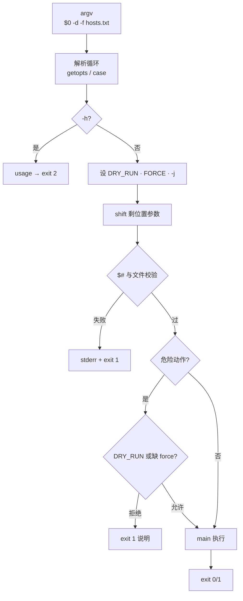
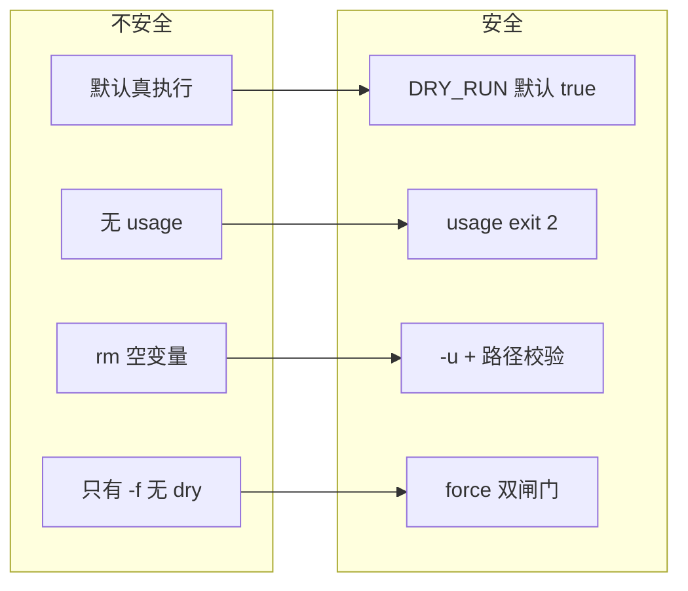
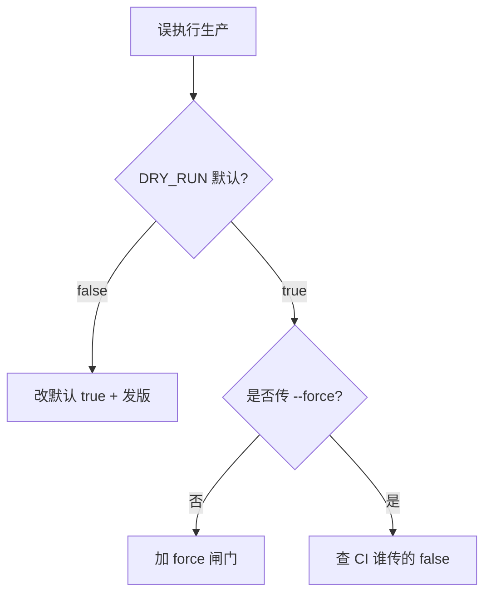

# 09｜参数解析与 dry-run · SRE 开发能力

> 大家好，欢迎来到这次分享。开讲之前，先带大家回到一个很多值班同学都踩过的现场：
> 新人跑 `./purge-cache.sh --env prod` 没加 `--dry-run`，CDN 全量刷新把源站打穿；有人 `getopts` 只认 `-d` 不认 `--dry-run`，运维文档和脚本行为不一致；还有人 `rm -rf "$TARGET"/*` 在 `TARGET` 为空时删光根——群里已经有人在喊「赶紧回滚」。
> 这一章讲完，你会知道当时那几个人各自错在哪——**不是不会写 `if`，是参数从 argv 进脚本到真正执行危险动作之间没有闸门**。
> **本章回答的问题**：一个脚本**参数**从 `argv`/`getopts` 解析、`-h`/`usage` 退出、**`--dry-run` 默认真**、危险操作要 **`--force`/`--yes` 显式确认**到 `main` 执行——以及为什么 `usage` 应 `exit 2`。
> **本章不讲**：三开关与 `trap` → [02](../02-脚本骨架与三开关/)；`failed[]` 批处理 → [02](../02-脚本骨架与三开关/)、[08](../08-并发与限流/)；复杂 CLI 框架 → 用 Python `argparse`（[05-02-Python/06-argparse](../../02-Python/06-argparse与配置管理/)）。

**标记**：🎯重点 · 🔥难点 · ⭐常考 · 🔧实操

**怎么听这场分享**：先把「参数进门到危险闸门」主图装进脑子——解析 → usage → DRY_RUN 默认 true → force 确认 → main；放慢双重闸门和空变量 `rm`；作战节回到开头那个 CDN 打穿现场。每一节讲完会提示对应练习题，趁热打铁。

## 面试怎么考

| 标记 | 考点 |
|------|------|
| **核心** | `getopts` 解析 `-d`/`--` 需手写；`usage` + `exit 2`；`DRY_RUN` 默认 true |
| **必会** | 危险操作双重闸门：`DRY_RUN` + `--force`；位置参数在选项后；`-:` 与 `OPTARG` |
| **常用** | 环境变量覆盖 `DRY_RUN=false`；`--` 结束选项；`-h`/`-?` 帮助 |
| **常考** | 为什么默认 dry-run；`getopts` 不认长选项；空变量 `rm -rf "$d"/*` |

**30 秒怎么说**：生产脚本入口用 `getopts` 或手写循环解析 `-d`/`--dry-run`、`-f`/`--force`、`-h`。`usage` 打 stderr，`exit 2` 表示用法错误。`DRY_RUN` 默认 **true**，真变更要 `DRY_RUN=false` 或 `--force`。危险 `rm`/reload/删库路径要：**非 dry-run 且显式 force** 才执行。位置参数（hosts 文件）放在选项之后，`shift` 吃完再校验 `$#`。

---

## 能力边界

| 维度 | Bash `getopts` | 手写 `case` 扫 argv | Python `argparse` |
|------|----------------|---------------------|-------------------|
| **适合** | 运维脚本 5～10 个旗标 | 要 `--long-opt` | 子命令、互斥组、类型检查 |
| **不适合** | 复杂子命令树 | 选项组合爆炸 | 一行 kubectl 刀 |
| **长选项** | 需自己 `case $1 in --dry-run)` | 自然支持 | 内置 |
| **默认值** | 靠变量初始化 | 靠变量初始化 | `default=` |

| 闸门 | 防什么 | 不防什么 |
|------|--------|----------|
| `DRY_RUN=true` 默认 | 手滑真执行 | 故意 `DRY_RUN=false` |
| `--force` | 误确认 | 恶意 insider |
| `usage` + 校验 `$#` | 参数传错 | 传对但文件内容错 |
| `-u` + 必填检查 | 空变量展开 | 逻辑 bug |

> 🎯 **默认安全、显式危险**——与「失败就停」的三开关是同一套 SRE 伦理。

---

好，边界清楚了。咱们先把主图装进脑子——后面每一节都是这张图上的一段。

## 语言最小集

```bash
#!/usr/bin/env bash
set -euo pipefail

DRY_RUN=true
FORCE=false

usage() {
  cat >&2 <<EOF
Usage: $0 [OPTIONS] hosts.txt

Options:
  -d, --dry-run   print actions only (default: on)
  -f, --force     execute destructive changes (required with -d off)
  -h              show help
  -j N            parallelism (default: 10)

Environment:
  DRY_RUN=false   override dry-run
EOF
  exit 2
}

# 长选项 + getopts 混合（常见模式）
parse_args() {
  while [[ $# -gt 0 ]]; do
    case $1 in
      -d|--dry-run)  DRY_RUN=true; shift ;;
      -f|--force)    FORCE=true; shift ;;
      -h|--help)     usage ;;
      -j)            PARALLEL=$2; shift 2 ;;
      --)            shift; break ;;
      -*)            echo "unknown option: $1" >&2; usage ;;
      *)             break ;;
    esac
  done
  HOSTS_FILE=${1:-}; [[ -n "$HOSTS_FILE" ]] || usage
  [[ -f "$HOSTS_FILE" ]] || { echo "missing: $HOSTS_FILE" >&2; exit 1; }
  DRY_RUN=${DRY_RUN:-true}
  if [[ "$DRY_RUN" != true && "$FORCE" != true ]]; then
    echo "refusing: set --force or DRY_RUN=false with care" >&2
    exit 1
  fi
}
```

---

## 一、一张图：一个脚本参数从 argv 到执行的一生

> 🎯 **一句话**：**argv 进壳 → getopts/case 解析 → 默认值（DRY_RUN=true）→ 校验位置参数 → 危险闸门（force）→ main 真/假执行 → exit 码**。



**读图**：从左跟 `$@`——解析阶段只改标志位，不碰生产；`usage` 是**正常**分支，用退出码 **2** 与业务失败 **1** 区分。位置参数在 `--` 或第一个非 `-` 参数后；`main` 里每个危险步骤先看 `DRY_RUN` 打印「would」，真执行还要 `FORCE`（若策略要求）。审计日志应记录：**谁、什么参数、是否 dry-run**。

---

本节对应练习题 Q1、Q14。

好，主图装进脑子了。咱们继续往下走——大家想想：为什么生产脚本默认应该是 dry-run，而不是「默认真跑」？

## 二、出生：argv、`$0`、`$@`、`shift`

> 🎯 **一句话**：参数是**字符串数组**——`$0` 是脚本名，`$1..$n` 是位置参数，`shift` 吃掉已解析的选项。

```bash
#!/usr/bin/env bash
echo "argc=$# argv=$*"
# ./deploy.sh -d hosts.txt
# argc=2 argv=-d hosts.txt

shift    # 吃掉 -d
echo "now $1"    # hosts.txt
```

核心变量：`$#` 参数个数；`$@` / `$*` 全部参数（`"$@"` 保留空格）；`$0` 脚本路径/名；`shift n` 左移 n 个。

> ⚠️ **别混**：`$*` 在未加引号时会拆词——`usage` 和 `main "$@"` 统一用 **`"$@"`**。

> ⭐ **常考**：「`shift` 和 `OPTIND` 的关系」——`getopts` 吃完选项后 `shift $((OPTIND-1))` 把位置参数对齐，面试口述高频。

> 🔍 **现场**：

```bash
bash -x ./script.sh --dry-run prod-hosts.txt    # 看 shift 后剩什么
```

---

本节对应练习题 Q3、Q9、Q10。

## 三、解析：`getopts` 与长选项

> 🎯 **一句话**：`getopts` 只处理 **`-` 单字母**；`--dry-run` 要 **`while case` 手写**或先扫长选项再 `getopts`。

### 纯 `getopts`

```bash
DRY_RUN=true
FORCE=false
PARALLEL=10

while getopts ':dfhj:' opt; do
  case $opt in
    d) DRY_RUN=true ;;
    f) FORCE=true ;;
    j) PARALLEL=$OPTARG ;;
    h) usage ;;
    :) echo "option -$OPTARG needs arg" >&2; usage ;;
    \?) echo "unknown -$OPTARG" >&2; usage ;;
  esac
done
shift $((OPTIND - 1))
```

关键细节：`:` 在选项串前表示缺参时 `:` 进 `opt`（`OPTARG` 是字母）；`OPTIND` 指向下一个待处理参数下标；`shift $((OPTIND-1))` 把位置参数留给 hosts 文件。

> 📝 **面试**：「`getopts` 不认 `--dry-run`；生产脚本长选项用 `case $1 in --dry-run)`，短选项用 `getopts`，或统一手写 case。」

> 🔥 **难点**：`getopts` 的 `:` 前缀、`OPTIND`、`OPTARG` 三者配合——缺参进 `:` 分支还是 `?` 分支，面试白板常考。

### 推荐：case 统一长短选项

```bash
parse_args() {
  DRY_RUN=${DRY_RUN:-true}
  FORCE=false
  PARALLEL=10
  while [[ $# -gt 0 ]]; do
    case $1 in
      -d|--dry-run)  DRY_RUN=true; shift ;;
      -n|--no-dry-run|--execute)
        DRY_RUN=false; shift ;;
      -f|--force)    FORCE=true; shift ;;
      -j|--jobs)
        PARALLEL=$2; shift 2 ;;
      -h|--help)     usage ;;
      --)            shift; break ;;
      -?*)           echo "bad opt $1" >&2; usage ;;
      *)             break ;;
    esac
  done
  REST=("$@")
}
```

`--` 之后全部当位置参数——防止 `host-name` 被当选项（少见但规范）。

> 💡 **打个比方**：`getopts` 像只认**简写工牌**的门禁；`--dry-run` 是全名，要前台 `case` 人工核对。

---

本节对应练习题 Q2、Q11、Q13。

## 四、默认值：`DRY_RUN` 与危险操作默认 false

🔥 这是开头 CDN 打穿的保险丝。⭐ 面试必考口诀：**默认安全、显式危险**——`DRY_RUN=true` 默认，真变更要显式关；危险动作还要 `--force`。

> 🎯 **一句话**：**默认演练（dry-run true）**；真执行要 **环境变量 + 旗标** 双重显式，危险动作还要 **`--force`**。

### 分层闸门

```bash
DRY_RUN=${DRY_RUN:-true}    # 环境可覆盖，但默认 true

require_real_run() {
  if [[ "$DRY_RUN" == true ]]; then
    log "[DRY-RUN] skipped real action: $*"
    return 0
  fi
  if [[ "$FORCE" != true ]]; then
    log "ERROR: need --force for destructive ops" >&2
    exit 1
  fi
}

purge_cdn() {
  require_real_run purge
  api_call DELETE "/cache/*"
}
```

层级关系：默认只打印 would；`DRY_RUN=false` 仍可能被 `require_real_run` 挡；`DRY_RUN=false --force` 才真执行。

> ⭐ **常考**：「为什么默认 dry-run？」——防手滑、防 CI 误触、符合变更流程「先演练后执行」。

```bash
# 文档写清
# 演练（默认）
./purge.sh -d hosts.txt

# 真执行
DRY_RUN=false ./purge.sh --force hosts.txt
```

> ⚠️ **别混**：`DRY_RUN=false` **单独**不够安全——还要 `FORCE`、hosts 文件校验、变更单号（平台层）。

> 🔥 **难点**：双闸门策略的层级关系——`DRY_RUN` 管全局「只打印」，`FORCE` 管单步「允许真执行」；两者独立但联动，CI 和手动执行的行为可能不同。

### 环境变量优先级（约定）

```bash
# 解析前：环境给默认
DRY_RUN=${DRY_RUN:-true}
# 解析中：-d 显式 true，--execute 显式 false
# 解析后：命令行覆盖环境（看团队约定，要文档化）
```

推荐：**命令行 > 环境 > 默认 true**，并在 `-h` 里写清楚。

---

本节对应练习题 Q1、Q5、Q6。

## 五、usage 与退出码

> 🎯 **一句话**：**`usage` → stderr + `exit 2`**（用法错误）；业务/校验失败 **`exit 1`**；成功 **`exit 0`**。

```bash
usage() {
  sed -n '2,/^EOF$/p' "$0" | head -n -1 >&2    # 不推荐——用 heredoc
  exit 2
}

usage() {
  cat >&2 <<'EOF'
Usage: ...
EOF
  exit 2
}
```

| 码 | 含义 | CI 处理 |
|----|------|---------|
| 0 | 成功 | 绿 |
| 1 | 业务失败 | 红 |
| 2 | 用法错误 | 红（参数问题） |

> 📝 **面试**：「`exit 2` 让调用方区分『你不会用』和『用对了但部署失败』。」

> 🔥 **难点**：退出码 2 与 1 的 CI 处理差异——Jenkins 只认 0/非 0，但包装脚本可用 2 提示「改参数」而非「回滚」。

> ⭐ **常考**：危险路径校验三步——绝对路径、非 `/`、`${dir:?}` 防空变量——口述顺序不能颠倒。

### 位置参数校验

```bash
HOSTS=${1:-}
[[ -n "$HOSTS" ]] || usage
[[ -f "$HOSTS" ]] || { echo "not a file: $HOSTS" >&2; exit 1; }
[[ -s "$HOSTS" ]] || { echo "empty hosts file" >&2; exit 1; }
```

**危险路径**再加：

```bash
[[ "$TARGET" == /* ]] || { echo "refuse relative TARGET"; exit 1; }
[[ "$TARGET" != "/" ]] || { echo "refuse /"; exit 1; }
```

---

本节对应练习题 Q4。

## 六、执行：`main` 里每个动作认闸门

🔥 空变量 `rm -rf "$TARGET"/*` 能删光根——闸门不只看旗标，还要校验参数非空。

> 🎯 **一句话**：解析阶段只设标志；**每个** `rm`/`reload`/`kubectl delete` 在函数里检查 `DRY_RUN` 并打日志。

```bash
log() { printf '[%s] %s\n' "$(date '+%F %T')" "$*" >&2; }

reload_nginx() {
  local host=$1
  if [[ "$DRY_RUN" == true ]]; then
    log "[DRY-RUN] $host: nginx -t && systemctl reload nginx"
    return 0
  fi
  ssh -n "$host" 'nginx -t && systemctl reload nginx'
}

main() {
  parse_args "$@"
  while read -r h; do
    [[ -z "$h" || "$h" =~ ^# ]] && continue
    reload_nginx "$h" || failed+=("$h")
  done <"$HOSTS_FILE"
  ((${#failed[@]})) && exit 1
}
```

审计友好：

```bash
log "start user=$(whoami) dry_run=$DRY_RUN force=$FORCE hosts=$HOSTS_FILE parallel=$PARALLEL"
```

---

本节对应练习题 Q7、Q8、Q12。

## 七、收束：参数生命周期凭什么「安全」



**可背清单**：

1. `parse_args` + `main "$@"`，不在全局裸解析
2. 长短选项 `case`；`getopts` 仅短选项
3. `DRY_RUN` 默认 true；文档写 `DRY_RUN=false`
4. 危险操作要 `--force`（策略可选但推荐）
5. `usage` stderr，`exit 2`
6. 位置参数：`shift` 后校验 `$#`、文件存在非空
7. 日志打 dry_run/force/user/目标文件
8. 与 08 章：` -j` / `PARALLEL` 环境变量

> ⚠️ **别混**：参数安全**不替代**权限控制——脚本仍靠 RBAC、sudo、K8s RBAC。

> ⭐ **常考**：参数安全八条背不下来？背前四条：默认 dry、长选项 case、usage exit 2、force 双闸——面试够用。

---

本节对应练习题 Q14。

## 八、作战：「一跑就真删了」与「参数不认」

| 现象 | 先做 | 别做 |
|------|------|------|
| 没 dry-run 就执行 | `grep DRY_RUN` 默认值 | 怪运维没看文档 |
| `--dry-run` 无效 | 是否只实现了 `-d` | 静默忽略未知长选项 |
| `unknown option` | 补 `case --dry-run)` | 让用户改 `-d` 了事 |
| `rm` 删错 | `set -u`、路径前缀检查 | 靠 `--force` 当唯一闸 |
| CI 参数错 | 看 exit 2 vs 1 | 全当部署失败 |

**60 秒剧本** 🔧：

- **0–10s**：`./script.sh -h` 看默认与示例
- **10–30s**：`bash -x ./script.sh -d hosts.txt` 看 `DRY_RUN`
- **30–45s**：故意 `./script.sh` 无参，应为 exit 2
- **45–60s**：真跑前——变更单 + `DRY_RUN=false --force` 双确认



---

本节对应练习题 Q1、Q8、Q11。

## 生产模板

下面是可复制的生产模板（**代码块一字不改**，直接拿走）。

### 模板 1：标准 parse + dry-run + force

```bash
#!/usr/bin/env bash
set -euo pipefail

DRY_RUN=${DRY_RUN:-true}
FORCE=false
PARALLEL="${PARALLEL:-10}"
HOSTS_FILE=""

usage() {
  cat >&2 <<EOF
Usage: $0 [OPTIONS] hosts.txt

  -d, --dry-run     simulate (default: ${DRY_RUN})
  -n, --execute     alias for DRY_RUN=false
  -f, --force       allow real destructive changes
  -j, --jobs N      parallelism (default: $PARALLEL)
  -h, --help        show help

Examples:
  $0 hosts.txt                    # dry-run
  DRY_RUN=false $0 -f hosts.txt   # real run
EOF
  exit 2
}

parse_args() {
  while [[ $# -gt 0 ]]; do
    case $1 in
      -d|--dry-run)     DRY_RUN=true; shift ;;
      -n|--execute)     DRY_RUN=false; shift ;;
      -f|--force)       FORCE=true; shift ;;
      -j|--jobs)        PARALLEL=$2; shift 2 ;;
      -h|--help)        usage ;;
      --)               shift; break ;;
      -?*)              echo "unknown: $1" >&2; usage ;;
      *)                break ;;
    esac
  done
  HOSTS_FILE=${1:-}
  [[ -n "$HOSTS_FILE" ]] || usage
  [[ -f "$HOSTS_FILE" && -s "$HOSTS_FILE" ]] || {
    echo "hosts file missing or empty: $HOSTS_FILE" >&2; exit 1; }
  if [[ "$DRY_RUN" != true && "$FORCE" != true ]]; then
    echo "refusing real run without --force" >&2
    exit 1
  fi
}

log() { printf '[%s] %s\n' "$(date '+%F %T')" "$*" >&2; }

deploy_host() {
  local h=$1
  if [[ "$DRY_RUN" == true ]]; then
    log "[DRY-RUN] would reload nginx on $h"
    return 0
  fi
  ssh -n "$h" 'nginx -t && systemctl reload nginx'
}

main() {
  parse_args "$@"
  log "user=$(whoami) dry_run=$DRY_RUN force=$FORCE parallel=$PARALLEL file=$HOSTS_FILE"
  local failed=()
  while read -r h; do
    [[ -z "$h" || "$h" =~ ^# ]] && continue
    deploy_host "$h" || failed+=("$h")
  done <"$HOSTS_FILE"
  if ((${#failed[@]} > 0)); then
    log "failed: ${failed[*]}"
    exit 1
  fi
}

main "$@"
```

### 模板 2：纯 `getopts`（仅短选项）

```bash
#!/usr/bin/env bash
set -euo pipefail

DRY_RUN=${DRY_RUN:-true}
OPTIND=1
while getopts ':dfh' opt; do
  case $opt in
    d) DRY_RUN=true ;;
    f) DRY_RUN=false ;;
    h) usage ;;
    \?) echo "bad -$OPTARG" >&2; exit 2 ;;
  esac
done
shift $((OPTIND - 1))
[[ $# -eq 1 ]] || usage
```

### 模板 3：危险 `rm` 防护

```bash
safe_clean() {
  local dir=$1
  [[ -n "$dir" ]] || { echo "empty dir"; exit 1; }
  [[ "$dir" == /* ]] || { echo "must be absolute"; exit 1; }
  [[ "$dir" != "/" ]] || { echo "refuse /"; exit 1; }
  if [[ "$DRY_RUN" == true ]]; then
    log "[DRY-RUN] would rm -rf ${dir:?}/*"
    return 0
  fi
  [[ "$FORCE" == true ]] || { echo "need --force"; exit 1; }
  rm -rf "${dir:?}"/*
}
```

`${dir:?}` 在 `set -u` 下空变量直接报错——防 `rm -rf /*`。

### 模板 4：子命令雏形（delete | list）

```bash
cmd=${1:-}
shift || usage
case $cmd in
  list)   cmd_list "$@" ;;
  delete) cmd_delete "$@" ;;
  *)      usage ;;
esac
```

子命令多时应换 Python `argparse`，别无限加长 `case`。

---

本节对应练习题 Q5、Q12。

## 踩坑清单

| 现象 | 原因 | 修法 |
|------|------|------|
| `--dry-run` 无效 | 只实现了 `-d` | `case --dry-run)` |
| 默认真执行 | `DRY_RUN=false` 写死 | `${DRY_RUN:-true}` |
| 无参仍跑 | 未 `usage` | 校验 `$#` |
| `rm -rf /*` | 空变量 | `${var:?}`、绝对路径检查 |
| 帮助打 stdout | 污染管道 | `usage` → stderr |
| 选项后有 `--` 失败 | 未处理 `--` | `case --)` shift |
| `-j` 无参 | getopts 缺 `:` | `:` 前缀 + `usage` |
| 环境被 CLI 覆盖不明 | 无文档 | `-h` 写优先级 |

---

## 必会 · 常考

| 说法 | 对错 | 口径 |
|------|:----:|------|
| `getopts` 支持 `--long` | 错 | 手写 case |
| `DRY_RUN` 应默认 false | 错 | 默认 true |
| `usage` 应 exit 0 | 错 | 用法错 exit 2 |
| 有 `--force` 就不用 dry-run | 错 | 看策略，常双闸 |
| `$*` 等同 `$@` | 错 | `"$@"` 保空格 |
| `OPTIND` 不用 shift | 错 | `shift $((OPTIND-1))` |
| 解析完再校验文件 | 对 | 先选项后位置参数 |
| `-u` 能防 rm 空路径 | 部分 | 还要 `${d:?}` |
| CI 传错参 exit 1 | 可能 | 应 exit 2 更易定责 |
| 10+ 子命令还 bash | 慎用 | 换 Python |

**数字**：exit **2** = usage；**1** = 业务失败；**0** = 成功。

---

## 命令速查 🔧

```bash
./script.sh -h
bash -x ./script.sh --dry-run hosts.txt
DRY_RUN=false ./script.sh --force hosts.txt
./script.sh; echo $?    # 无参应为 2
getopts 测试见脚本内 OPTIND
```

---

## 面试锚点

遮住右列自问自答，卡壳的行回去重读对应小节。

| 问 | 30 秒答 |
|----|---------|
| 为什么默认 dry-run？ | 防手滑；真执行显式 false + force |
| `getopts` 局限？ | 只短选项；长选项 case 手写 |
| `usage` 为何 exit 2？ | 区分用法错与业务失败 |
| `shift $((OPTIND-1))` 干什么？ | 把位置参数留给文件 |
| 危险 rm 怎么防？ | `-u`、`${d:?}`、绝对路径、dry-run、force |

---

## 合上书，问自己

学到这里，先别急着翻下一章。合上书，试试下面这几件事能不能做到——卡住的那一条，就回到对应小节再听一遍：

- [ ] 默画参数一生：argv → 解析 → 默认 → 校验 → 闸门 → main → exit（对应练习题 Q1、Q14）。
- [ ] `getopts` 和 `case --dry-run)` 怎么配合（Q2）？
- [ ] `DRY_RUN` 默认 true 时，真执行要满足哪几个条件（按模板）（Q1、Q5）？
- [ ] `usage` 为什么走 stderr、exit 2（Q4）？
- [ ] `shift $((OPTIND-1))` 在纯 getopts 流程里何时调用（Q3）？
- [ ] `${dir:?}` 和 `set -u` 如何一起防 `rm -rf /*`（Q8）？
- [ ] 命令行与环境变量谁覆盖谁？文档怎么写（Q6）？
- [ ] 什么情况下该放弃 bash 参数解析换 Python（Q14）？

全部打勾之后，找一位同事十分钟讲清「开头那个没加 dry-run 打穿 CDN、空 TARGET 删光根——闸门缺在哪」。讲得下来，这章就过关了。

八题能口述，参数与 dry-run 就过关。下一章 [10 SSH 批量与远程执行](../10-SSH批量与远程执行/) 把参数和并发接到真实 ssh。