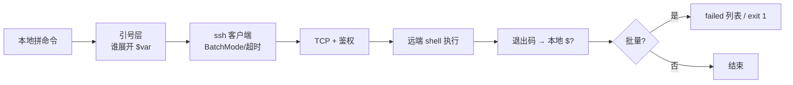
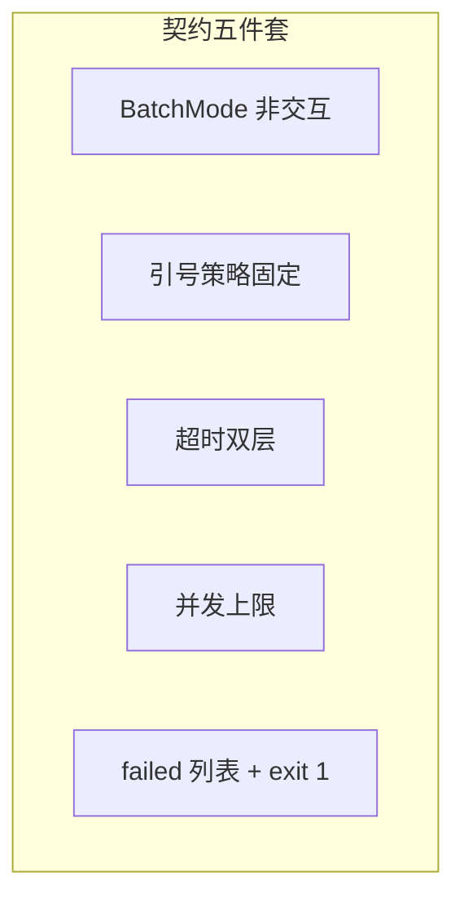
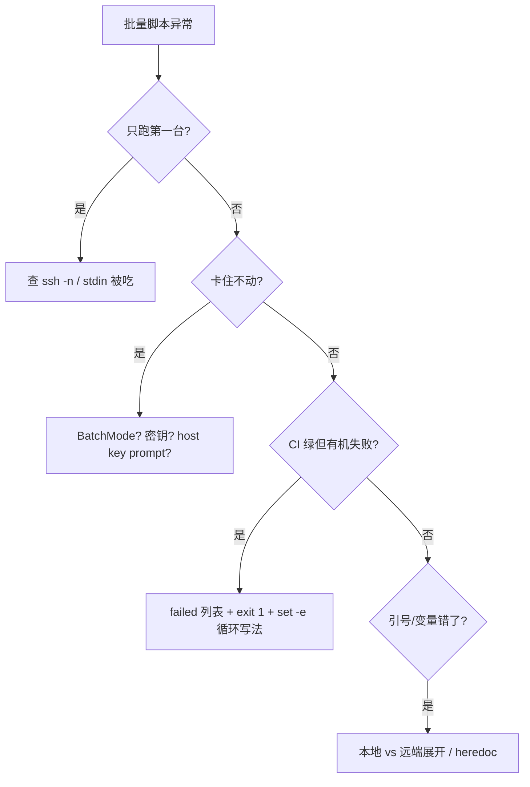

# 10｜SSH 批量与远程执行 · SRE 开发能力

> 活动前有人写 `for h in $(cat hosts); do ssh $h "systemctl reload nginx"; done`，三台里一台密钥过期——脚本卡在 `Are you sure you want to continue connecting`，后面 200 台全堵在 stdin；还有人远程命令里嵌 `$()`，本地展开把生产密码打进 `ps`。群里已在喊「脚本挂了，手动一台台 reload」。
> **本章回答**：一条远程命令从「本地拼串」到「远端执行、退出码回传、批量收敛」——引号地狱、BatchMode、超时、并发与失败列表怎么写才入库。
> **不讲**：OpenSSH 协议与密钥生成 → [01-26](../../../01-基础底座/26-SSH与远程访问/)；引号与 `${var:-}` → [03](../03-变量引号与参数展开/)；`xargs -P` 原理 → [08](../08-并发与限流/)；完整发布模板 → [12](../12-生产脚本规范与模板/)。

**标记**：🎯重点 · 🔥难点 · ⭐常考 · 🔧实操

---

## 面试怎么考

| 标记 | 考点 |
|------|------|
| **核心** | 本地引号 vs 远端引号；`ssh -n`；`BatchMode=yes`；`ConnectTimeout`；批量 `failed+=` 与最终 `exit 1` |
| **必会** | `ssh host 'cmd'` 与 `ssh host "cmd $var"` 差别；非交互禁止卡在 host key / password |
| **常用** | `xargs -P` / 后台 `&` + `wait` 限并发；`scp` 与 `ssh` 同一套选项；失败主机列表写 stderr |
| **常考** | 为什么 `for h in $(cat hosts)` 会炸；远程 `$()` 在谁那边展开；百台变更如何 dry-run |

> 📝 **面试（30 秒）**：批量 SSH 的核心是「**命令在远端执行，引号和变量在谁那边展开要想清楚**」。非交互必须 `BatchMode=yes` + 配好密钥。超时用 `ConnectTimeout` + 包一层 `timeout`。并发用 `xargs -P` 或信号量，别 500 台同时握手。循环里 `ssh ... || failed+=("$host")`，最后有失败就 `exit 1`——CI 才真红。引号默认：**外层本地双引号传变量，内层远端单引号包整条远程命令**。

---

## 能力边界

| 维度 | Shell + ssh 批量 | Ansible / Salt | 裸 `ssh` 一行 |
|------|------------------|----------------|---------------|
| **适合** | 10～500 台、已有 hosts、CI/跳板机 5 分钟刀 | 幂等、审计、回滚、变量分层 | 1～2 台 ad-hoc |
| **不适合** | 无失败策略的「尽力而为」、密钥未治理 | 改一行配置也要 playbook 评审 | 入库、无 dry-run |
| **你要会** | 引号、BatchMode、失败列表 | 何时该上 Ansible | 何时该写成脚本进 Git |

- 🔑 **三个角色别混**
  - **本地 shell**：展开 `$var`、`$(date)`、拼 `ssh` 行——双引号里的是本地展开
  - **ssh 客户端**：鉴权、加密通道、把远端命令交给远端 shell——`BatchMode` 管交互
  - **远端 shell**：执行引号里那段字符串——单引号包 remote cmd 防本地展开

> 🎯 **批量 SSH 脚本 review 三眼**：第一眼引号、第二眼 BatchMode、第三眼失败时 CI 会不会假绿。

---

## 语言最小集

读/写批量 SSH 脚本，先认这组零件：

```bash
#!/usr/bin/env bash
set -euo pipefail

SSH_OPTS=(
  -o BatchMode=yes                     # 禁止交互（密码/确认）
  -o ConnectTimeout=10                 # TCP 连接超时（秒）
  -o StrictHostKeyChecking=accept-new  # 新主机自动接受（CI 常用）；生产可改 yes+预分发
  -o ServerAliveInterval=15            # 长命令保活
  -o ServerAliveCountMax=3
)

remote_run() {
  local host=$1
  shift
  ssh -n "${SSH_OPTS[@]}" "$host" "$@"   # -n 不读本地 stdin，防 ssh 吃掉 for/while 的输入
}

# 引号金律：变量在本地展开 → 外层双引号；整条远程命令字面 → 内层单引号
remote_run game-01 'systemctl is-active nginx'   # 远端执行，无本地展开

stage=prod
remote_run game-01 "echo stage=$stage"           # 本地展开 $stage 后发给远端
```

- 🧩 **零件速认**
  - `ssh -n`：stdin → `/dev/null`，批量循环必备
  - `BatchMode=yes`：无密钥则立刻失败，不挂起
  - `ConnectTimeout`：连不上的机器快速跳过
  - `failed+=`：批处理在 `set -e` 下收集失败主机
  - `xargs -P N`：并发上限（见 08 章）

零件认完，上主图。

---

## 一、一张图：一条远程命令的一生

> 🎯 **一句话**：本地拼好 **argv + 引号层** → **ssh 鉴权建通道** → **远端 shell 执行** → **退出码经 ssh 返回本地 `$?`**。



- 📖 **读图**
  - 🛤️ 主线从左「拼命令」到「退出码」是一条远程命令的命；批量在右下角 `failed` 收敛
  - 📟 单台 `ssh` 失败不等于脚本立刻停（看你是否要跑完全部）；**最后**必须 `exit 1` 让 CI 红——监控看的是脚本进程退出码，不是某台 stdout

本节对应练习题 Q1、Q14。

---

## 二、出生：本地拼串与 hosts 输入

> 🎯 **一句话**：hosts 用 **`while read -r`** 读文件，别 `for h in $(cat hosts)`。

```bash
# 推荐：逐行读，跳过空行和注释
while read -r host; do
  [[ -z "$host" || "$host" =~ ^# ]] && continue
  remote_run "$host" 'hostname'
done <hosts.txt
```

```bash
# 反例：命令替换 + 未引用 → 路径含空格/制表会炸；空文件行为诡异
for h in $(cat hosts.txt); do ssh "$h" uptime; done   # ← review 标红
```

#### ❓ 为什么 `for h in $(cat hosts)` 会炸？

- 💣 **分词灾难**：`$(cat)` 结果再按 `IFS` 切词——主机名含空格、制表、意外换行都会拆成多段
- 👻 **空文件/注释行**：行为诡异，注释行也会当主机名去连
- ✅ **正解**：`while read -r host; do ...; done <hosts.txt`——一行一台，跳过空行与 `#`

> ⚠️ **别混**：`cat hosts | while` 会在**子 shell**里跑循环（见 07），`failed` 数组传不回外层——批量脚本用 **输入重定向** `done <hosts.txt`。

> 📝 **面试**：hosts 一行一台，UTF-8、无尾随空格；`read -r` 保留反斜杠；`#` 开头当注释。

本节对应练习题 Q11。

---

## 三、上路：ssh 客户端选项（BatchMode · 超时）⭐

> 🎯 **一句话**：非交互脚本 = **BatchMode=yes** + **ConnectTimeout** + 密钥事先配好；否则就是定时炸弹。

### 🔐 BatchMode（🔥难点 · ⭐常考）

**BatchMode**（`ssh_config` 写 `BatchMode yes` 或 `-o BatchMode=yes`）：禁止密码/键盘交互；没有可用密钥时**立即失败**，而不是挂起等 stdin。

```bash
ssh -o BatchMode=yes unreachable-host.example 'echo ok'
# unreachable-host.example: Permission denied (publickey).   # ← 秒失败
# 退出码 255 常见
```

#### ❓ 为什么批量必须 BatchMode？

- 🛑 **没有它**：密钥不对 → password / host key prompt → 批量 `for` **卡死**在第一台，后面全堵
- ✅ **有了它**：无密钥立刻失败（常 255），循环可记入 `failed` 继续下一台
- 🔑 **前提**：密钥事先配好——BatchMode 不代替密钥治理，只保证「不交互挂起」

> 💡 **打个比方**：BatchMode 像快递柜——没有取件码就直接退件，不会打电话问你密码。

### ⏱️ 超时两层

| 层 | 选项 / 命令 | 管什么 |
|----|-------------|--------|
| 连接 | `ConnectTimeout=10` | TCP/握手连不上 |
| 整命令 | `timeout 60 ssh ...` | 远端命令跑太久（挂死） |
| 保活 | `ServerAliveInterval` / `CountMax` | NAT 空闲断连 |

#### ❓ 为什么 ConnectTimeout 和 timeout 要两层？

- 🚪 **ConnectTimeout**：管「门开不开」——连不上的机器快速跳过
- 🏃 **`timeout N ssh`**：管「进门后干活」——远端脚本死循环、卡 NFS，整条 ssh 也要被杀
- 💓 **ServerAlive***：管「NAT 空闲掐线」——长命令保活，和前两层不是一回事

```bash
timeout 120 ssh -o ConnectTimeout=10 -o BatchMode=yes "$host" \
  'bash -s' <<'REMOTE'
set -euo pipefail
long_running_job.sh
REMOTE
```

> 🔍 **现场**：

```bash
ssh -G game-01 | grep -E 'batchmode|connecttimeout'
# batchmode yes
# connecttimeout 10
```

本节对应练习题 Q1、Q2、Q5。

---

## 四、引号地狱：谁在展开 `$`（🔥难点 · ⭐常考）

> 🎯 **一句话**：**单引号包 remote cmd = 全在远端展开**；**双引号 = 本地先展开再发送**。

### 🧩 四层引号模型

```bash
host=game-01
file=/etc/nginx/nginx.conf

# ① 远端字面执行（推荐默认）
ssh "$host" 'grep worker_processes /etc/nginx/nginx.conf'

# ② 本地变量拼进远端命令
ssh "$host" "grep worker_processes '$file'"
# 发给远端的是：grep worker_processes '/etc/nginx/nginx.conf'

# ③ 作死：本地展开 $(cat secret) —— 秘密出现在本地 ps / history
ssh "$host" "echo $(cat /tmp/secret)"

# ④ 远端展开：把脚本传过去
ssh "$host" 'bash -s' <<'EOF'
echo "remote user=$(whoami) host=$(hostname -f)"
EOF
```

#### ❓ 为什么 `ssh h "echo $(date)"` 在本地展开？

- 🧠 **谁跑这层引号，谁展开**：本地 shell 先解析双引号 → `$(date)` **本地**执行，结果当字面发给远端 `echo`
- ✅ **远端要 date**：`ssh h 'echo $(date +%F)'`——单引号整包，本地不碰 `$`
- 🔥 **永远不要**在双引号 remote 里写 `$(本地秘密)`——进 `ps` / history

- 📋 **嵌套引号口诀**
  1. 远程整条命令能单引号就单引号
  2. 必须带本地变量 → 外层双引号 + 内层参数再单引号：`"cmd '$local_path'"`
  3. 复杂逻辑 → `ssh host 'bash -s' <<'EOF'` 或 `scp` 脚本上去再执行
  4. **永远不要在双引号 remote 里写 `$(本地秘密)`**

```bash
# 面试爱考
ssh h 'echo $(date +%F)'      # 远端 date
ssh h "echo $(date +%F)"      # 本地 date，结果当字面发给远端 echo
```

> ⚠️ **别混**：`ssh host "cmd $var"` 里 `$var` 是**本地**展开；`ssh host 'cmd $var'` 里 `$var` 是**远端**展开（或字面，若远端没设）。

> 📝 **面试**：批量变更引号策略：`ssh -n host 'set -euo pipefail; 具体命令'`；要传本地算好的值用双引号包外层、路径单引号。

本节对应练习题 Q3、Q10。

---

## 五、干活：ssh -n · scp · 远端 bash -s

> 🎯 **一句话**：批量循环里 **`ssh -n`** 防止 ssh 吃掉 `while read` 的 stdin；传文件用 **scp 同一套 SSH_OPTS**。

```bash
SSH_OPTS=(-o BatchMode=yes -o ConnectTimeout=10)

do_host() {
  local host=$1
  scp -q "${SSH_OPTS[@]}" ./nginx.conf "$host:/etc/nginx/nginx.conf"
  ssh -n "${SSH_OPTS[@]}" "$host" 'nginx -t && systemctl reload nginx'
}
```

### 📥 `ssh -n`：别吃掉循环的 stdin

**`ssh -n`**：把 ssh 的 stdin 指到 `/dev/null`。否则 ssh 默认会读循环的 stdin，导致**只跑第一台**。

#### ❓ 为什么不加 `-n` 只跑第一台？

- 🍽️ **stdin 被抢**：`while read` 从 hosts 文件读；裸 `ssh` 默认也读 stdin → 把剩余主机名当远程命令输入吃掉
- ✅ **`-n`**：ssh 不碰循环 stdin，`read` 继续读下一行
- 🔍 **现场**：只跑第一台就停——先查有没有漏 `-n`，再查有没有 `ssh host cmd < hosts.txt` 误重定向

### 📜 heredoc 远程执行（🔧实操）

```bash
ssh -n "${SSH_OPTS[@]}" "$host" 'bash -s' <<'REMOTE'
set -euo pipefail
CONFIG=/etc/app/config.yaml
test -f "$CONFIG"
python3 -c "import yaml; yaml.safe_load(open('$CONFIG'))"
REMOTE
```

#### ❓ 为什么 `<<'REMOTE'` 定界符要加引号？

- 🔒 **`<<'REMOTE'`**：heredoc **不在本地展开**，整段在远端 bash 执行——复杂巡检首选
- ⚠️ **`<<REMOTE`（无引号）**：本地先展开 `$var` / `$(...)`——要传本地变量才用，且禁止嵌秘密
- 🔥 **组合点**：`ssh -n` 仍要配——`-n` 管循环 stdin；heredoc 经 ssh 传给远端 `bash -s`，两件事不冲突

本节对应练习题 Q4、Q8。

---

## 六、并发：别 500 台同时握手（⭐常考）

> 🎯 **一句话**：并发用 **`xargs -P`** 或 **信号量**，上限常 10～32，配合 `ConnectTimeout` 防雪崩。

```bash
# xargs -P：从文件读主机，最多 10 路并行
grep -vE '^\s*($|#)' hosts.txt | \
  xargs -r -P 10 -I{} bash -c '
    host="$1"
    ssh -n -o BatchMode=yes -o ConnectTimeout=10 "$host" "hostname" \
      || echo "$host" >> /tmp/failed.$$
  ' _ {}
```

```bash
# 纯 bash：后台作业 + wait（08 章详讲）
PARALLEL=${PARALLEL:-10}
running=0
while read -r host; do
  [[ -z "$host" || "$host" =~ ^# ]] && continue
  (
    remote_run "$host" 'uptime' || echo "$host" >>"$FAILED_FILE"
  ) &
  (( ++running >= PARALLEL )) && { wait -n; ((running--)); }
done <hosts.txt
wait
```

#### ❓ 为什么不能 500 台同时握手？

- 🧨 **打满 `sshd`**：触发 `MaxStartups`，新连接被拒——看起来像「半个机房挂了」
- 🧱 **堡垒机限流 / 本机 `ulimit`**：并发过高先把自己打挂
- ✅ **上限常 10～32**：配合 `ConnectTimeout`；并发只解决「快」，不解决「对」——每台仍要独立退出码和失败记录

> ⚠️ **别混**：`GNU parallel` 很强但生产要先确认跳板机是否安装；`xargs -P` 和 `&`+`wait` 不依赖额外包。

### ♻️ ControlMaster 连接复用（🔧实操）

百台变更时每次 `ssh` 都走完整 TCP 握手 + 密钥交换，耗时可观。`ControlMaster` 让多个 `ssh` 复用同一条连接：

```bash
# ~/.ssh/config 片段
Host *
  ControlMaster auto
  ControlPath /tmp/ssh-%r@%h:%p
  ControlPersist 10m
```

```bash
# 验证复用生效
time ssh host 'exit'     # 第一次：新建连接，2~5s
time ssh host 'exit'     # 第二次：复用，毫秒级
# ← ControlPersist 10m 挂断后保持线路 10 分钟
```

> 💡 **打个比方**：ControlMaster 像「电话保持」——第一通拨号建线，后续拿起听筒就通；`ControlPersist 10m` 是挂断后保持线路 10 分钟。

> ⚠️ **别混**：`ControlPersist` 在 CI 里要短或关——并发实例可能争抢同一条 socket；容器环境 `ControlPath` 目录要存在且可写。

本节对应练习题 Q7。

---

## 七、死亡与收敛：退出码 · failed 列表（🔥难点 · ⭐常考）

> 🎯 **一句话**：`ssh` 失败常返回 **255**；批处理要 **`cmd || failed+=("$host")`**，最后 **`((${#failed[@]}))` 则 `exit 1`**。

```bash
main() {
  local failed=()
  while read -r host; do
    [[ -z "$host" || "$host" =~ ^# ]] && continue
    if ! remote_run "$host" 'systemctl is-active nginx'; then
      failed+=("$host")
    fi
  done <hosts.txt

  if ((${#failed[@]} > 0)); then
    log "FAILED hosts (${#failed[@]}): ${failed[*]}"
    printf '%s\n' "${failed[@]}" >"${FAILED_LIST:-/tmp/ssh-failed.$$}"
    exit 1
  fi
  log "all ok"
}
```

| 退出码 | 常见含义 |
|--------|----------|
| 0 | 远端命令成功 |
| 1～125 | 远端命令自身失败（或被 `set -e` 传递） |
| 255 | ssh 连接/鉴权/协议错误 |

#### ❓ 为什么 `set -e` 下还要用 `failed+=`？

- 🛑 **循环里直接 `ssh ...`**：第一台失败 → `-e` 立刻退出 → 后面主机全没跑到
- ✅ **`if !` / `|| failed+=`**：失败记下来、继续下一台；跑完再汇总 `exit 1`
- ❌ **`|| true`**：糊失败 → CI 假绿——开头「部分挂却绿」的根子

> ⚠️ **别混**：`set -e` 保证「错就停」；批量要「跑完全部再汇总」必须绕开直接失败——用 `if !` 或 `|| failed+=`，**最后**再 `exit 1`。

> 📝 **面试**：批量脚本契约：stdout 可机器读；失败列表写 stderr 或文件；进程退出码非 0；Jenkins 才红。

### 收束：一条远程命令凭什么「可入库」



- 📖 **读图**
  - 🧱 五件套缺任一，都会在规模放大时爆——不是「会不会 ssh」，是「200 台时会不会卡死、假绿、误展开秘密」
  - 🚫 **不保证**：回滚（要版本化配置 + 备份）；幂等（要业务命令自己保证）；审计（要堡垒机日志或 Ansible）

本节对应练习题 Q6、Q9、Q12。

---

## 八、作战：批量 SSH 卡住 / 假绿 / 只跑一台

> 🎯 **一句话**：先分叉「只跑一台 / 卡住 / 假绿 / 引号错」，再落刀到 `-n`、BatchMode、`failed+=`、heredoc。



- 📖 **读图**：四条分支对应四～七节；开篇两个现场分别落在「卡住」和「引号」支。

| 现象 | 先做 | 别做 |
|------|------|------|
| 卡第一台 | `ssh -v` 单台；加 `BatchMode=yes` | 批量里 `ssh` 不加 `-n` |
| 全连不上 | 查堡垒机 `MaxSessions`、本机 `ulimit` | 盲目加大并发 |
| 命令空跑 | `ssh host 'set -x; cmd'` 单台验证引号 | 双引号里嵌本地 `$(secret)` |
| 部分失败 CI 绿 | 循环改 `failed+=`；末尾 `exit 1` | `ssh ... \|\| true` |

**60 秒剧本** 🔧：

- **0–10s**：挑一台失败机 `ssh -o BatchMode=yes -v host true`，看卡在哪一步
- **10–30s**：单台跑远程命令原串；不对就改 heredoc
- **30–45s**：查脚本有无 `-n`、`failed` 数组是否在子 shell 里丢失
- **45–60s**：把失败列表落盘，带 `exit 1` 重跑 CI 验证门禁

本节对应练习题 Q13、Q14。

---

## 九、生产模板 🔧

### 模板 1：最小可入库批量巡检

```bash
#!/usr/bin/env bash
# check-nginx-active.sh — 批量检查 nginx 是否 active
set -euo pipefail

HOSTS_FILE=${1:-hosts.txt}
SSH_OPTS=(-o BatchMode=yes -o ConnectTimeout=10 -o StrictHostKeyChecking=accept-new)
PARALLEL=${PARALLEL:-16}
FAILED=$(mktemp)

log() { printf '[%s] %s\n' "$(date '+%F %T')" "$*" >&2; }

check_one() {
  local host=$1
  if ! ssh -n "${SSH_OPTS[@]}" "$host" 'systemctl is-active --quiet nginx'; then
    echo "$host" >>"$FAILED"
    return 1
  fi
}
export -f check_one
export SSH_OPTS FAILED

grep -vE '^\s*($|#)' "$HOSTS_FILE" | xargs -r -P "$PARALLEL" -I{} bash -c 'check_one "$1"' _ {}

if [[ -s "$FAILED" ]]; then
  log "FAILED:"
  cat "$FAILED" >&2
  exit 1
fi
log "all ok"
```

```text
[2026-09-01 23:15:01] FAILED:
game-07
game-12
# ← stderr 给人看；退出码 1 给 CI
```

### 模板 2：scp + 远程校验 + reload（发布片段）

```bash
#!/usr/bin/env bash
set -euo pipefail
DRY_RUN=${DRY_RUN:-true}
SSH_OPTS=(-o BatchMode=yes -o ConnectTimeout=15)
SRC=${SRC:?}
DST=${DST:?}

deploy_host() {
  local host=$1
  if [[ "$DRY_RUN" == true ]]; then
    log "[DRY-RUN] $host: scp $SRC -> $DST; nginx -t; reload"
    return 0
  fi
  scp -q "${SSH_OPTS[@]}" "$SRC" "$host:$DST"
  ssh -n "${SSH_OPTS[@]}" "$host" "cp -a '$DST' '${DST}.bak.$(date +%s)' && nginx -t && systemctl reload nginx"
}
```

### 模板 3：失败列表落盘 + runbook 提示

```bash
if ((${#failed[@]} > 0)); then
  list=/tmp/failed-hosts-$(date +%s).txt
  printf '%s\n' "${failed[@]}" | tee "$list" >&2
  log "see runbook: https://wiki.example.com/runbook/ssh-batch-fail"
  log "retry: PARALLEL=8 xargs -a $list -I{} $0 --host {}"
  exit 1
fi
```

本节对应练习题 Q6、Q7。

---

## 十、收口

### 踩坑清单

| 现象 | 原因 | 修法 |
|------|------|------|
| 只跑第一台 | ssh 读 stdin | `ssh -n`；`done <hosts` 别管道 while |
| 卡 password | 无 BatchMode | `-o BatchMode=yes` |
| 本地秘密泄露 | 双引号里 `$(cat key)` | heredoc 或远端读文件 |
| CI 绿部分挂 | 无 failed 汇总 | `failed+=` + `exit 1` |
| 并发打满堡垒机 | 无上限并行 | `xargs -P 10` |
| `host key verify failed` | 新机器/换 IP | 预分发 known_hosts 或 `accept-new`（评估风险） |
| failed 数组空 | while 在管道子 shell | 输入重定向 |
| 超时误杀 | 长任务无 `timeout` 放大 | 区分 ConnectTimeout 与 `timeout` |

### 必会 · 常考

| 说法 | 对错 | 口径 |
|------|:----:|------|
| `ssh host "echo $HOME"` 在远端展开 HOME | 错 | 本地展开后发给远端 |
| BatchMode 下没密钥会 hang | 错 | 立刻失败 |
| `ssh` 退出码等于远端命令退出码 | 大致 | 连接失败常 255 |
| `for h in $(cat f)` 生产可用 | 错 | 用 `read -r` |
| 批量可以不要 `-n` | 错 | 循环 stdin 被吃 |
| `\|\| true` 适合批量 ssh | 错 | CI 假绿 |
| heredoc 定界符加引号不本地展开 | 对 | `<<'EOF'` |
| 三开关下循环直接 ssh 会停第一台 | 对 | 用 `if !` / `failed+=` |
| scp 和 ssh 应用同一套 `-o` | 对 | 鉴权一致 |
| `ControlMaster` 能加速批量 | 对 | 复用 TCP 连接 |

### 命令速查 🔧

```bash
ssh -o BatchMode=yes -o ConnectTimeout=10 host 'cmd'
ssh -n host 'cmd'                    # 批量循环必备
ssh -G host | grep batchmode         # 生效配置
scp -o BatchMode=yes f host:/path
grep -vE '^\s*($|#)' hosts | xargs -r -P 10 -I{} ssh -n {} hostname
ssh -v host true                     # 调试握手（禁泄密）
ssh -O check host                    # 查 ControlMaster 连接状态
ssh -O exit host                     # 关闭 ControlMaster 连接
```

### 面试锚点

| 问 | 30 秒答 |
|----|---------|
| 批量 SSH 为何卡死？ | 无 BatchMode 等密码；或 ssh 吃 stdin 只跑第一台 |
| 引号怎么写？ | 远程命令默认单引号；本地变量外层双引号 + 内层单引号 |
| 失败怎么处理？ | 循环 `failed+=`；写 stderr/文件；最后 `exit 1` |
| 怎么做并发？ | `xargs -P N` 或 `&`+`wait`，N 10～32 |
| ssh 255 是什么？ | 连接/鉴权层错误，不是业务命令码 |
| 和 Ansible 边界？ | 临时批量刀法用 Shell；要审计幂等上 Ansible |

### 易错一句话对照

- 错：`for h in $(cat hosts)` → 对：`while read -r host; do ... done <hosts`
- 错：批量 ssh 不加 `-n` → 对：`ssh -n` 防 stdin
- 错：双引号 remote 里 `$(secret)` → 对：heredoc 或远端读文件
- 错：第一台失败就 silent / `|| true` → 对：`failed` 列表 + `exit 1`
- 错：无限并发 → 对：`-P` 上限 + `ConnectTimeout`
- 错：以为 CI 看日志 ERROR → 对：看进程退出码

> 数字墙：`ConnectTimeout` 常用 **10～15s**；批量并发 `xargs -P` 常用 **10～32**；ssh 连接失败退出码 **255**；`ServerAliveInterval` 常用 **15s**；`ControlPersist` 常用 **10m**（CI 宜更短或关）。

---

## 合上书

- [ ] **默画**「本地拼串 → ssh 鉴权 → 远端执行 → 退出码 → failed 列表」主路径（Q1、Q14）
- [ ] `ssh host 'echo $USER'` 和 `ssh host "echo $USER"` 在哪边展开 `$USER`（Q3）？
- [ ] 批量脚本为什么必须 `BatchMode=yes` 和 `ssh -n`？各解决什么卡死（Q1、Q2、Q4）？
- [ ] `ConnectTimeout` 和 `timeout 60 ssh` 分别管哪一段（Q5）？
- [ ] `set -e` 下如何既跑完全部主机又在最后让 CI 红？写伪代码（Q6、Q12）
- [ ] 并发 500 台可能触发哪些基础设施限制？你怎么设上限（Q7）？
- [ ] 复杂远程逻辑，你会选 `ssh cmd`、双引号、还是 `bash -s` heredoc？为什么（Q10）？
- [ ] 说出 ssh/scp 退出码 255 与远端命令退出码 1 在排障上的区别（Q9）

全部打勾之后，找一位同事十分钟讲清「开头那个卡在 host key、远程 `$()` 本地展开——各自错在哪」。讲得下来，你就是下一个能拦住「手动一台台 reload」冲动的人。

下一章用 `bash -n`、`shellcheck`、`set -x` 把脚本排错流程钉死。
