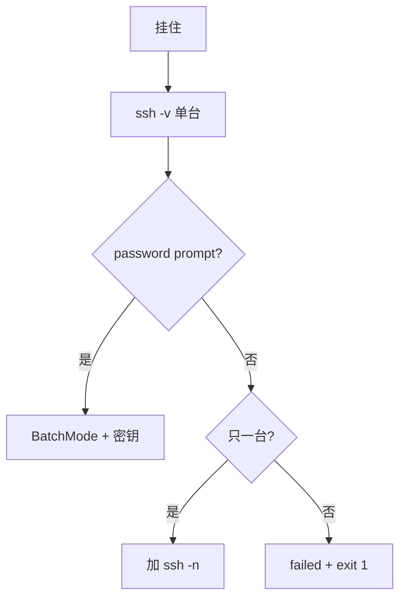

# 10｜SSH 批量与远程执行 · 练习题

先合上 [知识点](知识点.md)，对着 **「一条远程命令的一生」主图** 从本地拼串讲到 failed 列表，再来做题。

| 标记 | 含义 |
|------|------|
| **核心** | 不懂整章就没建立起来 |
| **必会** | 值班和面试都要能讲 |
| **常用** | 线上会反复碰到 |
| **常考** | 白板和追问的高频口径 |

## 本题目录

- [Q1 批量卡在第一台](#q1) · [Q2 BatchMode](#q2) · [Q3 引号地狱](#q3) · [Q4 ssh -n](#q4)
- [Q5 超时两层](#q5) · [Q6 failed 列表](#q6) · [Q7 xargs 并发](#q7) · [Q8 scp 发布](#q8)
- [Q9 退出码 255](#q9) · [Q10 heredoc 远程](#q10) · [Q11 hosts 读法](#q11) · [Q12 CI 假绿](#q12)
- [Q13 作战剧本](#q13) · [Q14 白板总览](#q14)
- [合上书](#合上书)

---

## Q1

**★★★★★｜活动前批量 reload，脚本只跑了 hosts 里第一台就停了——最可能哪两个原因？**

**覆盖**：核心 · 必会 · 常考 | **对应**：知识点 [二、出生：本地拼串与 hosts 输入](知识点.md)、[五、干活：ssh -n](知识点.md)

### 场景

`while read -r host; do ssh "$host" 'systemctl reload nginx'; done <hosts.txt` 在 200 台环境只执行第一台；日志无报错。

### 完整解答

> 🎯 **一句话**：**ssh 默认读 stdin**，吃掉 `while read` 的输入；修法 **`ssh -n`** + **`done <hosts`** 别管道子 shell。

```bash
# 错：stdin 被 ssh 消耗
while read -r host; do ssh "$host" 'cmd'; done <hosts.txt   # 仍可能因未 -n

# 对
while read -r host; do
  ssh -n -o BatchMode=yes "$host" 'systemctl reload nginx'
done <hosts.txt
```

第二常见原因：第一台后 `set -e` 遇失败直接退出（见 Q6）。

> ⚠️ **别混**：`cat hosts | while read` 还会在子 shell，`failed` 数组传不回外层。

### 再追问

如果写成 `ssh "$host" 'cmd' <hosts.txt` 会怎样？——每次 ssh 都把整个 hosts 文件当 stdin 喂给远端，行为更乱；永远别这么写。

---

## Q2

**★★★★★｜百台巡检凌晨挂死，人工登录发现卡在 `password:`——BatchMode 解决什么？**

**覆盖**：核心 · 必会 · 常考 | **对应**：知识点 [三、上路：ssh 客户端选项](知识点.md)

### 场景

密钥过期一台，批量脚本无 `BatchMode`，Jenkins 构建挂 6 小时直到超时。

### 完整解答

> 🎯 **一句话**：**BatchMode=yes** 禁止交互式密码/键盘确认，无密钥**立即失败**而非挂 stdin。

```bash
ssh -o BatchMode=yes bad-host 'true'
# Permission denied (publickey).
# 退出码 255，秒级返回
```

配合：事先分发密钥、`StrictHostKeyChecking=accept-new` 或预置 `known_hosts`，避免 host key 交互。

> 📝 **面试**：「非交互脚本三件套：BatchMode、ConnectTimeout、密钥治理。」

### 再追问

BatchMode 能代替密钥吗？——不能，只是**快失败**；还得修密钥或换堡垒机账号。

---

## Q3

**★★★★★｜`ssh game-01 "echo $(cat /tmp/db.pass)"` 有什么安全问题？引号怎么改？**

**覆盖**：核心 · 必会 · 常考 | **对应**：知识点 [四、引号地狱](知识点.md)

### 场景

oncall 把密码文件内容通过 ssh 双引号传远端，同事在跳板机 `ps aux` 看见明文。

### 完整解答

> 🎯 **一句话**：双引号里的 **`$(cat ...)` 在本地展开**，秘密出现在本地进程列表；应 **heredoc 远端读** 或 **密钥文件仅远端可见**。

```bash
# 对：远端读（文件已在远端）
ssh -n game-01 'bash -s' <<'REMOTE'
set -euo pipefail
pass=$(cat /run/secrets/db.pass)   # 远端展开
REMOTE

# 或：本地只传路径字面
ssh -n game-01 'grep -v ^# /etc/app/db.cnf'
```

> ⚠️ **别混**：`ssh h 'echo $X'` 是远端 `$X`；`ssh h "echo $X"` 是本地 `$X`。

### 再追问

要让远端执行 `date +%F`，用单引号还是双引号？——单引号 `'date +%F'` 在远端执行；双引号且本地无变量时等价，但团队规范仍推荐单引号包 remote cmd。

---

## Q4

**★★★★☆｜`ssh -n` 和 `BatchMode` 分别解决什么问题？能互相替代吗？**

**覆盖**：必会 · 常考 | **对应**：知识点 [三、上路](知识点.md)、[五、干活](知识点.md)

### 场景

面试官白板：「你们批量脚本头里常写哪些 ssh 选项？各干什么？」

### 完整解答

> 🎯 **一句话**：**`-n`** 防 ssh **吃循环 stdin**；**BatchMode** 防 **密码/host 交互挂起**；不能互相替代。

| 选项 | 解决的问题 |
|------|------------|
| `ssh -n` | 本地 stdin 不被 ssh 占用 |
| `BatchMode=yes` | 不要 password prompt |
| `ConnectTimeout` | TCP 连不上快失败 |

### 再追问

交互式登录要不要 BatchMode？——不要，你要输密码；脚本才要 BatchMode。

---

## Q5

**★★★★☆｜远端跑迁移要 40 分钟，ConnectTimeout=10 够不够？两层超时怎么配？**

**覆盖**：必会 · 常用 | **对应**：知识点 [三、上路](知识点.md)

### 场景

有人只设 `ConnectTimeout=10`，迁移脚本 30 分钟被中间防火墙 RST，以为「超时配置错了」。

### 完整解答

> 🎯 **一句话**：**ConnectTimeout 只管握手**；长任务用 **`timeout 3600 ssh ...`** + **`ServerAliveInterval`** 保活。

```bash
timeout 3600 ssh -n \
  -o ConnectTimeout=15 \
  -o ServerAliveInterval=15 \
  -o ServerAliveCountMax=3 \
  "$host" 'bash -s' <<'EOF'
run_long_migration.sh
EOF
```

### 再追问

`timeout` 杀的是本地 ssh 还是远端进程？——向进程组发信号，通常两端一起断；关键任务要远端 `nohup` 或 screen/tmux 并设计可恢复。

---

## Q6

**★★★★★｜`set -euo pipefail` 下批量 50 台，第 3 台失败——如何跑完全部且 CI 红？**

**覆盖**：核心 · 必会 · 常考 | **对应**：知识点 [七、死亡与收敛](知识点.md)

### 场景

第 3 台 `nginx -t` 失败，脚本直接退出，后 47 台未检查；经理要求「全量扫描 + 失败列表」。

### 完整解答

> 🎯 **一句话**：循环里 **`if ! ssh ...; then failed+=("$host"); fi`**，末尾 **`((${#failed[@]})) && exit 1`**。

```bash
failed=()
while read -r host; do
  [[ -z "$host" || "$host" =~ ^# ]] && continue
  if ! ssh -n "${SSH_OPTS[@]}" "$host" 'nginx -t'; then
    failed+=("$host")
  fi
done <hosts.txt
((${#failed[@]} > 0)) && { printf '%s\n' "${failed[@]}" >&2; exit 1; }
```

> 📝 **面试**：「`-e` 和批处理矛盾时用显式 `if !`，别 `|| true` 糊过去。」

### 再追问

能否 `ssh ... || failed+=` 一行？——可以，但注意 `set -e` 下 `cmd || true` 与 `failed+=` 的写法要一致，推荐 `if !` 更清晰。

---

## Q7

**★★★★☆｜200 台巡检，串行太慢、无限并行把堡垒机打挂——并发怎么设？**

**覆盖**：必会 · 常用 | **对应**：知识点 [六、并发](知识点.md)

### 场景

`for` 循环串行 40 分钟；改成后台 `&` 无上限后堡垒机 `MaxStartups` 报警。

### 完整解答

> 🎯 **一句话**：**`xargs -P 10~32`** 或 **`&` + `wait -n` 信号量**，配合 ConnectTimeout。

```bash
grep -vE '^\s*($|#)' hosts.txt | \
  xargs -r -P 16 -I{} ssh -n -o BatchMode=yes -o ConnectTimeout=10 {} 'hostname'
```

先小流量试 `PARALLEL=8`，观察堡垒机与会话数，再放大。

### 再追问

GNU `parallel` 和 `xargs -P` 怎么选？——没装 parallel 就别引入新依赖；`xargs -P` 足够大多数巡检。

---

## Q8

**★★★★☆｜发布要 scp 配置再 `nginx -t && reload`，ssh 和 scp 选项要不要一致？**

**覆盖**：常用 · 必会 | **对应**：知识点 [五、干活](知识点.md)

### 场景

scp 能上去，ssh 却提示 host key——因为两套命令用了不同 `UserKnownHostsFile`。

### 完整解答

> 🎯 **一句话**：**同一 `SSH_OPTS` 数组**传给 `ssh` 和 `scp`，鉴权与 host key 策略一致。

```bash
SSH_OPTS=(-o BatchMode=yes -o ConnectTimeout=15)
scp "${SSH_OPTS[@]}" ./nginx.conf "$host:/etc/nginx/nginx.conf"
ssh -n "${SSH_OPTS[@]}" "$host" 'nginx -t && systemctl reload nginx'
```

发布前 `cp -a` 备份路径要带时间戳，失败别 reload（见 12 章模板）。

### 再追问

DRY_RUN 时还要不要 ssh？——只打日志 `[DRY-RUN] would scp...`，不建连接，防误触生产。

---

## Q9

**★★★★☆｜`ssh` 返回 255，远端 `nginx -t` 返回 1——排障时怎么区分？**

**覆盖**：必会 · 常考 | **对应**：知识点 [七、死亡与收敛](知识点.md)

### 场景

监控只记「ssh 失败」，有人把 255 当业务配置错误去改 nginx。

### 完整解答

> 🎯 **一句话**：**255 ≈ 传输/鉴权层**；**1～125 ≈ 远端命令自身**；用 **`ssh -v` 单台** 先分层。

```bash
ssh -o BatchMode=yes bad 'nginx -t'; echo $?
# 255 → 连不上/没密钥

ssh -n good 'nginx -t'; echo $?
# 1 → 配置语法错，ssh 通道是好的
```

### 再追问

本地 `timeout` 杀死后 `$?` 是多少？——常见 **124**（GNU timeout），别和 255 混。

---

## Q10

**★★★★☆｜远程 20 行巡检逻辑，你会怎么传？三种方式对比。**

**覆盖**：必会 · 常用 | **对应**：知识点 [四、引号地狱](知识点.md)、[五、干活](知识点.md)

### 场景

同事把 20 行逻辑塞进一行 `ssh "..."`，引号嵌套到无法维护。

### 完整解答

> 🎯 **一句话**：复杂逻辑用 **`ssh 'bash -s' <<'EOF'`**；中等用远端脚本文件；简单才 inline 单引号。

| 方式 | 适用 |
|------|------|
| `ssh h 'cmd'` | 单行 |
| `ssh h "cmd $local"` | 要带本地变量 |
| `ssh h 'bash -s' <<'EOF'` | 多行、远端展开 |

```bash
ssh -n "$host" 'bash -s' <<'REMOTE'
set -euo pipefail
df -h /data | awk 'NR==2{print $5}'
REMOTE
```

### 再追问

`<<EOF` 和 `<<'EOF'` 差别？——带引号定界符**不本地展开**；不带引号会本地展开 `$var`。

---

## Q11

**★★★★☆｜`for h in $(cat hosts)` 和 `while read -r` 在生产差在哪？**

**覆盖**：核心 · 常考 | **对应**：知识点 [二、出生](知识点.md)

### 场景

hosts 里某行 `game 01` 带空格，命令替换拆成两台莫须有的机器。

### 完整解答

> 🎯 **一句话**：**`$(cat)` 会按 IFS 分词**，破坏一行一台；**`read -r`** 按行读，空格保留在一行内（若主机名无空格仍应用 read）。

```bash
while read -r host; do
  [[ -z "$host" || "$host" =~ ^# ]] && continue
  ...
done <hosts.txt
```

### 再追问

Windows 换行 `^M` 导致匹配失败？——`dos2unix hosts.txt` 或 `sed 's/\r$//'`.

---

## Q12

**★★★★★｜批量 ssh 全成功，CI 却绿着——但你知道有 5 台实际失败，脚本里写了 `|| true`，怎么修？**

**覆盖**：核心 · 必会 | **对应**：知识点 [七、死亡与收敛](知识点.md)

### 场景

「怕 `-e` 退出」给每条 ssh 加了 `|| true`，失败只 echo 不 `exit 1`。

### 完整解答

> 🎯 **一句话**：去掉 **`|| true`**；用 **failed 数组**；脚本末尾 **`exit 1`**；CI 只看进程退出码。

```bash
# 错
ssh ... || true

# 对
ssh ... || failed+=("$host")
...
((${#failed[@]} > 0)) && exit 1
```

### 再追问

只想「警告但不红 CI」可以吗？——可以显式 `exit 0` 并文档化，但**默认契约**应是失败即非 0。

---

## Q13

**★★★★☆｜批量脚本「卡住 / 只跑一台 / CI 假绿」——给 60 秒排障顺序。**

**覆盖**：常用 · 必会 | **对应**：知识点 [八、作战](知识点.md)

### 场景

oncall 接手挂住的 Jenkins 任务，不能一上来重启 Jenkins。

### 完整解答

> 🎯 **一句话**：**单台 `ssh -v`** → **查 `-n`/BatchMode** → **查引号单台复现** → **查 failed/exit 码**。



0–10s：挑失败机 `ssh -o BatchMode=yes -v host true`  
10–30s：复制脚本远程命令单台跑  
30–60s：查 `|| true`、子 shell `failed`

### 再追问

能不能在生产批量开 `-v`？——调试单台可以；批量会日志爆炸，用 `-v` 抽样。

---

## Q14

**★★★★★｜白板：从 hosts 文件到 CI 退出码，画出批量 SSH 数据流并口述五件套契约。**

**覆盖**：核心 · 必会 · 常考 | **对应**：知识点 [一、一张图](知识点.md)、[七、死亡与收敛](知识点.md)

### 场景

终面：「设计一个 300 台 nginx 配置校验脚本，失败可重试。」

### 完整解答

> 🎯 **一句话**：**read hosts → SSH_OPTS → 并发 ssh -n 执行 nginx -t → failed 落盘 → exit 1**；五件套：**BatchMode、引号、超时、并发上限、failed+exit**。

数据流：hosts.txt → 过滤注释 → `xargs -P 16` → 每台 `ssh -n` → 退出码汇总 → stderr 打失败列表 → 非 0 给 CI → runbook 写重试命令 `xargs -a failed.txt ...`

> 📝 **面试**：「和 Ansible 边界：脚本适合已有 hosts 的刀法；要审计回滚上 Ansible/GitOps。」

### 再追问

300 台一半失败，重试策略？——对 failed 列表降并发重跑；不要全量重跑浪费窗口。

---

## 合上书

- [ ] 默画「一条远程命令的一生」：拼串 → 引号 → ssh 鉴权 → 远端执行 → 退出码 → failed。
- [ ] 说出 `ssh -n` 与 `BatchMode` 各自防什么卡死。
- [ ] 写一条「安全」的远程命令：本地有 `$file` 变量，远端 `cat` 该路径。
- [ ] `ConnectTimeout` vs `timeout` 命令分工？
- [ ] `set -e` 批处理如何收集失败又不中途退出？
- [ ] 并发上限设多少、依据什么？
- [ ] ssh 255 和远端 exit 1 排障差异？
- [ ] 为什么 `for h in $(cat hosts)` 不该入库？

八题能口述，与知识点「合上书」对齐。下一章练 `bash -n`、`shellcheck`、`set -x` 排错。
