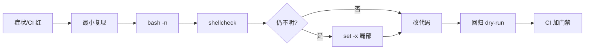
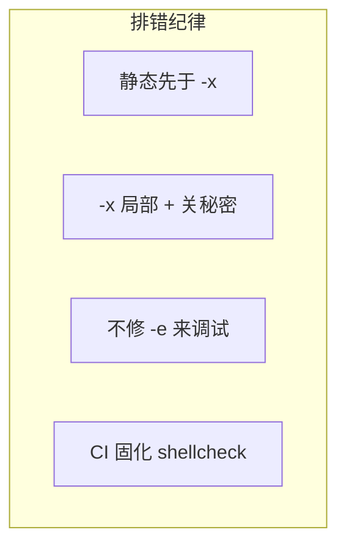
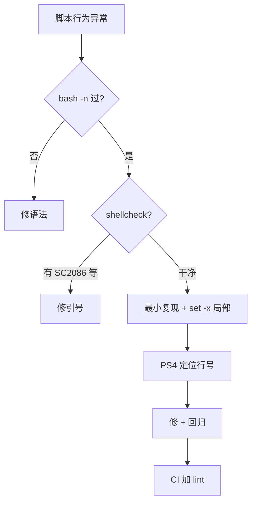

# 11｜调试与 shellcheck · SRE 开发能力

> CI 里发版脚本红了，本地 `bash deploy.sh` 却又绿；同事说「加 `set -x` 看看」，一打日志把数据库密码全进 Jenkins 归档——**不是不会改 bug，是排错手段没有按阶段用**。
> **本章回答**：一次脚本排错从「复现 → 静态检查 → 跟踪执行 → 收敛修复 → 进 CI 门禁」的完整路径——`bash -n`、`shellcheck`、`set -x`、`PS4`、ERR trap 各在什么阶段上场。
> **不讲**：三开关语义 → [02 脚本骨架与三开关](../02-脚本骨架与三开关/)；管道与 `PIPESTATUS` → [06](../06-管道重定向与PIPESTATUS/)；完整生产模板 → [12 生产脚本规范与模板](../12-生产脚本规范与模板/)。

## 面试怎么考

| 标记 | 考点 |
|------|------|
| **核心** | `bash -n` 语法检查；`shellcheck` 静态规则；`set -x` / `PS4` 跟踪；**禁止**在生产日志打秘密 |
| **必会** | `set -x` 会展开变量；`shellcheck` SC 编号常见几类；CI 里跑 `shellcheck -e SC1091` 等 |
| **常用** | `trap '...' ERR` 打行号；`BASH_XTRACEFD`；调试完关掉 `-x`；`bash -x script 2>trace.log` |
| **常考** | 为什么 `-n` 抓不到逻辑错；`set -x` 和 `set -e` 同时开注意什么；如何把 shellcheck 进 MR |

**30 秒怎么说**：排错分阶段——先 **`bash -n`** 抓语法，再 **`shellcheck`** 抓引号/未引用变量/SC 经典坑，还看不懂才 **`set -x`** 看展开后的真实命令。`-x` 会打秘密，用 `BASH_XTRACEFD` 重定向、脱敏或只在 staging 开。`PS4` 自定义跟踪前缀（行号、函数名）。CI 门禁：`bash -n` + `shellcheck -S warning` + 单元测试/ dry-run。别用「去掉 `set -e`」当调试手段。

---

## 能力边界

| 维度 | bash -n / shellcheck | set -x 跟踪 | 换 Python 重写 |
|------|----------------------|-------------|----------------|
| **适合** | MR 前静态门禁、语法错误 | 逻辑/展开/分支走错 | 脚本>300 行且难测 |
| **不适合** | 运行时数据依赖分支 | 生产长期开启 | 两行 kubectl 包装 |
| **成本** | 低，秒级 | 日志量大、泄密风险 | 高 |

| 手段 | 看见什么 | 看不见什么 |
|------|----------|------------|
| `bash -n` | 语法、未闭合引号 | 业务逻辑错 |
| `shellcheck` | 引号、SC2086 等 | 运行时环境差异 |
| `set -x` | 展开后真实 argv | 子 shell 外变量（有时） |
| `strace` | 系统调用 | Shell 语义 |

> 🎯 **静态先行、跟踪兜底、秘密不进日志**——值班排障和 CI 门禁共用这套顺序。

---

## 语言最小集

```bash
#!/usr/bin/env bash
# 调试三件套（按顺序）
bash -n script.sh              # ① 语法
shellcheck -x script.sh          # ② 静态（-x 跟随 source）
# ③ 仅 staging / 本地：
# bash -x script.sh 2>"/tmp/trace-$$.log"

# 跟踪时自定义提示符（行号 + 函数）
export PS4='+(${BASH_SOURCE##*/}:${LINENO}:${FUNCNAME[0]:-main}) '
set -x
# ... 复现段 ...
set +x

# ERR trap：失败时打行号（别替代 set -x）
trap 'echo "ERR line $LINENO cmd: $BASH_COMMAND" >&2' ERR
```

命令速认：

- `bash -n`：只解析不执行
- `shellcheck`：静态分析，退出码非 0 可挡 CI
- `set -x` / `set +x`：打开/关闭 xtrace
- `PS4`：`-x` 时每行前缀
- `BASH_XTRACEFD`：xtrace 输出 fd，默认 2

---

## 一、一张图：一次脚本排错的一生

> 🎯 **一句话**：**复现 → 静态（-n/shellcheck）→ 跟踪（-x/PS4）→ 修 → 回归 → CI 固化**。



**读图**：多数 bug 在 **C/D** 就死掉，不该一上来 `-x`。只有「展开后到底跑了啥」才进 **F**。最后 **I** 把教训写进流水线，避免同错再入 main。监控侧：CI 失败看 **日志末尾退出码** 和 **shellcheck 报告**，不是 grep ERROR 行数。

---

## 二、出生：复现与最小化（⭐常考）

> 🎯 **一句话**：**同一解释器、同一环境变量、同一参数**——否则本地绿 CI 红永远对不上。

```bash
# 对齐 CI：显式 bash + 传参
bash deploy.sh --stage staging --hosts hosts-stg.txt

# 打印环境差异
bash -c 'echo "shell=$BASH_VERSION"; type [[; set -o | grep errexit'
```

常见差异源：`sh` vs `bash`（查 CI 构建步骤是否 `sh script`）；工作目录（`pwd`、脚本是否依赖 `SCRIPT_DIR`）；环境变量（`env | grep -E 'KUBE|DRY'`）；空输入（hosts 文件在 CI 是否存在）。

> 📝 **面试**：「本地复现要带 CI 同款 `bash -x` 前的 `-n` 和 `shellcheck`；差异 80% 是解释器和 env。」

> ⭐ **常考**：「本地绿 CI 红」三个排查点——解释器（`sh` vs `bash`）、环境变量（`KUBECONFIG`/`DRY_RUN`）、工作目录（`SCRIPT_DIR`）。

---

## 三、静态第一关：bash -n（🔧实操）

> 🎯 **一句话**：**`bash -n`** 只解析不执行——抓未闭合引号、`if/fi` 不匹配、here-doc 定界错误。

```bash
bash -n broken.sh
# broken.sh: line 42: syntax error near unexpected token `fi'
# broken.sh: line 42: `fi'
```

```bash
# CI 片段
bash -n scripts/*.sh || exit 1
```

> ⚠️ **别混**：`-n` **不跑命令**，所以 `[[ -f /missing ]]` 分支错、算术错、`set -u` 未定义变量——**运行时**才炸。`-n` 只管语法树。

> 🔍 **现场**：

```bash
find scripts -name '*.sh' -print0 | xargs -0 -n1 bash -n
# 全库语法扫描，秒级
```

---

## 四、静态第二关：shellcheck（🔥难点 · ⭐常考）

> 🎯 **一句话**：**shellcheck** 用数据流分析抓**未引用变量、错误引号、不可达代码、pipe 经典坑**——MR 门禁标配。

```bash
shellcheck deploy.sh
# deploy.sh:12:15: warning: Double quote to prevent globbing and word splitting. [SC2086]
# deploy.sh:28:1: error: 'local' is only valid in functions. [SC2329]
```

### 常见 SC 编号（背口径）

| SC | 含义 | 修法 |
|----|------|------|
| SC2086 | 变量未双引号 | `"$var"` |
| SC2046 | `for i in $(cmd)` | `while read` |
| SC2181 | 误用 `$?` 测管道 | `pipefail` + `PIPESTATUS` |
| SC2155 | declare 与赋值同行掩码 `$?` | 分两行 |
| SC1091 | source 文件找不到 | CI 忽略或 `-P SCRIPTDIR` |
| SC2034 | 变量看似未使用 | 删或 `_=` 注明 |

```bash
# 严格门禁
shellcheck -S error -x deploy.sh

# 允许动态 source（文档化原因）
# shellcheck disable=SC1091
source "$CONF"
```

> 💡 **打个比方**：`bash -n` 像编译器看括号是否配对；`shellcheck` 像 linter 警告「这里可能空指针」。

> 📝 **面试**：「我们 MR 跑 `shellcheck -S warning`；对第三方模板用定向 `disable=SCxxxx` 并注释原因。」

### shellcheck 与三开关

`shellcheck` 会提示 `set -e` 被 `|| true` 糊掉、提示 `cd` 失败未检查——和 [02](../02-脚本骨架与三开关/) 骨架一致。别为了绿 shellcheck 关规则，要改脚本。

### 编辑器与 pre-commit 集成（🔧实操）

本地越早失败越便宜——在**保存时**或 **git commit 前**跑 shellcheck，比 CI 红了再改省一轮等待。

```bash
# VS Code / Cursor：安装 ShellCheck 扩展，settings.json
# "shellcheck.enable": true
# "shellcheck.run": "onSave"

# pre-commit (.pre-commit-config.yaml)
repos:
  - repo: https://github.com/koalaman/shellcheck-precommit
    rev: v0.9.0
    hooks:
      - id: shellcheck
        args: ["-x", "-S", "warning"]
```

```bash
# 仅检查暂存区脚本
git diff --cached --name-only -- '*.sh' | xargs -r shellcheck -x
```

> 🔍 **现场**：`shellcheck --version` 确认 CI 与本地同主版本，避免「本地过 CI 挂」的规则差异。

### `.shellcheckrc` 配置文件（🔧实操）

项目根放 `.shellcheckrc`，统一团队规则——不用每人在命令行传参：

```ini
# .shellcheckrc
disable=SC1091,SC2155
external-sources=true
shell=bash
```

```bash
# 任何目录跑 shellcheck 都自动读 .shellcheckrc
shellcheck scripts/deploy.sh
# ← SC1091/SC2155 全局排除，但仍需 code review 注明原因
```

> 🔥 **难点**：`shell=bash` 声明——shebang 是 `#!/usr/bin/env bash` 时，shellcheck 可能误判为 `sh` 语法，需 `# shellcheck shell=bash` 或配置文件显式声明，否则 `[[` 被报错。

### 定向 disable 的纪律

```bash
# 可接受：一行、有原因、可 review
# shellcheck disable=SC2034 -- STAGE reserved for future metrics label
STAGE=${STAGE:-prod}

# 不可接受：文件头全局 disable=SC2086
```

**读图**：shellcheck 是**协作契约**——团队约定 `-S warning` 即 MR 门槛；disable 是借据，不是静音键。

---

## 五、跟踪：set -x 与 PS4（🔥难点 · ⭐常考）

> 🎯 **一句话**：**`set -x`** 在执行前打印**展开后**的命令行——看见「实际跑了啥」；**默认打 stderr，且含秘密**。

```bash
set -x
password='s3cr3t'
curl -u "admin:$password" https://api.example.com/health
set +x
```

```text
+ curl -u admin:s3cr3t https://api.example.com/health   # ← 秘密进日志
```

### 安全跟踪

```bash
# ① 仅局部开启
do_risky() {
  set -x
  ...
  set +x
}

# ② 跟踪写专用 fd，不进 CI 默认归档
export BASH_XTRACEFD=19
exec 19>/tmp/xtrace-$$.log
set -x

# ③ PS4 带位置
export PS4='+(${BASH_SOURCE##*/}:${LINENO}) '
```

> ⚠️ **别混**：**`set -v`** 打印原始行（未展开）；**`set -x`** 打印展开后——排错几乎只用 `-x`。

### PS4 进阶（🔧实操）

```bash
export PS4='+(${BASH_SOURCE##*/}:${LINENO}:${FUNCNAME[0]:-main}): '
set -x
main "$@"
```

输出形如 `+(deploy.sh:88:deploy_host): ssh -n game-01 ...`，对齐代码行。

> 🔍 **现场**：Jenkins 日志里搜 `^+` 行即是 xtrace；secret 泄露先 `set +x` 再重跑。

### 子 shell 中的 xtrace

```bash
( set -x; sub_func )    # 仅子 shell 跟踪
# ← 外层不继承 -x；如需全局跟踪，外层先 set -x
```

> 🔥 **难点**：`BASH_XTRACEFD` 重定向 xtrace 到专用 fd——生产排障时把 trace 写到独立文件，不污染 CI 默认日志，也不泄露秘密到 stdout/stderr。

---

## 六、运行时：ERR trap 与 bash -x 分工

> 🎯 **一句话**：**ERR trap** 在失败点打**行号**；**`-x`** 打**全过程**——日常日志用 trap，深潜用 `-x`。

```bash
set -Eeo pipefail
trap 'rc=$?; log "ERR line=$LINENO cmd=$BASH_COMMAND exit=$rc"; exit "$rc"' ERR

log() { printf '[%s] %s\n' "$(date '+%F %T')" "$*" >&2; }
```

分工：ERR trap 生产常驻（轻量）；`set -x` 本地/staging 复现；shellcheck 提交前。

> ⚠️ **别混**：去掉 `set -e`「方便调试」会让 CI 假绿——用 `DRY_RUN`、`-x`、单步 `bash -x -c 'fn'`。

---

## 七、收敛：修完怎么回归 · 进 CI（⭐常考）

> 🎯 **一句话**：修 bug 后跑 **`bash -n` + `shellcheck` + 原失败用例 + dry-run**；把检查写进 **`.gitlab-ci.yml` / `pre-commit`**。

### CI 模板片段

```yaml
# .gitlab-ci.yml  excerpt
shell-lint:
  script:
    - find scripts -name '*.sh' -print0 | xargs -0 -n1 bash -n
    - shellcheck -S warning -x scripts/*.sh
  allow_failure: false
```

```yaml
# pre-commit 本地
- id: shellcheck
  name: shellcheck
  entry: shellcheck -S warning -x
  language: system
  files: \.sh$
```

```bash
# Makefile
lint-sh:
	bash -n bin/deploy.sh
	shellcheck -S warning -x bin/*.sh
```

> 📝 **面试**：「门禁顺序：`-n` 快筛语法 → shellcheck 抓风格/引号 → 集成测试 dry-run。xtrace 不进 CI 默认日志。」

### 收束：排错凭什么不泄密、不假绿



**读图**：四纪律缺一会重演事故——`-x` 打密码、去掉 `-e` CI 绿、没 shellcheck 引号 bug 反复入 main。**不保证**：找到所有逻辑 bug（要测试）；替代 code review。

---

## 八、作战：CI 绿本地红 / 日志爆炸 / 秘密泄露



| 现象 | 先做 | 别做 |
|------|------|------|
| 本地绿 CI 红 | 对齐 bash 版本与 `env` | 盲目加 `\|\| true` |
| 日志 10GB | 只 `-x` 可疑函数 | 全程 `-x` 上生产 |
| 密码进 Jenkins | `set +x`、BASH_XTRACEFD | 把 secret  echo 进 xtrace |
| shellcheck 太多 | 先修 SC2086/2181 | 全局 `disable` |

**60 秒剧本** 🔧：

- **0–10s**：`bash -n script.sh`
- **10–25s**：`shellcheck -S warning script.sh`
- **25–45s**：`PS4=... bash -x script.sh --args 2>trace.log`（staging）
- **45–60s**：修完跑 dry-run；MR 加 shellcheck job

---

## 生产模板

### 模板 1：可切换调试的脚本头

```bash
#!/usr/bin/env bash
set -euo pipefail

DEBUG=${DEBUG:-false}
if [[ "$DEBUG" == true ]]; then
  export PS4='+(${BASH_SOURCE##*/}:${LINENO}): '
  set -x
fi

trap 'echo "[ERR] line=$LINENO cmd=$BASH_COMMAND" >&2' ERR
```

```bash
DEBUG=true DRY_RUN=true ./deploy.sh   # staging 排错
```

### 模板 2：Makefile lint 目标

```makefile
SH_SRC := $(wildcard scripts/*.sh)

.PHONY: lint-sh
lint-sh:
	@for f in $(SH_SRC); do bash -n "$$f" || exit 1; done
	shellcheck -S warning -x $(SH_SRC)
```

### 模板 3：只跟踪单个函数

```bash
debug_wrap() {
  local _x=$-
  set -x
  "$@"
  [[ "$_x" == *x* ]] || set +x
}

debug_wrap deploy_host game-01
```

### 模板 4：CI 失败时上传 trace（staging）

```bash
if [[ "${CI:-}" == true && "${DEBUG:-}" == true ]]; then
  export BASH_XTRACEFD=19
  exec 19>"/tmp/xtrace-${CI_JOB_ID}.log"
  set -x
fi
# 失败时 CI artifacts: /tmp/xtrace-*.log（不含 prod secret）
```

### 模板 5：二分定位——注释半段 + `-n` 快验

大脚本不明时，不要全程 `-x`：

```bash
# 1) 注释掉后半 main 分支，bash -n 仍过则语法无关
# 2) 只保留可疑函数，DRY_RUN=true 单跑：
bash -x -c 'source ./deploy.sh; deploy_host staging-01' 2>trace.log
# 3) 对照 PS4 行号回源码
grep '^+(deploy' trace.log | tail -20
```

```text
+(deploy.sh:88:deploy_host): ssh -n game-01 nginx -t
+(deploy.sh:91:deploy_host): systemctl reload nginx
# ← 88 行 ssh 过、91 前炸 → 查 nginx -t 输出
```

> 📝 **面试**：「大脚本排错是缩小复现面：半段注释、单函数、单主机，再开 -x。」

---

## 踩坑清单

| 现象 | 原因 | 修法 |
|------|------|------|
| `-n` 过运行炸 | 逻辑/环境错 | shellcheck + 复现 env |
| `-x` 泄密 | 展开含密码 | 局部 -x；BASH_XTRACEFD |
| CI 无 shellcheck | 没装 job | 镜像加 shellcheck |
| SC1091 一大片 | 动态 source | `-P` 或定向 disable |
| `set +x` 忘关 | 后续全跟踪 | `trap` 或函数内开闭 |
| 去掉 `-e` 调试 | 误学坏习惯 | DRY_RUN + -x |
| `local` 在全局 | SC2329 | 挪进函数 |
| xtrace 与子 shell | `( set -x; cmd )` 仅子层 | 外层 export PS4 |
| shellcheck 与 bash 版本 | shebang 是 bash4 特性 | `# shellcheck shell=bash` |
| 跟踪看不清 | 默认 PS4 只有 `+` | 自定义 PS4 行号 |

---

## 必会 · 常考

| 说法 | 对错 | 口径 |
|------|:----:|------|
| `bash -n` 能抓所有错 | 错 | 仅语法 |
| `set -x` 安全随便开 | 错 | 展开秘密 |
| shellcheck 替代测试 | 错 | 静态补充 |
| `set -v` 等于 `set -x` | 错 | v 原始行，x 展开后 |
| PS4 可带 LINENO | 对 | 定位神器 |
| CI 应默认 bash -x | 错 | 仅 lint + 测试 |
| SC2086 是未引号变量 | 对 | 加双引号 |
| ERR trap 可替代 -x | 错 | 分工不同 |
| `shellcheck -x` 跟随 source | 对 | 跨文件分析 |
| 调试完要 `set +x` | 对 | 防日志爆炸 |

**数字**：shellcheck 默认 **SC####** 编号；`bash -n` 退出码非 0 表示语法错；xtrace 默认 fd **2**（stderr）。

---

## 命令速查 🔧

```bash
bash -n script.sh
bash -x script.sh 2>trace.log
export PS4='+(${LINENO}): '; set -x
shellcheck -S warning -x script.sh
shellcheck -e SC1091 script.sh    # 排除已知动态 source
trap -p                           # 看 ERR trap
set -o | grep xtrace
```

---

## 面试锚点

| 问 | 30 秒答 |
|----|---------|
| 脚本排错顺序？ | 复现 → bash -n → shellcheck → 局部 set -x |
| set -x 风险？ | 展开秘密进日志；生产长期别开 |
| PS4 干什么？ | 自定义 xtrace 前缀，常带行号/函数名 |
| shellcheck SC2086？ | 变量未双引号，防 splitting |
| bash -n 局限？ | 不执行，逻辑错抓不到 |
| 怎么进 CI？ | find + bash -n；shellcheck -S warning |

---

## 易错一句话对照

- 错：一上来 `bash -x` 生产 → 对：先 `-n`、shellcheck
- 错：`-x` 打密码无所谓 → 对：局部开、专用 fd、staging only
- 错：去掉 `set -e` 好调试 → 对：`DRY_RUN` + 跟踪
- 错：shellcheck 红就 disable 全部 → 对：修或单行 disable 注明原因
- 错：`set -v` 排错 → 对：几乎总是 `set -x`
- 错：CI 只靠跑脚本 → 对：静态 lint 门禁

---

## 合上书，问自己

- [ ] 画出排错主线：复现 → -n → shellcheck → -x → 修 → CI。
- [ ] `bash -n`、`shellcheck`、`set -x` 各看见什么、看不见什么？
- [ ] 写一条带行号的 `PS4`，说明输出长什么样。
- [ ] 为什么 `set -x` 可能泄露 `curl -u user:$pass`？怎么缓解？
- [ ] SC2086 和 SC2181 各是什么、怎么修？
- [ ] ERR trap 和 `set -x` 如何分工？生产常驻哪个？
- [ ] 本地绿 CI 红，列三个环境差异排查点。
- [ ] 如何把 shellcheck 写进 GitLab CI / pre-commit？（口述步骤）

八题能口述，脚本排错流程就过关。下一章把巡检/发布完整模板与 runbook、退出码契约写齐。
