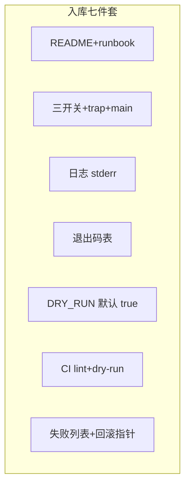

# 12｜生产脚本规范与模板

> 凌晨三点 oncall 翻 Git：三个目录各有一份 `deploy.sh`，没有 README、退出码不统一、失败只 `echo ERROR`——Jenkins 绿着，游戏服却半套配置；想回滚，runbook 链接 404。群里喊「谁写的脚本谁负责」。
> **本章回答**：一份生产脚本从立项到值班——目录/README、骨架与开关、日志与退出码、巡检/发布模板、评审 CI、runbook——能入库、能交接、能让 CI 真红。
> **不讲**：三开关细节 → [02](../02-脚本骨架与三开关/)；参数解析 → [09](../09-参数解析与dry-run/)；SSH 批量 → [10](../10-SSH批量与远程执行/)；静态 lint → [11](../11-调试与shellcheck/)。

**标记**：🎯重点 · 🔥难点 · ⭐常考 · 🔧实操

---

## 面试怎么考

| 标记 | 考点 |
|------|------|
| **核心** | 脚本目录规范；`main "$@"`；日志 stderr；退出码契约；`DRY_RUN` 默认 true；runbook 链接 |
| **必会** | 巡检 vs 发布差异；失败汇总 `exit 1`；`usage` / `--help`；版本与变更记录 |
| **常用** | `SCRIPT_DIR`；`mktemp` + trap；结构化 `log`；`LOCK` 防并发；README 必填项 |
| **常考** | 生产脚本和 ad-hoc 区别；如何让 Jenkins 真红；runbook 写什么；谁可以 `DRY_RUN=false` |

> 📝 **面试（30 秒）**：生产脚本进 Git，目录固定：`scripts/<域>/name.sh` + `README.md` + runbook 链接。头：`set -euo pipefail`、trap、`log` 走 stderr、`main "$@"`。默认 `DRY_RUN=true`，真变更显式 false。退出码：0 成功、1 业务失败、2 用法错、127 缺依赖。巡检只读、发布有备份+校验+reload。CI：`bash -n` + shellcheck + dry-run。头注释写负责人、变更、runbook URL。

---

## 能力边界

| 维度 | 规范脚本 + runbook | ad-hoc ssh | Ansible/GitOps |
|------|-------------------|------------|----------------|
| **适合** | 重复巡检/发布、需审计 | 一次性 2 台 | 全量基础设施 |
| **不适合** | 无评审的拷贝粘贴 | 入库无文档 | 5 分钟紧急刀 |
| **交接** | README + runbook | 人口相传 | playbook 即文档 |

- 🎚️ **三类脚本，风险递增**
  - **巡检**：低风险只读——并发、失败列表、指标输出
  - **发布**：高风险变更——DRY_RUN、备份、校验、回滚指针
  - **数据修复**：极高风险——双人复核、事务、备份

> 🎯 **能入库的脚本 = 规范 + 可测 + 可回滚指针 + runbook**——缺一项都是技术债。

---

## 语言最小集：生产脚本头

```bash
#!/usr/bin/env bash
# deploy-nginx.sh — 滚动更新 Nginx 配置
# Owner: sre-team@example.com | Runbook: https://wiki.example.com/rb/nginx-deploy
# Changelog: 2026-09-01 init
set -euo pipefail
IFS=$'\n\t'
SCRIPT_DIR="$(cd "$(dirname "${BASH_SOURCE[0]}")" && pwd)"
readonly SCRIPT_NAME=${0##*/}

log() { printf '[%s] %s\n' "$(date '+%F %T')" "$*" >&2; }
die() { log "FATAL: $*"; exit 1; }

usage() { sed -n '2,8p' "$0" | sed 's/^# \{0,1\}//'; exit 2; }
[[ "${1:-}" == "-h" || "${1:-}" == "--help" ]] && usage

main() { :; }
main "$@"
```

- 🧩 **头文件钉子**
  - 头注释：用途 · Owner · Runbook · Changelog（给 3am oncall，不是替代 `git log`）
  - `log` → stderr；`usage` → `exit 2`
  - `main "$@"` → 可测、防 source 误跑

零件认完，上主图。

---

## 一、一张图：一份生产脚本从规范到上线的一生

> 🎯 **一句话**：**立项规范 → 骨架与开关 → 日志/退出码 → 模板实现 → 评审 → CI → runbook 演练 → 上线/值班**。


- 📖 **读图**
  - 🛤️ 左「立项」到右「回滚」是脚本**组织生命周期**，不是单次执行
  - ⚙️ 单次执行另有一条线：解析参数 → dry-run 分支 → 并发/SSH → failed → `exit 1`
  - 📟 Jenkins/监控认的是最右侧**进程退出码**和 runbook 是否可执行

本节对应练习题 Q1、Q14。

---

## 二、出生：目录 · 命名 · README ⭐

> 🎯 **一句话**：**一脚本一目录**，`name.sh` + `README.md` +（可选）`hosts.example`——禁止三个 `deploy.sh` 散落。

### 📁 推荐布局

```text
scripts/
  nginx/
    deploy-nginx.sh
    check-nginx.sh
    README.md
    hosts.example
```

- 🔑 **为什么按域分目录**
  - 搜得到：`scripts/nginx/` 一眼找齐巡检与发布
  - 审得过：MR 改一个域，diff 不和别的业务搅在一起
  - 交得接：新人不用问「哪份 deploy 是真的」

### 📝 README 必填（🔧实操）

```markdown
# deploy-nginx.sh

## 用途
滚动 scp 配置 + nginx -t + reload
## 前置
- 跳板机密钥、hosts 文件
## 用法
DRY_RUN=false SRC=./nginx.conf DST=/etc/nginx/nginx.conf ./deploy-nginx.sh hosts.txt
## 退出码
0 ok | 1 有失败主机 | 2 参数错 | 127 缺命令
## Runbook
https://wiki.example.com/rb/nginx-deploy
## 负责人
@sre-oncall
```

#### ❓ 为什么 README 不是可选文档？

- 🌙 **3am 场景**：没有用法示例 → oncall 不敢跑；没有退出码表 → 不知道 Jenkins 红意味着什么；没有 runbook → 失败只能喊人
- ✅ **六项缺一不可**：用途 · 前置 · 用法 · 退出码 · runbook · 负责人
- ❌ **别当**：给老板的 PPT——写给**值班手边**的操作说明书

> 📝 **面试**：「脚本没有 README 等于没入库；runbook 写失败怎么办、谁审批 DRY_RUN=false。」⭐（Q1、Q2）

本节对应练习题 Q1、Q2。

---

## 三、筑基：骨架 · 三开关 · trap（复习 02）

> 🎯 **一句话**：生产脚本**禁止**裸全局逻辑——**`main "$@"` + trap 清理 + 三开关**。

```bash
cleanup() {
  local rc=$?
  [[ -n "${tmpdir:-}" && -d "$tmpdir" ]] && rm -rf "$tmpdir"
  exit "$rc"
}
trap cleanup EXIT
trap 'log "SIGTERM"; exit 143' TERM
```

- 🧱 **三件套各自管什么**（细节见 [02](../02-脚本骨架与三开关/)）
  - `set -euo pipefail` → 错就停、禁空变量、管道全链问责
  - `trap` → 任何离开路径清临时文件/锁
  - `main "$@"` → 业务进函数，底部才入口

#### ❓ 为什么 cleanup 必须 `exit "$rc"`？

- 🧹 trap 跑完若**没有** `exit "$rc"`，函数正常返回 → 整脚本变成 **0**
- 🔥 CI 看到绿灯，实际业务已失败——开头「Jenkins 绿、半套配置」的经典成因之一
- ✅ 先 `local rc=$?`，清理完再 `exit "$rc"`（Q6）

> ⚠️ **别混**：`cleanup` 里必须 **`exit "$rc"`**，否则清理把失败洗成 0。

本节对应练习题 Q6、Q11。

---

## 四、说话：日志规范 🔥⭐

> 🎯 **一句话**：**日志走 stderr**，stdout 留给**机器可读结果**（JSON/主机列表）；带 **时间戳、级别、脚本名**。

🔥 口诀：**日志走 stderr，数据走 stdout**——和 [05 函数与作用域](../05-函数与作用域/) 通道伦理同一套。

```bash
readonly LOG_LEVEL=${LOG_LEVEL:-info}

log() {
  printf '[%s] [%s] %s: %s\n' \
    "$(date '+%F %T')" "$LOG_LEVEL" "$SCRIPT_NAME" "$*" >&2
}

log_warn() { LOG_LEVEL=warn log "$@"; }
log_err()  { LOG_LEVEL=error log "$@"; }
```

```bash
# 机器可读成功输出（给下游 jq / Prometheus textfile）
check_disk_ok() {
  df -P /data | awk 'NR==2{print "{\"mount\":\"/data\",\"use_pct\":" $5 "}"}'
}
```

> 💡 **打个比方**：stdout 是「交付物」，stderr 是「施工日记」——CI 抓日志别把 JSON 和 debug 搅在一起。

#### ❓ 为什么不能全打到 stdout？

- 📊 监控要 `jq` / textfile 吃干净 JSON；人要读时间戳日记
- 🔀 混在一起 → 管道下游解析炸、或人读日志时把指标当噪音丢了
- ✅ 现场分流：

```bash
./check.sh > /var/lib/node_exporter/textfile/check.prom 2>>/var/log/check.log
# stdout → 指标；stderr → 人读
```

> 🔍 **现场**：上面一行就是「交付物 / 日记」分家；CI 归档 stderr，监控吃 stdout。

本节对应练习题 Q5。

---

## 五、交卷：退出码契约 🔥⭐

> 🎯 **一句话**：团队统一表，**Jenkins/GitLab 只认 0/非 0**——但脚本内部要用**不同非 0** 区分用法错与业务失败。

🔥 开头「Jenkins 绿着、游戏服半套配置」——多半是退出码契约没立住。

| 码 | 含义 | 典型场景 |
|----|------|----------|
| 0 | 成功 | 全主机 ok |
| 1 | 业务/执行失败 | failed 列表非空 |
| 2 | 用法错误 | 缺参数、`--help` 外非法 flag |
| 127 | 依赖缺失 | `kubectl` not found |
| 130 | 用户中断 | Ctrl+C |
| 143 | SIGTERM | K8s preStop |

```bash
need_cmd() {
  command -v "$1" >/dev/null 2>&1 || {
    log_err "missing dependency: $1"
    exit 127
  }
}
```

#### ❓ 为什么还要细分非 0，CI 不是只认红绿？

- 📟 **CI 层**：只要非 0 就红——够拦合并
- 🧑‍💻 **人层**：`exit 2` = 自己写错参数；`exit 1` = 业务/主机失败；`exit 127` = 环境缺工具——值班 10 秒定责
- ❌ **禁止**：只 `echo ERROR` 仍 `exit 0`；`|| true` 糊失败；批处理末尾 failed 不 `exit 1`

> 📝 **面试**：「禁止只 echo ERROR 仍 exit 0；禁止 `|| true` 糊失败；批处理末尾 failed 必须 exit 1。」⭐（Q3）

本节对应练习题 Q3。

---

## 六、干活：DRY_RUN · 参数 · 锁（复习 09）

> 🎯 **一句话**：**`DRY_RUN` 默认 true**；真执行要 **`DRY_RUN=false` 显式** + runbook 审批；长任务 **`flock`** 防 cron 重叠。

```bash
DRY_RUN=${DRY_RUN:-true}
HOSTS_FILE=${1:?usage: $0 hosts.txt}

run_step() {
  local desc=$1
  shift
  if [[ "$DRY_RUN" == true ]]; then
    log "[DRY-RUN] $desc: $*"
    return 0
  fi
  "$@"
}
```

### 🔒 flock 防重叠（🔧实操）

```bash
LOCK=/var/lock/deploy-nginx.lock
exec 9>"$LOCK"
flock -n 9 || { log_warn "another instance"; exit 0; }
```

- 🧰 **进阶两种模式**
  - 等待超时：`flock -w 30 9 || { log_err "lock timeout"; exit 1; }`
  - 跨脚本协调：共用 `/var/lock/deploy-global.lock`，两个发布脚本不能同时跑

#### ❓ 为什么 DRY_RUN 默认 true 而不是 false？

- 🛡️ 默认安全：漏写环境变量 → 只打日志不改生产
- ✍️ 真变更必须**显式** `DRY_RUN=false`——可进 runbook 审批与 CR 清单
- ⚠️ 巡检可 dry-run 演练连通性；发布**真执行前**还要二次确认 `STAGE`（见八节）

> 🔥 **难点**：`flock` 的 fd 生命周期——`exec 9>"$LOCK"` 在主作用域打开，脚本退出才关 fd、放锁；函数内打开再返回会丢锁。

### 📡 结构化指标（stdout JSON）

```bash
emit_metric() {
  local host=$1 status=$2
  printf '{"host":"%s","status":"%s","ts":"%s"}\n' \
    "$host" "$status" "$(date -Iseconds)"
}
```

本节对应练习题 Q4、Q11。

---

## 七、模板 A：完整巡检脚本（只读 · 🔧）

> 🎯 **一句话**：**读 hosts → 并发检查 → 指标/失败列表 → exit 1**——不改系统状态。下面模板**一字不改**可复制。

```bash
#!/usr/bin/env bash
# check-cluster-health.sh — 集群节点巡检（只读）
# Runbook: https://wiki.example.com/rb/check-cluster
set -euo pipefail
SCRIPT_DIR="$(cd "$(dirname "${BASH_SOURCE[0]}")" && pwd)"
SCRIPT_NAME=${0##*/}
DRY_RUN=${DRY_RUN:-true}
PARALLEL=${PARALLEL:-16}
HOSTS_FILE=${1:?usage: $0 hosts.txt}

log() { printf '[%s] %s: %s\n' "$(date '+%F %T')" "$SCRIPT_NAME" "$*" >&2; }

SSH_OPTS=(-o BatchMode=yes -o ConnectTimeout=10)
FAILED=$(mktemp)
trap 'rm -f "$FAILED"' EXIT

check_one() {
  local host=$1
  if [[ "$DRY_RUN" == true ]]; then
    log "[DRY-RUN] check $host: disk/load/nginx"
    return 0
  fi
  if ! ssh -n "${SSH_OPTS[@]}" "$host" 'bash -s' <<'REMOTE'
set -euo pipefail
df -P /data | awk 'NR==2{gsub(/%/,""); if($5+0>85) exit 1}'
systemctl is-active --quiet nginx
REMOTE
  then
    echo "$host" >>"$FAILED"
    return 1
  fi
  printf '{"host":"%s","status":"ok"}\n' "$host"
}

export -f check_one
export SSH_OPTS FAILED DRY_RUN SCRIPT_NAME
export -f log

grep -vE '^\s*($|#)' "$HOSTS_FILE" | \
  xargs -r -P "$PARALLEL" -I{} bash -c 'check_one "$1"' _ {}

if [[ -s "$FAILED" ]]; then
  log "FAILED hosts:"
  cat "$FAILED" >&2
  log "runbook: https://wiki.example.com/rb/check-cluster#failed"
  exit 1
fi
log "all ok"
```

```text
{"host":"game-01","status":"ok"}
{"host":"game-02","status":"ok"}
[2026-09-01 03:00:01] check-cluster-health.sh: all ok
# ← stdout JSON 给监控；stderr 日记
```

- 📋 **巡检要素清单**（Q7）
  - 只读：不 `scp`、不 `reload`、不改文件
  - 并发上限 `PARALLEL`；失败进临时文件；末尾非空 `exit 1`
  - stdout 指标、stderr 人读；头注释挂 runbook

本节对应练习题 Q7。

---

## 八、模板 B：完整发布脚本（变更 · 🔥⭐）

> 🎯 **一句话**：**备份 → 下发 → 校验 → reload → failed 列表**；任一步失败**不 reload**；runbook 写回滚。下面模板**一字不改**可复制。

```bash
#!/usr/bin/env bash
# deploy-nginx.sh — Nginx 配置滚动发布
# Runbook: https://wiki.example.com/rb/nginx-deploy
set -euo pipefail
SCRIPT_DIR="$(cd "$(dirname "${BASH_SOURCE[0]}")" && pwd)"
SCRIPT_NAME=${0##*/}

DRY_RUN=${DRY_RUN:-true}
SRC=${SRC:?set SRC=local/nginx.conf}
DST=${DST:?set DST=/etc/nginx/nginx.conf}
HOSTS_FILE=${1:?usage: DRY_RUN=false SRC=... $0 hosts.txt}

log() { printf '[%s] %s: %s\n' "$(date '+%F %T')" "$SCRIPT_NAME" "$*" >&2; }

SSH_OPTS=(-o BatchMode=yes -o ConnectTimeout=15)
failed=()

deploy_host() {
  local host=$1
  if [[ "$DRY_RUN" == true ]]; then
    log "[DRY-RUN] $host: backup scp nginx -t reload"
    return 0
  fi
  local bak="${DST}.bak.$(date +%Y%m%d%H%M%S)"
  scp -q "${SSH_OPTS[@]}" "$SRC" "$host:${DST}.new"
  ssh -n "${SSH_OPTS[@]}" "$host" bash -s -- "$DST" "$bak" <<'REMOTE'
set -euo pipefail
dst=$1; bak=$2
cp -a "$dst" "$bak"
mv -f "${dst}.new" "$dst"
nginx -t
systemctl reload nginx
REMOTE
}

while read -r host; do
  [[ -z "$host" || "$host" =~ ^# ]] && continue
  if ! deploy_host "$host"; then
    failed+=("$host")
    log "FAIL $host — see runbook rollback section"
  fi
done <"$HOSTS_FILE"

if ((${#failed[@]} > 0)); then
  log "FAILED (${#failed[@]}): ${failed[*]}"
  log "ROLLBACK: https://wiki.example.com/rb/nginx-deploy#rollback"
  printf '%s\n' "${failed[@]}" >"/tmp/${SCRIPT_NAME%.sh}-failed-$(date +%s).txt"
  exit 1
fi
log "deploy ok; DRY_RUN=$DRY_RUN"
```

#### ❓ 为什么 `nginx -t` 失败就不能 reload？

- 🧪 `-t` 是配置语法/引用校验；失败仍 reload → 线上用坏配置或 reload 失败半残
- 📦 远端顺序硬约束：`cp -a` 备份 → `mv` 就位 → `nginx -t` → **通过才** `reload`
- 🔙 失败主机进 `failed[]`，打 runbook rollback 链接，**不**对失败机盲目重发全量

> ⚠️ **别混**：发布脚本**默认 DRY_RUN=true**；巡检可以 dry-run，发布**真执行前**必须二次确认 `DRY_RUN=false` 与 `STAGE`。

### 收束：生产脚本凭什么能值班



- 📖 **读图**
  - 🧩 七件套是**组织与单次执行**的交集
  - ❌ 缺 README/runbook → 交接不能；缺退出码 → CI 假绿；缺 DRY_RUN → 误触生产
  - 🚫 **不保证**：业务正确性（要测试）；自动回滚（要 playbook/备份恢复步骤）

本节对应练习题 Q8、Q12、Q14。

---

## 九、评审与上线：CR · CI · 演练

> 🎯 **一句话**：MR 必过 **shellcheck + dry-run**；上线前 **runbook 桌上演练**；oncall 能在 wiki 找到**失败分支**。

### ✅ Code Review 清单 ⭐

| 项 | 问 |
|----|-----|
| 引号 | 变量是否 `"$var"` |
| 秘密 | 是否硬编码 token |
| 退出码 | 失败是否 `exit 1` |
| DRY_RUN | 默认 true？ |
| 并发 | 是否有上限 |
| 日志 | 秘密是否可能进 log |
| runbook | URL 是否有效 |

### 🚪 CI 片段（与 11 章联动）

```yaml
deploy-script-test:
  script:
    - bash -n scripts/nginx/deploy-nginx.sh
    - shellcheck -S warning -x scripts/nginx/deploy-nginx.sh
    - DRY_RUN=true SRC=fixtures/nginx.conf DST=/etc/nginx/nginx.conf \
        ./scripts/nginx/deploy-nginx.sh fixtures/hosts.txt
```

#### ❓ 为什么 merge 不等于上线？

- 🔀 merge 只保证「进了 Git + CI 绿」
- 🚀 上线还要：**runbook 演练** + **变更窗口** + **负责人签字 `DRY_RUN=false`**
- 📖 runbook rollback 至少写：失败现象、备份恢复命令、负责人/审批人（Q9）

> 📝 **面试**：「上线不是 merge，是 runbook 演练 + 窗口 + 负责人签字 DRY_RUN=false。」（Q10、Q13）

### 📌 Changelog 头注释

```bash
# Changelog:
#   2026-09-01 v1.3  add flock 防并发（@alice）
#   2026-08-15 v1.2  DRY_RUN 默认改 true（@bob）
#   2026-07-01 v1.0  init（@charlie）
```

> ⚠️ **别混**：`Changelog` 注释不是 `git log` 替代品——给 **3am oncall** 的最近 3～5 条摘要。

本节对应练习题 Q9、Q10、Q13。

---

## 十、作战：CI 绿现场挂了 / 找不到脚本 / 无法回滚

> 🎯 **一句话**：先分「假绿 / 真红」，再找 runbook，再按 failed 列表回滚——别全量重跑赌运气。

```mermaid
flowchart TD
    A[变更事故] --> B{CI 绿?}
    B -->|是| C[查 exit 0 假象 / || true]
    B -->|否| D[读 stderr 末尾 + failed 文件]
    D --> E{有 runbook?}
    E -->|否| F[补 README+回滚节]
    E -->|是| G[按 runbook 回滚备份]
```

- 📖 **读图**：绿 → 先查退出码契约被绕过；红 → 读 stderr + failed；两边最终都要落到**可执行的回滚命令**

| 现象 | 先做 | 别做 |
|------|------|------|
| CI 绿现场挂 | grep `\|\| true`、failed 未 exit 1 | 再跑一遍希望好 |
| 找不到脚本 | `scripts/` 规范搜索 | 用个人 home 目录版 |
| 半套配置 | 查 failed 列表谁成功 | 无差别全量重发 |
| runbook 404 | 用备份路径回滚 | 徒手改生产 |

**60 秒剧本** 🔧：

- **0–15s**：查 Jenkins 退出码与脚本 stderr 末尾
- **15–30s**：打开 README runbook 链接，找 rollback 节
- **30–45s**：对 failed 主机执行备份恢复（`cp bak`）
- **45–60s**：补 ticket：修 exit 码 / 补 runbook

本节对应练习题 Q12、Q14。

---

## 踩坑清单

| 现象 | 原因 | 修法 |
|------|------|------|
| CI 绿现场错 | exit 0 + ERROR 字符串 | 退出码契约 |
| 误触生产 | DRY_RUN 默认 false | 改默认 true |
| 日志无法管道 | stdout stderr 混 | 结构化分离 |
| 并发发布打架 | 无 flock | `flock -n` |
| 回滚找不到 | 无 bak 路径规范 | 发布脚本写 bak 名 |
| 三人三版 deploy | 无目录规范 | `scripts/<域>/` |
| runbook 过期 | 无负责人 | README Owner |
| 秘密进 Git | 硬编码 | env/密钥管理 |
| `--help` 没有 | 无 usage | `-h` → sed 头注释 |
| 子 shell failed 丢 | 管道 while | 输入重定向 |

---

## 必会 · 常考

| 说法 | 对错 | 口径 |
|------|:----:|------|
| echo ERROR 够表示失败 | 错 | 要 exit 非 0 |
| DRY_RUN 应默认 false | 错 | 默认 true |
| stdout 打 debug 没问题 | 错 | 日记走 stderr |
| 发布脚本可不备份 | 错 | `cp -a` 带时间戳 |
| README 可选 | 错 | 入库必备 |
| runbook 写给老板看 | 错 | 写给 3am oncall |
| 巡检可改系统 | 错 | 只读 |
| main 可有可无 | 错 | 可测与防 source 误跑 |
| exit 2 表用法错 | 对 | 团队约定 |
| CI 只跑脚本不 lint | 错 | `-n` + shellcheck |

---

## 命令速查 🔧

```bash
DRY_RUN=true ./script.sh hosts.txt     # 默认演练
DRY_RUN=false STAGE=prod ./script.sh   # 真执行
bash -n script.sh && shellcheck -x script.sh
head -20 script.sh                     # 看 runbook 注释
./script.sh --help                     # usage
echo $?                                # 交卷码
```

---

## 面试锚点

| 问 | 30 秒答 |
|----|---------|
| 生产脚本和 ad-hoc 区别？ | 规范目录、README、退出码、CI、runbook |
| 日志怎么分？ | 结果 stdout，日记 stderr |
| DRY_RUN 为什么默认 true？ | 防误操作；真变更显式 false |
| 发布脚本最小步骤？ | 备份、下发、校验、reload、failed |
| CI 如何验脚本？ | `bash -n`、shellcheck、DRY_RUN 集成 |
| runbook 写什么？ | 失败现象、回滚命令、负责人、审批 |

---

## 易错一句话对照

- 错：三个 `deploy.sh` 散落 → 对：`scripts/<域>/` + README
- 错：失败 echo 不 exit → 对：`exit 1` + failed 列表
- 错：DRY_RUN 默认 false → 对：默认 true
- 错：无 runbook → 对：头注释 + README 双链
- 错：发布不备份 → 对：`cp -a` 时间戳 bak
- 错：stdout 打日志 → 对：stderr 日记、stdout 交付
- 错：cleanup 不 `exit "$rc"` → 对：先抓 `rc` 再退出
- 错：merge 即上线 → 对：演练 + 窗口 + 显式 `DRY_RUN=false`

---

## 数字墙

> 退出码背 **0 / 1 / 2 / 127**（另记 130/143）；`flock` 重叠实例常 **exit 0** 表示跳过；备份后缀 `%Y%m%d%H%M%S`；CI 三门禁：`bash -n` + `shellcheck` + `DRY_RUN=true`；README **六项**必填。

---

## 合上书，问自己

- [ ] **默画**脚本从立项到 runbook 回滚的组织生命周期（Q1、Q14）
- [ ] README 最少写哪六项（Q2）？
- [ ] 退出码 0/1/2/127 各表示什么？Jenkins 认什么（Q3）？
- [ ] 巡检与发布模板核心差异：是否改状态、DRY_RUN、备份（Q7、Q8）？
- [ ] 为什么日志要 stderr、指标要 stdout（Q5）？
- [ ] `cleanup` 里为什么要 `exit "$rc"`（Q6）？
- [ ] MR 进 main 前 CI 应跑哪三步（Q10）？
- [ ] runbook rollback 节至少写哪三条命令级步骤（Q9）？

全部打勾后，找同事十分钟讲清「三份 deploy.sh、runbook 404、Jenkins 假绿——规范缺哪几项」。讲得下来，你就是下一个能拦住「谁写的谁负责」甩锅的人。

八题能口述，Shell 模块（01～12）骨架、SSH、排错、规范就闭环。综合实战见 [05-运维开发实战题](../../05-运维开发实战题/)。
