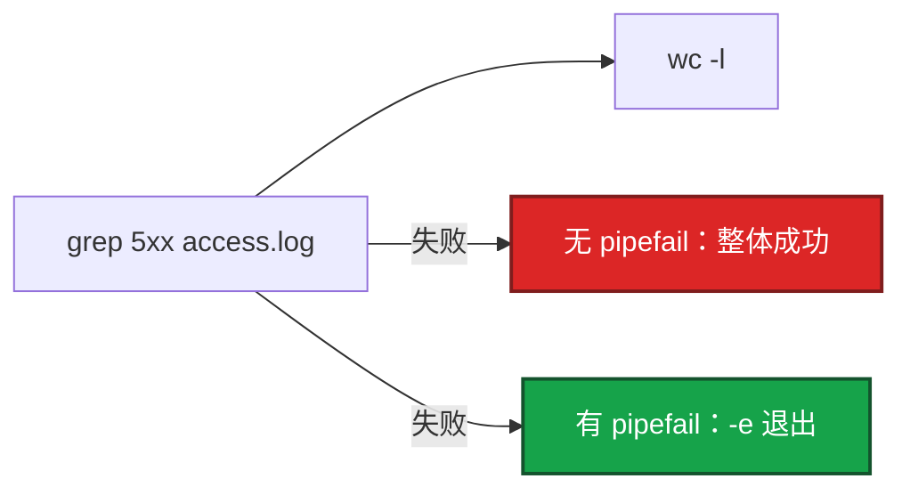

# 01｜Shell · 练习题

先对照 [知识点](知识点.md) **面试怎么考** 自己口述，再对答案。关键字（pipefail、trap、wait、xargs -P）要能点名。每题标了覆盖范围：

| 标记 | 含义 |
|------|------|
| **核心** | 不懂整章就没建立起来 |
| **必会** | 值班和面试都要能讲 |
| **常用** | 线上会反复碰到 |
| **常考** | 白板和追问的高频口径 |

## 本题目录

- [Q1 三开关](#q1)
- [Q2 引号与 -u](#q2)
- [Q3 trap](#q3)
- [Q4 后台 wait / 战斗服](#q4)
- [Q5 何时换 Python](#q5)
- [Q6 bash -x / shellcheck](#q6)
- [Q7 探活等待](#q7)
- [Q8 one-liner 列号](#q8)
- [Q9 SSH / xargs](#q9)
- [Q10 读代码找 bug](#q10)
- [合上书](#合上书)

---

## Q1

**★★★★★｜`set -euo pipefail` 各干什么？缺哪个会出事？**

**覆盖**：核心 · 必会 · 常考

**对应**：知识点 §3.1 · 语法必会 §1

### 场景

开服检查脚本拷完 Redis 配置后 `nginx -t` 失败，脚本仍继续 `systemctl reload`，大厅 502。有人说「我开了 `-e` 为什么没停」。

### 完整解答

**一句话**：三开关是一套：-e 失败即退、-u 抓未定义变量、pipefail 让管道任一失败整体失败。

没有 `pipefail` 的 `-e` 是半套。



1. **`-e`**：命令失败立刻退。没有它，拷配置失败仍 reload。
2. **`-u`**：未定义变量报错。没有它，`rm -rf $EMPTY/` 在未加引号时可能变成 `rm -rf /`。
3. **`-o pipefail`**：管道任一失败整体失败。默认只看最后一条：`false | true` 成功。

`-e` 在 `if cmd`、`cmd || fallback` 里不会停——那是显式处理失败。「开了 `-e` 管道没停」先查有没有 `pipefail`。

谁失败看 `${PIPESTATUS[@]}`，管道一结束立刻读。

```bash
#!/usr/bin/env bash
set -euo pipefail
grep 5xx access.log | wc -l
echo "${PIPESTATUS[@]}"
```

### 再追问

- `set +e` 整文件关掉算稳健吗？——不算。只在你清楚的一小段允许失败，段末立刻 `set -e`。
- `if nginx -t; then reload; fi` 里 `nginx -t` 失败会不会被 `-e` 杀掉？——不会。条件里的失败是分支。

---

## Q2

**★★★★★｜变量为什么必须加引号？`set -u` 能不能替代引号？**

**覆盖**：核心 · 必会 · 常考

**对应**：知识点 §3.2 · 语法必会 §2

### 场景

脚本 `scp $CFG /etc/nginx/`，配置路径里有空格。scp 参数裂开，把错误文件推到了邻服目录。

### 完整解答

**一句话**：变量必须加引号防分词/glob；-u 不能替代引号，空字符串 -u 放过仍会裂开。

```bash
scp "$CFG" host:/etc/nginx/
"${SERVERS[@]}"          # 每台主机独立参数
${SERVERS[@]}            # 再分词，主机名带空格就错
```

1. 用 `[[ ]]` 判字符串，不要默认 `[ ]`。
2. `"$@"` 保留参数边界；`"$*"` 糊成一串。
3. 函数 `local`，别污染全局。
4. 数字用 `-lt` / `-gt`，不要 `>`（那是重定向）。

`set -u` **不能替代引号**：未定义被 `-u` 抓住；已定义但为空（`CFG=""`）`-u` 放过，未加引号仍会裂开。

### 再追问

`: "${ENV:?ENV required}"` 解决什么？——必填环境变量：空或未定义立刻退。

---

## Q3

**★★★★★｜trap 解决什么？Ctrl-C 之后临时文件谁清？**

**覆盖**：核心 · 必会 · 常考

**对应**：知识点 §语法必会 §4

### 场景

开服脚本 `mktemp` 写了半份 server_id 占用表，同事 Ctrl-C 打断。锁文件还在，下一班以为 ID 被占，开服卡死。

### 完整解答

**一句话**：trap EXIT 在正常/失败/Ctrl-C 时都清临时文件和锁；清理要幂等，不要在 trap 里再部署。

```bash
TMP="$(mktemp)"
cleanup() { rm -f "$TMP" "$LOCK"; }
trap cleanup EXIT
```

SIGINT 默认会走到 EXIT。不要在 trap 里做复杂不可失败的发布。ERR trap 可打堆栈，生产更常见 EXIT 清理。

### 再追问

trap 里再 `exit 1` 会怎样？——可能冲掉原来的失败原因。清理尽量幂等、`rm -f`。

---

## Q4

**★★★★★｜后台 `&` + `wait` 的坑？滚动重启战斗服能不能全员并行？**

**覆盖**：核心 · 必会 · 常考

**对应**：知识点 §3.3 · 语法必会 §5

### 场景

`for s in battle-1 battle-2 battle-3; do restart $s &; done; wait`，三个战斗服一起重启，在线玩家集体掉线。脚本退出码还是 0。

### 完整解答

**一句话**：后台必须按 pid wait 收码；战斗服/有状态服串行滚动，无状态可有限并行。

```bash
fail=0
pids=()
for s in login gate; do
  deploy "$s" "$VER" &
  pids+=("$!")
done
for pid in "${pids[@]}"; do
  wait "$pid" || fail=1
done
[[ "$fail" -eq 0 ]] || exit 1
```

战斗服：**一台成功再下一台**，失败立刻停。必须探活，不能只看 restart 返回码。

### 再追问

`wait` 不加 pid 呢？——默认退出码是最后一个结束的任务，中间失败仍可能被当成成功。

---

## Q5

**★★★★☆｜什么时候改用 Python？现场 awk 能不能当变更记录？**

**覆盖**：必会 · 常用 · 常考

**对应**：知识点 §3.5 · 能力边界

### 场景

群里贴了一条 12 段管道「把登录 5xx 按区服聚合好了」。第二天活动再发，没人能重放，字段还对不上新的 `log_format`。

### 完整解答

**一句话**：Shell 编排命令，复杂 JSON/HTTP/重试超一屏用 Python；one-liner 只排障不当变更记录。


生产禁止把不可复现的 one-liner 当变更记录。列号风险：先 `head -1` 对 `log_format`。

### 再追问

开服 50 服要调平台 HTTP API，仍用 bash curl 循环吗？——不要。超时、重试、失败汇总用 Python（02、04）。

---

## Q6

**★★★★☆｜`bash -x` 和 shellcheck 注意什么？**

**覆盖**：必会 · 常用

**对应**：知识点 §语法必会 §9

### 场景

有人把 `set -x` 留在生产发布脚本里，token 打进 CI 日志。安全同学要立刻 rotate。

### 完整解答

**一句话**：bash -x 会泄漏 token，调试完立刻关；提交前 shellcheck，CI 里跑。

```bash
shellcheck hall-restart.sh
log() { echo "[$(date '+%F %T')] $*" >&2; }   # 明文密钥永远不要 echo
```

CI 临时 `-x` 可以，先确认 job 日志谁能看。调试完 `set +x`。

### 再追问

`${PIPESTATUS[@]}` 在 `set -x` 下仍可用，必须立刻读。

---

## Q7

**★★★★☆｜等待服务启动怎么写才安全？**

**覆盖**：必会 · 常用

**对应**：知识点 §语法必会 §8 · 生产模板 B

### 场景

发布脚本 `while true; do curl health && break; done`，游戏服卡在迁移，流水线挂了 40 分钟。

### 完整解答

**一句话**：探活循环必须有上限和 curl --max-time；禁止无上限 while true 吃窗口。

```bash
for i in $(seq 1 30); do
  curl -sf --max-time 2 "http://127.0.0.1:8080/health" && exit 0
  sleep 2
done
log "health timeout" >&2
exit 1
```

上层 CI 只看退出码：成功 0，失败非 0。

### 再追问

探活过了就能对玩家开放吗？——不能。对玩家可见要走验收门禁（08 开服章）。

---

## Q8

**★★★★☆｜举三条现场 one-liner，并说明列号风险。**

**覆盖**：必会 · 常用

**对应**：知识点 §生产模板 D

### 场景

活动开始 5 分钟，登录 502。有人用 `$9` 当状态码统计，自定义 `log_format` 把 RT 插在前面，统计全错，误判「没有 5xx」。

### 完整解答

**一句话**：one-liner 前先 head -1 对 log_format；列号错则统计全错。

```bash
head -1 access.log
awk '{print $1, $7, $9}' access.log | head
awk '$9 >= 500 {print}' access.log | tail
```

RT 不一定在 `$NF`。10GB 先 grep 再 sort。这些 **不能当发布手段**，只排障。

### 再追问

压缩日志用 `zcat` / `zgrep`。经常查的进 Loki/ES（05）。

---

## Q9

**★★★★☆｜SSH 循环 100 台，怎么写才不会把失败吞掉？xargs -P 呢？**

**覆盖**：必会 · 常用 · 常考

**对应**：知识点 §语法必会 §6 · §10 · §3.4

### 场景

`for h in $(cat hosts); do ssh $h 'nginx -t'; done` 第 17 台认证失败，脚本退出码 0。另一次 `xargs -P 50` 把堡垒机打满。

### 完整解答

**一句话**：SSH 循环记失败主机最后非 0；xargs -P 有界并发，子进程失败要自己汇总。

```bash
failed=()
while IFS= read -r host; do
  [[ -z "$host" || "$host" == \#* ]] && continue
  if ! ssh -n -o ConnectTimeout=5 "$host" 'nginx -t'; then
    failed+=("$host")
  fi
done < hosts.txt
[[ ${#failed[@]} -eq 0 ]] || exit 1
```

`ssh` 会吃 stdin，循环里必须 `ssh -n`。并发上限约 **10**。

### 再追问

第 50 台失败，前 49 台已经 reload 了怎么办？——要有 bak 回滚。并行时必须汇总失败列表，不能假装原子（04）。

---

## Q10

**★★★★☆｜读代码找 bug：下面脚本哪里会「CI 绿、环境半残」？**

**覆盖**：必会 · 常考

**对应**：知识点 §踩坑清单 · §3.1

### 场景

```bash
#!/bin/bash
set -e
hosts=$(cat hosts.txt)
for h in $hosts; do
  scp nginx.conf $h:/etc/nginx/nginx.conf
  ssh $h "nginx -t || true && systemctl reload nginx"
done
echo done
```

CI 显示成功，第 3 台配置语法错误仍被 reload，大厅 502。

### 完整解答

**一句话**：缺 pipefail/-u、hosts 未引号、nginx -t 被 || true 吞掉——三处都会把失败变成功。

1. **`set -e` 无 `pipefail`、无 `-u`**：半套开关。
2. **`hosts=$(cat ...)` + `for h in $hosts`**：会再分词。
3. **`scp nginx.conf $h:...`**：`$h` 未引号。
4. **`nginx -t || true && reload`**：`-t` 失败仍 reload——门禁被 `\|\| true` 埋雷。

修法：

```bash
#!/usr/bin/env bash
set -euo pipefail
while IFS= read -r h; do
  scp nginx.conf "$h:/etc/nginx/nginx.conf"
  ssh -n "$h" "nginx -t && systemctl reload nginx"
done < hosts.txt
```

### 再追问

如果必须并行呢？——`xargs -P 10` + 函数里记 failed，最后非 0；仍要先 `-t` 再 reload。

---

## 合上书

- [ ] 能说出 `-e` / `-u` / `pipefail` 各挡什么，以及 `-e` 在 `if` / `\|\|` 里不停
- [ ] 能区分 `-u` 和引号；空字符串要自己判
- [ ] 能写 `trap EXIT` 清临时文件，且 trap 里不再 `exit`
- [ ] 能按 pid `wait` 收码；战斗服串行滚动
- [ ] 能写有上限的探活循环；SSH / `xargs -P` 汇总失败
- [ ] 能把 one-liner 和 Git 变更分开；`\|\| true` 只用在不影响目标的步骤
- [ ] 能读一段「看起来正常」的脚本，指出 pipefail / 引号 / `\|\| true` 三处坑
