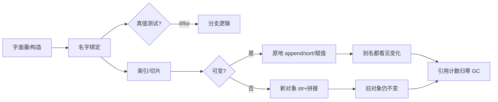
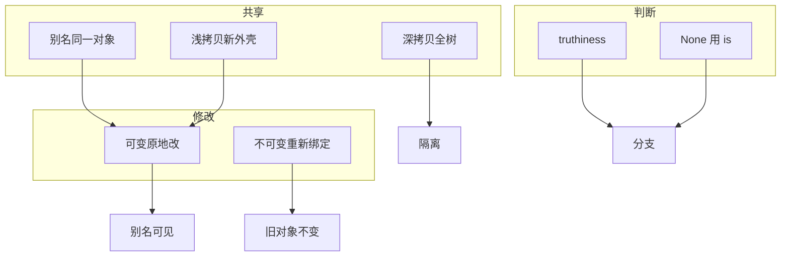

# 01｜基础语法与数据模型 · SRE 开发能力

> 活动前巡检里 `if hosts:` 明明有元素却跳过；有人 `sorted_list = raw_list.sort()` 得到 `None` 还往下传；切片改着改着原列表也变了——群里已经有人喊「脚本写坏了重写」，手就放在回滚键上。
> **本章回答**：一个 Python 对象从创建到被判断、被切片、被修改的一生——身份（`id`/`is`）、真值（truthiness）、可变性（mutability）、切片（slice）如何左右运维脚本写法。
> **不讲**：工程目录与 venv → [02](../02-工程结构与虚拟环境/)；`list`/`dict` 选型 → [03](../03-语言最小集与数据结构/)；`try/except` 与 `sys.exit` → [04](../04-异常与退出码/)；类型标注 → [14](../14-测试与类型标注/)。

**标记**：🎯重点 · 🔥难点 · ⭐常考 · 🔧实操

---

## 面试怎么考

| 标记 | 考点 |
|------|------|
| **核心** | 一切皆对象；`is` vs `==`；truthiness；可变 vs 不可变；切片是浅层新序列 |
| **必会** | `None` 用 `is None`；空容器为假；`list.sort()` 原地改返回 `None` |
| **常用** | `id()` 看身份；切片 `s[i:j:k]`；`copy()` / `list()` 防共享引用 |
| **常考** | `[] is []` 为 False；`a = b` 是绑定不是拷贝；`if not items` vs `is None` |

**30 秒怎么说**：变量是**名字绑定到对象**，不是盒子装值。`==` 比内容，`is` 比身份（通常只用于 `None`、单例）。空串、`0`、`[]`、`{}`、`None` 在真值测试里都是 False。可变对象（`list`/`dict`/`set`）原地改波及所有别名；不可变（`str`/`tuple`/`int`）「改」其实是新对象。切片 `s[a:b]` 对 list 得到新 list，嵌套元素仍可能共享——拼路径、过滤 Pod 列表时要分清拷贝还是引用。

---

## 能力边界

| 维度 | 懂对象模型 | 只会背语法 | Shell `jq` 一把梭 |
|------|------------|------------|-------------------|
| **适合** | 读同事脚本、改列表/字典逻辑、面试 Python 基础 | 抄模板跑通 | 一次性 JSON 过滤 |
| **不适合** | 替代类型系统（→14） | 复杂状态机无测试 | 需要异常与重试的长流程 |
| **你要会** | 为什么 `sort()` 返回 None、共享列表会串数据 | — | 何时该上 Python |

- 🎭 **三件事各管一段**
  - **truthiness**：管「`if config:` 进不进分支」——不保证配置语义对
  - **mutability**：管「改一处会不会全变」——不管并发安全（→[10](../10-并发与GIL/)）
  - **slice**：管子集 / 步长反转——**不做**嵌套深拷贝

> ⚠️ **别混**：对象模型是地基；后面数据结构选型、异常退出都站在「名字指向对象」之上。

---

## 语言最小集

读运维 Python 片段，先认这 14 个零件——认代码下限，不是语法大全。

| 零件 | 示例 | 含义 |
|------|------|------|
| 绑定 | `name = "prod"` | 名字指向对象，不是复制 |
| 类型 | `type(x)`、`isinstance(x, list)` | 运行时类型 |
| 身份 | `id(x)`、`x is y` | 是否同一对象 |
| 相等 | `x == y` | 值是否相等（可调 `__eq__`） |
| 真值 | `bool(x)`、`if x:` | 是否「假」 |
| 不可变 | `str`、`int`、`tuple` | 原地「改」会建新对象 |
| 可变 | `list`、`dict`、`set` | 原地改，所有别名可见 |
| 切片 | `s[1:4]`、`s[::2]`、`s[::-1]` | 子序列，步长可负 |
| None | `x is None` | 缺失哨兵，用 `is` 判断 |
| 方法副作用 | `lst.sort()` | 原地改，返回 `None` |
| 非原地 | `sorted(lst)` | 新列表，原列表不变 |
| 浅拷贝 | `lst.copy()`、`list(lst)` | 新容器，元素仍共享 |
| f-string | `f"{host}:{port}"` | 3.6+ 拼字符串首选 |
| 交互入口 | `python script.py` | 解释器加载模块执行 |

```python
hosts = ["10.0.0.1", "10.0.0.2", "10.0.0.3"]
active = hosts[1:]          # 切片 → 新 list 对象
active.append("10.0.0.99")  # 只改 active，hosts 不变

if not hosts:               # 空列表 → False，跳过
    raise SystemExit("no hosts")  # 规范退出见 04 章
```

---

## 一、一张图：一个 Python 对象的一生

> 🎯 **一句话**：**创建（绑定）→ 被问真假（truthiness）→ 被切片/索引 → 被改或换新（mutability）→ 被丢弃（GC）**。



- 📖 **读图**
  - 🛤️ 主线：绑定 → 真值 → 切片 → 可变/不可变 → GC
  - 💥 运维「怪行为」多半出在 **C（真值）** 与 **F（可变）**：`if not result` 把空列表和 `None` 混在一起；`a = b` 后改 `b` 牵连 `a`
  - 监控/CI 不直接看对象模型，但**错误的数据结构状态**会导致漏告警、误发布

本节对应练习题 Q1、Q13。

---

## 二、出生：名字、类型与身份 ⭐常考

> 🎯 **一句话**：`a = [1,2]` 是让名字 `a` **绑定**到一个 list 对象，不是把列表「拷贝进变量」。

### 📮 绑定（binding）🔥

- **绑定** = 名字贴到对象上，不是盒子装值
- `a = b` = 多贴一张条，**不是**复印一份——开头「预发多出生产 IP」的根因之一

```python
a = [1, 2, 3]
b = a              # b 与 a 指向同一 list
print(id(a), id(b))  # 相同整数
print(a is b)        # True

b = [1, 2, 3]      # 新 list，内容相等但身份不同
print(a == b)      # True
print(a is b)      # False
```

> 💡 **打个比方**：名字是便利贴，对象是机房里的服务器；贴两张条到同一台机器上，`append`（重启）两台「逻辑主机」一起变。

#### ❓ 为什么 `a = b` 不是拷贝？

- 🐍 Python 赋值语义是**引用绑定**，不是按值复制容器
- 📋 要独立副本：`list(b)` / `b.copy()`（浅）；嵌套用 `copy.deepcopy`
- 🔍 现场先 `print(id(a), id(b))`——相同 = 同一对象，改一处处处可见

### 🔑 `type` 与 `isinstance`

```python
pod = {"name": "nginx", "ready": True}
type(pod)                    # <class 'dict'>
isinstance(pod, dict)        # True —— 推荐用于类型判断
```

- 运维常见：`isinstance(x, str)` 区分「单个主机名」和「主机名列表」
- 避免 `for h in host` 把字符串拆成字符

> 📝 **面试**：「Python 变量是引用语义；`a = b` 共享对象；要独立副本用 `copy()` 或 `list(a)`。」⭐

本节对应练习题 Q1、Q14。

---

## 三、相等 `==` 与身份 `is` ⭐常考

> 🎯 **一句话**：`==` 问「内容一样吗」；`is` 问「是不是同一个对象」——**只有 `None` 和少数单例用 `is`**。

- 口诀：**`==` 比长相，`is` 比身份证号**
- 高频错答：「差不多，都行」——下一句往往是：`[] is []` 是 True 还是 False？

```python
[] == []        # True
[] is []        # False  ← 每次 [] 都是新 list

x = None
if x is None:   # 正确
    pass

if x == None:   # 能跑但不地道（PEP 8）
    pass
```

| 写法 | 场景 |
|------|------|
| `x is None` / `x is not None` | 哨兵、可选参数 |
| `x == y` | 字符串、数字、列表内容比较 |
| `x is y` | 几乎不用来比内容 |

#### ❓ 为什么 `None` 用 `is` 不用 `==`？

- 🪪 `None` 是单例：全进程只有一个 `None` 对象，`is` 比身份最稳
- 🧩 `==` 可被 `__eq__` 改写；自定义类可能把 `== None` 搞成 True
- 📜 PEP 8：`is None` / `is not None` 是官方口径

> ⚠️ **别混**：`if not x` 把「空列表」和「None」都当假；要区分用 `if x is None` 与 `if not x`（或 `len(x)==0`）分情况写清。

```python
def check_hosts(hosts):
    if hosts is None:
        hosts = []          # API 失败未赋值 vs 显式空列表
    if not hosts:
        return "skip"       # 空列表：无主机可扫
```

本节对应练习题 Q2。

---

## 四、真值：truthiness 🔥难点

> 🎯 **一句话**：`if obj:` 调用 `bool(obj)`，下列为 **False**，其余为 True。

- **truthiness** = 对象在布尔上下文里算真还是假
- Python 不问「是不是 True」，而问「你算不算『有东西』」

### 📭 假值（falsy）固定集合

- `None`、`False`
- 数值零：`0`、`0.0`、`0j`
- 空序列：`''`、`()`、`[]`
- 空映射 / 空集合：`{}`、`set()`

```python
errors = []
if errors:
    raise SystemExit(1)           # 非空才失败 —— 04 章

config_path = os.environ.get("CONFIG")
if not config_path:
    config_path = "/etc/app/config.yaml"   # 空串才走默认

count = 0
if count:
    print("never")        # 0 是假，不会打印
```

#### ❓ 为什么 `if not x` 不能替代 `x is None`？

- 🕳️ `if not x`：**空列表、空串、`0`、`None` 全进同一分支**——语义糊在一起
- ✅ 要区分「API 失败没赋值」和「扫到零台主机」：先 `is None` 再 `if not x`
- 🔍 **现场**：日志「有 Pod 列表却 skipped」——查是否把 `pods = []`（结果空）和 `pods = None`（API 失败）都写成了 `if not pods: continue`

```python
pods = client.list_pods()   # 失败时若返回 None 而非 []
if pods is None:
    raise RuntimeError("api failed")
if not pods:
    log.info("no pods, ok")
```

> 📝 **面试**：「`if x` 走 truthiness；空容器为假；别把 `is None` 和 `if not x` 混为一谈。」⭐

### 🧩 自定义对象的真值

- 类可实现 `__bool__` 或 `__len__`（`__len__` 为 0 则假）
- 第三方 SDK 对象偶尔「永远为真」——不确定时用 `is not None` 或显式字段

本节对应练习题 Q3、Q4。

---

## 五、可变性：mutability 🔥难点

> 🎯 **一句话**：**可变对象原地改，所有别名一起变；不可变对象「改」会绑定到新对象**。

- **mutability** = 对象能不能在原地被改
- list 像白板，擦了写所有人都能看见；str 像印章，要改只能盖一枚新的

| 类型 | 可变？ | 原地操作示例 |
|------|:------:|--------------|
| `list` | ✓ | `append`、`sort`、`+=` |
| `dict` | ✓ | `d[k]=v`、`update` |
| `set` | ✓ | `add`、`update` |
| `str` | ✗ | 无 `append`；`s += "x"` 建新 str |
| `tuple` | ✗ | 无 item 赋值（元素若为 list 则元素可变） |
| `int` | ✗ | `a += 1` 绑定新 int |

```python
# 陷阱：sort 返回 None
rows = [{"ts": 3}, {"ts": 1}]
rows.sort(key=lambda r: r["ts"])   # 正确，rows 已排序
bad = rows.sort()                  # bad is None
```

```python
# 别名共享
a = ["cn", "sg"]
b = a
b.append("us")
print(a)   # ['cn', 'sg', 'us']  ← a 也变了
```

#### ❓ 为什么 `list.sort()` 返回 `None`？

- 🎯 设计意图：区分**原地副作用**与**返回新对象**——避免 `x = x.sort()` 把 `None` 当列表用
- ✅ 正确两种写法：`lst.sort(...)` 或 `ordered = sorted(lst, ...)`
- ⚠️ `lst.reverse()` 同理返回 `None`；要新列表用 `lst[::-1]` / `reversed` + `list`

### 📦 浅拷贝 vs 深拷贝

```python
import copy
outer = [["pod-a"], ["pod-b"]]
shallow = copy.copy(outer)
shallow[0].append("x")
print(outer[0])   # ['pod-a', 'x']  ← 内层 list 仍共享

deep = copy.deepcopy(outer)
deep[0].append("y")
print(outer[0])   # 不受 deep 影响
```

#### ❓ 为什么浅拷贝救不了「嵌套 list 串数据」？

- 🥚 浅拷贝只换**外壳**：新 list/dict，**元素仍是同一批对象**
- 🪺 内层 list/dict 被 `append`/`update` 时，所有「浅副本」一起变
- 🛠️ 从模板 `dict` 生成多环境配置：用 `deepcopy`，或确认嵌套层也新建（→[03](../03-语言最小集与数据结构/)）

> ⚠️ **别混**：`a = b` 不是拷贝；`list(b)` / `b.copy()` 是浅拷贝；嵌套结构要 `deepcopy`。

本节对应练习题 Q5、Q6、Q8、Q9、Q10、Q14。

---

## 六、切片：slice 语法与边界 ⭐常考

> 🎯 **一句话**：`s[start:stop:step]` —— **含 start，不含 stop**；省略边界用默认值。

- 口诀：**左闭右开，负号从尾数**
- `s[1:4]` 取的是索引 1、2、3，没有 4

```python
line = "2026-09-01T12:00:00 ERROR disk full"
line[0:10]      # '2026-09-01'
line[::2]       # 隔一个取一个字符
line[::-1]      # 反转字符串

hosts = ["h1", "h2", "h3", "h4"]
hosts[1:3]      # ['h2', 'h3']
hosts[:2]       # 前两个
hosts[2:]       # 从索引 2 到末尾
hosts[-1]       # 最后一个
hosts[:-1]      # 除最后一个外全部
```

#### ❓ 为什么切片是左闭右开？

- 🧮 `len(s[i:j]) == j - i`（边界合法时）——心算长度不用 +1/-1
- ✂️ 相邻切分无重叠：`s[:k]` + `s[k:]` 拼回原序列
- 🛡️ 越界更安全：`s[100:200]` 超长返回空/截断，不抛；`s[100]` 可能 `IndexError`

### 📐 切片与可变对象

```python
nums = [0, 1, 2, 3, 4]
part = nums[1:4]    # 新 list [1, 2, 3]
part[0] = 99
print(nums)         # [0, 1, 2, 3, 4]  ← nums 不变

# 但用切片赋值会改原 list
nums[1:3] = [10, 20]
print(nums)         # [0, 10, 20, 3, 4]
```

> 🔍 **现场**：解析 `kubectl get pods` 按行拆分时 `lines[1:]` 跳过表头；`lines[-1]` 取最后一行——空输入切片返回 `[]` 不抛异常。

```python
lines = out.strip().splitlines()
if len(lines) < 2:
    return []
data_rows = lines[1:]   # 跳过 TITLE 行
```

### `slice` 对象

```python
sl = slice(1, None, 2)
"abcdef"[sl]   # 'bdf'
```

- 大文件或性能敏感时少用步长大切片；运维脚本数据量通常不大

本节对应练习题 Q7、Q11。

---

## 七、收束：对象模型凭什么支撑脚本正确性 🔥难点

> 🎯 **一句话**：**引用语义 + 真值规则 + 可变边界** 决定数据会不会「悄悄串台」。



- 📖 **读图**
  - 🧭 左：分支靠 truthiness / `is None` 分清「没有」的几种含义
  - 🔗 中：别名 / 浅拷 / 深拷决定「改了谁看得见」
  - ✏️ 右：可变原地 vs 不可变换新——面试按这三组背

**可背清单（六件套）**：

- 变量是绑定，不是拷贝
- `==` 比内容，`is` 比身份；`None` 用 `is`
- 空容器、`0`、`""`、`None` 为假
- `list.sort()` / `list.reverse()` 返回 `None`
- 切片 `[i:j]` 含头不含尾；负索引从尾数
- 要独立副本：`list()`/`copy()`；嵌套用 `deepcopy`

> ⚠️ **别混**：对象模型**不保证**线程安全、不保证 API 返回非 `None`——那些要在 04、10 章用异常和并发补。

> 📝 **面试**：按「绑定 / 真值 / 可变」三组背六件套；再说清「不保证线程安全、不保证 API 非 None」。⭐

本节对应练习题 Q13、Q14。

---

## 八、作战：「列表变了」「分支没进」「sort 是 None」🔥难点

> 🎯 **一句话**：先 `type/repr/id`，再查 `sort` 返回值，再查别名与拷贝深度——别先喊重写。

### 现象 · 先做 · 别做

| 现象 | 先做 | 别做 |
|------|------|------|
| `sorted_x` 是 `None` | 查是否写成 `x = x.sort()` | 继续把 `None` 当下标用 |
| 改 A 列表 B 也变 | `id(a), id(b)` 是否相同 | 盲目 `deepcopy` 全树 |
| `if hosts` 不进 | 打印 `repr(hosts)`、`type` | 加 `== True` |
| 切片后原列表变了 | 是否用了 `lst[i:j] = ...` 赋值 | 以为切片永远拷贝 |
| `[] is []` 面试答错 | 背「每次字面量新建对象」 | 说 Python 没有 `is` |

### 60 秒剧本 🔧

> 🔍 **现场**：接到「脚本把配置改串了 / 分支跳过了」，60 秒走完再下结论。

```text
① 0–10s   可疑处 print(type(x), repr(x), id(x))
② 10–30s  区分 is None vs if not x；查 sort/reverse 返回值
③ 30–45s  查别名：b = a 后是否 append/update
④ 45–60s  需要隔离则 list() / copy.copy / deepcopy
```

```python
# 调试三行（别留生产）
import pprint
pprint.pp({"type": type(x), "repr": repr(x), "id": id(x)})
```

本节对应练习题 Q6、Q12。

---

## 生产模板 🔧实操

### 模板 1：安全默认与真值分支

```python
#!/usr/bin/env python3
"""check_ready.py — 就绪 Pod 非空才继续（片段）"""
from __future__ import annotations

import sys


def main() -> int:
    ready_pods: list[str] | None = fetch_ready_pods()

    if ready_pods is None:
        print("api error", file=sys.stderr)
        return 1

    if not ready_pods:
        print("no ready pods, skip deploy")
        return 0

    for name in ready_pods:
        print(f"deploy {name}")
    return 0


def fetch_ready_pods() -> list[str] | None:
    return ["nginx-abc", "nginx-def"]


if __name__ == "__main__":
    raise SystemExit(main())
```

### 模板 2：排序与切片取 Top N

```python
#!/usr/bin/env python3
"""top_cpu_pods.py — 按 CPU 降序取前 5"""
from __future__ import annotations


def top_n(rows: list[dict], n: int = 5) -> list[dict]:
    ordered = sorted(rows, key=lambda r: r["cpu"], reverse=True)
    return ordered[:n]


def main() -> None:
    samples = [
        {"name": "a", "cpu": 0.2},
        {"name": "b", "cpu": 0.9},
        {"name": "c", "cpu": 0.5},
    ]
    for row in top_n(samples, 3):
        print(f"{row['name']}\t{row['cpu']}")


if __name__ == "__main__":
    main()
```

```text
b       0.9
c       0.5
a       0.2
```

### 模板 3：拷贝后再改，避免共享模板

```python
#!/usr/bin/env python3
import copy

BASE_ALERT = {
    "severity": "warning",
    "labels": {"team": "sre"},
    "annotations": {},
}


def alert_for(cluster: str, msg: str) -> dict:
    cfg = copy.deepcopy(BASE_ALERT)
    cfg["labels"] = {**cfg["labels"], "cluster": cluster}
    cfg["annotations"]["summary"] = msg
    return cfg
```

### 模板 4：解析表头用切片

```python
#!/usr/bin/env python3
def parse_kubectl_table(text: str) -> list[list[str]]:
    lines = [ln for ln in text.strip().splitlines() if ln.strip()]
    if not lines:
        return []
    return [ln.split() for ln in lines[1:]]
```

---

## 踩坑清单

| 现象 | 原因 | 修法 |
|------|------|------|
| `TypeError: 'NoneType' not iterable` | `x = lst.sort()` | 用 `sorted(lst)` 或单独 `lst.sort()` |
| 两环境配置串了 | 共享嵌套 dict | `deepcopy` 或每次新建 |
| `if hosts` 漏扫 / 误跳 | `None` 与空列表混用 | 先 `is None` 再 `if not hosts` |
| 字符串被拆成字符 | `for h in host_str` | `for h in host_list` 或 `[host_str]` |
| 切片越界 | 用 `[i]` 取可能不存在 | 用 `[:n]` 或先 `len` |
| `is ""` / 小整数 `is` 偶发 | 驻留与 `is` 误用 | 内容比较只用 `==` |
| 反转原列表误操作 | 搞不清 `reverse` / `[::-1]` | 原地用 `reverse()`；新列表用切片 |
| f-string 里引号乱 | 嵌套引号冲突 | 外双内单或变量先算 |

---

## 必会 · 常考 ⭐常考

| 说法 | 对错 | 口径 |
|------|:----:|------|
| `a = b` 会拷贝 list | 错 | 共享同一对象 |
| `[] is []` 为 True | 错 | 两次字面量两个对象 |
| 空列表在 `if` 里为假 | 对 | truthiness |
| `0` 在 `if` 里为假 | 对 | 注意合法计数为 0 |
| `x == None` 推荐 | 错 | 用 `x is None` |
| `str` 可变 | 错 | 不可变，拼接建新对象 |
| `tuple` 绝对不可变 | 错 | 元素含 list 时元素可变 |
| `sorted` 原地排序 | 错 | 返回新 list |
| 切片包含 stop 位 | 错 | 不含 stop |
| `isinstance` 优于 `type()==` | 对 | 子类友好 |

---

## 收口

### 命令速查 🔧

```bash
python3 -c "x=[]; y=[]; print(x==y, x is y)"
# True False  ← 内容同、对象不同

python3 -c "print(bool(''), bool([]), bool(0), bool(None))"
# False False False False

python3 -c "a=[1,2]; b=a; b.append(3); print(a)"
# [1, 2, 3]

python3 - <<'PY'
s = "abcdef"
print(s[1:4], s[::-1])
PY
# bcd fedcba
```

### 面试锚点

| 问 | 30 秒答 |
|----|---------|
| Python 变量是什么？ | 名字到对象的引用；赋值是绑定，不是拷贝。 |
| `is` 和 `==`？ | `==` 比内容；`is` 比身份；`None` 用 `is`。 |
| 哪些值是假？ | `None`、False、0、空容器、空串。 |
| 可变类型有哪些？ | list、dict、set；str/tuple/int 不可变。 |
| `sort` 和 `sorted`？ | `sort` 原地返回 None；`sorted` 返回新列表。 |
| 切片规则？ | start 含 stop 不含；省略等价边界；负索引从尾数。 |
| 浅拷 vs 深拷？ | 浅拷只换外壳；嵌套仍共享，要隔离用 deepcopy。 |

### 易错一句话对照

- `a = b` 会拷贝 list → 共享同一对象；要副本用 `list()`/`copy()`/`deepcopy`
- `[] is []` 为 True → 每次字面量新建对象，身份不同
- `if not x` 等于 `x is None` → 空容器与 None 语义不同，先分再判
- `x == None` 推荐 → 用 `x is None`（PEP 8 + 防 `__eq__`）
- `str` 可变 / `tuple` 绝对不可变 → str 不可变；tuple 元素若为 list 仍可改元素
- `sorted` 原地排序 → `sorted` 返回新 list；`sort` 才原地且返回 None
- 切片包含 stop → 左闭右开，不含 stop
- 浅拷贝就能隔离多环境配置 → 嵌套 list/dict 仍共享，要 deepcopy

### 数字墙

> 切片缺省 `start=0`、`stop=len`、`step=1`；负索引 `-1` 为最后一个元素  
> `id()` 返回对象身份标识（CPython 常为地址）；`a is b` 等价 `id(a) == id(b)`  
> 可变：`list`/`dict`/`set`；不可变：`str`/`tuple`/`int`/`frozenset`  
> `list.sort()` / `list.reverse()` 返回 `None`（原地操作）  
> falsy 固定集合：`None` / `False` / `0` / 空容器 / 空串

---

## 合上书

对着第一节主图口述一遍，卡住就回对应小节。开头那个现场——分支跳过、`sort` 得 None、列表串台——三个人各自错在哪，现在该能说清了。

- [ ] **默画主图**：绑定 → truthiness → 切片 → 可变/不可变 → GC，并指出怪行为多在真值与可变两站。（→ Q13）
- [ ] **口述绑定**：`a = b` 为什么不是拷贝；如何得到独立列表。（→ Q1 · Q14）
- [ ] **口述 `==` vs `is`**：`[] == []` / `[] is []` 各是什么；为何 `None` 用 `is`。（→ Q2）
- [ ] **口述真值**：假值集合；何时不能用 `if not x` 替代 `is None`。（→ Q3 · Q4）
- [ ] **口述可变性**：别名共享；`sort` 返回值；浅拷为何救不了嵌套串数据。（→ Q5 · Q6 · Q8 · Q14）
- [ ] **口述切片**：左闭右开；`s[1:4]` / `s[:]` / `s[::-1]`；为何常用 `lines[1:]`。（→ Q7 · Q11）
- [ ] **定责**：60 秒剧本四步——`type/repr/id` → None vs 空 → 别名 → 拷贝深度。（→ Q6 · Q12）

全部打勾后，找同事十分钟讲清开头巡检现场。讲得下来，你就是下一个能拦住「脚本写坏了重写」的人。

下一章：[工程结构与虚拟环境](../02-工程结构与虚拟环境/)。
