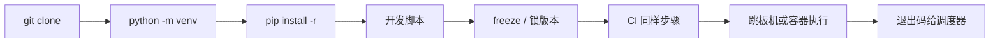

# 02｜工程结构与虚拟环境 · SRE 开发能力

> 大家好，欢迎来到这次分享。开讲之前，先带大家回到一个很多值班同学都踩过的现场：
> 活动前在跳板机 `pip install requests` 装到系统 Python，第二天另一个脚本 import 版本冲突；同事把仓库 zip 到生产机直接 `python check.py`，缺 `kubernetes` 模块；CI 绿但本地跑不起来——群里已经有人在喊「换一台机器重装」。
> 这一章讲完，你会知道当时那几个人各自错在哪——根子往往不是代码写错，而是工程没按「可复现环境」搭。
> **本章回答的问题**：一个运维 Python 工程从目录布局、虚拟环境、依赖锁定到可执行入口的完整生命周期。
> **本章不讲**：对象模型 → [01 基础语法与数据模型](../01-基础语法与数据模型/)；`argparse` → [06 argparse与配置管理](../06-argparse与配置管理/)；`logging` → [05 logging日志规范](../05-logging日志规范/)；测试 → [14 测试与类型标注](../14-测试与类型标注/)。

**怎么听这场分享**：先把「工程一生」主图装进脑子——clone → venv → install → main → README/CI → 退出码；放慢 venv 与依赖锁定；作战节回到开头那个版本冲突现场。每一节讲完会提示对应练习题，趁热打铁。


## 面试怎么考

| 标记 | 考点 |
|------|------|
| **核心** | `venv` 隔离；`requirements.txt` / `pip freeze`；`#!/usr/bin/env python3`；`if __name__ == "__main__"` |
| **必会** | 项目目录 `src/` 或平铺脚本；勿提交 `venv/`；`python -m pip install -r` |
| **常用** | `.python-version` / `pyenv`；`pip-tools` 或锁文件；README 写运行方式 |
| **常考** | 系统 Python vs venv；`pip install .` vs `-r`；相对导入与 `PYTHONPATH` |

**30 秒怎么说**：生产运维脚本必须**自带环境说明**：仓库里 `requirements.txt`（或 `pyproject.toml`）锁依赖，本地/CI 用 `python3 -m venv .venv && source .venv/bin/activate && pip install -r requirements.txt`。脚本 `#!/usr/bin/env python3` + `main()` + `if __name__ == "__main__"`。不把 `venv/` 和 `__pycache__/` 提交 Git。跳板机禁止 `sudo pip install` 污染系统 site-packages。README 写清「从 clone 到跑第一条命令」三步。

---

## 能力边界

| 维度 | 标准工程 + venv | 单文件 ad-hoc | 容器镜像 |
|------|-----------------|---------------|----------|
| **适合** | 团队共享、CI、多脚本复用依赖 | 一次性 20 行 | 发布到 K8s Job/CronJob |
| **不适合** | 无文档的 `pip install *` | 长期维护 | 改一行要 rebuild（有时仍值得） |
| **你要会** | 复现同事环境、排 import 错误 | 何时该升格成工程 | 镜像里 `ENTRYPOINT` 与 venv |

`venv/` 隔离解释器与 site-packages，常见误用是提交进 Git；`requirements.txt` 是安装清单，常见误用是手搓不带版本；`pyproject.toml` 管现代打包与工具配置，小脚本不宜过度工程化；`README` 是运行契约，别只写「python run」。

> 🎯 **一句话**：工程结构解决「**同一份代码，任何人、任何机、CI 上跑结果一致**」——这是 SRE 脚本可维护性的前提。

好，边界清楚了。接下来先把认代码的「最小零件」过一遍——不是语法大全，是读脚本下限。

---

## 语言最小集

| 零件 | 示例 | 含义 |
|------|------|------|
| shebang | `#!/usr/bin/env python3` | 直接执行时找 python3 |
| 模块执行 | `python script.py` | 把文件当 `__main__` |
| `-m` | `python -m pip install` | 用当前解释器的 pip |
| venv 创建 | `python3 -m venv .venv` | 本地虚拟环境 |
| 激活 | `source .venv/bin/activate` | 改 PATH 与 VIRTUAL_ENV |
| 装依赖 | `pip install -r requirements.txt` | 按清单安装 |
| 锁依赖 | `pip freeze > requirements.txt` | 导出已装版本（谨慎） |
| 入口守卫 | `if __name__ == "__main__":` | 仅直接执行时跑 main |
| 包目录 | `ops_tool/` + `__init__.py` | 可导入包（3.3+ namespace 可选） |
| `.gitignore` | `venv/`, `__pycache__/` | 不提交产物 |

```bash
# 最小三件套（README 里写死）
python3 -m venv .venv
source .venv/bin/activate
python -m pip install -U pip && pip install -r requirements.txt
python scripts/healthcheck.py --cluster prod
```

---

## 一、一张图：一个运维脚本工程的一生

> 🎯 **一句话**：**立项（目录）→ 筑基（venv）→ 锁依赖（requirements）→ 写入口（main）→ 交付（README/CI）→ 运行（跳板机/Job）**。



**读图**：**B–C** 必须与 CI、生产一致；跳过 venv 直接在系统 Python `pip install` 会在 **G** 阶段爆 `ImportError` 或版本冲突。监控不看目录结构，但 **H 非 0** 时你要能在这张图上定位是环境还是逻辑（04 章）。

好，主图装进脑子了。接下来顺着主线一站一站往下走——带着问题听，比背清单有用。


本节对应练习题 Q13、Q14。

---

## 二、出生：目录布局怎么选（⭐常考）

> 🎯 **一句话**：小团队运维仓**平铺 `scripts/` + `lib/`** 够用；脚本多了再上 `src/包名/`。

### 布局 A：平铺（⭐常考，10 个脚本以内）

```text
ops-scripts/
├── README.md
├── requirements.txt
├── .gitignore
├── .venv/                 ← local, not in git
├── scripts/
│   ├── healthcheck.py
│   └── drain_node.py
└── lib/
    ├── __init__.py
    └── k8s_client.py
```

运行：

```bash
cd ops-scripts
source .venv/bin/activate
PYTHONPATH=lib python scripts/healthcheck.py
# 或 pip install -e . 若做了 pyproject（见布局 B）
```

### 布局 B：`src` 布局（可安装包）

```text
cluster-ops/
├── pyproject.toml
├── README.md
├── requirements.txt
├── src/
│   └── cluster_ops/
│       ├── __init__.py
│       ├── cli.py
│       └── checks/
│           └── pods.py
└── tests/
    └── test_pods.py
```

```bash
pip install -e ".[dev]"
cluster-ops check pods --namespace default
```

> 📝 **面试**：「脚本少就 `scripts/` + `requirements.txt`；要复用逻辑、要上 CI 测试就用 `src` 包 + `pyproject.toml`。」

### 什么别进 Git

```gitignore
.venv/
venv/
__pycache__/
*.pyc
.pytest_cache/
.mypy_cache/
*.egg-info/
dist/
build/
.env
```

> ⚠️ **别混**：`.env` 含密钥——用 CI Variables 或密钥管理，不进仓。


本节对应练习题 Q5、Q8。

---

## 三、筑基：venv 与解释器选择（🔥难点）

> 🎯 **一句话**：**`python3 -m venv .venv` 创建隔离环境；激活后 `which python` 应指向 `.venv/bin/python`**。

🔥 **venv** = 给项目单独挖一口「依赖井」，不跟系统 Python 抢 site-packages。大白话：每人/每 CI 自建一口井，别往公共水池里倒药。⭐ 这是面试必考，也是开头版本冲突的根因。

很多人会答「直接 `sudo pip install` 最快」——错了。先问一句：跳板机上装过几份互相打架的 kubernetes？

```bash
python3 --version
# Python 3.11.8

python3 -m venv .venv
source .venv/bin/activate    # Linux/macOS
# .venv\Scripts\activate     # Windows

which python
# /path/to/project/.venv/bin/python

deactivate
```

### 为什么不用系统 `pip install`

`sudo pip install kubernetes` 会污染系统包，升级系统工具风险大；多项目共用系统 site-packages 导致版本冲突，难以复现；跳板机无写权限时安装失败或装到用户目录混乱。

> 💡 **打个比方**：venv 是每个项目独立的「工具箱」，系统 Python 是机房公共货架——别在货架上乱堆私人扳手。

### `pyenv` / 固定小版本

```bash
# .python-version 文件内容
3.11.8
```

团队统一 **3.10+ 或 3.11+**，避免 3.9 没有 `list[str] | None` 语法（01/14 章）。CI 镜像 `FROM python:3.11-slim` 与本地对齐。

> 🔍 **现场**：`ImportError: No module named 'xxx'` —— 先 `which python`，未在 venv 则 `source .venv/bin/activate` 再 `pip install -r requirements.txt`。


本节对应练习题 Q1、Q4、Q7。

---

## 四、锁依赖：requirements 与版本（⭐常考）

> 🎯 **一句话**：`requirements.txt` 是**安装契约**；生产要有**版本钉死**，不能只写包名。

### 手写最小 requirements

```text
# requirements.txt
kubernetes>=28.1.0,<29
requests>=2.31.0,<3
PyYAML>=6.0,<7
```

### `pip freeze` 的用法与坑

```bash
pip install -r requirements.txt
pip freeze > requirements-lock.txt   # 全量锁，含传递依赖
```

| 方式 | 优点 | 缺点 |
|------|------|------|
| 范围约束 `>=x,<y` | 可读、可安全升级 | 不同时间解析可能不同 |
| `pip freeze` 全锁 | 完全复现 | 难读、跨平台偶发差异 |
| `pip-tools` (`pip-compile`) | 可维护的锁文件 | 多一步工具链 |

运维中小仓：**顶层直接依赖 + 上界** 往往够用；金融级复现再上 `pip-compile`。

```bash
python -m pip install -U pip
pip install -r requirements.txt
pip check    # 依赖冲突自检
```

> ⚠️ **别混**：`requirements.txt` 给**运行**；开发工具（`pytest`、`ruff`）放 `requirements-dev.txt` 或 `pyproject.toml` 的 `[project.optional-dependencies]`。


本节对应练习题 Q2、Q9。

---

## 五、入口：shebang、`main` 与 `__main__`（⭐常考）

> 🎯 **一句话**：可执行脚本头部 `#!/usr/bin/env python3`，逻辑进 `main()`，底部用 `if __name__ == "__main__"` 守卫。

```python
#!/usr/bin/env python3
"""healthcheck.py — 集群健康检查入口"""
from __future__ import annotations

import sys


def main(argv: list[str] | None = None) -> int:
    argv = argv or sys.argv[1:]
    # parse argv, run checks
    return 0


if __name__ == "__main__":
    raise SystemExit(main())
```

| 写法 | 作用 |
|------|------|
| `#!/usr/bin/env python3` | `./healthcheck.py` 时内核找 python3 |
| `def main() -> int` | 返回退出码，供测试 import 调用 |
| `raise SystemExit(main())` | 把 int 变成进程退出码（04 章） |
| `from __future__ import annotations` | 推迟注解求值，兼容 3.9+ 写法 |

```bash
chmod +x scripts/healthcheck.py
./scripts/healthcheck.py --help
# 或（不依赖 shebang）
python scripts/healthcheck.py --help
```

> 📝 **面试**：「`python foo.py` 时 `__name__` 是 `__main__`；被 import 时不跑 main——所以守卫必不可少。」

### 相对导入与 `PYTHONPATH`

Python 找模块靠 `sys.path`——一个搜索路径列表，第一项通常是脚本所在目录。venv 激活后 site-packages 也在其中。平铺布局里 `lib/` 不在 `sys.path`，所以要么 `PYTHONPATH=lib`、要么 `pip install -e .`。

```python
# scripts/healthcheck.py
from lib.k8s_client import load_kubeconfig   # 需 PYTHONPATH=lib 或 install -e
```

```python
# 排障时打印 sys.path 看模块从哪加载
import sys
for p in sys.path:
    print(p)
# /path/to/scripts          ← 脚本目录
# /path/to/.venv/lib/...    ← venv site-packages
# /usr/lib/python3.11       ← 标准库（别动）
```

> 🔍 **现场**：`ImportError: No module named 'lib'`——先 `python -c "import sys; print(sys.path)"`，看 `lib/` 的父目录在不在列表里。

包内用相对导入：

```python
# src/cluster_ops/checks/pods.py
from cluster_ops.k8s_client import list_pods
```


本节对应练习题 Q3、Q4、Q10。

---

## 六、交付：README 与 CI 同一套命令（🔥难点）

> 🎯 **一句话**：README 里的 **Install + Run** 必须与 Jenkins/GitLab Job **逐字一致**。

### README 模板片段

```markdown
## 环境要求
- Python 3.11+
- 可访问集群的 kubeconfig

## 安装
python3 -m venv .venv
source .venv/bin/activate
python -m pip install -U pip
pip install -r requirements.txt

## 运行
python scripts/healthcheck.py --cluster prod

## 退出码
- 0：健康
- 1：检查失败
- 2：用法错误
```

### CI 片段（GitLab CI 示意）

```yaml
healthcheck:
  image: python:3.11-slim
  script:
    - python -m venv .venv
    - . .venv/bin/activate
    - pip install -U pip -r requirements.txt
    - python scripts/healthcheck.py --cluster staging
```

> 🔍 **现场**：本地能跑 CI 不能——对比 `python --version`、`pip list`、`KUBECONFIG` 环境变量。

常见 CI 不一致的根因：镜像 Python 版本与本地不同（3.11 vs 3.9 语法差异）、`requirements.txt` 缺传递依赖（本地装过忘了写进去）、CI 不激活 venv 直接 `python` 指向系统解释器。排查时在 CI 脚本里加 `python -c "import sys; print(sys.version)"` 和 `pip freeze` 导出对比。

```bash
# CI 里快速诊断环境
python --version && pip --version
pip list --format=freeze | sort
# ← 与本地 pip freeze 对比，差异即缺失依赖
```


本节对应练习题 Q6、Q11。

---

## 七、收束：工程凭什么可复现（🔥难点）

大家想想：同事笔记本能跑、CI 不能跑，差在哪一站？收束之前先把「可复现」四个字钉死——同一份 requirements、同一套 venv 步骤、同一条入口命令。

```mermaid
flowchart TB
    subgraph 隔离
        V[venv 独立 site-packages]
        P[固定 Python 小版本]
    end
    subgraph 契约
        R[requirements 钉版本]
        RD[README 安装步骤]
    end
    subgraph 入口
        M[main 返回 int]
        G[__main__ 守卫]
    end
    V --> 同机可复现
    R --> 跨机可复现
    RD --> 人与 CI 一致
    M --> 调度器可读退出码
```

**可背清单（七件套）**：

- 每项目独立 `venv`，不 `sudo pip`
- `requirements.txt` 写版本范围或锁文件
- `.gitignore` 掉 `venv/`、`__pycache__/`
- shebang 用 `env python3`
- `main()` + `if __name__ == "__main__"`
- README Install/Run 与 CI 相同
- 密钥不进仓，用环境变量注入

> ⚠️ **别混**：工程结构**不保证**业务正确——还要测试、日志、退出码（03、04、05、14 章）。


本节对应练习题 Q13。

---

## 八、作战：ImportError、版本冲突、CI 只有系统 Python（🔥难点）

**现象 · 先做 · 别做**

| 现象 | 先做 | 别做 |
|------|------|------|
| `No module named 'kubernetes'` | `which python`；是否在 venv | 全局 `sudo pip install` |
| 本地 OK CI 挂 | 对齐 Python 版本与 `pip install -r` | 在 CI 里手装单个包不写 requirements |
| 两脚本依赖版本打架 | 各项目独立 venv | 共用一个没隔离的环境 |
| `./script.py` 找不到模块 | `PYTHONPATH` 或 `pip install -e .` | 把 `lib` 拷到 `/usr/lib` |
| `bad interpreter` | shebang 路径是否存在 | 写死已淘汰的 python2 |

**60 秒剧本** 🔧：

- **0–10s**：`which python3; python3 --version`
- **10–25s**：`test -d .venv && source .venv/bin/activate; which python`
- **25–40s**：`pip list | grep -i kube`；`pip check`
- **40–60s**：对照 README 重装：`pip install -r requirements.txt`

```bash
python3 -c "import sys; print(sys.executable); print(sys.path[:3])"
```

---

本节对应练习题 Q7、Q12。

现在再看群里那句「换一台机器重装」，你知道该怎么拦住他了——先 `which python`，再进项目 venv，对照 README 重装。下面是可复制的生产模板（代码块一字不改，直接拿走）。

## 生产模板（🔧实操）

### 模板 1：最小可克隆仓库

```text
# README 顶部三行命令
git clone ... && cd ops-scripts
python3 -m venv .venv && source .venv/bin/activate
pip install -r requirements.txt && python scripts/healthcheck.py -h
```

### 模板 2：`requirements.txt`

```text
requests>=2.31.0,<3
kubernetes>=28.1.0,<29
```

### 模板 3：标准入口脚本

```python
#!/usr/bin/env python3
from __future__ import annotations

import argparse
import sys


def parse_args(argv: list[str] | None = None) -> argparse.Namespace:
    p = argparse.ArgumentParser(description="Node drain helper")
    p.add_argument("--node", required=True)
    p.add_argument("--dry-run", action="store_true")
    return p.parse_args(argv)


def main(argv: list[str] | None = None) -> int:
    args = parse_args(argv)
    if args.dry_run:
        print(f"would drain {args.node}")
        return 0
    # ... kubectl cordon/drain ...
    return 0


if __name__ == "__main__":
    raise SystemExit(main())
```

### 模板 4：`pyproject.toml`（小工具可安装）

```toml
[project]
name = "cluster-ops"
version = "0.1.0"
requires-python = ">=3.11"
dependencies = [
  "kubernetes>=28.1.0,<29",
]

[project.scripts]
cluster-ops = "cluster_ops.cli:main"

[build-system]
requires = ["setuptools>=61"]
build-backend = "setuptools.build_meta"
```

```bash
pip install -e .
cluster-ops --help
```

---

## 踩坑清单

| 现象 | 原因 | 修法 |
|------|------|------|
| CI 找不到包 | 未 `pip install -r` | CI 加安装步骤 |
| 提交巨大 diff | `venv/` 进 Git | `.gitignore` 并 `git rm -r --cached` |
| mac 能跑 Linux 不能 | 装了平台特定 wheel | CI 用目标镜像测 |
| `python` 指向 2.7 | 未指定 python3 | 文档写死 `python3` |
| 相对导入失败 | 直接跑子模块 | `python -m package.module` |
| 多 Python 混用 | pyenv 与系统混 | `which python` 写进日志 |
| freeze 含本地路径 | editable 安装 | 用 pip-compile 或手维护顶层 |
| 跳板机无 venv | 极简镜像 | 用容器 Job 或 `pip install --user` |

---

## 必会 · 常考（⭐常考）

| 说法 | 对错 | 口径 |
|------|:----:|------|
| 应把 `venv/` 提交 Git | 错 | 每人/CI 自建 |
| `pip install` 应用 `python -m pip` | 对 | 避免 pip 指向错解释器 |
| `if __name__ == "__main__"` 可省略 | 错 | import 时会执行顶层代码 |
| `sudo pip` 适合生产跳板机 | 错 | 污染系统 |
| `requirements.txt` 只写 `requests` 够严谨 | 错 | 至少 major 上界 |
| `#!/usr/bin/env python3` 优于写死路径 | 对 | 便携 |
| `pip freeze` 永远最佳 | 错 | 小项目范围约束即可 |
| `src` 布局必须 `pip install -e` | 对 | 否则 import 找不到包 |

---

## 命令速查 🔧

```bash
python3 -m venv .venv
source .venv/bin/activate
python -m pip install -U pip
pip install -r requirements.txt
pip check
pip list
which python
python -c "import sys; print(sys.version)"
deactivate
```

---

## 面试锚点

遮住右列自问自答，卡壳的行回去重读对应小节——能讲出来才算会，看着答案点头不算。

- **为什么要 venv？** — 隔离依赖，不污染系统 Python
- **requirements 怎么写？** — 顶层依赖 + 版本范围；或 compile 锁文件
- **`__main__` 守卫干嘛？** — 被 import 时不执行入口
- **小脚本目录怎么搭？** — `scripts/` + `lib/` + requirements + README
- **CI 与本地如何一致？** — 相同 Python 版本、相同 install 命令

---

## 数字墙

> venv 隔离粒度：**site-packages 级**，不隔离 Python 解释器版本（用 pyenv 或镜像固定小版本）
> `requirements.txt` 版本范围约定：`>=X,<Y` 是最常见模式，`==X` 精确锁用于 lock 文件
> 退出码约定：0 成功，1 失败，2 用法错误——跨章复用（04 章细化）
> shebang `#!/usr/bin/env python3` 优于 `/usr/bin/python3`——便携，跟随 PATH

---

## 合上书，问自己

学到这里，先别急着翻下一章。合上书，试试下面这几件事能不能做到——能做到，这章才算真的听懂了。卡住的那一条，就回到对应的小节再听一遍：

- [ ] 画出工程一生主图：clone → venv → install → run → exit code。（对应练习题 Q13）
- [ ] 为什么禁止 `sudo pip install`？跳板机正确做法？（Q1）
- [ ] `pip freeze` 和手写 `>=,<` 各适合什么场景？（Q2、Q9）
- [ ] `if __name__ == "__main__"` 去掉会怎样？举例。（Q3）
- [ ] 平铺 `scripts/` 和 `src/` 布局各何时用？（Q5）
- [ ] README 必须包含哪三段命令？（Q6）
- [ ] `which python` 在排障里第一步说明什么？（Q7、Q12）
- [ ] `.gitignore` 至少忽略哪四类路径？（Q8）

全部打勾之后，给自己出一个终极测试：找一位同事，十分钟讲清「开头那个跳板机现场，为什么 `sudo pip` 会炸、CI 与本地怎么对齐」。讲得下来，你就是下一个能拦住「换一台机器重装」的人。

八题能口述，工程结构就过关了。下一章在**数据结构**里做选型，别用 list 扫一切。
