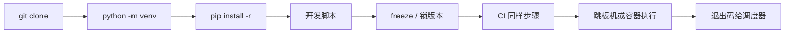
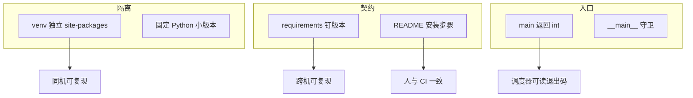

# 02｜工程结构与虚拟环境 · SRE 开发能力

> 活动前在跳板机 `pip install requests` 装到系统 Python，第二天另一个脚本 import 版本冲突；同事 zip 仓库到生产机直接 `python check.py`，缺 `kubernetes`；CI 绿本地红——群里已经有人喊「换一台机器重装」。
> **本章回答**：一个运维 Python 工程从目录布局、虚拟环境、依赖锁定到可执行入口的完整生命周期——谁污染、谁锁死、谁对齐。
> **不讲**：对象模型 → [01](../01-基础语法与数据模型/)；`argparse` → [06](../06-argparse与配置管理/)；`logging` → [05](../05-logging日志规范/)；测试 → [14](../14-测试与类型标注/)。

**标记**：🎯重点 · 🔥难点 · ⭐常考 · 🔧实操

---

## 面试怎么考

| 标记 | 考点 |
|------|------|
| **核心** | `venv` 隔离；`requirements.txt` / `pip freeze`；`#!/usr/bin/env python3`；`if __name__ == "__main__"` |
| **必会** | 项目目录 `src/` 或平铺脚本；勿提交 `venv/`；`python -m pip install -r` |
| **常用** | `.python-version` / `pyenv`；`pip-tools` 或锁文件；README 写运行方式 |
| **常考** | 系统 Python vs venv；`pip install .` vs `-r`；相对导入与 `PYTHONPATH` |

**30 秒怎么说**：生产运维脚本必须**自带环境说明**：仓库里 `requirements.txt`（或 `pyproject.toml`）锁依赖，本地/CI 用 `python3 -m venv .venv && source .venv/bin/activate && pip install -r requirements.txt`。脚本 `#!/usr/bin/env python3` + `main()` + `if __name__ == "__main__"`。不把 `venv/` 和 `__pycache__/` 提交 Git。跳板机禁止 `sudo pip install` 污染系统 site-packages。README 写清「从 clone 到跑第一条命令」三步。

---

## 能力边界

| 维度 | 标准工程 + venv | 单文件 ad-hoc | 容器镜像 |
|------|-----------------|---------------|----------|
| **适合** | 团队共享、CI、多脚本复用依赖 | 一次性 20 行 | 发布到 K8s Job/CronJob |
| **不适合** | 无文档的 `pip install *` | 长期维护 | 改一行要 rebuild（有时仍值得） |
| **你要会** | 复现同事环境、排 import 错误 | 何时升格成工程 | 镜像里 `ENTRYPOINT` 与 venv |

- 🧰 **四个名词各管一层**
  - **`venv/`**：隔离解释器绑定的 **site-packages**——常见误用是提交进 Git
  - **`requirements.txt`**：安装清单——常见误用是手搓不带版本
  - **`pyproject.toml`**：现代打包与工具配置——小脚本不宜过度工程化
  - **`README`**：运行契约——别只写「python run」

> 🎯 **一句话**：工程结构解决「**同一份代码，任何人、任何机、CI 上跑结果一致**」——这是 SRE 脚本可维护性的前提。

---

## 语言最小集

读运维工程的 10 个「零件」——认仓库下限，不是打包大全。

| 零件 | 示例 | 含义 |
|------|------|------|
| shebang | `#!/usr/bin/env python3` | 直接执行时找 python3 |
| 模块执行 | `python script.py` | 把文件当 `__main__` |
| `-m` | `python -m pip install` | 用**当前**解释器的 pip |
| venv 创建 | `python3 -m venv .venv` | 本地虚拟环境 |
| 激活 | `source .venv/bin/activate` | 改 PATH 与 `VIRTUAL_ENV` |
| 装依赖 | `pip install -r requirements.txt` | 按清单安装 |
| 锁依赖 | `pip freeze > lock.txt` | 导出已装版本（谨慎） |
| 入口守卫 | `if __name__ == "__main__":` | 仅直接执行时跑 main |
| 包目录 | `ops_tool/` + `__init__.py` | 可导入包（3.3+ namespace 可选） |
| `.gitignore` | `venv/`、`__pycache__/` | 不提交产物 |

```bash
# 最小三件套（README 里写死）
python3 -m venv .venv
source .venv/bin/activate
python -m pip install -U pip && pip install -r requirements.txt
python scripts/healthcheck.py --cluster prod
```

---

## 一、一张图：一个运维脚本工程的一生

> 🎯 **一句话**：**立项（目录）→ 筑基（venv）→ 锁依赖（requirements）→ 写入口（main）→ 交付（README/CI）→ 运行（跳板机/Job）**。



- 📖 **读图**
  - 🛤️ 主线：clone → venv → install → 开发 → 锁版本 → CI 同步骤 → 执行 → 退出码
  - 💣 跳过 **B–C** 直接在系统 Python `pip install`，会在 **G** 爆 `ImportError` 或版本冲突；**H 非 0** 时先分清是环境还是逻辑（→ [04](../04-异常与退出码/)）

本节对应练习题 Q13、Q14。

---

## 二、出生：目录布局怎么选（⭐常考）

> 🎯 **一句话**：小团队运维仓**平铺 `scripts/` + `lib/`** 够用；脚本多了再上 `src/包名/`。

### 📁 布局 A：平铺（⭐常考，约 10 个脚本以内）

```text
ops-scripts/
├── README.md
├── requirements.txt
├── .gitignore
├── .venv/                 ← local, not in git
├── scripts/
│   ├── healthcheck.py
│   └── drain_node.py
└── lib/
    ├── __init__.py
    └── k8s_client.py
```

```bash
cd ops-scripts
source .venv/bin/activate
PYTHONPATH=lib python scripts/healthcheck.py
# 或 pip install -e . 若做了 pyproject（见布局 B）
```

### 📦 布局 B：`src` 布局（可安装包）

```text
cluster-ops/
├── pyproject.toml
├── README.md
├── requirements.txt
├── src/
│   └── cluster_ops/
│       ├── __init__.py
│       ├── cli.py
│       └── checks/
│           └── pods.py
└── tests/
    └── test_pods.py
```

```bash
pip install -e ".[dev]"
cluster-ops check pods --namespace default
```

> 📝 **面试**：「脚本少就 `scripts/` + `requirements.txt`；要复用逻辑、要上 CI 测试就用 `src` 包 + `pyproject.toml`。」⭐

#### ❓ 为什么平铺还要 `PYTHONPATH=lib`？

- 🧠 **Python 找模块靠 `sys.path`**
  - 直接跑 `python scripts/healthcheck.py` 时，路径第一项常是 **脚本所在目录**（`scripts/`），不是仓库根
  - `lib/` 不在列表里 → `from lib.k8s_client import ...` 炸
- ✅ **两条出路**（二选一，文档写死）
  - 运行时加：`PYTHONPATH=lib`（或根目录）
  - 工程化：`pip install -e .`，把包装进当前 venv 的 site-packages
- ⚠️ **别混**：把 `lib` 拷到 `/usr/lib` 不是出路——污染系统、不可复现

### 🚫 什么别进 Git

```gitignore
.venv/
venv/
__pycache__/
*.pyc
.pytest_cache/
.mypy_cache/
*.egg-info/
dist/
build/
.env
```

> ⚠️ **别混**：`.env` 含密钥——用 CI Variables 或密钥管理，不进仓。

本节对应练习题 Q5、Q8。

---

## 三、筑基：venv 与解释器选择（🔥难点）

> 🎯 **一句话**：**`python3 -m venv .venv` 创建隔离环境；激活后 `which python` 应指向 `.venv/bin/python`**。

- 🔥 **venv** = 给项目单独挖一口「依赖井」，不跟系统 Python 抢 site-packages
  - 每人 / 每 CI 自建一口井，别往公共水池里倒药
  - ⭐ 面试必考，也是开头版本冲突的根因

```bash
python3 --version
# Python 3.11.8

python3 -m venv .venv
source .venv/bin/activate    # Linux/macOS
# .venv\Scripts\activate     # Windows

which python
# /path/to/project/.venv/bin/python   # ← 必须落在 .venv 里

deactivate
```

> 💡 **打个比方**：venv 是每个项目独立的「工具箱」，系统 Python 是机房公共货架——别在货架上乱堆私人扳手。

#### ❓ 为什么不能 `sudo pip install`？

- ❌ **系统 site-packages 是共享池**
  - 多项目共用 → 版本互相踩（活动脚本要 `requests==2.28`，巡检要 `2.31`）
  - 升级系统工具（`yum`/`apt` 管的包）可能被你装的 wheel 顶掉
  - 跳板机常无写权限 → 装到 `~/.local`，PATH 更乱
- ✅ **正确做法**：项目目录 `python3 -m venv .venv` → 激活 → `python -m pip install -r requirements.txt`
- 🔑 **口诀**：`python -m pip` 保证 pip 跟当前解释器是一对；裸 `pip` 可能指到别的 Python

### 📌 `pyenv` / 固定小版本

```bash
# .python-version
3.11.8
```

- 团队统一 **3.10+ 或 3.11+**，避免 3.9 缺 `list[str] | None` 语法（→ [01](../01-基础语法与数据模型/)、[14](../14-测试与类型标注/)）
- CI 镜像 `FROM python:3.11-slim` 与本地对齐

> 🔍 **现场**：`ImportError: No module named 'xxx'` —— 先 `which python`；未在 venv 则 `source .venv/bin/activate` 再 `pip install -r requirements.txt`。

本节对应练习题 Q1、Q4、Q7。

---

## 四、锁依赖：requirements 与版本（⭐常考）

> 🎯 **一句话**：`requirements.txt` 是**安装契约**；生产要有**版本钉死**，不能只写包名。

### ✍️ 手写最小 requirements

```text
# requirements.txt
kubernetes>=28.1.0,<29
requests>=2.31.0,<3
PyYAML>=6.0,<7
```

### 🧊 `pip freeze` 的用法与坑

```bash
pip install -r requirements.txt
pip freeze > requirements-lock.txt   # 全量锁，含传递依赖
```

| 方式 | 优点 | 缺点 |
|------|------|------|
| 范围约束 `>=x,<y` | 可读、可安全升级 | 不同时间解析可能不同 |
| `pip freeze` 全锁 | 完全复现 | 难读、跨平台偶发差异 |
| `pip-tools` (`pip-compile`) | 可维护的锁文件 | 多一步工具链 |

- 运维中小仓：**顶层直接依赖 + 上界** 往往够用
- 金融级复现再上 `pip-compile`

```bash
python -m pip install -U pip
pip install -r requirements.txt
pip check    # 依赖冲突自检
```

#### ❓ 为什么「只写包名」不够？

- 🎲 **无上界 = 明天装到的 major 可能破坏 API**
  - 今天 `pip install kubernetes` 解析到 28.x，半年后可能是 30.x
  - CI 与跳板机若隔周重装，绿变红却「requirements 没改」——其实从来没锁
- ✅ **最低契约**：`包名>=下限,<下一个 major`
- 🔒 **要字节级复现**：`pip freeze` / `pip-compile` 生成 lock，CI 装 lock

> ⚠️ **别混**：`requirements.txt` 给**运行**；开发工具（`pytest`、`ruff`）放 `requirements-dev.txt` 或 `pyproject.toml` 的 `[project.optional-dependencies]`。

本节对应练习题 Q2、Q9。

---

## 五、入口：shebang、`main` 与 `__main__`（⭐常考）

> 🎯 **一句话**：可执行脚本头部 `#!/usr/bin/env python3`，逻辑进 `main()`，底部用 `if __name__ == "__main__"` 守卫。

```python
#!/usr/bin/env python3
"""healthcheck.py — 集群健康检查入口"""
from __future__ import annotations

import sys


def main(argv: list[str] | None = None) -> int:
    argv = argv or sys.argv[1:]
    # parse argv, run checks
    return 0


if __name__ == "__main__":
    raise SystemExit(main())
```

- 🔑 **四件套各干什么**
  - `#!/usr/bin/env python3` → `./healthcheck.py` 时内核找 python3
  - `def main() -> int` → 返回退出码，测试可 `import` 再调
  - `raise SystemExit(main())` → 把 int 变成进程退出码（→ [04](../04-异常与退出码/)）
  - `from __future__ import annotations` → 推迟注解求值，兼容 3.9+ 写法

```bash
chmod +x scripts/healthcheck.py
./scripts/healthcheck.py --help
# 或不依赖 shebang：
python scripts/healthcheck.py --help
```

#### ❓ 为什么必须有 `if __name__ == "__main__"`？

- 🧠 **直接跑 vs 被 import，`__name__` 不同**
  - `python foo.py` → `__name__ == "__main__"` → 该跑入口
  - `from foo import helper` → `__name__ == "foo"` → **不该**跑入口副作用
- ❌ **去掉守卫**：别人一 import 你的工具模块，立刻开始 drain 节点 / 打 API
- ✅ **口诀**：副作用进 `main()`，`main` 只在守卫里调用

> 📝 **面试**：「`python foo.py` 时 `__name__` 是 `__main__`；被 import 时不跑 main——所以守卫必不可少。」⭐

### 🧭 相对导入与 `PYTHONPATH`

- Python 找模块靠 **`sys.path`**（搜索路径列表）
  - 第一项通常是脚本所在目录
  - venv 激活后，site-packages 也在其中
- 平铺布局里 `lib/` 常不在路径上 → `PYTHONPATH=lib` 或 `pip install -e .`

```python
# scripts/healthcheck.py
from lib.k8s_client import load_kubeconfig   # 需 PYTHONPATH=lib 或 install -e
```

```python
# 排障时打印 sys.path 看模块从哪加载
import sys
for p in sys.path:
    print(p)
# /path/to/scripts          ← 脚本目录
# /path/to/.venv/lib/...    ← venv site-packages
# /usr/lib/python3.11       ← 标准库（别动）
```

> 🔍 **现场**：`ImportError: No module named 'lib'`——先 `python -c "import sys; print(sys.path)"`，看 `lib/` 的父目录在不在列表里。

```python
# src/cluster_ops/checks/pods.py —— 包内用绝对包路径更稳
from cluster_ops.k8s_client import list_pods
```

本节对应练习题 Q3、Q4、Q10。

---

## 六、交付：README 与 CI 同一套命令（🔥难点）

> 🎯 **一句话**：README 里的 **Install + Run** 必须与 Jenkins/GitLab Job **逐字一致**。

### 📄 README 模板片段

```markdown
## 环境要求
- Python 3.11+
- 可访问集群的 kubeconfig

## 安装
python3 -m venv .venv
source .venv/bin/activate
python -m pip install -U pip
pip install -r requirements.txt

## 运行
python scripts/healthcheck.py --cluster prod

## 退出码
- 0：健康
- 1：检查失败
- 2：用法错误
```

### 🤖 CI 片段（GitLab CI 示意）

```yaml
healthcheck:
  image: python:3.11-slim
  script:
    - python -m venv .venv
    - . .venv/bin/activate
    - pip install -U pip -r requirements.txt
    - python scripts/healthcheck.py --cluster staging
```

#### ❓ 为什么本地能跑、CI 不能？

- 🔍 **先对齐三样，再怪业务逻辑**
  - **Python 小版本**：本地 3.11、CI 3.9 → 语法/`|` 联合类型就炸
  - **安装步骤**：本地曾手装过包，忘写进 `requirements.txt` → CI 干净环境缺模块
  - **解释器**：CI 没 activate，`python` 仍指系统解释器 → 装到 A、跑的是 B
- ✅ **CI 脚本里加对照**

```bash
python --version && pip --version
pip list --format=freeze | sort
# ← 与本地 pip freeze 对比，差异即缺失依赖
```

> 🔍 **现场**：本地能跑 CI 不能——对比 `python --version`、`pip list`、`KUBECONFIG` 环境变量。

本节对应练习题 Q6、Q11。

---

## 七、收束：工程凭什么可复现（🔥难点）

> 🎯 **一句话**：可复现 = **同一份 requirements + 同一套 venv 步骤 + 同一条入口命令**。



- 📖 **读图**
  - 🧱 **隔离**（venv + 小版本）解决「同机多项目打架」
  - 📜 **契约**（requirements + README）解决「跨机 / 人与 CI」
  - 🚪 **入口**（main + 守卫）解决「调度器与 import 副作用」

**可背清单（七件套）**：

1. 每项目独立 `venv`，不 `sudo pip`
2. `requirements.txt` 写版本范围或锁文件
3. `.gitignore` 掉 `venv/`、`__pycache__/`
4. shebang 用 `env python3`
5. `main()` + `if __name__ == "__main__"`
6. README Install/Run 与 CI 相同
7. 密钥不进仓，用环境变量注入

> ⚠️ **别混**：工程结构**不保证**业务正确——还要测试、日志、退出码（→ [03](../03-语言最小集与数据结构/)、[04](../04-异常与退出码/)、[05](../05-logging日志规范/)、[14](../14-测试与类型标注/)）。

本节对应练习题 Q13。

---

## 八、作战：ImportError、版本冲突、CI 只有系统 Python（🔥难点）

### 现象 · 先做 · 别做

| 现象 | 先做 | 别做 |
|------|------|------|
| `No module named 'kubernetes'` | `which python`；是否在 venv | 全局 `sudo pip install` |
| 本地 OK CI 挂 | 对齐 Python 版本与 `pip install -r` | 在 CI 里手装单个包不写 requirements |
| 两脚本依赖版本打架 | 各项目独立 venv | 共用一个没隔离的环境 |
| `./script.py` 找不到模块 | `PYTHONPATH` 或 `pip install -e .` | 把 `lib` 拷到 `/usr/lib` |
| `bad interpreter` | shebang 路径是否存在 | 写死已淘汰的 python2 |

### 60 秒剧本 🔧

> 🔍 **现场**：接到「换一台机器重装」之前，60 秒走完这条线。

```text
① 0–10s   which python3; python3 --version
② 10–25s  test -d .venv && source .venv/bin/activate; which python
③ 25–40s  pip list | grep -i kube; pip check
④ 40–60s  对照 README 重装：pip install -r requirements.txt
```

```bash
python3 -c "import sys; print(sys.executable); print(sys.path[:3])"
# ← executable 必须落在项目 .venv；path 前几项能解释 ImportError
```

本节对应练习题 Q7、Q12。

---

## 生产模板（🔧实操）

### 模板 1：最小可克隆仓库

```text
# README 顶部三行命令
git clone ... && cd ops-scripts
python3 -m venv .venv && source .venv/bin/activate
pip install -r requirements.txt && python scripts/healthcheck.py -h
```

### 模板 2：`requirements.txt`

```text
requests>=2.31.0,<3
kubernetes>=28.1.0,<29
```

### 模板 3：标准入口脚本

```python
#!/usr/bin/env python3
from __future__ import annotations

import argparse
import sys


def parse_args(argv: list[str] | None = None) -> argparse.Namespace:
    p = argparse.ArgumentParser(description="Node drain helper")
    p.add_argument("--node", required=True)
    p.add_argument("--dry-run", action="store_true")
    return p.parse_args(argv)


def main(argv: list[str] | None = None) -> int:
    args = parse_args(argv)
    if args.dry_run:
        print(f"would drain {args.node}")
        return 0
    # ... kubectl cordon/drain ...
    return 0


if __name__ == "__main__":
    raise SystemExit(main())
```

### 模板 4：`pyproject.toml`（小工具可安装）

```toml
[project]
name = "cluster-ops"
version = "0.1.0"
requires-python = ">=3.11"
dependencies = [
  "kubernetes>=28.1.0,<29",
]

[project.scripts]
cluster-ops = "cluster_ops.cli:main"

[build-system]
requires = ["setuptools>=61"]
build-backend = "setuptools.build_meta"
```

```bash
pip install -e .
cluster-ops --help
```

---

## 踩坑清单

| 现象 | 原因 | 修法 |
|------|------|------|
| CI 找不到包 | 未 `pip install -r` | CI 加安装步骤 |
| 提交巨大 diff | `venv/` 进 Git | `.gitignore` 并 `git rm -r --cached` |
| mac 能跑 Linux 不能 | 装了平台特定 wheel | CI 用目标镜像测 |
| `python` 指向 2.7 | 未指定 python3 | 文档写死 `python3` |
| 相对导入失败 | 直接跑子模块 | `python -m package.module` |
| 多 Python 混用 | pyenv 与系统混 | `which python` 写进日志 |
| freeze 含本地路径 | editable 安装 | 用 pip-compile 或手维护顶层 |
| 跳板机无 venv | 极简镜像 | 用容器 Job 或 `pip install --user` |

---

## 必会 · 常考（⭐常考）

| 说法 | 对错 | 口径 |
|------|:----:|------|
| 应把 `venv/` 提交 Git | 错 | 每人/CI 自建 |
| `pip install` 应用 `python -m pip` | 对 | 避免 pip 指向错解释器 |
| `if __name__ == "__main__"` 可省略 | 错 | import 时会执行顶层代码 |
| `sudo pip` 适合生产跳板机 | 错 | 污染系统 |
| `requirements.txt` 只写 `requests` 够严谨 | 错 | 至少 major 上界 |
| `#!/usr/bin/env python3` 优于写死路径 | 对 | 便携 |
| `pip freeze` 永远最佳 | 错 | 小项目范围约束即可 |
| `src` 布局必须 `pip install -e` | 对 | 否则 import 找不到包 |

---

## 九、收口

### 命令速查 🔧

```bash
python3 -m venv .venv
source .venv/bin/activate
python -m pip install -U pip
pip install -r requirements.txt
pip check
pip list
which python
python -c "import sys; print(sys.version)"
deactivate
```

### 面试锚点

| 问 | 30 秒答 |
|----|---------|
| 为什么要 venv？ | 隔离依赖，不污染系统 Python；多项目各一口井。 |
| requirements 怎么写？ | 顶层依赖 + 版本范围；要字节级复现再 compile 锁文件。 |
| `__main__` 守卫干嘛？ | 被 import 时不执行入口副作用。 |
| 小脚本目录怎么搭？ | `scripts/` + `lib/` + requirements + README；多了再 `src`。 |
| CI 与本地如何一致？ | 相同 Python 版本、相同 install 命令，README 与 Job 逐字对齐。 |
| 为何 `python -m pip`？ | 保证 pip 绑定当前解释器，避免装到 A、跑的是 B。 |

### 易错一句话对照

- `sudo pip install` 最快 → 污染系统 site-packages，多项目互相踩
- 把 `venv/` 提交 Git → 每人/CI 自建；产物不进仓
- `requirements` 只写包名 → 至少 `>=x,<下一 major`；否则跨周重装可能绿变红
- 去掉 `__main__` 守卫 → import 即执行 drain/API 副作用
- 平铺布局直接 `from lib...` 不设路径 → 要 `PYTHONPATH` 或 `pip install -e .`
- 本地能跑就够 → README Install/Run 必须与 CI 逐字一致
- 裸 `pip` 总等于当前 python → 用 `python -m pip` 绑死解释器
- shebang 写死 `/usr/bin/python3` 更稳 → `env python3` 更便携，跟随 PATH

### 数字墙

> venv 隔离粒度：**site-packages 级**，不隔离 Python 解释器小版本（用 pyenv 或镜像固定）
> `requirements.txt` 版本范围约定：`>=X,<Y` 最常见；`==X` 精确锁用于 lock 文件
> 退出码约定：0 成功，1 失败，2 用法错误——跨章复用（→ [04](../04-异常与退出码/)）
> shebang `#!/usr/bin/env python3` 优于 `/usr/bin/python3`——便携，跟随 PATH
> 平铺布局常见上限：**~10** 个脚本再考虑 `src/` 包

---

## 合上书

对着第一节主图口述一遍，卡住就回对应小节。开头那个跳板机现场——`sudo pip`、缺模块、「换一台机器」——各自错在哪，现在该能说清了。

- [ ] **默画主图**：clone → venv → install → 开发 → 锁版本 → CI 同步骤 → 执行 → 退出码。（→ Q13）
- [ ] **口述禁区**：为什么禁止 `sudo pip`？跳板机正确三步是什么？（→ Q1）
- [ ] **口述锁依赖**：`pip freeze` 与手写 `>=,<` 各适合什么场景？（→ Q2 · Q9）
- [ ] **口述入口**：`if __name__ == "__main__"` 去掉会怎样？举例。（→ Q3）
- [ ] **口述布局**：平铺 `scripts/` 与 `src/` 各何时用？`PYTHONPATH` 解决什么？（→ Q5）
- [ ] **口述交付**：README 必须含哪三段？与 CI 如何对齐？（→ Q6 · Q11）
- [ ] **定责**：`which python` 在排障里第一步说明什么？（→ Q7 · Q12）
- [ ] **口述忽略清单**：`.gitignore` 至少忽略哪四类路径？（→ Q8）

全部打勾后，十分钟给同事讲清「开头那个跳板机现场为什么炸、CI 与本地怎么对齐」。讲得下来，你就是下一个能拦住「换一台机器重装」的人。

下一章：[语言最小集与数据结构](../03-语言最小集与数据结构/)。
