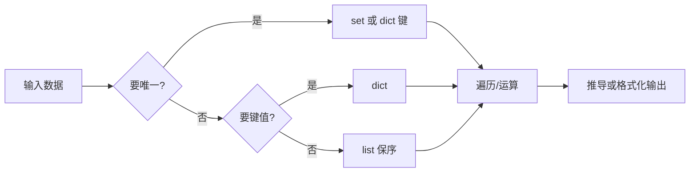
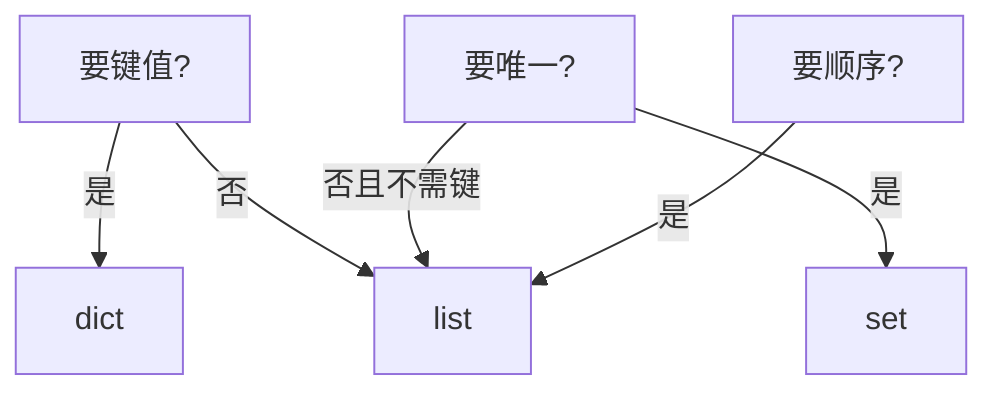

# 03｜语言最小集与数据结构 · SRE 开发能力

> 巡检脚本用 list 存主机又去重，O(n²) 扫到超时；`def add_tag(tag, tags=[])` 第二次调用带着第一次的 tag——群里已经有人在喊「Python 太慢换 Go」。
> **本章回答**：一次数据结构选型的一生——`list` / `dict` / `set` / `tuple` 何时用、怎么遍历、可变默认参数为什么是坑。
> **不讲**：对象 truthiness → [01](../01-基础语法与数据模型/)；工程布局 → [02](../02-工程结构与虚拟环境/)；异常退出 → [04](../04-异常与退出码/)；并发 → [10](../10-并发与GIL/)。

**标记**：🎯重点 · 🔥难点 · ⭐常考 · 🔧实操

---

## 面试怎么考

| 标记 | 考点 |
|------|------|
| **核心** | list 有序可变；dict 键值 O(1)；set 去重 O(1)；tuple 不可变可哈希；**禁止可变默认参数** |
| **必会** | `for k, v in d.items()`；`if x in s` 用 set；列表推导 vs 循环 |
| **常用** | `collections.Counter`；`defaultdict`；`enumerate` / `zip` |
| **常考** | `def f(a=[])` 陷阱；dict 键须可哈希；list 当集合去重的代价 |

**30 秒怎么说**：运维脚本里 **list** 管有序序列；**dict** 管映射；**set** 做成员测试和去重；**tuple** 固定记录和 dict 键。别用 list 做 `in` 去重——大数据用 set。函数默认参数不要用 `[]`/`{}`，用 `None` 再在里面新建。推导可读时用，复杂逻辑用 for。

---

## 能力边界

| 结构 | 适合 | 不适合 |
|------|------|--------|
| `list` | 有序、可重复、要下标 | 频繁 `x in lst` 去重 |
| `dict` | 查表、计数、JSON | 只要去不要值 |
| `set` | 去重、差集交集 | 要顺序（3.7+ dict 有序但 set 仍无序） |
| `tuple` | 不可变记录、dict 键 | 需要 append |

- 🔑 **选型先看访问模式**
  - 1000 主机 `in` 检查：set 是 O(1)，list 是 O(n)
  - 要扫描顺序 → list；要唯一 → set 再 `sorted` 输出
  - 主机元数据 → dict；全用 list of dict 查表很慢

> 🎯 **一句话**：选型先看**访问模式**——顺序？查表？去重？再选结构。

---

## 语言最小集

读运维脚本的 12 个「句法零件」——认代码下限，不是语法大全。

| 零件 | 示例 | 场景 |
|------|------|------|
| list 字面量 | `hosts = ["a", "b"]` | 有序列表 |
| append/extend | `lst.append(x)` / `lst.extend(xs)` | 拼结果 |
| dict | `st = {"h1": "ok"}` | 状态表 |
| set | `seen = set()` / `{1,2}` | 去重 |
| tuple | `row = ("cn", 443)` | 固定行 |
| `in` | `ip in blacklist` | 成员（set 快） |
| 推导 | `[x for x in xs if ok(x)]` | 过滤映射 |
| items | `for k, v in d.items()` | 遍历 dict |
| enumerate | `for i, ln in enumerate(lines)` | 要索引 |
| zip | `for h, p in zip(hosts, ports)` | 并行遍历 |
| None 默认 | `def f(xs=None): …` | 避免可变默认 |
| Counter | `Counter(lines)` | 计数 |

```python
# 最小巡检聚合
failed: set[str] = set()
status: dict[str, str] = {}
for host in hosts:
    ok = ping(host)
    status[host] = "up" if ok else "down"
    if not ok:
        failed.add(host)
return status, sorted(failed)   # ← 报告要稳定顺序时 sort
```

---

## 一、一张图：一次数据结构选型的一生

> 🎯 **一句话**：**读需求（顺序/查表/去重）→ 选型 → 填充 → 遍历消费 → 输出（可能 sort）**。



- 📖 **读图**
  - 🛤️ 漏检、重复告警、性能抖，往往在 **B（是否去重）** 和 **D（是否要映射）** 选错
  - 📊 「按主机最后一次状态」用 dict；「本轮失败主机」用 set 再 `sorted` 输出

本节对应练习题 Q13。

---

## 二、出生：list — 有序可变序列 ⭐

> 🎯 **一句话**：**保序、可重复、按下标访问**——日志行、API 返回列表、待处理队列。

```python
pods = ["nginx-a", "nginx-b", "nginx-c"]
pods.append("nginx-d")
pods[0]          # 'nginx-a'
len(pods)
```

### 📮 常用操作与复杂度

- 🔑 **复杂度口诀**（面试白板常要）
  - `append` → O(1) 均摊（尾部加）
  - `lst[i]` → O(1)（随机访问）
  - `x in lst` → **O(n)**（大列表改用 set）
  - `sort` / `sorted` → O(n log n)（见 [01](../01-基础语法与数据模型/)）

```python
# 过滤 NotReady
bad = [p for p in pods if not is_ready(p)]

# 不要用 list 做成员集合
blacklist = ["10.0.0.1", "10.0.0.2"]  # 上千时 in 很慢
if ip in blacklist:                   # ← 改 set(blacklist)
    ...
```

#### ❓ 为什么 list 的 `in` 不能当集合用？

- ❌ **误以为**：`if ip in hosts` 看着方便，结构无所谓
- ✅ **实际**：list 成员测试要**从头扫到尾**——1000 主机 × 1000 次检查 ≈ 百万次比较
  - set / dict 键走哈希表，平均 O(1)
  - 要保序又要去重 → `list(dict.fromkeys(names))`（五节），不是反复 `in list`
- 📝 **面试**：「list 适合有序收集；频繁 membership 用 set。」⭐

本节对应练习题 Q1、Q2。

---

## 三、映射：dict — 键值查表 🔥

> 🎯 **一句话**：**按键 O(1) 平均访问**；Python 3.7+ **插入顺序保留**（实现细节变语言保证）。

🔥 **dict** = 用键直接跳到值的查表。大白话：花名册按工号翻，不是从头翻到尾。⭐

```python
host_status: dict[str, str] = {}
host_status["10.0.0.1"] = "ok"
host_status.get("10.0.0.99", "unknown")

for host, st in host_status.items():
    print(host, st)
```

### 🔑 键的要求：可哈希

- 键须**可哈希**（不可变）：`str`、`int`、`tuple`（元素皆可哈希）
- **list、dict 不能作键**

```python
# d[[1, 2]] = "x"   # TypeError: unhashable type: 'list'
d[(1, 2)] = "x"     # ← tuple 或 str 化
d["1,2"] = "x"
```

#### ❓ 为什么 dict 键必须可哈希？

- 🧠 **哈希表靠「键 → 桶号」定位**；键可变则哈希值会变，桶对不上、查找乱套
- ✅ **不可变键**保证放入后哈希稳定；复合键用 `tuple` / 字符串化
- ⚠️ **别混**：值可以是任意对象（含 list）；**限制在键**，不在值

### 🧩 合并与默认值

```python
base = {"timeout": 30}
extra = {"retries": 3}
cfg = {**base, **extra}   # 浅合并，右覆盖左

counts = {}
counts[host] = counts.get(host, 0) + 1
```

> 🔍 **现场**：JSON API 响应直接 `dict`；嵌套用 `.get("metadata", {}).get("name")` 防 KeyError（[04](../04-异常与退出码/)）。

### 📊 `collections.Counter`

```python
from collections import Counter
lines = ["ERROR", "INFO", "ERROR", "ERROR"]
c = Counter(lines)
c["ERROR"]        # 3
c.most_common(1)  # [('ERROR', 3)]
```

- 运维高频：日志级别统计、错误码 Top N
- Counter 是 dict 子类，**缺键返回 0**（不是 KeyError）

### 🗂️ `collections.defaultdict`

按键聚合时，`defaultdict` 在**缺键时自动造默认值**：

```python
from collections import defaultdict

by_zone: defaultdict[str, list[str]] = defaultdict(list)
for host in inventory:
    by_zone[host["zone"]].append(host["name"])
# 无需 if zone not in by_zone: by_zone[zone] = []
```

- 计数同理：`defaultdict(int)` 缺键为 0
- ⚠️ **只读 `d[k]` 也会留下键**——报告用 `dict(by_zone)` 时要清楚语义

> 🔍 **现场**：按 `namespace` 分组 Pod 名，`defaultdict(list)` 比手写 `setdefault` 少一半样板。

本节对应练习题 Q3、Q4。

---

## 四、去重：set — 无序唯一集合 ⭐

> 🎯 **一句话**：**成员测试 O(1) 平均**；自动去重；支持 `&` `|` `-` 集合运算。

```python
processed: set[str] = set()
for ip in scan_queue:
    if ip in processed:
        continue
    do_work(ip)
    processed.add(ip)

failed = {"h1", "h2"}
success = {"h2", "h3"}
failed_only = failed - success   # {'h1'}
```

输出要稳定顺序时：

```python
for host in sorted(failed):
    print(host)
```

#### ❓ 为什么 set 无序，但 dict 3.7+ 有序？

- 📜 **历史**：两者都是哈希表；3.7+ **语言保证** dict **插入序**（compact dict 实现）
- 🚫 **set 没有这个保证**——不要假设 `pop()` / 迭代顺序代表优先级
- ✅ **要顺序**：用 list，或 `sorted(set)`，或保序去重 `dict.fromkeys`（五节）

> ⚠️ **别混**：set **无序** ≠ dict **无序**——dict 3.7+ 保插入序；set 仍无序。

本节对应练习题 Q5。

---

## 五、固定记录：tuple — 不可变序列

> 🎯 **一句话**：**不能改槽位**；可哈希时可作 dict 键；语义表达「固定形状」。

```python
Endpoint = tuple[str, int]   # 类型别名（3.9+）
ep: Endpoint = ("10.0.0.1", 8080)
cache: dict[Endpoint, float] = {ep: 0.12}

host, port = ep              # 解包
```

- 运维：`namedtuple` / `dataclass`（[14](../14-测试与类型标注/)）可读性更好；tuple 适合轻量键

#### ❓ 为什么说「tuple 不完全不可变」？

- ✅ **槽位不能改**：`ep[0] = "x"` → TypeError
- ⚠️ **元素若是可变对象**，内容仍可变：`t = ([],)` 后 `t[0].append(1)` 合法
  - 作 dict 键时，元素也必须可哈希——含 list 的 tuple **不能**当键
- 📝 **面试**：「tuple 槽位不可变；元素是 list 时内容仍可变，且不可作 dict 键。」

### 🧷 保序去重一行式 ⭐

API / 日志流里同一 Pod 名出现多次，报告要**首次出现顺序**的唯一列表：

```python
names = ["a", "b", "a", "c", "b"]
unique = list(dict.fromkeys(names))
# ['a', 'b', 'c']   # ← 3.7+ dict 保插入序
```

- `sorted(set(names))` → 字典序，**不是**首次顺序
- `list(set(names))` → 顺序不确定

#### ❓ 为什么保序去重用 `dict.fromkeys` 不用 set？

- set 去重但**丢顺序**；dict 3.7+ **保插入序**且键唯一
- `dict.fromkeys(names)`：第一次出现写入，重复键覆盖但位置不变 → 再 `list(...)` 即保序唯一
- ✅ 口诀：要「第一次出现顺序」→ `list(dict.fromkeys(...))`；要「字典序唯一」→ `sorted(set(...))`

本节对应练习题 Q6。

---

## 六、死亡陷阱：可变默认参数 🔥

> 🎯 **一句话**：`def f(x=[])` 的 `[]` **在 def 时创建一次**，所有调用共享。

🔥 **可变默认参数** = 函数定义时创建一次默认对象，之后每次调用共享。大白话：默认参数不是「每次发一份新试卷」，而是「全班共用一张草稿纸」。⭐

```python
def add_tag(tag, tags=[]):
    tags.append(tag)
    return tags

add_tag("cn")    # ['cn']
add_tag("sg")    # ['cn', 'sg']  ← 不是 ['sg']
```

**正确写法**：

```python
def add_tag(tag, tags=None):
    if tags is None:
        tags = []
    tags.append(tag)
    return tags
```

同理 `def f(cfg={})` —— 永远用 `None` + 函数体内新建。

> 💡 **打个比方**：默认参数是「函数门口的共享白板」，不是「每次发新纸」。

#### ❓ 为什么不是「每次调用新建 `[]`」？

- 🧠 **Python 默认值在 `def` 执行时求值一次**，绑在函数对象上（`f.__defaults__`）
  - 不是「调用时再求值」——这是语言设计，不是 bug
- ❌ `[]` / `{}` / 可变对象作默认 → **隐式共享**，第二次调用带着脏数据
- ✅ **哨兵 `None`**：函数体内每次新建；需要深拷贝配置时用 `copy.deepcopy`
- 📝 **面试**：「可变默认参数是 Python 经典坑；用 None 占位再新建。」

### 📦 模块级可变常量

```python
CACHE = {}   # 模块级共享 —— 有意缓存可以，但要文档化

def get_cluster_info(name):
    if name not in CACHE:
        CACHE[name] = fetch(name)
    return CACHE[name]
```

> ⚠️ **别混**：可变默认是**隐式**共享；模块级 `CACHE` 是**显式**共享——显式的可测试、可文档化；测试时要 `CACHE.clear()` 或注入 mock。

本节对应练习题 Q7、Q14。

---

## 七、遍历与推导：怎么写才像运维代码 ⭐

> 🎯 **一句话**：**简单过滤用推导；多分支、副作用用 for**。

```python
# 好：推导
ready = [p for p in pods if p.endswith("-ready")]

# 好：副作用
for pod in pods:
    if not ready(pod):
        log.warning("not ready %s", pod)

# 差：推导里 print
# [print(p) for p in pods]
```

`enumerate` / `zip`：

```python
for i, line in enumerate(log_lines, start=1):
    if "ERROR" in line:
        print(i, line)

for host, port in zip(hosts, ports):
    check(host, port)
```

### 🧩 推导式进阶

```python
pods = ["nginx-a", "nginx-b", "nginx-c"]
status_map = {pod: ping(pod) for pod in pods}

down = {pod: st for pod, st in status_map.items() if not st}

unique_errors = {line.split()[0] for line in log_lines if "ERROR" in line}
```

- 嵌套推导别超过两层——超过就拆 for + 临时变量

#### ❓ 为什么推导里不要写副作用？

- 推导的语义是**造新容器**（list/dict/set），不是「对每个元素执行动作」
- `[print(p) for p in pods]` 造出 `[None, None, …]`，还浪费内存、难读
- ✅ IO / 告警 / 写文件 → 显式 `for`；过滤映射 → 推导

### 🧵 GIL 与数据结构选型（最小口径）

Python 的 **GIL（Global Interpreter Lock）** 保证同一时刻只有一个线程执行字节码。

```python
# 线程安全：单操作原子
results: list[str] = []
# 每个线程 results.append(x) 安全

# 不安全：check-then-act 非原子
if host not in cache:      # 两线程同时到这
    cache[host] = fetch(host)  # 可能 fetch 两次
```

#### ❓ 为什么 GIL 下「单操作原子」仍不等于线程安全？

- GIL 让 `d[k]=v`、`lst.append(x)` 这类**单字节码边界**上的操作不易撕裂
- **复合操作**（`if k not in d: d[k]=[]`）中间仍可切换线程 → 竞态
- ✅ 多线程写共享结构用 `threading.Lock` 或 `queue.Queue`（[10](../10-并发与GIL/)）

> ⚠️ **别混**：GIL ≠ 线程安全——复合操作仍要加锁。

本节对应练习题 Q8、Q9。

---

## 八、收束：选型凭什么不踩坑 🔥

> 🎯 **一句话**：三问——要顺序？要键值？要唯一？——答完结构就定了。



- 📖 **读图**
  - 三问可并行想：顺序 / 映射 / 唯一——多数运维场景一次只卡一问
  - 唯一 + 要映射 → dict 键；唯一 + 不要值 → set；保序唯一 → `dict.fromkeys`

**可背清单（五件套）**：

1. 查表、计数 → dict / Counter
2. 去重、membership → set
3. 有序收集 → list
4. 固定记录、可哈希键 → tuple
5. 默认参数 → `None`，函数内新建

> ⚠️ **别混**：结构选型**不解决**并发写共享 dict（[10](../10-并发与GIL/)）；也不替代数据库。

> 📝 **面试**：按「访问模式三问」背五件套；别背成「四种容器定义表」。⭐

本节对应练习题 Q13。

---

## 九、作战：慢脚本、重复告警、第二次调用带脏数据 🔥

> 🎯 **一句话**：先看容器类型与函数 `def` 行，再谈「换 Go」。

### 现象 · 先做 · 别做

| 现象 | 先做 | 别做 |
|------|------|------|
| `in` 很慢 | 是否 list 当集合 | 盲目多进程 |
| 第二次调用结果串 | 查可变默认参数 | 全局乱 clear |
| dict KeyError | `.get` 链式 | 裸 `d[k]` 不查 |
| 输出顺序抖动 | set 直接迭代 | 以为 set 有序 |
| JSON 键重复覆盖 | 理解 dict 键唯一 | 用 list 存重复键 |

### 60 秒剧本 🔧

> 🔍 **现场**：接到「脚本慢 / 脏数据 / 顺序乱」，60 秒走完这条线。

```text
① 0–15s  打印 type(container)、len、id（是否共享同一对象）
② 15–30s 热点是否 x in list → 改 set / frozenset
③ 30–45s 查函数 def 行默认参数（[] / {}）
④ 45–60s 报告输出前 sorted() / dict.fromkeys 稳定顺序
```

本节对应练习题 Q10、Q11、Q12。

---

## 生产模板 🔧

### 模板 1：主机扫描结果聚合

```python
#!/usr/bin/env python3
from __future__ import annotations


def scan_hosts(hosts: list[str]) -> tuple[dict[str, str], list[str]]:
    status: dict[str, str] = {}
    failed: set[str] = set()
    for h in hosts:
        ok = ping(h)  # 实现略
        status[h] = "up" if ok else "down"
        if not ok:
            failed.add(h)
    return status, sorted(failed)
```

### 模板 2：安全默认参数

```python
def build_labels(
    cluster: str,
    extra: dict[str, str] | None = None,
) -> dict[str, str]:
    labels = {"cluster": cluster, "team": "sre"}
    if extra:
        labels.update(extra)
    return labels
```

### 模板 3：Counter 统计退出码

```python
from collections import Counter

def summarize(results: list[int]) -> Counter:
    return Counter(results)

# summarize([0,0,1,1,1,2]) → Counter({1: 3, 0: 2, 2: 1})
```

### 模板 4：黑名单 set

```python
BLACKLIST: frozenset[str] = frozenset({
    "10.0.0.1",
    "10.0.0.2",
})

def allowed(ip: str) -> bool:
    return ip not in BLACKLIST
```

`frozenset` 不可变，可共享无意外修改，也可作 dict 键。

---

## 踩坑清单

| 现象 | 原因 | 修法 |
|------|------|------|
| defaultdict 多出空键 | 只读 `d[k]` 未真写入 | 用普通 dict + get |
| 第二次 tags 含第一次 | `def f(t=[])` | `None` + 新建 |
| `KeyError` | 键不存在 | `.get` / `in` 先判 |
| list 去重慢 | O(n) in | `set(lst)` |
| 丢顺序的去重 | 直接 set 迭代 | `dict.fromkeys` 保序 |
| 改遍历中的 list | `remove` 跳过元素 | 遍历副本或新 list |
| dict 键 list | 不可哈希 | tuple/str 键 |
| 推导副作用 | `[f(x) for x in xs]` 有 IO | 改 for |
| 浅合并嵌套串 | `{**a,**b}` | deepcopy |

---

## 必会 · 常考 ⭐

| 说法 | 对错 | 口径 |
|------|:----:|------|
| `def f(a=[])` 安全 | 错 | 共享同一 list |
| set 有序 | 错 | 无序；要顺序 sorted |
| dict 键可以是 list | 错 | 须可哈希 |
| `x in set` 比 list 快 | 对 | 大数据明显 |
| list 推导总比 for 快 | 错 | 可读优先 |
| Counter 是 dict 子类 | 对 | 缺键返回 0 |
| tuple 完全不可变 | 错 | 元素可变对象内容可变 |
| `dict.fromkeys` 可保序去重 | 对 | 3.7+ 保插入序 |

---

## 收口

### 命令速查 🔧

```python
# 交互验证可变默认 + Counter
python3 - <<'PY'
def bad(x=[]):
    x.append(1)
    return x
print(bad(), bad())   # ← [1] [1, 1] 共享

from collections import Counter
print(Counter("aabbc"))
PY
```

### 面试锚点

| 问 | 30 秒答 |
|----|---------|
| list vs set vs dict？ | 有序序列 / 去重成员 / 键值映射；按访问模式选。 |
| 可变默认参数？ | `def` 时创建一次；用 None 再新建。 |
| 如何稳定输出 set？ | `sorted(s)`；保序去重用 `list(dict.fromkeys(...))`。 |
| 日志计数用什么？ | `Counter`；缺键返回 0。 |
| dict 键要求？ | 可哈希、不可变；list/dict 不行。 |

### 易错一句话对照

- list 做 `in` 去重没问题 → 大数据 O(n)；改 set / frozenset
- set 有序所以能当队列 → set 无序；要序用 list / `sorted` / `dict.fromkeys`
- dict 键可以是 list → 须可哈希；复合键用 tuple
- `def f(a=[])` 每次新建 → def 时一次，调用间共享
- 可变默认 = 模块级 CACHE → 前者隐式，后者显式可测
- 推导里 print 很 pythonic → 副作用用 for；推导只造容器
- GIL 所以共享 dict 随便写 → 单操作近似原子，复合操作仍要锁
- `list(set(x))` 保首次顺序 → 不保证；保序用 `dict.fromkeys`
- `{**a, **b}` 深合并 → 浅合并；嵌套要 deepcopy
- Counter 缺键 KeyError → 缺键返回 0

### 数字墙

> list `in` 成员测试 **O(n)**；set / dict 键 `in` **O(1)**——1000 元素差约千倍 · dict **3.7+** 保证插入顺序；set **无序** · `Counter` 缺键返回 **0**（dict 子类）· `frozenset` 不可变可哈希——可做 dict 键 · 可变默认在 **`def` 时求值一次**

---

## 合上书

对着第一节主图口述一遍，卡住就回对应小节。开头那个现场——list 去重超时、可变默认脏 tag——现在该能说清了。

- [ ] **默画主图**：场景 → 要唯一？要键值？→ list/dict/set → 遍历输出。（→ Q13）
- [ ] **口述 list**：为何 `in` 慢、何时换 set。（→ Q1 · Q2）
- [ ] **口述 dict**：键为何可哈希、Counter / defaultdict 各治什么。（→ Q3 · Q4）
- [ ] **口述 set**：为何无序、如何稳定输出、集合差集消重复告警。（→ Q5 · Q11）
- [ ] **口述 tuple / 保序去重**：槽位不可变 vs 元素可变；`dict.fromkeys` vs `set`。（→ Q6）
- [ ] **口述可变默认**：为何 def 时一次、正确写法、与模块 CACHE 的别混。（→ Q7 · Q14）
- [ ] **口述推导与 GIL**：何时 for、单操作原子 ≠ 线程安全。（→ Q8 · Q9）
- [ ] **定责**：慢 `in` / 第二次脏数据 / 顺序抖动各先查什么。（→ Q10 · Q12）

下一章：[异常与退出码](../04-异常与退出码/)。地基：[01 基础语法与数据模型](../01-基础语法与数据模型/)。
