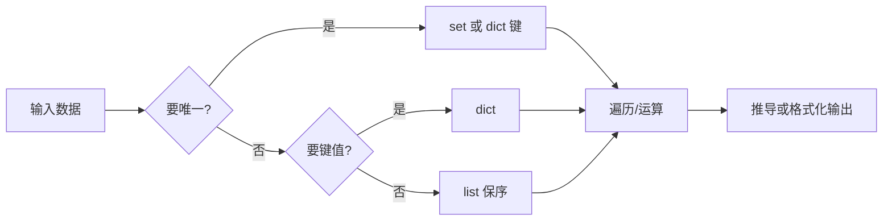
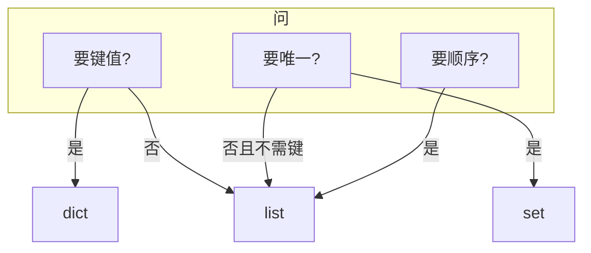

# 03｜语言最小集与数据结构 · SRE 开发能力

> 巡检脚本用 list 存主机又去重，O(n²) 扫到超时；用 dict 当有序队列结果顺序乱跳；函数默认参数 `tags=[]` 导致第二次调用带着第一次的 tag——**不是 Python 不会，是数据结构选型没按场景来**。
> **本章回答**：一次数据结构选型的一生——`list` / `dict` / `set` / `tuple` 何时用、怎么遍历、可变默认参数为什么是坑。
> **本章不讲**：对象 truthiness → [01 基础语法与数据模型](../01-基础语法与数据模型/)；工程布局 → [02 工程结构与虚拟环境](../02-工程结构与虚拟环境/)；异常退出 → [04 异常与退出码](../04-异常与退出码/)；并发 → [10 并发与GIL](../10-并发与GIL/)。

## 面试怎么考

| 标记 | 考点 |
|------|------|
| **核心** | list 有序可变；dict 键值 O(1)；set 去重 O(1)；tuple 不可变可哈希；**禁止可变默认参数** |
| **必会** | `for k, v in d.items()`；`if x in s` 用 set；列表推导 vs 循环 |
| **常用** | `collections.Counter` 计数；`defaultdict`；`enumerate` / `zip` |
| **常考** | `def f(a=[])` 陷阱；dict 键须可哈希；list 当集合去重的代价 |

**30 秒怎么说**：运维脚本里 **list** 管有序序列（主机列表、日志行）；**dict** 管映射（主机→状态、标签键值）；**set** 做成员测试和去重（已处理 IP、失败集合）；**tuple** 固定记录和 dict 键。别用 list 做 `in` 去重——大数据用 set。函数默认参数不要用 `[]`/`{}`，用 `None` 再在里面新建。推导式可读时用，复杂逻辑用 for。

---

## 能力边界

| 结构 | 适合 | 不适合 |
|------|------|--------|
| `list` | 有序、可重复、要下标 | 频繁 `x in lst` 去重 |
| `dict` | 查表、计数（配合 Counter）、JSON | 只要去不要值 |
| `set` | 去重、差集交集 | 要顺序（3.7+ dict 有序但 set 仍无序） |
| `tuple` | 不可变记录、dict 键 | 需要 append |

选对结构时 1000 主机 `in` 检查用 set 是 O(1)，全用 list 则 O(n)；保持扫描顺序用 list，set 无序；主机元数据用 dict，全用 list of dict 查表很慢。

> 🎯 **一句话**：选型先看**访问模式**——顺序？查表？去重？再选结构。

---

## 语言最小集

| 零件 | 示例 | 场景 |
|------|------|------|
| list 字面量 | `hosts = ["a", "b"]` | 有序列表 |
| append/extend | `lst.append(x)` / `lst.extend(xs)` | 拼结果 |
| dict | `st = {"h1": "ok"}` | 状态表 |
| set | `seen = set()` / `{1,2}` | 去重 |
| tuple | `row = ("cn", 443)` | 固定行 |
| `in` | `ip in blacklist` | 成员（set 快） |
| 推导 | `[x for x in xs if ok(x)]` | 过滤映射 |
| items | `for k, v in d.items()` | 遍历 dict |
| enumerate | `for i, ln in enumerate(lines)` | 要索引 |
| zip | `for h, p in zip(hosts, ports)` | 并行遍历 |
| None 默认 | `def f(xs=None): xs = xs or []` | 避免可变默认 |
| Counter | `Counter(lines)` | 计数 |

```python
# 最小巡检聚合
failed: set[str] = set()
status: dict[str, str] = {}
for host in hosts:
    ok = ping(host)
    status[host] = "up" if ok else "down"
    if not ok:
        failed.add(host)
return status, sorted(failed)   # 报告要稳定顺序时 sort
```

---

## 一、一张图：一次数据结构选型的一生

> 🎯 **一句话**：**读需求（顺序/查表/去重）→ 选型 → 填充 → 遍历消费 → 输出（可能 sort）**。



**读图**：漏检、重复告警、性能抖，往往在 **B（是否去重）** 和 **D（是否要映射）** 选错。监控聚合「按主机最后一次状态」用 dict；「本轮失败主机清单」用 set 再 `sorted` 输出。

---

## 二、出生：list — 有序可变序列（⭐常考）

> 🎯 **一句话**：**保序、可重复、按下标访问**——日志行、API 返回列表、待处理队列。

```python
pods = ["nginx-a", "nginx-b", "nginx-c"]
pods.append("nginx-d")
pods[0]          # 'nginx-a'
len(pods)
```

### 常用操作

| 操作 | 复杂度 | 备注 |
|------|--------|------|
| `append` | O(1) 均摊 | 尾部加 |
| `lst[i]` | O(1) | 随机访问 |
| `x in lst` | O(n) | 大列表改用 set |
| `sort` / `sorted` | O(n log n) | 见 01 章 |

```python
# 过滤 NotReady
bad = [p for p in pods if not is_ready(p)]

# 不要用 list 做成员集合
blacklist = ["10.0.0.1", "10.0.0.2", ...]  # 上千时 in 很慢
if ip in blacklist:   # 改 set(blacklist) 或预建 set
    ...
```

> 📝 **面试**：「list 适合有序收集；频繁 membership 用 set。」

---

## 三、映射：dict — 键值查表（🔥难点）

> 🎯 **一句话**：**按键 O(1) 平均访问**；Python 3.7+ **插入顺序保留**（实现细节变语言保证）。

```python
host_status: dict[str, str] = {}
host_status["10.0.0.1"] = "ok"
host_status.get("10.0.0.99", "unknown")

for host, st in host_status.items():
    print(host, st)
```

### 键的要求

键须**可哈希**（不可变）：`str`、`int`、`tuple`（元素皆可哈希）；**list、dict 不能作键**。

```python
# 错误
# d[[1, 2]] = "x"   # TypeError: unhashable type: 'list'

# 正确：tuple 或 str 化
d[(1, 2)] = "x"
d["1,2"] = "x"
```

### 合并与默认值

```python
base = {"timeout": 30}
extra = {"retries": 3}
cfg = {**base, **extra}   # 浅合并，右覆盖左

# get 与 setdefault
counts = {}
counts[host] = counts.get(host, 0) + 1
```

> 🔍 **现场**：JSON API 响应直接 `dict` 用；嵌套访问用 `.get("metadata", {}).get("name")` 防 KeyError（04 章）。

### `collections.Counter`

```python
from collections import Counter
lines = ["ERROR", "INFO", "ERROR", "ERROR"]
c = Counter(lines)
c["ERROR"]        # 3
c.most_common(1)  # [('ERROR', 3)]
```

日志级别统计、错误码 Top N——运维高频。

### `collections.defaultdict`

按键聚合时，`get` + 判断略啰嗦，`defaultdict` 在**缺键时自动造默认值**：

```python
from collections import defaultdict

by_zone: defaultdict[str, list[str]] = defaultdict(list)
for host in inventory:
    by_zone[host["zone"]].append(host["name"])
# 无需 if zone not in by_zone: by_zone[zone] = []
```

计数同理：`defaultdict(int)` 缺键为 0。注意：迭代 `defaultdict` 会包含**从未显式写入但访问过的键**——只 `d[k]` 过也会留下键；报告用 `dict(by_zone)` 或 `by_zone.keys()` 时要清楚语义。

> 🔍 **现场**：按 `namespace` 分组 Pod 名，`defaultdict(list)` 比手写 `setdefault` 少一半样板代码。

---

## 四、去重：set — 无序唯一集合（⭐常考）

> 🎯 **一句话**：**成员测试 O(1) 平均**；自动去重；支持 `&` `|` `-` 集合运算。

```python
processed: set[str] = set()
for ip in scan_queue:
    if ip in processed:
        continue
    do_work(ip)
    processed.add(ip)

failed = {"h1", "h2"}
success = {"h2", "h3"}
failed_only = failed - success   # {'h1'}
```

输出要稳定顺序时：

```python
for host in sorted(failed):
    print(host)
```

> ⚠️ **别混**：set **无序**——不要假设 `pop()` 或迭代顺序代表优先级；要顺序用 list 或 `sorted(set)`。

---

## 五、固定记录：tuple — 不可变序列

> 🎯 **一句话**：**不能改槽位**；可哈希时可作 dict 键；比 list 省一点、语义表达「固定形状」。

```python
Endpoint = tuple[str, int]   # 类型别名（3.9+）
ep: Endpoint = ("10.0.0.1", 8080)
cache: dict[Endpoint, float] = {ep: 0.12}

# 解包
host, port = ep
```

运维：`namedtuple` / `dataclass`（14 章）可读性更好；tuple 适合轻量键。

### 保序去重一行式（⭐常考）

API 或日志流里同一 Pod 名出现多次，报告要**首次出现顺序**的唯一列表：

```python
names = ["a", "b", "a", "c", "b"]
unique = list(dict.fromkeys(names))
# ['a', 'b', 'c']   # 3..7+ dict 保插入序
```

对比：`sorted(set(names))` 得到字典序 `['a','b','c']`，**不是**首次顺序。对比：`list(set(names))` 顺序不确定。

---

## 六、死亡陷阱：可变默认参数（🔥难点）

> 🎯 **一句话**：`def f(x=[])` 的 `[]` **在 def 时创建一次**，所有调用共享。

```python
def add_tag(tag, tags=[]):
    tags.append(tag)
    return tags

add_tag("cn")    # ['cn']
add_tag("sg")    # ['cn', 'sg']  ← 不是 ['sg']
```

**正确写法**：

```python
def add_tag(tag, tags=None):
    if tags is None:
        tags = []
    tags.append(tag)
    return tags
```

同理 `def f(cfg={})` —— 永远用 `None` + 函数体内 `cfg = {} if cfg is None else cfg` 或 `copy.deepcopy`。

> 💡 **打个比方**：默认参数是「函数门口的共享白板」，不是「每次发新纸」。

> 📝 **面试**：「可变默认参数是 Python 经典坑；用 None 占位再新建。」

### 模块级可变常量

```python
CACHE = {}   # 模块级共享 —— 有意缓存可以，但要文档化

def get_cluster_info(name):
    if name not in CACHE:
        CACHE[name] = fetch(name)
    return CACHE[name]
```

与默认参数不同：模块级**显式**共享状态；测试时要 `CACHE.clear()` 或注入 mock。

> 📝 **面试**：「可变默认参数是隐式共享；模块级 `CACHE` 是显式共享——显式的可测试、可文档化。」

---

## 七、遍历与推导：怎么写才像运维代码（⭐常考）

> 🎯 **一句话**：**简单过滤用推导；多分支、副作用用 for**。

```python
# 好：推导
ready = [p for p in pods if p.endswith("-ready")]

# 好：副作用
for pod in pods:
    if not ready(pod):
        log.warning("not ready %s", pod)

# 差：推导里 print
# [print(p) for p in pods]
```

`enumerate` / `zip`：

```python
for i, line in enumerate(log_lines, start=1):
    if "ERROR" in line:
        print(i, line)

for host, port in zip(hosts, ports):
    check(host, port)
```

### 推导式进阶

dict 推导——把 list 转成查表结构：

```python
pods = ["nginx-a", "nginx-b", "nginx-c"]
status_map = {pod: ping(pod) for pod in pods}
# {'nginx-a': True, 'nginx-b': False, 'nginx-c': True}

# 过滤 + 映射
down = {pod: st for pod, st in status_map.items() if not st}
# {'nginx-b': False}
```

set 推导——一行去重：

```python
unique_errors = {line.split()[0] for line in log_lines if "ERROR" in line}
```

嵌套推导别超过两层，否则可读性骤降——超过就拆成 for 循环加临时变量。

### GIL 与数据结构选型

Python 的 **GIL（Global Interpreter Lock）** 保证同一时刻只有一个线程执行字节码。这意味着多线程里共享 `dict`/`list` 的**单操作**（`d[k]=v`、`lst.append(x)`）是原子的，但**复合操作**（`if k not in d: d[k] = []`）仍可能竞争。

```python
# 线程安全：单操作原子
results: list[str] = []
for t in threads:
    t.start()
# 每个线程 results.append(x) 安全

# 不安全：check-then-act 非原子
if host not in cache:   # 两线程同时到这
    cache[host] = fetch(host)  # 可能 fetch 两次
```

多线程写共享结构用 `threading.Lock` 或 `queue.Queue`（10 章展开）。

> ⚠️ **别混**：GIL 让单操作原子，**不等于**线程安全——复合操作仍要加锁。

---

## 八、收束：选型凭什么不踩坑（🔥难点）



**可背清单（五件套）**：

- 查表、计数 → dict / Counter
- 去重、membership → set
- 有序收集 → list
- 固定记录、可哈希键 → tuple
- 默认参数 → `None`，函数内新建

> ⚠️ **别混**：结构选型**不解决**并发写共享 dict（10 章）；也不替代数据库。

---

## 九、作战：慢脚本、重复告警、第二次调用带脏数据（🔥难点）

**现象 · 先做 · 别做**

| 现象 | 先做 | 别做 |
|------|------|------|
| `in` 很慢 | 是否 list 当集合 | 盲目多进程 |
| 第二次调用结果串 | 查可变默认参数 | 全局乱 clear |
| dict KeyError | `.get` 链式 | 裸 `d[k]` 不查 |
| 输出顺序抖动 | set 直接迭代 | 以为 set 有序 |
| JSON 键重复覆盖 | 理解 dict 键唯一 | 用 list 存重复键 |

**60 秒剧本** 🔧：

| 时段 | 动作 |
|------|------|
| 0–15s | 打印 `type(container)`、长度、`id`（是否共享） |
| 15–30s | 热点是否 `x in list` → 改 set |
| 30–45s | 查函数 `def` 行默认参数 |
| 45–60s | 报告输出前 `sorted()` 稳定顺序 |

---

## 生产模板（🔧实操）

### 模板 1：主机扫描结果聚合

```python
#!/usr/bin/env python3
from __future__ import annotations


def scan_hosts(hosts: list[str]) -> tuple[dict[str, str], list[str]]:
    status: dict[str, str] = {}
    failed: set[str] = set()
    for h in hosts:
        ok = ping(h)  # 实现略
        status[h] = "up" if ok else "down"
        if not ok:
            failed.add(h)
    return status, sorted(failed)
```

### 模板 2：安全默认参数

```python
def build_labels(
    cluster: str,
    extra: dict[str, str] | None = None,
) -> dict[str, str]:
    labels = {"cluster": cluster, "team": "sre"}
    if extra:
        labels.update(extra)
    return labels
```

### 模板 3：Counter 统计退出码

```python
from collections import Counter

def summarize(results: list[int]) -> Counter:
    return Counter(results)

# summarize([0,0,1,1,1,2]) → Counter({1: 3, 0: 2, 2: 1})
```

### 模板 4：黑名单 set

```python
BLACKLIST: frozenset[str] = frozenset({
    "10.0.0.1",
    "10.0.0.2",
})

def allowed(ip: str) -> bool:
    return ip not in BLACKLIST
```

`frozenset` 不可变，可共享无意外修改。

---

## 踩坑清单

| 现象 | 原因 | 修法 |
|------|------|------|
| defaultdict 多出空键 | 只读 `d[k]` 未真写入 | 用普通 dict + get |
| 第二次 tags 含第一次 | `def f(t=[])` | `None` + 新建 |
| `KeyError` | 键不存在 | `.get` / `in` 先判 |
| list 去重慢 | O(n) in | `set(lst)` |
| 丢顺序的去重 | 直接 set 迭代 | `dict.fromkeys(lst)` 保序去重（3.7+） |
| 改遍历中的 list | `remove` 跳过元素 | 遍历副本或新 list |
| dict 键 list | 不可哈希 | tuple/str 键 |
| 推导副作用 | `[f(x) for x in xs]` f 有 IO | 改 for |
| 浅合并嵌套串 | `{**a,**b}` | deepcopy |

---

## 必会 · 常考（⭐常考）

| 说法 | 对错 | 口径 |
|------|:----:|------|
| `def f(a=[])` 安全 | 错 | 共享同一 list |
| set 有序 | 错 | 无序；要顺序 sorted |
| dict 键可以是 list | 错 | 须可哈希 |
| `x in set` 比 list 快 | 对 | 大数据明显 |
| list 推导总比 for 快 | 错 | 可读优先；微差别 |
| Counter 是 dict 子类 | 对 | 缺键返回 0 |
| tuple 完全不可变 | 错 | 元素可变对象内容可变 |
| `dict.fromkeys` 可保序去重 | 对 | 3.7+ 保插入序 |

---

## 数字墙

> list `in` 成员测试 O(n)；set `in` O(1)——1000 个元素差 1000 倍
> dict 3.7+ 保证插入顺序；set 无序
> `Counter` 缺键返回 0（是 dict 子类）
> `frozenset` 不可变可哈希——可做 dict 键

---

## 命令速查 🔧

```python
# 交互验证
python3 - <<'PY'
def bad(x=[]):
    x.append(1)
    return x
print(bad(), bad())

from collections import Counter
print(Counter("aabbc"))
PY
```

---

## 面试锚点

- **list vs set vs dict？** — 有序序列 / 去重成员 / 键值映射
- **可变默认参数？** — def 时创建一次；用 None
- **如何稳定输出 set？** — `sorted(s)`
- **日志计数用什么？** — Counter
- **dict 键要求？** — 可哈希、不可变

---

## 合上书，问自己

- [ ] 画选型主图：唯一？键值？顺序？
- [ ] 为什么 blacklist 用 set 不用 list？
- [ ] 可变默认参数错例与修法？
- [ ] `Counter` 和手动 `dict` 计数差在哪？
- [ ] `zip` / `enumerate` 各解决什么？
- [ ] dict 浅合并 `{**a,**b}` 坑在哪？
- [ ] 保序去重一行写法？
- [ ] 模块级 `CACHE = {}` 和默认参数 `{}` 语义差？

八题能口述，数据结构选型就过关了。下一章把**失败**用异常和退出码交给 CI。
