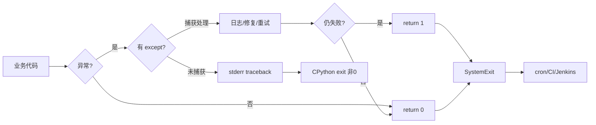
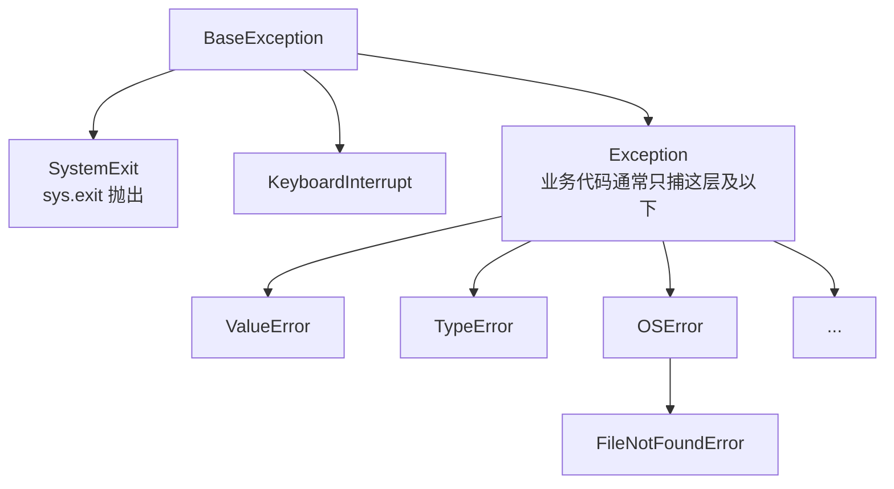
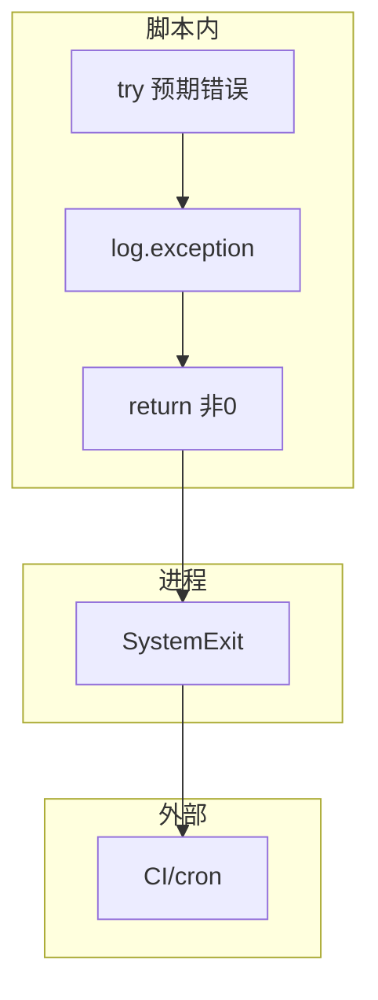

# 04｜异常与退出码 · SRE 开发能力

> 巡检脚本 API 超时抛了 `TimeoutError`，cron 仍显示成功——因为没人 catch，栈打印完进程却 **exit 0**；有人 `except Exception: pass` 把失败吞了；CI 里 `python check.py` 绿着，集群实际不健康——**运维脚本的契约是：失败必须非 0 退出码**。
> **本章回答**：一次失败从异常抛出、捕获处理到 `sys.exit(1)` 交给调度器的完整链路。
> **本章不讲**：logging 规范 → [05 logging日志规范](../05-logging日志规范/)；`argparse` → [06 argparse与配置管理](../06-argparse与配置管理/)；`subprocess` 退出码 → [08 subprocess执行外部命令](../08-subprocess执行外部命令/)。

## 面试怎么考

| 标记 | 考点 |
|------|------|
| **核心** | `try/except/else/finally`；`raise`；`sys.exit(code)` / `raise SystemExit`；`main() -> int` |
| **必会** | 脚本失败必须非 0；`except Exception` 后要 `return 1` 或 `raise`；不要裸 `except:` |
| **常用** | 自定义异常；异常链 `raise ... from e`；区分业务失败 vs 用法错误（退出码 1 vs 2） |
| **常考** | 未捕获异常是否非 0；`sys.exit(0)` 与 `return 0` 在 `__main__` 的区别；吞异常后果 |

**30 秒怎么说**：运维脚本把**可恢复错误** catch 后打日志并决定继续或汇总失败；**不可恢复**或最终失败用 `return 1` 或 `raise`，由 `raise SystemExit(main())` 交给 shell。禁止 `except: pass`。`main()` 返回 int 作退出码：0 成功，1 一般失败，2 用法错误（可选）。未捕获异常 CPython 会以非 0 退出，但别依赖「碰运气」——显式处理并 `exit 1`。CI、cron、Argo Workflow 都只看退出码。

---

## 能力边界

| 维度 | 显式退出码 + 异常 | 只靠 print | Shell `set -e` |
|------|-------------------|------------|----------------|
| **适合** | Python 编排、API、多步检查 | 人眼看输出 | 调外部命令链 |
| **不适合** | 吞异常仍 exit 0 | 自动化门禁 | Python 内部逻辑 |
| **契约** | **非 0 = 失败** | 无机器可读契约 | 子进程非 0 即停 |

`try/except` 管预期内失败路径，不管业务逻辑正确性；`sys.exit(n)` 管进程退出码，不管子线程异常（主线程未捕）；`raise` 中断当前调用栈，但不管自动重试（要手写）。

> 🎯 **一句话**：**调度器不认你打了多少 ERROR 日志，只认退出码**——这是 SRE 脚本与交互脚本的边界。

---

## 语言最小集

| 零件 | 示例 | 含义 |
|------|------|------|
| try/except | `try: f()` `except OSError: ...` | 捕获预期异常 |
| else | `else:` 在 try 无异常时 | 少把正常逻辑塞 try |
| finally | `finally: close()` | 必执行清理 |
| raise | `raise ValueError("bad")` | 主动失败 |
| from | `raise X from e` | 保留原因链 |
| Exception | `except Exception:` | 宽捕（要谨慎） |
| BaseException | `KeyboardInterrupt` 等 | 一般不捕 |
| sys.exit | `sys.exit(1)` | 立即退出，码 n |
| SystemExit | `raise SystemExit(1)` | 异常形式退出 |
| main 返回 | `return 1` | 由 `__main__` 转退出码 |
| traceback | `traceback.format_exc()` | 日志里打栈 |

```python
#!/usr/bin/env python3
import sys

def main() -> int:
    try:
        run_checks()
    except ConfigError as e:
        print(f"config: {e}", file=sys.stderr)
        return 2
    except CheckFailed as e:
        print(f"check failed: {e}", file=sys.stderr)
        return 1
    return 0

if __name__ == "__main__":
    raise SystemExit(main())
```

---

## 一、一张图：一次失败从异常到退出码的一生（⭐常考）

> 🎯 **一句话**：**出错（raise）→ 传播（栈回溯）→ 捕获（except）或未捕 → 决策（继续/汇总）→ 交卷（return 1 / sys.exit）→ 调度器读码**。



**读图**：**吞异常仍走 C（return 0）** 是线上假绿重灾区。监控可以捞日志，但**门禁**看 **K**——必须在 **G/J** 明确非 0。

---

## 二、出生：异常是什么（⭐常考）

> 🎯 **一句话**：异常是**非正常控制流**——用 `raise` 中断，用 `try/except` 在边界接住。

```python
def load_config(path: str) -> dict:
    with open(path, encoding="utf-8") as f:
        import json
        return json.load(f)   # JSONDecodeError, FileNotFoundError 可能抛出
```

异常类型是类，形成继承树：



> 📝 **面试**：「不要 `except:` 裸捕；`except Exception` 可以但要记录并决定是否退出；`KeyboardInterrupt` 别吞。」

---

## 三、捕获：try / except / else / finally（⭐常考）

> 🎯 **一句话**：**try** 放可能抛错的；**except** 按类型处理；**else** 仅 try 成功时；**finally** 必清理。

```python
def fetch_with_retry(url: str, retries: int = 3) -> str:
    last_err: Exception | None = None
    for attempt in range(1, retries + 1):
        try:
            return http_get(url)
        except TimeoutError as e:
            last_err = e
            log.warning("timeout attempt %s", attempt)
    raise RuntimeError(f"failed after {retries}") from last_err
```

### 多 except 与顺序

```python
try:
    process()
except FileNotFoundError:
    return 2
except OSError as e:
    log.error("os error: %s", e)
    return 1
except Exception:
    log.exception("unexpected")
    return 1
```

子类要先于父类捕获（`FileNotFoundError` 在 `OSError` 前）。

### else / finally

```python
fh = None
try:
    fh = open(path)
    data = fh.read()
except OSError:
    return 1
else:
    parse(data)      # 仅 open+read 成功才解析
finally:
    if fh:
        fh.close()
```

更推荐 `with open(path) as fh:`（上下文管理器自动 finally）。

> ⚠️ **别混**：`else` 不是「否则」——是 **try 块无异常时** 执行。

### `finally` 里的 `return` 会吞异常

```python
def bad():
    try:
        raise ValueError("real error")
    finally:
        return 0   # 异常被吞，调用方看到 0 ← 假绿
```

`finally` 块里的 `return` 或 `raise` 会覆盖 try/except 里的返回值或异常——所以 finally 只做清理（关文件、释放锁），不做控制流决策。

---

## 四、传播：raise 与异常链（🔥难点）

> 🎯 **一句话**：**不捕就往上抛**；包装时用 `raise NewError(...) from e` 保留原因。

```python
def check_api():
    try:
        client.list_pods()
    except ApiException as e:
        raise CheckFailed("kubernetes api unavailable") from e
```

```python
# 错误：丢失原因
except ApiException:
    raise CheckFailed("api down")   # __cause__ 为空，排障难
```

`log.exception("msg")` 等价于 `log.error(..., exc_info=True)`，打完整栈。

### 自定义异常

```python
class CheckFailed(Exception):
    """一项或多项检查未通过（可汇总）"""

class ConfigError(Exception):
    """配置/用法错误"""
```

运维脚本：**可预期的失败类型**用自定义异常，在 `main` 边界映射到退出码。不要过度设计——三个以内的失败类型直接用 `Exception` + 消息区分也行，超过再考虑自定义类树。

> 📝 **面试**：「自定义异常让 `main` 里的 except 分支语义清晰；退出码是给调度器的契约，异常是给程序的。」

---

## 五、交卷：退出码与 sys.exit（⭐常考）

> 🎯 **一句话**：**0 = 成功；非 0 = 失败**；用 `main() -> int` + `raise SystemExit(main())` 统一出口。

### CPython 默认行为

| 结束方式 | 退出码 |
|----------|--------|
| 正常结束 / `sys.exit(0)` | 0 |
| `sys.exit(n)` n≠0 | n（常 256 取模显 shell） |
| 未捕获异常 | 1（一般） |
| `KeyboardInterrupt` | 130 左右 |

```bash
python check.py
echo $?    # 0 或 1
```

> 🔍 **现场**：Jenkins「脚本成功」但邮件说失败——查是否 `except: pass` 后仍 `return 0`。

### 推荐入口模式

```python
def main() -> int:
    args = parse_args()
    if args.verbose and args.quiet:
        print("conflicting flags", file=sys.stderr)
        return 2
    failures = run_all_checks()
    if failures:
        for f in failures:
            print(f, file=sys.stderr)
        return 1
    return 0

if __name__ == "__main__":
    raise SystemExit(main())
```

| 码 | 含义（团队可约定） |
|----|-------------------|
| 0 | 成功 |
| 1 | 检查失败 / 运行时错误 |
| 2 | 用法错误 / 配置错误 |
| 130 | 用户 Ctrl+C（一般不手写） |

### `return` vs `sys.exit` in main

在 `main()` 里 **`return 1`** 即可；在深层函数里要立刻终止进程才 `sys.exit(1)`（少用，难测）。

```python
# 可测试
def main() -> int:
    return 1 if failed else 0

# 难测试：深层直接 exit
def deep():
    sys.exit(1)
```

> 📝 **面试**：「`sys.exit` 抛 `SystemExit`，可被上层 catch——但 `__main__` 边界不要 catch 掉。」

---

## 六、反模式：吞异常与假绿（🔥难点）

> 🎯 **一句话**：**`except Exception: pass` = 对 CI 撒谎**。

```python
# 反模式
try:
    critical_check()
except Exception:
    pass
return 0   # 假绿
```

```python
# 正例：记录 + 非 0
failed = False
try:
    critical_check()
except Exception:
    log.exception("critical_check")
    failed = True
return 1 if failed else 0
```

### 宽泛 except 何时可接受

- 顶层 `main` 边界：`except Exception: log.exception; return 1`
- 循环里单条失败：`except Exception: log; continue` 但**最后汇总** `return 1 if any_failed`

```python
any_failed = False
for host in hosts:
    try:
        check(host)
    except CheckFailed:
        log.warning("host %s failed", host)
        any_failed = True
return 1 if any_failed else 0
```

> 💡 **打个比方**：吞异常像火警响了却关掉铃——房子仍着火，CI 以为一切正常。

---

## 七、收束：失败凭什么被调度器看见（🔥难点）



**可背清单（六件套）**：

- `main() -> int`，`raise SystemExit(main())`
- 失败 `return 1`，用法错 `return 2`（约定写 README）
- 禁止 `except: pass`
- 宽捕必须 `log.exception`
- 批量任务汇总失败再非 0
- 包装异常用 `raise ... from e`

> ⚠️ **别混**：退出码**不传递**给调用方 unless `subprocess` 显式读（08 章）。

---

## 八、作战：CI 绿但检查失败、栈刷屏、cron 无邮件（🔥难点）

**现象 · 先做 · 别做**

| 现象 | 先做 | 别做 |
|------|------|------|
| CI 绿集群不健康 | 查 `main` 是否 `return 0`；吞异常 | 只看 stdout 日志 |
| 栈打到 cron 邮件 | 顶层 catch + 简短 stderr | 裸抛未处理异常 |
| 退出码 256 | `echo $?`；Python `exit(300)` 模 256 | 用超大码当语义 |
| 部分主机失败仍 0 | 是否 `continue` 无汇总 | 每台失败都 `exit` 中断 |
| `SystemExit` 被 catch | 除测试外别捕 `SystemExit` | 在 main 外 catch 退出 |

**60 秒剧本** 🔧：

- **0–10s**：本地 `python script.py; echo $?`
- **10–25s**：grep `except` / `pass` / `return 0`
- **25–40s**：故意失败一次，确认 CI 红
- **40–60s**：README 退出码表与代码一致

```bash
python scripts/healthcheck.py || echo "failed with $?"
```

---

## 生产模板（🔧实操）

### 模板 1：标准 main 与退出码

```python
#!/usr/bin/env python3
from __future__ import annotations

import sys


class UsageError(Exception):
    pass


class CheckFailed(Exception):
    pass


def main(argv: list[str] | None = None) -> int:
    try:
        args = parse_args(argv)
        run(args)
    except UsageError as e:
        print(f"usage: {e}", file=sys.stderr)
        return 2
    except CheckFailed as e:
        print(f"FAILED: {e}", file=sys.stderr)
        return 1
    except Exception:
        print("unexpected error", file=sys.stderr)
        raise   # 或 log.exception + return 1
    return 0


if __name__ == "__main__":
    raise SystemExit(main())
```

### 模板 2：批量检查汇总失败

```python
def main() -> int:
    failures: list[str] = []
    for name, fn in CHECKS:
        try:
            fn()
        except CheckFailed as e:
            failures.append(f"{name}: {e}")
    if failures:
        for line in failures:
            print(line, file=sys.stderr)
        return 1
    return 0
```

### 模板 3：上下文管理器清理

```python
from contextlib import contextmanager

@contextmanager
def temp_kubeconfig(content: str):
    path = write_temp(content)
    try:
        yield path
    finally:
        os.unlink(path)
```

### 模板 4：测试 main 退出码

```python
import pytest
from healthcheck import main

def test_usage_error():
    assert main(["--bad-flag"]) == 2

def test_ok():
    assert main(["--cluster", "staging"]) == 0
```

---

## 踩坑清单

| 现象 | 原因 | 修法 |
|------|------|------|
| CI 假绿 | except pass | 记录 + return 1 |
| 退出码总是 0 | main 未 SystemExit | `raise SystemExit(main())` |
| 栈泄露密钥 | 异常信息含 token | 捕后打泛化消息 |
| `exit()` 在库函数 | 不可复用 | 改 raise，main 里 exit |
| 子检查失败仍 0 | 无汇总 | `any_failed` 标志 |
| `raise "msg"` | 旧语法 | `raise ValueError("msg")` |
| finally 里 return | 覆盖退出码 | finally 只做清理 |
| 捕 `BaseException` | 吞 Ctrl+C | 只捕 Exception |

---

## 必会 · 常考（⭐常考）

| 说法 | 对错 | 口径 |
|------|:----:|------|
| 未捕获异常 exit 0 | 错 | 一般非 0 |
| 运维脚本失败必须非 0 | 对 | 调度器契约 |
| `except: pass` 可接受 | 错 | 假绿 |
| `sys.exit` 和 `quit` 一样 | 对 | quit 面向交互 |
| `return 1` 在 main 够用 | 对 | 配合 SystemExit |
| else 是 except 的否则 | 错 | try 成功才执行 |
| `raise X from e` 保留链 | 对 | 排障用 |
| 应用 `except KeyboardInterrupt` 继续跑 | 错 | 应优雅退出 |

---

## 数字墙

> 退出码 0 成功，1 失败，2 用法错误，130 约 Ctrl+C
> `sys.exit(n)` 实际抛 `SystemExit(n)`；shell `$?` 取 0-255
> 未捕获异常 → exit 1（CPython 默认）

---

## 命令速查 🔧

```bash
python -c "import sys; sys.exit(3)"; echo $?
# 3

python -c "1/0"; echo $?
# Traceback ... 然后 echo 显示 1

python script.py && echo OK || echo FAIL
```

```python
import sys
sys.exit("error message")  # 打印到 stderr，码 1
```

---

## 面试锚点

- **脚本怎么告诉 CI 失败？** — `main` 返回非 0，`SystemExit`
- **能 `except: pass` 吗？** — 不能，假绿
- **try/else/finally？** — else 无异常；finally 必执行
- **未捕获异常退出码？** — 通常 1
- **自定义异常干嘛？** — 边界映射退出码、语义清晰

---

## 合上书，问自己

- [ ] 画「失败一生」主图，标 except 与 SystemExit。
- [ ] `main() -> int` + `raise SystemExit(main())` 为什么推荐？
- [ ] `try/else/finally` 各何时执行？举例。
- [ ] `raise NewErr from e` 与裸 `raise NewErr` 排障差在哪？
- [ ] 批量 100 台检查 3 台失败，退出码应多少？怎么写？
- [ ] 三种导致 CI 假绿的 Python 写法？
- [ ] 退出码 0、1、2 你如何约定？
- [ ] 为什么库函数里避免 `sys.exit`？

八题能口述，异常与退出码就过关了。下一章用 [05 logging](../05-logging日志规范/) 把错误写进可检索日志。
