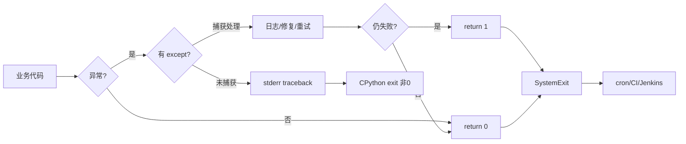
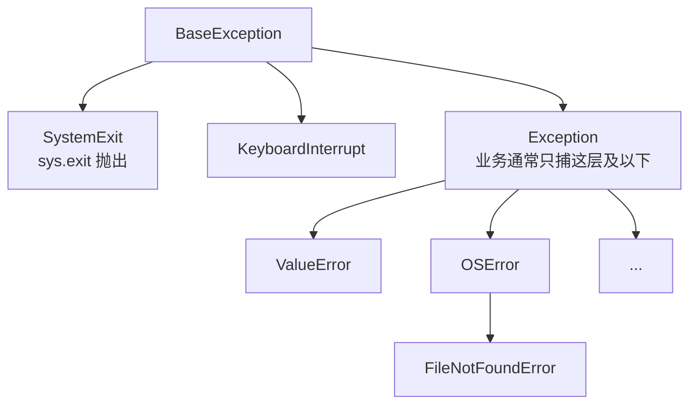
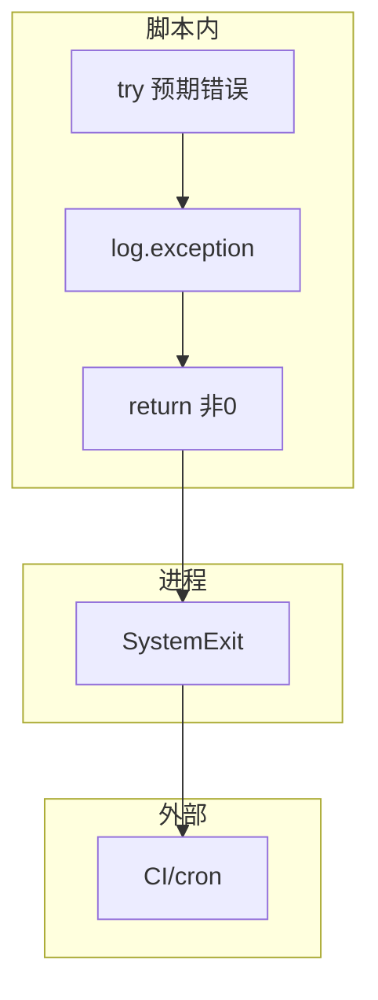
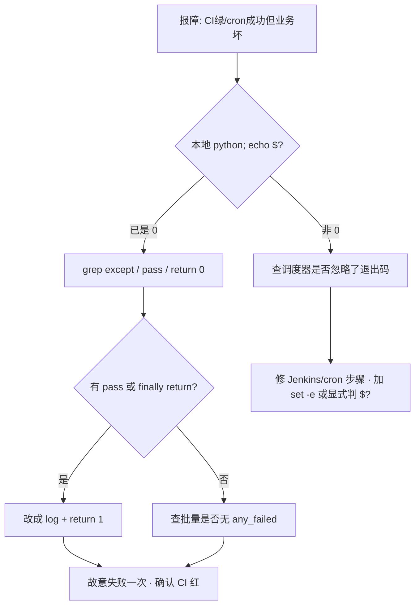

# 04｜异常与退出码

> 巡检脚本 API 超时抛了 `TimeoutError`，cron 仍显示成功——没人 catch，栈打印完进程却 **exit 0**；有人 `except Exception: pass` 把失败吞了；CI 里 `python check.py` 绿着，集群实际不健康——群里喊「监控不准」。
> **本章回答**：一次失败从异常抛出、捕获处理到 `sys.exit(1)` 交给调度器的完整链路。
> **不讲**：logging 规范 → [05](../05-logging日志规范/)；`argparse` → [06](../06-argparse与配置管理/)；`subprocess` 退出码 → [08](../08-subprocess执行外部命令/)。

**标记**：🎯重点 · 🔥难点 · ⭐常考 · 🔧实操

---

## 面试怎么考

| 标记 | 考点 |
|------|------|
| **核心** | `try/except/else/finally`；`raise`；`sys.exit(code)` / `raise SystemExit`；`main() -> int` |
| **必会** | 脚本失败必须非 0；`except Exception` 后要 `return 1` 或 `raise`；不要裸 `except:` |
| **常用** | 自定义异常；`raise ... from e`；业务失败 vs 用法错误（退出码 1 vs 2） |
| **常考** | 未捕获异常是否非 0；`sys.exit(0)` 与 `return 0`；吞异常后果 |

> 📝 **面试（30 秒）**：运维脚本把**可恢复错误** catch 后打日志并决定继续或汇总失败；**最终失败**用 `return 1` 或 `raise`，由 `raise SystemExit(main())` 交给 shell。禁止 `except: pass`。`main()` 返回 int：0 成功，1 一般失败，2 用法错误。未捕获异常 CPython 一般非 0，但别碰运气——显式 `exit 1`。CI / cron / Argo Workflow 只认退出码。

---

## 能力边界

| 维度 | 显式退出码 + 异常 | 只靠 print | Shell `set -e` |
|------|-------------------|------------|----------------|
| **适合** | Python 编排、API、多步检查 | 人眼看输出 | 调外部命令链 |
| **不适合** | 吞异常仍 exit 0 | 自动化门禁 | Python 内部逻辑 |
| **契约** | **非 0 = 失败** | 无机器可读契约 | 子进程非 0 即停 |

- 🔑 **三个零件各管一段**
  - `try/except`：预期内失败路径——**不**管业务逻辑对不对
  - `sys.exit(n)` / `SystemExit`：进程退出码——**不**管子线程里未捕的异常
  - `raise`：中断当前调用栈——**不**管自动重试（要手写）

> 🎯 **一句话**：**调度器不认你打了多少 ERROR 日志，只认退出码**——这是 SRE 脚本与交互脚本的边界。

---

## 语言最小集

写/读运维脚本，异常层认这些即可：

| 零件 | 示例 | 含义 |
|------|------|------|
| try/except | `except OSError:` | 捕获预期异常 |
| else | `else:` | try **无异常**时执行 |
| finally | `finally: close()` | 必执行清理 |
| raise / from | `raise X from e` | 主动失败 + 保留原因链 |
| Exception | `except Exception:` | 宽捕（要谨慎） |
| BaseException | `KeyboardInterrupt` 等 | 一般不捕 |
| sys.exit / SystemExit | `sys.exit(1)` | 立即退出，码 n |
| main 返回 | `return 1` | 由 `__main__` 转退出码 |

```python
#!/usr/bin/env python3
import sys

def main() -> int:
    try:
        run_checks()
    except ConfigError as e:
        print(f"config: {e}", file=sys.stderr)
        return 2
    except CheckFailed as e:
        print(f"check failed: {e}", file=sys.stderr)
        return 1
    return 0

if __name__ == "__main__":
    raise SystemExit(main())
```

- 🧩 **四行钉子**
  - `main() -> int` → 可测、语义清晰
  - 失败分支 `return 1/2` → 显式非 0
  - `raise SystemExit(main())` → 交给 shell 的唯一出口
  - 禁止 `except: pass` → 假绿红线

零件认完，上主图。

---

## 一、一张图：一次失败从异常到退出码的一生 ⭐

> 🎯 **一句话**：**出错（raise）→ 传播（栈回溯）→ 捕获（except）或未捕 → 决策（继续/汇总）→ 交卷（return 1 / sys.exit）→ 调度器读码**。



- 📖 **读图**
  - 🛤️ 主线六站：抛出 → 传播 → 捕获 → 决策 → 交卷 → 调度器；卡在哪一站就查哪一站
  - 🚨 **吞异常仍走 C（return 0）** 是线上假绿重灾区——栈打了、日志有 ERROR，门禁仍绿
  - 📟 监控可以捞日志，**门禁只认 K**——必须在 G/J 明确非 0

本节对应练习题 Q13。带着问题往下走——异常从哪来？

---

## 二、出生：异常是什么 ⭐

> 🎯 **一句话**：异常是**非正常控制流**——用 `raise` 中断，用 `try/except` 在边界接住。

```python
def load_config(path: str) -> dict:
    with open(path, encoding="utf-8") as f:
        import json
        return json.load(f)   # JSONDecodeError / FileNotFoundError 可能抛出
```

- 🌳 **异常是类，形成继承树**（业务代码通常只捕 `Exception` 及以下）：



- 📖 **读图**
  - 🚪 从 `BaseException` 往下看：`SystemExit` / `KeyboardInterrupt` 与业务失败**不是一路人**
  - 🎯 业务宽捕停在 `Exception`；捕到 `BaseException` 会吞 Ctrl+C 和 `sys.exit`

#### ❓ 为什么不能裸 `except:`？

- ❌ **裸 `except:`** = 捕 `BaseException` 及一切——连 `KeyboardInterrupt`、`SystemExit` 一起吞
- ✅ **`except Exception:`** = 只捕业务异常树；仍要记录并决定是否 `return 1`
- 🛑 **Ctrl+C / `sys.exit`** 必须能穿透——否则进程关不掉、测试里 exit 也被吃掉

> 📝 **面试**：「不要 `except:` 裸捕；`except Exception` 可以但要 `log.exception` 并决定是否退出；`KeyboardInterrupt` 别吞。」⭐

本节对应练习题 Q1。异常会飞，下一站：怎么接住。

---

## 三、捕获：try / except / else / finally ⭐

> 🎯 **一句话**：**try** 放可能抛错的；**except** 按类型处理；**else** 仅 try 成功时；**finally** 必清理。

```python
def fetch_with_retry(url: str, retries: int = 3) -> str:
    last_err: Exception | None = None
    for attempt in range(1, retries + 1):
        try:
            return http_get(url)
        except TimeoutError as e:
            last_err = e
            log.warning("timeout attempt %s", attempt)
    raise RuntimeError(f"failed after {retries}") from last_err
```

### 🎯 多 except 与顺序

```python
try:
    process()
except FileNotFoundError:
    return 2
except OSError as e:
    log.error("os error: %s", e)
    return 1
except Exception:
    log.exception("unexpected")
    return 1
```

- 🪜 **子类先于父类**：`FileNotFoundError` 必须在 `OSError` 前——否则永远进父分支
- 🎯 **越具体越好**：顶层才用宽 `Exception` 兜底

### 🧹 else / finally

```python
fh = None
try:
    fh = open(path)
    data = fh.read()
except OSError:
    return 1
else:
    parse(data)      # 仅 open+read 成功才解析
finally:
    if fh:
        fh.close()
```

- ✅ 更推荐 `with open(path) as fh:`——上下文管理器自带 finally
- ⚠️ **别混**：`else` 不是「否则」——是 **try 块无异常时** 执行

#### ❓ 为什么 `finally` 里不能 `return`？

```python
def bad():
    try:
        raise ValueError("real error")
    finally:
        return 0   # 异常被吞，调用方看到 0 ← 假绿
```

- 🔥 **`finally` 里的 `return` / `raise` 会覆盖** try/except 里的返回值或异常
- ✅ finally **只做清理**（关文件、释放锁、删临时文件）——不做控制流决策
- 🎭 这和 Shell 里 cleanup 把 `exit` 写成 0 是同一类事故

本节对应练习题 Q2、Q3。接住了还不够——包装时别把根因弄丢。

---

## 四、传播：raise 与异常链 🔥

> 🎯 **一句话**：**不捕就往上抛**；包装时用 `raise NewError(...) from e` 保留原因。

> 💡 **打个比方**：汇报别只说「发布失败」——要把「API 超时」附在后面。异常链就是那张附件。

🔥 **异常链** = `raise New from old`，把根因挂在新异常的 `__cause__` 上。⭐ 面试爱追问 `raise` vs `raise e`。

```python
def check_api():
    try:
        client.list_pods()
    except ApiException as e:
        raise CheckFailed("kubernetes api unavailable") from e
```

```python
# 错误：丢失原因
except ApiException:
    raise CheckFailed("api down")   # __cause__ 为空，排障难
```

- 🔗 **`raise ... from e`**：保留因果链，traceback 里有 `The above exception was the direct cause of...`
- 📝 **`log.exception("msg")`** ≡ `log.error(..., exc_info=True)`，打完整栈（细节见 [05](../05-logging日志规范/)）
- ⚠️ **别混**：`raise e`（裸重抛变量）在部分场景会弄乱栈帧；要原样上抛写 **`raise`**（不带参数）

#### ❓ 为什么要自定义异常，而不是全用 `Exception`？

```python
class CheckFailed(Exception):
    """一项或多项检查未通过（可汇总）"""

class ConfigError(Exception):
    """配置/用法错误"""
```

- ✅ **可预期失败类型** → 自定义类，在 `main` 边界映射退出码（1 vs 2）
- ⚖️ **别过度设计**：三个以内直接用 `Exception` + 消息也行；超过再拆类树
- 📝 **面试**：「自定义异常让 `main` 里的 except 分支语义清晰；退出码是给调度器的契约，异常是给程序的。」

本节对应练习题 Q4、Q5。根因保住了，怎么交卷给 CI？

---

## 五、交卷：退出码与 sys.exit ⭐

> 🎯 **一句话**：**0 = 成功；非 0 = 失败**；用 `main() -> int` + `raise SystemExit(main())` 统一出口。

### 📟 CPython 默认行为

| 结束方式 | 退出码 |
|----------|--------|
| 正常结束 / `sys.exit(0)` | 0 |
| `sys.exit(n)` n≠0 | n（shell 常对 256 取模） |
| 未捕获异常 | 1（一般） |
| `KeyboardInterrupt` | 约 130 |

```bash
python check.py
echo $?    # ← 0 或 1；CI/cron 只认这一行
```

- 🔍 **现场**：Jenkins「脚本成功」但邮件说失败——先查是否 `except: pass` 后仍 `return 0`

### 🚪 推荐入口模式

```python
def main() -> int:
    args = parse_args()
    if args.verbose and args.quiet:
        print("conflicting flags", file=sys.stderr)
        return 2
    failures = run_all_checks()
    if failures:
        for f in failures:
            print(f, file=sys.stderr)
        return 1
    return 0

if __name__ == "__main__":
    raise SystemExit(main())
```

- 🔢 **团队可约定的码**
  - `0` 成功
  - `1` 检查失败 / 运行时错误
  - `2` 用法错误 / 配置错误
  - `130` 用户 Ctrl+C（一般不手写）

#### ❓ 为什么 `main` 里 `return 1`，而不是深层 `sys.exit(1)`？

```python
# 可测试
def main() -> int:
    return 1 if failed else 0

# 难测试：深层直接 exit
def deep():
    sys.exit(1)
```

- ✅ **`return 1` in `main`**：单测直接 `assert main(...) == 1`，不杀解释器
- 🛑 **深层 `sys.exit`**：难测、难复用；库函数应 `raise`，由边界映射码
- ⚠️ **别混**：`sys.exit` 实际抛 `SystemExit`，上层**可以** catch——`__main__` 边界不要把它吃掉

> 📝 **面试**：「`sys.exit` 抛 `SystemExit`，可被上层 catch——但 `__main__` 边界不要 catch 掉。」

本节对应练习题 Q6、Q7。交卷规则清楚了——最危险的是假装成功。

---

## 六、反模式：吞异常与假绿 🔥

> 🎯 **一句话**：**`except Exception: pass` = 对 CI 撒谎**。

> 💡 **打个比方**：吞异常像火警响了却关掉铃——房子仍着火，CI 以为一切正常。

🔥 高频错答：「能跑完就行，日志里有栈」。调度器只认退出码；栈打了但 exit 0，CI 照样绿。

```python
# 反模式
try:
    critical_check()
except Exception:
    pass
return 0   # 假绿
```

```python
# 正例：记录 + 非 0
failed = False
try:
    critical_check()
except Exception:
    log.exception("critical_check")
    failed = True
return 1 if failed else 0
```

### 📦 宽泛 except 何时可接受

- 顶层 `main` 边界：`except Exception: log.exception; return 1`
- 循环里单条失败：`except ...: log; continue`，但**最后汇总** `return 1 if any_failed`

```python
any_failed = False
for host in hosts:
    try:
        check(host)
    except CheckFailed:
        log.warning("host %s failed", host)
        any_failed = True
return 1 if any_failed else 0
```

#### ❓ 为什么循环里 `continue` 还不够？

- ❌ **只 continue、最后 `return 0`** → 半台挂了仍绿（和 Shell `cmd || true` 同病）
- ✅ **`any_failed` / `failures` 列表** → 跑完全部再非 0
- 🛑 **每台失败都 `sys.exit(1)`** → 后面主机永远查不到——批量任务要汇总，不要半路掐死

本节对应练习题 Q8、Q9。六件套收束一下。

---

## 七、收束：失败凭什么被调度器看见 🔥

> 🎯 **一句话**：调度器看得见的失败 = **异常被正确处理 + 进程以非 0 退出**；少一环就是假绿。



- 📖 **读图**
  - 🧱 左栏三步缺一不可：捕到 → 记下来 → **return 非 0**
  - 📤 `SystemExit` 是脚本与调度器的接缝；被 catch 掉等于撕掉契约
  - 📟 CI 只看见最右的 C——日志再多也替代不了退出码

**可背清单（六件套）**：

1. `main() -> int`，`raise SystemExit(main())`
2. 失败 `return 1`，用法错 `return 2`（约定写 README）
3. 禁止 `except: pass`
4. 宽捕必须 `log.exception`
5. 批量任务汇总失败再非 0
6. 包装异常用 `raise ... from e`

> ⚠️ **别混**：退出码**不自动**传给调用方——除非 `subprocess` 显式读（[08](../08-subprocess执行外部命令/)）。退出码保证「本进程告诉父进程」；**不保证**「调用方一定检查了」。

> 📝 **面试**：六件套分三组记——**入口**（main+SystemExit）· **契约**（1/2、禁吞）· **可观测**（log.exception、from e、汇总）。

本节对应练习题 Q13。回到开头那个假绿现场——怎么作战。

---

## 八、作战：CI 绿但检查失败、栈刷屏、cron 无警报 🔥🔧

> 🎯 **一句话**：先本地 `echo $?`，再 grep 吞异常，再故意失败一次确认 CI 会红。



- 📖 **读图**：从「本地退出码」分叉——码已经是 0 → 脚本撒谎；码非 0 但门禁绿 → 调度器没认码

**现象 · 先做 · 别做**

| 现象 | 先做 | 别做 |
|------|------|------|
| CI 绿集群不健康 | 查 `main` 是否 `return 0`；吞异常 | 只看 stdout 日志 |
| 栈打到 cron 邮件 | 顶层 catch + 简短 stderr | 裸抛未处理异常刷屏 |
| 退出码 256 / 奇怪大数 | `echo $?`；Python `exit(300)` 模 256 | 用超大码当语义 |
| 部分主机失败仍 0 | 是否 `continue` 无汇总 | 每台失败都 `exit` 中断 |
| `SystemExit` 被 catch | 除测试外别捕 `SystemExit` | 在 main 外 catch 退出 |

**60 秒剧本** 🔧：

- **0–10s**：本地 `python script.py; echo $?`
- **10–25s**：grep `except` / `pass` / `return 0` / `finally:.*return`
- **25–40s**：故意失败一次，确认 CI 红
- **40–60s**：README 退出码表与代码一致

```bash
python scripts/healthcheck.py || echo "failed with $?"
# ← 非 0 才进 || 分支；若总是 OK，脚本在撒谎
```

本节对应练习题 Q10、Q11、Q12。下面模板可直接拿走。

---

## 生产模板 🔧

### 模板 1：标准 main 与退出码

```python
#!/usr/bin/env python3
from __future__ import annotations

import sys


class UsageError(Exception):
    pass


class CheckFailed(Exception):
    pass


def main(argv: list[str] | None = None) -> int:
    try:
        args = parse_args(argv)
        run(args)
    except UsageError as e:
        print(f"usage: {e}", file=sys.stderr)
        return 2
    except CheckFailed as e:
        print(f"FAILED: {e}", file=sys.stderr)
        return 1
    except Exception:
        print("unexpected error", file=sys.stderr)
        raise   # 或 log.exception + return 1
    return 0


if __name__ == "__main__":
    raise SystemExit(main())
```

### 模板 2：批量检查汇总失败

```python
def main() -> int:
    failures: list[str] = []
    for name, fn in CHECKS:
        try:
            fn()
        except CheckFailed as e:
            failures.append(f"{name}: {e}")
    if failures:
        for line in failures:
            print(line, file=sys.stderr)
        return 1
    return 0
```

### 模板 3：上下文管理器清理

```python
from contextlib import contextmanager

@contextmanager
def temp_kubeconfig(content: str):
    path = write_temp(content)
    try:
        yield path
    finally:
        os.unlink(path)   # ← 只清理，不 return
```

### 模板 4：测试 main 退出码

```python
import pytest
from healthcheck import main

def test_usage_error():
    assert main(["--bad-flag"]) == 2

def test_ok():
    assert main(["--cluster", "staging"]) == 0
```

---

## 踩坑清单

| 现象 | 原因 | 修法 |
|------|------|------|
| CI 假绿 | `except: pass` | 记录 + `return 1` |
| 退出码总是 0 | main 未 `SystemExit` | `raise SystemExit(main())` |
| 栈泄露密钥 | 异常信息含 token | 捕后打泛化消息 |
| `exit()` 在库函数 | 不可复用 / 难测 | 改 `raise`，main 里映射 |
| 子检查失败仍 0 | 无汇总 | `any_failed` 标志 |
| `raise "msg"` | 旧语法 | `raise ValueError("msg")` |
| finally 里 return | 覆盖退出码/异常 | finally 只做清理 |
| 捕 `BaseException` | 吞 Ctrl+C | 只捕 `Exception` |

---

## 必会 · 常考 ⭐

| 说法 | 对错 | 口径 |
|------|:----:|------|
| 未捕获异常 exit 0 | 错 | 一般非 0 |
| 运维脚本失败必须非 0 | 对 | 调度器契约 |
| `except: pass` 可接受 | 错 | 假绿 |
| `sys.exit` 和 `quit` 一样 | 基本对 | `quit` 面向交互 |
| `return 1` 在 main 够用 | 对 | 配合 `SystemExit` |
| else 是 except 的否则 | 错 | try 成功才执行 |
| `raise X from e` 保留链 | 对 | 排障用 |
| 应用捕 `KeyboardInterrupt` 继续跑 | 错 | 应优雅退出 |

---

## 收口

### 命令速查 🔧

```bash
python -c "import sys; sys.exit(3)"; echo $?
# 3  ← 显式码原样到 shell（0–255）

python -c "1/0"; echo $?
# Traceback ... 然后 $? 一般是 1  ← 未捕获异常

python script.py && echo OK || echo FAIL
# ← 靠退出码分支，不靠「有没有打印 Error」
```

```python
import sys
sys.exit("error message")  # 打印到 stderr，码 1
```

### 面试锚点

遮住右列自问自答，卡壳的行回去重读对应小节。

| 问 | 30 秒答 |
|----|---------|
| 脚本怎么告诉 CI 失败？ | `main` 返回非 0，`raise SystemExit(main())` |
| 能 `except: pass` 吗？ | 不能，假绿 |
| try/else/finally？ | else=try 无异常；finally 必执行、只清理 |
| 未捕获异常退出码？ | 通常 1 |
| 自定义异常干嘛？ | 边界映射退出码、语义清晰 |
| `raise X from e`？ | 保留 `__cause__`，排障看根因 |

### 易错一句话对照

- 日志打了 ERROR 就算失败 → 调度器只认退出码；必须非 0
- `except: pass` 能跑完就行 → 对 CI 撒谎；记录 + `return 1`
- else 是 except 的否则 → else 是 **try 成功**才跑
- finally 里 `return 0` 善后 → 会吞异常/改退出码；finally 只清理
- 深层 `sys.exit(1)` 最干净 → 难测；库函数 `raise`，main 映射
- 包装异常直接 `raise New` → 丢根因；用 `raise New from e`
- 循环里 continue 就算处理完 → 必须 `any_failed` 汇总再非 0
- 未捕获异常会 exit 0 → CPython 一般非 0；仍要显式处理
- 捕 `BaseException` 更保险 → 吞 Ctrl+C / `SystemExit`；只捕 `Exception`
- `main` 返回了就够 → 还要 `raise SystemExit(main())` 才进 `$?`

### 数字墙

> 退出码 **0** 成功，**1** 失败，**2** 用法错误，**130** 约 Ctrl+C。`sys.exit(n)` 实际抛 `SystemExit(n)`；shell `$?` 取 **0–255**（大数模 256）。未捕获异常 → 一般 exit **1**（CPython 默认）。

---

## 合上书

- [ ] **默画**失败一生：抛出 → except → exit → 调度器（Q13）
- [ ] `try/except/else/finally` 各何时跑？finally 为什么不能 `return`？（Q2、Q3）
- [ ] `raise X from e` 干什么？和裸 `raise New` 差在哪？（Q4、Q5）
- [ ] 为什么裸 `except:` 危险？和 `except Exception` 边界？（Q1、Q8）
- [ ] `sys.exit(1)` 与 `return 1` 在 main 里怎么接？（Q6、Q7）
- [ ] `except Exception: pass` 为什么是红线？（Q8、Q9）
- [ ] 批量检查如何汇总失败退出码？（Q11）
- [ ] CI 绿但检查失败：60 秒先敲什么？（Q10、Q12）

八题能口述，异常与退出码过关。下一章用 **logging** 把可观测性补上——退出码告诉「成没成」，日志告诉「为什么」。
