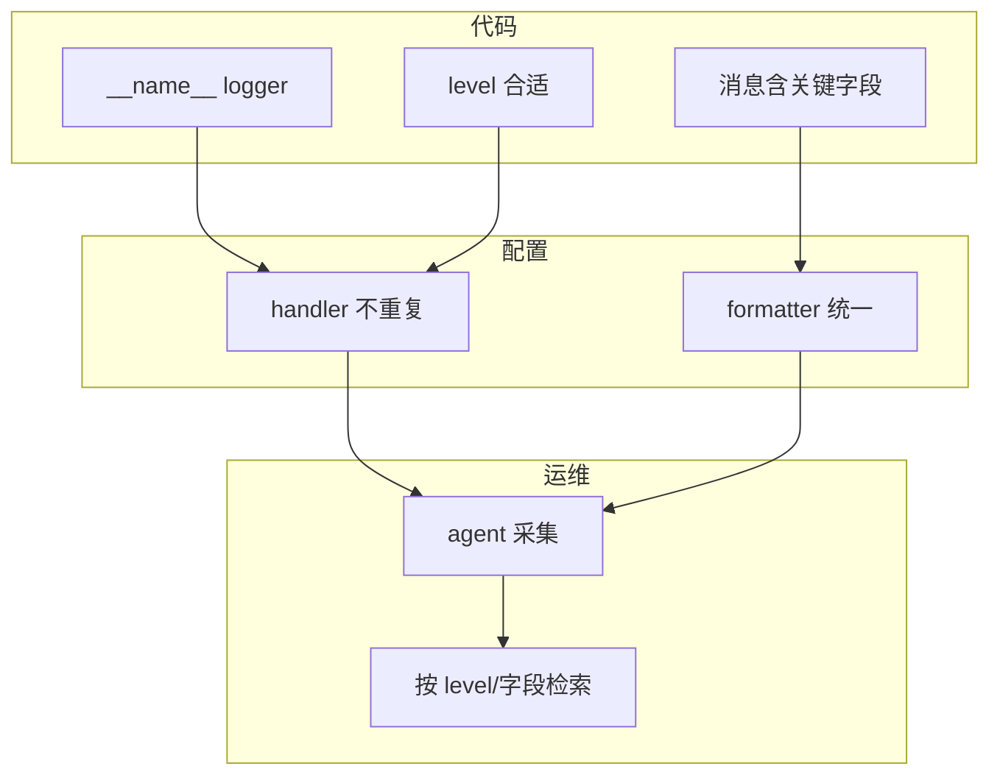

# 05｜logging 日志规范 · SRE 开发能力

> 凌晨 cron 邮件里混着 `print("checking...")` 和半截 traceback；ELK 搜 `ERROR` 全是 print 噪音；有人 import 时 `basicConfig()` 调两遍，同一条日志打三行——群里已经有人喊「日志没用关掉算了」。
> **本章回答**：一条日志从 `logger.info()` 产生，经 Logger / Handler / Formatter 到 stdout、文件、采集器落盘的完整链路。
> **不讲**：异常与退出码 → [04](../04-异常与退出码/)；CLI 参数 → [06](../06-argparse与配置管理/)；子进程输出 → [08](../08-subprocess执行外部命令/)。

**标记**：🎯重点 · 🔥难点 · ⭐常考 · 🔧实操

---

## 面试怎么考

| 标记 | 考点 |
|------|------|
| **核心** | `logging.getLogger(__name__)`；Level；Handler + Formatter；**禁止生产用 print 代替日志** |
| **必会** | `log.exception` / `exc_info=True`；`basicConfig` 只调一次；stdout vs 文件；不记密码/token |
| **常用** | `RotatingFileHandler`；`dictConfig`；`extra` 字段；JSON 行日志供 Loki/ELK |
| **常考** | 重复 handler 双份日志；root logger vs 子 logger；`logger` 名与模块路径 |

**30 秒怎么说**：库和脚本用 **`logging`**，入口 `basicConfig` 或 `dictConfig` **只配一次**。业务代码 `log = logging.getLogger(__name__)`，按级别打：`debug` 排障、`info` 里程碑、`warning` 可恢复、`error` 失败、`exception` 带栈。Formatter 统一时间/级别/模块/消息；文件轮转防撑盘。采集侧按级别和字段检索——所以用 `extra={"cluster": c}` 比拼字符串好。密钥、kubeconfig、Authorization 绝不入日志。

---

## 能力边界

| 维度 | `logging` | `print` | 指标（Prometheus） |
|------|-----------|---------|-------------------|
| **适合** | 事件叙述、排障轨迹、审计 | 人眼临时调试 | 聚合数值、告警阈值 |
| **不适合** | 高频采样计数 | 生产可检索日志 | 讲清「为什么失败」的上下文 |
| **契约** | 分级 + 可检索 | 无级别、难过滤 | 时序，非逐条故事 |

- 🎭 **三个零件各管一段**
  - **Logger**：是否放行这条记录（level）——不管进程退出码（见 [04](../04-异常与退出码/)）
  - **Handler**：写到哪里（流 / 文件 / 网络）——不管业务逻辑对不对
  - **Formatter**：长什么样——不管日志保留几天（运维侧策略）

> 🎯 **一句话**：**调度器看退出码，oncall 看日志**——两件事都要做对，但不能互相替代。

---

## 语言最小集

读运维脚本的 10 个「句法零件」——认代码下限，不是 logging 大全。

| 零件 | 示例 | 含义 |
|------|------|------|
| getLogger | `log = logging.getLogger(__name__)` | 按模块名分层 |
| level | `log.setLevel(logging.INFO)` | 过滤阈值 |
| info/warning/error | `log.info("host=%s ok", host)` | 懒格式化 `%s` |
| exception | `log.exception("check failed")` | ERROR + 栈 |
| exc_info | `log.error("x", exc_info=True)` | 同 exception |
| basicConfig | `logging.basicConfig(level=INFO, format=...)` | 进程级一次配置 |
| Handler | `StreamHandler` / `FileHandler` | 输出目的地 |
| Formatter | `Formatter("%(asctime)s %(levelname)s %(message)s")` | 格式串 |
| extra | `log.info("done", extra={"job": jid})` | 结构化字段 |
| disable | `logging.disable(CRITICAL)` | 测试里静默 |

```python
import logging

log = logging.getLogger(__name__)

def check_disk(path: str) -> bool:
    usage = read_usage(path)
    if usage > 90:
        log.error("disk critical path=%s usage=%s", path, usage)
        return False
    log.info("disk ok path=%s usage=%s", path, usage)
    return True
```

---

## 一、一张图：一条日志从产生到落盘的一生

> 🎯 **一句话**：**代码调用 → Logger 判级 → 传播到父 Logger → Handler 格式化 → I/O 落盘 / 采集**。


- 📖 **读图**
  - 🛤️ 主线：调用 → 判级 → 传播 → Handler → Formatter → 落盘 → 索引
  - 🔍 oncall 在 **G** 检索；断在 **B**（级别太高看不到 debug）或 **D**（没挂 Handler）最常见；双份日志多半是 **D** 上同一 Handler 挂了两次

本节对应练习题 Q13。主图装进脑子后，顺着「出生 → 上路 → 干活 → 进门 → 落盘」一站一站往下走。

---

## 二、出生：Logger 与级别 ⭐常考

> 🎯 **一句话**：**Logger 是命名通道 + 级别闸门**；子 logger 默认把记录**向上传播**给 root。

### 📮 getLogger 与标准级别

```python
import logging

log = logging.getLogger(__name__)   # 例如 scripts.healthcheck
log.setLevel(logging.DEBUG)         # 本 logger 闸门；常与 handler 级别配合
```

- 🎚️ **标准级别**（数值越小越详细）

```text
DEBUG(10) < INFO(20) < WARNING(30) < ERROR(40) < CRITICAL(50)
```

- 🗺️ **怎么选级别**
  - `debug` — 排障细节（默认关）
  - `info` — 正常里程碑
  - `warning` — 可恢复异常
  - `error` — 失败
  - `critical` — 极少用，进程级致命

```python
log.debug("verbose detail host=%s", host)
log.info("check finished cluster=%s", cluster)
log.warning("retry %s/%s", i, max_retries)
log.error("api unreachable url=%s", url)
log.critical("config missing, abort")
```

> 📝 **面试**：「用 `getLogger(__name__)` 而不是字符串 `'myapp'`，import 路径即层次，方便按包调级别。」⭐（练习题 Q2）

#### ❓ 为什么不用 print？

- ❌ **print**：无级别、无模块名、难统一格式 → ELK 里搜不到真 ERROR
- ✅ **logging**：分级 + Handler + Formatter → 采集侧可按 `level` / `logger` 过滤
- 🎭 print 只适合本地人眼看一眼；cron / K8s Job / CI 要契约，不是字符串噪音

### 🔗 传播 propagate

```python
parent = logging.getLogger("app")
child = logging.getLogger("app.worker")
child.info("hello")   # 默认 propagate=True，parent 的 handler 也会收到
```

- 🔑 **层次**：`app.worker` 是 `app` 的子 logger；名字用点分层
- 🧪 测试或隔离时可 `child.propagate = False` 并单独挂 handler——生产脚本一般交给 root 统一配置

#### ❓ 为什么 Logger 和 Handler 都有 level？

- 🚪 **两道闸都要过**才出得来
  - Logger level：这条记录值不值得生成 / 往上传
  - Handler level：这个目的地收不收（stderr 要 INFO、文件要 DEBUG 很常见）
- ❌ 只设 `logger DEBUG`、handler 仍是 `INFO` → debug **仍不会出**
- ✅ 口诀：logger 管「要不要」，handler 管「往哪写、写多细」

> ⚠️ **别混**：**Logger 的 level** 和 **Handler 的 level** 不是一回事——见上，只调一边不够。

本节对应练习题 Q1、Q2、Q3。级别闸门清楚了，记录要上路——谁决定写到哪、长什么样？

---

## 三、上路：Handler 与 Formatter ⭐常考

> 🎯 **一句话**：**Handler 决定写哪；Formatter 决定长什么样**。

### 🚪 basicConfig：给 root 装默认出口

```python
import logging
import sys

def setup_logging(level: str = "INFO") -> None:
    fmt = "%(asctime)s %(levelname)s %(name)s %(message)s"
    logging.basicConfig(
        level=getattr(logging, level.upper(), logging.INFO),
        format=fmt,
        stream=sys.stderr,          # 日志走 stderr，stdout 留给管道/结果
    )
```

> 💡 **打个比方**：Handler 像邮局分拣口——同一封信（LogRecord）可以同时投 stdout 信箱和文件信箱；Formatter 是信封上印的标准格式。

#### ❓ 为什么 basicConfig 只第一次有效？

- 🧠 **设计**：`basicConfig` 发现 root **已有 handlers** 就静默返回——防多次 import 叠出口
- ❌ 模块 import 顺序乱时，后调用的 **silently 无效**——你以为调了 DEBUG，实际还是第一次那套
- ✅ **只在入口 `main` 配一次**；库代码只 `getLogger(__name__)`，绝不 `basicConfig`

### 📁 文件与轮转 🔥难点

```python
from logging.handlers import RotatingFileHandler

handler = RotatingFileHandler(
    "/var/log/ops/healthcheck.log",
    maxBytes=10 * 1024 * 1024,
    backupCount=5,
    encoding="utf-8",
)
handler.setFormatter(logging.Formatter("%(asctime)s %(levelname)s %(message)s"))
logging.getLogger().addHandler(handler)
```

- 💾 **`maxBytes` + `backupCount`**：控磁盘；无限 `FileHandler` 是撑盘元凶
- 🔧 容器里通常不必自管文件——agent 收 stderr（见六节）

### 🪤 重复 handler 陷阱 🔥

```python
# 反模式：每次 main 都 basicConfig + addHandler
def main():
    logging.basicConfig(...)           # 第一次 OK
    logging.getLogger().addHandler(h)  # 同一进程再跑会叠 handler
```

- ✅ **修法**
  - 入口判断 `if not logging.getLogger().handlers: ...`
  - 或用 `dictConfig`（五节）一次声明整棵树

> 🔍 **现场**：同一条日志打两行——先数 `logging.getLogger().handlers`，别再 `addHandler` 碰运气。

本节对应练习题 Q5、Q6。出口装好了，消息怎么写才搜得到、又不泄密？

---

## 四、干活：消息怎么写 ⭐常考

> 🎯 **一句话**：**懒格式化 + 稳定字段名**；异常用 `exception`；密钥永不出现。

### 🧵 懒格式化

```python
# 对
log.info("host=%s status=%s", host, status)

# 错：f-string 在 INFO 关闭时仍会求值
log.debug(f"heavy={expensive()}")
```

#### ❓ 为什么坚持 `%s` 懒格式化？

- ⚡ **级别关掉时**：`%` 参数**不求值**；f-string / `.format()` **立刻求值**
- 🐢 `log.debug(f"heavy={expensive()}")` 即使 DEBUG 关着，也会跑 `expensive()`——排障代码反而拖慢生产
- ✅ 口诀：消息串用 `%s`，参数往后扔；要结构化字段用 `extra=`

### 💥 异常与栈

```python
try:
    client.list_pods()
except ApiException:
    log.exception("kubernetes api failed cluster=%s", cluster)
    raise
```

- 🔑 **`log.exception(...)` ≡ `log.error(..., exc_info=True)`**
- 📍 **只在 `except` 块里用**——外面没有当前异常，栈是空的或错的

#### ❓ 为什么不能随便 `log.exception`？

- ❌ 在非 except 路径调用 → 没有「当前异常」，栈信息缺失或误导
- ✅ except 里用 `exception`；别处要带栈用 `log.error("...", exc_info=True)` 并显式传入
- 🔗 失败后还要非 0 退出 → [04](../04-异常与退出码/)，日志红、CI 绿仍是假绿

### 📦 结构化 extra

```python
log.info(
    "deploy finished",
    extra={"cluster": "prod", "revision": "abc123", "duration_ms": 4200},
)
```

- 🔎 采集侧可解析 `cluster`、`revision`——比 `f"deploy {cluster} {rev}"` 好搜
- ⚠️ Formatter 要声明对应字段（或用 JSON Formatter），否则 `KeyError` / 丢字段

> ⚠️ **别混**：**日志讲「发生了什么」**；**指标讲「有多少 / 多快」**——磁盘 92% 用 gauge + 一条 `warning` 带 path。

### 🔐 密钥永不出现 🔥难点

密钥泄露是最高频的日志事故。审计 `grep -rn "Bearer\|Authorization\|password\|token" logs/` 应成 Code Review 必查项。

```python
SAFE_KEYS = {"authorization", "password", "token", "secret"}

def safe_headers(h: dict) -> dict:
    return {k: "***" if k.lower() in SAFE_KEYS else v for k, v in h.items()}

log.debug("headers=%s", safe_headers(request.headers))
# headers={'Authorization': '***', 'Content-Type': 'application/json'}
```

#### ❓ 为什么「打 DEBUG 也别打 token」？

- 🧲 DEBUG 一时开、采集器常年收 → 密钥进 ELK / Loki 索引就**回不来**
- ✅ 打码或只记 key 名；kubeconfig、完整 PII 同理
- 📝 **面试**：「密钥、kubeconfig、完整 PII 不能入日志；用过滤函数或只记 key 名不记 value。」⭐（练习题 Q8）

本节对应练习题 Q4、Q7、Q8。消息写对了，配置树怎么一次声明清楚？

---

## 五、进门：basicConfig vs dictConfig 🔥难点

> 🎯 **一句话**：小脚本 `basicConfig`；多 handler / 多模块用 **`logging.config.dictConfig`** 一次声明。

🔥 **basicConfig** = 给 root 一次性装默认 Handler；**dictConfig** = 用字典描述整棵日志树。大白话：前者「一键开灯」，后者「配电箱按房间布线」。⭐ 重复配置会双份日志。

#### ❓ 为什么库模块不要 basicConfig？

- 📚 **库被 import 时不该改全局日志树**——调用方入口才有权配
- ❌ 「每个模块都 basicConfig 一下」→ 谁先 import 谁赢，后到的 silently 无效，或叠 handler
- ✅ 库：`log = logging.getLogger(__name__)`；应用入口：一次 `basicConfig` / `dictConfig`

```python
LOGGING = {
    "version": 1,
    "disable_existing_loggers": False,
    "formatters": {
        "standard": {
            "format": "%(asctime)s %(levelname)s %(name)s %(message)s",
        },
    },
    "handlers": {
        "stderr": {
            "class": "logging.StreamHandler",
            "formatter": "standard",
            "level": "INFO",
            "stream": "ext://sys.stderr",
        },
    },
    "root": {"handlers": ["stderr"], "level": "DEBUG"},
}

import logging.config
logging.config.dictConfig(LOGGING)
```

- 📄 `fileConfig` 读 ini——老项目能见；新项目优先 dict + YAML 外挂（加载后 `dictConfig`）
- 🧩 `disable_existing_loggers`：接管第三方 logger 时再细调，别盲关

### 🌍 环境变量控制级别 🔧

```python
import os
level = os.environ.get("LOG_LEVEL", "INFO").upper()
setup_logging(level)
```

> 🔍 **现场**：生产突然要 DEBUG——改镜像 20 分钟；`kubectl set env deployment/ops LOG_LEVEL=DEBUG` 滚动重启即生效。排障完改回 INFO，同样一条命令。

本节对应练习题 Q9。配置进门后，落在哪——stderr、文件、还是 JSON 行？

---

## 六、落盘：stdout、文件与采集器 🔧实操

> 🎯 **一句话**：**容器里通常 stderr / stdout 由 agent 收**；裸机可轮转文件；格式尽量 **一行一条**。

#### ❓ 为什么日志走 stderr、结果走 stdout？

- 📤 **管道契约**：`python check.py | jq` 只该吃机器可读结果；日志混进管道会把 jq 炸死
- 📥 **采集契约**：K8s / systemd 常把 stderr 当「程序说话」；级别、模块名都在这条流上
- ✅ 口诀：人 / oncall 读的叙述 → stderr；脚本吐给下游的数据 → stdout（或全 JSON 行，见下）

```bash
python healthcheck.py 2>log.txt
# stderr 里的 logging 进 log.txt；stdout 可留给 JSON 结果

LOG_LEVEL=DEBUG python healthcheck.py 2>&1 | head
# 2026-09-01 12:00:01 INFO scripts.check disk ok path=/  # ← 级别+模块+消息
```

### 🧾 JSON 行（供 Loki / ELK）

```python
import json
import logging

class JsonFormatter(logging.Formatter):
    def format(self, record: logging.LogRecord) -> str:
        payload = {
            "ts": self.formatTime(record),
            "level": record.levelname,
            "logger": record.name,
            "msg": record.getMessage(),
        }
        if record.exc_info:
            payload["exc"] = self.formatException(record.exc_info)
        return json.dumps(payload, ensure_ascii=False)
```

- 一行一条 JSON → 采集器拆字段；多行 traceback 塞进 `exc` 字段，别拆成多条假事件

> 🔍 **现场**：Pod 里 `kubectl logs` 只有 print 没有级别——脚本没走 logging，或级别设成 WARNING 把 info 滤掉了。

本节对应练习题 Q11。落盘清楚了，收成「能被 oncall 找到」的六件套。

---

## 七、收束：一条日志凭什么能被 oncall 找到 ⭐常考

> 🎯 **一句话**：代码侧字段 + 配置侧不重复 + 运维侧能按级别检索——三环缺一，日志等于没打。



- 📖 **读图**
  - ①②③ 代码侧：名字、级别、字段 → 决定「有没有东西可搜」
  - ④⑤ 配置侧：不叠 handler、格式统一 → 决定「搜到的是不是噪音」
  - ⑥⑦ 运维侧：agent + 检索 → 决定「oncall 60 秒内找不找得到」

**可背清单（六件套）**：

1. `getLogger(__name__)`，库代码不 `basicConfig`
2. 入口一次配置；避免重复 handler
3. `info` / `warning` / `error` / `exception` 分级清晰
4. 懒格式化 `%s`；异常用 `log.exception`
5. 密钥 / token / 完整 kubeconfig 不入日志
6. stderr 日志、stdout 结果（或全 JSON 行）

> ⚠️ **别混**：打满 `ERROR` 不能代替 **exit 1**（[04](../04-异常与退出码/)）——日志红、CI 绿仍是假绿。

> 📝 **面试**：按「代码—配置—运维」三组背六件套；追问双份日志 → 数 handlers；追问搜不到 → 两级 level + 有没有 print。⭐（练习题 Q13）

本节对应练习题 Q10、Q13。合上书前先打一场「双份 / 搜不到 / 撑盘」作战。

---

## 八、作战：双份日志、搜不到、磁盘打满 🔥难点

### 🧭 现象 · 先做 · 别做

| 现象 | 先做 | 别做 |
|------|------|------|
| 同一条打两行 | `logging.getLogger().handlers` 数有几个 | 再 addHandler 碰运气 |
| debug 看不到 | 查 logger 与 handler 两级 level | 全改 print |
| 日志撑满盘 | `RotatingFileHandler` / 采集侧保留 | 无限 `FileHandler` |
| 敏感信息泄露 | grep 日志里的 `Bearer`、`password` | 把 token 打进 `info` |
| 只有 traceback 无上下文 | 补 `cluster=` / `host=` 字段 | 裸 `raise` 不 log |

### 🗺️ 定责决策树

```mermaid
flowchart TD
    Start[日志怪] --> Q1{同一条多行?}
    Q1 -->|是| Dup[数 root.handlers / 搜 addHandler]
    Q1 -->|否| Q2{完全没有输出?}
    Q2 -->|是| NoH[有无 Handler / basicConfig 是否生效]
    Q2 -->|否| Q3{缺 DEBUG?}
    Q3 -->|是| Lv[对齐 logger 与 handler level]
    Q3 -->|否| Q4{搜不到 ERROR?}
    Q4 -->|是| Print[搜 print( / 级别当字符串]
    Q4 -->|否| Q5{盘满 / 泄密?}
    Q5 -->|盘满| Rot[轮转或采集保留]
    Q5 -->|泄密| Redact[打码 + 轮转清索引]
```

- 📖 **读图**：先问「多行？」→ 再问「有没有出口？」→ 再问级别 / print / 盘与密钥；别一上来改业务逻辑。

### ⏱️ 60 秒剧本 🔧

| 时段 | 动作 |
|------|------|
| 0–10s | `kubectl logs` / `tail` 看格式是否统一 |
| 10–25s | 本地 `LOG_LEVEL=DEBUG python script.py` |
| 25–40s | 代码搜 `print(`、`basicConfig` 出现次数 |
| 40–60s | 故意抛错，确认 `exception` 栈 + 业务字段都在 |

```bash
python -c "import logging; logging.basicConfig(level=logging.DEBUG); logging.getLogger('x').debug('ok')"
# DEBUG:x:ok  # ← 说明级别链通

rg "print\(" scripts/ --glob '*.py'
rg "basicConfig" scripts/
```

本节对应练习题 Q12。开头那个「关掉日志」——先查级别与 Handler，再查密钥和双份。下面是可复制模板。

---

## 生产模板 🔧

### 模板 1：脚本入口 logging + main

```python
#!/usr/bin/env python3
from __future__ import annotations

import logging
import sys


def setup_logging(level: str = "INFO") -> None:
    if logging.getLogger().handlers:
        return
    logging.basicConfig(
        level=getattr(logging, level.upper(), logging.INFO),
        format="%(asctime)s %(levelname)s %(name)s %(message)s",
        stream=sys.stderr,
    )


log = logging.getLogger(__name__)


def main() -> int:
    setup_logging()
    try:
        run_checks()
    except Exception:
        log.exception("checks failed")
        return 1
    log.info("all checks passed")
    return 0


if __name__ == "__main__":
    raise SystemExit(main())
```

### 模板 2：库模块只拿 logger

```python
# lib/k8s_checks.py
import logging

log = logging.getLogger(__name__)

def check_pods(namespace: str) -> None:
    log.info("listing pods ns=%s", namespace)
    ...
```

### 模板 3：dictConfig + 轮转文件

```python
LOGGING = {
    "version": 1,
    "formatters": {"std": {"format": "%(asctime)s %(levelname)s %(name)s %(message)s"}},
    "handlers": {
        "file": {
            "class": "logging.handlers.RotatingFileHandler",
            "filename": "/var/log/ops/job.log",
            "maxBytes": 10485760,
            "backupCount": 5,
            "formatter": "std",
            "encoding": "utf-8",
        },
    },
    "root": {"level": "INFO", "handlers": ["file"]},
}
```

### 模板 4：测试里 caplog

```python
import logging

def test_logs_error(caplog):
    caplog.set_level(logging.ERROR)
    failing_check()
    assert "disk critical" in caplog.text
```

---

## 踩坑清单

| 现象 | 原因 | 修法 |
|------|------|------|
| 日志双份 | handler 重复挂 | 入口判断或 dictConfig |
| debug 没有 | handler level 太高 | 两级 level 对齐 |
| import 顺序乱配置失效 | basicConfig 非首次 | 只在 `main` 配置 |
| f-string 拖慢 | DEBUG 关仍求值 | 用 `%s` 懒格式化 |
| 密钥进 ELK | log 了 headers | 打码或省略 |
| print 与 log 混用 | 难检索 | 统一 logging |
| 巨型 traceback 邮件 | 未顶层 catch | main `log.exception` 后简短退出 |
| `logging.warn` 弃用 | 别名 | 用 `warning` |

---

## 必会 · 常考 ⭐

| 说法 | 对错 | 口径 |
|------|:----:|------|
| 生产可用 print 代替 log | 错 | 无级别难采集 |
| `getLogger(__name__)` 推荐 | 对 | 层次清晰 |
| `log.exception` 任意位置可用 | 错 | 应在 except 块 |
| basicConfig 可多次生效 | 错 | 仅第一次 |
| 日志能替代非 0 退出码 | 错 | 门禁看 `$?` |
| Handler 决定输出目的地 | 对 | 流/文件/网络 |
| root logger 名是 `root` | 对 | `''` 也是 root |
| JSON 行利于 Loki | 对 | 字段可解析 |

---

## 九、收口

### 命令速查 🔧

```bash
LOG_LEVEL=DEBUG python script.py 2>&1 | head -5

python -c "
import logging
logging.basicConfig(level=logging.INFO)
logging.getLogger('app').info('hello')
"
# INFO:app:hello  # ← root 有 Handler 后子 logger 能出

# 看挂了几个 handler / 最后兜底
python -c "import logging; print(logging.getLogger().handlers); print(logging.lastResort)"
```

### 面试锚点

| 问 | 30 秒答 |
|----|---------|
| 为什么不用 print？ | 无级别、难过滤、不利采集；生产用 logging。 |
| logger 层次？ | `__name__` 对应模块，默认 `propagate` 到 root。 |
| 怎么打异常栈？ | except 里 `log.exception`，或 `exc_info=True`。 |
| basicConfig 注意啥？ | 只调一次；库不配，入口配。 |
| 容器里日志打哪？ | 通常 stderr，agent 收；结果可走 stdout。 |
| 双份日志怎么查？ | 数 `root.handlers`，搜重复 `addHandler` / 多次配置。 |

### 易错一句话对照

- 生产用 print 当日志 → 无级别难采集，统一 logging
- 每个模块都 basicConfig → 只第一次生效或叠 handler；入口一次
- 设了 logger DEBUG 就一定出 → 还要过 Handler level
- f-string 打 debug → 级别关仍求值；用 `%s` 懒格式化
- 任意位置 `log.exception` → 只在 except；否则栈空/错
- 日志 ERROR 满屏就当失败 → 还要非 0 退出码（04）
- headers 原样打进 DEBUG → 密钥进索引回不来；先打码
- 无限 FileHandler → 用轮转或交给采集侧保留

### 数字墙

> 标准级别：DEBUG=**10** · INFO=**20** · WARNING=**30** · ERROR=**40** · CRITICAL=**50**
> `basicConfig` **只第一次**有效；后续 silently 无效
> `RotatingFileHandler`：`maxBytes` + `backupCount` 控盘（例 10MiB × 5）
> 子 logger 默认 `propagate=True`，记录向上冒泡到 root

---

## 合上书，问自己

对着第一节主图口述一遍，卡住就回对应小节。开头那个「关掉日志」——print 噪音、basicConfig 双份、密钥进 ELK——现在该能拦住了。

- [ ] **默画主图**：Logger → 传播 → Handler → Formatter → 落盘 / 索引，断点常在级别与 Handler。（→ Q13）
- [ ] **口述级别**：DEBUG→CRITICAL 怎么用；两道闸为什么都要过。（→ Q1 · Q2 · Q3）
- [ ] **口述 Handler**：basicConfig 为何只一次；重复 handler 怎么查。（→ Q5 · Q6）
- [ ] **口述消息**：懒格式化、`exception` 只用在 except、密钥永不入日志。（→ Q4 · Q7 · Q8）
- [ ] **口述配置**：库不 basicConfig；dictConfig 一次声明；`LOG_LEVEL` 临时排障。（→ Q9）
- [ ] **口述落盘**：stderr vs stdout；JSON 行给 Loki。（→ Q11）
- [ ] **口述六件套**：代码—配置—运维三环；日志 ≠ 退出码。（→ Q10 · Q13）
- [ ] **定责**：双份 / 搜不到 / 撑盘 / 泄密各先做什么。（→ Q12）

全部打勾之后，找同事十分钟讲清「开头那个 ELK 搜不到现场」。讲得下来，你就是下一个能拦住「关掉日志」的人。

下一章用 **argparse** 把配置来源钉死 → [06](../06-argparse与配置管理/)。
