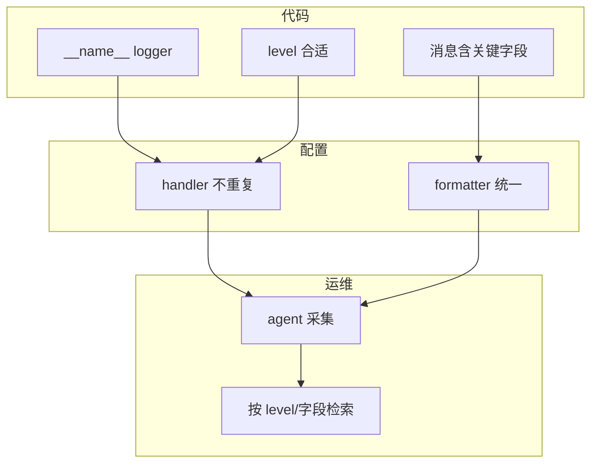

# 05｜logging 日志规范 · SRE 开发能力

> 凌晨 cron 邮件里混着 `print("checking...")` 和半截 traceback；ELK 里搜 `ERROR` 却全是 `print` 打的信息级噪音；有人 `logging.basicConfig()` 在 import 时执行两遍，handler 重复、同一条日志打三行——**运维脚本的观测契约是：结构化、分级、可检索，且别把密钥打进日志**。
> **本章回答**：一条日志从 `logger.info()` 产生、经 Handler/Formatter 格式化到 stdout/文件/采集器落盘的完整链路。
> **本章不讲**：异常与退出码 → [04 异常与退出码](../04-异常与退出码/)；CLI 参数 → [06 argparse与配置管理](../06-argparse与配置管理/)；子进程输出 → [08 subprocess执行外部命令](../08-subprocess执行外部命令/)。

## 面试怎么考

| 标记 | 考点 |
|------|------|
| **核心** | `logging.getLogger(__name__)`；Level；Handler + Formatter；**禁止生产用 print 代替日志** |
| **必会** | `log.exception` / `exc_info=True`；`basicConfig` 只调一次；stdout vs 文件；不记密码/token |
| **常用** | `RotatingFileHandler`；`dictConfig`；`extra` 字段；JSON 行日志供 Loki/ELK |
| **常考** | 重复 handler 双份日志；root logger vs 子 logger；`logger` 名与模块路径 |

**30 秒怎么说**：库和脚本用 **`logging`**，入口 `basicConfig` 或 `dictConfig` **只配一次**。业务代码 `log = logging.getLogger(__name__)`，按级别打：`debug` 排障、`info` 里程碑、`warning` 可恢复、`error` 失败、`exception` 带栈。Formatter 统一时间/级别/模块/消息；文件轮转防撑盘。采集侧按级别和字段检索——所以用 `extra={"cluster": c}` 比拼字符串好。密钥、kubeconfig、Authorization 绝不入日志。

---

## 能力边界

| 维度 | `logging` | `print` | 指标（Prometheus） |
|------|-----------|---------|-------------------|
| **适合** | 事件叙述、排障轨迹、审计 | 人眼临时调试 | 聚合数值、告警阈值 |
| **不适合** | 高频采样计数 | 生产可检索日志 | 讲清「为什么失败」的上下文 |
| **契约** | 分级 + 可检索 | 无级别、难过滤 | 时序，非逐条故事 |

| 机制 | 管什么 | 不管什么 |
|------|--------|----------|
| Logger | 是否放行这条记录（level） | 进程退出码（见 04 章） |
| Handler | 写到哪里（流/文件/网络） | 业务逻辑正确性 |
| Formatter | 长什么样 | 日志存储保留策略（运维侧） |

> 🎯 **一句话**：**调度器看退出码，oncall 看日志**——两件事都要做对，但不能互相替代。

---

## 语言最小集

| 零件 | 示例 | 含义 |
|------|------|------|
| getLogger | `log = logging.getLogger(__name__)` | 按模块名分层 |
| level | `log.setLevel(logging.INFO)` | 过滤阈值 |
| info/warning/error | `log.info("host=%s ok", host)` | 懒格式化 `%s` |
| exception | `log.exception("check failed")` | ERROR + 栈 |
| exc_info | `log.error("x", exc_info=True)` | 同 exception |
| basicConfig | `logging.basicConfig(level=INFO, format=...)` | 进程级一次配置 |
| Handler | `StreamHandler` / `FileHandler` | 输出目的地 |
| Formatter | `Formatter("%(asctime)s %(levelname)s %(message)s")` | 格式串 |
| extra | `log.info("done", extra={"job": jid})` | 结构化字段 |
| disable | `logging.disable(CRITICAL)` | 测试里静默 |

```python
import logging

log = logging.getLogger(__name__)

def check_disk(path: str) -> bool:
  usage = read_usage(path)
  if usage > 90:
    log.error("disk critical path=%s usage=%s", path, usage)
    return False
  log.info("disk ok path=%s usage=%s", path, usage)
  return True
```

---

## 一、一张图：一条日志从产生到落盘的一生

> 🎯 **一句话**：**代码调用 → Logger 判级 → 传播到父 Logger → Handler 格式化 → I/O 落盘/采集**。


**读图**：oncall 在 **G** 检索，但链路断在 **B**（级别太高看不到 debug）或 **D**（没挂 Handler）最常见。双份日志多半是 **D** 上同一 Handler 挂了两次。

---

## 二、出生：Logger 与级别（⭐常考）

> 🎯 **一句话**：**Logger 是命名通道 + 级别闸门**；子 logger 默认把记录**向上传播**给 root。

```python
import logging

log = logging.getLogger(__name__)   # 例如 scripts.healthcheck
log.setLevel(logging.DEBUG)         # 本 logger 闸门；常与 handler 级别配合
```

标准级别（数值越小越详细）：

```text
DEBUG(10) < INFO(20) < WARNING(30) < ERROR(40) < CRITICAL(50)
```

```python
log.debug("verbose detail host=%s", host)      # 排障开
log.info("check finished cluster=%s", cluster) # 正常里程碑
log.warning("retry %s/%s", i, max_retries)     # 可恢复异常
log.error("api unreachable url=%s", url)       # 失败
log.critical("config missing, abort")          # 极少用
```

> 📝 **面试**：「用 `getLogger(__name__)` 而不是字符串 `'myapp'`，import 路径即层次，方便按包调级别。」

### 传播 propagate

```python
parent = logging.getLogger("app")
child = logging.getLogger("app.worker")
child.info("hello")   # 默认 propagate=True，parent 的 handler 也会收到
```

测试或隔离时可 `child.propagate = False` 并单独挂 handler——生产脚本一般交给 root 统一配置。

> ⚠️ **别混**：**Logger 的 level** 和 **Handler 的 level** 两道闸都要过——设了 `logger DEBUG` 但 handler 只收 `INFO`，debug 仍不会出。

---

## 三、上路：Handler 与 Formatter（⭐常考）

> 🎯 **一句话**：**Handler 决定写哪；Formatter 决定长什么样**。

```python
import logging
import sys

def setup_logging(level: str = "INFO") -> None:
    fmt = "%(asctime)s %(levelname)s %(name)s %(message)s"
    logging.basicConfig(
        level=getattr(logging, level.upper(), logging.INFO),
        format=fmt,
        stream=sys.stderr,          # 日志走 stderr，stdout 留给管道/结果
    )
```

`basicConfig` **只有第一次有效**——模块 import 顺序乱时，后调用的 silently 无效。

### 文件与轮转（🔥难点）

```python
from logging.handlers import RotatingFileHandler

handler = RotatingFileHandler(
    "/var/log/ops/healthcheck.log",
    maxBytes=10 * 1024 * 1024,
    backupCount=5,
    encoding="utf-8",
)
handler.setFormatter(logging.Formatter("%(asctime)s %(levelname)s %(message)s"))
logging.getLogger().addHandler(handler)
```

> 💡 **打个比方**：Handler 像邮局分拣口——同一封信（LogRecord）可以同时投 stdout 信箱和文件信箱；Formatter 是信封上印的标准格式。

### 重复 handler 陷阱

```python
# 反模式：每次 main 都 basicConfig + addHandler
def main():
    logging.basicConfig(...)           # 第一次 OK
    logging.getLogger().addHandler(h)  # 第二次运行同一进程会叠 handler
```

修法：入口判断 `if not logging.getLogger().handlers:` 或用 `dictConfig` 的 `disable_existing_loggers`。

---

## 四、干活：消息怎么写（⭐常考）

> 🎯 **一句话**：**懒格式化 + 稳定字段名**；异常用 `exception`；密钥永不出现。

### 懒格式化

```python
# 对
log.info("host=%s status=%s", host, status)

# 错：f-string 在 INFO 关闭时仍会求值
log.debug(f"heavy={expensive()}")
```

### 异常与栈

```python
try:
    client.list_pods()
except ApiException:
    log.exception("kubernetes api failed cluster=%s", cluster)
    raise
```

`log.exception(...)` ≡ `log.error(..., exc_info=True)`，只在 `except` 块里用。

### 结构化 extra

```python
log.info(
    "deploy finished",
    extra={"cluster": "prod", "revision": "abc123", "duration_ms": 4200},
)
```

采集侧可解析 `cluster`、`revision`——比 `f"deploy {cluster} {rev}"` 好搜。

> ⚠️ **别混**：**日志讲「发生了什么」**；**指标讲「有多少/多快」**——磁盘 92% 应用 gauge + 一条 `warning` 日志带 path。

### 密钥永不出现（🔥难点）

密钥泄露是最高频的日志事故。审计 `grep -rn "Bearer\|Authorization\|password\|token" logs/` 应成为 Code Review 必查项。打 headers 前先过滤：

```python
SAFE_KEYS = {"authorization", "password", "token", "secret"}

def safe_headers(h: dict) -> dict:
    return {k: "***" if k.lower() in SAFE_KEYS else v for k, v in h.items()}

log.debug("headers=%s", safe_headers(request.headers))
# headers={'Authorization': '***', 'Content-Type': 'application/json'}
```

> 📝 **面试**：「密钥、kubeconfig、完整 PII 不能入日志；用过滤函数或只记 key 名不记 value。」

---

## 五、进门：配置方式 basicConfig vs dictConfig（🔥难点）

> 🎯 **一句话**：小脚本 `basicConfig`；多 handler/多模块用 **`logging.config.dictConfig`** 一次声明。

```python
LOGGING = {
    "version": 1,
    "disable_existing_loggers": False,
    "formatters": {
        "standard": {
            "format": "%(asctime)s %(levelname)s %(name)s %(message)s",
        },
    },
    "handlers": {
        "stderr": {
            "class": "logging.StreamHandler",
            "formatter": "standard",
            "level": "INFO",
            "stream": "ext://sys.stderr",
        },
    },
    "root": {"handlers": ["stderr"], "level": "DEBUG"},
}

import logging.config
logging.config.dictConfig(LOGGING)
```

`fileConfig` 读 ini——老项目能见，新项目优先 dict + YAML 外挂（加载后 `dictConfig`）。

### 环境变量控制级别

```python
import os
level = os.environ.get("LOG_LEVEL", "INFO").upper()
setup_logging(level)
```

K8s Job：`env: [{name: LOG_LEVEL, value: DEBUG}]` 临时排障，不用改镜像。

> 🔍 **现场**：生产突然需要 DEBUG 排障——改镜像要 20 分钟，`kubectl set env deployment/ops LOG_LEVEL=DEBUG` 滚动重启即生效。排障完改回 INFO，同样一条命令。

---

## 六、落盘：stdout、文件与采集器（🔧实操）

> 🎯 **一句话**：**容器里通常 stderr/stdout 由 agent 收**；裸机可轮转文件；格式尽量 **一行一条**。

```bash
python healthcheck.py 2>log.txt
# stderr 里的 logging 输出进 log.txt；stdout 可留给 JSON 结果

LOG_LEVEL=DEBUG python healthcheck.py 2>&1 | head
# 2026-09-01 12:00:01 INFO scripts.check disk ok path=/  # ← 级别+模块+消息
```

JSON 行（供 Loki/ELK）：

```python
import json
import logging

class JsonFormatter(logging.Formatter):
    def format(self, record: logging.LogRecord) -> str:
        payload = {
            "ts": self.formatTime(record),
            "level": record.levelname,
            "logger": record.name,
            "msg": record.getMessage(),
        }
        if record.exc_info:
            payload["exc"] = self.formatException(record.exc_info)
        return json.dumps(payload, ensure_ascii=False)
```

> 🔍 **现场**：Pod 里 `kubectl logs` 只有 print 没有级别——脚本没走 logging 或级别设成 WARNING 把 info 滤掉了。

---

## 七、收束：一条日志凭什么能被 oncall 找到（⭐常考）



**可背清单（六件套）**：

- `getLogger(__name__)`，库代码不 `basicConfig`
- 入口一次配置；避免重复 handler
- `info/warning/error/exception` 分级清晰
- 懒格式化 `%s`；异常用 `log.exception`
- 密钥/token/完整 kubeconfig 不入日志
- stderr 日志、stdout 结果（或全 JSON 行）

> ⚠️ **别混**：打满 `ERROR` 不能代替 **exit 1**（04 章）——日志红、CI 绿仍是假绿。

---

## 八、作战：双份日志、搜不到、磁盘打满（🔥难点）

**现象 · 先做 · 别做**

| 现象 | 先做 | 别做 |
|------|------|------|
| 同一条打两行 | `logging.getLogger().handlers` 数有几个 | 再 addHandler 碰碰运气 |
| debug 看不到 | 查 logger 与 handler 两级 level | 全改 print |
| 日志撑满盘 | `RotatingFileHandler` / 采集侧保留 | 无限 `FileHandler` |
| 敏感信息泄露 | grep 日志里的 `Bearer`、`password` | 把 token 打进 `info` |
| 只有 traceback 无上下文 | 补 `cluster=`/`host=` 字段 | 裸 `raise` 不 log |

**60 秒剧本** 🔧：

| 时段 | 动作 |
|------|------|
| 0–10s | `kubectl logs` / `tail` 看格式是否统一 |
| 10–25s | 本地 `LOG_LEVEL=DEBUG python script.py` |
| 25–40s | 代码搜 `print(`、`basicConfig` 出现次数 |
| 40–60s | 故意抛错，确认 `exception` 栈 + 业务字段都在 |

```bash
python -c "import logging; logging.basicConfig(level=logging.DEBUG); logging.getLogger('x').debug('ok')"
# DEBUG:x:ok  # ← 说明级别链通

rg "print\(" scripts/ --glob '*.py'
rg "basicConfig" scripts/
```

---

## 生产模板

### 模板 1：脚本入口 logging + main

```python
#!/usr/bin/env python3
from __future__ import annotations

import logging
import sys


def setup_logging(level: str = "INFO") -> None:
    if logging.getLogger().handlers:
        return
    logging.basicConfig(
        level=getattr(logging, level.upper(), logging.INFO),
        format="%(asctime)s %(levelname)s %(name)s %(message)s",
        stream=sys.stderr,
    )


log = logging.getLogger(__name__)


def main() -> int:
    setup_logging()
    try:
        run_checks()
    except Exception:
        log.exception("checks failed")
        return 1
    log.info("all checks passed")
    return 0


if __name__ == "__main__":
    raise SystemExit(main())
```

### 模板 2：库模块只拿 logger

```python
# lib/k8s_checks.py
import logging

log = logging.getLogger(__name__)

def check_pods(namespace: str) -> None:
    log.info("listing pods ns=%s", namespace)
    ...
```

### 模板 3：dictConfig + 轮转文件

```python
LOGGING = {
    "version": 1,
    "formatters": {"std": {"format": "%(asctime)s %(levelname)s %(name)s %(message)s"}},
    "handlers": {
        "file": {
            "class": "logging.handlers.RotatingFileHandler",
            "filename": "/var/log/ops/job.log",
            "maxBytes": 10485760,
            "backupCount": 5,
            "formatter": "std",
            "encoding": "utf-8",
        },
    },
    "root": {"level": "INFO", "handlers": ["file"]},
}
```

### 模板 4：测试里 caplog

```python
import logging

def test_logs_error(caplog):
    caplog.set_level(logging.ERROR)
    failing_check()
    assert "disk critical" in caplog.text
```

---

## 踩坑清单

| 现象 | 原因 | 修法 |
|------|------|------|
| 日志双份 | handler 重复挂 | 入口判断或 dictConfig |
| debug 没有 | handler level 太高 | 两级 level 对齐 |
| import 顺序乱配置失效 | basicConfig 非首次 | 只在 `main` 配置 |
| f-string 拖慢 | debug 关仍求值 | 用 `%s` 懒格式化 |
| 密钥进 ELK | log 了 headers | 打码或省略 |
| print 与 log 混用 | 难检索 | 统一 logging |
| 巨型 traceback 邮件 | 未顶层 catch | main `log.exception` 后简短退出 |
| `logging.warn` 弃用 | 别名 | 用 `warning` |

---

## 必会 · 常考（⭐常考）

| 说法 | 对错 | 口径 |
|------|:----:|------|
| 生产可用 print 代替 log | 错 | 无级别难采集 |
| `getLogger(__name__)` 推荐 | 对 | 层次清晰 |
| `log.exception` 任意位置可用 | 错 | 应在 except 块 |
| basicConfig 可多次生效 | 错 | 仅第一次 |
| 日志能替代非 0 退出码 | 错 | 门禁看 `$?` |
| Handler 决定输出目的地 | 对 | 流/文件/网络 |
| root logger 名是 `root` | 对 | `''` 也是 root |
| JSON 行利于 Loki | 对 | 字段可解析 |

---

## 数字墙

> 标准级别数值：DEBUG=10, INFO=20, WARNING=30, ERROR=40, CRITICAL=50
> `basicConfig` 只第一次有效；后续调用 silently 无效
> `RotatingFileHandler` 轮转：`maxBytes` + `backupCount` 控制磁盘占用
> Logger 传播：子 logger 默认 `propagate=True`，记录向上冒泡到 root

---

## 命令速查 🔧

```bash
LOG_LEVEL=DEBUG python script.py 2>&1 | head -5

python -c "
import logging
logging.basicConfig(level=logging.INFO)
logging.getLogger('app').info('hello')
"

# 输出示例
# INFO:app:hello
```

```python
import logging
logging.getLogger().handlers          # 看挂了几个 handler
logging.lastResort                    # 全无 handler 时的最后兜底
```

---

## 面试锚点

- **为什么不用 print？** — 无级别、难过滤、不利采集
- **logger 层次？** — `__name__` 对应模块，传播到 root
- **怎么打异常栈？** — `log.exception` 或 `exc_info=True`
- **basicConfig 注意啥？** — 只调一次，import 顺序
- **容器里日志打哪？** — 通常 stderr，agent 收

---

## 合上书，问自己

- [ ] 画「日志一生」主图，标级别过滤与 handler。
- [ ] `getLogger(__name__)` 和手写 `'myapp'` 差在哪？
- [ ] Logger level 与 Handler level 两道闸怎么配合？
- [ ] 为什么推荐 `log.info("x=%s", x)` 而不是 f-string？
- [ ] `log.exception` 和 `log.error(..., exc_info=True)` 关系？
- [ ] 重复双份日志常见原因与修法？
- [ ] 三条绝不能写进日志的东西？
- [ ] 日志与退出码在 CI 里各管什么？

八题能口述，logging 就过关了。下一章 [06 argparse与配置管理](../06-argparse与配置管理/) 管配置从哪来。
