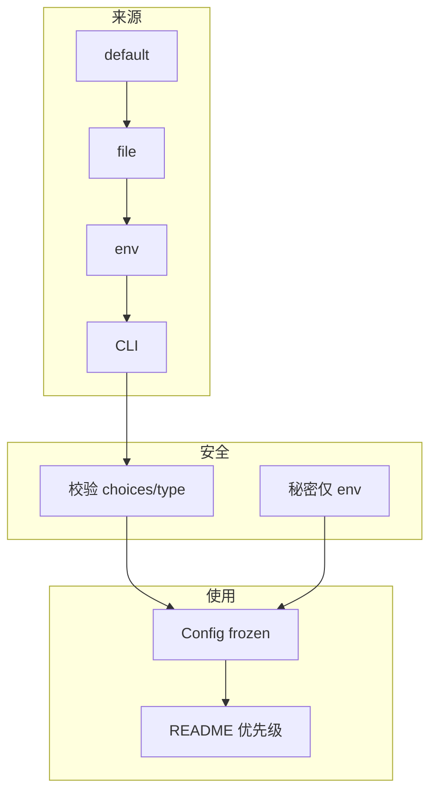

# 06｜argparse 与配置管理 · SRE 开发能力

> 大家好，欢迎来到这次分享。开讲之前，先带大家回到一个很多值班同学都踩过的现场：
> 同一脚本在笔记本上 `--cluster staging` 能跑，上 Jenkins 忘了传参却用了代码里写死的 `prod`；有人把密码写在 `config.yaml` 提交 Git，又在 shell 里 `export TOKEN=xxx` 覆盖——群里已经有人在喊「赶紧改密码」。
> 这一章讲完，你会知道当时那几个人各自错在哪——运维脚本的配置契约是：来源可溯、优先级明确、敏感项只走环境变量。
> **本章回答的问题**：配置从默认值、配置文件、环境变量到 CLI 参数合并成一份 `Config` 对象的一生。
> **本章不讲**：日志格式 → [05 logging日志规范](../05-logging日志规范/)；原子写配置 → [07 文件路径与原子写](../07-文件路径与原子写/)；子进程环境 → [08 subprocess执行外部命令](../08-subprocess执行外部命令/)。

**怎么听这场分享**：先把「配置合并一生」主图装进脑子——默认值 → 文件 → 环境变量 → CLI；放慢 YAML 与 subparsers；作战节回到开头那个连错集群现场。每一节讲完会提示对应练习题，趁热打铁。


## 面试怎么考

| 标记 | 考点 |
|------|------|
| **核心** | `argparse.ArgumentParser`；`--foo` / `-f`；`nargs`；**优先级 CLI > env > file > default** |
| **必会** | `parse_args()`；`--help`；用法错误 `return 2`；`action='store_true'`；`choices` |
| **常用** | `subparsers`；YAML/TOML 读配置；`os.environ`；`dataclass` 承载配置 |
| **常考** | `type=int` 校验；`required`；`dest`；不要把密钥写进 repo |

**30 秒怎么说**：入口用 **`argparse`** 定义 CLI；默认值放代码或配置文件；**环境变量**覆盖文件（12-factor）；**CLI 最高**覆盖一切。合并后得到一个不可变 `Config` dataclass，业务只读 `cfg.cluster` 不碰 `sys.argv`。用法错 `parser.error` 或 `return 2`；缺必填项 argparse 自动报错。密钥用 `os.environ["API_TOKEN"]`，不进 yaml、不进 `--token` 默认值。

---

## 能力边界

| 维度 | argparse + env + file | 硬编码 | 交互 input() |
|------|----------------------|--------|--------------|
| **适合** | cron/CI/K8s Job 自动化 | 一次性草稿 | 人手确认 |
| **不适合** | 复杂 GUI 配置 | 多环境发布 | 无人值守 |
| **契约** | 优先级写 README | 无 | 阻塞 |

| 来源 | 典型场景 | 注意 |
|------|----------|------|
| CLI | 临时覆盖、CI 参数化 | 最高优先级 |
| 环境变量 | K8s Secret、Jenkins credentials | 敏感项 |
| 配置文件 | 团队默认、多集群清单 | 不进 Git 秘密 |
| 代码 default | 安全缺省（dry-run=True） | 最低 |

> ⚠️ **别混**：**谁最后赢要写在文档里**——oncall 半夜靠优先级排障。

---

## 语言最小集

| 零件 | 示例 | 含义 |
|------|------|------|
| Parser | `p = argparse.ArgumentParser()` | 解析器 |
| add_argument | `p.add_argument("--cluster", required=True)` | 定义选项 |
| parse_args | `args = p.parse_args()` | 解析 `sys.argv[1:]` |
| type | `type=int` | 转换+校验 |
| action | `action="store_true"` | 布尔开关 |
| nargs | `nargs="+"` | 多个值 |
| choices | `choices=["staging","prod"]` | 枚举 |
| subparsers | `sub = p.add_subparsers()` | 子命令 |
| env | `os.environ.get("CLUSTER")` | 环境变量 |
| dataclass | `@dataclass(frozen=True) class Config` | 不可变配置 |

```python
import argparse
import os
from dataclasses import dataclass

@dataclass(frozen=True)
class Config:
    cluster: str
    dry_run: bool

def load_config(argv: list[str] | None = None) -> Config:
    p = argparse.ArgumentParser(description="cluster healthcheck")
    p.add_argument("--cluster", default=os.environ.get("CLUSTER"))
    p.add_argument("--dry-run", action="store_true")
    args = p.parse_args(argv)
    if not args.cluster:
        p.error("--cluster or CLUSTER env required")
    return Config(cluster=args.cluster, dry_run=args.dry_run)
```

---

## 一、一张图：配置从 CLI/env/file 合并的一生

> 🎯 **一句话**：**default → 读 file → 读 env → 解析 CLI → 校验 → Config 对象**。


**读图**：线上连错集群，先查 **D** 是否传了 `--cluster`，再查 **C** `CLUSTER` 是否被 Jenkins 注入错值，最后才怀疑 **B** 文件。优先级：**右边覆盖左边**。

好，主图装进脑子了。接下来顺着主线一站一站往下走——带着问题听，比背清单有用。

> ⭐ **常考**：「优先级 CLI > env > file > default」是配置管理第一八股，面试必问，能脱口而出才过关。


本节对应练习题 Q13。

---

## 二、出生：argparse 基础（⭐常考）

> 🎯 **一句话**：**Parser 声明选项，`parse_args` 把 argv 变成 Namespace**。

```python
import argparse

def build_parser() -> argparse.ArgumentParser:
    p = argparse.ArgumentParser(
        prog="healthcheck",
        description="Run cluster health checks",
    )
    p.add_argument(
        "--cluster", "-c",
        required=True,
        help="Kubernetes context name",
    )
    p.add_argument(
        "--timeout",
        type=int,
        default=30,
        help="API timeout seconds",
    )
    p.add_argument(
        "--verbose", "-v",
        action="store_true",
        help="Enable debug logging",
    )
    return p

def parse_args(argv: list[str] | None = None) -> argparse.Namespace:
    return build_parser().parse_args(argv)
```

```bash
python healthcheck.py --help
# usage: healthcheck [-h] -c CLUSTER [--timeout TIMEOUT] [-v]   # ← required 自动标 -c

python healthcheck.py -c staging --timeout 60 -v
# args.cluster='staging', args.timeout=60, args.verbose=True   # ← store_true
```

> 📝 **面试**：「`parse_args(['-c','x'])` 可测，不必 mock sys.argv。」

> 💡 **打个比方**：Parser 像「表单模板」——`add_argument` 是画空格，`parse_args` 是收表单填值；没填必填项直接退回（exit 2）。

### type 与 choices

```python
p.add_argument("--env", choices=["staging", "prod"], default="staging")
p.add_argument("--port", type=int, default=443)
```

非法值 argparse 自动打印错误并以 **exit 2** 结束（`SystemExit: 2`）。

### nargs 与列表

```python
p.add_argument("--hosts", nargs="+", help="one or more hosts")
# --hosts a b c  ->  args.hosts == ['a','b','c']

p.add_argument("--tags", nargs="*", default=[])
# 零个或多个
```


本节对应练习题 Q1、Q2。

---

## 三、上路：环境变量层（⭐常考）

> 🎯 **一句话**：**`default=os.environ.get("KEY")` 让 env 覆盖代码默认，但仍可被 CLI 覆盖**。

```python
import os

def build_parser() -> argparse.ArgumentParser:
    p = argparse.ArgumentParser()
    p.add_argument(
        "--cluster",
        default=os.environ.get("CLUSTER", "staging"),
    )
    p.add_argument(
        "--log-level",
        default=os.environ.get("LOG_LEVEL", "INFO"),
    )
    return p
```

```bash
CLUSTER=prod python healthcheck.py          # cluster=prod，env 填 default
CLUSTER=prod python healthcheck.py -c dev   # cluster=dev，CLI 覆盖 env
CLUSTER= python healthcheck.py             # cluster=None，env 空串不回退 file
```

敏感项**只从 env 读**，不提供 CLI 默认值：

```python
def require_token() -> str:
    token = os.environ.get("API_TOKEN")
    if not token:
        raise ConfigError("API_TOKEN not set")
    return token
```

> ⚠️ **别混**：**环境变量名**习惯全大写 `CLUSTER`；**CLI** 习惯 kebab-case `--log-level`（`dest` 为 `log_level`）。

> ⭐ **常考**：「env 覆盖 default，CLI 覆盖 env」——两层覆盖关系是追问高频，口述时从低到高念不卡壳。


本节对应练习题 Q3、Q4。

---

## 四、进门：配置文件 YAML/TOML（🔥难点）

> 🎯 **一句话**：**文件提供批量默认；加载后作为 argparse 的 default 或二次 merge**。

🔥 配置文件是「可提交的非敏感默认」，不是「什么都能塞」。大白话：菜单可以进 Git，钥匙不能进 Git。⭐ 密码进 YAML 是红线。

```python
import yaml
from pathlib import Path

def load_yaml_defaults(path: Path) -> dict:
    if not path.is_file():
        return {}
    with path.open(encoding="utf-8") as f:
        data = yaml.safe_load(f) or {}
    if not isinstance(data, dict):
        raise ConfigError(f"config root must be mapping: {path}")
    return data

def build_parser(file_defaults: dict) -> argparse.ArgumentParser:
    p = argparse.ArgumentParser()
    p.add_argument(
        "--cluster",
        default=os.environ.get("CLUSTER") or file_defaults.get("cluster", "staging"),
    )
    p.add_argument(
        "--config",
        type=Path,
        default=Path("config.yaml"),
        help="Config file path",
    )
    return p
```

合并顺序实现：

```python
def load_config(argv: list[str] | None = None) -> Config:
    # 1) 先解析 --config 路径（可用 parse_known_args）
    pre = argparse.ArgumentParser(add_help=False)
    pre.add_argument("--config", type=Path, default=Path("config.yaml"))
    pre_args, rest = pre.parse_known_args(argv)
    file_cfg = load_yaml_defaults(pre_args.config)
    # 2) 完整 parser，default 已含 file + env
    args = build_parser(file_cfg).parse_args(rest)
    ...
```

> 💡 **打个比方**：配置文件像「团队默认套餐」，环境变量是「部门补丁」，CLI 是「值班员最后一句话」——后者永远赢。

### 不进 Git 的秘密

```yaml
# config.yaml — 可提交
cluster: staging
timeout: 30

# secrets 走 env 或 K8s Secret，不写进 yaml
```

> 🔍 **现场**：`git grep -n -i "token\|password\|secret" -- '*.yaml' '*.yml'` 扫仓库里的明文密钥，CI 里加这行卡门。


本节对应练习题 Q5、Q6。

---

## 五、干活：dataclass 与校验（⭐常考）

> 🎯 **一句话**：**Namespace 转 `Config` dataclass**，业务层只认类型化对象。

```python
from dataclasses import dataclass

@dataclass(frozen=True)
class Config:
    cluster: str
    timeout: int
    dry_run: bool
    verbose: bool

def config_from_args(args: argparse.Namespace) -> Config:
    if args.timeout <= 0:
        raise ConfigError("timeout must be positive")
    return Config(
        cluster=args.cluster,
        timeout=args.timeout,
        dry_run=args.dry_run,
        verbose=args.verbose,
    )
```

`frozen=True` 防止运行中被改；复杂校验可换 **Pydantic** `BaseModel`（团队已用时再引入，不强制）。

> 💡 **打个比方**：`Config` 像「配药单」——药剂师（`config_from_args`）校验完封袋贴签，业务只读不拆。

> 🔥 **难点**：`frozen=True` 只防属性赋值（`cfg.cluster = "x"` 抛 `FrozenInstanceError`），**不防**可变字段的内部修改（`cfg.tags.append("x")` 仍可执行）——深冻结用 `tuple` 替代 `list` 做默认值。

### main 边界映射退出码

```python
def main(argv: list[str] | None = None) -> int:
    try:
        args = parse_args(argv)
        cfg = config_from_args(args)
    except ConfigError as e:
        print(f"config: {e}", file=sys.stderr)
        return 2
    run(cfg)
    return 0
```


本节对应练习题 Q7、Q8。

---

## 六、分支：subparsers 子命令（🔥难点）

> 🎯 **一句话**：**一个入口多个子命令**，像 `git commit` / `git push`。

🔥 **subparsers** = 一个入口多个子命令（像 `git commit` / `git push`）。大白话：同一把瑞士军刀，不同刀刃。面试爱问：全局参数放哪、子命令参数放哪。

```python
def build_parser() -> argparse.ArgumentParser:
    p = argparse.ArgumentParser(prog="opsctl")
    sub = p.add_subparsers(dest="command", required=True)

    check = sub.add_parser("check", help="run checks")
    check.add_argument("--cluster", required=True)

    deploy = sub.add_parser("deploy", help="deploy service")
    deploy.add_argument("--image", required=True)
    deploy.add_argument("--dry-run", action="store_true")

    return p
```

```bash
python opsctl.py check --cluster staging
python opsctl.py deploy --image reg/app:v1 --dry-run
```

`dest="command"` 区分 `args.command == "check"`。测试时对每个子命令分别 `parse_args([...])`。


本节对应练习题 Q9。

---

## 七、收束：配置凭什么不会连错环境



**可背清单（六件套）**：

1. 优先级：**CLI > env > file > default**（写 README）
2. `parse_args(argv)` 可测；`build_parser()` 单独函数
3. 用法/配置错 `return 2` 或 `parser.error`
4. 秘密不进 repo、不进 argparse default
5. 合并后 `Config` dataclass，业务不读 `sys.argv`
6. `--dry-run` 默认 True 或显式开关，防误操作
7. `subparsers` 的 `required=True` 防漏子命令（Python ≥3.7）

> ⚠️ **别混**：**argparse 管「怎么启动」**；**业务配置**（集群列表、阈值）可放文件——别把整份业务规则塞进 20 个 CLI  flag。

> 🔍 **现场**：`python -c "from healthcheck import load_config; print(load_config(['-c','staging']))"` 打印整份 `Config`，一目了然看合并结果。


本节对应练习题 Q13。

---

## 八、作战：连错集群、参数不生效、Secret 泄露

**现象 · 先做 · 别做**

| 现象 | 先做 | 别做 |
|------|------|------|
| 打到 prod | `echo $CLUSTER`；看 Jenkins 注入 | 猜代码 default |
| `--timeout` 无效 | 是否后面又被 env 覆盖写反 | 再加一个 parser |
| 配置改了不生效 | 是否读了错路径 `--config` | 缓存旧 Namespace |
| help 看不懂 | 补 `help=` 与 `description` | 裸参数名 |
| token 进 shell history | 只用 env，禁 `--token` | 命令行传密钥 |

**60 秒剧本** 🔧：

| 时段 | 动作 |
|------|------|
| 0–10s | `python script.py --help` |
| 10–25s | `env | grep CLUSTER`；`cat config.yaml` |
| 25–40s | 加 `--verbose` 打印合并后 `Config`（打码） |
| 40–60s | 对照 README 优先级表 |

```bash
python healthcheck.py --cluster staging --dry-run -v
python -c "from healthcheck import parse_args; print(parse_args(['-c','x']))"
```

---

本节对应练习题 Q10、Q11、Q12。

现在再看群里那句「赶紧改密码」，你知道该怎么拦住他了——先查优先级，敏感项挪到 env，YAML 只留非敏感。下面是可复制的生产模板（代码块一字不改，直接拿走）。

## 生产模板（🔧实操）

### 模板 1：标准 argparse + Config + main

```python
#!/usr/bin/env python3
from __future__ import annotations

import argparse
import os
import sys
from dataclasses import dataclass


class ConfigError(Exception):
    pass


@dataclass(frozen=True)
class Config:
    cluster: str
    dry_run: bool


def build_parser() -> argparse.ArgumentParser:
    p = argparse.ArgumentParser(description="cluster ops")
    p.add_argument("--cluster", "-c", default=os.environ.get("CLUSTER"))
    p.add_argument("--dry-run", action="store_true")
    return p


def load_config(argv: list[str] | None = None) -> Config:
    args = build_parser().parse_args(argv)
    if not args.cluster:
        raise ConfigError("set --cluster or CLUSTER env")
    return Config(cluster=args.cluster, dry_run=args.dry_run)


def main(argv: list[str] | None = None) -> int:
    try:
        cfg = load_config(argv)
    except ConfigError as e:
        print(f"config: {e}", file=sys.stderr)
        return 2
    run(cfg)
    return 0


if __name__ == "__main__":
    raise SystemExit(main())
```

### 模板 2：file + env + CLI 三层

```python
def load_config(argv: list[str] | None = None) -> Config:
    pre = argparse.ArgumentParser(add_help=False)
    pre.add_argument("--config", type=Path, default=Path("config.yaml"))
    pre_args, rest = pre.parse_known_args(argv)
    file_cfg = load_yaml_defaults(pre_args.config)
    args = build_parser(file_cfg).parse_args(rest)
    return config_from_args(args)
```

### 模板 3：互斥组

```python
g = p.add_mutually_exclusive_group(required=True)
g.add_argument("--staging", action="store_true")
g.add_argument("--prod", action="store_true")
```

### 模板 4：测试 parse_args

```python
def test_missing_cluster():
    with pytest.raises(SystemExit) as exc:
        parse_args([])
    assert exc.value.code == 2
```

---

## 踩坑清单（🔥难点）

| 现象 | 原因 | 修法 |
|------|------|------|
| 连错环境 | env 与 CLI 优先级搞反 | 文档+打印最终 Config |
| `type=bool` 坑 | `"False"` 也为真 | 用 `store_true` |
| 子命令缺 required | 老版本 subparsers | `required=True` |
| 秘密进 Git | yaml 写 token | 仅 env |
| 测不了 CLI | 直接 parse 全局 argv | `parse_args(list)` |
| 布尔 flag 默认值乱 | `store_true`+`default` | 二选一设计 |
| `nargs='?'` 困惑 | 可选一个 | 读文档或改用 `--opt VAL` |
| `--config` 路径错 | 默认当前目录 | 启动时 `echo $PWD` 确认 |
| env 设了空字符串 | `get("KEY")` 返回 `""` 非 None | `or` 短路或 `if not v` 显式判 |

---

## 必会 · 常考

| 说法 | 对错 | 口径 |
|------|:----:|------|
| CLI 应覆盖 env | 对 | 显式优先 |
| 密码可写 argparse default | 错 | 仅环境变量 |
| `parse_args` 失败 exit 2 | 对 | 用法错误 |
| `action='store_true'` 适合开关 | 对 | 无值 flag |
| 业务应直接读 sys.argv | 错 | 经 Config |
| subparsers 要 dest | 对 | 区分子命令 |
| frozen dataclass 防篡改 | 对 | 运行期配置稳定 |
| YAML 用 safe_load | 对 | 防任意对象 |

---

## 命令速查 🔧

```bash
python script.py --help
python script.py -c staging --dry-run

CLUSTER=prod python script.py -c dev   # cluster=dev

python -c "import argparse; p=argparse.ArgumentParser(); p.add_argument('-n', type=int); p.parse_args(['-n','x'])"
# error: argument -n: invalid int value: 'x'
```

---

## 面试锚点

遮住右列自问自答，卡壳的行回去重读对应小节——能讲出来才算会，看着答案点头不算。

| 问 | 30 秒答 |
|----|---------|
| 配置优先级？ | CLI > env > file > default |
| 怎么测 CLI？ | `parse_args(['--x'])` |
| 秘密怎么传？ | 环境变量/K8s Secret |
| store_true 干嘛？ | 无值布尔开关 |
| 用法错误退出码？ | 2（与 04 章约定） |

---

## 合上书，问自己

学到这里，先别急着翻下一章。合上书，试试下面这几件事能不能做到——能做到，这章才算真的听懂了。卡住的那一条，就回到对应的小节再听一遍：

- [ ] 画出配置合并优先级：默认 → file → env → CLI。（对应练习题 Q13）
- [ ] argparse 必填与默认怎么写？（Q1、Q2）
- [ ] 环境变量何时覆盖文件？（Q3、Q4）
- [ ] 密码为什么不能进 YAML？（Q5、Q6）
- [ ] dataclass 校验失败应 exit 几？（Q7、Q8）
- [ ] subparsers 适用什么？（Q9）
- [ ] 连错集群 60 秒怎么查？（Q10、Q12）
- [ ] 参数不生效先查哪一层？（Q11）

全部打勾之后，给自己出一个终极测试：找一位同事，十分钟讲清「开头那个连错 prod 现场，优先级谁赢、Secret 该走哪」。讲得下来，你就是下一个能拦住「写死 prod」的人。

八题能口述，配置管理就过关了。下一章用 **原子写** 保证落盘不损坏下游。
