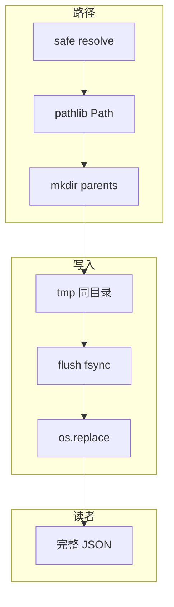

# 07｜文件路径与原子写 · SRE 开发能力

> 巡检脚本写 `status.json` 写到一半被 kill，下游读到半截 JSON 全站告警；有人 `open("data/../etc/passwd")` 没校验路径逃逸；cron 两个实例同时写同一文件，内容交错损坏——**运维脚本的落盘契约是：路径用 pathlib 管、写入要原子、编码显式 utf-8**。
> **本章回答**：一次写入从创建临时文件、刷盘到 `rename` 替换目标文件的一生。
> **本章不讲**：logging 文件 handler → [05 logging](../05-logging日志规范/)；配置 yaml 合并 → [06 argparse](../06-argparse与配置管理/)；子进程写文件 → [08 subprocess](../08-subprocess执行外部命令/)。

## 面试怎么考

| 标记 | 考点 |
|------|------|
| **核心** | `pathlib.Path`；`write_text`/`read_text`；**临时文件 + `os.replace`** 原子写 |
| **必会** | `encoding="utf-8"`；`mkdir(parents=True, exist_ok=True)`；同文件系统 rename |
| **常用** | `tempfile.NamedTemporaryFile(delete=False)`；`fsync`；权限 `mode=0o600` |
| **常考** | 为何不能先 `open(w)` 截断再写；跨设备 `replace` 行为；路径拼接用 `/` |

**30 秒怎么说**：路径统一 **`pathlib.Path`**，别手拼字符串。读写在运维脚本里 **`encoding="utf-8"`**。更新状态文件用 **原子写**：同目录写 `*.tmp` → `flush` + `os.fsync` → **`os.replace(tmp, target)`**（POSIX 上读者要么见旧版要么见新版，不见半截）。临时目录用 `tempfile`；敏感文件权限 `0o600`。跨文件系统 `replace` 可能实际是 copy+unlink，仍比直接截断安全但要知代价。

---

## 能力边界

| 维度 | pathlib + 原子写 | 直接 `open(w)` | Shell `>` 重定向 |
|------|------------------|----------------|------------------|
| **适合** | 状态文件、缓存、配置输出 | 日志追加（单进程） | 一次性命令 |
| **不适合** | 超大流式 GB 级（要分块策略） | 多进程共享写 | 复杂路径逻辑 |
| **契约** | 读者不见半文件 | 崩溃可能半截 | 同样非原子 |

| 机制 | 保证什么 | 不保证什么 |
|------|----------|------------|
| `os.replace` | 同 FS 上原子替换 | 跨 NFS 语义因挂载而异 |
| `fsync` | 数据落盘 | 磁盘硬件缓存（企业盘一般 OK） |
| `Path.resolve()` | 解析 `..` | 不防符号链接所有攻击面 |

> ⚠️ **别混**：**原子写防的是进程崩溃，不是两个进程同时 replace 同一文件**——那种要锁或单写者。

---

## 语言最小集

| 零件 | 示例 | 含义 |
|------|------|------|
| Path | `p = Path("/var/lib/ops/status.json")` | 路径对象 |
| 拼接 | `base / "out" / "a.json"` | 不用 `+` |
| 读写 | `p.read_text(encoding="utf-8")` | 文本 |
| 写 | `p.write_text(s, encoding="utf-8")` | 非原子 |
| mkdir | `p.parent.mkdir(parents=True, exist_ok=True)` | 建目录 |
| exists | `p.is_file()` | 判断 |
| resolve | `p.resolve()` | 绝对+规范化 |
| replace | `os.replace(src, dst)` | 原子替换 |
| fsync | `os.fsync(f.fileno())` | 刷盘 |
| tempfile | `NamedTemporaryFile(dir=..., delete=False)` | 临时文件 |

```python
from pathlib import Path

def read_json(path: Path) -> dict:
    return json.loads(path.read_text(encoding="utf-8"))
```

---

## 一、一张图：一次文件写入从 tmp 到 rename 的一生

> 🎯 **一句话**：**准备路径 → 写 tmp → flush/fsync → replace 目标 → 读者见完整新版本**。


**读图**：下游解析 JSON 失败，先看 **F** 是否读到半截——若直接写目标，崩溃常卡在 **C** 与 **E** 之间。原子写把「可见窗口」推到 **E** 一瞬间。

---

## 二、出生：pathlib 路径（⭐常考）

> 🎯 **一句话**：**`Path` 对象用 `/` 拼接，读写自带便利 API**。

```python
from pathlib import Path

BASE = Path("/var/lib/ops")                          # ← 路径对象，不是字符串
status_path = BASE / "checks" / "status.json"       # ← / 拼接，不用 os.path.join

status_path.parent.mkdir(parents=True, exist_ok=True)  # ← 递归建目录，已存在不报错

if status_path.is_file():                           # ← 先判断再读，避免 FileNotFoundError
    text = status_path.read_text(encoding="utf-8")   # ← 显式编码，Windows 不踩坑
```

```python
# 反模式
path = "/var/lib/ops/" + cluster + "/status.json"   # 双斜杠、无类型

# 正例
path = BASE / cluster / "status.json"
```

### resolve 与校验

```python
def safe_under(base: Path, user_path: Path) -> Path:
    base = base.resolve()
    target = (base / user_path).resolve()
    if not str(target).startswith(str(base)):
        raise ValueError("path escapes base directory")
    return target
```

> 📝 **面试**：「运维脚本接受用户路径时，要 `resolve` 后确认仍在允许目录下。」

> 🔥 **难点**：路径逃逸（path traversal）是运维脚本最常见的注入面——`../../etc/passwd` 不是唯一威胁，符号链接也能绕过 `resolve` 后的前缀检查。

> 💡 **打个比方**：`resolve()` 像导航算最终经纬度——你说去「北京路 1 号」，导航先解出坐标再看是不是在允许区域内；不看坐标只比街道名，`/data` 和 `/data2` 前缀一样但不是同一栋楼。

### 与 os.path 的关系

`pathlib` 底层仍调 OS API；3.6+ 生产脚本优先 Path。`os.path.join` 老代码能见，新写用 Path。

---

## 三、上路：读写与编码（⭐常考）

> 🎯 **一句话**：**文本显式 `encoding="utf-8"`**；二进制用 `read_bytes`/`write_bytes`。

```python
cfg_path = Path("config.yaml")
content = cfg_path.read_text(encoding="utf-8")

cfg_path.write_text(content, encoding="utf-8")
```

```python
with cfg_path.open("r", encoding="utf-8") as f:
    for line in f:
        process(line)
```

> ⚠️ **别混**：Windows 上缺省编码可能不是 UTF-8——**运维脚本跨平台必须写死 utf-8**。

### JSON 便捷

```python
import json

def load_json(path: Path) -> dict:
    return json.loads(path.read_text(encoding="utf-8"))

def dump_json(path: Path, data: dict) -> None:
    atomic_write_text(path, json.dumps(data, indent=2, ensure_ascii=False))
```

---

## 四、核心：原子写（🔥难点 · ⭐常考）

> 🎯 **一句话**：**先写临时文件，再 `os.replace` 覆盖目标**——读者不会看到被截断的空文件。

```python
import os
from pathlib import Path

def atomic_write_text(path: Path, content: str, *, mode: int = 0o644) -> None:
    path = path.resolve()
    path.parent.mkdir(parents=True, exist_ok=True)
    tmp = path.with_suffix(path.suffix + ".tmp")

    with tmp.open("w", encoding="utf-8") as f:
        f.write(content)
        f.flush()                             # ← 刷 Python 缓冲到内核
        os.fsync(f.fileno())                  # ← 刷内核缓冲到磁盘

    os.replace(tmp, path)          # ← 原子替换（同文件系统），读者瞬间见新版
    os.chmod(path, mode)           # ← 权限在 replace 后设，避免 umask 干扰
```

为什么**不能**直接 `open(path, "w")`：

```text
open(w) 立刻截断目标为 0 字节  →  写入中途崩溃  →  读者看到空或半截
```

> 💡 **打个比方**：原子写像换广告牌——先在后台做好新板，一瞬间换掉旧的；直接 `w` 像先把旧板铲空白再画，画一半下雨就白了。

### 同目录要求

`tmp` 必须与 `path` **同一目录**（通常 `path.with_suffix('.json.tmp')`），保证 `rename` 不跨设备。

```python
# 错：tmp 在 /tmp，目标在 /var — 可能跨 FS，replace 变 copy
```

### shutil.move vs os.replace 🔥

> 🔥 **难点**：`shutil.move` 和 `os.replace` 看起来都「移动文件」，行为差别在跨设备时。

| 维度 | `os.replace` | `shutil.move` |
|------|-------------|---------------|
| 同 FS | `rename` 系统调用，原子 | 同上 |
| 跨 FS | 抛 `OSError`（跨设备） | 自动 copy+unlink，非原子 |
| 覆盖已有目标 | 直接覆盖（POSIX 语义） | 先试 rename，失败再 copy |
| 适用场景 | 原子写（同目录保证同 FS） | 不关心原子性的批量搬迁 |

```python
# 原子写场景：用 os.replace，不用 shutil.move
os.replace(tmp, path)     # ← 跨 FS 直接报错，不静默退化
```

> ⚠️ **别混**：`shutil.move` 跨设备时会 copy 整个文件再 unlink 源——中间有窗口，读者可能读到半截。原子写**只认 `os.replace`**。

### NFS 与网络文件系统的边缘情况 🔥

> 🔥 **难点**：NFS 的 `rename` 原子性取决于挂载选项和服务端实现——NFSv3 不保证 rename 原子，NFSv4 语义更接近本地但仍非铁保。

NFS 上常见问题：
- `rename` 可能非原子，读者短暂看到新旧两版或空文件
- `fsync` 在 NFS 上语义弱化（客户端缓存 + 服务端写回延迟）
- 挂载选项 `sync`/`async` 影响落盘时机

> 📝 **面试**：「状态文件放本地盘（如 `/var/lib/ops/`），不放 NFS 挂载点。确需 NFS 时用单写者 + 文件锁。」

### 多进程并发

两个进程同时 `atomic_write` 同一目标——最后 replace 者赢，中间状态仍完整，但**可能丢更新**。要「读-改-写」一致性用：

- 文件锁 `fcntl` / `portalocker`
- 或单写者（队列）
- 或外部存储（etcd）

---

## 五、临时文件：tempfile（🔧实操）

> 🎯 **一句话**：**短生命周期临时内容用 `tempfile`**；参与原子写时 `delete=False` 自己 replace。

```python
import tempfile
from pathlib import Path

def atomic_write_bytes(path: Path, data: bytes) -> None:
    path.parent.mkdir(parents=True, exist_ok=True)
    fd, tmp_name = tempfile.mkstemp(dir=path.parent, prefix=".tmp_", suffix="")  # ← 同目录建 tmp
    os.close(fd)                        # ← 关掉 mkstemp 返回的 fd，用 Path 写
    tmp = Path(tmp_name)
    try:
        tmp.write_bytes(data)
        with tmp.open("rb") as f:
            os.fsync(f.fileno())        # ← 刷盘后再 replace
        os.replace(tmp, path)           # ← 原子替换
    except Exception:
        tmp.unlink(missing_ok=True)     # ← 崩溃清理 tmp
        raise
```

`with tempfile.NamedTemporaryFile(..., delete=False)` 同理，用完 `replace` 后删不掉 tmp 名——`replace` 已移走。

---

## 六、权限与安全（⭐常考）

> 🎯 **一句话**：**含密钥或 kubeconfig 片段的文件 `0o600`**；目录 `0o700`。

```python
atomic_write_text(secret_path, data, mode=0o600)
```

```python
# 创建私有目录
private_dir = Path.home() / ".ops"
private_dir.mkdir(mode=0o700, parents=True, exist_ok=True)
```

> 🔍 **现场**：`ls -l` 看到 `-rw-r--r--` 的 token 文件——任何同机用户可读，立即 chmod 600 并轮换密钥。

---

## 七、遍历与追加：glob 与单行日志（⭐常考）

> 🎯 **一句话**：**批量读用 `glob`/`rglob`；追加日志用 `open("a")`**——追加不是原子替换场景。

```python
from pathlib import Path

for path in sorted(Path("/var/log/ops").glob("*.json")):   # ← glob 不递归
    if path.is_file():
        process(load_json(path))

for path in Path("configs").rglob("*.yaml"):   # ← rglob 递归子目录
    merge(load_yaml(path))
```

`sorted()` 让输出顺序稳定——diff 和回归测试友好。

### 追加写 vs 覆盖写

| 场景 | 写法 | 原子性 |
|------|------|--------|
| 状态文件、配置快照 | `atomic_write_text` | 要 |
| 审计日志、运行记录 | `open(path, "a", encoding="utf-8")` | 单写者追加即可 |
| 多进程追加同一日志 | `a` + 外部 `logrotate` | 行边界可能交错，需换行符 |

```python
def append_audit(path: Path, line: str) -> None:
    path.parent.mkdir(parents=True, exist_ok=True)
    with path.open("a", encoding="utf-8") as f:       # ← "a" 追加，不截断
        f.write(line.rstrip("\n") + "\n")            # ← 保证单行完整 + 换行符
```

> 📝 **面试**：「状态 JSON 用原子覆盖；按行审计用追加——别对同一文件混两种语义。」

### is_relative_to（3.9+）

```python
def safe_under(base: Path, user_path: Path) -> Path:
    base = base.resolve()
    target = (base / user_path).resolve()
    if not target.is_relative_to(base):
        raise ValueError("path escapes base directory")
    return target
```

比 `str.startswith` 更不易被边界前缀欺骗（`/data` vs `/data2`）。

### 符号链接 🔥

> 🔥 **难点**：`resolve()` 会跟随 symlink——攻击者把 `config.yaml` 链到 `/etc/shadow`，你的脚本就变成了越权读取器。

`resolve()` 会跟随 symlink——接受用户路径时要明确：是跟到真实路径还是拒绝链接。高安全场景可先 `path.is_symlink()` 拒绝。

```python
def load_config_strict(base: Path, rel: str) -> str:
    target = safe_under(base, Path(rel))
    if target.is_symlink():
        raise ValueError("symlink not allowed")
    return target.read_text(encoding="utf-8")
```

---

## 八、收束：一次写入凭什么不损坏下游



**可背清单（六件套）**：

1. 路径用 `Path`，拼接用 `/`
2. 文本 `encoding="utf-8"`
3. 更新用 tmp + `os.replace`，不直接截断
4. tmp 与目标同目录；`fsync` 后再 replace
5. 敏感文件 `0o600`
6. 多进程同时写要锁或单写者

> ⚠️ **别混**：**原子写 ≠ 事务**——没有自动回滚多文件；多文件一致性要设计（先写从后写主等）。

---

## 九、作战：JSON 半截、权限过宽、路径逃逸

**现象 · 先做 · 别做**

| 现象 | 先做 | 别做 |
|------|------|------|
| JSONDecodeError 偶发 | 是否直接 `open(w)` 写状态 | 忽略并发 |
| 文件 0 字节 | 查崩溃点是否在 replace 前 | 下游重试死循环 |
| 秘密 world-readable | `ls -l`；chmod 600 | 继续提交 Git |
| 写到错目录 | `print(path.resolve())` | 相对路径靠 cwd |
| NFS 上 replace 怪 | 查挂载文档；测 copy 语义 | 假设本地盘 |

**60 秒剧本** 🔧：

| 时段 | 动作 |
|------|------|
| 0–10s | `file status.json`；`wc -c` 是否 0 |
| 10–25s | 代码搜 `open(.*'w'` 无 atomic |
| 25–40s | `ls -l` 权限；路径是否 resolve |
| 40–60s | 加原子写后压测 kill -9 |

```bash
python -c "
from pathlib import Path
from atomic import atomic_write_text
atomic_write_text(Path('out.json'), '{\"ok\": true}')
"
ls -l out.json
```

### 🔧 实操：模拟崩溃看半截

```bash
# 终端 1：直接 w 写，中途 kill
python -c "
with open('/tmp/status.json', 'w') as f:
    f.write('{\"ok\":')    # 写一半
    import time; time.sleep(10)
    f.write('true}')
" &
sleep 2
# 终端 2：读到的就是半截
cat /tmp/status.json       # ← {"ok":      （半截 JSON）

# 正确写法：atomic_write_text 中途 kill
python -c "
from pathlib import Path
import os, time
tmp = Path('/tmp/status2.json.tmp')
tmp.write_text('writing...')
time.sleep(10)
os.replace(tmp, '/tmp/status2.json')
" &
sleep 2
kill -9 %1                 # 模拟崩溃
cat /tmp/status2.json      # ← 要么旧版要么完整新版，不会半截
ls /tmp/status2.json.tmp   # ← 残留 tmp（崩溃未到 replace）
```

---

## 生产模板

### 模板 1：atomic_write_text

```python
from __future__ import annotations

import os
from pathlib import Path


def atomic_write_text(
    path: Path,
    content: str,
    *,
    encoding: str = "utf-8",
    mode: int = 0o644,
) -> None:
    path = path.resolve()
    path.parent.mkdir(parents=True, exist_ok=True)
    tmp = path.with_name(path.name + ".tmp")
    with tmp.open("w", encoding=encoding) as f:
        f.write(content)
        f.flush()
        os.fsync(f.fileno())
    os.replace(tmp, path)
    os.chmod(path, mode)
```

### 模板 2：atomic JSON

```python
import json
from pathlib import Path

def save_state(path: Path, state: dict) -> None:
    body = json.dumps(state, indent=2, ensure_ascii=False) + "\n"
    atomic_write_text(path, body)
```

### 模板 3：安全读取用户相对路径

```python
def load_user_file(base: Path, rel: str) -> str:
    target = safe_under(base, Path(rel))
    return target.read_text(encoding="utf-8")
```

### 模板 4：测试原子性（简化）

```python
def test_atomic_replace(tmp_path: Path):
    target = tmp_path / "a.json"
    target.write_text('{"v":1}', encoding="utf-8")
    atomic_write_text(target, '{"v":2}')
    assert json.loads(target.read_text(encoding="utf-8"))["v"] == 2
```

---

## 踩坑清单

| 现象 | 原因 | 修法 |
|------|------|------|
| 半截 JSON | 直接 w 截断 | atomic replace |
| tmp 残留 | 崩溃未清理 | finally unlink tmp |
| 跨 FS replace 慢 | tmp 不在同目录 | tmp 放 parent |
| 编码乱码 | 缺 encoding | utf-8 写死 |
| 路径双斜杠 | 字符串拼接 | Path `/` |
| 并发丢更新 | 无锁双写 | 锁或单写者 |
| chmod 失效 umask | 默认掩码 | replace 后显式 chmod |
| NFS rename 非原子 | NFS 挂载语义弱 | 放本地盘或加锁 |
| shutil.move 跨设备静默 copy | move 自动降级 | 原子写只用 os.replace |
| 符号链接绕过 resolve | resolve 跟随链接 | is_symlink 拒绝 |

---

## 必会 · 常考

| 说法 | 对错 | 口径 |
|------|:----:|------|
| `open(w)` 更新状态安全 | 错 | 先截断 |
| `os.replace` 同 FS 原子 | 对 | POSIX |
| tmp 可放 /tmp | 错 | 应与目标同目录 |
| pathlib 推荐新代码 | 对 | 可读可组合 |
| fsync 后 replace 更稳 | 对 | 防掉电半写 |
| 原子写解决多进程合并 | 错 | 要锁 |
| utf-8 应显式 | 对 | 跨平台 |
| 0o600 给秘密文件 | 对 | 最小权限 |

---

## 命令速查 🔧

```bash
python -c "from pathlib import Path; p=Path('a/b'); print(p.parent)"

ls -l /var/lib/ops/status.json
file status.json

# 模拟崩溃：直接 w 时另开终端 cat 可能为空
```

```python
import os
from pathlib import Path
os.replace(Path("a.tmp"), Path("a.json"))
```

---

## 面试锚点

| 问 | 30 秒答 |
|----|---------|
| 原子写步骤？ | tmp 写→fsync→replace |
| 为何不同目录 tmp？ | 跨 FS replace 非原子 |
| pathlib 好处？ | `/` 拼接、语义方法 |
| 多进程同时写？ | 最后赢；要锁 |
| 秘密文件权限？ | 0o600 |

---

## 合上书，问自己

- [ ] 画写入一生主图，标 replace 点。
- [ ] 直接 `open(w)` 为何可能半截？
- [ ] `os.replace` 与 `shutil.move` 何时不同？
- [ ] tmp 文件应放哪？
- [ ] `fsync` 解决什么问题？
- [ ] `Path.resolve` 与路径逃逸？
- [ ] 原子写不解决什么并发问题？
- [ ] 为何 utf-8 要显式？

八题能口述，文件路径与原子写就过关了。下一章 [08 subprocess](../08-subprocess执行外部命令/) 管外部命令生命周期。
