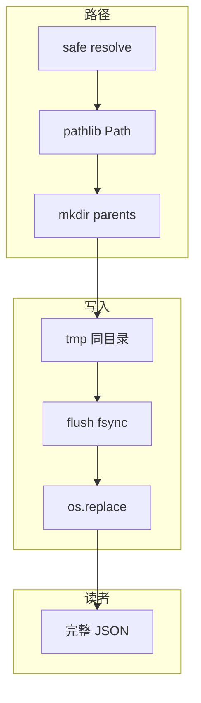
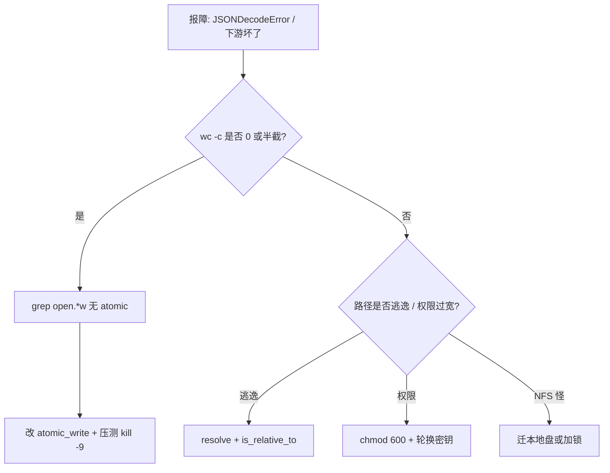

# 07｜文件路径与原子写 · SRE 开发能力

> 巡检写 `status.json` 写到一半被 kill，下游读到半截 JSON 全站告警；有人 `open("data/../etc/passwd")` 没校验路径逃逸；cron 两实例同时写同一文件，内容交错——群里已经有人在喊「下游坏了先回滚」。
> **本章回答**：一次写入从创建临时文件、刷盘到 `rename` 替换目标文件的一生。
> **不讲**：logging 文件 handler → [05](../05-logging日志规范/)；配置 yaml 合并 → [06](../06-argparse与配置管理/)；子进程写文件 → [08](../08-subprocess执行外部命令/)。

**标记**：🎯重点 · 🔥难点 · ⭐常考 · 🔧实操

---

## 面试怎么考

| 标记 | 考点 |
|------|------|
| **核心** | `pathlib.Path`；`write_text`/`read_text`；**临时文件 + `os.replace`** 原子写 |
| **必会** | `encoding="utf-8"`；`mkdir(parents=True, exist_ok=True)`；同文件系统 rename |
| **常用** | `tempfile.NamedTemporaryFile(delete=False)`；`fsync`；权限 `mode=0o600` |
| **常考** | 为何不能先 `open(w)` 截断再写；跨设备 `replace` 行为；路径拼接用 `/` |

> 📝 **面试（30 秒）**：路径统一 **`pathlib.Path`**，别手拼字符串。读写 **`encoding="utf-8"`**。更新状态文件用 **原子写**：同目录写 `*.tmp` → `flush` + `os.fsync` → **`os.replace(tmp, target)`**（POSIX 上读者要么见旧版要么见新版，不见半截）。临时目录用 `tempfile`；敏感文件 `0o600`。跨文件系统 `replace` 可能实际是 copy+unlink，仍比直接截断安全但要知代价。

---

## 能力边界

| 维度 | pathlib + 原子写 | 直接 `open(w)` | Shell `>` 重定向 |
|------|------------------|----------------|------------------|
| **适合** | 状态文件、缓存、配置输出 | 日志追加（单进程） | 一次性命令 |
| **不适合** | 超大流式 GB 级（要分块） | 多进程共享写 | 复杂路径逻辑 |
| **契约** | 读者不见半文件 | 崩溃可能半截 | 同样非原子 |

- 🔑 **三件契约各保什么**
  - `os.replace` → 同 FS 上原子替换；**不保**跨 NFS 语义一致
  - `fsync` → 数据进磁盘栈；**不保**硬件掉电瞬间（企业盘一般 OK）
  - `Path.resolve()` → 解 `..`、跟 symlink；**不保**所有逃逸攻击面（还要 `is_relative_to` / 拒链接）

> ⚠️ **别混**：**原子写防的是进程崩溃，不是两个进程同时 replace 同一文件**——那种要锁或单写者。

---

## 语言最小集

读/写运维落盘代码，先认这 10 个零件：

| 零件 | 示例 | 含义 |
|------|------|------|
| Path | `p = Path("/var/lib/ops/status.json")` | 路径对象 |
| 拼接 | `base / "out" / "a.json"` | 不用 `+` |
| 读 | `p.read_text(encoding="utf-8")` | 文本 |
| 写 | `p.write_text(s, encoding="utf-8")` | **非原子** |
| mkdir | `p.parent.mkdir(parents=True, exist_ok=True)` | 建目录 |
| exists | `p.is_file()` | 判断 |
| resolve | `p.resolve()` | 绝对+规范化 |
| replace | `os.replace(src, dst)` | 原子替换 |
| fsync | `os.fsync(f.fileno())` | 刷盘 |
| tempfile | `NamedTemporaryFile(dir=..., delete=False)` | 临时文件 |

```python
from pathlib import Path
import json

def read_json(path: Path) -> dict:
    return json.loads(path.read_text(encoding="utf-8"))
```

- 🧩 **四行钉子**
  - `BASE / cluster / "status.json"` → `/` 拼接，不拼字符串
  - `encoding="utf-8"` → 跨平台写死
  - `path.write_text(...)` → 便捷但**非原子**，状态文件别用
  - `os.replace(tmp, path)` → 同目录原子可见点

零件认完，上主图。

---

## 一、一张图：一次文件写入从 tmp 到 rename 的一生 ⭐

> 🎯 **一句话**：**准备路径 → 写 tmp → flush/fsync → replace 目标 → 读者见完整新版本**。


- 📖 **读图**
  - 🛤️ 主线「Path → tmp → fsync → replace → 完整读」；半截 JSON 常卡在 **C 与 E 之间**
  - 🔍 下游解析失败：先问「写的人有没有走过 **E**」——直接 `open(w)` 等于跳过整条线
  - ⭐ 合上书默画这张；作战节 60 秒剧本对着它查（Q13）

#### ❓ 为什么读者「要么旧要么新」？

- ❌ **直接 `open(w)`**：一打开就截断 → 崩溃窗口里读者见 0 字节或半截
- ✅ **replace 一瞬间**：同 inode 目录项切换，POSIX 上旁观者看不到中间态
- 📝 **一句话**：可见窗口推到 **E**，不是推到「写完最后一个字节」

本节对应练习题 Q13。

---

## 二、出生：pathlib 路径（⭐常考）

> 🎯 **一句话**：**`Path` 对象用 `/` 拼接，读写自带便利 API**。

### 📎 Path 拼出来再读写

```python
from pathlib import Path

BASE = Path("/var/lib/ops")                          # ← 路径对象，不是字符串
status_path = BASE / "checks" / "status.json"       # ← / 拼接，不用 os.path.join

status_path.parent.mkdir(parents=True, exist_ok=True)  # ← 递归建目录，已存在不报错

if status_path.is_file():                           # ← 先判断再读
    text = status_path.read_text(encoding="utf-8")   # ← 显式编码
```

- ✅ **正例**：`path = BASE / cluster / "status.json"`
- ❌ **反例**：`"/var/lib/ops/" + cluster + "/status.json"` —— 双斜杠、无类型、难校验

### 🛡️ resolve 与路径逃逸 🔥

```python
def safe_under(base: Path, user_path: Path) -> Path:
    base = base.resolve()
    target = (base / user_path).resolve()
    if not target.is_relative_to(base):          # ← 3.9+；别用 str.startswith
        raise ValueError("path escapes base directory")
    return target
```

#### ❓ 为什么 `startswith` 不够？

- 🪤 **`/data` vs `/data2`**：`str(target).startswith(str(base))` 会把 `/data2/...` 误判成在 `/data` 下
- ✅ **`is_relative_to`**：按路径分量比，不是按字符串前缀
- 🔗 **symlink**：`resolve()` 跟随链接——攻击者把 `config.yaml` 链到 `/etc/shadow`，前缀检查仍可能过；高安全场景再 `is_symlink()` 拒绝

> 💡 **打个比方**：`resolve()` 像导航算出最终坐标；`is_relative_to` 再问「坐标还在允许园区里吗」——只比街道名，会把隔壁园区当成自家。

> 📝 **面试**：「运维脚本接受用户路径时，`resolve` 后确认仍在允许目录下；3.9+ 用 `is_relative_to`，别 `startswith`。」⭐（Q1、Q2、Q7、Q8）

- 🧩 **与 `os.path`**：底层仍调 OS；3.6+ 新代码优先 Path；老代码见 `os.path.join` 可读，新写用 `/`

本节对应练习题 Q1、Q2。

---

## 三、上路：读写与编码（⭐常考）

> 🎯 **一句话**：**文本显式 `encoding="utf-8"`**；二进制用 `read_bytes`/`write_bytes`。

```python
cfg_path = Path("config.yaml")
content = cfg_path.read_text(encoding="utf-8")
cfg_path.write_text(content, encoding="utf-8")   # ← 便捷，但非原子

with cfg_path.open("r", encoding="utf-8") as f:
    for line in f:
        process(line)
```

#### ❓ 为什么必须写死 utf-8？

- 🪟 **Windows 缺省**可能不是 UTF-8 → 同脚本跨平台乱码
- 🤖 **cron / CI 环境** locale 各异 → 依赖「默认编码」= 赌环境
- ✅ **运维脚本一律 `encoding="utf-8"`**（或二进制模式）

### 📦 JSON 便捷

```python
import json

def load_json(path: Path) -> dict:
    return json.loads(path.read_text(encoding="utf-8"))

def dump_json(path: Path, data: dict) -> None:
    atomic_write_text(path, json.dumps(data, indent=2, ensure_ascii=False))
```

> ⚠️ **别混**：`write_text` / `dump` 直接落目标 = **非原子**；状态 JSON 走下一节的 `atomic_write_text`。

本节对应练习题 Q3。

---

## 四、核心：原子写（🔥难点 · ⭐常考）

> 🎯 **一句话**：**先写临时文件，再 `os.replace` 覆盖目标**——读者不会看到被截断的空文件。

🔥 **原子写（atomic write）** = 读者要么看到旧完整文件，要么看到新完整文件，绝不半截。⭐ 面试必考。

```python
import os
from pathlib import Path

def atomic_write_text(path: Path, content: str, *, mode: int = 0o644) -> None:
    path = path.resolve()
    path.parent.mkdir(parents=True, exist_ok=True)
    tmp = path.with_name(path.name + ".tmp")      # ← 同目录

    with tmp.open("w", encoding="utf-8") as f:
        f.write(content)
        f.flush()                             # ← Python 缓冲 → 内核
        os.fsync(f.fileno())                  # ← 内核缓冲 → 磁盘

    os.replace(tmp, path)                     # ← 同 FS 原子替换
    os.chmod(path, mode)                      # ← replace 后设权限，躲 umask
```

```text
直接 open(w)：立刻截断为 0 字节  →  写入中途崩溃  →  读者见空或半截
原子写：      写后院 tmp 完整     →  replace 一瞬间  →  读者只见完整版
```

> 💡 **打个比方**：换广告牌——先在后台做好新板，一瞬间换掉旧的；直接 `w` 像先铲白再画，画一半下雨就白了。

#### ❓ 为什么不能直接 `open(path, "w")`？

- 🪓 **`w` 模式第一动作是截断**——还没写完内容，目标已是空文件
- 💥 **kill / OOM / 断电**落在截断与写完之间 → 下游 `JSONDecodeError`
- ✅ **先写不可见的 tmp，再原子换名**——崩溃时旧文件仍在（或只留残留 tmp）

### 📁 同目录要求 🔥

`tmp` 必须与 `path` **同一目录**（`path.with_name(path.name + ".tmp")`），保证 `rename` 不跨设备。

```python
# 错：tmp 在 /tmp，目标在 /var — 可能跨 FS，replace 变 copy 或抛错
```

#### ❓ 为什么 tmp 必须同目录？

- 🧱 **同 FS**：`rename` 改目录项，原子
- 🚚 **跨 FS**：内核做不到原子 rename → `OSError: Invalid cross-device link`，或 `shutil.move` 静默退化成 copy+unlink（中间有窗口）
- 📌 **规矩**：`dir=path.parent` 或 `with_name(...+".tmp")`，别图省事丢 `/tmp`

### 🔀 `os.replace` vs `shutil.move` 🔥

| 维度 | `os.replace` | `shutil.move` |
|------|-------------|---------------|
| 同 FS | `rename`，原子 | 同上 |
| 跨 FS | 抛 `OSError` | 自动 copy+unlink，**非原子** |
| 覆盖目标 | POSIX 直接覆盖 | 先 rename，失败再 copy |
| 原子写 | **只用它** | 批量搬迁可以 |

```python
os.replace(tmp, path)     # ← 跨 FS 直接报错，不静默退化
```

> ⚠️ **别混**：`shutil.move` 跨设备会 copy 再 unlink——中间读者可能读到半截。原子写**只认 `os.replace`**。

### 🌐 NFS 边缘 🔥

- NFSv3 rename **不保证**本地盘那种原子；NFSv4 更接近但仍非铁保
- `fsync` 在 NFS 上语义弱（客户端缓存 + 写回延迟）
- 📝 **面试**：「状态文件放本地盘（如 `/var/lib/ops/`），不放 NFS；确需 NFS 时单写者 + 文件锁。」

### 👥 多进程并发

两个进程同时 `atomic_write` 同一目标——最后 replace 者赢，中间状态仍完整，但**可能丢更新**。

#### ❓ 为什么原子写解决不了「读-改-写」？

- ✅ **原子写保的是「单次落盘可见完整性」**——不是「多写者合并」
- 🔒 要一致性：`fcntl` / `portalocker`、单写者队列、或外部协调（etcd）
- 见能力边界那条 ⚠️：崩溃 ≠ 并发

本节对应练习题 Q4、Q5、Q14。

---

## 五、临时文件：tempfile（🔧实操）

> 🎯 **一句话**：**短生命周期临时内容用 `tempfile`**；参与原子写时 `delete=False` 自己 replace。

```python
import os
import tempfile
from pathlib import Path

def atomic_write_bytes(path: Path, data: bytes) -> None:
    path.parent.mkdir(parents=True, exist_ok=True)
    fd, tmp_name = tempfile.mkstemp(dir=path.parent, prefix=".tmp_", suffix="")
    os.close(fd)
    tmp = Path(tmp_name)
    try:
        tmp.write_bytes(data)
        with tmp.open("rb") as f:
            os.fsync(f.fileno())
        os.replace(tmp, path)
    except Exception:
        tmp.unlink(missing_ok=True)     # ← 失败清理残留
        raise
```

- 🔑 **要点**
  - `dir=path.parent` → 同目录，才能原子 replace
  - `delete=False` / 自己关 fd → replace 后名字已不在
  - `except` 里 `unlink` → 崩溃残留 tmp 不堆盘

本节对应练习题 Q6。

---

## 六、权限与安全（⭐常考）

> 🎯 **一句话**：**含密钥或 kubeconfig 片段的文件 `0o600`**；目录 `0o700`。

```python
atomic_write_text(secret_path, data, mode=0o600)

private_dir = Path.home() / ".ops"
private_dir.mkdir(mode=0o700, parents=True, exist_ok=True)
```

- 🔍 **现场**：`ls -l` 看到 `-rw-r--r--` 的 token → 立即 `chmod 600` 并轮换密钥
- 🧩 **umask**：`open` 创建时权限受 umask 影响 → **replace 后再 `chmod`** 才稳

本节对应练习题 Q7、Q8。

---

## 七、遍历与追加：glob 与单行日志（⭐常考）

> 🎯 **一句话**：**批量读用 `glob`/`rglob`；追加日志用 `open("a")`**——追加不是原子替换场景。

```python
from pathlib import Path

for path in sorted(Path("/var/log/ops").glob("*.json")):   # ← 不递归
    if path.is_file():
        process(load_json(path))

for path in Path("configs").rglob("*.yaml"):               # ← 递归
    merge(load_yaml(path))
```

- `sorted()` → 顺序稳定，diff / 回归友好

### 📝 追加写 vs 覆盖写

| 场景 | 写法 | 原子性 |
|------|------|--------|
| 状态文件、配置快照 | `atomic_write_text` | 要 |
| 审计日志、运行记录 | `open(..., "a")` | 单写者追加即可 |
| 多进程追加同一日志 | `a` + logrotate | 行可能交错，需换行 |

```python
def append_audit(path: Path, line: str) -> None:
    path.parent.mkdir(parents=True, exist_ok=True)
    with path.open("a", encoding="utf-8") as f:
        f.write(line.rstrip("\n") + "\n")     # ← 单行完整 + 换行
```

#### ❓ 为什么追加日志不用 atomic replace？

- 📜 **日志语义是「往后加」**，不是「整文件换一版」
- 🔁 每次 replace 整文件 = 重写全部历史，代价爆炸
- ⚠️ **别对同一文件混两种语义**：状态 JSON 原子覆盖；审计按行追加

> 📝 **面试**：「状态 JSON 用原子覆盖；按行审计用追加——别混。」

### 🔗 符号链接再钉一钉 🔥

```python
def load_config_strict(base: Path, rel: str) -> str:
    target = safe_under(base, Path(rel))
    if target.is_symlink():
        raise ValueError("symlink not allowed")
    return target.read_text(encoding="utf-8")
```

本节对应练习题 Q9、Q10。

---

## 八、收束：一次写入凭什么不损坏下游 🔥

> 🎯 **一句话**：路径管得住、落盘看得见完整版——六件套缺一不可。



- 📖 **读图**
  - 🧱 左栏管「写到哪」；中栏管「怎么让读者看不见半截」；右栏是契约兑现点
  - 合上书默画：Path → safe → tmp → fsync → replace → 完整读

**可背清单（六件套）**：

1. 路径用 `Path`，拼接用 `/`
2. 文本 `encoding="utf-8"`
3. 更新用 tmp + `os.replace`，不直接截断
4. tmp 与目标同目录；`fsync` 后再 replace
5. 敏感文件 `0o600`
6. 多进程同时写要锁或单写者

> ⚠️ **别混**：**原子写 ≠ 事务**——没有自动回滚多文件；多文件一致性要设计（先写从、后写主等）。

> 📝 **面试**：六件套分三组——**路径**（Path / utf-8 / safe）· **落盘**（tmp / fsync / replace）· **并发与权限**（锁 / 0o600）。

本节对应练习题 Q13。

---

## 九、作战：JSON 半截、权限过宽、路径逃逸 🔥🔧

> 🎯 **一句话**：先查是不是半截写，再查路径逃逸与权限——别一上来回滚下游。



- 📖 **读图**：从「文件内容是否完整」分叉——半截 → 写路径；完整但仍坏 → 路径/权限/NFS

**现象 · 先做 · 别做**

| 现象 | 先做 | 别做 |
|------|------|------|
| JSONDecodeError 偶发 | 是否直接 `open(w)` 写状态 | 忽略并发 |
| 文件 0 字节 | 查崩溃点是否在 replace 前 | 下游重试死循环 |
| 秘密 world-readable | `ls -l`；chmod 600 | 继续提交 Git |
| 写到错目录 | `print(path.resolve())` | 相对路径靠 cwd |
| NFS 上 replace 怪 | 查挂载；迁本地盘 | 假设本地盘语义 |

**60 秒剧本** 🔧：

- **0–10s**：`file status.json`；`wc -c` 是否 0 / 半截
- **10–25s**：代码搜 `open(.*'w'` 无 atomic
- **25–40s**：`ls -l` 权限；路径是否 `resolve`
- **40–60s**：加原子写后压测 `kill -9`

### 🔧 实操：模拟崩溃看半截

```bash
# 终端 1：直接 w 写，中途可被读到半截
python -c "
with open('/tmp/status.json', 'w') as f:
    f.write('{\"ok\":')
    import time; time.sleep(10)
    f.write('true}')
" &
sleep 2
cat /tmp/status.json       # ← {"ok":   半截 JSON

# 原子写：崩溃在 replace 前，目标仍是旧完整版（或尚不存在）
python -c "
from pathlib import Path
import os, time
tmp = Path('/tmp/status2.json.tmp')
tmp.write_text('writing...')
time.sleep(10)
os.replace(tmp, '/tmp/status2.json')
" &
sleep 2
kill -9 %1
cat /tmp/status2.json 2>/dev/null || echo 'no target yet'   # ← 不见半截
ls /tmp/status2.json.tmp 2>/dev/null                        # ← 可能残留 tmp
```

本节对应练习题 Q11、Q12。下面模板可直接拿走。

---

## 生产模板 🔧

### 模板 1：atomic_write_text

```python
from __future__ import annotations

import os
from pathlib import Path


def atomic_write_text(
    path: Path,
    content: str,
    *,
    encoding: str = "utf-8",
    mode: int = 0o644,
) -> None:
    path = path.resolve()
    path.parent.mkdir(parents=True, exist_ok=True)
    tmp = path.with_name(path.name + ".tmp")
    with tmp.open("w", encoding=encoding) as f:
        f.write(content)
        f.flush()
        os.fsync(f.fileno())
    os.replace(tmp, path)
    os.chmod(path, mode)
```

### 模板 2：atomic JSON

```python
import json
from pathlib import Path

def save_state(path: Path, state: dict) -> None:
    body = json.dumps(state, indent=2, ensure_ascii=False) + "\n"
    atomic_write_text(path, body)
```

### 模板 3：安全读取用户相对路径

```python
def load_user_file(base: Path, rel: str) -> str:
    target = safe_under(base, Path(rel))
    return target.read_text(encoding="utf-8")
```

### 模板 4：测试原子替换

```python
def test_atomic_replace(tmp_path: Path):
    target = tmp_path / "a.json"
    target.write_text('{"v":1}', encoding="utf-8")
    atomic_write_text(target, '{"v":2}')
    assert json.loads(target.read_text(encoding="utf-8"))["v"] == 2
```

---

## 踩坑清单

| 现象 | 原因 | 修法 |
|------|------|------|
| 半截 JSON | 直接 w 截断 | atomic replace |
| tmp 残留 | 崩溃未清理 | finally unlink tmp |
| 跨 FS replace 失败/慢 | tmp 不在同目录 | tmp 放 parent |
| 编码乱码 | 缺 encoding | utf-8 写死 |
| 路径双斜杠 | 字符串拼接 | Path `/` |
| 并发丢更新 | 无锁双写 | 锁或单写者 |
| chmod 被 umask 吃掉 | 创建时掩码 | replace 后显式 chmod |
| NFS rename 非原子 | 挂载语义弱 | 放本地盘或加锁 |
| shutil.move 静默 copy | 跨设备降级 | 原子写只用 os.replace |
| 符号链接绕过 | resolve 跟随 | is_symlink 拒绝 |

---

## 必会 · 常考 ⭐

| 说法 | 对错 | 口径 |
|------|:----:|------|
| `open(w)` 更新状态安全 | 错 | 先截断 |
| `os.replace` 同 FS 原子 | 对 | POSIX |
| tmp 可放 `/tmp` | 错 | 应与目标同目录 |
| pathlib 推荐新代码 | 对 | 可读可组合 |
| fsync 后 replace 更稳 | 对 | 防掉电半写 |
| 原子写解决多进程合并 | 错 | 要锁 |
| utf-8 应显式 | 对 | 跨平台 |
| 0o600 给秘密文件 | 对 | 最小权限 |

---

## 收口

### 命令速查 🔧

```bash
python -c "from pathlib import Path; p=Path('a/b'); print(p.parent)"

ls -l /var/lib/ops/status.json
file status.json
wc -c status.json          # ← 0 或异常短 → 怀疑截断写

# 模拟：直接 w 时另开终端 cat 可能为空/半截
python -c "
import os
from pathlib import Path
os.replace(Path('a.tmp'), Path('a.json'))
"
```

### 面试锚点

遮住右列自问自答，卡壳的行回去重读对应小节。

| 问 | 30 秒答 |
|----|---------|
| 原子写步骤？ | tmp 写→fsync→replace |
| 为何不同目录 tmp？ | 跨 FS replace 非原子 |
| pathlib 好处？ | `/` 拼接、语义方法 |
| 多进程同时写？ | 最后赢；要锁 |
| 秘密文件权限？ | 0o600 |
| 为何不用 shutil.move？ | 跨设备静默 copy |
| 路径逃逸怎么防？ | resolve + is_relative_to |

### 易错一句话对照

- 直接 `open(w)` 更新状态安全 → 先截断；用 tmp + `os.replace`
- tmp 丢 `/tmp` 更干净 → 可能跨 FS；**同目录**才原子
- `shutil.move` 也能原子 → 跨设备会 copy；原子写**只认 replace**
- 原子写 = 多进程事务 → 只保单次可见完整；并发要锁
- `startswith` 防逃逸够了 → `/data` vs `/data2`；用 `is_relative_to`
- `write_text` 就够了 → 便捷非原子；状态文件走 atomic
- 缺 `encoding` 也能跑 → Windows/cron locale 赌环境；写死 utf-8
- 创建时 `mode=` 就行 → umask 仍可能放宽；replace 后 `chmod`

### 数字墙

> 文本编码 **utf-8** · 秘密文件 **0o600** · 私有目录 **0o700** · 可背清单 **6** 件套 · 同目录 tmp 后缀 **`.tmp`** · `is_relative_to` 需 **Python ≥3.9** · 作战剧本 **60** 秒四段

---

## 合上书

对着第一节主图口述一遍，卡住就回对应小节。开头那个半截 JSON、路径逃逸、双写交错——各自错在哪，现在该能说清了。

- [ ] **默画主图**：Path → mkdir → tmp → fsync → replace → 完整读。（→ Q13）
- [ ] **口述 pathlib**：`/` 拼接为何优于字符串；`resolve` + `is_relative_to` 防逃逸。（→ Q1 · Q2 · Q7 · Q8）
- [ ] **口述编码**：为何显式 utf-8。（→ Q3）
- [ ] **口述原子写**：解决什么、不解决什么；为何同目录；为何不用 `shutil.move`。（→ Q4 · Q5 · Q14）
- [ ] **口述 tempfile**：`dir=parent` + `delete=False` 何时用。（→ Q6）
- [ ] **口述追加 vs 覆盖**：状态 JSON 与审计日志能否混语义。（→ Q9 · Q10）
- [ ] **定责**：半截 JSON 60 秒查哪几步；权限过宽先做什么。（→ Q11 · Q12）

全部打勾后，找一位同事十分钟讲清「开头那个半截 JSON 现场，为什么 rename 能救、直接 w 不行」。讲得下来，你就是下一个能拦住「先回滚下游」的人。

下一章用 **subprocess** 安全调外部命令 → [08](../08-subprocess执行外部命令/)。
