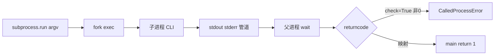
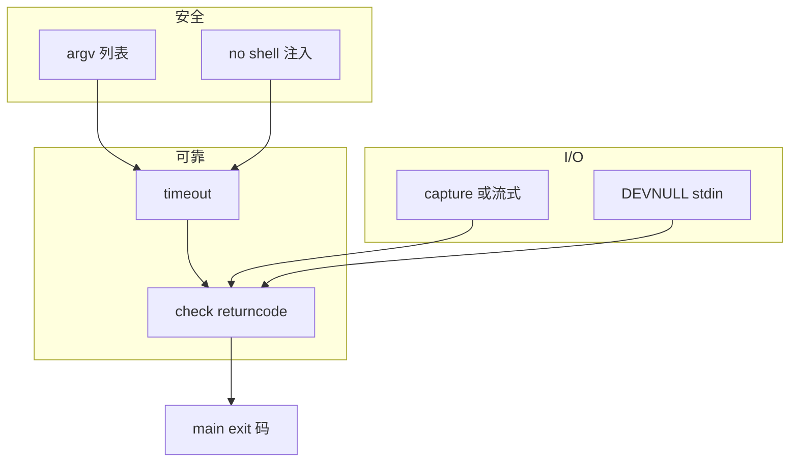
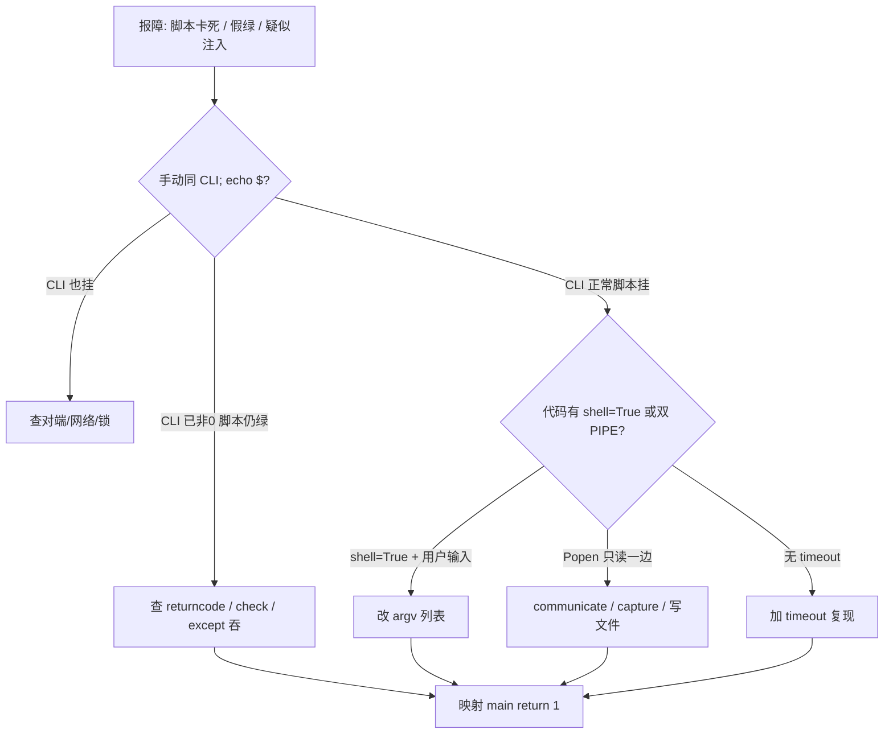

# 08｜subprocess 执行外部命令

> 巡检脚本 `os.system("kubectl get pods")` 把 shell 注入面全打开；有人 `subprocess.run(..., shell=True)` 拼用户输入导致 RCE；`Popen` 只读 stdout 不读 stderr，子进程写满管道死锁挂死——群里喊「脚本卡死杀进程」。
> **本章回答**：一次外部命令从 `subprocess.run` 派生、经管道 I/O 到 `returncode` 交给 Python 的一生。
> **不讲**：Shell 管道与 `PIPESTATUS` → [01-Shell 06](../../01-Shell/06-管道重定向与PIPESTATUS/)；Python 退出码 → [04](../04-异常与退出码/)；原子写结果文件 → [07](../07-文件路径与原子写/)。

**标记**：🎯重点 · 🔥难点 · ⭐常考 · 🔧实操

---

## 面试怎么考

| 标记 | 考点 |
|------|------|
| **核心** | `subprocess.run([...])`；**不用 shell=True 拼用户输入**；`check=True`；`timeout` |
| **必会** | `capture_output=True, text=True`；读 `returncode`；`CalledProcessError` |
| **常用** | `stdin=subprocess.DEVNULL`；环境 `env=`；`cwd=`；流式 `Popen` |
| **常考** | 列表 vs 字符串；PIPE 死锁；退出码与 04 章映射 |

> 📝 **面试（30 秒）**：调命令用 **`subprocess.run(["kubectl","get","pods","-n",ns], ...)`**——argv 列表，**默认 `shell=False`**。设 **`timeout`** 防挂死；要失败即异常用 **`check=True`**，或看 `returncode` 映射 `main` 的 `return 1`。捕获输出 `capture_output=True, text=True`。大量输出用 `Popen` 流式读，避免 PIPE 塞满死锁。别把用户输入塞进 shell 字符串。子进程非 0 要向上汇报，别假绿。

---

## 能力边界

| 维度 | subprocess 列表 | shell=True 字符串 | 纯 Python 库 |
|------|-------------------|-------------------|--------------|
| **适合** | kubectl/curl/tar 等 CLI | 内置复杂 shell 特性 | 有官方 SDK 时 |
| **不适合** | 无必要时的 shell | 含用户输入 | 强行 exec 代替 SDK |
| **契约** | 退出码+输出可控 | 注入风险高 | 首选 |

- 🔑 **四个 API 各管一段**
  - `run`：大多数一次性命令——等结束、拿 `CompletedProcess`
  - `check_output`：只要 stdout 且要检查码——语法糖
  - `Popen`：长输出流、双向交互——手动 wait / 读管道
  - `os.system`：**遗留，别用**——走 shell、无捕获

> ⚠️ **别混**：**Python 进程的退出码由你的 `main` 决定**——子命令失败要显式转成 `return 1`（[04](../04-异常与退出码/)）。子进程 `returncode` **不会**自动变成脚本 `$?`。

---

## 语言最小集

写/读运维脚本，subprocess 层认这些即可：

| 零件 | 示例 | 含义 |
|------|------|------|
| run | `subprocess.run(["ls","-l"], ...)` | 等待结束 |
| check | `check=True` | 非 0 抛异常 |
| capture_output | `capture_output=True` | 收 stdout/stderr |
| text | `text=True` | str 而非 bytes |
| timeout | `timeout=30` | 秒，超时 `TimeoutExpired` |
| returncode | `r.returncode` | 退出码 |
| stdout | `r.stdout` | 标准输出 |
| DEVNULL | `stdin=subprocess.DEVNULL` | 关闭 stdin |
| env / cwd | `env=...` / `cwd="/tmp"` | 环境与工作目录 |

```python
import subprocess

def kubectl_get(ns: str) -> str:
    r = subprocess.run(
        ["kubectl", "get", "pods", "-n", ns, "-o", "wide"],
        capture_output=True,
        text=True,
        timeout=60,
        check=True,
    )
    return r.stdout
```

- 🧩 **四行钉子**
  - argv **列表** → 默认 `shell=False`，无注入
  - `timeout=` → 防挂死
  - `check=True` 或判 `returncode` → 失败可见
  - `capture_output` / 流式 / 写文件 → 防 PIPE 死锁

零件认完，上主图。

---

## 一、一张图：一次外部命令从 spawn 到 exitcode 的一生 ⭐

> 🎯 **一句话**：**run/Popen → fork+exec → 子进程执行 → 管道 I/O → wait → returncode 回 Python**。



- 📖 **读图**
  - 🛤️ 主线六站：派生 → 执行 → 管道 → wait → 判码 → 交卷；卡在哪一站就查哪一站
  - 🚨 脚本「成功」但集群实际失败：查 **F 是否被忽略**，或 **G 被 `except` 吞掉**（[04](../04-异常与退出码/)）
  - 🧊 挂死常在 **D**：管道未读满，子进程阻塞写

本节对应练习题 Q13。带着问题往下走——命令怎么安全出生？

---

## 二、出生：subprocess.run 与 argv 列表 ⭐

> 🎯 **一句话**：**argv 列表 + `shell=False`（默认）** 是最安全的默认姿势。

```python
import subprocess

result = subprocess.run(
    ["df", "-h", "/"],
    capture_output=True,
    text=True,
    timeout=10,
)
print(result.returncode)   # 0
print(result.stdout)
```

```bash
# 等价 shell
df -h /
echo $?   # 0
```

### 📋 列表形式 vs shell 字符串 ⭐🔥

- ✅ **对**：无 shell，无注入

```python
subprocess.run(["grep", pattern, path], check=True)
```

- ☠️ **危险**：`pattern` 含 `; rm -rf /`

```python
subprocess.run(f"grep {pattern} {path}", shell=True)
```

- 🧩 若必须用 shell（管道、重定向）：**固定模板 + `shlex.quote` 用户片段**；仍不如拆成多次 `run` 或 Python 处理

> 💡 **打个比方**：`shell=True` 相当于把用户输入直接交给 `/bin/sh -c` 当脚本跑——等于让陌生人帮你按电梯。argv 列表则是你亲手把参数一个个塞进电梯，别人按不了。

### 💉 shell=True 的注入面 🔥

`shell=True` 时整个字符串交给 `/bin/sh -c`，`;`、`|`、`$()`、反引号、`&&` 都是 shell 元字符：

```python
# 用户输入 ns="x; rm -rf /tmp/y"
ns = "x; rm -rf /tmp/y"
subprocess.run(f"kubectl get pods -n {ns}", shell=True)
# 实际执行: /bin/sh -c "kubectl get pods -n x; rm -rf /tmp/y"
# ← 两条命令，第二条 rm 生效
```

```python
# 安全：argv 列表，分号只是 ns 的字面值
subprocess.run(["kubectl", "get", "pods", "-n", ns], check=True)
# ← ns="x; rm -rf /" 当普通字符串传给 kubectl，kubectl 报错
```

#### ❓ 为什么默认不能用 shell=True？

- 👻 **整串进 `/bin/sh -c`**：元字符变成控制流，不是数据
- ✅ **列表 argv**：`;` `|` `$` 都只是普通字符，不经 shell 解析
- 🔧 **真要管道**：拆两次 `run`，或固定模板 + `shlex.quote`——仍把用户片段当数据

> ⚠️ **别混**：`shell=False`（默认）下 argv 列表的参数**不经过 shell 解析**——`;` `|` `$` 不会被执行。

> 📝 **面试**：「`shell=True` + 用户输入 = RCE。要管道就拆成多次 `run`，或固定模板 + `shlex.quote`。」⭐（练习题 Q1、Q2）

本节对应练习题 Q1、Q2。命令出生了，上路要管失败与超时。

---

## 三、上路：check、输出与超时 ⭐

> 🎯 **一句话**：**`check=True` 非 0 抛 `CalledProcessError`**；**`timeout` 防挂死**。

```python
try:
    subprocess.run(["kubectl", "get", "nodes"], check=True, timeout=30)
except subprocess.CalledProcessError as e:
    log.error("kubectl failed code=%s stderr=%s", e.returncode, e.stderr)
    return 1
except subprocess.TimeoutExpired:
    log.error("kubectl timeout")
    return 1
```

- 🍬 `check_output` = `run(..., check=True, stdout=PIPE).stdout` 语法糖

```python
out = subprocess.check_output(["hostname"], text=True).strip()
```

### 📤 capture_output 与 text

```python
r = subprocess.run(["ls", "missing"], capture_output=True, text=True)
# r.returncode == 2
# r.stderr 含错误信息
```

- Python 3.7+：`capture_output=True`；老代码 `stdout=PIPE, stderr=PIPE`
- `text=True` 与旧名 `universal_newlines=True` 同义；3.7+ 用 `text`

#### ❓ 为什么默认 check=False？

- 📜 **库默认保守**：不少 CLI 用非 0 表示「有差异」（如 `diff`、`grep` 无匹配）
- 🚨 **运维脚本反过来**：多数场景失败就该停——显式写 `check=True`，或自己判 `returncode`
- ⚠️ **别混**：**`check=False`（默认）** 非 0 **不抛异常**——要自己看 `returncode`，否则假绿

本节对应练习题 Q3、Q4。I/O 与环境再进一层。

---

## 四、进门：stdin、env、cwd 🔧

> 🎯 **一句话**：**不需要交互时 `stdin=DEVNULL`**；改环境用 `env`；改目录用 `cwd`。

```python
import os

subprocess.run(
    ["python", "worker.py"],
    stdin=subprocess.DEVNULL,
    cwd="/opt/job",
    env={**os.environ, "LOG_LEVEL": "DEBUG"},
    check=True,
)
```

- 🔐 传密码用 env / 临时文件 / SDK，**不要 argv**（`ps` 可见）
- 📁 kubectl 用 `KUBECONFIG` 环境指向文件，比把内容塞进 argv 干净

```python
env = {**os.environ, "KUBECONFIG": str(kubeconfig_path)}
subprocess.run(["kubectl", "get", "ns"], env=env, check=True)
```

> 🔍 **现场**：子进程「莫名要输入」挂住——先查是否忘了 `stdin=DEVNULL`（cron 无 TTY 时更常见）。

本节对应练习题 Q5。最难点来了——管道怎么把自己堵死。

---

## 五、干活：PIPE 死锁与流式 Popen 🔥

> 🎯 **一句话**：**大量输出时别同时 PIPE 且不读**——缓冲区满子进程阻塞。

🔥 **PIPE 死锁** = 子进程往 stderr 写满管道缓冲区，父进程却只读 stdout，两边互相等。⭐ 线上挂死的高频根因。

> 💡 **打个比方**：PIPE 像窄水管——子进程拼命灌水，父进程不读就堵死；`communicate` 或写文件是放水。

```python
# 危险：输出极大时可能死锁（只开 PIPE 却不及时读）
p = subprocess.Popen(["find", "/"], stdout=subprocess.PIPE, stderr=subprocess.PIPE)
out, err = p.communicate()   # communicate 会读光管道——一次性中等输出 OK
```

- ✅ **一次性中等输出**：`run(capture_output=True)` 内部处理好了——优先用 `run`
- 🌊 **流式大日志**：

```python
with subprocess.Popen(
    ["kubectl", "logs", pod, "-f"],
    stdout=subprocess.PIPE,
    stderr=subprocess.STDOUT,
    text=True,
) as p:
    assert p.stdout is not None
    for line in p.stdout:
        process_line(line)
    rc = p.wait()
```

- 📄 或直接把 stdout 接到文件：

```python
with open("out.log", "w", encoding="utf-8") as f:
    subprocess.run(["heavy_cmd"], stdout=f, check=True)
```

#### ❓ 为什么 capture_output 不会死锁，自己开双 PIPE 会？

- 🧰 **`run(capture_output=True)` / `communicate()`**：父进程**两边都读**（或内部线程读），管道不会长期满
- ☠️ **自己 `Popen` + 只读 stdout**：stderr 写满 → 子阻塞 → 父还在等 stdout → **死锁**
- ✅ **运维脚本优先**：`run(capture_output=True)`，或 stdout 重定向到文件；真流式再 `Popen` 且合并 stderr 或两边读

### 🔀 run / check_output / Popen 选型 🔥

| API | 等待结束 | 捕获输出 | 失败抛异常 | 典型场景 |
|-----|:--------:|:--------:|:----------:|----------|
| `run` | 是 | 可选 | `check=True` | **默认首选** |
| `check_output` | 是 | stdout only | 是 | 只要 stdout 字符串 |
| `check_call` | 是 | 否 | 是 | 只关心成功 |
| `Popen` | 手动 wait | 手动读 | 手动 | 流式、双向交互 |

```python
# 语法糖关系
out = subprocess.check_output(["hostname"], text=True)
# ≡ run(..., check=True, stdout=PIPE).stdout

subprocess.check_call(["true"])
# ≡ run(..., check=True) 且不要输出
```

- `CompletedProcess` 字段：`args`、`returncode`、`stdout`、`stderr`——日志里常打后三者

### 🔤 编码与 errors ⭐🔥

```python
r = subprocess.run(
    ["legacy_tool"],
    capture_output=True,
    text=True,
    encoding="utf-8",
    errors="replace",    # 非法字节 → �，脚本不崩
)
```

- 子进程输出非 UTF-8 时，`text=True` 默认 strict 可能 `UnicodeDecodeError`
- 运维工具链杂时：`errors="replace"` 或 `backslashreplace`，日志标「输出可能有损」

```python
# bytes 模式自己解码
r = subprocess.run(["tool"], capture_output=True)
text = r.stdout.decode("utf-8", errors="replace")
```

> 💡 **打个比方**：`errors="strict"` 是洁癖门卫——不认识的字节就关门（崩）。`errors="replace"` 换成宽容门卫——贴个 `�` 放行。

> ⚠️ **别混**：**`text=True` 与 `universal_newlines=True`**（旧名）同义；Python 3.7+ 用 `text`。

### 🪦 遗留 API 别用

```python
# 遗留 — 无捕获、走 shell、难测
os.system("kubectl get pods")           # ← 只返回 exit code
os.popen("kubectl get pods").read()    # ← 只读 stdout，走 shell
# commands.getoutput(...)              # ← Python 2 遗物，已删

# 现代替代
subprocess.run(
    ["kubectl", "get", "pods"],
    check=True,
    capture_output=True,
    text=True,
)
```

| 遗留 API | 问题 | 现代替代 |
|----------|------|----------|
| `os.system` | 无捕获、走 shell、只返回码 | `run([...])` |
| `os.popen` | 只读 stdout、走 shell | `run(capture_output=True)` |
| `os.spawn*` | 接口笨重、跨平台不一致 | `run` / `Popen` |
| `commands.*` | Python 2 已删 | `run` / `check_output` |

> 🔍 **现场**：代码评审见 `os.system` / `os.popen`——一律改 `subprocess.run` 列表形式。

本节对应练习题 Q6、Q7、Q14。子进程结束了——码怎么交回 main？

---

## 六、交卷：退出码与 main 契约 ⭐

> 🎯 **一句话**：**子进程 `returncode` 非 0 → 脚本应 `return 1` 或 `raise`**。

```python
def run_check() -> int:
    r = subprocess.run(["bash", "-c", "test -f /ready"], capture_output=True)
    if r.returncode != 0:
        log.error("not ready stderr=%s", r.stderr)
        return 1
    return 0
```

| 子进程码 | 常见含义 | Python 侧 |
|----------|----------|-----------|
| 0 | 成功 | 继续 |
| 1 | 一般错误 | `return 1` |
| 2 | 用法错误 | 可映射 `return 2` |
| 127 | command not found | 配置/镜像问题 |
| 137 | SIGKILL（128+9） | OOM 杀 |

```python
def main() -> int:
    try:
        subprocess.run(["./check.sh"], check=True, timeout=120)
    except subprocess.CalledProcessError as e:
        log.error("check.sh exit %s", e.returncode)
        return 1
    return 0
```

#### ❓ 为什么子进程非 0，脚本还能 exit 0？

- 🔇 **`check=False` 且没看 `returncode`**：Python 当「跑完了」就算成功
- 🕳️ **`except CalledProcessError: pass`**：异常捕了却仍 `return 0`（[04](../04-异常与退出码/) 假绿）
- ✅ **契约**：子失败 → `return 1` / `raise` → `raise SystemExit(main())` 进 `$?`

> ⚠️ **别混**：**Shell 管道假绿**（[01-Shell 06](../../01-Shell/06-管道重定向与PIPESTATUS/)）——Python 里单条 `run` 没有管道问题；若 `shell=True` 跑 `"a | b"`，只有最后命令码。

本节对应练习题 Q8、Q9。把散落机制收成一张图。

---

## 七、收束：外部命令凭什么不拖垮脚本 🔥

> 🎯 **一句话**：安全（无注入）+ 可靠（timeout/check）+ I/O（不堵管道）→ 失败能映射到 `main` 退出码。



- 📖 **读图**
  - 🧱 左三栏缺一不可：安全派生 → 超时/判码 → 管道不堵
  - 📤 最右 `main exit` 才是调度器看见的契约（[04](../04-异常与退出码/)）
  - 🚨 少任何一栏：注入 / 挂死 / 假绿

**可背清单（六件套）**：

1. `run([cmd, arg1, ...])`，避免 `shell=True`
2. 总是 `timeout`（长命令除外要有理由）
3. 失败处理：`check=True` 或判 `returncode`
4. 大输出流式或写文件，防 PIPE 死锁
5. 秘密走 env/文件，不进 argv
6. 子失败映射 `main return 1`（[04](../04-异常与退出码/)）

> ⚠️ **别混**：六件套保证「本脚本不撒谎、不挂死、不注入」——**不保证**对端 CLI 语义正确（kubectl 返回空列表仍可能 exit 0）。

> 📝 **面试**：六件套分三组记——**安全**（列表）· **可靠**（timeout/check）· **交卷**（I/O + main 映射）。

本节对应练习题 Q13。回到开头那个挂死/注入现场——怎么作战。

---

## 八、作战：挂死、注入、假绿 🔥🔧

> 🎯 **一句话**：先手动跑同一条 CLI 看 `$?`，再搜 `shell=True`/`os.system`，再查 PIPE 与 timeout。



- 📖 **读图**：从「手动 CLI 的 `$?`」分叉——脚本撒谎 / 真挂死 / 注入面，三条路不同刀

**现象 · 先做 · 别做**

| 现象 | 先做 | 别做 |
|------|------|------|
| 脚本 hang | 是否 PIPE 未读；无 timeout | `kill -9` 了事 |
| 命令注入 | 搜 `shell=True` + f-string | 继续拼用户输入 |
| CI 绿检查失败 | `returncode` 是否检查 | 只看 stdout 有字 |
| 127 not found | 镜像 PATH；绝对路径 | 依赖 shell 别名 |
| 输出乱码 | `text=True` + encoding | 默认 bytes 当 str |

**60 秒剧本** 🔧：

- **0–10s**：手动跑同一条 CLI，看 `$?`
- **10–25s**：代码搜 `shell=True` / `os.system` / `os.popen`
- **25–40s**：加 `timeout=30` 复现挂死；查双 PIPE
- **40–60s**：失败路径确认 `echo $?` 非 0

```bash
python -c "import subprocess; r=subprocess.run(['false']); print(r.returncode)"
# 1

python -c "import subprocess; subprocess.run(['sleep','99'], timeout=1)"
# TimeoutExpired
```

本节对应练习题 Q10、Q11、Q12。下面模板可直接拿走。

---

## 生产模板 🔧

### 模板 1：安全 run 包装

```python
from __future__ import annotations

import logging
import subprocess

log = logging.getLogger(__name__)


def run_cmd(
    argv: list[str],
    *,
    timeout: int = 60,
    check: bool = True,
    cwd: str | None = None,
) -> subprocess.CompletedProcess[str]:
    log.debug("exec argv=%s", argv)
    return subprocess.run(
        argv,
        capture_output=True,
        text=True,
        timeout=timeout,
        check=check,
        cwd=cwd,
        stdin=subprocess.DEVNULL,
    )
```

### 模板 2：main 映射退出码

```python
def main() -> int:
    try:
        run_cmd(["kubectl", "get", "nodes"], timeout=30)
    except subprocess.CalledProcessError as e:
        log.error("kubectl failed rc=%s stderr=%s", e.returncode, e.stderr)
        return 1
    except subprocess.TimeoutExpired:
        log.error("kubectl timeout")
        return 1
    return 0
```

### 模板 3：不 check 手动分支

```python
r = subprocess.run(["test", "-f", path], capture_output=True)
if r.returncode == 0:
    ...
elif r.returncode == 1:
    ...
else:
    log.error("unexpected rc=%s", r.returncode)
    return 1
```

### 模板 4：大输出写文件

```python
with open(out_path, "w", encoding="utf-8") as out:
    subprocess.run(
        ["journalctl", "-u", "myservice", "--no-pager"],
        stdout=out,
        stderr=subprocess.STDOUT,
        check=True,
        timeout=300,
    )
```

---

## 踩坑清单

| 现象 | 原因 | 修法 |
|------|------|------|
| 死锁 | PIPE 未读 | communicate/流式/写文件 |
| 注入 | shell=True + 用户输入 | argv 列表 |
| 假绿 | 忽略 returncode | check 或判断 |
| 永久挂 | 无 timeout | timeout= |
| 编码错 | bytes 当 str / strict | text=True + errors= |
| 秘密进 ps | 密码在 argv | env 或文件 |
| os.system 无输出 | 老 API | 改 run |
| 127 | 命令不在 PATH | 绝对路径或 which |

---

## 必会 · 常考 ⭐

| 说法 | 对错 | 口径 |
|------|:----:|------|
| 默认 shell=True | 错 | 默认 False |
| 应用列表传参 | 对 | 防注入 |
| check=True 非 0 抛异常 | 对 | CalledProcessError |
| run 可设 timeout | 对 | TimeoutExpired |
| PIPE 大输出一定安全 | 错 | 可能死锁 |
| 子失败应反映到 main | 对 | return 1 |
| os.system 推荐 | 错 | 用 run |
| capture_output 含 stderr | 对 | 3.7+ |

---

## 收口

### 命令速查 🔧

```bash
python -c "import subprocess; print(subprocess.run(['echo','hi'], capture_output=True, text=True).stdout)"
# hi

python -c "import subprocess; print(subprocess.run(['false']).returncode)"
# 1

python -c "import subprocess; subprocess.run(['sleep','99'], timeout=1)"
# TimeoutExpired
```

```python
import subprocess
help(subprocess.run)   # 参数一览
```

### 面试锚点

遮住右列自问自答，卡壳的行回去重读对应小节。

| 问 | 30 秒答 |
|----|---------|
| 为何不用 shell=True？ | 注入风险；列表 argv 不经 shell |
| run 与 Popen？ | run 等结束；Popen 流式/交互 |
| 怎么防挂死？ | timeout + 读满管道 / 写文件 |
| 子进程失败怎么报？ | check 或 returncode → exit 1 |
| PIPE 死锁原因？ | 缓冲区满，父只读一边 |
| os.system 还能用吗？ | 别用；改 run 列表 |

### 易错一句话对照

- 默认就是 shell=True → 默认 **False**；列表不经 shell
- `shell=True` + 用户输入没事 → **RCE**；用 argv 列表
- 非 0 会自动抛异常 → 默认 `check=False`，要显式 `check=True` 或判码
- 子进程失败脚本一定非 0 → **不会**；要映射 `main return 1`
- 双 PIPE 自己读一边就行 → 另一边满了就死锁；用 `communicate` / `capture_output`
- `os.system` 够简单 → 无捕获、走 shell；改 `run`
- 密码放 argv 方便 → `ps` 可见；走 env/文件/SDK
- `text=True` 永远 UTF-8 strict → 杂工具加 `errors="replace"`
- 管道假绿只存在于 Shell → `shell=True` 跑 `"a\|b"` 同样只认最后命令码

### 数字墙

> 退出码 **0** 成功；**1** 一般失败；**2** 用法错误；**127** command not found；**137** ≈ SIGKILL（128+9，常 OOM）。`timeout` 单位秒，超时抛 `TimeoutExpired`。管道缓冲区常见 **64KB** 量级（实现相关）——大输出不读就会堵。`capture_output` 需 **Python 3.7+**。

---

## 合上书

- [ ] **默画**命令一生：run → 管道 I/O → returncode → main（Q13）
- [ ] 为什么禁止 shell=True 拼用户输入？列表为什么安全？（Q1、Q2）
- [ ] timeout 与 check 各防什么？默认 check=False 意味着什么？（Q3、Q4）
- [ ] PIPE 死锁怎么形成？`capture_output` 为何更安全？（Q6、Q7）
- [ ] stdin/env/cwd 各解决什么现场？（Q5）
- [ ] 子进程非 0 如何映射到 main？（Q8、Q9）
- [ ] 挂死 60 秒怎么查？（Q10、Q12）
- [ ] 假绿是否忘了 check returncode？（Q11）

八题能口述，subprocess 过关。下一章用 **HTTP 客户端与重试** 调 API——命令之外的另一条出站路径。
