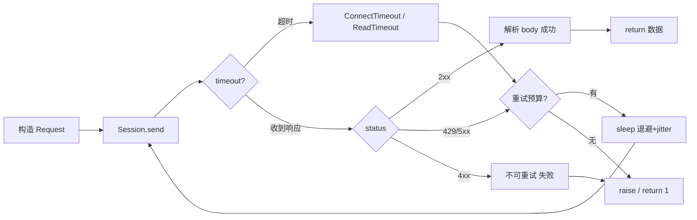
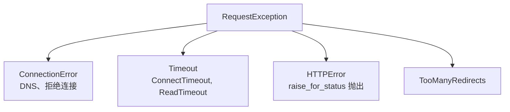
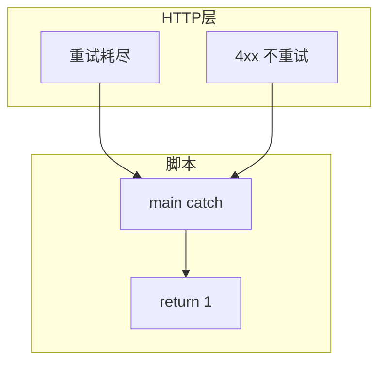
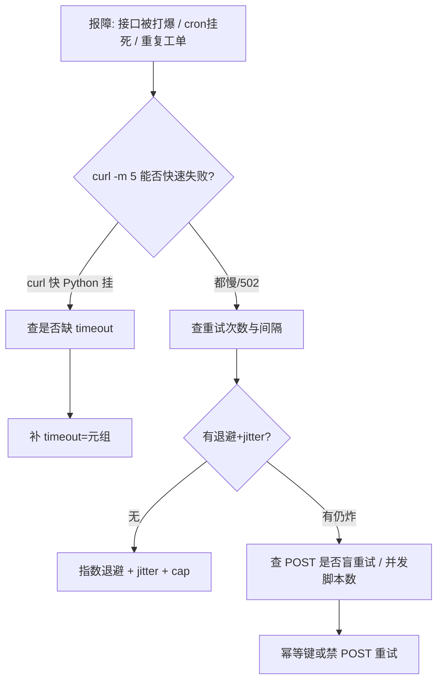

# 09｜HTTP 客户端与重试

> 巡检调 Prometheus 忘了 `timeout`，cron 重叠挂死；502 立刻连打 100 次把网关打挂；POST 创建工单失败盲重试出一堆重复单——群里喊「先限流」。
> **本章回答**：一次 HTTP 请求从构造、发出、读响应、判失败到重试退出的完整链路。
> **不讲**：logging 字段 → [05](../05-logging日志规范/)；轮询总预算 → [11](../11-轮询超时与退避/)；退出码汇总 → [04](../04-异常与退出码/)。

**标记**：🎯重点 · 🔥难点 · ⭐常考 · 🔧实操

---

## 面试怎么考

| 标记 | 考点 |
|------|------|
| **核心** | `requests`/`httpx`；`timeout=(connect, read)`；`raise_for_status()`；可重试 vs 不可重试 |
| **必会** | 必须设 timeout；5xx/429/连接错误可重试；4xx（除 429）一般不重试；GET 幂等 |
| **常用** | `Session` 连接池；`Retry`/`urllib3.util.retry`；指数退避 + jitter；自定义 Header |
| **常考** | POST 重试幂等；`timeout=None` 危害；重试放大流量；TLS verify |

> 📝 **面试（30 秒）**：运维脚本用 `requests`/`httpx`，**永远设 timeout**（connect + read）。成功看 2xx，`raise_for_status()`。可重试：超时、连接失败、429、5xx；不可重试：4xx 参数错。重试用**指数退避 + 上限 + jitter**，POST 要么幂等键要么别盲重试。用 `Session` 复用连接。失败最终 `raise` 或 `return 1`，别吞。

---

## 能力边界

| 维度 | requests + 手写重试 | curl 一行 | SDK（K8s/boto） |
|------|---------------------|-----------|-----------------|
| **适合** | REST 巡检、Webhook、Prometheus | 临时验证 | 云/K8s 原生 API |
| **不适合** | 超大流式下载无分块 | 复杂重试逻辑 | 简单 HTTP 探活 |
| **契约** | timeout + 状态码 + 重试边界 | 人眼 | SDK 自带重试策略 |

- 🔑 **三层各管一段**
  - `timeout`：单次请求最长等待——**不**管业务逻辑对不对
  - 重试：瞬态故障——**不**管永久性 404
  - `Session`：TCP/TLS 复用——**不**管 API 限流配额（要读 Header）

> ⚠️ **别混**：**没 timeout 的 HTTP 客户端是 cron 杀手**——进程挂住比失败更糟。

---

## 语言最小集

写/读运维脚本，HTTP 层认这些即可：

| 零件 | 示例 | 含义 |
|------|------|------|
| get/post | `requests.get(url, timeout=10)` | 发请求 |
| timeout | `timeout=(3.05, 27)` | connect / read 秒 |
| headers | `headers={"Authorization": "Bearer x"}` | 认证与类型 |
| params | `params={"q": "up"}` | 查询串 |
| json | `json={"key": "v"}` | JSON body |
| raise_for_status | `r.raise_for_status()` | 4xx/5xx → HTTPError |
| Session | `with requests.Session() as s:` | 连接池 |
| Retry | `HTTPAdapter(max_retries=retry)` | 适配层重试 |
| verify | `verify="/path/ca.pem"` | TLS 校验 |
| httpx | `httpx.Client(timeout=30)` | 同步/异步现代客户端 |

```python
#!/usr/bin/env python3
import requests

TIMEOUT = (3.05, 27)  # connect, read

def get_json(url: str, session: requests.Session) -> dict:
    resp = session.get(url, timeout=TIMEOUT)
    resp.raise_for_status()
    return resp.json()
```

- 🧩 **四行钉子**
  - 永远带 `timeout` → 防挂死
  - `raise_for_status()` → 非 2xx 变异常
  - 循环用 `Session` → 复用连接
  - 失败 `raise` / `return 1` → 别吞（[04](../04-异常与退出码/)）

零件认完，上主图。

---

## 一、一张图：HTTP 请求从发起到重试的一生 ⭐

> 🎯 **一句话**：**构造 → 发出 → 等响应（timeout 守门）→ 判成败 → 可重试? → 退避再试或失败退出**。



- 📖 **读图**
  - 🛤️ 主线六站：构造 → 发出 → timeout → 状态码 → 重试预算 → 成功/退出
  - 🚫 **H 岔路**是参数/权限错——重试无意义还浪费配额
  - 💥 **G→I** 必须有上限，否则 502 风暴变 DDoS

本节对应练习题 Q13。带着问题往下走——请求怎么「出生」？

---

## 二、出生：构造一次请求 ⭐

> 🎯 **一句话**：**URL + 方法 + Header + Body + timeout** 五件套，缺 timeout 等于没写完。

```python
import os
import requests

PROM_URL = os.environ.get("PROMETHEUS_URL", "http://prom:9090")
TIMEOUT = (3.05, 27)

headers = {
    "Accept": "application/json",
    "Authorization": f"Bearer {os.environ['API_TOKEN']}",
}

resp = requests.get(
    f"{PROM_URL}/api/v1/query",
    params={"query": "up"},
    headers=headers,
    timeout=TIMEOUT,
)
```

### ⏱️ timeout 两层含义 ⭐🔥

| 参数 | 含义 | 典型值 |
|------|------|--------|
| connect | TCP/TLS 建立上限 | 3s |
| read | 首字节后读 body 上限 | 27s |
| 单数字 | 同时作用于 connect+read | 10s |

```python
# 反模式
requests.get(url)              # timeout=None，永久阻塞
requests.get(url, timeout=999) # 一个数过大，connect 也拖死
```

- 🔑 **connect 短、read 略长**：连不上快失败，慢查询给读时间
- 🛑 **`timeout=None`（默认）**：对端不回就一直等——cron 下一轮再起一份 → 重叠挂死

#### ❓ 为什么必须设 timeout，不能靠「对端总会回」？

- ❌ **对端可能永远不回**：半开连接、黑洞路由、对端卡死未关 fd
- ❌ **进程挂住比失败更糟**：失败有退出码/日志；挂住 = cron 叠层、句柄耗尽、load 飙
- ✅ **timeout 是硬契约**：运维脚本里和 `check=True`、非 0 退出同级——不是可选优化

> 📝 **面试**：「connect 短、read 略长——连不上快失败，慢查询给读时间。」⭐（Q1）

本节对应练习题 Q1、Q10。请求造好了，怎么发出去才不浪费握手？

---

## 三、发出：Session 与连接池 ⭐

> 🎯 **一句话**：**循环里用 `Session`**，避免每条请求新建 TCP/TLS。

> 💡 **打个比方**：Session 像 keep-alive 的长电话线；裸 `get` 每次重新拨号。

```python
def check_all_targets(urls: list[str]) -> list[str]:
    failures: list[str] = []
    with requests.Session() as session:
        session.headers.update({"User-Agent": "sre-check/1.0"})
        for url in urls:
            try:
                r = session.get(url, timeout=(3, 10))
                r.raise_for_status()
            except requests.RequestException as e:
                failures.append(f"{url}: {e}")
    return failures
```

`Session` 内部 `urllib3` 连接池：`pool_connections`、`pool_maxsize` 对高并发巡检可调。

```python
from requests.adapters import HTTPAdapter

adapter = HTTPAdapter(pool_connections=10, pool_maxsize=50, max_retries=0)
session.mount("https://", adapter)
session.mount("http://", adapter)
# ← pool_connections=10：对 10 个不同 host 保留连接
# ← pool_maxsize=50：同一 host 最多 50 条并发连接
```

#### ❓ 为什么循环里裸 `requests.get` 会炸连接数？

- 🔄 **每次 get = 新 TCP/TLS**：百 URL 巡检 → 百次握手；对端 TIME-WAIT 堆满
- ✅ **Session 复用**：池内连接 keep-alive，连接数贴近 `pool_maxsize`
- 🔍 **现场**：`ss -tn | grep :9090 | wc -l`——裸 get 看大量 TIME-WAIT，Session 稳定在池大小以内

> ⚠️ **别混**：`max_retries=0` 把重试交给手写逻辑时要显式关掉适配器重试，避免「两层重试叠乘」。

本节对应练习题 Q4。发出去了，怎么认成功？

---

## 四、读响应：状态码与 raise_for_status ⭐

> 🎯 **一句话**：**2xx 成功；`raise_for_status()` 把 4xx/5xx 变成异常**。

```python
resp = session.get(url, timeout=TIMEOUT)
resp.raise_for_status()
data = resp.json()
```

| 码段 | 含义 | 运维脚本默认策略 |
|------|------|------------------|
| 200/201/204 | 成功 | 解析 body（注意 204 无 body） |
| 301/302 | 重定向 | 默认 follow，关注 redirect 链 |
| 400/422 | 请求/参数错 | **不重试**，修 payload |
| 401/403 | 认证/授权 | 修 token，别重试 |
| 404 | 资源不存在 | **不重试**，查路径 |
| 408 | 请求超时 | 可重试 |
| 429 | 限流 | 退避 + 读 `Retry-After` |
| 500–599 | 服务端瞬态 | 有限重试 |

```python
try:
    resp.raise_for_status()
except requests.HTTPError as e:
    if e.response is not None and e.response.status_code == 404:
        raise ResourceNotFound(url) from e
    raise
```

#### ❓ 为什么不能只写 `if status_code == 200`？

- ❌ **漏 201/204**：创建成功、无内容也是成功——当失败会误报
- ❌ **500 仍去 `.json()`**：解析错误信息混乱，掩盖真实 HTTP 失败
- ✅ **`raise_for_status()` 或 `resp.ok`**：非 2xx 统一进异常路径；204 先判 `resp.content` 再解析

> ⚠️ **别混**：`status_code == 200` 不够——用 `resp.ok` 或 `raise_for_status`。

本节对应练习题 Q2、Q3、Q8。状态码认得了——异常家族怎么分层 catch？

---

## 五、判失败：RequestException 家族 ⭐

> 🎯 **一句话**：**网络层、超时、HTTP 错误都继承 `RequestException`**——分层 catch。



- 📖 **读图**
  - 🌳 根是 `RequestException`——宽捕用它；细捕用叶子
  - ⏱️ `Timeout` 分 Connect / Read——connect 失败多半瞬态，read 可能是慢查询
  - 📡 `HTTPError` 才带 `e.response`——没有响应的连接错误不要假设有 status

```python
import requests
from requests.exceptions import ConnectTimeout, HTTPError, RequestException

try:
    resp = session.get(url, timeout=TIMEOUT)
    resp.raise_for_status()
except ConnectTimeout:
    log.warning("connect timeout %s", url)
    raise
except HTTPError as e:
    code = e.response.status_code if e.response else "?"
    log.error("http %s %s", code, url)
    raise
except RequestException:
    log.exception("request failed %s", url)
    raise
```

- 🪜 **分层原则**：先捕具体（ConnectTimeout / HTTPError），再捕宽（RequestException）
- ⚠️ **别混**：捕了还要决定「重试还是交卷」——捕完 `pass` = 假绿（[04](../04-异常与退出码/)）

本节对应练习题 Q5。失败认得了——最难的一刀：能不能重试？

---

## 六、重试：可重试边界与退避 🔥⭐

> 🎯 **一句话**：**只重试瞬态故障；次数有上限；间隔指数增长 + jitter**。

🔥 **幂等（idempotent）** = 同一操作执行一次和执行十次，最终结果一样。大白话：按一次电梯按钮和按十次，电梯还是来一趟；但「创建工单」按十次会出十张单。⭐ 面试必考。

> 💡 **打个比方**：打电话对方没接——可能是信号差（瞬态），重打几次合理；号码错了（永久），打 100 次也没用。退避＝每次等久一点；jitter＝别跟所有人同一秒重打。

### 🚦 什么该重试

| 条件 | 重试? | 原因 |
|------|:-----:|------|
| ConnectTimeout | 是 | 网络瞬态 |
| ReadTimeout | 视情况 | 可能服务端慢，限次数 |
| 502/503/504 | 是 | 网关/上游瞬态 |
| 429 | 是 | 配合 Retry-After |
| 400/404/422 | 否 | 请求本身错 |
| POST 创建资源 | **谨慎** | 可能重复创建 |

#### ❓ 为什么 4xx（除 429）不重试？

- 🧱 **请求本身错**：路径错、参数错、权限错——换时间再发还是错
- 💸 **重试浪费配额**：401 紧循环 = 把错误日志打爆，还可能触发对端风控
- ✅ **例外只有 429 / 408**：限流与请求超时是「现在不行、等一会可能行」

### 🔐 POST 重试的幂等边界 🔥⭐

POST 是**非幂等**方法——服务端收到请求但响应丢失时，客户端无法判断「创建了没」。盲重试可能重复创建工单、重复扣款。

三种对策：

```python
# ① Idempotency-Key：服务端用 key 去重
headers = {"Idempotency-Key": str(uuid.uuid4())}
session.post(url, json=payload, headers=headers, timeout=TIMEOUT)

# ② 先 GET 查再 POST（读后写）
existing = session.get(f"{url}?ref={ref}", timeout=TIMEOUT)
if existing.status_code == 404:
    session.post(url, json=payload, timeout=TIMEOUT)  # ← 确认不存在才建

# ③ 只重试连接层失败（未收到任何响应），不重试 5xx
except requests.ConnectionError:
    retry()  # ← 连接没建立，服务端不可能已处理
except requests.HTTPError:
    raise    # ← 收到了响应，说明服务端已处理，不能盲重试
```

> ⚠️ **别混**：PUT 带**固定资源 ID** 时可设计为幂等（`PUT /items/42`）；POST `CREATE` 每次生成新 ID——必须靠 Idempotency-Key。

#### ❓ 为什么 POST 收到 502 也不能盲重试？

- 👻 **502 可能发生在「已处理、回包丢了」之后**：网关超时，上游其实写库成功了
- 🔁 **再发一次 POST** = 可能第二张工单 / 第二笔扣款
- ✅ **有 Idempotency-Key** 才敢重试；否则只重试「从未收到任何响应」的连接失败

### 📝 手写重试模板

```python
import random
import time

RETRYABLE_STATUS = {429, 500, 502, 503, 504}
MAX_ATTEMPTS = 5
BASE = 0.5
CAP = 30.0

def request_with_retry(session: requests.Session, method: str, url: str, **kwargs):
    kwargs.setdefault("timeout", TIMEOUT)
    last_exc: Exception | None = None
    for attempt in range(1, MAX_ATTEMPTS + 1):
        try:
            resp = session.request(method, url, **kwargs)
            if resp.status_code in RETRYABLE_STATUS:
                resp.raise_for_status()
            resp.raise_for_status()
            return resp
        except (requests.ConnectionError, requests.Timeout) as e:
            last_exc = e
            log.warning("attempt %s/%s transient: %s", attempt, MAX_ATTEMPTS, e)
        except requests.HTTPError as e:
            code = e.response.status_code if e.response else 0
            if code not in RETRYABLE_STATUS:
                raise
            last_exc = e
            retry_after = e.response.headers.get("Retry-After")
            if retry_after and retry_after.isdigit():
                time.sleep(min(int(retry_after), int(CAP)))
                continue
            log.warning("attempt %s http %s", attempt, code)
        if attempt == MAX_ATTEMPTS:
            break
        sleep = min(CAP, BASE * (2 ** (attempt - 1)))  # ← 指数 0.5, 1, 2, 4, 8...
        sleep *= random.uniform(0.5, 1.5)  # ← jitter，防 thundering herd
        time.sleep(sleep)
    raise RuntimeError(f"failed after {MAX_ATTEMPTS} attempts") from last_exc
```

- 🔍 **现场**：`grep "attempt" /var/log/ops/check.log | tail -20`——无退避会看到 0.1s 间距连打满

#### ❓ 为什么退避还要加 jitter？

- 🔥 **thundering herd**：发布窗口 50 个脚本同时 502；无 jitter → 同一秒全体重试，第二拨峰值更高
- ✅ **jitter** 把重试时刻打散——是唯一解，不是锦上添花
- 📏 **还有 cap**：`min(CAP, BASE * 2^n)`，防止退避无穷大拖死 cron 窗口

> 📝 **面试**：「POST 重试要么 Idempotency-Key，要么先查再建，要么只重试连接层失败。」⭐（Q5、Q6）

### 🔌 urllib3 Retry 适配器 ⭐

```python
from requests.adapters import HTTPAdapter
from urllib3.util.retry import Retry

retry = Retry(
    total=3,
    connect=3,
    read=3,
    status=3,
    backoff_factor=0.5,
    status_forcelist=[429, 500, 502, 503, 504],
    allowed_methods=["GET", "HEAD", "OPTIONS", "PUT", "DELETE"],  # 默认不含 POST
    raise_on_status=False,
)
adapter = HTTPAdapter(max_retries=retry)
session = requests.Session()
session.mount("https://", adapter)
session.mount("http://", adapter)
```

- ✅ 适配器重试后仍要 `raise_for_status()`
- ✅ **POST 默认不在 `allowed_methods`**——这是对的
- ⚠️ **别混**：`raise_on_status=False` 时适配器重试完可能仍返回 5xx Response——必须自己 raise

### 🔒 TLS 证书校验 🔥⭐

生产 `verify=True` 是铁律。企业 CA 常报 `SSLError: certificate verify failed`——**指定 CA bundle**，不是关校验：

```python
# 正确：指定企业 CA
resp = session.get(url, timeout=TIMEOUT, verify="/etc/ssl/certs/company-ca.pem")
# ← 也可设 REQUESTS_CA_BUNDLE

# 错误：关校验（仅本地临时）
# requests.get(url, verify=False)  # ← InsecureRequestWarning，生产禁止
```

```python
# mTLS 双向认证
resp = session.get(url, timeout=TIMEOUT, cert=("/path/client.pem", "/path/key.pem"))
```

> ⚠️ **别混**：TLS 错不是重试能解决的——证书过期/不信任是永久错误。唯一例外：证书刚轮换的中间态（秒级）。

本节对应练习题 Q5、Q6、Q7、Q9、Q11、Q14。重试边界钉死——敏感信息与代理别踩坑。

---

## 七、TLS、代理与敏感信息 ⭐

> 🎯 **一句话**：**生产 verify=True**；代理用环境变量或显式 `proxies`；日志里别打 Authorization。

```python
resp = session.get(url, timeout=TIMEOUT, verify="/etc/ssl/certs/ca-bundle.crt")

# 日志脱敏
log.info("GET %s status=%s", url, resp.status_code)
# 不要 log headers 里的 token
```

- 🔐 **Token 只进 Header / 环境变量**，不进 URL query、不进日志全文 dump
- 🌐 **代理**：`HTTPS_PROXY` 环境变量，或 `proxies={"https": "http://proxy:8080"}`
- ⚠️ **别混**：`verify=False` 能「先跑通」≠ 能进仓库——临时调试完立刻改回 CA 路径

本节对应练习题 Q9、Q11。六件套收束一下。

---

## 八、收束：HTTP 客户端凭什么安全可控 🔥

> 🎯 **一句话**：安全可控 = **timeout + 状态码处理 + 有界重试 + Session + 失败交卷**；少一环就变风暴或假绿。



- 📖 **读图**
  - 🧱 瞬态走左（重试耗尽再交卷）；永久 4xx 走右（立刻交卷）
  - 📤 `main` 是脚本与 cron/CI 的接缝——HTTP 层 `raise`，边界映射退出码（[04](../04-异常与退出码/)）

**可背清单（六件套）**：

1. 所有请求带 `timeout=(connect, read)`
2. `raise_for_status()` 或显式检查 `resp.ok`
3. 429/5xx/连接/超时：有限重试 + 退避 + jitter
4. 4xx（除 429）：不重试，修请求
5. POST 重试考虑幂等
6. 循环用 `Session`；失败 `raise`/`return 1`，不吞

> ⚠️ **别混**：HTTP 重试解决**单次调用**瞬态；**等 Pod Ready** 是外层轮询（[11](../11-轮询超时与退避/)），两层不要混为一谈。

> 📝 **面试**：六件套分三组——**守门**（timeout、raise）· **边界**（可重试码、幂等）· **纪律**（Session、交卷）。

本节对应练习题 Q13。回到开头那个 502 风暴现场。

---

## 九、作战：502 风暴、脚本挂死、重复工单 🔥🔧

> 🎯 **一句话**：先 `curl -m` 对比 Python，再 grep timeout/retry，再查 POST 是否盲重试。



- 📖 **读图**：从「本地能否快速失败」分叉——挂死多半缺 timeout；风暴多半无退避或 POST 盲重试

| 现象 | 先做 | 别做 |
|------|------|------|
| cron 重叠挂死 | 查是否缺 timeout | 加大 cron 间隔掩盖 |
| 网关 502 雪崩 | 看重试次数与间隔 | 无退避紧循环 |
| 重复 POST 工单 | 查幂等键/重试方法 | 盲重试 POST |
| TLS 证书错 | 修 CA 或 cert 路径 | 长期 verify=False |
| 401 一直重试 | 停重试，换 token | 加到 100 次 |

**60 秒剧本** 🔧：

| 时段 | 动作 |
|------|------|
| 0–10s | `curl -v -m 5 URL` 对比 Python |
| 10–25s | grep `timeout` / `retry` / `sleep` |
| 25–40s | 故意断网看是否快速失败 |
| 40–60s | 日志是否有 attempt 与 status |

```bash
curl -sS -m 10 -w "\nhttp_code=%{http_code}\n" "$URL"
python -c "import requests; requests.get('$URL', timeout=(3,5)).raise_for_status()"
```

本节对应练习题 Q11、Q12。下面是可复制模板。

---

## 生产模板 🔧

### 模板 1：Session + timeout + raise

```python
def build_session() -> requests.Session:
    s = requests.Session()
    s.headers.update({"User-Agent": "ops-check/1.0"})
    return s

def fetch_health(session: requests.Session, base: str) -> dict:
    url = f"{base.rstrip('/')}/healthz"
    resp = session.get(url, timeout=(3.05, 15))
    resp.raise_for_status()
    return resp.json()
```

### 模板 2：urllib3 Retry + 显式 raise

```python
def build_retry_session(total: int = 3) -> requests.Session:
    retry = Retry(total=total, backoff_factor=0.5,
                  status_forcelist=[429, 502, 503, 504])
    s = requests.Session()
    s.mount("https://", HTTPAdapter(max_retries=retry))
    return s
```

### 模板 3：GET 幂等 + 手写退避

```python
def get_with_backoff(session, url: str) -> requests.Response:
    return request_with_retry(session, "GET", url)
```

### 模板 4：main 边界

```python
def main() -> int:
    try:
        with build_session() as s:
            run_checks(s)
    except requests.RequestException as e:
        log.error("http checks failed: %s", e)
        return 1
    return 0
```

### 🔧 测试重试行为

```bash
python -c "
import requests, time
from requests.adapters import HTTPAdapter
from urllib3.util.retry import Retry
s = requests.Session()
retry = Retry(total=3, backoff_factor=0.5, status_forcelist=[503])
s.mount('https://', HTTPAdapter(max_retries=retry))
t0 = time.time()
try:
    r = s.get('https://httpbin.org/status/503', timeout=5)
    r.raise_for_status()
except Exception as e:
    print(f'failed in {time.time()-t0:.1f}s: {e}')
"
# ← 预期 ~3.5s 后失败（0.5+1+2 退避）
```

---

## 踩坑清单

| 现象 | 原因 | 修法 |
|------|------|------|
| cron 挂死 | 无 timeout | `(connect, read)` |
| 502 放大 | 无退避紧重试 | 指数 + jitter + cap |
| 重复资源 | POST 重试 | Idempotency-Key / 禁 POST 重试 |
| JSON 解析崩 | 未 check 2xx | 先 raise_for_status |
| 连接泄漏 | 未 close Response | `with` 或 Session |
| 证书错误 | 企业 CA | 指定 verify 路径 |
| 重试 404 | status_forcelist 过大 | 只列 5xx/429 |
| 日志泄密 | 打印 headers | 只打 url/status |
| 重试无上限 | `total=None` | 硬编码上限 |
| 401 紧循环 | 把 401 当瞬态 | 401 不重试 |
| 204 取 body 崩 | 对 204 调 `.json()` | 先判 `resp.content` |

---

## 必会 · 常考 ⭐

| 说法 | 对错 | 口径 |
|------|:----:|------|
| requests 默认有 timeout | 错 | 默认 None |
| 5xx 应无限重试 | 错 | 有限 + 退避 |
| GET 重试相对安全 | 对 | 仍要防放大 |
| 404 应重试 | 错 | 路径/资源错 |
| Session 可复用连接 | 对 | 循环必备 |
| verify=False 可上生产 | 错 | 仅临时调试 |
| 429 看 Retry-After | 对 | 优先遵守 |
| raise_for_status 后才是 2xx | 对 | 否则 HTTPError |

---

## 收口

### 命令速查 🔧

```bash
curl -sS -m 10 -H "Authorization: Bearer $TOKEN" "$URL"
curl -w "time_total=%{time_total} http_code=%{http_code}\n" -o /dev/null -s "$URL"

python -c "
import requests
r = requests.get('https://httpbin.org/status/503', timeout=5)
print(r.status_code)
"
```

```python
import httpx
# httpx 超时四段独立
client = httpx.Client(timeout=httpx.Timeout(connect=3.05, read=27, write=10, pool=5))
with httpx.Client(timeout=10.0) as client:
    r = client.get("https://example.com")
    r.raise_for_status()

# 异步适合高并发巡检（GIL 限制见 [10](../10-并发与GIL/)）
async with httpx.AsyncClient(timeout=10) as client:
    r = await client.get(url)
```

### 面试锚点

遮住右列自问自答，卡壳的行回去重读对应小节。

| 问 | 30 秒答 |
|----|---------|
| 为什么必须 timeout？ | 防挂死，cron 重叠 |
| 哪些 status 重试？ | 429、5xx、连接/超时 |
| POST 能重试吗？ | 要幂等设计，默认慎 |
| Session 干嘛？ | 连接池/TLS 复用 |
| 退避为什么加 jitter？ | 避免同步 thundering herd |
| verify=False？ | 生产禁止；指定 CA bundle |

### 易错一句话对照

- requests 默认有 timeout → 默认 `None`，必须显式设
- 失败就重试 → 只重试瞬态；4xx（除 429）不重试
- POST 502 再打一次 → 可能已创建；要幂等键或只重试连接失败
- 无退避紧循环 → 502 风暴变 DDoS；指数 + jitter + cap
- `status_code == 200` 才算成功 → 漏 201/204；用 `raise_for_status`
- 循环里裸 `get` → TIME-WAIT 堆满；用 Session
- `verify=False` 先跑通 → 生产禁止；指定企业 CA
- HTTP 重试 = 等 Pod Ready → 单次调用 vs 外层轮询（11 章）别混
- 401 多试几次 → 权限错不重试，修 token
- 捕了 RequestException 就 pass → 假绿；raise 或 return 1

### 数字墙

> `timeout=(3.05, 27)` 常见起步（connect / read）。重试 **`MAX_ATTEMPTS=5`**，`BASE=0.5`、`CAP=30`；退避 `min(CAP, BASE*2^(n-1))` × jitter `0.5～1.5`。`Retry(total=3, backoff_factor=0.5)`，`status_forcelist=[429,500,502,503,504]`。可重试码：**429、5xx、连接/超时**；不可重试：**4xx（除 429/408）**。

---

## 合上书

- [ ] **默画**请求一生：构造 → 发出 → 判失败 → 重试/退出（Q13）
- [ ] 为什么必须设 timeout？connect 与 read 怎么分？（Q1、Q10）
- [ ] Session 比每次 get 好在哪？（Q4）
- [ ] 哪些状态码可重试？哪些不行？（Q2、Q3、Q8）
- [ ] 幂等与 POST 重试关系？三种对策？（Q5）
- [ ] 指数退避怎么口述？为什么加 jitter？（Q6、Q14）
- [ ] urllib3 Retry 默认为什么不含 POST？（Q7）
- [ ] 502 风暴 60 秒怎么查？Token 怎么不进日志？（Q9、Q11、Q12）

八题能口述，HTTP 客户端过关。下一章用 **并发与 GIL** 把吞吐提上去。
