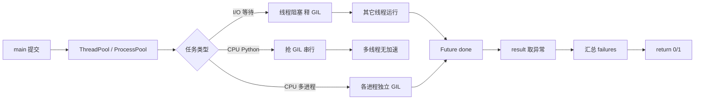
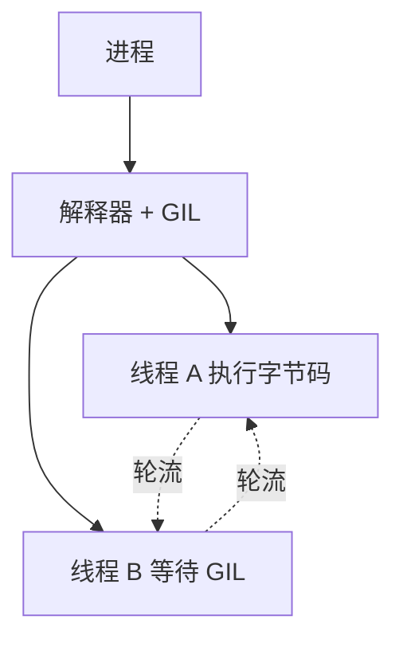
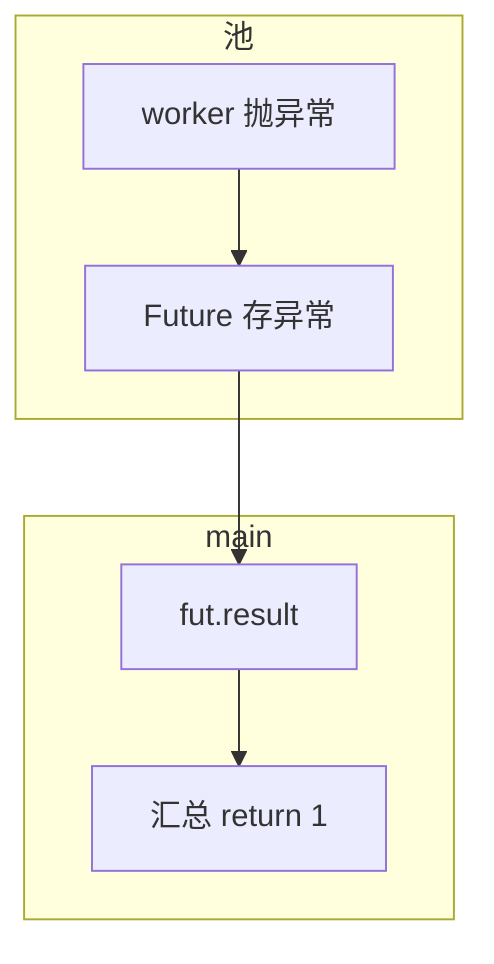
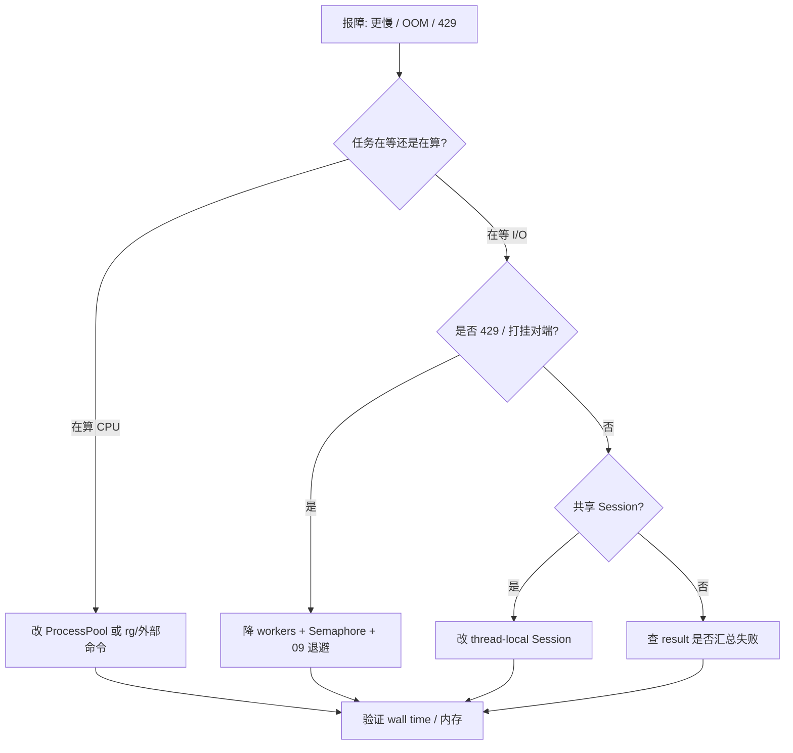

# 10｜并发与 GIL

> 巡检 500 台主机单线程 HTTP 要 25 分钟；改 `ThreadPoolExecutor(64)` 缩到 3 分钟——但对 500 个 JSON 做 SHA256 仍慢，加线程反而更慢；有人 `multiprocessing` 在 cron 里 fork 爆内存——群里已经喊「再加点线程」。
> **本章回答**：一个并发任务从提交、调度、执行（持锁/释锁）到汇总结果的完整链路，以及 GIL 如何影响选型。
> **不讲**：HTTP 重试细节 → [09](../09-HTTP客户端与重试/)；subprocess 并行 → [08](../08-subprocess执行外部命令/)；asyncio 深度 → 本章只给运维脚本最小集。

**标记**：🎯重点 · 🔥难点 · ⭐常考 · 🔧实操

---

## 面试怎么考

| 标记 | 考点 |
|------|------|
| **核心** | GIL；I/O bound vs CPU bound；`ThreadPoolExecutor` vs `ProcessPoolExecutor` |
| **必会** | 等网络/磁盘用线程或 asyncio；算哈希/压缩用多进程；线程数别盲目 100 |
| **常用** | `concurrent.futures`；`as_completed`；超时 `future.result(timeout=)` |
| **常考** | 多线程为何不能加速 CPU；GIL 何时释放；cron 里 ProcessPool 内存 |

> 📝 **面试（30 秒）**：CPython 有 **GIL**，同一进程多线程不能并行跑纯 Python CPU 代码。等 HTTP/SSH/磁盘时线程有效，因为 I/O 会释放 GIL。**CPU 密集**用 `ProcessPoolExecutor` 或把计算交给 C 扩展/外部命令。运维巡检：`ThreadPoolExecutor(max_workers=8~32)` + 09 章 Session。控制并发防打爆目标。`as_completed` 汇总失败，`main` 非 0 退出。

---

## 能力边界

| 维度 | 线程池 | 进程池 | asyncio |
|------|--------|--------|---------|
| **适合** | 多 URL/主机 I/O | CPU 计算、解析大日志 | 大量 I/O、单进程 |
| **不适合** | CPU 密集 Python | 高内存、短任务海量 fork | 阻塞库未改造 |
| **风险** | 打爆对端、Session 线程安全 | 内存 × worker | 需 async 生态 |

- 🔑 **三个机制各管一段**
  - **GIL**：字节码执行互斥——**不**管子进程（各进程独立 GIL）
  - **线程池**：并行 I/O 等待——**不**管目标 API 限流
  - **进程池**：并行 CPU——**不**管共享内存（需 Manager）

> ⚠️ **别混**：**先问任务在等还是在算**——等用线程，算用进程或外包。

---

## 语言最小集

写/读运维并发脚本，认这些即可：

| 零件 | 示例 | 含义 |
|------|------|------|
| ThreadPoolExecutor | `with ThreadPoolExecutor(16) as ex:` | 线程池 |
| ProcessPoolExecutor | `ProcessPoolExecutor(4)` | 进程池 |
| submit | `ex.submit(fn, arg)` | 提交任务 |
| map | `ex.map(fn, items)` | 批量（顺序保留） |
| as_completed | `for f in as_completed(futs):` | 谁先完谁先处理 |
| result | `f.result(timeout=30)` | 取结果/抛异常 |
| wait | `wait(futs, timeout=60)` | 等一批 |
| threading.Lock | `with lock:` | 互斥 |
| asyncio.run | `asyncio.run(main())` | 跑协程入口 |
| gather | `await asyncio.gather(*tasks)` | 并发协程 |

```python
from concurrent.futures import ThreadPoolExecutor, as_completed

def check_host(host: str) -> tuple[str, bool]:
    ...

def run_all(hosts: list[str], workers: int = 16) -> list[str]:
    failures: list[str] = []
    with ThreadPoolExecutor(max_workers=workers) as ex:
        futs = {ex.submit(check_host, h): h for h in hosts}
        for fut in as_completed(futs):
            host, ok = fut.result()
            if not ok:
                failures.append(host)
    return failures
```

- 🧩 **四行钉子**
  - `submit` + `as_completed` → 流式汇总，失败先报告
  - `fut.result()` → worker 异常在这里 re-raise
  - `max_workers` 有上限 → 防打爆对端
  - I/O 用线程、CPU 用进程 → 别混池

零件认完，上主图。

---

## 一、一张图：并发任务与 GIL 的一生 ⭐

> 🎯 **一句话**：**提交 → 池调度 worker → 执行（I/O 释 GIL / CPU 抢 GIL）→ Future done → 汇总异常 → main 退出码**。



- 📖 **读图**
  - 🛤️ 主线：提交 → 调度 → 持锁/释锁 → Future → 退出码；卡在哪一站就查哪一站
  - 🚨 **F→G** 是面试高频——纯 Python 循环加线程没用
  - 📟 **D→E** 是巡检脚本主路径——等网络时别的线程能跑

本节对应练习题 Q13。带着问题往下走——GIL 到底锁什么？

---

## 二、出生：GIL 是什么（⭐常考）

> 🎯 **一句话**：**GIL 是 CPython 解释器全局互斥锁**，同一时刻只有一个线程执行 Python 字节码。

🔥 **GIL（Global Interpreter Lock）** = CPython 里同一时刻只允许一个线程执行 Python 字节码的大锁。大白话：会议室同一时间只准一个人说话——I/O 等待时可以让出麦克风，纯算账则让再多人也插不上话。⭐



- 📖 **读图**
  - 🚪 一个进程一把 GIL；线程 A 跑字节码时 B 只能等
  - 🔄 虚线是**轮流**不是**并行**——总墙钟时间不缩短

### 🔓 GIL 何时释放（⭐常考 · 🔥难点）

- ✅ **会释放**：`requests` 等 I/O 阻塞、`time.sleep`、`socket.recv` / `select`、足够长的文件 `read`/`write`
- ⚠️ **可能释放**：许多 C 扩展计算（numpy 部分 op）——别想当然
- ❌ **不释放 / 无加速**：纯 Python 大循环；`hashlib` 等 C 层常持 GIL 的路径（别假设哈希会并行）

**CPython 内部两条路径** 🔥：

1. **`sys.setswitchinterval`（默认 5ms）** —— 每隔约 5ms 检查是否该让出 GIL。纯 Python 循环虽不主动释放，多线程仍能「轮流」——但轮流 ≠ 并行，总时间不缩短。
2. **`Py_BEGIN_ALLOW_THREADS` / `Py_END_ALLOW_THREADS`** —— C 扩展在阻塞 I/O 前显式释放 GIL。`requests`、`time.sleep`、`socket.recv` 走这条路。

#### ❓ 为什么多线程加速不了纯 Python CPU？

- 🔒 **同一时刻只有一个线程持 GIL 跑字节码**——32 个线程仍串行算
- ⏱️ **5ms 切换**只是轮流发言，白板仍只有一块，总产出不变
- 📉 **切换本身有开销**——CPU 任务加线程可能比单线程更慢
- ✅ **真并行** → 多进程（各带独立 GIL）或外包给会释锁的 C/外部命令

> 💡 **打个比方**：GIL 像单人白板——一个人写时别人等；去打印机（I/O）时白板空出来。`setswitchinterval` 就是「每 5ms 喊一声让别人也写写」，白板仍然只有一个。

> 📝 **面试**：「GIL 防 CPython 引用计数竞态，代价是 CPU 多线程不并行；I/O 型仍值得用线程。CPython 3.13+ 有实验性 no-GIL（PEP 703），生产未普及。」

### 与运维的关系

- **批量 HTTP/SSH 检查**：线程池 ✓
- **日志里正则扫 10GB 纯 Python**：线程池 ✗ → 进程或 `rg`/awk
- **Pandas/numpy 大矩阵**：看是否释放 GIL，不能想当然
- **`hashlib.sha256` 大文件**：常持 GIL → ProcessPool 或外部工具
- **`zlib` / `gzip`**：C 层部分释放，别假设并行

本节对应练习题 Q1、Q2。GIL 清楚了——下一问：你的任务在等还是在算？

---

## 三、选型：I/O bound vs CPU bound（🔥难点）

> 🎯 **一句话**：**等外部 = 线程/async；算 Python = 进程或外部工具**。

🔥 先别背对照表。很多人答「并发就开线程」——⭐ 这是高频错答。先问：时间花在等网络，还是花在算哈希？

- 🌐 **I/O → ThreadPool**（workers 看限流）
  - 500 HTTP 健康检查 → 8–32
  - 500 主机 SSH `uptime` → 16–64
  - 调 kubectl 500 次 → ThreadPool 或串行（API Server QPS）
- 🧮 **CPU → ProcessPool**（workers ≈ 核数）
  - 压缩/哈希百万行
  - 图像处理纯 Python
  - 大日志正则扫描

```python
# 反模式：CPU 密集用线程
def cpu_job(n):
    return sum(i * i for i in range(n))

with ThreadPoolExecutor(32) as ex:
    list(ex.map(cpu_job, range(500)))  # 可能比单线程还慢
```

```python
# 正例：I/O
def io_job(url):
    return session.get(url, timeout=(3, 10)).status_code

with ThreadPoolExecutor(16) as ex:
    list(ex.map(io_job, urls))
```

#### ❓ 为什么 I/O 用线程、CPU 用进程？

- 🌐 **I/O 等待时释 GIL** → 其它线程能跑 → 墙钟时间近似「最慢那次」而非求和
- 🧮 **纯 Python CPU 抢同一把 GIL** → 线程只增加切换开销
- 🏢 **进程各带独立 GIL** → 真并行，代价是 fork/spawn + 内存 × workers
- 🛠️ **更短路径**：能外包给 `rg`/awk/`openssl` 就别在 Python 里硬算

本节对应练习题 Q3、Q4。选型定了——线程池怎么写才不丢失败？

---

## 四、执行：ThreadPoolExecutor 模式（⭐常考）

> 🎯 **一句话**：**`submit` + `as_completed` 流式汇总**；`map` 简单但异常晚暴露。

### 📮 submit + as_completed（⭐常考）

```python
from concurrent.futures import ThreadPoolExecutor, as_completed

def check_one(host: str) -> tuple[str, str | None]:
    try:
        with requests.Session() as session:
            r = session.get(f"http://{host}/health", timeout=(3, 5))
            r.raise_for_status()
        return host, None
    except Exception as e:
        return host, str(e)

def main() -> int:
    failures: list[str] = []
    with ThreadPoolExecutor(max_workers=16) as ex:
        futs = [ex.submit(check_one, h) for h in hosts]
        for fut in as_completed(futs):       # ← 谁先完谁先处理
            host, err = fut.result()          # ← worker 异常在这里 re-raise
            if err:
                failures.append(f"{host}: {err}")
    if failures:
        for line in failures:
            print(line, file=sys.stderr)     # ← 失败走 stderr
        return 1                             # ← 非 0 退出，cron / 监控可感知
    return 0
```

- 🌊 **`as_completed`**：前 10 个失败先报告，不必等全部跑完
- 📦 **`map`**：更简洁，但异常要等迭代到对应位置才暴露；顺序与输入一致
- ⚠️ **别混**：`as_completed` 乱序是正常的——别当成 bug

> 📝 **面试**：「`submit` + `as_completed` 流式处理；`map` 保序但异常晚暴露。」

### 🧵 每线程 Session（⭐常考）

```python
import threading

_thread_local = threading.local()            # ← 每线程独立的存储空间

def get_session() -> requests.Session:
    if not hasattr(_thread_local, "session"):
        _thread_local.session = requests.Session()  # ← 每线程首次调用才创建
    return _thread_local.session
```

#### ❓ 为什么不能多线程共享一个 Session？

- 🔓 **`requests.Session` 内部 urllib3 连接池非完全线程安全**
- 💥 高并发下会出现连接串用、随机 SSL 报错
- ✅ **每线程一个 Session**（`threading.local`）或加锁——巡检脚本首选 local
- 📎 超时/重试细节见 [09](../09-HTTP客户端与重试/)

### ⏱️ 超时

```python
try:
    host, err = fut.result(timeout=60)        # ← 60s 没结果就超时
except TimeoutError:
    failures.append(f"{host}: worker timeout")  # ← worker 仍可能还在跑
```

#### ❓ 为什么 `fut.result(timeout=)` 超时后任务还在跑？

- 🛑 **timeout 只让主线程不等**——不杀 worker 线程
- 🟡 **`fut.cancel()`** 仅对 **pending** 生效；**running 无法取消**
- ✅ 真要强杀边界 → 改 ProcessPool（可 terminate）或接受「超时后仍占 worker」
- ⚠️ **别混**：超时 ≠ 任务结束；别把 timeout 当成「任务已停」

本节对应练习题 Q5、Q6。I/O 路径会了——CPU 路径上进程池。

---

## 五、CPU 路径：ProcessPoolExecutor（必会）

> 🎯 **一句话**：**子进程各带 GIL**，适合 CPU；**pickle 可序列化**的函数才能 submit。

```python
from concurrent.futures import ProcessPoolExecutor

def parse_chunk(lines: list[str]) -> int:
    return sum(1 for line in lines if "ERROR" in line)

def count_errors(path: str, workers: int = 4) -> int:
    with open(path) as f:
        lines = f.readlines()
    chunk_size = max(1, len(lines) // workers)
    chunks = [lines[i:i + chunk_size] for i in range(0, len(lines), chunk_size)]
    with ProcessPoolExecutor(max_workers=workers) as ex:
        return sum(ex.map(parse_chunk, chunks))      # ← 各子进程独立 GIL，真并行
```

> 💡 **打个比方**：线程池像一群人共用一个办公室（GIL），有人去打电话别人才能用桌子；进程池像给每人一间独立办公室——雇人（fork/spawn）开销大，租金（内存）也翻倍。

### 📦 ProcessPool 的 pickle 限制 🔥

子进程收任务靠 `pickle` 序列化：

- ✅ **能传**：顶层 `def`、可序列化 `class` 实例、基本类型/list/dict、部分 `functools.partial`
- ❌ **不能传**：lambda、闭包捕获的局部变量、文件对象/DB 连接、带生成器的对象

```python
# ✗ 闭包不能传给 ProcessPool
def make_parser(pattern):
    def parse(line):
        return pattern in line          # ← pattern 是闭包变量，pickle 时丢失
    return parse

# ✓ 顶层函数 + 参数
def parse(line, pattern):
    return pattern in line

with ProcessPoolExecutor(4) as ex:
    results = ex.map(parse, lines, [r"ERROR"] * len(lines))
```

#### ❓ 为什么 ProcessPool 不能传 lambda / 闭包？

- 📤 **任务靠 pickle 跨进程**——lambda / 闭包没有稳定可 pickle 的顶层名字
- ✅ **顶层 `def` + 显式参数** 是唯一稳妥写法
- 🍎 **macOS/Windows 默认 spawn**：缺 `if __name__ == "__main__"` 会空跑或递归起进程

### cron 里慎用

- 💾 **内存复制**：大对象 pickle 到每个子进程 → OOM
- 🐢 **启动开销**：短任务进程池不划算
- 🛡️ **`if __name__ == "__main__"`**：Windows/macOS spawn 必须
- 🧵 **fork+线程**：fork 后子进程只有当前线程，父进程其它线程不在

```python
if __name__ == "__main__":
    raise SystemExit(main())
```

> ⚠️ **别混**：进程池函数不能依赖不可 pickle 的闭包/lambda；cron 大文件先分块再 map，别一次 `readlines` 全塞进去。

本节对应练习题 Q7、Q8。万级 I/O 还有第三条路——asyncio。

---

## 六、asyncio 最小集（常用）

> 🎯 **一句话**：**单线程多协程**，等 I/O 时不阻塞；要用 `httpx.AsyncClient` 等 async 库。

```python
import asyncio
import httpx

async def fetch(client: httpx.AsyncClient, url: str) -> int:
    r = await client.get(url, timeout=10.0)
    r.raise_for_status()
    return r.status_code

async def run_all(urls: list[str]) -> list[int]:
    async with httpx.AsyncClient() as client:
        tasks = [fetch(client, u) for u in urls]
        return await asyncio.gather(*tasks, return_exceptions=True)  # ← 单任务失败不拖垮全部

def main() -> int:
    results = asyncio.run(run_all(urls))   # ← 创建事件循环，跑完关闭
    errors = [r for r in results if isinstance(r, Exception)]
    return 1 if errors else 0
```

> 💡 **打个比方**：asyncio 像一个服务台接待员——客户 A 填表时立刻叫客户 B；`await` 就是「等这个好了叫我」的切换点。

### 🔄 事件循环与阻塞 🔥

事件循环在单线程里轮询所有 `await` 的任务，谁的 I/O 就绪就恢复谁。

```python
# ✗ 阻塞整个事件循环
async def bad_check(url):
    r = requests.get(url, timeout=5)   # ← 同步阻塞，整个 loop 卡住
    return r.status_code

# ✓ 用 async 库
async def good_check(url):
    async with httpx.AsyncClient() as c:
        r = await c.get(url, timeout=5)
        return r.status_code
```

#### ❓ 为什么 asyncio 里不能直接用 `requests`？

- 🧱 **`requests.get` 是同步阻塞**——卡住的不是一个任务，是**整个事件循环**
- ✅ **换 async 库**（`httpx`/`aiohttp`），或 `await loop.run_in_executor(...)` 丢给线程池
- ⚠️ **别混**：`asyncio.run(main())` 只能在主线程调一次；已有运行中的 loop 再调会 `RuntimeError`

### 三种并发模型怎么选

- 🧵 **ThreadPool**：同步库即可（requests/SSH）；I/O 并行、CPU 串行；共享状态要 Lock
- 🧮 **ProcessPool**：真 CPU 并行；内存独立 + pickle 开销；短任务不划算
- ⚡ **asyncio**：万级 I/O 最轻；需 async 生态；单线程无竞态，但 CPU 一样不加速

> 📝 **面试**：「选型口诀——等网络用线程，等磁盘用线程或 asyncio，算 CPU 用进程，超过万级 I/O 上 asyncio。」

- 📚 **库全是同步（requests）** → 线程池首选；asyncio 要改写
- 🆕 **新写高并发 I/O** → asyncio 更轻量
- 🧮 **CPU 密集** → 两者都不解决，上进程

本节对应练习题 Q9。池子开了还要管共享状态与对端限流。

---

## 七、线程安全与限流（必会）

> 🎯 **一句话**：**共享可变状态要 Lock**；**对目标服务限并发**。

```python
from threading import Lock

counter_lock = Lock()
failed_count = 0

def record_failure():
    global failed_count
    with counter_lock:
        failed_count += 1
```

```python
# 信号量限流
from threading import Semaphore
sem = Semaphore(8)  # 最多 8 个并发 HTTP

def check(url):
    with sem:
        return session.get(url, timeout=TIMEOUT)
```

#### ❓ 为什么有 `max_workers` 还要 Semaphore？

- 🎚️ **`max_workers`** = 池里有多少工人——管的是**本机资源**
- 🚧 **Semaphore** = 同时敲门的上限——管的是**对端 QPS / 限流**
- 🔥 常见事故：workers=64 打挂 Prometheus；工人够多，对端先死
- ✅ 巡检：**workers 略大 + Semaphore 卡在安全并发**（或直接把 workers 降到安全值）

> 📝 **面试**：「并发上去先打挂 Prometheus，再谈脚本性能。」

- 🔥 **死锁高频**：`with lock1: with lock2:` 嵌套；或持锁时做 HTTP——修法：**持锁尽量短，锁内不做 I/O**；必须嵌套则全线程同一顺序取锁

本节对应练习题 Q10。异常藏在 Future 里——怎么交卷？

---

## 八、收束：异常在 Future 里 🔥

> 🎯 **一句话**：worker 抛的异常**存在 Future 里**；`fut.result()` 才会 re-raise——不调就假绿。



- 📖 **读图**
  - 🧱 左栏：异常先存进 Future，不会自动杀主进程
  - 📤 右栏：`result()` 才是接缝；跳过 = 假绿（同 [04](../04-异常与退出码/)）
  - 📟 cron/CI 只看见退出码——必须汇总后 `return 1`

**可背清单（六件套）**：

1. I/O → ThreadPool；CPU Python → ProcessPool 或外部命令
2. GIL：CPU 多线程不加速
3. 每线程 Session 或限流 Semaphore
4. `as_completed` 流式处理 + 汇总失败
5. `fut.result()` 才会 re-raise worker 异常
6. 控制 `max_workers`，配合 09 timeout

> ⚠️ **别混**：Future 里有异常 ≠ 进程已失败——必须 `result()` + `main` 非 0。

> 📝 **面试**：六件套分三组记——**选型**（I/O/CPU）· **安全**（Session/Semaphore）· **交卷**（as_completed + result + exit）。

本节对应练习题 Q11。回到开头那个「再加点线程」现场。

---

## 九、作战：更慢、OOM、API 429 🔥🔧

> 🎯 **一句话**：先分 I/O vs CPU，再看 workers / Session / 退出码——别一上来加线程。



- 📖 **读图**：从「等还是算」分叉——算 → 进程；等且 429 → 降并发；等且 SSL 乱 → Session

**现象 · 先做 · 别做**

| 现象 | 先做 | 别做 |
|------|------|------|
| 加线程反而慢 | 是否 CPU bound | 继续加到 200 |
| cron OOM | ProcessPool + 大对象 | 一次 read 全文件再 map |
| API 429 | 降 workers + 09 退避 | 64 线程无 Session |
| 结果乱序 | 正常，as_completed | 以为 map 保序失败 |
| 死锁 | Lock 嵌套 / 持锁 I/O | 盲目加锁「更安全」 |

**60 秒剧本** 🔧：

- **0–10s**：判断 I/O vs CPU（profile 或常识）
- **10–25s**：看 `max_workers` 与目标 QPS
- **25–40s**：是否共享 Session
- **40–60s**：failures 是否 `return 1`

本节对应练习题 Q12、Q14。下面模板可直接拿走。

---

## 生产模板 🔧

### 模板 1：I/O 巡检线程池

```python
def run_checks(hosts: list[str], workers: int = 16) -> list[str]:
    failures: list[str] = []
    with ThreadPoolExecutor(max_workers=workers) as ex:
        futs = {ex.submit(check_one, h): h for h in hosts}
        for fut in as_completed(futs):
            try:
                host, err = fut.result(timeout=120)
            except TimeoutError:
                host = futs[fut]
                err = "timeout"
            if err:
                failures.append(f"{host}: {err}")
    return failures
```

### 模板 2：进程池解析

```python
if __name__ == "__main__":
    total = count_errors("/var/log/app.log", workers=4)
```

### 模板 3：Semaphore + Session

```python
sem = Semaphore(10)

def bounded_get(url):
    with sem:
        return get_session().get(url, timeout=TIMEOUT)
```

### 模板 4：asyncio + httpx（可选）

```python
async def amain():
    async with httpx.AsyncClient(limits=httpx.Limits(max_connections=20)) as c:
        ...
```

---

## 踩坑清单

| 现象 | 原因 | 修法 |
|------|------|------|
| 32 线程仍慢 | CPU bound | ProcessPool / rg |
| 随机 SSL 错 | 共享 Session 竞态 | thread-local Session |
| worker 异常丢失 | 未 result() | as_completed 里 result |
| macOS 进程池空跑 | 缺 `__main__` guard | 加 guard |
| 内存爆 | 全文件进进程 | 分块/流式 |
| 打挂 API | workers 过大 | Semaphore + 降并发 |
| ProcessPool lambda 报错 | 闭包不可 pickle | 改顶层函数 |
| asyncio 卡死 | 同步 requests 阻塞 loop | 换 httpx 或 run_in_executor |
| 超时后 worker 仍跑 | result(timeout) 不杀线程 | 接受或改进程池 |
| fork 后线程消失 | fork 只保留当前线程 | spawn 或 fork 前不启线程 |

---

## 必会 · 常考 ⭐

| 说法 | 对错 | 口径 |
|------|:----:|------|
| 多线程加速一切 Python | 错 | GIL 限制 CPU |
| I/O 密集适合线程 | 对 | 等待释 GIL |
| ProcessPool 绕过 GIL | 对 | 多进程 |
| 线程越多越好 | 错 | 有限流与切换开销 |
| fut.result() 会抛 worker 异常 | 对 | 必须调用 |
| asyncio 不用线程 | 对 | 单线程协程 |
| map 与 submit 等价 | 错 | 异常/顺序不同 |
| cron 大 ProcessPool 要小心 | 对 | 内存与 fork |

---

## 收口

### 命令速查 🔧

#### 🔧 实测：GIL 对 CPU 无加速

```python
import time
from concurrent.futures import ThreadPoolExecutor, ProcessPoolExecutor

def cpu_burn(n):
    return sum(i * i for i in range(n))

N = 2 * 10**7
TASKS = [N] * 8

t0 = time.perf_counter()
for n in TASKS:
    cpu_burn(n)
print(f"serial:     {time.perf_counter() - t0:.2f}s")   # ← ~6.4s

t0 = time.perf_counter()
with ThreadPoolExecutor(8) as ex:
    list(ex.map(cpu_burn, TASKS))
print(f"threadpool: {time.perf_counter() - t0:.2f}s")   # ← ~6.5s，甚至更慢

t0 = time.perf_counter()
with ProcessPoolExecutor() as ex:
    list(ex.map(cpu_burn, TASKS))
print(f"processpool:{time.perf_counter() - t0:.2f}s")   # ← ~1.8s，8 核加速
```

> 🎯 **一句话**：线程池跑 CPU 的 wall time ≈ 单线程；进程池才是真并行。

#### 🔧 实测：I/O 并行加速

```python
import time
from concurrent.futures import ThreadPoolExecutor

def io():
    time.sleep(1)
    return 1

t0 = time.perf_counter()
with ThreadPoolExecutor(8) as ex:
    list(ex.map(io, range(8)))
print(time.perf_counter() - t0)  # ← ~1.0s 而非 8s

t0 = time.perf_counter()
for _ in range(8):
    io()
print(time.perf_counter() - t0)  # ← ~8.0s
```

### 与 09/11/12 组合速查

| 场景 | 09 | 10 | 11 | 12 |
|------|:--:|:--:|:--:|:--:|
| 500 URL 巡检 | Session+timeout | ThreadPool 16 | — | — |
| 等 Deployment | — | 单线程即可 | poll+deadline | read status |
| 全集群 list Pod | — | 慎多线程 list | — | 分页+限并发 |
| 日志 CPU 解析 | — | ProcessPool | — | — |

> 📝 **面试**：「并发是放大器——09 没 timeout、11 没 deadline 时，加线程只会更快挂。」

### 面试锚点

遮住右列自问自答，卡壳的行回去重读对应小节。

| 问 | 30 秒答 |
|----|---------|
| GIL 是什么？ | CPython 字节码全局锁 |
| 何时用线程/进程？ | I/O 线程，CPU 进程 |
| 500 URL 怎么并发？ | ThreadPool + Session + timeout |
| 为何共享 Session 危险？ | 非完全线程安全 |
| asyncio 适用？ | 大量 async I/O，新代码 |
| result(timeout) 杀线程吗？ | 不杀，只让主线程不等 |

### 易错一句话对照

- 多线程加速一切 Python → GIL 下 CPU 串行；I/O 才有效
- 加线程变慢就再加 → 先分 I/O vs CPU；CPU 上进程
- 共享一个 Session 省事 → 连接池竞态；用 thread-local
- `as_completed` 乱序是 bug → 正常；要保序用 `map`
- 不调 `result()` 也能交卷 → 异常藏在 Future；必须 result + 非 0
- `result(timeout)` 后任务停了 → 只是主线程不等；worker 可能仍跑
- ProcessPool 传 lambda → pickle 失败；改顶层 def
- asyncio 里直接 `requests.get` → 卡死整个 loop；换 httpx
- workers=64 一定更快 → 先打挂对端；配 Semaphore
- cron 里 ProcessPool 读全文件 → 内存 × workers；先分块

### 数字墙

> 巡检常用 **`max_workers=8~32`**；Semaphore 并发常卡在 **8～16**（看对端 QPS）。`setswitchinterval` 默认 **5ms**。CPU 池 workers ≈ **核数**。`fut.result(timeout=)` 常用 **60～120s**。退出码：**有 failures → return 1**。

---

## 合上书

- [ ] **默画**并发一生：提交 → 执行 → Future 汇总（Q13）
- [ ] GIL 对 I/O 与 CPU 各意味着什么？为何多线程加速不了纯 Python CPU？（Q1、Q2）
- [ ] 何时用线程池？何时用进程池？（Q3、Q4）
- [ ] ThreadPoolExecutor 异常在哪暴露？`result(timeout)` 杀线程吗？（Q5、Q6、Q11）
- [ ] multiprocessing 在 cron 里注意什么？为何不能传闭包？（Q7、Q8）
- [ ] 限流为什么必要？`max_workers` 与 Semaphore 差在哪？（Q10）
- [ ] 更慢/OOM/429 怎么定责？（Q12、Q14）
- [ ] asyncio 运维脚本最小适用场景？为何不能直接 requests？（Q9）

八题能口述，并发与 GIL 过关。下一章用 **轮询超时与退避** 把等待策略钉死。
