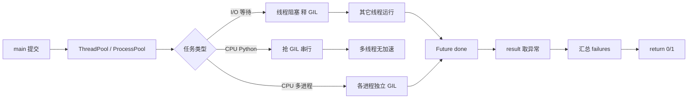
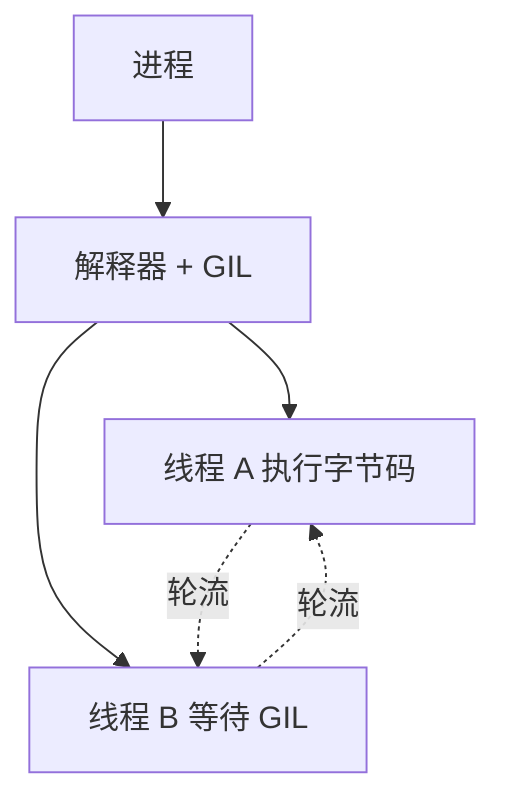
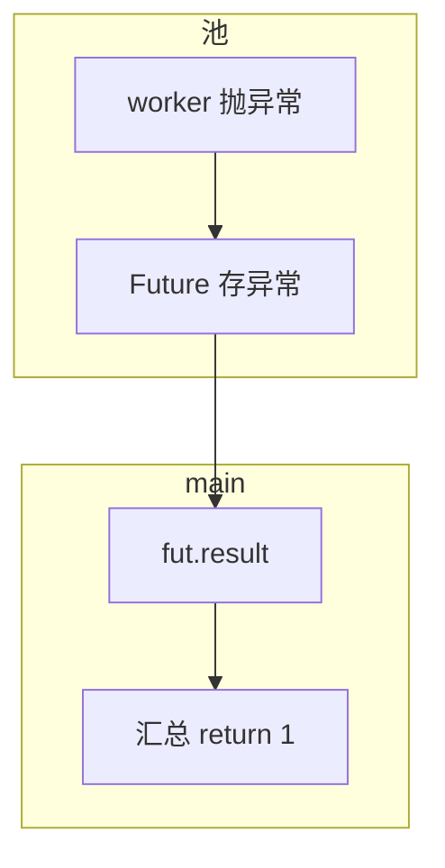

# 10｜并发与 GIL · SRE 开发能力

> 大家好，欢迎来到这次分享。开讲之前，先带大家回到一个很多值班同学都踩过的现场：
> 巡检 500 台主机用单线程 HTTP 要 25 分钟；改 `ThreadPoolExecutor(64)` 缩到 3 分钟——但对 500 个 JSON 做 SHA256 仍慢，加线程反而更慢；有人 `multiprocessing` 在 cron 里 fork 爆内存——群里已经有人在喊「再加点线程」。
> 这一章讲完，你会知道当时那几个人各自错在哪——并发不是「线程越多越好」：I/O 与 CPU 边界、GIL、进程开销要先画清楚。
> **本章回答的问题**：一个并发任务从提交、调度、执行（持锁/释锁）到汇总结果的完整链路，以及 GIL 如何影响选型。
> **本章不讲**：HTTP 重试细节 → [09 HTTP客户端与重试](../09-HTTP客户端与重试/)；subprocess 并行 → [08 subprocess执行外部命令](../08-subprocess执行外部命令/)；asyncio 深度 → 本章只给运维脚本最小集。

**怎么听这场分享**：先把「并发任务一生」主图装进脑子——提交 → 调度 → 持锁/释锁 → 汇总；放慢 GIL 与 I/O vs CPU；作战节回到开头那个更慢/OOM 现场。每一节讲完会提示对应练习题，趁热打铁。


## 面试怎么考

| 标记 | 考点 |
|------|------|
| **核心** | GIL；I/O bound vs CPU bound；`ThreadPoolExecutor` vs `ProcessPoolExecutor` |
| **必会** | 等网络/磁盘用线程或 asyncio；算哈希/压缩用多进程；线程数别盲目 100 |
| **常用** | `concurrent.futures`；`as_completed`；超时 `future.result(timeout=)` |
| **常考** | 多线程为何不能加速 CPU；GIL 何时释放；cron 里 ProcessPool 内存 |

**30 秒怎么说**：CPython 有 **GIL**，同一进程多线程不能并行跑纯 Python CPU 代码。等 HTTP/SSH/磁盘时线程有效，因为 I/O 会释放 GIL。**CPU 密集**用 `ProcessPoolExecutor` 或把计算交给 C 扩展/外部命令。运维巡检：`ThreadPoolExecutor(max_workers=8~32)` + 09 章 Session。控制并发防打爆目标。结果用 `as_completed` 汇总失败，`main` 非 0 退出。

---

## 能力边界

| 维度 | 线程池 | 进程池 | asyncio |
|------|--------|--------|---------|
| **适合** | 多 URL/主机 I/O | CPU 计算、解析大日志 | 大量 I/O、单进程 |
| **不适合** | CPU 密集 Python | 高内存、短任务海量 fork | 阻塞库未改造 |
| **风险** | 打爆对端、Session 线程安全 | 内存 × worker | 需 async 生态 |

| 机制 | 管什么 | 不管什么 |
|------|--------|----------|
| GIL | 字节码执行互斥 | 子进程（各进程独立 GIL） |
| 线程池 | 并行 I/O 等待 | 目标 API 限流 |
| 进程池 | 并行 CPU | 共享内存（需 Manager） |

> ⚠️ **别混**：**先问任务在等还是在算**——等用线程，算用进程或外包。

---

## 语言最小集

| 零件 | 示例 | 含义 |
|------|------|------|
| ThreadPoolExecutor | `with ThreadPoolExecutor(16) as ex:` | 线程池 |
| ProcessPoolExecutor | `ProcessPoolExecutor(4)` | 进程池 |
| submit | `ex.submit(fn, arg)` | 提交任务 |
| map | `ex.map(fn, items)` | 批量（顺序保留） |
| as_completed | `for f in as_completed(futs):` | 谁先完谁先处理 |
| result | `f.result(timeout=30)` | 取结果/抛异常 |
| wait | `wait(futs, timeout=60)` | 等一批 |
| threading.Lock | `with lock:` | 互斥 |
| asyncio.run | `asyncio.run(main())` | 跑协程入口 |
| gather | `await asyncio.gather(*tasks)` | 并发协程 |

```python
from concurrent.futures import ThreadPoolExecutor, as_completed

def check_host(host: str) -> tuple[str, bool]:
    ...

def run_all(hosts: list[str], workers: int = 16) -> list[str]:
    failures: list[str] = []
    with ThreadPoolExecutor(max_workers=workers) as ex:
        futs = {ex.submit(check_host, h): h for h in hosts}
        for fut in as_completed(futs):
            host, ok = fut.result()
            if not ok:
                failures.append(host)
    return failures
```

---

## 一、一张图：并发任务与 GIL 的一生

> 🎯 **一句话**：**提交任务 → 池调度 worker → 执行（I/O 释 GIL / CPU 抢 GIL）→ 完成 Future → 汇总异常 → main 退出码**。



**读图**：**F→G** 是面试高频——纯 Python 循环加线程没用。**D→E** 是巡检脚本主路径。

好，主图装进脑子了。接下来顺着主线一站一站往下走——带着问题听，比背清单有用。


本节对应练习题 Q13。

---

## 二、出生：GIL 是什么（⭐常考）

> 🎯 **一句话**：**GIL 是 CPython 解释器全局互斥锁**，同一时刻只有一个线程执行 Python 字节码。

🔥 **GIL（Global Interpreter Lock）** = CPython 里同一时刻只允许一个线程执行 Python 字节码的大锁。大白话：会议室同一时间只准一个人说话——I/O 等待时可以让出麦克风，纯算账则让再多人也插不上话。⭐ 这是面试必考。



### GIL 何时释放（⭐常考 · 🔥难点）

| 场景 | 释放 GIL? |
|------|:---------:|
| `requests` 等 I/O 阻塞 | 是 |
| `time.sleep` | 是 |
| 许多 C 扩展计算（numpy 部分 op） | 可能 |
| 纯 Python 大循环 | 否（频繁切换仍慢） |
| `socket.recv` / `select` | 是 |
| 文件 `read` / `write`（足够长） | 是 |
| `hashlib` 哈希运算 | 否（C 层持 GIL） |

**CPython 内部调度机制** 🔥：

CPython 在解释器层用 `_PyEval_EvalFrameDefault` 执行字节码，GIL 的获取/释放有两种路径：

1. **`sys.setswitchinterval`（默认 5ms）** —— 解释器每隔约 5ms 检查是否该让出 GIL，给其他线程机会。这就是纯 Python 循环虽然不释放 GIL，多线程仍能"轮流"跑的原因——但轮流 ≠ 并行，总时间不缩短。
2. **`Py_BEGIN_ALLOW_THREADS` / `Py_END_ALLOW_THREADS`** —— C 扩展在执行阻塞 I/O 系统调用前，通过这对宏显式释放 GIL，让其他 Python 线程运行。`requests`、`time.sleep`、`socket.recv` 都走这条路。

> 📝 **面试**：「GIL 防 CPython 引用计数竞态，代价是 CPU 多线程不并行；I/O 型仍值得用线程。CPython 3.13+ 有实验性 no-GIL 模式（PEP 703），但生产还未普及。」

### 与运维的关系

- **批量 HTTP/SSH 检查**：线程池 ✓
- **日志里正则扫 10GB 纯 Python**：线程池 ✗ → 进程或 `rg`/awk
- **Pandas/numpy 大矩阵**：看是否释放 GIL，不能想当然
- **`hashlib.sha256` 大文件**：持 GIL 不放 → ProcessPool
- **`zlib` / `gzip` 压缩**：C 层部分释放，但别假设并行

> 💡 **打个比方**：GIL 像单人白板——一个人写时别人等；去打印机（I/O）时白板空出来。`setswitchinterval` 就是"每 5ms 喊一声让别人也写写"，但白板仍然只有一个，总产出不变。


本节对应练习题 Q1、Q2。

---

## 三、选型：I/O bound vs CPU bound（🔥难点）

> 🎯 **一句话**：**等外部 = 线程/async；算 Python = 进程或外部工具**。

🔥 大家先别背对照表。很多人会答「并发就开线程」——⭐ 这是高频错答。先问：你的时间花在等网络，还是花在算哈希？

| 任务 | 推荐 | workers 经验 |
|------|------|--------------|
| 500 HTTP 健康检查 | ThreadPool | 8–32，看 API 限流 |
| 500 主机 SSH `uptime` | ThreadPool | 16–64 |
| 压缩/哈希百万行 | ProcessPool | CPU 核数 |
| 调 kubectl 500 次 | ThreadPool 或串行 | API Server QPS |
| 图像处理纯 Python | ProcessPool | 核数 |

```python
# 反模式：CPU 密集用线程
def cpu_job(n):
    return sum(i * i for i in range(n))

with ThreadPoolExecutor(32) as ex:
    list(ex.map(cpu_job, range(500)))  # 可能比单线程还慢
```

```python
# 正例：I/O
def io_job(url):
    return session.get(url, timeout=(3, 10)).status_code

with ThreadPoolExecutor(16) as ex:
    list(ex.map(io_job, urls))
```


本节对应练习题 Q3、Q4。

---

## 四、执行：ThreadPoolExecutor 模式（⭐常考）

> 🎯 **一句话**：**`submit` + `as_completed` 流式汇总**；`map` 简单但异常晚暴露。

### submit + as_completed（⭐常考）

```python
from concurrent.futures import ThreadPoolExecutor, as_completed

def check_one(host: str) -> tuple[str, str | None]:
    try:
        with requests.Session() as session:
            r = session.get(f"http://{host}/health", timeout=(3, 5))
            r.raise_for_status()
        return host, None
    except Exception as e:
        return host, str(e)

def main() -> int:
    failures: list[str] = []
    with ThreadPoolExecutor(max_workers=16) as ex:
        futs = [ex.submit(check_one, h) for h in hosts]
        for fut in as_completed(futs):       # ← 谁先完谁先处理
            host, err = fut.result()          # ← worker 异常在这里 re-raise
            if err:
                failures.append(f"{host}: {err}")
    if failures:
        for line in failures:
            print(line, file=sys.stderr)     # ← 失败走 stderr
        return 1                             # ← 非 0 退出，cron / 监控可感知
    return 0
```

> 📝 **面试**：「`submit` + `as_completed` 流式处理，前 10 个失败的先报告，不必等全部跑完。`map` 虽然更简洁，但异常要等迭代到对应位置才暴露。」

### 每线程 Session（⭐常考）

```python
import threading

_thread_local = threading.local()            # ← 每线程独立的存储空间

def get_session() -> requests.Session:
    if not hasattr(_thread_local, "session"):
        _thread_local.session = requests.Session()  # ← 每线程首次调用才创建
    return _thread_local.session
```

**不要**多线程共享一个 Session 而不加锁——`requests.Session` 内部 `urllib3` 连接池非完全线程安全，高并发下会出现连接串用、SSL 报错。

### 超时

```python
try:
    host, err = fut.result(timeout=60)        # ← 60s 没结果就超时
except TimeoutError:
    failures.append(f"{host}: worker timeout")  # ← worker 仍可能还在跑
```

> ⚠️ **别混**：`fut.result(timeout=60)` 超时后，worker 线程不会被杀死——它仍在后台跑。超时只让主线程不等。要真正取消用 `fut.cancel()`（仅对 pending 生效，running 无法取消）。


本节对应练习题 Q5、Q6。

---

## 五、CPU 路径：ProcessPoolExecutor（必会）

> 🎯 **一句话**：**子进程各带 GIL**，适合 CPU；**pickle 可序列化**的函数才能 submit。

```python
from concurrent.futures import ProcessPoolExecutor

def parse_chunk(lines: list[str]) -> int:
    return sum(1 for line in lines if "ERROR" in line)

def count_errors(path: str, workers: int = 4) -> int:
    with open(path) as f:
        lines = f.readlines()
    chunk_size = max(1, len(lines) // workers)
    chunks = [lines[i:i + chunk_size] for i in range(0, len(lines), chunk_size)]
    with ProcessPoolExecutor(max_workers=workers) as ex:
        return sum(ex.map(parse_chunk, chunks))      # ← 各子进程独立 GIL，真并行
```

> 💡 **打个比方**：线程池像一群人共用一个办公室（GIL），有人去打电话别人才能用桌子；进程池像给每人一间独立办公室，各干各的——但雇人（fork/spawn）开销大，办公室租金（内存）也翻倍。

### ProcessPool 的 pickle 限制 🔥

子进程收任务靠 `pickle` 序列化，能传的函数/参数有限：

| 能 pickle | 不能 pickle |
|-----------|-------------|
| 顶层 `def` 函数 | lambda |
| 顶层 `class` 实例（可序列化属性） | 闭包捕获的局部变量 |
| 基本类型、list/dict | 文件对象、数据库连接 |
| `functools.partial`（部分版本） | 带生成器的对象 |

```python
# ✗ 闭包不能传给 ProcessPool
def make_parser(pattern):
    def parse(line):
        return pattern in line          # ← pattern 是闭包变量，pickle 时丢失
    return parse

# ✓ 顶层函数 + 参数
def parse(line, pattern):
    return pattern in line

with ProcessPoolExecutor(4) as ex:
    results = ex.map(parse, lines, [r"ERROR"] * len(lines))
```

### cron 里慎用

| 风险 | 说明 |
|------|------|
| 内存复制 | 大对象 pickle 到子进程 |
| 启动开销 | 短任务进程池不划算 |
| `if __name__ == "__main__"` | Windows/macOS spawn 必须 |
| fork+线程 | fork 后子进程只有一个线程，父进程的线程不在 |

```python
if __name__ == "__main__":
    raise SystemExit(main())
```

> ⚠️ **别混**：进程池函数不能依赖不可 pickle 的闭包/lambda（视版本）。


本节对应练习题 Q7、Q8。

---

## 六、asyncio 最小集（常用）

> 🎯 **一句话**：**单线程多协程**，等 I/O 时不阻塞；要用 `httpx.AsyncClient` 等 async 库。

```python
import asyncio
import httpx

async def fetch(client: httpx.AsyncClient, url: str) -> int:
    r = await client.get(url, timeout=10.0)
    r.raise_for_status()
    return r.status_code

async def run_all(urls: list[str]) -> list[int]:
    async with httpx.AsyncClient() as client:
        tasks = [fetch(client, u) for u in urls]
        return await asyncio.gather(*tasks, return_exceptions=True)  # ← 单任务失败不拖垮全部

def main() -> int:
    results = asyncio.run(run_all(urls))   # ← 创建事件循环，跑完关闭
    errors = [r for r in results if isinstance(r, Exception)]
    return 1 if errors else 0
```

> 💡 **打个比方**：asyncio 像一个服务台接待员——一次接待 100 个客户不是靠 100 个接待员（线程），而是客户 A 填表时立刻叫客户 B，谁准备好了就接谁。`await` 就是"等这个东西好了叫我"的切换点。

### 事件循环与阻塞 🔥

事件循环（event loop）是 asyncio 的核心——它在单线程里轮询所有 `await` 的任务，谁的 I/O 就绪就恢复谁。关键陷阱：

```python
# ✗ 阻塞整个事件循环
async def bad_check(url):
    r = requests.get(url, timeout=5)   # ← requests 是同步阻塞，整个 loop 卡住
    return r.status_code

# ✓ 用 async 库
async def good_check(url):
    async with httpx.AsyncClient() as c:
        r = await c.get(url, timeout=5)  # ← await 时 loop 可以跑其他任务
        return r.status_code
```

> ⚠️ **别混**：`asyncio.run(main())` 只能在主线程调一次；已有运行中的 loop 时再调会报 `RuntimeError: asyncio.run() cannot be called from a running event loop`。

### 三种并发模型对比

| 维度 | ThreadPool | ProcessPool | asyncio |
|------|-----------|-------------|---------|
| **并行** | I/O 并行，CPU 串行（GIL） | 真 CPU 并行 | I/O 并行，CPU 串行 |
| **内存** | 共享进程内存 | 子进程独立（pickle 开销） | 单线程，内存最少 |
| **启动开销** | 低 | 高（fork/spawn） | 最低 |
| **适合** | requests/SSH 批量 | 纯 Python 计算 | 新写高并发 I/O |
| **库要求** | 同步库即可 | 需可 pickle | 需 async 库 |
| **线程安全** | 共享状态要 Lock | 天然隔离 | 单线程无竞态 |
| **运维场景** | 500 URL 巡检 | 解析 GB 级日志 | 万级 URL 爬取 |

> 📝 **面试**：「选型口诀——等网络用线程，等磁盘用线程或 asyncio，算 CPU 用进程，超过万级 I/O 上 asyncio。」

| 场景 | 线程池 | asyncio |
|------|--------|---------|
| 库全是同步（requests） | ✓ 首选 | ✗ 需改写 |
| 新写高并发 I/O | 可以 | ✓ 更轻量 |
| CPU 密集 | ✗ | ✗（不解决 CPU） |
| 代码复杂度 | 低 | 中（async/await 传染） |


本节对应练习题 Q9。

---

## 七、线程安全与限流（必会）

> 🎯 **一句话**：**共享可变状态要 Lock**；**对目标服务限并发**。

```python
from threading import Lock

counter_lock = Lock()
failed_count = 0

def record_failure():
    global failed_count
    with counter_lock:
        failed_count += 1
```

```python
# 信号量限流
from threading import Semaphore
sem = Semaphore(8)  # 最多 8 个并发 HTTP

def check(url):
    with sem:
        return session.get(url, timeout=TIMEOUT)
```

> 📝 **面试**：「并发上去先打挂 Prometheus，再谈脚本性能。」


本节对应练习题 Q10。

---

## 八、收束：异常在 Future 里



**可背清单（六件套）**：

1. I/O → ThreadPool；CPU Python → ProcessPool 或外部命令
2. GIL：CPU 多线程不加速
3. 每线程 Session 或限流 Semaphore
4. `as_completed` 流式处理 + 汇总失败
5. `fut.result()` 才会 re-raise worker 异常
6. 控制 `max_workers`，配合 09 timeout


本节对应练习题 Q11。

---

## 九、作战：更慢、OOM、API 429

**现象 · 先做 · 别做**

| 现象 | 先做 | 别做 |
|------|------|------|
| 加线程反而慢 | 是否 CPU bound | 继续加到 200 |
| cron OOM | ProcessPool + 大对象 | 一次 read 全文件再 map |
| API 429 | 降 workers + 09 退避 | 64 线程无 Session |
| 结果乱序 | 正常，as_completed | 以为 map 保序失败 |
| 死锁 | Lock 嵌套 | 在持锁时 call 慢 I/O |

> 🔥 **死锁高频场景**：线程 A 持 Lock1 等 Lock2，线程 B 持 Lock2 等 Lock1——`with lock1: with lock2:` 的嵌套加锁是头号元凶。运维脚本里更常见的是：在持锁时做 HTTP 调用，另一个线程也在等锁，整个池卡死。修法：**持锁时间尽量短，锁内不做 I/O**；必须嵌套时保证所有线程按同一顺序获取锁。

**60 秒剧本** 🔧：

| 时段 | 动作 |
|------|------|
| 0–10s | 判断 I/O vs CPU（profile 或常识） |
| 10–25s | 看 max_workers 与目标 QPS |
| 25–40s | 是否共享 Session |
| 40–60s | failures 是否 return 1 |

---

本节对应练习题 Q12、Q14。

现在再看群里那句「再加点线程」，你知道该怎么拦住他了——先分 I/O 还是 CPU，再谈池子大小与限流。下面是可复制的生产模板（代码块一字不改，直接拿走）。

## 生产模板

### 模板 1：I/O 巡检线程池

```python
def run_checks(hosts: list[str], workers: int = 16) -> list[str]:
    failures: list[str] = []
    with ThreadPoolExecutor(max_workers=workers) as ex:
        futs = {ex.submit(check_one, h): h for h in hosts}
        for fut in as_completed(futs):
            try:
                host, err = fut.result(timeout=120)
            except TimeoutError:
                host = futs[fut]
                err = "timeout"
            if err:
                failures.append(f"{host}: {err}")
    return failures
```

### 模板 2：进程池解析

```python
if __name__ == "__main__":
    total = count_errors("/var/log/app.log", workers=4)
```

### 模板 3：Semaphore + Session

```python
sem = Semaphore(10)

def bounded_get(url):
    with sem:
        return get_session().get(url, timeout=TIMEOUT)
```

### 模板 4：asyncio + httpx（可选）

```python
async def amain():
    async with httpx.AsyncClient(limits=httpx.Limits(max_connections=20)) as c:
        ...
```

---

## 踩坑清单

| 现象 | 原因 | 修法 |
|------|------|------|
| 32 线程仍慢 | CPU bound | ProcessPool / rg |
| 随机 SSL 错 | 共享 Session 竞态 | thread-local Session |
| worker 异常丢失 | 未 result() | as_completed 里 result |
| macOS 进程池空跑 | 缺 `__main__` guard | 加 guard |
| 内存爆 | 全文件进进程 | 分块/流式 |
| 打挂 API | workers 过大 | Semaphore + 降并发 |
| GIL 误解 | 以为线程万能 | 按任务类型选型 |
| ProcessPool lambda 报错 | 闭包不可 pickle | 改顶层函数 |
| asyncio 卡死 | 同步 requests 阻塞 loop | 换 httpx 或 run_in_executor |
| 超时后 worker 仍跑 | result(timeout) 不杀线程 | 接受或改进程池 |
| fork 后线程消失 | fork 只保留当前线程 | spawn 或 fork 前不启线程 |
| 超时误杀 | result(timeout) 超时以为任务完了 | 超时只是主线程不等 |

---

## 必会 · 常考

| 说法 | 对错 | 口径 |
|------|:----:|------|
| 多线程加速一切 Python | 错 | GIL 限制 CPU |
| I/O 密集适合线程 | 对 | 等待释 GIL |
| ProcessPool 绕过 GIL | 对 | 多进程 |
| 线程越多越好 | 错 | 有限流与切换开销 |
| fut.result() 会抛 worker 异常 | 对 | 必须调用 |
| asyncio 不用线程 | 对 | 单线程协程 |
| map 与 submit 等价 | 错 | 异常/顺序不同 |
| cron 大 ProcessPool 要小心 | 对 | 内存与 fork |

---

## 命令速查 🔧

### 🔧 实测：GIL 对 CPU 无加速

```python
import os, time
from concurrent.futures import ThreadPoolExecutor, ProcessPoolExecutor

def cpu_burn(n):
    return sum(i * i for i in range(n))

N = 2 * 10**7
TASKS = [N] * 8

# --- 单线程 ---
t0 = time.perf_counter()
for n in TASKS:
    cpu_burn(n)
print(f"serial:     {time.perf_counter() - t0:.2f}s")   # ← ~6.4s

# --- 线程池（GIL 限制，无加速）---
t0 = time.perf_counter()
with ThreadPoolExecutor(8) as ex:
    list(ex.map(cpu_burn, TASKS))
print(f"threadpool: {time.perf_counter() - t0:.2f}s")   # ← ~6.5s，甚至更慢

# --- 进程池（真并行）---
t0 = time.perf_counter()
with ProcessPoolExecutor() as ex:
    list(ex.map(cpu_burn, TASKS))
print(f"processpool:{time.perf_counter() - t0:.2f}s")   # ← ~1.8s，8 核加速
```

> 🎯 **一句话**：线程池跑 CPU 任务的 wall time 与单线程几乎一致（甚至更慢，因为 GIL 切换开销）；进程池才是真并行。

### 🔧 实测：I/O 并行加速

```python
import time
from concurrent.futures import ThreadPoolExecutor

def io():
    time.sleep(1)
    return 1

t0 = time.perf_counter()
with ThreadPoolExecutor(8) as ex:
    list(ex.map(io, range(8)))
print(time.perf_counter() - t0)  # ← ~1.0s 而非 8s，I/O 释放 GIL
```

```python
# 对比单线程
t0 = time.perf_counter()
for _ in range(8):
    io()
print(time.perf_counter() - t0)  # ← ~8.0s
```

### 与 09/11/12 组合速查

| 场景 | 09 | 10 | 11 | 12 |
|------|:--:|:--:|:--:|:--:|
| 500 URL 巡检 | Session+timeout | ThreadPool 16 | — | — |
| 等 Deployment | — | 单线程即可 | poll+deadline | read status |
| 全集群 list Pod | — | 慎多线程 list | — | 分页+限并发 |
| 日志 CPU 解析 | — | ProcessPool | — | — |

> 📝 **面试**：「并发是放大器——09 没 timeout、11 没 deadline 时，加线程只会更快挂。」

---

## 面试锚点

遮住右列自问自答，卡壳的行回去重读对应小节——能讲出来才算会，看着答案点头不算。

| 问 | 30 秒答 |
|----|---------|
| GIL 是什么？ | CPython 字节码全局锁 |
| 何时用线程/进程？ | I/O 线程，CPU 进程 |
| 500 URL 怎么并发？ | ThreadPool + Session + timeout |
| 为何共享 Session 危险？ | 非完全线程安全 |
| asyncio 适用？ | 大量 async I/O，新代码 |

---

## 合上书，问自己

学到这里，先别急着翻下一章。合上书，试试下面这几件事能不能做到——能做到，这章才算真的听懂了。卡住的那一条，就回到对应的小节再听一遍：

- [ ] 画出并发一生：提交 → 执行 → Future 汇总。（对应练习题 Q13）
- [ ] GIL 对 I/O 与 CPU 各意味着什么？（Q1、Q2）
- [ ] 何时用线程池？何时用进程池？（Q3、Q4）
- [ ] ThreadPoolExecutor 异常在哪暴露？（Q5、Q6、Q11）
- [ ] multiprocessing 在 cron 里注意什么？（Q7、Q8）
- [ ] 限流为什么必要？（Q10）
- [ ] 更慢/OOM/429 怎么定责？（Q12、Q14）
- [ ] asyncio 运维脚本最小适用场景？（Q9）

全部打勾之后，给自己出一个终极测试：找一位同事，十分钟讲清「开头那个加线程更慢现场，GIL 与选型怎么口述」。讲得下来，你就是下一个能拦住「再加点线程」的人。

八题能口述，并发与 GIL 就过关了。下一章用 **轮询超时与退避** 把等待策略钉死。
