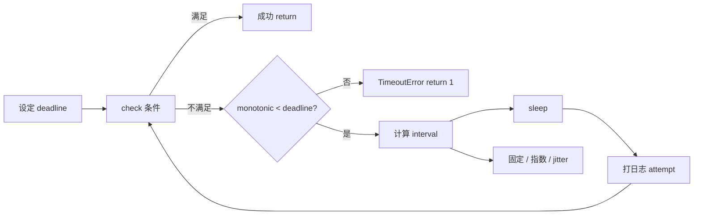
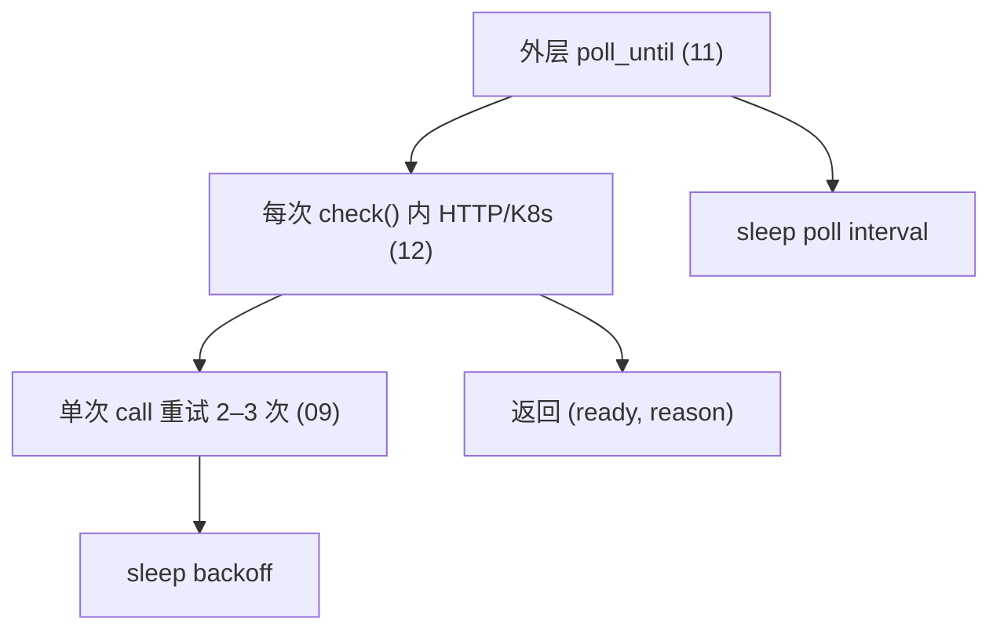
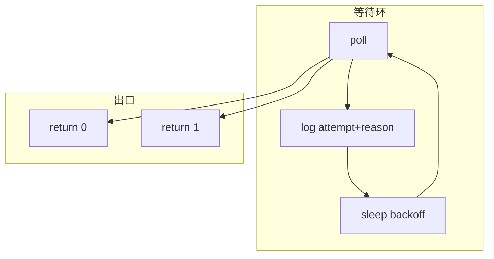

# 11｜轮询超时与退避 · SRE 开发能力

> 部署脚本 `kubectl rollout status` 等价物写成了 `while True: sleep(1)` 没总 timeout——CI 挂 6 小时；等 Pod Ready 用固定 1s 轮询，1000 Pod 把 API Server 打满；退避没有 jitter，恢复瞬间所有脚本同步打 API——**等待不是 sleep 循环：要有 deadline、间隔策略、成功/失败条件与可观测日志**。
> **本章回答**：一次「等到某条件成立」从设定 timeout、轮询间隔、退避增长到放弃或成功的完整链路。
> **本章不讲**：单次 HTTP 重试 → [09 HTTP客户端与重试](../09-HTTP客户端与重试/)；K8s SDK 细节 → [12 K8s与云SDK调用](../12-K8s与云SDK调用/)。

## 面试怎么考

| 标记 | 考点 |
|------|------|
| **核心** | 总 deadline；poll interval；指数退避 + jitter；明确 success/fail 条件 |
| **必会** | 不用 `while True` 无上限；区分「等 Ready」与「HTTP 重试」两层 |
| **常用** | `time.monotonic()` 计时；`tenacity`；线性/指数间隔 |
| **常考** | 固定 1s 轮询 API 风暴；timeout 到了返回什么码；Partial Ready |

**30 秒怎么说**：轮询要有 **deadline**（`monotonic + budget`），循环内检查 success 条件。间隔：**固定**用于短等待（小于 2 分钟）；**指数退避+cap+jitter** 用于长等待或等外部恢复。timeout 到 → 清晰失败 `return 1` + 最后状态日志。与 09 层分工：09 管单次 HTTP 瞬态；11 管「条件何时为真」。打日志含 elapsed、attempt、last_reason。

---

## 能力边界

| 维度 | 手写 poll 循环 | tenacity | watch/stream |
|------|----------------|----------|--------------|
| **适合** | 运维脚本、CI 门禁 | 统一重试/等待 | K8s watch 长连接 |
| **不适合** | 复杂状态机无测试 | 要读文档调参 | 短 CI 无 watch 权限 |
| **契约** | deadline + 退出码 | 装饰器/配置 | 连接断要重连 |

| 机制 | 管什么 | 不管什么 |
|------|--------|----------|
| deadline | 最长等待 | 业务是否「值得等」 |
| backoff | API/人眼压力 | 单次 TCP 重连（09） |
| jitter | 同步峰值 | 逻辑正确性 |

> ⚠️ **记住**：**`while True` without deadline = 无限 CI**。

---

## 语言最小集

| 零件 | 示例 | 含义 |
|------|------|------|
| monotonic | `time.monotonic()` | 不受系统调钟影响 |
| deadline | `deadline = monotonic() + 600` | 绝对结束点 |
| sleep | `time.sleep(interval)` | 间隔 |
| 指数退避 | `min(cap, base * 2**n)` | 越来越慢 |
| jitter | `* random.uniform(0.8, 1.2)` | 打散 |
| tenacity | `@retry(stop=..., wait=...)` | 库封装 |
| wait_for | `wait_for(fn, timeout=60)` | 线程内超时 |
| Event | `event.wait(timeout=5)` | 线程同步 |

```python
import random
import time

def poll_until(deadline: float, interval_fn, check) -> None:
    attempt = 0
    while time.monotonic() < deadline:
        attempt += 1
        ok, reason = check()
        if ok:
            return
        log.info("poll attempt=%s reason=%s elapsed=%.1fs",
                 attempt, reason, time.monotonic() - (deadline - budget))
        time.sleep(interval_fn(attempt))
    raise TimeoutError("deadline exceeded")
```

---

## 一、一张图：轮询等待从 timeout 到退避的一生

> 🎯 **一句话**：**设 budget → 检查条件 → 未满足则 sleep(间隔) → 间隔可固定/指数 → 超 deadline 失败退出 → 成功 return**。



**读图**：**E** 必须带最后 `reason`（如 `ready=2/3`）。**I** 长等待用指数，短门禁可用固定 2–5s。

---

## 二、出生：为什么要 deadline（⭐常考）

> 🎯 **一句话**：**可预期的最长等待**——CI、人、下游系统都需要。

```python
import time

BUDGET_SEC = 600

def wait_rollout(name: str, budget: float = BUDGET_SEC) -> None:
    deadline = time.monotonic() + budget
    start = time.monotonic()
    while time.monotonic() < deadline:
        ready, total, msg = get_rollout_status(name)
        if ready == total and total > 0:
            log.info("rollout ok in %.1fs", time.monotonic() - start)
            return
        log.info("rollout %s/%s: %s", ready, total, msg)
        time.sleep(5)
    raise TimeoutError(f"rollout {name} not ready after {budget}s: {msg}")
```

### 用 monotonic 不用 time.time（必会）

| 函数 | 用途 |
|------|------|
| `time.monotonic()` | 计时、deadline（NTP 跳变不影响） |
| `time.time()` | 墙钟、日志时间戳 |

> 📝 **面试**：「deadline 用 monotonic；日志展示用 datetime.now()。」

---

## 三、间隔：固定 vs 退避（🔥必会）

> 🎯 **一句话**：**短等固定；长等或等外部恢复用指数退避 + cap + jitter**。

### 固定间隔

| 场景 | 间隔 |
|------|------|
| CI 等部署 小于 5 分钟 | 3–10s |
| 健康检查门禁 | 2–5s |
| 人盯着终端 | 5s + 进度 |

```python
POLL_INTERVAL = 5.0
time.sleep(POLL_INTERVAL)
```

### 指数退避

```python
def backoff_interval(attempt: int, base: float = 1.0, cap: float = 60.0) -> float:
    raw = min(cap, base * (2 ** (attempt - 1)))
    return raw * random.uniform(0.8, 1.2)
```

| attempt | 约间隔（base=1, cap=60） |
|---------|--------------------------|
| 1 | ~1s |
| 2 | ~2s |
| 3 | ~4s |
| ... | ... |
| 10+ | ~60s cap |

> 💡 **打个比方**：固定间隔像每 1 秒敲一次门；退避像先轻敲，越等越久，避免吵到邻居（API Server）。

### thundering herd（🔥难点）

大集群恢复时，所有 CronJob 同时 poll → apiserver 瞬间 429 → 全部退避 → 又同时恢复 → 循环。

```python
# 反例：1000 个脚本同时启动
time.sleep(5)  # 无 jitter，恢复瞬间全打 apiserver

# 正例：jitter 打散
time.sleep(5 * random.uniform(0.5, 1.5))  # 2.5s–7.5s 随机
```

| 手段 | 效果 |
|------|------|
| jitter ±20% | 峰值打散 40% |
| 随机启动延迟 | CronJob 恢复错峰 |
| 指数 cap 60s | 长等待收敛到 1 QPS |
| label_selector | 减单次 list 体量（与 12 章联动） |

> ⚠️ **别混**：jitter 不是「随机不 poll」；是「随机偏移 interval」，保证长期平均频率不变。

---

## 四、条件：什么叫「成功」（🔥难点）

> 🎯 **一句话**：**success 条件写清楚**，避免 Partial Ready 假绿。

```python
def deployment_ready(v1, name: str, namespace: str) -> tuple[bool, str]:
    dep = v1.read_namespaced_deployment_status(name, namespace)
    spec = dep.spec.replicas or 0
    ready = dep.status.ready_replicas or 0
    if spec == 0:
        return False, "replicas=0"
    if ready < spec:
        return False, f"ready={ready}/{spec}"
    # 可选：Generation 对齐
    if dep.metadata.generation != dep.status.observed_generation:
        return False, "generation mismatch"
    return True, "ok"
```

| 反模式 | 后果 |
|--------|------|
| 只查 Pod Running | CrashLoop 仍 Running |
| 不看 replicas 比例 | 1/3 Ready 当成功 |
| 忽略 Job failed | 部署「完成」但业务错 |

### 快 fail：不等 budget 到（⭐常考）

```python
def job_finished(batch_v1, name: str, ns: str) -> tuple[bool, str]:
    job = batch_v1.read_namespaced_job_status(name, namespace=ns)
    if job.status.failed and job.status.failed > 0:
        return False, f"job failed={job.status.failed}"  # ← 快 fail
    if job.status.succeeded:
        return True, "ok"
    return False, f"active={job.status.active or 0}"
```

> 📝 **面试**：「Job `status.failed > 0` 要立刻退出，不要傻等 budget 到——失败信息越早暴露越好。」

---

## 五、与 HTTP 重试分层（⭐常考）

> 🎯 **一句话**：**09 = 单次请求内；11 = 外层直到条件为真**。



```python
def check_once(session) -> tuple[bool, str]:
    try:
        resp = request_with_retry(session, "GET", status_url)  # 09
        data = resp.json()
    except requests.RequestException as e:
        return False, f"api: {e}"
    if data.get("phase") != "Succeeded":
        return False, f"phase={data.get('phase')}"
    return True, "ok"

def wait_job(session, budget=900):
    deadline = time.monotonic() + budget
    attempt = 0
    while time.monotonic() < deadline:
        attempt += 1
        ok, reason = check_once(session)
        if ok:
            return
        log.info("wait job attempt=%s %s", attempt, reason)
        time.sleep(backoff_interval(attempt))
    raise TimeoutError(reason)
```

> ⚠️ **别混**：内层重试 5 次 × 外层 100 轮 = 风暴；外层退避时内层 retry 要保守。

---

## 六、tenacity 与手写（⭐常用）

> 🎯 **一句话**：**库适合统一策略**；**手写适合复杂 check 返回值**。

```python
from tenacity import retry, stop_after_delay, wait_exponential_jitter, retry_if_exception_type

@retry(
    stop=stop_after_delay(600),
    wait=wait_exponential_jitter(initial=1, max=60),
    retry=retry_if_exception_type(NotReadyError),
    reraise=True,
)
def wait_until_ready():
    ok, reason = check()
    if not ok:
        raise NotReadyError(reason)
```

手写等价更清晰用于 oncall 读代码：

```python
class NotReadyError(Exception):
    pass
```

> 📝 **面试**：「tenacity 的 stop_after_delay 就是 deadline 的一种。」

---

## 七、超时到了怎么办（🔥必会）

> 🎯 **一句话**：**抛 TimeoutError 或返回 False → main return 1**；日志带 **最后状态**。

```python
def main() -> int:
    try:
        wait_rollout("api", budget=600)
    except TimeoutError as e:
        log.error("timeout: %s", e)
        return 1
    return 0
```

| 信息 | 必须打 |
|------|--------|
| budget | 600s |
| elapsed | 实际等多久 |
| last_reason | ready=2/3 |
| attempt | 最后一轮次数 |

```python
log.error(
    "deadline exceeded budget=%ss elapsed=%.1fs last=%s attempts=%s",
    budget, elapsed, last_reason, attempt,
)
```

---

## 八、收束：可观测的等待（🔧实操）



**可背清单（六件套）**：

- `deadline = monotonic() + budget`
- success 条件可编码、可日志
- 短固定、长指数 + cap + jitter
- 与 09 分层，避免重试相乘
- timeout 带 last_reason
- `main` 失败非 0

---

## 九、作战：CI 挂死、API 风暴、假 Ready

**现象 · 先做 · 别做**

| 现象 | 先做 | 别做 |
|------|------|------|
| CI 6 小时 | 查 while True 无 deadline | 杀 Jenkins 了事 |
| apiserver 429 | 加大 poll interval | 1s × 1000 脚本 |
| 部署「成功」服务错 | 查 ready 条件 | 只看 Running |
| 恢复瞬间全红 | 无 jitter 同步 poll | 同时 cron |
| 早退 | budget 过小 | 不设日志 |

**60 秒剧本** 🔧：

| 时段 | 动作 |
|------|------|
| 0–10s | grep `while True` / `sleep` / `monotonic` |
| 10–25s | 最后一次日志 last_reason |
| 25–40s | poll 间隔与 API QPS |
| 40–60s | success 条件代码 review |

---

## 生产模板 🔧

### 模板 1：固定间隔短等待

```python
def wait_for(predicate, budget: float = 300, interval: float = 5) -> None:
    deadline = time.monotonic() + budget
    last = "never checked"
    while time.monotonic() < deadline:
        if predicate():
            return
        last = "predicate false"
        time.sleep(interval)
    raise TimeoutError(last)
```

### 模板 2：指数退避 + 结构化 reason

```python
def poll_until_ok(check, budget: float = 900) -> None:
    deadline = time.monotonic() + budget
    attempt = 0
    last_reason = "init"
    while time.monotonic() < deadline:
        attempt += 1
        ok, last_reason = check()
        if ok:
            return
        log.info("poll #%s %s", attempt, last_reason)
        time.sleep(backoff_interval(attempt))
    raise TimeoutError(last_reason)
```

### 模板 3：CLI 可配 budget

```python
parser.add_argument("--wait-timeout", type=int, default=600,
                    help="max seconds to wait for ready")
```

### 模板 4：进度条式日志

```python
if attempt % 10 == 0:
    log.info("still waiting elapsed=%.0fs last=%s", time.monotonic() - start, reason)
```

---

## 踩坑清单 🔥

| 现象 | 原因 | 修法 |
|------|------|------|
| CI 永不结束 | 无 deadline | monotonic budget |
| API 打满 | 1s 固定 poll | 退避 + cap |
| 假绿 | Ready 定义错 | replicas/generation |
| 时钟跳变 | 用 time.time 计时 | monotonic |
| 双层重试风暴 | 09×11 相乘 | 内层少 retry |
| 静默失败 | 无 last_reason | timeout 日志 |
| sleep 0 | tight loop | 最小 interval |
| 忽略 Ctrl+C | 长 sleep | 短 interval 或 signal |

---

## 易错一句话对照 🔥

| 说法 | 一句话纠正 |
|------|------------|
| 「轮询就是 sleep」 | sleep 只是间隔；deadline + 条件 + 退避才是完整等待 |
| 「timeout 越大越保险」 | 大 timeout 遮盖故障；Job 失败该看 `status.failed` 快 fail |
| 「jitter 随机不重要」 | 1000 脚本同时恢复，jitter 决定 apiserver 是否 429 |
| 「monotonic 和 time.time 一样」 | `time.time` 受 NTP 影响；deadline 必须用 monotonic |
| 「tenacity 万能」 | 复杂 check 返回值（ready=2/3）手写更可读 |
| 「固定 1s 最简单最好」 | 大集群 1000 Pod × 1s = apiserver 风暴 |

> 🔍 **排查信号**：CI 日志只有 `attempt=N` 没有 `elapsed`——说明没记录总耗时；apiserver 429 且所有脚本同一秒 poll——说明无 jitter。

---

## 必会 · 常考 ⭐

| 说法 | 对错 | 口径 |
|------|:----:|------|
| while True 可接受 | 错 | 要有 deadline |
| 轮询与 HTTP 重试同一层 | 错 | 09 内 11 外 |
| monotonic 用于 deadline | 对 | 防 NTP 跳 |
| 固定 1s 永远最佳 | 错 | 长等用退避 |
| timeout 要打最后状态 | 对 | last_reason |
| jitter 防 herd | 对 | 恢复峰值 |
| Partial Ready 可过 | 错 | ready==spec |
| tenacity 可替代手写 | 视情况 | 复杂 check 手写 |

---

## 命令速查 🔧

```bash
# 对比：kubectl 自带 timeout
kubectl rollout status deploy/api --timeout=600s

# 脚本里等价要有 --wait-timeout
python deploy_wait.py --wait-timeout 600; echo $?
```

```python
# 快速验证 monotonic
import time
d = time.monotonic() + 5
while time.monotonic() < d:
    time.sleep(0.5)
```

### 常见等待对象与 success 条件

| 对象 | 检查什么 | 典型 budget |
|------|----------|-------------|
| Deployment | ready_replicas == spec.replicas | 600s |
| StatefulSet | 同上 + ordered ready | 900s |
| Job | succeeded==1, failed 无 | 1800s |
| Pod | Ready condition True | 300s |
| HTTP Job API | phase==Succeeded | 900s |
| Argo Rollout | Healthy / phase | 600s |

```python
def job_succeeded(batch_v1, name: str, ns: str) -> tuple[bool, str]:
    job = batch_v1.read_namespaced_job_status(name, namespace=ns)
    if job.status.failed:
        return False, f"failed={job.status.failed}"
    if job.status.succeeded:
        return True, "ok"
    active = job.status.active or 0
    return False, f"active={active}"
```

> 📝 **面试**：「Job 失败要快 fail，不要 poll 到 budget 结束——读 `status.failed` 立刻 return 1。」

### signal 与长 sleep（了解）

长 `sleep(60)` 会让 Ctrl+C 响应慢。运维脚本可保持 **poll interval ≤10s**，或捕获 `KeyboardInterrupt` 在 main 边界 `return 130`：

```python
def main() -> int:
    try:
        wait_rollout("api", budget=600)
    except KeyboardInterrupt:
        log.warning("interrupted")
        return 130
    except TimeoutError as e:
        log.error("%s", e)
        return 1
    return 0
```

> 💡 **打个比方**：deadline 是「最晚交卷时间」；poll 是「每隔几分钟看一次进度条」——两者缺一不可。

---

## 面试锚点 ⭐

| 问 | 30 秒答 |
|----|---------|
| 轮询三要素？ | deadline、interval、success 条件 |
| 为何 monotonic？ | 计时不被调钟影响 |
| 何时指数退避？ | 长等待、等恢复、减 API 压力 |
| 与 09 区别？ | 单次 vs 直到条件真 |
| timeout 日志打什么？ | elapsed、last_reason、attempts |

---

## 合上书，问自己

- [ ] 画「轮询一生」主图，标 deadline 出口。
- [ ] 固定 vs 指数间隔各何时用？
- [ ] deployment「真 Ready」查哪几个字段？
- [ ] 09 与 11 如何分层避免风暴？
- [ ] `monotonic` vs `time.time`？
- [ ] timeout 时日志最少几条信息？
- [ ] tenacity 的 stop_after_delay 对应什么？
- [ ] Partial Ready 举例与修法？

八题能口述，轮询超时与退避就过关了。下一章 [12 K8s 与云 SDK](../12-K8s与云SDK调用/)。
