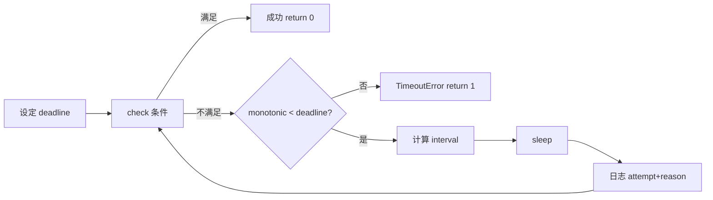
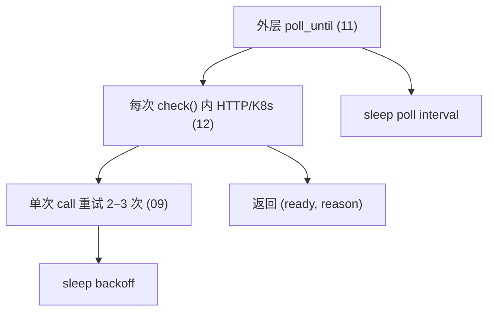
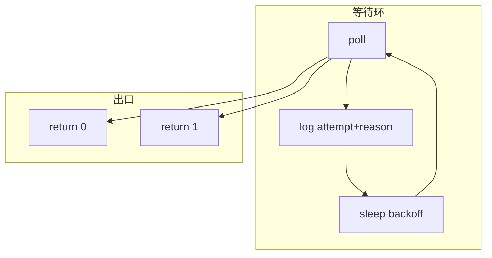
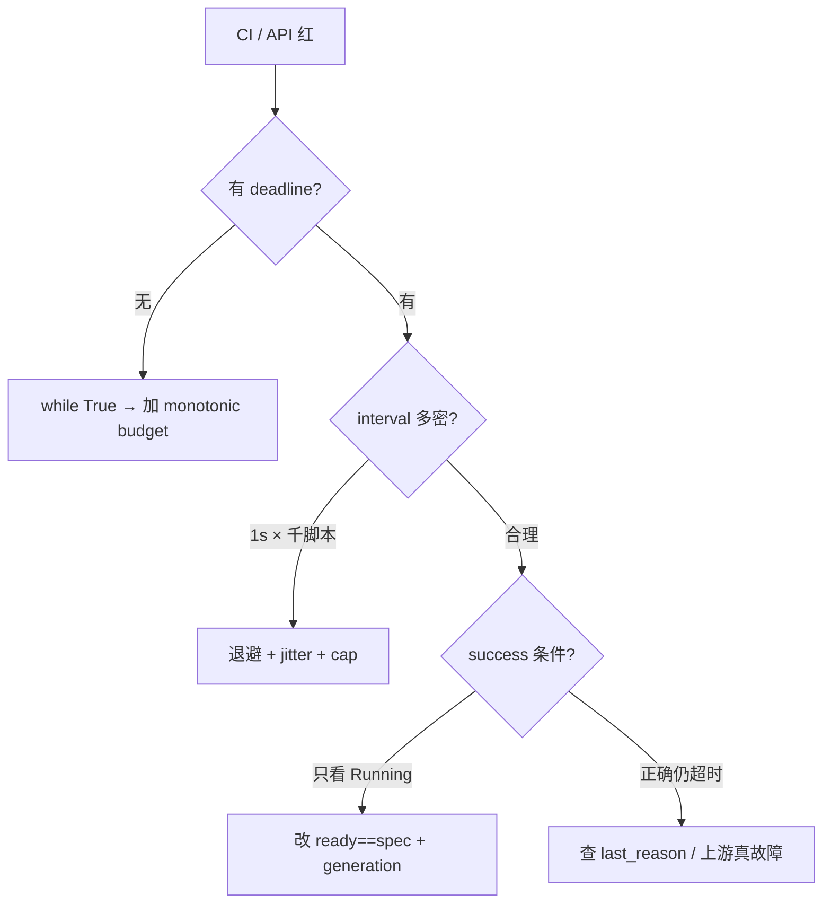

# 11｜轮询超时与退避

> 部署脚本把 `kubectl rollout status` 写成 `while True: sleep(1)`——CI 挂 6 小时；1000 个脚本固定 1s 等 Ready，恢复瞬间把 API Server 打满；退避没 jitter，闹钟对齐再同步撞门。
> **本章回答**：一次「等到某条件成立」从设定 deadline、选间隔、写成功条件到超时退出与可观测日志的完整链路。
> **不讲**：单次 HTTP 重试 → [09](../09-HTTP客户端与重试/)；K8s SDK 细节 → [12](../12-K8s与云SDK调用/)。

**标记**：🎯重点 · 🔥难点 · ⭐常考 · 🔧实操

---

## 面试怎么考

| 标记 | 考点 |
|------|------|
| **核心** | 总 deadline；poll interval；指数退避 + jitter；明确 success/fail 条件 |
| **必会** | 不用无上限 `while True`；区分「等 Ready」与「HTTP 重试」两层 |
| **常用** | `time.monotonic()`；`tenacity`；线性 / 指数间隔 |
| **常考** | 固定 1s 轮询风暴；timeout 返回什么码；Partial Ready |

> 📝 **面试（30 秒）**：轮询要有 **deadline**（`monotonic + budget`），循环内查 success。短等（&lt;2 分钟）可用固定间隔；长等或等外部恢复用 **指数退避 + cap + jitter**。超时 → `return 1` + 打 `elapsed` / `attempt` / `last_reason`。09 管单次 HTTP 瞬态，11 管「条件何时为真」——两层都 aggressive 会风暴。

---

## 能力边界

| 维度 | 手写 poll 循环 | tenacity | watch/stream |
|------|----------------|----------|--------------|
| **适合** | 运维脚本、CI 门禁 | 统一重试/等待策略 | K8s watch 长连接 |
| **不适合** | 复杂状态机无测试 | 要读文档调参 | 短 CI 无 watch 权限 |
| **契约** | deadline + 退出码 | 装饰器 / 配置 | 连接断要重连 |

- 🔑 **三个零件各管一段**
  - **deadline**：最长等多久——**不**管「值不值得等」
  - **backoff**：对人眼 / API 的压力——**不**管单次 TCP 重连（那是 09）
  - **jitter**：打散同步峰值——**不**管逻辑对不对

> 🎯 **一句话**：**`while True` 没有 deadline = 无限 CI**。

---

## 语言最小集

写/读等待脚本，认这些即可：

| 零件 | 示例 | 含义 |
|------|------|------|
| monotonic | `time.monotonic()` | 不受 NTP 调钟影响 |
| deadline | `deadline = monotonic() + 600` | 绝对结束点 |
| sleep | `time.sleep(interval)` | 间隔 |
| 指数退避 | `min(cap, base * 2**n)` | 越来越慢 |
| jitter | `* random.uniform(0.8, 1.2)` | 打散峰值 |
| tenacity | `@retry(stop=..., wait=...)` | 库封装 |
| wait_for | `wait_for(fn, timeout=60)` | 线程内超时 |
| Event | `event.wait(timeout=5)` | 线程同步 |

```python
#!/usr/bin/env python3
import random
import time

def poll_until(deadline: float, interval_fn, check, start: float) -> None:
    attempt = 0
    while time.monotonic() < deadline:
        attempt += 1
        ok, reason = check()
        if ok:
            return
        log.info(
            "poll attempt=%s reason=%s elapsed=%.1fs",
            attempt, reason, time.monotonic() - start,
        )
        time.sleep(interval_fn(attempt))
    raise TimeoutError("deadline exceeded")
```

- 🧩 **四行钉子**
  - `deadline = monotonic() + budget` → 可预期上限
  - `check() -> (ok, reason)` → 成功条件可编码、可日志
  - `interval_fn(attempt)` → 固定或指数 + jitter
  - 超时带 `last_reason` → 值班能立刻定责

零件认完，上主图。

---

## 一、一张图：轮询等待的一生 ⭐

> 🎯 **一句话**：**设 budget → check → 未满足则 sleep → 间隔可固定/指数 → 超 deadline 失败 → 成功 return**。



- 📖 **读图**
  - 🛤️ 主线：deadline → check → sleep → 再 check；卡在哪一站就查哪一站
  - 🚨 **E 必须带最后 reason**（如 `ready=2/3`）——只 raise 不打状态，值班没法排障
  - ⏱️ 短门禁可用固定 2–5s；长等待走指数 + cap + jitter（三节）

本节对应练习题 Q13。带着问题往下走——为什么必须有 deadline？

---

## 二、出生：为什么要 deadline ⭐

> 🎯 **一句话**：可预期的最长等待——CI、人、下游系统都需要上限。

```python
import time

BUDGET_SEC = 600

def wait_rollout(name: str, budget: float = BUDGET_SEC) -> None:
    deadline = time.monotonic() + budget
    start = time.monotonic()
    last_msg = "never checked"
    while time.monotonic() < deadline:
        ready, total, msg = get_rollout_status(name)
        last_msg = msg
        if ready == total and total > 0:
            log.info("rollout ok in %.1fs", time.monotonic() - start)
            return
        log.info("rollout %s/%s: %s", ready, total, msg)
        time.sleep(5)
    raise TimeoutError(f"rollout {name} not ready after {budget}s: {last_msg}")
```

### 🕰️ monotonic vs 墙钟

| 函数 | 用途 |
|------|------|
| `time.monotonic()` | 计时、deadline（NTP 跳变不影响） |
| `time.time()` | 墙钟、日志时间戳给人看 |

#### ❓ 为什么 deadline 必须用 monotonic？

- 🕰️ **`time.time()` 会跳**：NTP 校准、夏令时、手工改钟——budget「还剩 300s」可能瞬间变成负数或多出一小时
- ✅ **`monotonic()` 只往前走**：适合「还剩多久」这种相对计时
- 📝 **日志展示**仍可用 `datetime.now()`——给人看的时间戳与 deadline 计时是两件事

> 📝 **面试**：「deadline 用 monotonic；日志展示用 datetime.now()。」⭐

本节对应练习题 Q1、Q2、Q10。deadline 钉死了，下一站：间隔怎么选。

---

## 三、间隔：固定 vs 退避 🔥

> 🎯 **一句话**：**短等固定；长等或等外部恢复用指数退避 + cap + jitter**。

- 🎭 **小剧场**：1000 个脚本都 `sleep(1)` 等 Ready，集群恢复瞬间会怎样？答「多等一会儿没事」——错。固定 1s = 同步打 API。

### 📏 固定间隔

- CI 等部署 &lt;5 分钟 → 3–10s
- 健康检查门禁 → 2–5s
- 人盯着终端 → 5s + 进度日志

```python
POLL_INTERVAL = 5.0
time.sleep(POLL_INTERVAL)
```

### 📈 指数退避

```python
def backoff_interval(attempt: int, base: float = 1.0, cap: float = 60.0) -> float:
    raw = min(cap, base * (2 ** (attempt - 1)))
    return raw * random.uniform(0.8, 1.2)
```

| attempt | 约间隔（base=1, cap=60） |
|---------|--------------------------|
| 1 | ~1s |
| 2 | ~2s |
| 3 | ~4s |
| 10+ | ~60s（cap） |

> 💡 **打个比方**：固定间隔像每 1 秒敲一次门；退避像先轻敲、越等越久——避免吵到邻居（API Server）。

### 🦌 thundering herd（惊群）🔥

大集群恢复时：所有 CronJob 同时 poll → apiserver 429 → 全部退避 → 又同时醒来 → 再撞。

```python
# 反例：无 jitter，恢复瞬间全打 apiserver
time.sleep(5)

# 正例：jitter 打散到 2.5s–7.5s
time.sleep(5 * random.uniform(0.5, 1.5))
```

- 🔑 **打散手段**
  - jitter ±20% → 峰值打散约 40%
  - 随机启动延迟 → CronJob 恢复错峰
  - 指数 cap 60s → 长等待收敛到约 1 QPS
  - `label_selector` → 减单次 list 体量（与 12 章联动）

#### ❓ 为什么「每个人自己退避」还会一起打满？

- 🦌 **惊群** = 一群脚本**同一时刻**醒来，同步撞门——像下课铃响全班冲食堂
- ⏰ 每人「等一会儿」但闹钟对齐了，还是挤爆
- ✅ **jitter** 不是「随机不 poll」，是「随机偏移 interval」，长期平均频率不变

> ⚠️ **别混**：jitter ≠ 随机跳过检查；是偏移 sleep 长度。无 jitter 的固定 sleep 在恢复瞬间最危险。

本节对应练习题 Q3、Q6。记住口诀：**短等固定，长等退避+jitter**。下一站钉死「什么叫成功」。

---

## 四、条件：什么叫「成功」🔥

> 🎯 **一句话**：**success 条件写清楚**，避免 Partial Ready 假绿。

⭐ 面试必考。答「Pod Running 就算成功」——高频错答。成功 = **replicas 对齐 + Ready +（可选）generation**。

```python
def deployment_ready(v1, name: str, namespace: str) -> tuple[bool, str]:
    dep = v1.read_namespaced_deployment_status(name, namespace)
    spec = dep.spec.replicas or 0
    ready = dep.status.ready_replicas or 0
    if spec == 0:
        return False, "replicas=0"
    if ready < spec:
        return False, f"ready={ready}/{spec}"
    if dep.metadata.generation != dep.status.observed_generation:
        return False, "generation mismatch"
    return True, "ok"
```

- ❌ **反模式**
  - 只查 Pod Running → CrashLoop 仍可能 Running
  - 不看 replicas 比例 → 1/3 Ready 当成功
  - 忽略 Job failed → 部署「完成」但业务错

### ⚡ 快 fail：不等 budget 到 ⭐

```python
def job_finished(batch_v1, name: str, ns: str) -> tuple[bool, str]:
    job = batch_v1.read_namespaced_job_status(name, namespace=ns)
    if job.status.failed and job.status.failed > 0:
        return False, f"job failed={job.status.failed}"  # ← 快 fail
    if job.status.succeeded:
        return True, "ok"
    return False, f"active={job.status.active or 0}"
```

#### ❓ 为什么 Job `failed > 0` 要立刻退出？

- ⏱️ 再等 budget 也不会变好——失败信息**越早暴露越好**
- 🟢 假绿更糟：傻等到超时才 `TimeoutError`，CI 日志看不出是 Job 挂了还是还在跑
- ✅ check 返回「明确失败」应让外层 `return 1`，别和「尚未 Ready」混成同一种 continue

> 📝 **面试**：「Job `status.failed > 0` 立刻退出，不要傻等 budget。」⭐

本节对应练习题 Q4、Q8。下一站：跟 09 HTTP 重试怎么分层。

---

## 五、与 HTTP 重试分层 ⭐

> 🎯 **一句话**：**09 = 单次请求内；11 = 外层直到条件为真**。



- 📖 **读图**
  - 🚪 外环是 11：条件何时为真；内环是 09：这一次 HTTP/API 瞬态失败
  - ⚠️ **内层 5 次 × 外层 100 轮 = 风暴**——外层退避时，内层 retry 要保守

```python
def check_once(session) -> tuple[bool, str]:
    try:
        resp = request_with_retry(session, "GET", status_url)  # 09
        data = resp.json()
    except requests.RequestException as e:
        return False, f"api: {e}"
    if data.get("phase") != "Succeeded":
        return False, f"phase={data.get('phase')}"
    return True, "ok"

def wait_job(session, budget=900):
    deadline = time.monotonic() + budget
    attempt = 0
    last_reason = "init"
    while time.monotonic() < deadline:
        attempt += 1
        ok, last_reason = check_once(session)
        if ok:
            return
        log.info("wait job attempt=%s %s", attempt, last_reason)
        time.sleep(backoff_interval(attempt))
    raise TimeoutError(last_reason)
```

#### ❓ 为什么不能把「等 Ready」写成一串 HTTP 重试？

- 📡 **09 重试**：瞬态（超时、502、连接闪断）——期望**很快**成功或放弃
- ⏳ **11 轮询**：业务条件（副本齐、Job 成功）——可能要等**几分钟到十几分钟**
- 🧮 把长等待塞进 09：要么 timeout 太大遮盖故障，要么重试次数爆炸打满下游

> ⚠️ **别混**：内层 aggressive + 外层 aggressive = 相乘风暴；外层用退避时，内层 2–3 次够用。

本节对应练习题 Q5。下一站：tenacity 还是手写。

---

## 六、tenacity 与手写 ⭐

> 🎯 **一句话**：**库适合统一策略**；**手写适合复杂 check 返回值**。

```python
from tenacity import (
    retry, stop_after_delay, wait_exponential_jitter, retry_if_exception_type,
)

@retry(
    stop=stop_after_delay(600),
    wait=wait_exponential_jitter(initial=1, max=60),
    retry=retry_if_exception_type(NotReadyError),
    reraise=True,
)
def wait_until_ready():
    ok, reason = check()
    if not ok:
        raise NotReadyError(reason)
```

- 🧰 **怎么选**
  - 全仓统一「等 10 分钟、指数退避」→ tenacity 省样板代码
  - check 要返回 `ready=2/3` 给日志 / oncall 读代码 → **手写循环更清晰**
  - `stop_after_delay(600)` ≈ 手写的 `deadline = monotonic() + 600`

> 📝 **面试**：「tenacity 的 `stop_after_delay` 就是 deadline 的一种。」

本节对应练习题 Q9。下一站：超时到了怎么退出。

---

## 七、超时到了怎么办 🔥

> 🎯 **一句话**：**抛 TimeoutError 或返回 False → `main` return 1**；日志带**最后状态**。

```python
def main() -> int:
    try:
        wait_rollout("api", budget=600)
    except TimeoutError as e:
        log.error("timeout: %s", e)
        return 1
    return 0
```

- 📋 **timeout 日志最少四件套**
  - `budget`：600s
  - `elapsed`：实际等多久
  - `last_reason`：`ready=2/3`
  - `attempt`：最后一轮次数

```python
log.error(
    "deadline exceeded budget=%ss elapsed=%.1fs last=%s attempts=%s",
    budget, elapsed, last_reason, attempt,
)
```

> 🔍 **现场**：CI 日志只有 `attempt=N` 没有 `elapsed` / `last_reason`——说明超时出口没写完，回去补四件套。

本节对应练习题 Q7。下一站把可观测收成清单。

---

## 八、收束：等待凭什么可观测 🔧

> 🎯 **一句话**：值班只认**退出码 + 最后状态**；轮次日志是辅助，不是契约。



- 📖 **读图**
  - 🔁 环里三步：poll → 打日志 → sleep；成功走 OK，超 deadline 走 TO
  - 📟 调度器只认出口码；`last_reason` 是给人定责的

**可背清单（六件套）**：

1. `deadline = monotonic() + budget`
2. success 条件可编码、可日志
3. 短固定、长指数 + cap + jitter
4. 与 09 分层，避免重试相乘
5. timeout 带 `last_reason`
6. `main` 失败非 0

本节对应练习题 Q7、Q11。下一节回开头现场定责。

---

## 九、作战：CI 挂死、API 风暴、假 Ready 🔥🔧

> 🎯 **一句话**：先查有没有 deadline，再看 interval 与 success 条件。



- 📖 **读图**：从「有没有上限」分叉——无 deadline 先补；有上限再查风暴与假绿。

| 现象 | 先做 | 别做 |
|------|------|------|
| CI 6 小时 | 查 `while True` 无 deadline | 杀 Jenkins 了事 |
| apiserver 429 | 加大 interval + jitter | 1s × 1000 脚本硬扛 |
| 部署「成功」服务错 | 查 ready 条件 | 只看 Running |
| 恢复瞬间全红 | 查有无 jitter | 同时重启全部 cron |
| 早退假失败 | 查 budget 是否过小 | 不打日志就加长 timeout |

### 60 秒剧本 🔧

| 时段 | 动作 |
|------|------|
| 0–10s | `grep` `while True` / `sleep` / `monotonic` |
| 10–25s | 最后一次日志 `last_reason` |
| 25–40s | poll 间隔与 API QPS |
| 40–60s | success 条件代码 review |

本节对应练习题 Q12。下面是可复制模板。

---

## 生产模板 🔧

### 模板 1：固定间隔短等待

```python
def wait_for(predicate, budget: float = 300, interval: float = 5) -> None:
    deadline = time.monotonic() + budget
    last = "never checked"
    while time.monotonic() < deadline:
        if predicate():
            return
        last = "predicate false"
        time.sleep(interval)
    raise TimeoutError(last)
```

### 模板 2：指数退避 + 结构化 reason

```python
def poll_until_ok(check, budget: float = 900) -> None:
    deadline = time.monotonic() + budget
    attempt = 0
    last_reason = "init"
    while time.monotonic() < deadline:
        attempt += 1
        ok, last_reason = check()
        if ok:
            return
        log.info("poll #%s %s", attempt, last_reason)
        time.sleep(backoff_interval(attempt))
    raise TimeoutError(last_reason)
```

### 模板 3：CLI 可配 budget

```python
parser.add_argument(
    "--wait-timeout", type=int, default=600,
    help="max seconds to wait for ready",
)
```

### 模板 4：进度条式日志 + 信号

长 `sleep(60)` 会让 Ctrl+C 响应慢。运维脚本保持 **poll interval ≤10s**，或在 main 边界捕 `KeyboardInterrupt`：

```python
def main() -> int:
    try:
        wait_rollout("api", budget=600)
    except KeyboardInterrupt:
        log.warning("interrupted")
        return 130
    except TimeoutError as e:
        log.error("%s", e)
        return 1
    return 0

# 每隔 N 轮打一次进度，避免日志刷屏
if attempt % 10 == 0:
    log.info("still waiting elapsed=%.0fs last=%s", time.monotonic() - start, reason)
```

---

## 踩坑清单

| 现象 | 原因 | 修法 |
|------|------|------|
| CI 永不结束 | 无 deadline | monotonic budget |
| API 打满 | 1s 固定 poll | 退避 + cap + jitter |
| 假绿 | Ready 定义错 | replicas / generation |
| 时钟跳变 | 用 `time.time` 计时 | monotonic |
| 双层重试风暴 | 09×11 相乘 | 内层少 retry |
| 静默失败 | 无 `last_reason` | timeout 四件套 |
| sleep 0 | tight loop | 最小 interval |
| 忽略 Ctrl+C | 长 sleep | 短 interval 或 signal |

---

## 必会 · 常考 ⭐

| 说法 | 对错 | 口径 |
|------|:----:|------|
| while True 可接受 | 错 | 要有 deadline |
| 轮询与 HTTP 重试同一层 | 错 | 09 内 · 11 外 |
| monotonic 用于 deadline | 对 | 防 NTP 跳 |
| 固定 1s 永远最佳 | 错 | 长等用退避 |
| timeout 要打最后状态 | 对 | last_reason |
| jitter 防 herd | 对 | 恢复峰值 |
| Partial Ready 可过 | 错 | ready == spec |
| tenacity 可替代手写 | 视情况 | 复杂 check 手写 |

---

## 收口

### 命令速查 🔧

```bash
# 对比：kubectl 自带 timeout
kubectl rollout status deploy/api --timeout=600s

# 脚本等价要有 --wait-timeout，并看退出码
python deploy_wait.py --wait-timeout 600; echo $?
```

```python
# 快速验证 monotonic deadline
import time
d = time.monotonic() + 5
while time.monotonic() < d:
    time.sleep(0.5)
```

### 常见等待对象

| 对象 | 检查什么 | 典型 budget |
|------|----------|-------------|
| Deployment | `ready_replicas == spec.replicas` | 600s |
| StatefulSet | 同上 + ordered ready | 900s |
| Job | succeeded==1，failed 立刻失败 | 1800s |
| Pod | Ready condition True | 300s |
| HTTP Job API | phase==Succeeded | 900s |

> 💡 **打个比方**：deadline 是「最晚交卷时间」；poll 是「每隔几分钟看进度条」——两者缺一不可。

### 面试锚点

遮住右列自问自答；卡壳的行回去重读对应小节。

| 问 | 30 秒答 |
|----|---------|
| 轮询三要素？ | deadline、interval、success 条件 |
| 为何 monotonic？ | 计时不被调钟影响 |
| 何时指数退避？ | 长等待、等恢复、减 API 压力 |
| 与 09 区别？ | 单次瞬态 vs 直到条件真 |
| timeout 日志打什么？ | elapsed、last_reason、attempts |

### 易错一句话对照

- 「轮询就是 sleep」→ sleep 只是间隔；deadline + 条件 + 退避才是完整等待
- 「timeout 越大越保险」→ 大 timeout 遮盖故障；Job 失败该快 fail
- 「jitter 随机不重要」→ 1000 脚本同时恢复，jitter 决定 apiserver 是否 429
- 「monotonic 和 time.time 一样」→ `time.time` 受 NTP 影响；deadline 必须用 monotonic
- 「tenacity 万能」→ 复杂 check 返回值（`ready=2/3`）手写更可读
- 「固定 1s 最简单最好」→ 大集群 1000 Pod × 1s = apiserver 风暴

### 数字墙

> **600s** 常见 Deployment budget · **2–5s** 短门禁固定间隔 · **cap 60s** 指数上限 · **jitter ±20%** 打散峰值 · **内层 2–3 次** HTTP 重试 · **exit 1** 超时 · **exit 130** Ctrl+C

---

## 合上书

学到这里，先别急着翻下一章。合上书，试试下面几件事能不能做到——卡住的那一条，回到对应小节再听一遍：

- [ ] **默画**「轮询一生」主图，标 deadline 出口与成功/超时两条路。（Q13）
- [ ] 固定 vs 指数间隔各何时用？为何要 jitter？（Q3、Q6）
- [ ] Deployment「真 Ready」查哪几个字段？Partial Ready 举例。（Q4、Q8）
- [ ] 09 与 11 如何分层、如何避免重试相乘？（Q5）
- [ ] `monotonic` vs `time.time`？（Q2）
- [ ] timeout 时日志最少几条信息？（Q7）
- [ ] tenacity 的 `stop_after_delay` 对应什么？（Q9）
- [ ] Job `failed > 0` 为何快 fail，而不是等到 budget？（Q8）

全部打勾之后，给同事十分钟讲清：「开头那个无 deadline / 1s 轮询风暴现场，该怎么改」。讲得下来，你就是下一个能拦住「再 sleep 紧一点」的人。

下一章 [12 K8s 与云 SDK](../12-K8s与云SDK调用/)。
