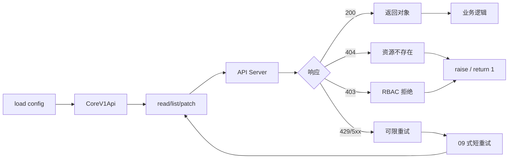
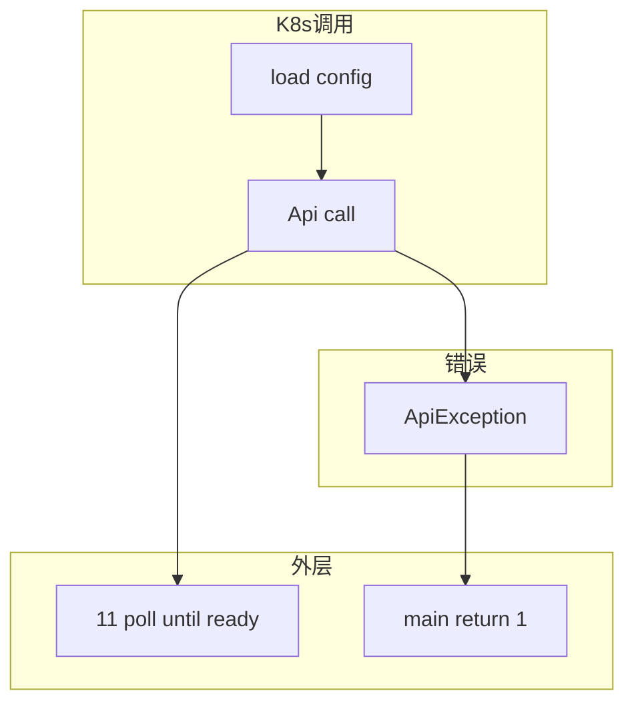

# 12｜K8s 与云 SDK 调用 · SRE 开发能力

> 集群内 CronJob 报 `Unauthorized`，因为用了 `load_kube_config()` 读不到 in-cluster SA；脚本 `list_pod_for_all_namespaces` 没分页，OOM；catch `Exception` 把 403 当瞬态重试——**kubernetes-client（官方 Python 客户端）不是 curl：加载配置、ApiException、namespace、分页与 watch 各有一层契约**。
> **本章回答**：一次 K8s API 调用从加载 kubeconfig、构造 client、发请求、读响应/异常到脚本退出的完整链路；云 SDK（boto3）遵循同一心态。
> **本章不讲**：HTTP 通用重试 → [09 HTTP客户端与重试](../09-HTTP客户端与重试/)；等到 Ready 的 poll → [11 轮询超时与退避](../11-轮询超时与退避/)。

## 面试怎么考

| 标记 | 考点 |
|------|------|
| **核心** | `load_incluster_config` / `load_kube_config`；`CoreV1Api`；`ApiException.status` |
| **必会** | Pod 内 in-cluster；本地 kubeconfig；403/404 不重试；list 分页 |
| **常用** | `custom_objects_api`；context namespace；`client.rest_client.pool_manager` |
| **常考** | RBAC 403 vs 网络错误；dry-run；QPS 与 timeout |

**30 秒怎么说**：先 **`config.load_incluster_config()`**（Pod）或 **`load_kube_config(context=...)`**（本地）。用 **`CoreV1Api`** 等 API 类，不要手写 URL。捕 **`kubernetes.client.exceptions.ApiException`**，看 **`.status`**：404 资源不存在、403 RBAC、429/5xx 可有限重试。list 用 **`limit` + `_continue`** 或 `list_*` 的 watch。失败 **`raise`/`return 1`**。云 API 同理：boto3 配 region、显式异常、分页。

---

## 能力边界

| 维度 | official Python client | kubectl 子进程 | 直接 REST |
|------|------------------------|----------------|-----------|
| **适合** | 编排、CI、Operator 式脚本 | 人操作 parity | 极少 |
| **不适合** | 简单一次性 debug | 结构化解析 | 无类型 |
| **契约** | kubeconfig/SA + RBAC | 依赖 kubectl 版本 | 自行维护 |

| 机制 | 管什么 | 不管什么 |
|------|--------|----------|
| kubeconfig/SA | 身份与集群 | 业务 YAML 正确性 |
| ApiException | HTTP 层错误 | Pod 内应用逻辑 |
| RBAC | 能否 list/get | 资源是否存在 |

> ⚠️ **记住**：**403 是权限，不是「再试一次就好」**——除非 RoleBinding 正在下发（极少）。

---

## 语言最小集

| 零件 | 示例 | 含义 |
|------|------|------|
| load_incluster | `config.load_incluster_config()` | Pod 内 SA |
| load_kube | `config.load_kube_config(context="prod")` | 本地/CI |
| CoreV1Api | `v1 = client.CoreV1Api()` | Core API |
| AppsV1Api | `apps = client.AppsV1Api()` | Deployment 等 |
| read_namespaced | `v1.read_namespaced_pod(name, ns)` | 单个资源 |
| list | `v1.list_namespaced_pod(ns, limit=100)` | 列表 |
| ApiException | `except ApiException as e: e.status` | K8s HTTP 错 |
| CustomObjectsApi | CRD 资源 | PrometheusRule 等 |
| boto3.client | `boto3.client("ec2", region_name=...)` | AWS |
| ClientError | `botocore.exceptions.ClientError` | 云 API 错 |

```python
from kubernetes import client, config
from kubernetes.client.exceptions import ApiException

def get_v1():
    try:
        config.load_incluster_config()
    except config.ConfigException:
        config.load_kube_config(context=os.environ.get("KUBE_CONTEXT"))
    return client.CoreV1Api()
```

---

## 一、一张图：一次 K8s API 调用的一生

> 🎯 **一句话**：**加载配置 → 建 Api 客户端 → 构造调用（name/ns/body）→ REST 请求 → 2xx 对象 / ApiException → 脚本决策**。



**读图**：**H** 修 RoleBinding，不是 sleep。**I** 要保守，apiserver 敏感。

---

## 二、出生：加载配置（⭐常考）

> 🎯 **一句话**：**Pod 用 in-cluster；开发机用 kubeconfig；CI 用 secret 挂载或 KUBECONFIG**。

```python
from kubernetes import config, client

def load_k8s_config() -> None:
    try:
        config.load_incluster_config()
    except config.ConfigException:
        ctx = os.environ.get("KUBE_CONTEXT")
        config.load_kube_config(context=ctx)

load_k8s_config()
v1 = client.CoreV1Api()
```

| 环境 | 方法 | 身份 |
|------|------|------|
| Pod / CronJob | `load_incluster_config` | ServiceAccount |
| 笔记本 | `load_kube_config` | kubeconfig user |
| CI | `KUBECONFIG` 文件 | 通常 limited RBAC |

```python
# 显式 kubeconfig 路径
config.load_kube_config(config_file="/path/kubeconfig", context="staging")
```

> 📝 **面试**：「CronJob 里读 `~/.kube/config` 常为空——必须用 in-cluster。」

---

## 三、发出：API 类与 namespace（🔥必会）

> 🎯 **一句话**：**用 typed API**；**namespace 别硬编码 prod**。

```python
NS = os.environ.get("NAMESPACE", "default")

def get_pod(v1: client.CoreV1Api, name: str, namespace: str = NS):
    return v1.read_namespaced_pod(name=name, namespace=namespace)
```

| API 类 | 资源 |
|--------|------|
| CoreV1Api | Pod, Service, NS, Event |
| AppsV1Api | Deployment, ReplicaSet |
| BatchV1Api | Job, CronJob |
| NetworkingV1Api | Ingress, NetworkPolicy |
| CustomObjectsApi | CRD |

```python
crd = client.CustomObjectsApi()
crd.get_namespaced_custom_object(
    group="monitoring.coreos.com",
    version="v1",
    namespace=NS,
    plural="prometheusrules",
    name="example",
)
```

### dry-run（常用）

```python
v1.create_namespaced_pod(
    namespace=NS,
    body=pod_body,
    dry_run="All",  # server-side dry-run
)
```

---

## 四、读响应：ApiException（⭐常考）

> 🎯 **一句话**：**K8s 客户端抛 `ApiException`，`.status` 是 HTTP 码，`.body` 常是 JSON 字符串**。

```python
from kubernetes.client.exceptions import ApiException

try:
    pod = v1.read_namespaced_pod(name="app-xxx", namespace=NS)
except ApiException as e:
    if e.status == 404:
        raise ResourceNotFound("pod missing") from e
    if e.status == 403:
        raise PermissionDenied("RBAC: cannot get pod") from e
    if e.status in (429, 500, 503):
        raise TransientError(f"apiserver {e.status}") from e
    raise
```

| status | 含义 | 脚本策略 |
|--------|------|----------|
| 404 | Not Found | 不重试，修 name/ns |
| 403 | Forbidden | 修 RBAC，不重试 |
| 401 | Unauthorized | 修 SA/token |
| 409 | Conflict | 视业务 merge/retry |
| 422 | Invalid | 修 manifest |
| 429 | Too Many Requests | 退避 |
| 5xx | 服务端 | 有限重试 |

```python
import json
if e.body:
    detail = json.loads(e.body)
    log.error("reason=%s message=%s", detail.get("reason"), detail.get("message"))
```

> ⚠️ **别混**：`ApiException` 不是 `requests.HTTPError`——捕错类型抓不到。

---

## 五、列表与分页（🔥难点）

> 🎯 **一句话**：**大集群 list 必须分页**，否则 OOM 与 apiserver 压力。

```python
def list_pods(v1: client.CoreV1Api, namespace: str):
    continue_token = None
    while True:
        resp = v1.list_namespaced_pod(
            namespace=namespace,
            limit=200,
            _continue=continue_token,
        )
        for pod in resp.items:
            yield pod
        continue_token = resp.metadata._continue
        if not continue_token:
            break
```

| 参数 | 作用 |
|------|------|
| `limit` | 每页条数 |
| `_continue` | 翻页 token |
| `label_selector` | 过滤减数据量 |

```python
v1.list_pod_for_all_namespaces(label_selector="app=api", limit=100)
```

> 📝 **面试**：「一次 list 全集群 Pod 是脚本 OOM 常见原因。」

---

## 六、watch 与 poll（⭐常用）

> 🎯 **一句话**：**watch 省 QPS**；断线要重连；与 11 章 deadline 结合。

```python
from kubernetes import watch

w = watch.Watch()
for event in w.stream(v1.list_namespaced_pod, namespace=NS, timeout_seconds=600):
    pod = event["object"]
    if pod_ready(pod):
        break
```

watch 超时或 `410 Gone`（resourceVersion 过期）要重新 list 拿 version 再 watch——生产脚本要 catch 并重连。

运维简单门禁：**11 章 poll + read status** 足够；大规模用 watch。

---

## 七、云 SDK：boto3 同一心态（🔥必会）

> 🎯 **一句话**：**region 显式、ClientError 看 error code、分页用 paginator**。

```python
import boto3
from botocore.exceptions import ClientError

def list_instances(region: str):
    ec2 = boto3.client("ec2", region_name=region)
    paginator = ec2.get_paginator("describe_instances")
    for page in paginator.paginate():
        for reservation in page["Reservations"]:
            for inst in reservation["Instances"]:
                yield inst

try:
    ...
except ClientError as e:
    code = e.response["Error"]["Code"]
    if code == "UnauthorizedOperation":
        raise PermissionDenied(code) from e
    raise
```

| K8s | AWS |
|-----|-----|
| ApiException.status | HTTP + Error Code |
| kubeconfig/SA | IAM role / profile |
| limit/_continue | Paginator |

---

## 八、收束：与 09/11/04 串联（🔧实操）



**可背清单（六件套）**：

- in-cluster vs kubeconfig 自动回退
- 捕 `ApiException` 看 status
- 403/404 不重试
- list 分页 + label_selector
- 结合 11 deadline 等 Ready
- 失败非 0 + 不 log token

---

## 九、作战：Unauthorized、OOM、403 重试

**现象 · 先做 · 别做**

| 现象 | 先做 | 别做 |
|------|------|------|
| CronJob Unauthorized | in-cluster config | 依赖 ~/.kube |
| 脚本 OOM | list 分页 | 一次全量 list |
| 403 无限重试 | 修 RoleBinding | sleep 退避 |
| 404 重试 | 修 name/namespace | 09 式 5 次 |
| 429 apiserver | 降 QPS + 11 退避 | 32 线程 list |

**60 秒剧本** 🔧：

| 时段 | 动作 |
|------|------|
| 0–10s | `kubectl auth can-i get pod -n ns` |
| 10–25s | 脚本 load config 路径 |
| 25–40s | ApiException status 分布 |
| 40–60s | list 是否 limit |

```bash
kubectl auth can-i list pods --namespace=app -as=system:serviceaccount:app:checker
python script.py 2>&1 | head
```

---

## 生产模板 🔧

### 模板 1：config 加载 + CoreV1Api

```python
def k8s_client() -> client.CoreV1Api:
    load_k8s_config()
    return client.CoreV1Api()
```

### 模板 2：安全 read

```python
def read_pod(v1, name: str, ns: str) -> client.V1Pod:
    try:
        return v1.read_namespaced_pod(name, namespace=ns)
    except ApiException as e:
        if e.status == 404:
            raise ResourceNotFound(name) from e
        raise
```

### 模板 3：分页 list

```python
def iter_pods(v1, ns: str, labels: str | None = None):
    token = None
    while True:
        resp = v1.list_namespaced_pod(
            namespace=ns, limit=200, _continue=token,
            label_selector=labels or "",
        )
        yield from resp.items
        token = resp.metadata._continue
        if not token:
            break
```

### 模板 4：main + RBAC 友好错误

```python
def main() -> int:
    try:
        run_audit(k8s_client())
    except PermissionDenied as e:
        log.error("RBAC: %s", e)
        return 2
    except ApiException as e:
        log.error("k8s api %s: %s", e.status, e.reason)
        return 1
    return 0
```

---

## 踩坑清单 🔥

| 现象 | 原因 | 修法 |
|------|------|------|
| Unauthorized | 错误 load config | in-cluster |
| OOM | 全量 list | 分页 |
| 403 重试 | 当瞬态 | 修 RBAC |
| 捕 Exception 太宽 | 吞 ApiException | 分层 catch |
| 错 cluster | context 未指定 | KUBE_CONTEXT |
| RV 过期 watch 断 | 410 Gone | 重新 list+watch |
| 泄露 token | log body/headers | 只打 status/reason |
| dry-run 仍创建 | 未传 dry_run | server-side dry-run |

---

## 易错一句话对照 🔥

| 说法 | 一句话纠正 |
|------|------------|
| 「kubernetes-client 就是 requests 包一层」 | 它有 typed API、ApiException、watch、分页——不是裸 HTTP |
| 「403 重试几次就好了」 | 403 是 RBAC 拒绝，重试 100 次还是 403 |
| 「Pod 里读 ~/.kube/config」 | Pod 内没有 kubeconfig；必须 `load_incluster_config` |
| 「list 全集群 Pod 没事」 | 大集群一次 list 几千条 → OOM + apiserver 压力 |
| 「watch 永不断线」 | resourceVersion 过期 → 410 Gone → 必须重新 list+watch |
| 「boto3 和 k8s client 无关」 | 共性：显式配置、异常码、分页、region/namespace |

> 🔍 **排查信号**：脚本报 `Unauthorized` 但本地 `kubectl` 正常——说明 kubernetes-client 没用 in-cluster，而是读到了空 kubeconfig。

---

## 必会 · 常考 ⭐

| 说法 | 对错 | 口径 |
|------|:----:|------|
| Pod 内用 load_kube_config | 错 | in-cluster |
| ApiException 有 status | 对 | HTTP 码 |
| 403 应重试 10 次 | 错 | 修 RBAC |
| list 要分页 | 对 | limit/_continue |
| watch 可替代所有 poll | 错 | 简单 poll 够用 |
| boto3 要设 region | 对 | 显式 region |
| 404 修资源名 | 对 | 不重试 |
| CRD 用 CustomObjectsApi | 对 | group/version/plural |

---

## 命令速查 🔧

```bash
# 权限
kubectl auth can-i create deployment --namespace=app

# 等价调试
kubectl get pod -n app -o json | jq .metadata.name

# context
kubectl config current-context
export KUBE_CONTEXT=staging
```

```python
# 快速测连通
from kubernetes import client, config
config.load_kube_config()
print(client.CoreV1Api().get_api_resources())
```

### client 配置与 timeout（常用）

```python
from kubernetes import client, config

def api_client() -> client.ApiClient:
    load_k8s_config()
    c = client.ApiClient()
    c.configuration.connect_timeout = 5
    c.configuration.read_timeout = 30
    return c

v1 = client.CoreV1Api(api_client())
```

| 配置项 | 含义 |
|--------|------|
| connect_timeout | 连 apiserver |
| read_timeout | 读响应 body |
| verify_ssl | 一般 True |

### QPS 与 burst（⭐常考）

kubernetes-client 默认 QPS=50、burst=100。大集群巡检脚本可能需要调高，但不要无限制：

```python
c = client.ApiClient()
c.configuration.client_side_validation = False  # 关客户端校验提速
# QPS/burst 在 configuration 层设
client.Configuration.set_default(c.configuration)
```

| 参数 | 默认 | 何时调 |
|------|------|--------|
| QPS | 50 | 大集群多 API 调用 |
| burst | 100 | 瞬时并发 list |
| client_side_validation | True | 关掉可减 CPU |

> ⚠️ **别混**：client timeout 是**单次 REST**；11 章 budget 是**等业务 Ready 的总时长**——两层都要。

### 发布脚本串联示例（09+11+12）

```python
def deploy_and_wait(apps_v1, name: str, ns: str, budget: float = 600) -> None:
    # 12 patch/apply 略
    deadline = time.monotonic() + budget
    attempt = 0
    while time.monotonic() < deadline:
        attempt += 1
        ok, reason = deployment_ready(apps_v1, name, ns)
        if ok:
            log.info("deploy ok attempts=%s", attempt)
            return
        log.info("waiting %s", reason)
        time.sleep(backoff_interval(attempt))
    raise TimeoutError(reason)
```

内层 `read_namespaced_deployment_status` 若遇 503，09 式 retry **最多 2 次**，避免与外层 poll 相乘。

---

## 面试锚点 ⭐

| 问 | 30 秒答 |
|----|---------|
| Pod 内怎么连 API？ | load_incluster_config + SA |
| 403 vs 500？ | RBAC vs 服务端，策略不同 |
| 大 list 注意？ | limit + continue |
| ApiException 看什么？ | status, reason, body |
| 与 boto3 共性？ | 显式配置、异常码、分页 |

---

## 合上书，问自己

- [ ] 画「K8s API 调用一生」主图，标 403/404 短路。
- [ ] in-cluster 与 kubeconfig 如何选择？
- [ ] ApiException 常见 status 与策略？
- [ ] list 分页参数？
- [ ] watch 410 怎么办？
- [ ] 403 为何不应 HTTP 式重试？
- [ ] boto3 ClientError 如何处理？
- [ ] 12 与 09/11 如何配合一次发布脚本？

八题能口述，K8s 与云 SDK 调用就过关了。综合实战回到 [04 异常与退出码](../04-异常与退出码/) 收束退出契约。
