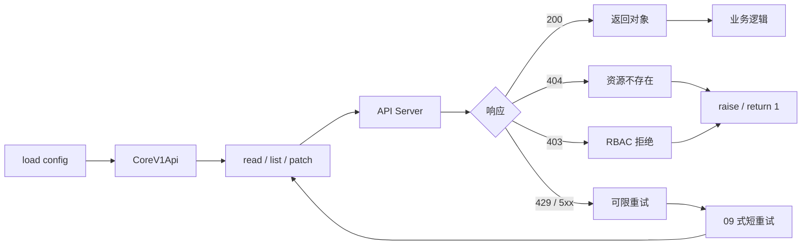
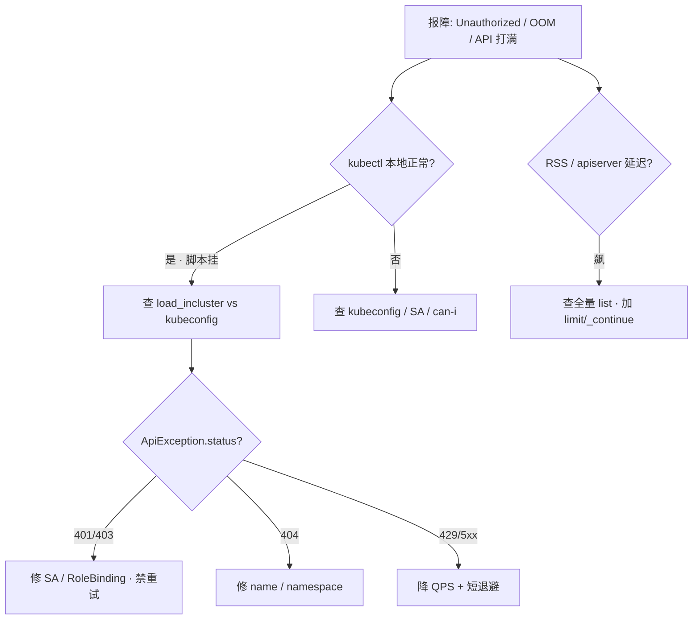

# 12｜K8s 与云 SDK 调用

> 集群内 CronJob 报 `Unauthorized`——有人塞了 `load_kube_config()` 读空的 `~/.kube`；巡检 `list_pod_for_all_namespaces` 没分页把机器 OOM；`except Exception` 把 403 当瞬态连打——群里喊「API 被打爆了」。
> **本章回答**：一次 K8s API 调用从加载配置、构造 client、发请求、读 `ApiException` 到脚本退出的完整链路；云 SDK（boto3）同一心态。
> **不讲**：HTTP 通用重试 → [09](../09-HTTP客户端与重试/)；等到 Ready 的 poll → [11](../11-轮询超时与退避/)；退出码契约 → [04](../04-异常与退出码/)。

**标记**：🎯重点 · 🔥难点 · ⭐常考 · 🔧实操

---

## 面试怎么考

| 标记 | 考点 |
|------|------|
| **核心** | `load_incluster_config` / `load_kube_config`；`CoreV1Api`；`ApiException.status` |
| **必会** | Pod 内 in-cluster；本地 kubeconfig；403/404 不重试；list 分页 |
| **常用** | `CustomObjectsApi`；context / namespace；timeout / QPS |
| **常考** | RBAC 403 vs 网络错误；dry-run；watch `410 Gone` |

> 📝 **面试（30 秒）**：Pod 用 **`load_incluster_config()`**，本地/CI 用 **`load_kube_config(context=...)`**。用 **`CoreV1Api`** 等 typed API，别手写 URL。捕 **`ApiException`**，看 **`.status`**：404/403 不重试，429/5xx 有限重试。list 用 **`limit` + `_continue`**。失败 **`raise` / `return 1`**。云 API 同理：显式 region、错误码分层、paginator。

---

## 能力边界

| 维度 | official Python client | kubectl 子进程 | 直接 REST |
|------|------------------------|----------------|-----------|
| **适合** | 编排、CI、Operator 式脚本 | 人操作 parity | 极少 |
| **不适合** | 简单一次性 debug | 结构化解析 | 无类型、自维护契约 |
| **契约** | kubeconfig/SA + RBAC | 依赖 kubectl 版本 | 自行拼 URL/认证 |

- 🔑 **三层各管一段**
  - kubeconfig / SA：身份与集群入口——**不**管业务 YAML 对不对
  - `ApiException`：HTTP 层错误码——**不**管 Pod 内应用逻辑
  - RBAC：能否 list/get——**不**管资源是否存在（那是 404）

> ⚠️ **别混**：**403 是权限，不是「再试一次就好」**——除非 RoleBinding 正在下发（极少见，仍应修 RBAC，不是盲退避）。

---

## 语言最小集

写/读 K8s 运维脚本，认这些即可：

| 零件 | 示例 | 含义 |
|------|------|------|
| load_incluster | `config.load_incluster_config()` | Pod 内 SA token |
| load_kube | `config.load_kube_config(context="prod")` | 本地 / CI kubeconfig |
| CoreV1Api | `v1 = client.CoreV1Api()` | Pod / Service / Event |
| AppsV1Api | `apps = client.AppsV1Api()` | Deployment 等 |
| read_namespaced | `v1.read_namespaced_pod(name, ns)` | 单个资源 |
| list + 分页 | `limit=200, _continue=token` | 列表翻页 |
| ApiException | `except ApiException as e: e.status` | K8s HTTP 错 |
| CustomObjectsApi | group/version/plural | CRD |
| boto3.client | `boto3.client("ec2", region_name=...)` | AWS |
| ClientError | `botocore.exceptions.ClientError` | 云 API 错 |

```python
#!/usr/bin/env python3
import os
from kubernetes import client, config
from kubernetes.client.exceptions import ApiException

def get_v1() -> client.CoreV1Api:
    try:
        config.load_incluster_config()
    except config.ConfigException:
        config.load_kube_config(context=os.environ.get("KUBE_CONTEXT"))
    return client.CoreV1Api()
```

- 🧩 **四行钉子**
  - 先试 in-cluster → 失败再 kubeconfig（CronJob / 本地两用）
  - 拿到的是 typed API，不是裸 `requests`
  - 后面所有错都从 `ApiException.status` 分流
  - context / namespace 从环境变量进，别写死 `prod`

零件认完，上主图。

---

## 一、一张图：一次 K8s API 调用的一生 ⭐

> 🎯 **一句话**：**加载配置 → 建 Api 客户端 → 构造调用（name/ns/body）→ REST → 2xx 对象 / ApiException → 脚本决策**。



- 📖 **读图**
  - 🛤️ 主线六站：config → client → call → apiserver → 分流 → 交卷
  - 🚨 **H 修 RoleBinding**，不是 `sleep`；**I 要保守**——apiserver 敏感，别和 11 章外层 poll 相乘
  - 📟 值班第一眼看 `e.status`：403/404 短路到 J，别进 K

本节对应练习题 Q13。带着问题往下走——配置错了，后面全白搭。

---

## 二、出生：加载配置 ⭐

> 🎯 **一句话**：**Pod 用 in-cluster；开发机用 kubeconfig；CI 用挂载的 `KUBECONFIG` 或 secret 文件**。

```python
from kubernetes import config, client

def load_k8s_config() -> None:
    try:
        config.load_incluster_config()
    except config.ConfigException:
        ctx = os.environ.get("KUBE_CONTEXT")
        config.load_kube_config(context=ctx)

load_k8s_config()
v1 = client.CoreV1Api()
```

- 🪪 **三种环境，三种身份**
  - Pod / CronJob → `load_incluster_config` → **ServiceAccount**（挂在 `/var/run/secrets/kubernetes.io/serviceaccount/`）
  - 笔记本 → `load_kube_config` → kubeconfig user / context
  - CI → `KUBECONFIG` 文件或显式 `config_file=` → 通常 limited RBAC

```python
# 显式路径 + context（CI / 多集群）
config.load_kube_config(config_file="/path/kubeconfig", context="staging")
```

#### ❓ 为什么 CronJob 里不能读 `~/.kube/config`？

- 👻 **Pod 里通常没有 kubeconfig**：镜像用户家目录空，`load_kube_config()` 抛 `ConfigException` 或落到错误文件 → 常见 **`Unauthorized`**
- ✅ **in-cluster**：读 SA token + CA，身份就是绑定到该 SA 的 RBAC
- 🔍 **现场对照**：本地 `kubectl` 正常、脚本 `Unauthorized` → 脚本没用 in-cluster，却去读空 kubeconfig

> 💡 **打个比方**：本地 kubectl 像你带了工牌进机房；Pod 里没工牌夹，只能刷门禁卡（SA）。硬找工牌夹 = 刷空气。

> 📝 **面试**：「CronJob 里默认想 in-cluster；死读 `~/.kube/config` 是 Unauthorized 经典根因。」⭐（练习题 Q1）

本节对应练习题 Q1、Q11。配置对了，再认 API 类与 namespace。

---

## 三、发出：API 类与 namespace 🔥

> 🎯 **一句话**：**用 typed API**；**namespace 从环境进，别硬编码 `prod`**。

```python
NS = os.environ.get("NAMESPACE", "default")

def get_pod(v1: client.CoreV1Api, name: str, namespace: str = NS):
    return v1.read_namespaced_pod(name=name, namespace=namespace)
```

- 📚 **API 类怎么选**
  - `CoreV1Api` → Pod、Service、Namespace、Event
  - `AppsV1Api` → Deployment、ReplicaSet、StatefulSet
  - `BatchV1Api` → Job、CronJob
  - `NetworkingV1Api` → Ingress、NetworkPolicy
  - `CustomObjectsApi` → CRD（要 group / version / plural）

```python
crd = client.CustomObjectsApi()
crd.get_namespaced_custom_object(
    group="monitoring.coreos.com",
    version="v1",
    namespace=NS,
    plural="prometheusrules",
    name="example",
)
```

### 🧪 dry-run（常用）

```python
v1.create_namespaced_pod(
    namespace=NS,
    body=pod_body,
    dry_run="All",  # server-side dry-run：校验但不持久化
)
```

- 🔑 **口诀**：typed API + namespace 不写死 + dry-run 先演练

> ⚠️ **别混**：客户端本地拼 YAML「看起来对」≠ apiserver 接受——**server-side `dry_run="All"`** 才走完整准入；漏传 `dry_run` 会真创建。

本节对应练习题 Q7、Q8。发出侧齐了，专攻异常分流。

---

## 四、读响应：ApiException ⭐🔥

> 🎯 **一句话**：**客户端抛 `ApiException`，`.status` 是 HTTP 码，`.body` 常是 JSON 字符串**——按码分流，别一律重试。

```python
from kubernetes.client.exceptions import ApiException

try:
    pod = v1.read_namespaced_pod(name="app-xxx", namespace=NS)
except ApiException as e:
    if e.status == 404:
        raise ResourceNotFound("pod missing") from e
    if e.status == 403:
        raise PermissionDenied("RBAC: cannot get pod") from e
    if e.status in (429, 500, 503):
        raise TransientError(f"apiserver {e.status}") from e
    raise
```

- 🧭 **status → 策略**
  - **404** Not Found → 不重试，修 name / ns
  - **403** Forbidden → 修 RBAC，不重试
  - **401** Unauthorized → 修 SA / token / load config
  - **409** Conflict → 视业务 merge / 有限 retry
  - **422** Unprocessable → 修 manifest
  - **429** Too Many Requests → 退避（[09](../09-HTTP客户端与重试/)）
  - **5xx** → 有限短重试，别和无上限 poll 叠乘

```python
import json
if e.body:
    detail = json.loads(e.body)
    log.error("reason=%s message=%s", detail.get("reason"), detail.get("message"))
    # ← 只打 reason/message；别把 Authorization / token 打进日志
```

#### ❓ 为什么 403 不能按 09 式连打重试？

- 🧱 **403 =「我不让你干」**：RoleBinding 不改，重试 100 次还是 403
- 🔥 **401/403 = 身份/权限**；**503/429 才谈退避**
- 🚨 宽捕 `except Exception` 再 sleep → 把 RBAC 事故放大成 apiserver 风暴
- ✅ 正确：映射成 `PermissionDenied`，`return 2` 或明确失败，值班去修 RBAC

> ⚠️ **别混**：`ApiException` **不是** `requests.HTTPError`——捕错类型抓不到；也别把 `ApiException` 当网络超时一律重试。

> 📝 **面试**：先报 `.status` 再谈策略——404/403 修名与 RBAC；429/5xx 短退避；禁止「一律重试 5 次」。⭐（练习题 Q2、Q3、Q4）

本节对应练习题 Q2、Q3、Q4。异常会分流了，list 是下一道坑。

---

## 五、列表与分页 🔥

> 🎯 **一句话**：**大集群 list 必须分页**，否则 OOM + 压垮 apiserver。

> 💡 **打个比方**：一次 `list_pod_for_all_namespaces()` 像把仓库存货一次性搬进客厅——不是 Python「慢」，是**整仓状态塞进一个进程**。

```python
def list_pods(v1: client.CoreV1Api, namespace: str):
    continue_token = None
    while True:
        resp = v1.list_namespaced_pod(
            namespace=namespace,
            limit=200,
            _continue=continue_token,
        )
        for pod in resp.items:
            yield pod
        continue_token = resp.metadata._continue
        if not continue_token:
            break
```

- 📄 **三个旋钮**
  - `limit`：每页条数（常见 100～500）
  - `_continue`：翻页 token（下一页入参）
  - `label_selector`：先过滤，少搬数据

```python
v1.list_pod_for_all_namespaces(label_selector="app=api", limit=100)
```

#### ❓ 为什么「内存够就行」仍要分页？

- 🧠 脚本 OOM 只是一半；另一半是 **apiserver 序列化大响应**、etcd 读放大、同集群其他控制器饿死
- ✅ 口诀：**limit + continue，页页清**；能 selector 就不要全量
- 🔍 现场：巡检机器 RSS 飙升 + apiserver latency 告警，先查有没有无 `limit` 的 list

> 📝 **面试**：「一次 list 全集群 Pod 是脚本 OOM 常见原因；答『加内存』减分，答分页 + selector 满分。」⭐（练习题 Q5）

本节对应练习题 Q5、Q12。需要「等变化」时再谈 watch。

---

## 六、watch 与 poll ⭐

> 🎯 **一句话**：**watch 省 QPS**；断线要重连；简单门禁用 [11](../11-轮询超时与退避/) poll 往往够。

```python
from kubernetes import watch

w = watch.Watch()
for event in w.stream(v1.list_namespaced_pod, namespace=NS, timeout_seconds=600):
    pod = event["object"]
    if pod_ready(pod):
        break
```

- 🔄 **选型**
  - 运维短门禁（等 Deployment Ready）→ **11 章 poll + read status** 足够
  - 大规模长跟事件 → **watch**；超时或 **`410 Gone`（resourceVersion 过期）** → 重新 list 拿 version 再 watch

#### ❓ 为什么 watch 断了不能「接着上一次 RV 死磕」？

- ⌛ apiserver 只保留有限历史；RV 过期返回 **410 Gone**
- ✅ 正确路径：**list 拿新 resourceVersion → 再 watch**；生产脚本要 catch 并重连
- ⚠️ 别假设 watch「永不断线」

本节对应练习题 Q9。K8s 走通了，云 SDK 是同一套心态。

---

## 七、云 SDK：boto3 同一心态 🔥

> 🎯 **一句话**：**region 显式、ClientError 看 error code、分页用 paginator**——别当成另一门语言。

```python
import boto3
from botocore.exceptions import ClientError

def list_instances(region: str):
    ec2 = boto3.client("ec2", region_name=region)
    paginator = ec2.get_paginator("describe_instances")
    for page in paginator.paginate():
        for reservation in page["Reservations"]:
            for inst in reservation["Instances"]:
                yield inst

try:
    ...
except ClientError as e:
    code = e.response["Error"]["Code"]
    if code == "UnauthorizedOperation":
        raise PermissionDenied(code) from e
    raise
```

| K8s | AWS |
|-----|-----|
| `ApiException.status` | HTTP + Error Code |
| kubeconfig / SA | IAM role / profile |
| `limit` / `_continue` | Paginator |

- 🧩 **心态三件套**（两边共用）
  - 显式配置（context / region）
  - 错误码分层（权限 vs 瞬态）
  - 分页（别一次拉爆）

本节对应练习题 Q10。把契约收成一张图。

---

## 八、收束：一次调用凭什么安全落地 🔧

> 🎯 **一句话**：安全落地 = **对的身份 + 对的异常分流 + 分页/预算不压垮集群 + 非 0 交卷**。

```mermaid
flowchart TB
    subgraph call ["K8s 调用"]
        L[load config]
        A[Api call]
    end
    subgraph err ["错误"]
        X[ApiException]
    end
    subgraph outer ["外层"]
        P[11 poll until ready]
        M[main return 非0]
    end
    L --> A
    A --> X
    A --> P
    X --> M
```

- 📖 **读图**
  - 🧱 L 错了后面全是 `Unauthorized`；A 的瞬态才进短重试
  - ⏳ P 是「等业务 Ready」总预算（[11](../11-轮询超时与退避/)），不是单次 REST timeout
  - 📤 X→M：403/404 直接非 0，别吞进 `except Exception: pass`（[04](../04-异常与退出码/)）

**可背清单（六件套）**：

1. in-cluster vs kubeconfig 自动回退
2. 捕 `ApiException` 看 `status`
3. 403/404 不重试
4. list 分页 + `label_selector`
5. 结合 11 deadline 等 Ready
6. 失败非 0 + 不 log token

> ⚠️ **别混**：**client timeout** = 单次 REST；**11 章 budget** = 等 Ready 总时长——两层都要。内层 503 最多短重试 1～2 次，避免与外层 poll 相乘。

> 📝 **面试**：六件套分三组——**身份**（in-cluster/kubeconfig）· **分流**（status/分页）· **交卷**（deadline + 非 0）。（练习题 Q11）

本节对应练习题 Q11。回到开头 Unauthorized / OOM / 403 现场。

---

## 九、作战：Unauthorized、OOM、403 重试 🔥🔧

> 🎯 **一句话**：先分身份（in-cluster 还是 kubeconfig），再看 `status` 分布，再查 list 有没有 `limit`。



- 📖 **读图**：本地 kubectl 绿、脚本红 → 几乎总是 **config 路径**；内存/延迟飙 → 先查 **无分页 list**

**现象 · 先做 · 别做**

| 现象 | 先做 | 别做 |
|------|------|------|
| CronJob Unauthorized | in-cluster config | 依赖 `~/.kube` |
| 脚本 OOM | list 分页 | 一次全量 list |
| 403 无限重试 | 修 RoleBinding | sleep 退避 |
| 404 重试 | 修 name/namespace | 09 式盲打 5 次 |
| 429 apiserver | 降 QPS + 11 退避 | 32 线程狂 list |

**60 秒剧本** 🔧：

- **0–10s**：`kubectl auth can-i get pods -n ns -as=system:serviceaccount:...`
- **10–25s**：脚本走的是 in-cluster 还是 kubeconfig / `KUBE_CONTEXT`
- **25–40s**：日志里 `ApiException.status` 分布
- **40–60s**：list 是否带 `limit`；有无全命名空间无 selector

```bash
kubectl auth can-i list pods --namespace=app -as=system:serviceaccount:app:checker
# ← no → RBAC；yes 而脚本仍 401 → load config 路径错

python script.py 2>&1 | head
# ← 看 Unauthorized / Forbidden / 是否刷屏重试
```

本节对应练习题 Q6、Q12。下面模板可直接拿走。

---

## 生产模板 🔧

### 模板 1：config 加载 + CoreV1Api

```python
def k8s_client() -> client.CoreV1Api:
    load_k8s_config()
    return client.CoreV1Api()
```

### 模板 2：安全 read

```python
def read_pod(v1, name: str, ns: str) -> client.V1Pod:
    try:
        return v1.read_namespaced_pod(name, namespace=ns)
    except ApiException as e:
        if e.status == 404:
            raise ResourceNotFound(name) from e
        if e.status == 403:
            raise PermissionDenied(name) from e
        raise
```

### 模板 3：分页 list

```python
def iter_pods(v1, ns: str, labels: str | None = None):
    token = None
    while True:
        resp = v1.list_namespaced_pod(
            namespace=ns,
            limit=200,
            _continue=token,
            label_selector=labels or "",
        )
        yield from resp.items
        token = resp.metadata._continue
        if not token:
            break
```

### 模板 4：main + RBAC 友好错误

```python
def main() -> int:
    try:
        run_audit(k8s_client())
    except PermissionDenied as e:
        log.error("RBAC: %s", e)
        return 2
    except ApiException as e:
        log.error("k8s api %s: %s", e.status, e.reason)
        return 1
    return 0

if __name__ == "__main__":
    raise SystemExit(main())
```

### 模板 5：timeout + 发布串联（09+11+12）

```python
from kubernetes import client

def api_client() -> client.ApiClient:
    load_k8s_config()
    c = client.ApiClient()
    c.configuration.connect_timeout = 5
    c.configuration.read_timeout = 30
    return c

def deploy_and_wait(apps_v1, name: str, ns: str, budget: float = 600) -> None:
    deadline = time.monotonic() + budget
    attempt = 0
    while time.monotonic() < deadline:
        attempt += 1
        ok, reason = deployment_ready(apps_v1, name, ns)
        if ok:
            log.info("deploy ok attempts=%s", attempt)
            return
        log.info("waiting %s", reason)
        time.sleep(backoff_interval(attempt))
    raise TimeoutError(reason)
```

内层 `read_namespaced_deployment_status` 遇 503：09 式最多 **2** 次，避免与外层 poll 相乘。

---

## 踩坑清单

| 现象 | 原因 | 修法 |
|------|------|------|
| Unauthorized | 错误 load config | in-cluster |
| OOM | 全量 list | 分页 |
| 403 重试 | 当瞬态 | 修 RBAC |
| 捕 Exception 太宽 | 吞分流 | 捕 `ApiException` 分层 |
| 错 cluster | context 未指定 | `KUBE_CONTEXT` |
| watch 断 | `410 Gone` | 重新 list+watch |
| 泄露 token | log body/headers | 只打 status/reason |
| dry-run 仍创建 | 未传 `dry_run` | `dry_run="All"` |

---

## 必会 · 常考 ⭐

| 说法 | 对错 | 口径 |
|------|:----:|------|
| Pod 内用 `load_kube_config` | 错 | in-cluster |
| `ApiException` 有 `status` | 对 | HTTP 码 |
| 403 应重试 10 次 | 错 | 修 RBAC |
| list 要分页 | 对 | `limit`/`_continue` |
| watch 可替代所有 poll | 错 | 简单 poll 够用 |
| boto3 要设 region | 对 | 显式 region |
| 404 修资源名 | 对 | 不重试 |
| CRD 用 `CustomObjectsApi` | 对 | group/version/plural |

---

## 收口

### 命令速查 🔧

```bash
# 权限
kubectl auth can-i create deployment --namespace=app
kubectl auth can-i list pods -n app -as=system:serviceaccount:app:checker

# 等价调试
kubectl get pod -n app -o json | jq .metadata.name

# context
kubectl config current-context
export KUBE_CONTEXT=staging
```

```python
from kubernetes import client, config
config.load_kube_config()
print(client.CoreV1Api().list_namespace().items[0].metadata.name)
```

- ⚙️ **client 侧常用旋钮**
  - `connect_timeout` / `read_timeout`：单次 REST
  - 默认 QPS≈50、burst≈100：大集群巡检可调，但**不要无限制**
  - `verify_ssl`：生产保持 True

### 面试锚点

遮住右列自问自答，卡壳的行回去重读对应小节。

| 问 | 30 秒答 |
|----|---------|
| Pod 内怎么连 API？ | `load_incluster_config` + SA |
| 403 vs 500？ | RBAC vs 服务端，策略不同 |
| 大 list 注意？ | `limit` + `_continue` + selector |
| `ApiException` 看什么？ | `status`、`reason`、`body` |
| 与 boto3 共性？ | 显式配置、异常码、分页 |
| watch 410？ | 重新 list 拿 RV 再 watch |

### 易错一句话对照

- kubernetes-client 就是 requests 包一层 → typed API、`ApiException`、watch、分页，不是裸 HTTP
- 403 重试几次就好 → RBAC 拒绝，重试 100 次还是 403
- Pod 里读 `~/.kube/config` → 必须 `load_incluster_config`
- list 全集群 Pod 没事 → 大集群 OOM + 压 apiserver
- watch 永不断线 → RV 过期 `410 Gone`，要 list+watch
- boto3 和 k8s client 无关 → 共性：显式配置、错误码、分页
- client timeout = 等 Ready 总时长 → 单次 REST vs 11 章 budget，两层
- 捕 `Exception` 再 sleep → 把 403 放大成风暴；按 `status` 分流

### 数字墙

> list 页大小常见 **100～500**；单次 REST `connect`≈**5s**、`read`≈**30s**；内层 5xx 短重试 **≤2**；client 默认 QPS≈**50**、burst≈**100**；权限失败退出码约定 **2**，一般 API 失败 **1**（与 [04](../04-异常与退出码/) 对齐）。

---

## 合上书

- [ ] **默画**「K8s API 调用一生」，标 403/404 短路（Q13）
- [ ] in-cluster 与 kubeconfig 如何选？CronJob 为何不能读 `~/.kube`？（Q1）
- [ ] `ApiException` 常见 status 与策略？（Q2、Q3、Q4）
- [ ] list 分页参数？为何不能只靠「内存够」？（Q5）
- [ ] watch `410` 怎么办？（Q9）
- [ ] 403 为何不应 HTTP 式重试？（Q3、Q6）
- [ ] boto3 `ClientError` 怎么分层？（Q10）
- [ ] 12 与 09/11 如何配合一次发布脚本？（Q11）
- [ ] Unauthorized / OOM：60 秒先敲什么？（Q6、Q12）

九题能口述，K8s 与云 SDK 调用过关。综合实战把失败交回 [04](../04-异常与退出码/) 的退出契约。
