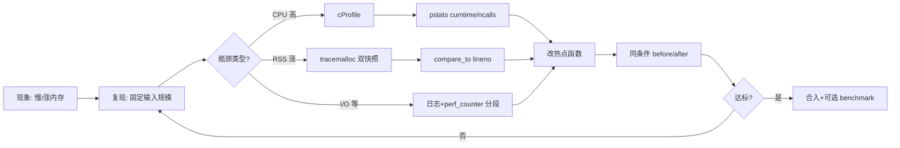
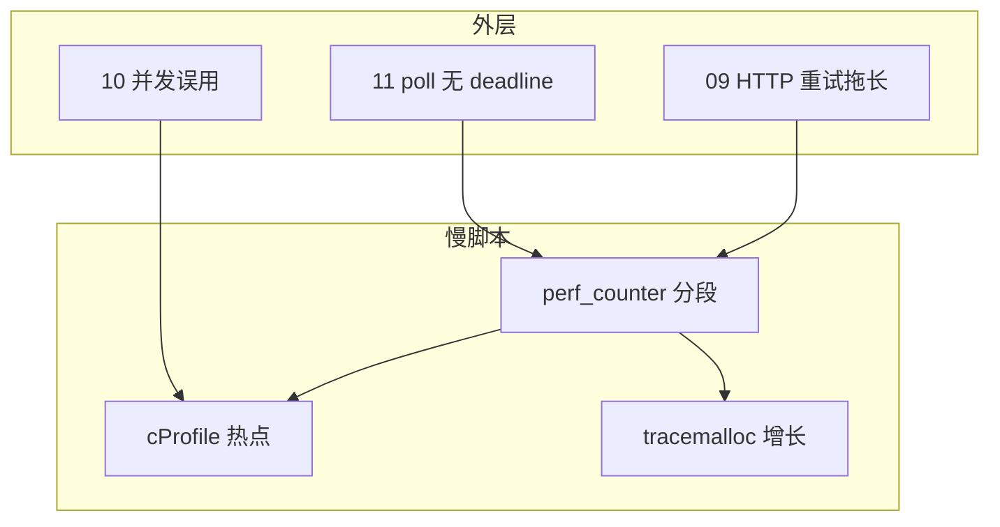
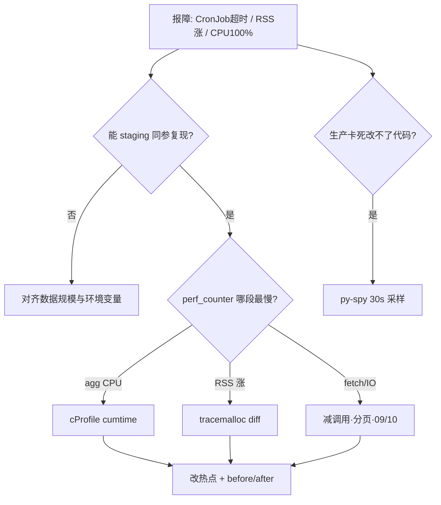

# 13｜性能与内存排查

> 巡检从 30 秒涨到 8 分钟，有人喊「加机器」；`top` 上 Python RSS 2 GB，有人迷信 `getsizeof`；有人直接 `py-spy` 生产 attach——**80% 的脚本性能事故，第一步都是「没量过就猜」**。
> **本章回答**：一次「脚本变慢 / 内存涨」从复现、分型、cProfile / tracemalloc、验证修复到回归门禁的完整链路。
> **不讲**：多进程/GIL 选型 → [10](../10-并发与GIL/)；HTTP 重试拖慢 → [09](../09-HTTP客户端与重试/)；宿主机 CPU/内存 → [01-基础底座/06](../../../01-基础底座/06-CPU与Load/)。

**标记**：🎯重点 · 🔥难点 · ⭐常考 · 🔧实操

---

## 面试怎么考

| 标记 | 考点 |
|------|------|
| **核心** | cProfile 找 CPU 热点；tracemalloc 双快照找泄漏；先量后改 |
| **必会** | `python -m cProfile`；`pstats` 按 `cumtime`；`tracemalloc.start/snapshot/compare_to` |
| **常用** | `time.perf_counter` 分段；`ENABLE_PROFILE` 开关；py-spy 采样 |
| **常考** | cProfile 开销；`getsizeof` 陷阱；profile vs benchmark；I/O 顶部别空优化 |

> 📝 **面试（30 秒）**：慢/涨先 **复现 + 固定输入规模**，`perf_counter` 分清 CPU / I/O / 内存。CPU：`python -m cProfile -o out.prof`，`pstats` 按 **`cumtime`** 排，看 `ncalls`。内存：`tracemalloc` 双快照 **`compare_to(..., 'lineno')`**。修完同输入 before/after。生产默认关全量 profile，用环境变量或 **py-spy 采样**。不信 `getsizeof`。

---

## 能力边界

| 维度 | cProfile | tracemalloc | py-spy / eBPF |
|------|----------|-------------|----------------|
| **适合** | CPU 热点、调用次数 | Python 层分配增长、泄漏嫌疑 | 生产进程、无法改代码 |
| **不适合** | 把 I/O 等待当算法慢 | C 扩展内部细节、RSS 碎片 | 无权限 / 需 root |
| **契约** | 函数级耗时 | 分配栈 + 行号 diff | 采样、非侵入 |

- 🔑 **三个机制各管一段**
  - **cProfile**：哪段 Python 代码在耗 CPU——**不**管内核/磁盘慢
  - **tracemalloc**：哪一行多分配了——**不**管进程外碎片与 C 扩展私货
  - **perf_counter**：端到端粗计时——**不**给函数级分解

> ⚠️ **别混**：**没 profile 就改算法 = 值班赌博**。加机器、加线程、上火焰图，都排在「复现 + 分型」之后。

---

## 语言最小集

写/读运维脚本的性能排查，认这些即可：

| 零件 | 示例 | 含义 |
|------|------|------|
| cProfile CLI | `python -m cProfile -o a.prof main.py` | 写 stats 文件 |
| pstats | `p.sort_stats('cumtime').print_stats(20)` | 读 / 排序 |
| Profile 上下文 | `cProfile.Profile().enable()` | 包一段代码 |
| tracemalloc | `tracemalloc.start(); take_snapshot()` | 堆快照 |
| compare_to | `snap2.compare_to(snap1, 'lineno')` | 增量对比 |
| perf_counter | `time.perf_counter()` | 高精度墙钟 |
| get_traced_memory | `tracemalloc.get_traced_memory()` | 当前/峰值 traced |
| gc.collect | `gc.collect()` | 测泄漏前强制回收 |
| @profile | `kernprof -l -v script.py` | 行级 CPU（第三方） |

```python
import cProfile
import pstats
import io

def profile_call(fn, *args, **kwargs):
    pr = cProfile.Profile()
    pr.enable()
    try:
        return fn(*args, **kwargs)
    finally:
        pr.disable()
        s = io.StringIO()
        pstats.Stats(pr, stream=s).sort_stats("cumtime").print_stats(30)
        print(s.getvalue())
```

- 🧩 **四行钉子**
  - 先 `perf_counter` 分段 → 决定走 CPU 还是内存刀
  - `cumtime` 找入口，`ncalls` 找刷爆 → 别只盯 `main`
  - 双 snapshot + `compare_to` → 比盯 RSS 瞎猜有用
  - 修完同输入对比 → 没 before/after 等于没优化

零件认完，上主图。

---

## 一、一张图：cProfile / tracemalloc 排查的一生 ⭐

> 🎯 **一句话**：**复现 → 粗计时分型 → CPU 用 cProfile / 内存用 tracemalloc / I/O 用分段 → 改热点 → 同输入回归**。



- 📖 **读图**
  - 🛤️ 主线：**B → C → 改 → J**；卡在哪一站就查哪一站
  - 🚨 **C 分叉最关键**：对 I/O 脚本跑 cProfile，顶部往往是 `sleep`/`read`——别空优化 Python 循环
  - 📟 **J 必须与 B 同数据量**：小 fixture「变快了」对生产 OOM 无效

本节对应练习题 Q4、Q13。带着问题往下走——问题不可重复，后面全是玄学。

---

## 二、出生：复现与粗定位（🔥必会）

> 🎯 **一句话**：**先让问题可重复，再用 `perf_counter` 分段，判断是 CPU、内存还是 I/O**。

### 🎭 小剧场：第一步不是加机器

群里喊「给 CronJob 加 CPU」——你还没看过脚本内部。🔥 先 staging 复现 + 粗分段，再决定走 cProfile 还是 tracemalloc。

#### ❓ 为什么不是一上来就 py-spy / 加机器？

- 🎲 **不可复现 = 改了也不知道好不好**：线上偶发、数据规模不对，火焰图只是噪音
- 🧭 **分型错了刀就错**：I/O 占 90% 时加 CPU limit 零收益；泄漏时加副本只是推迟 OOM
- ✅ **正确顺序**：固定输入 → 分段计时 → 选工具 → 改 → 同条件对比

```python
import time

def timed_sections():
    t0 = time.perf_counter()
    data = load_config()            # 段 1
    t1 = time.perf_counter()
    rows = fetch_all_pods()         # 段 2 — 常是 I/O
    t2 = time.perf_counter()
    report = aggregate(rows)        # 段 3 — 常是 CPU
    t3 = time.perf_counter()
    write_report(report)            # 段 4
    t4 = time.perf_counter()
    log.info(
        "timing load=%.2fs fetch=%.2fs agg=%.2fs write=%.2fs total=%.2fs",
        t1 - t0, t2 - t1, t3 - t2, t4 - t3, t4 - t0,
    )
```

- 📊 **分段信号怎么读**
  - fetch 占 90% → I/O / API：分页、缓存、并发限流（[09](../09-HTTP客户端与重试/)、[10](../10-并发与GIL/)）
  - agg 段 CPU 打满 → 纯 Python 算：进 cProfile
  - RSS 涨、CPU 不高 → 内存：进 tracemalloc
  - 跑一次快、跑十遍崩 → 泄漏 / 无界缓存：tracemalloc + 弱引用 / LRU

```bash
# 粗看进程资源（宿主机视角，值班第一步常先摸一眼）
/usr/bin/time -v python scripts/audit.py 2>&1 | grep -E 'User time|Maximum resident'
# Maximum resident set size (kbytes): 2147328  ← RSS 峰值约 2.1 GB
```

> 🔍 **现场**：`User time` 高且墙钟接近 → CPU；墙钟远大于 User → 在等 I/O；`Maximum resident` 线性涨 → 带着同规模数据去 tracemalloc。

> 📝 **面试**：「我会先分段计时，避免把 list 全量加载当成算法慢。」⭐（练习题 Q1）

本节对应练习题 Q1、Q4。粗定位完，CPU 分支开刀。

---

## 三、成长：cProfile 找 CPU 热点（⭐常考）

> 🎯 **一句话**：**`cumtime` 看累计账，`ncalls` 看刷爆次数；优先打「高频小函数」和「低频巨函数」**。

口诀：**cumtime 看总账，tottime 看自己**。顶部全是 `socket.read` / `sleep`，别再优化 Python 循环——瓶颈在等。

### 🔧 命令行一键

```bash
python -m cProfile -o audit.prof scripts/audit.py --namespace prod
python -c "
import pstats
p = pstats.Stats('audit.prof')
p.strip_dirs().sort_stats('cumtime').print_stats(25)
"
```

典型输出（节选）：

```text
   ncalls  tottime  percall  cumtime  percall filename:lineno(function)
        1    0.002    0.002  412.150  412.150 audit.py:88(main)
        1    0.015    0.015  398.200  398.200 audit.py:42(fetch_all_pods)
   500000    2.100    0.000  380.500    0.001 audit.py:15(normalize_label)
# ← main cumtime 大只说明「时间花在子函数」；真正刀口看 normalize_label 的 ncalls
```

- 📖 **读输出**
  - `fetch_all_pods` **cumtime** 高 → 先怀疑 I/O 或内部大循环
  - `normalize_label` **ncalls=500000** → CPU 热点在循环里重复调用（练习题 Q11）
  - `strip_dirs()` → 去掉路径前缀，眼睛更好扫

### 📦 代码内包裹

```python
import cProfile
import pstats
from pathlib import Path

def run_with_profile(main_fn, out: Path) -> int:
    prof = cProfile.Profile()
    prof.enable()
    try:
        return main_fn()
    finally:
        prof.disable()
        prof.dump_stats(out)
        pstats.Stats(prof).sort_stats("cumtime").print_stats(20)
```

```bash
pip install snakeviz
snakeviz audit.prof   # 浏览器看调用树
```

#### ❓ 为什么先看 cumtime，不是 tottime？

- 🧾 **`tottime`** = 函数**自身**耗时（不含子调用）——叶子函数才有意义
- 📚 **`cumtime`** = 自身 + 子调用——**入口优化先看这列**，找到「时间账挂在哪棵子树」
- 🪜 **读法**：`main` cumtime 大、tottime 小 → 往下钻；叶子 `tottime` 大或 `ncalls` 爆炸 → 动手改

> ⚠️ **别混**：**`tottime` ≠ 「谁最慢」的唯一答案**。只看 tottime 会漏掉「薄胶水函数」背后的巨子树。

#### ❓ 为什么顶部全是 `socket.read` / `sleep` 时别优化循环？

- ⏳ cProfile 按 **Python 函数调用**记账；等 I/O 时，等待时间会堆在 `read`/`recv`/`sleep` 的 cumtime 上
- 🎯 这时改 `normalize` 算法几乎不动墙钟——要减调用次数、分页、连接池（[09](../09-HTTP客户端与重试/)）
- ✅ 粗分段已经说 fetch 占 90% 时，**别为了「有 profile」硬跑一遍 cProfile 当成绩**

> 💡 **打个比方**：cProfile 像账单明细——不仅看谁最贵（cumtime），还要看谁被刷了五千次（ncalls）。

### 🎚️ 生产友好开关

```python
import os
from pathlib import Path

def maybe_profile(fn):
    if os.environ.get("ENABLE_PROFILE") != "1":
        return fn()
    return run_with_profile(fn, Path("/tmp/audit.prof"))
```

> 📝 **面试**：「cProfile 有约 5%～15% 开销，离线或 staging 跑全量；生产用环境变量开关，默认关。」⭐（练习题 Q2、Q3、Q9）

本节对应练习题 Q2、Q3、Q4、Q9、Q11。CPU 刀讲完，内存分支。

---

## 四、壮年：tracemalloc 找内存增长（🔥难点）

> 🎯 **一句话**：**两次 snapshot 之间跑完嫌疑路径，`compare_to` 按 lineno 排序，看哪一行多分配了多少**。

RSS 2 GB，`getsizeof(list)` 却很小——很多人答「泄漏在 C 扩展里没法查」。不一定。🔥 **tracemalloc** = 给分配盖邮戳；`getsizeof` 只量外壳。

```python
import tracemalloc

def diagnose_memory(work):
    tracemalloc.start(25)  # 栈帧深度，默认 1 太浅
    snap1 = tracemalloc.take_snapshot()
    work()
    snap2 = tracemalloc.take_snapshot()

    top = snap2.compare_to(snap1, "lineno")
    for stat in top[:15]:
        print(stat)
        # audit.py:42: size=48.2 MiB (+48.2 MiB)  ← 增长冠军行
```

```python
# 打印某条 stat 的分配栈
for frame in top[0].traceback:
    print(frame)
```

#### ❓ 为什么要两张 snapshot，不能只看一次 RSS？

- 📈 **RSS 是结果，不是原因**：只告诉你「涨了」，不告诉你「哪行寄的货」
- 🧾 **双快照 diff**：锁定「这一段业务路径」新增的 Python 分配
- 🧹 对比前建议 `gc.collect()`，否则短命对象噪音把冠军行淹没

```python
import gc
import tracemalloc

def memory_after_work(work):
    gc.collect()
    tracemalloc.start(25)
    s1 = tracemalloc.take_snapshot()
    work()
    gc.collect()
    s2 = tracemalloc.take_snapshot()
    return s2.compare_to(s1, "lineno")
```

#### ❓ 为什么 `sys.getsizeof` 不能当内存证据？

- 📦 **`getsizeof(obj)`** 只算对象头 / 容器壳，**不算引用的元素**
- 🧪 `getsizeof([None] * 10**6)` 远小于真实占用——外壳几十字节级，元素另算
- ✅ 大对象 / 泄漏：看 tracemalloc 栈或进程 RSS；别拿 getsizeof 跟同事抬杠

> ⚠️ **别混**：**tracemalloc** 管 Python 层分配栈；**memory_profiler** 是进程 RSS 采样近似——泄漏排查优先 tracemalloc。

> 💡 **打个比方**：tracemalloc 是「进货单对比」——不关心仓库货架多乱（碎片），只关心哪条产线多进了货。

### 🏭 运维脚本常见内存模式

| 模式 | 典型代码 | 修法 |
|------|----------|------|
| 全量 list | `items = list(api.paginate())` | 生成器 + 流式写 |
| 缓存无界 | `CACHE[key] = huge` | LRU + TTL |
| 字符串拼接 | `s += chunk` in loop | `io.StringIO` / `join` |
| 热循环 json | `json.loads` 每轮 | 解析一次、传 dict |
| 全局 append | 模块级 `RESULTS` | 函数内 yield / 写文件 |

```python
# 反例：分页 API 却攒全量
all_pods = []
for page in paginate_pods():
    all_pods.extend(page)  # RSS 随集群规模线性涨

# 正例：流式处理
def iter_audit_rows(pages):
    for page in pages:
        for pod in page:
            yield normalize(pod)
```

> 📝 **面试**：「tracemalloc 标准三步：`start` → 跑嫌疑路径 → 再 `snapshot`，`compare_to('lineno')` 看 top diff；测前 `gc.collect()`。」🔥（练习题 Q5、Q6、Q7）

本节对应练习题 Q5、Q6、Q7、Q14。函数级不够时，上行级与生产采样。

---

## 五、老去：行级与外部工具（常用）

> 🎯 **一句话**：**函数级不够用 line_profiler；生产不能改代码时用 py-spy 采样**。

### 🔬 line_profiler（开发机）

```bash
pip install line_profiler
# 在热点函数上加 @profile 后：
kernprof -l -v audit.py
# ← 每行 Hits / Time；适合百万次循环里的小函数
```

### 📏 memory_profiler（粗看函数 RSS）

```python
from memory_profiler import profile

@profile
def aggregate(rows):
    ...
```

```bash
python -m memory_profiler audit.py
# Line #    Mem usage    Increment  Occurrences   Line Contents
```

> ⚠️ **别混**：memory_profiler 的 Increment 是 **RSS 采样差**，不是分配栈；和 tracemalloc 回答的问题不同。

### 🛰️ py-spy（🔧实操，生产只采样）

```bash
py-spy record -o flame.svg --pid {PID} --duration 30
py-spy top --pid {PID}
```

#### ❓ 为什么生产默认不全量挂 cProfile？

- 🐢 **开销**：全量 cProfile 常驻会拖慢、放大超时，CronJob 更易重叠
- 🔐 **权限与风险**：改代码 redeploy 不如 attach 采样快，但 attach 也要审批
- ✅ **默认路径**：staging 复现 + 本地/开关 profile；线上僵死再 **py-spy 30s**，不重启、不改代码

- 🔑 **适用**：容器里已在跑的僵死脚本、无法方便改镜像时
- ⛔ **别做**：无审批全量 attach、把 profile 默认开进生产入口

本节对应练习题 Q8、Q9。刀开完，必须验收。

---

## 六、死亡：验证修复与回归（🔥必会）

> 🎯 **一句话**：**同一输入、同一环境变量，对比 wall time + peak traced/RSS + profile 顶部是否消失**。

```python
import time
import tracemalloc

def benchmark(fn, label: str) -> None:
    tracemalloc.start()
    t0 = time.perf_counter()
    fn()
    elapsed = time.perf_counter() - t0
    _, peak = tracemalloc.get_traced_memory()
    tracemalloc.stop()
    print(f"{label}: elapsed={elapsed:.2f}s peak_traced={peak/2**20:.1f}MiB")
```

```bash
# 修复前后各跑一次，保存 prof 对比
ENABLE_PROFILE=1 python scripts/audit.py
mv audit.prof audit.after.prof
# 用 pstats / snakeviz 看 normalize_label 是否退出 top5
```

#### ❓ 为什么「感觉快了」不算修复？

- 🎲 数据规模、缓存热度、对端延迟一变，体感就骗你
- ✅ 验收四件套：wall time ↓ · 原热点退出 cumtime 前三 · tracemalloc 增长行消失或大降 · **输出 hash/行数一致**
- 🧪 正确性不过 = 假优化（少算了数据）

| 验收项 | 通过标准 |
|--------|----------|
| wall time | 同数据集下降 ≥ 预期比例 |
| cumtime top | 原热点退出前三 |
| tracemalloc diff | 增长行消失或降幅明显 |
| 正确性 | 输出 hash / 行数一致 |

> 📝 **面试**：「优化必须带回归：输出一致 + 指标对比，不只跑一遍觉得快了。」⭐（练习题 Q10）

本节对应练习题 Q10。慢也可能是外层重试/并发/轮询——别只怪 Python。

---

## 七、收束：排查凭什么站得住 🔥

> 🎯 **一句话**：站得住 = **可复现 + 分型对 + 工具对 + 同输入验收**；少一环就是赌博。



- 📖 **读图**
  - 🧱 本章三刀在中间；09/10/11 会把时间「灌进」分段结果
  - 🔗 顶部全是 `read`/`sleep` → 先查重试与等待策略，再谈 GIL/多进程

**可背清单（六件套）**：

1. 先复现 + 分段，分清 CPU / I/O / 内存
2. CPU：`cProfile` + `cumtime` / `ncalls`
3. 内存：双 snapshot + `compare_to('lineno')`
4. 不信 `getsizeof`；大对象看 tracemalloc 栈
5. 修完同输入 before/after + 输出一致
6. 生产：`ENABLE_PROFILE` 默认关，或 py-spy 采样

> ⚠️ **别混**：**profile** 回答「这一次结构上谁慢」；**benchmark**（[14](../14-测试与类型标注/)）回答「趋势是否变慢」——别互相替代。

> 📝 **面试**：六件套分三组——**分型**（复现、分段）· **定位**（cProfile / tracemalloc）· **纪律**（同输入、生产开关）。

本节对应练习题 Q7、Q14。回到开头那个慢脚本 / OOM 现场。

---

## 八、作战：慢脚本、OOM、误 profile（⭐常考）🔧

> 🎯 **一句话**：先日志/分段分型，再选 cProfile 或 tracemalloc；生产僵死才采样，别一上来加副本。



- 📖 **读图**：从「能不能复现」分叉——复现不上先对齐规模；能复现再按段选型；只有改不了代码时才上 py-spy

| 现象 | 先做 | 别做 |
|------|------|------|
| CronJob 超时 | `time -v` + 分段日志 | 直接加副本数 |
| RSS 线性涨 | tracemalloc diff | 只 restart Pod |
| CPU 100% | cProfile top | 盲目 `multiprocessing` |
| 本地快线上慢 | 对齐数据规模 | 「我机器快」结案 |
| 生产卡死 | py-spy 30s 采样 | 全量 cProfile 常驻 |

**60 秒剧本** 🔧：

| 时段 | 动作 |
|------|------|
| 0–10s | 日志 / `kubectl logs` 看哪一段最慢 |
| 10–25s | staging 同参数复现 + `perf_counter` 分段 |
| 25–40s | CPU → `cProfile`；内存 → `tracemalloc` |
| 40–60s | 读 top1 函数/行，提 PR 或 hotfix |

```bash
/usr/bin/time -v python scripts/audit.py --namespace prod 2>&1 | tail -20
python -m cProfile -s cumtime scripts/audit.py --namespace staging 2>&1 | head -30
```

本节对应练习题 Q12。下面是可复制模板。

---

## 生产模板 🔧

### 模板 1：可开关 cProfile 的 main

```python
import os
from pathlib import Path

def main() -> int:
    if os.environ.get("ENABLE_PROFILE") == "1":
        return run_with_profile(
            _main_impl,
            Path(os.environ.get("PROFILE_OUT", "run.prof")),
        )
    return _main_impl()

def _main_impl() -> int:
    ...
```

### 模板 2：tracemalloc 诊断入口

```python
def debug_memory(fn):
    import gc
    import tracemalloc

    gc.collect()
    tracemalloc.start(25)
    s1 = tracemalloc.take_snapshot()
    fn()
    gc.collect()
    s2 = tracemalloc.take_snapshot()
    for i, stat in enumerate(s2.compare_to(s1, "lineno")[:10], 1):
        log.warning("mem_diff #%s %s", i, stat)
```

### 模板 3：流式替代全量 list

```python
def audit_namespace(v1, ns: str):
    for pod in iter_pods_paginated(v1, ns, limit=200):
        yield row_from_pod(pod)
```

### 模板 4：benchmark 钩子（CI 可选）

```python
def regression_gate():
    benchmark(lambda: run_audit(fixture_ns="small"), "small_ns")
    # 超阈值 fail：供 14 章 pytest 调用
```

---

## 踩坑清单

| 现象 | 原因 | 修法 |
|------|------|------|
| profile 显示 main 最慢 | 没往下看 callees | `cumtime` 钻子函数 / snakeviz |
| 优化后仍慢 | 瓶颈在 I/O | 09 分页/连接池 |
| tracemalloc 无输出 | 未 `start` | `tracemalloc.start()` |
| 泄漏测不出 | 未 `gc.collect()` | 对比前后强制回收 |
| snakeviz 空白 | prof 路径错 | 检查 dump 路径 |
| 生产 attach 崩 | 权限/策略 | 只采样、先审批 |
| 误判 getsizeof | 不含嵌套对象 | tracemalloc |
| 一次跑太小 | 数据规模不对 | 用生产级 fixture |
| 顶部全是 sleep | 把等待当 CPU | 回分段，查 09/11 |

> 🔍 **排查信号**：cProfile 顶部全是 `socket.read` / `time.sleep` → 瓶颈在 I/O，不是 Python 循环。

---

## 必会 · 常考 ⭐

| 说法 | 对错 | 口径 |
|------|:----:|------|
| 先 profile 再改 | 对 | 避免瞎优化 |
| cumtime 含子调用 | 对 | 入口优化先看它 |
| cProfile 适合查磁盘慢 | 错 | I/O 等不直观，先分段 |
| tracemalloc 能看清 C 扩展内部分配 | 部分 | 主要看 Python 层 |
| getsizeof 等于真实占用 | 错 | 不含容器元素 |
| py-spy 要改代码 | 错 | attach 采样 |
| 修复要同输入对比 | 对 | before/after |
| ENABLE_PROFILE 默认开 | 错 | 生产默认关 |

---

## 收口

### 命令速查 🔧

```bash
# CPU
python -m cProfile -s cumtime script.py
python -m cProfile -o run.prof script.py
python -c "import pstats; pstats.Stats('run.prof').strip_dirs().sort_stats('cumtime').print_stats(20)"

# 内存（脚本内 start 更可控；也可用环境变量）
PYTHONTRACEMALLOC=1 python script.py

# 系统级粗测
/usr/bin/time -v python script.py

# 生产采样
py-spy top --pid $(pgrep -f audit.py)
py-spy record -o flame.svg --pid $PID --duration 30
```

### profile 与 benchmark 分工（⭐常考）

| 工具 | 回答的问题 |
|------|------------|
| cProfile | **哪段代码**耗 CPU |
| tracemalloc | **哪行**多分配 |
| perf_counter | **端到端**多久 |
| pytest-benchmark（14 章） | **回归**是否变慢 |

### 面试锚点

遮住右列自问自答，卡壳的行回去重读对应小节。

| 问 | 30 秒答 |
|----|---------|
| 脚本变慢第一步？ | 复现 + 分段计时，分 CPU/I/O/内存 |
| cProfile 看哪列？ | cumtime 累计，ncalls 次数 |
| 怎么查内存涨？ | tracemalloc 双快照 compare_to |
| getsizeof 为何不准？ | 不含容器内元素 |
| 生产能全量 profile 吗？ | 默认否；开关或 py-spy 采样 |
| 优化怎么验收？ | 同输入 before/after + 输出一致 |

### 易错一句话对照

- 没量就改算法 → 先复现分段，再选 cProfile / tracemalloc
- 只看 tottime → 入口优化先看 cumtime，再钻叶子
- 顶部 read/sleep 还优化循环 → 瓶颈在等，去减 I/O
- `getsizeof` 当证据 → 只量外壳；看 tracemalloc / RSS
- 单次 RSS 定罪泄漏 → 双快照 + `gc.collect` 看 diff
- 全量 list 分页结果 → 流式 yield，别 `extend` 攒爆
- 生产默认开 cProfile → 开销大；`ENABLE_PROFILE` 或 py-spy
- 「感觉快了」结案 → 同输入对比 + 输出正确性
- 本地小 fixture 过关 → 对齐生产数据规模
- 慢就上多进程 → 先确认是 CPU；I/O 用线程见 [10](../10-并发与GIL/)

### 数字墙

> cProfile 开销约 **5%～15%**（量级，视调用密度）。`tracemalloc.start(25)` 栈深常用 **25**（默认 1 太浅）。`print_stats(20～30)` 先看 top。py-spy 采样 **30s** 起步。验收：同数据集 wall time 下降达预期；原热点退出 cumtime **前三**；tracemalloc 增长行消失或大降。`ENABLE_PROFILE=1` 才写 `.prof`。

---

## 合上书

- [ ] **默画**「排查一生」主图，标出 CPU / I/O / 内存三分叉（Q13）
- [ ] 为什么第一步不是加机器 / 直接 py-spy？（Q1）
- [ ] `cumtime` 与 `tottime` 区别？先看哪个？（Q2）
- [ ] cProfile 命令怎么跑？顶部全是 read 说明什么？（Q3、Q4）
- [ ] tracemalloc 标准三步？为何要 `gc.collect`？（Q5）
- [ ] 为何不信 `getsizeof`？全量 list 怎么改？（Q6、Q7）
- [ ] cProfile 与 py-spy 适用场景？生产开关怎么做？（Q8、Q9）
- [ ] 修复后如何回归？与 09/10/11 怎么分工？（Q10、Q14）
- [ ] CronJob 超时 60 秒剧本敲什么？（Q12）

九条能口述，性能与内存排查过关。守门测试见 [14 测试与类型标注](../14-测试与类型标注/)。
