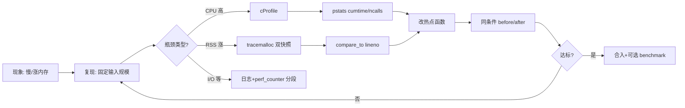
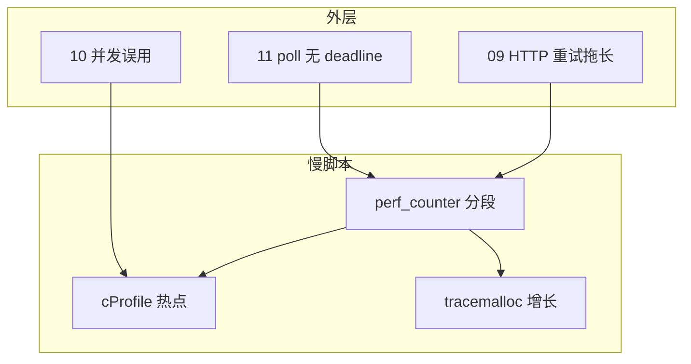

# 13｜性能与内存排查 · SRE 开发能力

> 大家好，欢迎来到这次分享。开讲之前，先带大家回到一个很多值班同学都踩过的现场：
> 巡检脚本从 30 秒涨到 8 分钟，同事说「加机器」；`top` 看 Python 进程 RSS 2 GB，却不知道是 list 缓存还是 SDK 响应体没释放；有人上来就 `pip install py-spy` 在生产 attach——**运维脚本的性能问题，80% 是「没量过就猜」：先 cProfile 找 CPU 热点，再 tracemalloc 找内存增长点，最后才改代码**。
> 这一章讲完，你会知道当时那几个人各自错在哪——没量过就猜、迷信 getsizeof、生产乱 attach：先 cProfile / tracemalloc，再改代码。
> **本章回答的问题**：一次「脚本变慢 / 内存涨」从复现、采样 profiling、定位热点、验证修复到回归门禁的完整链路。
> **本章不讲**：多进程/GIL 并发模型 → [10 并发与GIL](../10-并发与GIL/)；HTTP 重试拖慢 → [09 HTTP客户端与重试](../09-HTTP客户端与重试/)；宿主机 CPU/内存 → [01-基础底座/06-CPU与Load](../../../01-基础底座/06-CPU与Load/)。

**怎么听这场分享**：先把「cProfile / tracemalloc 排查一生」主图装进脑子——复现 → 粗定位 → CPU/内存分支 → 验证回归；放慢 cumtime 与 snapshot 对比；作战节回到开头那个慢脚本 / OOM 现场。每一节讲完会提示对应练习题，趁热打铁。

## 面试怎么考

| 标记 | 考点 |
|------|------|
| **核心** | cProfile 找 CPU 热点；tracemalloc 对比快照找泄漏；先量后改 |
| **必会** | `python -m cProfile`；`pstats` 排序；`tracemalloc.start/snapshot` |
| **常用** | `time.perf_counter` 粗测；`memory_profiler`；生产只采样、不全量 |
| **常考** | cProfile 开销；`getsizeof` 陷阱；profile 与 benchmark 区别 |

**30 秒怎么说**：脚本慢先 **复现 + 固定输入规模**，用 **`python -m cProfile -o out.prof script.py`** 或上下文包一层，**`pstats` 按 `cumtime` 排序**找累计耗时函数。内存涨用 **`tracemalloc`**：起点 snapshot → 跑一轮 → 再 snapshot → **`compare_to` 看 top diff**。修完用同样输入 **before/after 对比**，别只靠感觉。生产环境 **不全量 attach**，用采样或离线复现。

---

## 能力边界

| 维度 | cProfile | tracemalloc | py-spy / eBPF |
|------|----------|-------------|---------------|
| **适合** | CPU 热点、调用次数 | 内存分配增长、泄漏嫌疑 | 生产进程、无法改代码 |
| **不适合** | I/O 等待占比（会误导） | C 扩展内部分配细节 | 需要 root/权限 |
| **契约** | 函数级开销 | Python 层分配栈 | 采样、非侵入 |

| 机制 | 管什么 | 不管什么 |
|------|--------|----------|
| cProfile | 哪段 Python 代码耗 CPU | 内核/磁盘慢 |
| tracemalloc | 哪行分配了更多内存 | 进程外 RSS 碎片 |
| perf_counter | 端到端粗计时 | 函数级分解 |

> ⚠️ **记住**：**没 profile 就改算法 = 值班赌博**。

---

## 语言最小集

| 零件 | 示例 | 含义 |
|------|------|------|
| cProfile | `python -m cProfile -o a.prof main.py` | 写 stats 文件 |
| pstats | `p.sort_stats('cumtime').print_stats(20)` | 读 stats |
| profile 上下文 | `cProfile.Profile().runcall(fn, *a)` | 包函数 |
| tracemalloc | `tracemalloc.start(); snap=tracemalloc.take_snapshot()` | 堆快照 |
| compare | `snap2.compare_to(snap1, 'lineno')` | 增量对比 |
| perf_counter | `time.perf_counter()` | 高精度计时 |
| @profile | `kernprof -l -v script.py` | 行级 CPU（第三方） |
| gc | `gc.collect()` | 测泄漏前强制回收 |

```python
import cProfile
import pstats
import io

def profile_call(fn, *args, **kwargs):
    pr = cProfile.Profile()
    pr.enable()
    try:
        return fn(*args, **kwargs)
    finally:
        pr.disable()
        s = io.StringIO()
        ps = pstats.Stats(pr, stream=s).sort_stats("cumtime")
        ps.print_stats(30)
        print(s.getvalue())
```

---

## 一、一张图：cProfile / tracemalloc 排查的一生

> 🎯 **一句话**：**复现 → 粗计时确认瓶颈类型 → CPU 用 cProfile / 内存用 tracemalloc → 读 top 热点 → 改代码 → 同输入回归对比 → 可选 CI 门禁**。



**读图**：**C** 分叉最关键——对 I/O 脚本跑 cProfile 只会看到 `sleep/read` 顶部，要换分段计时或看网络/磁盘。**J** 必须用与 **B** 相同的数据量，否则对比无效。


好，主图装进脑子了。接下来从「复现」开始——问题不可重复，后面全是玄学。

本节对应练习题 Q13。

---

## 二、出生：复现与粗定位（🔥必会）

> 🎯 **一句话**：**先让问题可重复，再用 `perf_counter` 分段，判断是 CPU、内存还是 I/O**。

大家想想：脚本变慢，第一步是什么？很多人会答「加机器 / 上火焰图」——错了。🔥 先复现、粗分段，再决定走 cProfile 还是 tracemalloc。

```python
import time

def timed_sections():
    t0 = time.perf_counter()
    data = load_config()          # 段 1
    t1 = time.perf_counter()
    rows = fetch_all_pods()       # 段 2 — 常是 I/O
    t2 = time.perf_counter()
    report = aggregate(rows)        # 段 3 — 常是 CPU
    t3 = time.perf_counter()
    write_report(report)            # 段 4
    t4 = time.perf_counter()
    log.info(
        "timing load=%.2fs fetch=%.2fs agg=%.2fs write=%.2fs total=%.2fs",
        t1 - t0, t2 - t1, t3 - t2, t4 - t3, t4 - t0,
    )
```

| 信号 | 倾向 | 下一步 |
|------|------|--------|
| fetch 段占 90% | I/O / API | 分页、缓存、并发限流（10 章） |
| agg 段 CPU 100% | 纯 Python 算 | cProfile |
| RSS 涨、CPU 不高 | 内存 | tracemalloc |
| 跑一次快、跑十遍崩 | 泄漏/缓存无界 | tracemalloc + 弱引用检查 |

```bash
# 粗看进程资源（宿主机视角，非本章重点但值班第一步）
/usr/bin/time -v python scripts/audit.py 2>&1 | grep -E 'User time|Maximum resident'
# Maximum resident set size (kbytes): 2147328  ← RSS 峰值约 2.1 GB
```

> 📝 **面试**：「我会先分段计时，避免把 list 全量加载当成算法慢。」


粗定位讲完。大家想想：第一步是不是装 py-spy？很多人会答「对」——错了，先让问题可重复。

本节对应练习题 Q1。

---

## 三、成长：cProfile 找 CPU 热点（⭐常考）

⭐ 这是面试必考。口诀：**cumtime 看总账，tottime 看自己**。顶部全是 `socket.read` / `sleep`，别再优化 Python 循环——瓶颈在等。

> 🎯 **一句话**：**`cumtime` 看累计耗时，`ncalls` 看调用次数爆炸，优先优化「高频小函数」和「低频巨函数」**。

### 命令行一键

```bash
python -m cProfile -o audit.prof scripts/audit.py --namespace prod
python -c "
import pstats
p = pstats.Stats('audit.prof')
p.strip_dirs().sort_stats('cumtime').print_stats(25)
"
```

典型输出（节选）：

```text
   ncalls  tottime  percall  cumtime  percall filename:lineno(function)
        1    0.002    0.002  412.150  412.150 audit.py:88(main)
        1    0.015    0.015  398.200  398.200 audit.py:42(fetch_all_pods)
   500000    2.100    0.000  380.500    0.001 audit.py:15(normalize_label)
```

读法：`fetch_all_pods` **cumtime** 高 → 先怀疑 I/O；若其内部 `normalize_label` **ncalls=500000** → CPU 热点在循环里重复调用。

### 代码内包裹

```python
import cProfile
import pstats
from pathlib import Path

def run_with_profile(main_fn, out: Path) -> int:
    prof = cProfile.Profile()
    prof.enable()
    try:
        return main_fn()
    finally:
        prof.disable()
        prof.dump_stats(out)
        stats = pstats.Stats(prof).sort_stats("cumtime")
        stats.print_stats(20)
```

### 可视化（常用）

```bash
pip install snakeviz
snakeviz audit.prof   # 浏览器看调用树
```

> ⚠️ **别混**：**`tottime`** 是函数自身耗时（不含子调用）；**`cumtime`** 含子调用——优化入口通常先看 **cumtime**。

> 💡 **打个比方**：cProfile 像账单明细：不仅看谁最贵（cumtime），还要看谁被刷了五千次（ncalls）。

### profile 开关（生产友好）

```python
import os

def maybe_profile(fn):
    if os.environ.get("ENABLE_PROFILE") != "1":
        return fn()
    return run_with_profile(fn, Path("/tmp/audit.prof"))
```

> 📝 **面试**：「cProfile 有 5%～15% 量级开销，离线或 staging 跑全量；生产用环境变量开关。」


cProfile 讲完。记住口诀：**先看 cumtime，再看 tottime**；顶部全是 read/sleep 别空优化循环。

本节对应练习题 Q2、Q3、Q4。

---

## 四、壮年：tracemalloc 找内存增长（🔥难点）

> 🎯 **一句话**：**两次 snapshot 之间跑完 suspect 路径，`compare_to` 按 lineno 排序，看哪一行多分配了多少 KB**。

大家想想：RSS 2GB，`getsizeof(list)` 却很小——说明什么？很多人会答「泄漏在 C 扩展里没法查」——不一定。🔥 **tracemalloc** = 给分配盖邮戳，看哪一行多寄了包裹；`getsizeof` 只量外壳。

```python
import tracemalloc

def diagnose_memory(work):
    tracemalloc.start(25)  # 25 帧栈，默认 1
    snap1 = tracemalloc.take_snapshot()
    work()
    snap2 = tracemalloc.take_snapshot()

    top = snap2.compare_to(snap1, "lineno")
    for stat in top[:15]:
        print(stat)
        # audit.py:42: +48.2 MiB  ← 这一行是增长冠军
```

```python
# 打印某条 stat 的分配栈
for frame in top[0].traceback:
    print(frame)
```

### 与 gc 配合（⭐常考）

```python
import gc

def memory_after_work(work):
    gc.collect()
    tracemalloc.start()
    s1 = tracemalloc.take_snapshot()
    work()
    gc.collect()
    s2 = tracemalloc.take_snapshot()
    return s2.compare_to(s1, "lineno")
```

> ⚠️ **别混**：**`sys.getsizeof(obj)`** 只算对象头，不算引用的元素——`getsizeof([None]*10**6)` 远小于真实 RSS。

> 💡 **打个比方**：tracemalloc 是「进货单对比」：不关心仓库货架多乱（碎片），只关心哪条产线多进了货。

### 常见运维脚本内存模式

| 模式 | 典型代码 | 修法 |
|------|----------|------|
| 全量 list | `items = list(api.paginate())` | 改生成器 + 流式写 |
| 缓存无界 | `CACHE[key] = huge` | LRU + TTL |
| 字符串拼接 | `s += chunk` in loop | `io.StringIO` / `join` |
| 重复 json | `json.loads` 在热循环 | 解析一次、传 dict |
| 全局列表 append | 模块级 `RESULTS` | 函数内 yield / 写文件 |

```python
# 反例：分页 API 却攒全量
all_pods = []
for page in paginate_pods():
    all_pods.extend(page)  # RSS 随集群规模线性涨
```

```python
# 正例：流式处理
def iter_audit_rows(pages):
    for page in pages:
        for pod in page:
            yield normalize(pod)
```


tracemalloc 讲完。🔥 大白话：两次快照比差额，比盯 RSS 瞎猜有用。

本节对应练习题 Q5、Q6。

---

## 五、老去：行级与外部工具（常用）

> 🎯 **一句话**：**函数级不够时用 line_profiler；生产不能改代码时用 py-spy 采样**。

### line_profiler（开发机）

```bash
pip install line_profiler
# 在热点函数上加 @profile 后：
kernprof -l -v audit.py
```

输出标出每行 **Hits / Time**，适合 `normalize_label` 这种小函数在百万次循环里磨 CPU。

### memory_profiler（粗看函数 RSS）

```python
from memory_profiler import profile

@profile
def aggregate(rows):
    ...
```

```bash
python -m memory_profiler audit.py
# Line #    Mem usage    Increment  Occurrences   Line Contents
```

> ⚠️ **别混**：**memory_profiler** 看的是进程 RSS 采样近似；**tracemalloc** 看 Python 分配栈——泄漏排查优先 tracemalloc。

### py-spy（🔧实操，生产只采样）

```bash
py-spy record -o flame.svg --pid {PID} --duration 30
py-spy top --pid {PID}
```

需要权限；适合 CronJob 容器里已在跑的僵死脚本，**不重启、不改代码**。


外部工具讲完。生产卡住再谈采样；默认路径仍是改代码前先本地 profile。

本节对应练习题 Q8、Q9。

---

## 六、死亡：验证修复与回归（🔥必会）

> 🎯 **一句话**：**同一输入、同一环境变量，对比 wall time + peak RSS + profile 顶部是否消失**。

```python
import time
import tracemalloc

def benchmark(fn, label: str) -> None:
    tracemalloc.start()
    t0 = time.perf_counter()
    fn()
    elapsed = time.perf_counter() - t0
    _, peak = tracemalloc.get_traced_memory()
    tracemalloc.stop()
    print(f"{label}: elapsed={elapsed:.2f}s peak_traced={peak/2**20:.1f}MiB")
```

```bash
# 修复前后各跑一次，保存 prof 对比
ENABLE_PROFILE=1 python scripts/audit.py
mv audit.prof audit.after.prof
# 用 pstats 或 snakeviz 肉眼看 normalize_label 是否退出 top5
```

| 验收项 | 通过标准 |
|--------|----------|
| wall time | 同数据集下降 ≥ 预期比例 |
| cumtime top | 原热点函数退出前三 |
| tracemalloc diff | 增长行消失或降幅明显 |
| 正确性 | 输出 hash / 行数一致 |

> 📝 **面试**：「优化必须带回归：输出一致 + 指标对比，不只跑一遍觉得快了。」


回归讲完。⭐ 没对比数据的「优化」等于没做。

本节对应练习题 Q10、Q11。

---

## 七、收束：与 09/10/11 串联



**可背清单（六件套）**：

- 先复现 + 分段，分清 CPU / I/O / 内存
- CPU：`cProfile` + `cumtime` / `ncalls`
- 内存：双 snapshot + `compare_to('lineno')`
- 不信 `getsizeof`；大对象看 tracemalloc 栈
- 修完同输入 before/after
- 生产：环境变量开关 profile，或 py-spy 采样


串联讲完：慢可能是重试、并发选型或等待策略——别只怪 Python。

本节对应练习题 Q7。

---

## 八、作战：慢脚本、OOM、误 profile（⭐常考）

**现象 · 先做 · 别做**

| 现象 | 先做 | 别做 |
|------|------|------|
| CronJob 超时 | `time -v` + 分段日志 | 直接加副本数 |
| RSS 线性涨 | tracemalloc diff | 只 restart Pod |
| CPU 100% | cProfile top | 盲目 `multiprocessing` |
| 本地快线上慢 | 对齐数据规模 | 说「我机器快」 |
| 生产卡死 | py-spy 30s 采样 | 全量 cProfile 常驻 |

**60 秒剧本** 🔧：

| 时段 | 动作 |
|------|------|
| 0–10s | `kubectl logs` / 脚本日志看哪一段最慢 |
| 10–25s | staging 同参数复现 + `perf_counter` 分段 |
| 25–40s | CPU → `cProfile`；内存 → `tracemalloc` |
| 40–60s | 读 top1 函数/行，提 PR 或 hotfix |

```bash
/usr/bin/time -v python scripts/audit.py --namespace prod 2>&1 | tail -20
python -m cProfile -s cumtime scripts/audit.py --namespace staging 2>&1 | head -30
```

---

本节对应练习题 Q12。

现在再看群里那句「加机器 / 直接 py-spy attach」，你知道该怎么拦住他了——先复现、再分 CPU/内存、最后才动生产。下面是可复制的生产模板（代码块一字不改，直接拿走）。

## 生产模板

### 模板 1：可开关 cProfile 的 main

```python
def main() -> int:
  if os.environ.get("ENABLE_PROFILE") == "1":
      return run_with_profile(_main_impl, Path(os.environ.get("PROFILE_OUT", "run.prof")))
  return _main_impl()

def _main_impl() -> int:
    ...
```

### 模板 2：tracemalloc 诊断入口

```python
def debug_memory(fn):
    import tracemalloc, gc
    gc.collect()
    tracemalloc.start(25)
    s1 = tracemalloc.take_snapshot()
    fn()
    gc.collect()
    s2 = tracemalloc.take_snapshot()
    for i, stat in enumerate(s2.compare_to(s1, "lineno")[:10], 1):
        log.warning("mem_diff #%s %s", i, stat)
```

### 模板 3：流式替代全量 list

```python
def audit_namespace(v1, ns: str):
    for pod in iter_pods_paginated(v1, ns, limit=200):
        yield row_from_pod(pod)
```

### 模板 4：benchmark 钩子（CI 可选）

```python
def regression_gate():
    benchmark(lambda: run_audit(fixture_ns="small"), "small_ns")
    # 超阈值 fail：供 14 章 pytest 调用
```

---

## 踩坑清单 🔥

| 现象 | 原因 | 修法 |
|------|------|------|
| profile 显示 main 最慢 | 没 strip_dirs / 看子函数 | 展开 callees |
| 优化后仍慢 | 瓶颈在 I/O | 09 分页/连接池 |
| tracemalloc 无输出 | 未 start | `tracemalloc.start()` |
| 泄漏测不出 | 未 `gc.collect()` | 对比前后强制回收 |
| snakeviz 空白 | prof 路径错 | 检查 dump 路径 |
| 生产 attach 崩 | py-spy 权限 | 只采样、先审批 |
| 误判 getsizeof | 不含嵌套对象 | tracemalloc |
| 一次跑太小 | 数据规模不对 | 用生产级 fixture |

> 🔍 **排查信号**：cProfile 顶部全是 `socket.read` / `time.sleep` → 瓶颈在 I/O，不是 Python 循环——换思路去 09 减调用次数或分页。

---

## 必会 · 常考 ⭐

| 说法 | 对错 | 口径 |
|------|:----:|------|
| 先 profile 再改 | 对 | 避免瞎优化 |
| cumtime 含子调用 | 对 | 入口优化 |
| cProfile 适合查磁盘慢 | 错 | I/O 等在 cumtime 里不直观 |
| tracemalloc 能看 C 扩展内部分配 | 部分 | 主要看 Python 层 |
| getsizeof 等于对象真实占用 | 错 | 不含容器元素 |
| py-spy 要改代码 | 错 | attach 采样 |
| 修复要同输入对比 | 对 | before/after |
| ENABLE_PROFILE 环境变量 | 对 | 生产默认关 |

---

## 命令速查 🔧

```bash
# CPU
python -m cProfile -s cumtime script.py
python -m cProfile -o run.prof script.py
python -c "import pstats; pstats.Stats('run.prof').sort_stats('cumtime').print_stats(20)"

# 内存（一次性脚本内 start 更合适）
PYTHONTRACEMALLOC=1 python script.py

# 系统级粗测
/usr/bin/time -v python script.py

# 生产采样
py-spy top --pid $(pgrep -f audit.py)
```

### profile 与 benchmark 分工（⭐常考）

| 工具 | 回答的问题 |
|------|------------|
| cProfile | **哪段代码**耗 CPU |
| tracemalloc | **哪行**多分配 |
| perf_counter | **端到端**多久 |
| pytest-benchmark（14 章） | **回归**是否变慢 |

> ⚠️ **别混**：benchmark 测**趋势**；profile 测**一次运行的结构**。CPU 纯 Python 热点再考虑 [10 并发与GIL](../10-并发与GIL/)；顶部是 `read/recv` 则减 I/O 调用。

---

## 面试锚点

遮住右列自问自答，卡壳的行回去重读对应小节——能讲出来才算会，看着答案点头不算。

| 问 | 30 秒答 |
|----|---------|
| 脚本变慢第一步？ | 复现 + 分段计时，分 CPU/I/O/内存 |
| cProfile 看哪列？ | cumtime 累计，ncalls 次数 |
| 怎么查内存涨？ | tracemalloc 双快照 compare_to |
| getsizeof 为何不准？ | 不含容器内元素 |
| 生产能全量 profile 吗？ | 默认否；开关或 py-spy 采样 |
| 优化怎么验收？ | 同输入 before/after + 输出一致 |

---

## 合上书，问自己

学到这里，先别急着翻下一章。合上书，试试下面这几件事能不能做到——能做到，这章才算真的听懂了。卡住的那一条，就回到对应的小节再听一遍：

- [ ] 画出「cProfile/tracemalloc 排查一生」主图，标 CPU/I/O 分叉。（对应练习题 Q13）
- [ ] `cumtime` 与 `tottime` 区别？（Q2）
- [ ] tracemalloc 标准三步？（Q5）
- [ ] 为何不信 `getsizeof`？（Q6）
- [ ] 全量 list API 结果会怎样？怎么改？（Q7）
- [ ] cProfile 与 py-spy 适用场景？（Q8、Q9）
- [ ] 修复后如何回归？（Q10）
- [ ] 与 09/10/11 如何分工？（知识点第七节）

全部打勾之后，给自己出一个终极测试：找一位同事，十分钟讲清「开头那个 30 秒变 8 分钟现场，你怎么量、怎么证」。讲得下来，你就是下一个能拦住「没量先改」的人。

八题能口述，性能与内存排查就过关了。守门测试见 [14 测试与类型标注](../14-测试与类型标注/)。
