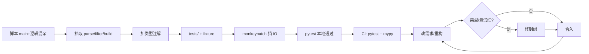
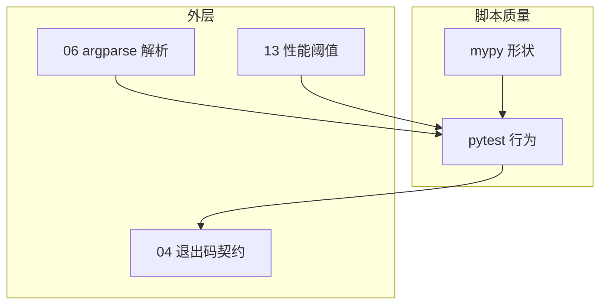

# 14｜测试与类型标注 · SRE 开发能力

> 发布脚本改了一行 `namespace` 默认值，周五晚上把 prod 巡检跑成 staging；同事 PR 里全是 `Any`，mypy 报错被 `# type: ignore` 糊过去；CI 没有 pytest，只能靠「我本地跑过了」——**运维脚本的可维护性靠两件事：pytest 锁住行为，type hints 锁住数据形状**。
> **本章回答**：一个运维脚本从写第一个测试、加类型、mock 外部依赖、进 CI 到重构不怕炸的完整链路。
> **本章不讲**：logging 规范 → [05 logging日志规范](../05-logging日志规范/)；argparse → [06 argparse与配置管理](../06-argparse与配置管理/)；性能回归阈值 → [13 性能与内存排查](../13-性能与内存排查/)。

## 面试怎么考

| 标记 | 考点 |
|------|------|
| **核心** | pytest 结构；fixture；`monkeypatch` mock 环境；类型让重构可搜 |
| **必会** | `test_` 命名；`assert`；`pytest.raises`；`list[str]` / `Optional` |
| **常用** | `@pytest.mark.parametrize`；`tmp_path`；`caplog`；`mypy` / `pyright` |
| **常考** | 测什么不测什么；mock 边界；TypedDict vs dict |

**30 秒怎么说**：运维脚本把 **纯逻辑抽函数**（解析、过滤、拼报告），用 **pytest + fixture 假数据** 测；IO/SDK 用 **`monkeypatch` 或注入依赖**，不真打 API。类型用 **`def fn(hosts: list[str]) -> int`**，复杂结构用 **TypedDict / Protocol**。CI 跑 **`pytest` + `mypy`**，失败非 0。不测「kubectl 真连集群」，测 **你的决策与输出格式**。

---

## 能力边界

| 维度 | pytest 单测 | 集成测 | 手工 smoke |
|------|-------------|--------|------------|
| **适合** | 解析、规则、退出码逻辑 | staging 真 API（少） | 发版前一条命令 |
| **不适合** | 替代 oncall 判断 | 每次 PR 打 prod | 替代单测 |
| **契约** | 快、确定、无网络 | 慢、要环境 | 人触发 |

| 机制 | 管什么 | 不管什么 |
|------|--------|----------|
| pytest | 行为回归 | 集群真实状态 |
| type hints | 形状与 IDE | 运行时强制（默认） |
| mypy | 静态类型错误 | 业务正确性 |

> ⚠️ **记住**：**没测试的脚本 = 下次改 namespace 的定时炸弹**。

---

## 语言最小集

| 零件 | 示例 | 含义 |
|------|------|------|
| test 函数 | `def test_parse():` | 自动发现 |
| assert | `assert exit_code == 0` | 失败即红 |
| fixture | `@pytest.fixture def pods():` | 复用 setup |
| monkeypatch | `monkeypatch.setenv("NS", "x")` | 改 env/属性 |
| parametrize | `@pytest.mark.parametrize("n", [0,1])` | 多组输入 |
| raises | `pytest.raises(ValueError)` | 期望异常 |
| tmp_path | `def test_f(tmp_path):` | 临时目录 |
| caplog | `caplog.at_level(logging.ERROR)` | 断言日志 |
| list[str] | Python 3.9+ 内置泛型 | 参数类型 |
| TypedDict | `class Row(TypedDict):` | 字典形状 |

```python
# pyproject.toml 片段
[tool.pytest.ini_options]
testpaths = ["tests"]
pythonpath = ["."]

[tool.mypy]
python_version = "3.11"
strict = false
warn_return_any = true
```

---

## 一、一张图：pytest 与 type hints 在运维脚本里的一生

> 🎯 **一句话**：**抽纯函数 → 写类型签名 → 写 pytest（fixture/mock）→ 本地绿 → CI pytest+mypy → 重构改类型即报错 → 长期维护**。



**读图**：**B** 是可测性的前提——`main()` 里 200 行无法测。**E** 保证测试不依赖真集群。**H→I** 是类型+测试的价值：改字段名，mypy 和 assert 同时提醒你。

---

## 二、出生：可测结构（🔥必会）

> 🎯 **一句话**：**`main` 只做编排；业务逻辑进无 IO 的纯函数，签名带类型**。

```python
from __future__ import annotations

from dataclasses import dataclass
from typing import TypedDict

class PodRow(TypedDict):
    name: str
    namespace: str
    ready: bool

@dataclass(frozen=True)
class AuditConfig:
    namespaces: list[str]
    min_ready_ratio: float

def filter_unready(rows: list[PodRow], cfg: AuditConfig) -> list[PodRow]:
    bad = [r for r in rows if not r["ready"]]
    if not bad:
        return []
    ratio = 1 - len(bad) / max(len(rows), 1)
    if ratio < cfg.min_ready_ratio:
        return bad
    return []

def main(argv: list[str] | None = None) -> int:
    cfg = load_config(argv)
    rows = fetch_rows(cfg)   # IO 边界
    bad = filter_unready(rows, cfg)
    if bad:
        report(bad)
        return 1
    return 0
```

| 层 | 职责 | 测试策略 |
|----|------|----------|
| 纯函数 | 规则、解析、格式化 | 直接 assert |
| IO 边界 | HTTP/K8s/文件 | mock 或 fake |
| main | 拼流程、退出码 | 少量集成式 mock |

> 📝 **面试**：「能测的是你的规则，不是 apiserver 真返回什么。」

---

## 三、成长：pytest 基础（⭐常考）

> 🎯 **一句话**：**`tests/test_*.py` 里 `test_` 函数 + assert；一个行为一个测试**。

```python
# tests/test_filter.py
from audit import AuditConfig, PodRow, filter_unready

def test_all_ready_returns_empty():
    rows: list[PodRow] = [
        {"name": "a", "namespace": "ns", "ready": True},
    ]
    cfg = AuditConfig(namespaces=["ns"], min_ready_ratio=0.9)
    assert filter_unready(rows, cfg) == []

def test_below_ratio_returns_bad():
    rows: list[PodRow] = [
        {"name": "ok", "namespace": "ns", "ready": True},
        {"name": "bad", "namespace": "ns", "ready": False},
    ]
    cfg = AuditConfig(namespaces=["ns"], min_ready_ratio=0.9)
    bad = filter_unready(rows, cfg)
    assert len(bad) == 1
    assert bad[0]["name"] == "bad"
```

```bash
pytest -q
# ..                                                                       [100%]
# 2 passed in 0.03s
```

### pytest.raises（必会）

```python
import pytest
from audit import parse_ratio

def test_parse_ratio_rejects_invalid():
    with pytest.raises(ValueError, match="ratio"):
        parse_ratio("1.5")
```

### 运行与发现（🔧实操）

```bash
pytest tests/test_filter.py::test_all_ready_returns_empty -v
pytest -k "ratio" -v
pytest --tb=short
```

> ⚠️ **别混**：unittest 的 `self.assertEqual` 也能跑，但新项目 **pytest 风格**更简洁——不要混两套 assert 风格在同一仓库。

---

## 四、壮年：fixture 与 mock（🔥难点）

> 🎯 **一句话**：**fixture 供给假数据；`monkeypatch` 替换 env、函数、属性，让 main 不触网**。

### fixture

```python
import pytest
from audit import PodRow

@pytest.fixture
def sample_rows() -> list[PodRow]:
    return [
        {"name": "api-1", "namespace": "prod", "ready": True},
        {"name": "api-2", "namespace": "prod", "ready": False},
    ]

def test_report_count(sample_rows):
    assert len(sample_rows) == 2
```

### monkeypatch 挡 IO（⭐常考）

```python
def test_main_returns_1_when_unready(monkeypatch, sample_rows):
    monkeypatch.setattr("audit.fetch_rows", lambda cfg: sample_rows)
    monkeypatch.setattr("audit.report", lambda bad: None)

    assert main([]) == 1
```

```python
def test_main_respects_namespace_env(monkeypatch):
    monkeypatch.setenv("NAMESPACE", "staging")
    monkeypatch.setattr("audit.load_config", lambda argv: ...)
    ...
```

> 💡 **打个比方**：fixture 是「排练用的假道具」；monkeypatch 是「把真电话线拔掉，换成录音」。

### tmp_path 与 caplog（常用）

```python
def test_write_report_creates_file(tmp_path):
    out = tmp_path / "report.txt"
    write_report([{"name": "x"}], out)
    assert "x" in out.read_text()

def test_main_logs_error(caplog, monkeypatch):
    monkeypatch.setattr("audit.fetch_rows", lambda c: (_ for _ in ()).throw(RuntimeError("api")))
    with caplog.at_level("ERROR"):
        code = main([])
    assert code == 1
    assert "api" in caplog.text
```

### parametrize（常用）

```python
@pytest.mark.parametrize(
    "ratio,ok",
    [("0.0", True), ("1.0", True), ("-0.1", False), ("2", False)],
)
def test_parse_ratio(ratio, ok):
    if ok:
        assert parse_ratio(ratio) == float(ratio)
    else:
        with pytest.raises(ValueError):
            parse_ratio(ratio)
```

> 📝 **面试**：「不测 boto3 真调 AWS，测传入 ClientError 时你的退出码和日志。」

---

## 五、老去：类型标注与静态检查（⭐常考）

> 🎯 **一句话**：**参数和返回值都标；容器用 `list[str]`；JSON 形字典用 TypedDict；可选 `X | None`**。

```python
from __future__ import annotations

def parse_hosts(raw: str) -> list[str]:
    return [h.strip() for h in raw.split(",") if h.strip()]

def lookup_zone(host: str, zones: dict[str, str]) -> str | None:
    return zones.get(host)

class Event(TypedDict):
    ts: str
    level: str
    msg: str

def worst_level(events: list[Event]) -> str:
    ...
```

### mypy / pyright

```bash
mypy audit.py tests/
# Success: no issues found in 2 source files

pyright audit.py
```

```python
# 渐进式：暂时搞不定的边界
def legacy_fetch() -> list[dict[str, object]]:  # 逐步收窄到 TypedDict
    ...
```

| 写法 | 何时用 |
|------|--------|
| `str` / `int` | 基础 |
| `list[str]` | 同质列表 |
| `str \| None` | 可选 |
| `TypedDict` | 固定 key 的 dict |
| `Protocol` | 鸭子类型接口（fake client） |
| `Literal["ok","fail"]` | 枚举字符串 |

> ⚠️ **别混**：**type hints 默认不在运行时强制**——要运行时校验用 pydantic（本章不展开）；mypy 是静态检查。

> ⚠️ **别混**：**不要用 `Any` 逃避**——实在未知用 `object` 再收窄，比满屏 Any 强。

### Protocol 注入依赖（常用）

```python
class PodLister(Protocol):
    def list_pods(self, namespace: str) -> list[PodRow]: ...

class FakeLister:
    def list_pods(self, namespace: str) -> list[PodRow]:
        return [{"name": "p", "namespace": namespace, "ready": True}]

def test_audit_ok():
    assert audit(FakeLister(), cfg) == 0
```

比 MagicMock 更类型安全；老代码可先用 monkeypatch。

---

## 六、死亡：CI 门禁与覆盖率（🔥必会）

> 🎯 **一句话**：**PR 必跑 `pytest` + `mypy`；可选 coverage 下限；与 [04 异常与退出码](../04-异常与退出码/) 一致测退出码**。

```yaml
# CI 最少：pytest + mypy；integration 标记默认跳过
- run: pytest -q --cov=audit --cov-fail-under=70
- run: mypy audit.py
```

| 测 | 不测 |
|----|------|
| 解析/过滤/格式化 | 真 K8s 集群 |
| 给定输入的退出码 | 网络延迟 |
| 日志是否含关键字段 | 全量 E2E（另管道） |

### 与 13 章性能回归（常用）

```python
def test_audit_small_fixture_under_budget():
    rows = make_rows(100)
    t0 = time.perf_counter()
    filter_unready(rows, cfg)
    assert time.perf_counter() - t0 < 0.5
```

> 📝 **面试**：「CI 里用固定规模 fixture 卡耗时，不是测 apiserver。」

---

## 七、收束：与 04/06/13 串联



**可背清单（六件套）**：

- 纯函数 + 类型签名可测
- fixture 假数据，monkeypatch 挡 IO
- 测退出码与异常分支
- TypedDict / Protocol 代替裸 dict
- CI：pytest + mypy
- 不测真集群；E2E 另管道

---

## 八、作战：没测试的 PR、类型全 Any、CI 红

**现象 · 先做 · 别做**

| 现象 | 先做 | 别做 |
|------|------|------|
| 改一行炸 prod | 补核心路径 pytest | 只靠人工 smoke |
| mypy 200 错 | 从新代码 strict | 全文件 `# type: ignore` |
| 测试要真集群 | monkeypatch / Fake | 把 kubeconfig 塞 CI |
| flaky 测试 | 去掉 sleep 依赖时间 | 重试 10 次碰运气 |
| 覆盖率低 | 先盖解析与退出码 | 追求 100% 刷指标 |

**60 秒剧本** 🔧：

| 时段 | 动作 |
|------|------|
| 0–10s | `pytest -q` 看挂哪 |
| 10–25s | 读失败 assert / caplog |
| 25–40s | `mypy` 看类型是否字段改名漏改 |
| 40–60s | 补 fixture 或收窄 TypedDict |

```bash
pytest tests/test_main.py -vv --tb=long
mypy audit.py --show-error-codes
```

---

## 生产模板

### 模板 1：目录布局

```text
ops_audit/
  audit.py          # 逻辑 + main
  pyproject.toml
  tests/
    conftest.py     # 共享 fixture
    test_filter.py
    test_main.py
```

### 模板 2：conftest.py

```python
import pytest
from audit import PodRow

@pytest.fixture
def pod_factory():
    def _make(name: str, ready: bool = True, ns: str = "prod") -> PodRow:
        return {"name": name, "namespace": ns, "ready": ready}
    return _make
```

### 模板 3：main 可导入测

```python
# audit.py 末尾
if __name__ == "__main__":
    raise SystemExit(main())

# tests/test_main.py
from audit import main
```

---

## 踩坑清单 🔥

| 现象 | 原因 | 修法 |
|------|------|------|
| 测试触真 API | 未 mock fetch | monkeypatch |
| 顺序依赖失败 | 共享全局状态 | fixture + 无全局 |
| mypy 报 import | 缺 stubs | `pip install types-xxx` |
| TypedDict 多 key | 拼写错误 | mypy 抓 |
| caplog 空 | level 不对 | `at_level` |
| CI 无 pytest | 未装 dev 依赖 | `extras_require` |
| 过度 mock | 测实现细节 | 测输入输出 |
| `# type: ignore` 泛滥 | 逃避 | 逐条修 |
| 过度 mock | 测实现细节 | 测输入输出 |
| parametrize case 不可读 | 无 ids | 加 `ids=` |

> 🔍 **排查信号**：CI 里 mypy 报 200+ 错误全是 `Any` 返回值——说明旧代码从未标注过类型，新代码应从 strict 开始渐进收窄。

---

## 易错一句话对照 🔥

| 说法 | 一句话纠正 |
|------|------------|
| 「运维脚本不用测」 | 纯逻辑改一行可能炸 prod，必须测 |
| 「type hints 运行时校验」 | 默认不校验；要校验用 pydantic |
| 「mock 越多越好」 | 测输入输出，不测实现细节 |

---

## 必会 · 常考 ⭐

| 说法 | 对错 | 口径 |
|------|:----:|------|
| 运维脚本也要单测 | 对 | 至少纯函数 |
| pytest 要打真集群 | 错 | mock IO |
| type hints 运行时强制 | 错 | 默认不强制 |
| TypedDict 描述 JSON 行 | 对 | 固定 key |
| 只测 happy path | 错 | 异常/退出码也要 |
| monkeypatch 可改 env | 对 | 隔离环境 |
| mypy 与 pytest 互补 | 对 | 形状 vs 行为 |
| 100% coverage 必须 | 错 | 关键路径优先 |

---

## 命令速查 🔧

```bash
# 测试
pytest
pytest -q -k filter
pytest --lf          # 只跑上次失败
pytest -x            # 首个失败即停

# 类型
mypy .
pyright

# 覆盖率
pytest --cov=audit --cov-report=term-missing

# 初始化（示例）
pip install pytest mypy pytest-cov
```

`conftest.py` 放共享 fixture；集成测标 `@pytest.mark.integration` 默认跳过，PR 不跑 kubeconfig 用例。

**类型演进（⭐常考）**：新函数全标注 → 旧代码碰到补返回值 → JSON 用 TypedDict → SDK 用 Protocol → 禁止新增裸 `Any`。

---

## 面试锚点

| 问 | 30 秒答 |
|----|---------|
| 运维脚本测什么？ | 纯逻辑、退出码、异常；IO mock |
| 如何让 main 可测？ | 抽函数 + monkeypatch 边界 |
| fixture vs mock？ | fixture 准备数据；mock 替换调用 |
| TypedDict 干啥？ | 固定 dict key 类型 |
| mypy 解决啥？ | 静态类型错误、重构安全 |
| CI 最少啥？ | pytest + mypy |

---

## 合上书，问自己

- [ ] 画「pytest 与类型在脚本里一生」主图。
- [ ] 纯函数与 IO 边界怎么分？
- [ ] monkeypatch 典型用法？
- [ ] TypedDict 与 `dict[str, Any]` 何时选？
- [ ] 为什么要测退出码？
- [ ] caplog /assert 测日志注意啥？
- [ ] CI 里为什么不打真集群？
- [ ] 与 04/13 如何配合？

八题能口述，测试与类型标注就过关了。性能阈值回归见 [13 性能与内存排查](../13-性能与内存排查/)。
