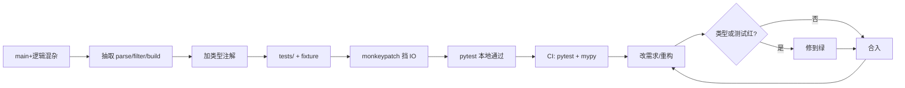
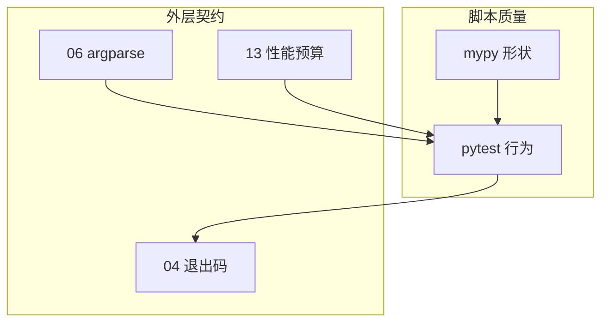
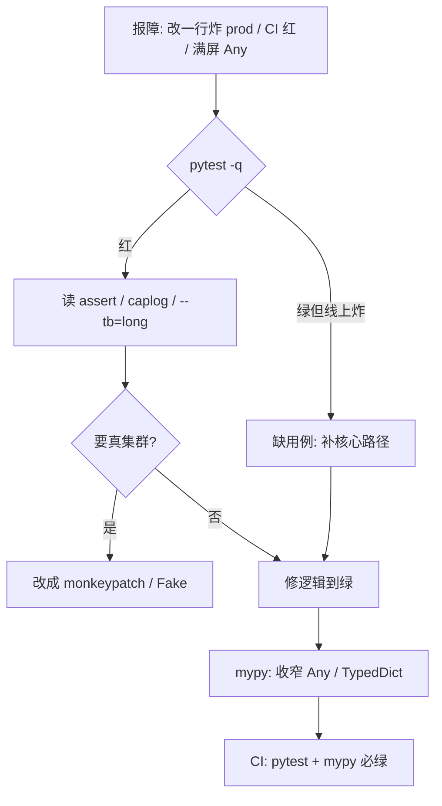

# 14｜测试与类型标注

> 发布脚本改了一行 `namespace` 默认值，周五晚上把 prod 巡检跑成 staging；PR 里满屏 `Any`，mypy 报错被 `# type: ignore` 糊过去；CI 没有 pytest，只剩「我本地跑过了」——三个人各喊一句，都拦不住炸。
> **本章回答**：一个运维脚本从抽纯函数、加类型、写 pytest（fixture/mock）、进 CI 到重构不怕炸的完整链路。
> **不讲**：logging → [05](../05-logging日志规范/)；argparse → [06](../06-argparse与配置管理/)；性能回归基准细节 → [13](../13-性能与内存排查/)。

**标记**：🎯重点 · 🔥难点 · ⭐常考 · 🔧实操

---

## 面试怎么考

| 标记 | 考点 |
|------|------|
| **核心** | pytest 结构；fixture；`monkeypatch` 挡 IO；类型让重构可搜 |
| **必会** | `test_` 命名；`assert`；`pytest.raises`；`list[str]` / `X \| None` |
| **常用** | `@pytest.mark.parametrize`；`tmp_path`；`caplog`；`mypy` / `pyright` |
| **常考** | 测什么不测什么；mock 边界；TypedDict vs `dict[str, Any]` |

> 📝 **面试（30 秒）**：运维脚本把**纯逻辑抽函数**（解析、过滤、拼报告），用 **pytest + fixture** 测；IO/SDK 用 **`monkeypatch` 或 Protocol 注入**，不真打 API。类型写 **`def fn(hosts: list[str]) -> int`**，JSON 行用 **TypedDict**。CI 跑 **`pytest` + `mypy`**，失败非 0。不测「kubectl 真连集群」，测**你的决策与退出码**。

---

## 能力边界

| 维度 | pytest 单测 | 集成测 | 手工 smoke |
|------|-------------|--------|------------|
| **适合** | 解析、规则、退出码 | staging 真 API（少） | 发版前一条命令 |
| **不适合** | 替代 oncall 判断 | 每次 PR 打 prod | 替代单测 |
| **契约** | 快、确定、无网络 | 慢、要环境 | 人触发 |

- 🔑 **三件工具各管一段**
  - **pytest**：行为回归——**不**管集群真实状态
  - **type hints**：形状与 IDE——**默不**运行时强制
  - **mypy / pyright**：静态类型错误——**不**管业务规则对不对

> 🎯 **一句话**：**没测试的脚本 = 下次改 namespace 的定时炸弹**；类型是第二道锁。

---

## 语言最小集

写/读运维脚本，测试与类型层认这些即可：

| 零件 | 示例 | 含义 |
|------|------|------|
| test 函数 | `def test_parse():` | 自动发现 |
| assert | `assert code == 0` | 失败即红 |
| fixture | `@pytest.fixture` | 复用 setup |
| monkeypatch | `monkeypatch.setenv(...)` | 改 env/属性 |
| parametrize | `@pytest.mark.parametrize` | 多组输入 |
| raises | `pytest.raises(ValueError)` | 期望异常 |
| tmp_path | `def test_f(tmp_path):` | 临时目录 |
| caplog | `caplog.at_level(...)` | 断言日志 |
| `list[str]` | 3.9+ 内置泛型 | 同质列表 |
| TypedDict | `class Row(TypedDict):` | 固定 key 字典 |

```python
# pyproject.toml 片段
[tool.pytest.ini_options]
testpaths = ["tests"]
pythonpath = ["."]

[tool.mypy]
python_version = "3.11"
strict = false
warn_return_any = true
```

- 🧩 **四行钉子**
  - `tests/test_*.py` + `test_` → 自动发现
  - 纯函数可直接 assert → 可测性前提
  - `monkeypatch` / Fake → 挡真 IO
  - CI：`pytest` + `mypy` → 行为 + 形状双门禁

零件认完，上主图。

---

## 一、一张图：pytest 与 type hints 在运维脚本里的一生 ⭐

> 🎯 **一句话**：**抽纯函数 → 写类型 → 写 pytest（fixture/mock）→ 本地绿 → CI → 重构时类型/测试同时报警**。



- 📖 **读图**
  - 🛤️ 主线七站：可测结构 → 类型 → fixture → mock → 本地 → CI → 重构闭环
  - 🧱 **B** 是前提——`main()` 里 200 行无法测；**E** 保证不依赖真集群
  - 🔁 **H→I** 是价值：改字段名，mypy 与 assert 同时提醒你

本节对应练习题 Q13。带着问题往下走——为什么先拆结构？

---

## 二、出生：可测结构 🔥⭐

> 🎯 **一句话**：**`main` 只做编排；业务逻辑进无 IO 的纯函数，签名带类型**。

⭐ 高频错答：「脚本就跑一次，不用测」。运维脚本改默认值能打到 prod——测的是**行为契约**，不是仪式感。

```python
from __future__ import annotations

from dataclasses import dataclass
from typing import TypedDict


class PodRow(TypedDict):
    name: str
    namespace: str
    ready: bool


@dataclass(frozen=True)
class AuditConfig:
    namespaces: list[str]
    min_ready_ratio: float


def filter_unready(rows: list[PodRow], cfg: AuditConfig) -> list[PodRow]:
    bad = [r for r in rows if not r["ready"]]
    if not bad:
        return []
    ratio = 1 - len(bad) / max(len(rows), 1)
    if ratio < cfg.min_ready_ratio:
        return bad
    return []


def main(argv: list[str] | None = None) -> int:
    cfg = load_config(argv)
    rows = fetch_rows(cfg)   # IO 边界
    bad = filter_unready(rows, cfg)
    if bad:
        report(bad)
        return 1
    return 0
```

- 🗺️ **三层怎么测**
  - **纯函数**（规则、解析、格式化）→ 直接 assert
  - **IO 边界**（HTTP / K8s / 文件）→ mock 或 Fake
  - **main**（拼流程、退出码）→ 少量集成式 mock

#### ❓ 为什么「就跑一次」也要测？

- 💣 脚本会**迭代**：API 字段变、阈值调、人改配置默认值
- ✅ 测的是你的**决策与退出码**，不是 apiserver 真返回什么
- 🚫 PR 门禁靠快单测；staging 少量 E2E 另管道，**不能**替代单测

#### ❓ 为什么不能把 200 行全塞 `main()`？

- 🧪 `main` 里 IO 与规则缠在一起 → 要么触网，要么测不了
- ✂️ 抽出 `filter_unready(rows, cfg)` 后，假数据就能钉住行为
- 🏷️ 类型跟着签名走：`list[PodRow]` / `AuditConfig`，重构可搜

> 📝 **面试**：「能测的是你的规则，不是 apiserver 真返回什么。」口诀：**main 编排，纯函数干活**。

本节对应练习题 Q1、Q2。下一节写第一个 pytest。

---

## 三、成长：pytest 基础 ⭐

> 🎯 **一句话**：**`tests/test_*.py` 里 `test_` 函数 + `assert`；一个行为一个测试**。

```python
# tests/test_filter.py
from audit import AuditConfig, PodRow, filter_unready


def test_all_ready_returns_empty():
    rows: list[PodRow] = [
        {"name": "a", "namespace": "ns", "ready": True},
    ]
    cfg = AuditConfig(namespaces=["ns"], min_ready_ratio=0.9)
    assert filter_unready(rows, cfg) == []


def test_below_ratio_returns_bad():
    rows: list[PodRow] = [
        {"name": "ok", "namespace": "ns", "ready": True},
        {"name": "bad", "namespace": "ns", "ready": False},
    ]
    cfg = AuditConfig(namespaces=["ns"], min_ready_ratio=0.9)
    bad = filter_unready(rows, cfg)
    assert len(bad) == 1
    assert bad[0]["name"] == "bad"
```

```bash
pytest -q
# ..                                                                       [100%]
# 2 passed in 0.03s   ← 两个 test_ 都绿
```

### 📮 `pytest.raises`（必会）

```python
import pytest
from audit import parse_ratio


def test_parse_ratio_rejects_invalid():
    with pytest.raises(ValueError, match="ratio"):
        parse_ratio("1.5")
```

### 🔧 运行与发现

```bash
pytest tests/test_filter.py::test_all_ready_returns_empty -v
# ← 只跑一个用例，排障时用

pytest -k "ratio" -v
# ← 名字匹配 ratio 的都跑

pytest --tb=short
# ← 失败栈缩短，CI 日志更可读
```

> ⚠️ **别混**：unittest 的 `self.assertEqual` 也能跑，但新项目用 **pytest 风格**——不要混两套 assert 在同一仓库。

> 🔍 **现场**：本地先 `pytest -q`，红了再 `-vv --tb=long` 看断言差；别一上来开覆盖率报告。

本节对应练习题 Q3、Q4、Q7。下一节用 fixture / mock 隔开外部依赖。

---

## 四、壮年：fixture 与 mock 🔥⭐

> 🎯 **一句话**：**fixture 供给假数据；`monkeypatch` 替换 env / 函数，让 main 不触网**。

> 💡 **打个比方**：fixture 是排练用的假道具；monkeypatch 是把真电话线拔掉，换成录音。

### 🧰 fixture

```python
import pytest
from audit import PodRow


@pytest.fixture
def sample_rows() -> list[PodRow]:
    return [
        {"name": "api-1", "namespace": "prod", "ready": True},
        {"name": "api-2", "namespace": "prod", "ready": False},
    ]


def test_report_count(sample_rows):
    assert len(sample_rows) == 2
```

### 🔌 `monkeypatch` 挡 IO（⭐常考）

```python
def test_main_returns_1_when_unready(monkeypatch, sample_rows):
    monkeypatch.setattr("audit.fetch_rows", lambda cfg: sample_rows)
    monkeypatch.setattr("audit.report", lambda bad: None)
    assert main([]) == 1


def test_main_respects_namespace_env(monkeypatch):
    monkeypatch.setenv("NAMESPACE", "staging")
    # 再 mock load_config / fetch，断言读到的是 staging
    ...
```

### 📁 `tmp_path` 与 `caplog`（常用）

```python
def test_write_report_creates_file(tmp_path):
    out = tmp_path / "report.txt"
    write_report([{"name": "x"}], out)
    assert "x" in out.read_text()


def test_main_logs_error(caplog, monkeypatch):
    monkeypatch.setattr(
        "audit.fetch_rows",
        lambda c: (_ for _ in ()).throw(RuntimeError("api")),
    )
    with caplog.at_level("ERROR"):
        code = main([])
    assert code == 1
    assert "api" in caplog.text
```

### 🔢 `parametrize`（常用）

```python
@pytest.mark.parametrize(
    "ratio,ok",
    [("0.0", True), ("1.0", True), ("-0.1", False), ("2", False)],
    ids=["zero", "one", "neg", "too_big"],
)
def test_parse_ratio(ratio, ok):
    if ok:
        assert parse_ratio(ratio) == float(ratio)
    else:
        with pytest.raises(ValueError):
            parse_ratio(ratio)
```

#### ❓ 为什么测 main 返回 1 不必连真集群？

- 🎭 把 `fetch_rows` / `report` **换成假手**，断言的是**你的编排与退出码**
- 🌐 真集群测的是网络与权限，慢、脆、还可能打到 prod——**不进 PR 默认门禁**
- ⚖️ mock 测输入输出，**不**测「内部调了几次 boto3」这类实现细节

#### ❓ fixture 和 monkeypatch 能不能只用一个？

- 📦 **fixture**：桌上摆好假数据（可复用、可读）
- 🔌 **monkeypatch**：运行时把真依赖换掉（env、函数、属性）
- 🤝 常见组合：fixture 造 `sample_rows`，monkeypatch 让 `fetch_rows` 返回它

> 📝 **面试**：「不测 boto3 真调 AWS，测传入 ClientError 时你的退出码和日志。」

本节对应练习题 Q5、Q6、Q8。下一节锁形状。

---

## 五、老去：类型标注与静态检查 ⭐🔥

> 🎯 **一句话**：**参数和返回值都标；容器用 `list[str]`；JSON 形字典用 TypedDict；可选 `X | None`**。

口诀：**TypedDict 锁形状，`Any` 等于没写**；`# type: ignore` 是债务，不是通行证。

```python
from __future__ import annotations
from typing import TypedDict


def parse_hosts(raw: str) -> list[str]:
    return [h.strip() for h in raw.split(",") if h.strip()]


def lookup_zone(host: str, zones: dict[str, str]) -> str | None:
    return zones.get(host)


class Event(TypedDict):
    ts: str
    level: str
    msg: str


def worst_level(events: list[Event]) -> str:
    ...
```

### 🔍 mypy / pyright

```bash
mypy audit.py tests/
# Success: no issues found in 2 source files   ← 形状过关

pyright audit.py
```

```python
# 渐进式：暂时搞不定的边界
def legacy_fetch() -> list[dict[str, object]]:  # 逐步收窄到 TypedDict
    ...
```

- 🏷️ **写法怎么选**
  - `str` / `int` → 基础标量
  - `list[str]` → 同质列表（3.9+；更老用 `List[str]`）
  - `str | None` → 可选（3.10+；更老用 `Optional[str]`）
  - **TypedDict** → 固定 key 的 dict / JSON 行
  - **Protocol** → 鸭子类型接口（Fake client）
  - **`Literal["ok","fail"]`** → 枚举字符串

#### ❓ 为什么 type hints 默认不在运行时强制？

- 📝 注解默认是**给人和检查器看的**，解释器不替你拦错类型
- 🛡️ 要运行时校验 → pydantic 等（本章不展开）
- 🔧 **mypy / pyright** 是静态门禁；pytest 是行为门禁——两件不同的事

#### ❓ 为什么用 TypedDict，而不是 `dict[str, Any]`？

- 🔑 TypedDict 钉死 key 与值类型 → 拼错 `"namesapce"` mypy 能抓
- 🌫️ `dict[str, Any]` / 满屏 `Any` ≈ **没写类型**，重构搜不到
- 📉 实在未知用 `object` 再收窄，比 `Any` 强；`# type: ignore` 逐条销账

### 🦢 Protocol 注入依赖（常用）

```python
from typing import Protocol


class PodLister(Protocol):
    def list_pods(self, namespace: str) -> list[PodRow]: ...


class FakeLister:
    def list_pods(self, namespace: str) -> list[PodRow]:
        return [{"name": "p", "namespace": namespace, "ready": True}]


def test_audit_ok(cfg: AuditConfig):
    assert audit(FakeLister(), cfg) == 0
```

比 MagicMock 更类型安全；老代码可先用 monkeypatch，新代码优先 Protocol + Fake。

> ⚠️ **别混**：type hints **≠** 运行时校验；mypy 绿 **≠** 业务正确——还要 pytest。

本节对应练习题 Q9、Q10、Q11。下一节把门禁写进 CI。

---

## 六、死亡：CI 门禁与覆盖率 🔥

> 🎯 **一句话**：**PR 必跑 `pytest` + `mypy`；可选 coverage 下限；退出码契约对齐 [04](../04-异常与退出码/)**。

```yaml
# CI 最少：pytest + mypy；integration 标记默认跳过
- run: pytest -q --cov=audit --cov-fail-under=70
- run: mypy audit.py
```

- ✅ **测**：解析 / 过滤 / 格式化；给定输入的退出码；日志是否含关键字段
- 🚫 **不测**：真 K8s 集群；网络延迟；全量 E2E（另管道）

### ⏱️ 与 13 章性能回归（常用）

```python
import time

def test_audit_small_fixture_under_budget():
    rows = make_rows(100)
    t0 = time.perf_counter()
    filter_unready(rows, cfg)
    assert time.perf_counter() - t0 < 0.5
    # ← 固定规模 fixture 卡耗时，不是测 apiserver
```

#### ❓ 为什么 CI 要 pytest **和** mypy 两个？

- 🧪 pytest 锁**行为**（规则、退出码）
- 📐 mypy 锁**形状**（字段改名、返回值漏标）
- 💥 只跑一个：改字段名可能测试碰巧还绿，或类型绿但逻辑炸——**互补，不是重复**

> 📝 **面试**：「CI 里用固定规模 fixture 卡耗时，不是测 apiserver。」集成测标 `@pytest.mark.integration`，默认跳过。

本节对应练习题 Q12。

---

## 七、收束：脚本质量凭什么可维护 🔥

> 🎯 **一句话**：可维护 = **可测结构 + 类型形状 + 行为测试 + CI 双门禁**；少一环就退回「我本地跑过了」。



- 📖 **读图**
  - 🧱 中栏 T/Y 是本章核心：行为与形状
  - 🔗 左/右外层：解析进测试、失败非 0、热点有预算——都要有测试钩子
  - 🚫 缺 Y 或 T 任一环，重构只能靠运气

**可背清单（六件套）**：

1. 纯函数 + 类型签名可测
2. fixture 假数据，monkeypatch / Protocol 挡 IO
3. 测退出码与异常分支（对齐 [04](../04-异常与退出码/)）
4. TypedDict / Protocol 代替裸 dict / 满屏 Any
5. CI：`pytest` + `mypy`（可选 cov 下限）
6. 不测真集群；E2E 另管道

> ⚠️ **别混**：覆盖率高 **≠** 测对了——优先盖解析、过滤、退出码；别为刷 100% mock 实现细节。

> 📝 **面试**：六件套分三组记——**结构**（纯函数）· **隔离**（fixture/mock）· **门禁**（pytest+mypy、不打真集群）。

本节对应练习题 Q1、Q13。回到开头那个改默认值炸 prod——怎么作战。

---

## 八、作战：没测试的 PR、类型全 Any、CI 红 🔥🔧

> 🎯 **一句话**：先 `pytest -q` 看挂哪，再 `mypy` 看字段是否漏改，再补 fixture / 收窄 TypedDict。



- 📖 **读图**：从本地 pytest 分叉——已红修断言；已绿却炸 → 补路径；触网 → 先 mock 再谈

**现象 · 先做 · 别做**

| 现象 | 先做 | 别做 |
|------|------|------|
| 改一行炸 prod | 补核心路径 pytest | 只靠人工 smoke |
| mypy 200 错 | 新代码 strict / 渐进收窄 | 全文件 `# type: ignore` |
| 测试要真集群 | monkeypatch / Fake | 把 kubeconfig 塞 CI |
| flaky | 去掉 sleep / 时间依赖 | 重试 10 次碰运气 |
| 覆盖率低 | 先盖解析与退出码 | 追求 100% 刷指标 |

**60 秒剧本** 🔧：

- **0–10s**：`pytest -q` 看挂哪
- **10–25s**：读失败 assert / caplog
- **25–40s**：`mypy` 看字段改名是否漏改
- **40–60s**：补 fixture 或收窄 TypedDict

```bash
pytest tests/test_main.py -vv --tb=long
# ← 断言差一眼可见

mypy audit.py --show-error-codes
# ← 带错误码，便于对症查文档
```

本节对应练习题 Q12。下面模板可直接拿走。

---

## 生产模板 🔧

### 模板 1：目录布局

```text
ops_audit/
  audit.py          # 逻辑 + main
  pyproject.toml
  tests/
    conftest.py     # 共享 fixture
    test_filter.py
    test_main.py
```

### 模板 2：`conftest.py`

```python
import pytest
from audit import PodRow


@pytest.fixture
def pod_factory():
    def _make(name: str, ready: bool = True, ns: str = "prod") -> PodRow:
        return {"name": name, "namespace": ns, "ready": ready}
    return _make
```

### 模板 3：main 可导入测

```python
# audit.py 末尾
if __name__ == "__main__":
    raise SystemExit(main())

# tests/test_main.py
from audit import main


def test_main_ok(monkeypatch, pod_factory):
    monkeypatch.setattr(
        "audit.fetch_rows",
        lambda cfg: [pod_factory("a", ready=True)],
    )
    monkeypatch.setattr("audit.report", lambda bad: None)
    assert main([]) == 0
```

### 模板 4：CI 最小片段

```yaml
- run: pip install pytest mypy pytest-cov
- run: pytest -q --cov=audit --cov-fail-under=70 -m "not integration"
- run: mypy audit.py
```

---

## 踩坑清单

| 现象 | 原因 | 修法 |
|------|------|------|
| 测试触真 API | 未 mock fetch | monkeypatch / Fake |
| 顺序依赖失败 | 共享全局状态 | fixture + 无全局 |
| mypy 报 import | 缺 stubs | `pip install types-xxx` |
| TypedDict 多 key | 拼写错误 | 信 mypy，别 ignore |
| caplog 空 | level 不对 | `caplog.at_level(...)` |
| CI 无 pytest | 未装 dev 依赖 | `extras_require` / CI pip |
| 过度 mock | 测实现细节 | 测输入输出 |
| `# type: ignore` 泛滥 | 逃避 | 逐条修 / 收窄类型 |
| parametrize 不可读 | 无 ids | 加 `ids=` |
| flaky | sleep / 真时间 | 注入时钟或去掉等待 |

> 🔍 **现场**：CI 里 mypy 200+ 错全是 `Any` 返回值 → 旧代码从未标过类型；**新代码从标注开始渐进收窄**，别一刀 `# type: ignore`。

---

## 必会 · 常考 ⭐

| 说法 | 对错 | 口径 |
|------|:----:|------|
| 运维脚本也要单测 | 对 | 至少纯函数 |
| pytest 要打真集群 | 错 | mock IO |
| type hints 运行时强制 | 错 | 默认不强制 |
| TypedDict 描述 JSON 行 | 对 | 固定 key |
| 只测 happy path | 错 | 异常/退出码也要 |
| monkeypatch 可改 env | 对 | 隔离环境 |
| mypy 与 pytest 互补 | 对 | 形状 vs 行为 |
| 100% coverage 必须 | 错 | 关键路径优先 |

---

## 收口

### 命令速查 🔧

```bash
# 测试
pytest
pytest -q -k filter
pytest --lf          # 只跑上次失败
pytest -x            # 首个失败即停
pytest -vv --tb=long

# 类型
mypy .
mypy audit.py --show-error-codes
pyright

# 覆盖率
pytest --cov=audit --cov-report=term-missing

# 初始化
pip install pytest mypy pytest-cov
```

- 📎 `conftest.py` 放共享 fixture
- 🏷️ 集成测标 `@pytest.mark.integration`，PR 默认跳过
- 📈 **类型演进**：新函数全标注 → 旧代码碰到补返回值 → JSON 用 TypedDict → SDK 用 Protocol → **禁止新增裸 `Any`**

### 面试锚点

遮住右列自问自答，卡壳的行回去重读对应小节。

| 问 | 30 秒答 |
|----|---------|
| 运维脚本测什么？ | 纯逻辑、退出码、异常；IO mock |
| 如何让 main 可测？ | 抽函数 + monkeypatch / Protocol |
| fixture vs mock？ | fixture 准备数据；mock 替换调用 |
| TypedDict 干啥？ | 固定 dict key 类型 |
| mypy 解决啥？ | 静态类型错误、重构安全 |
| CI 最少啥？ | pytest + mypy |

### 易错一句话对照

- 运维脚本不用测 → 纯逻辑改一行可能炸 prod，必须测
- type hints 运行时校验 → 默认不校验；要校验用 pydantic
- mock 越多越好 → 测输入输出，不测实现细节
- 测 main 必须连集群 → monkeypatch / Fake 即可
- 满屏 `Any` / `# type: ignore` → 等于没写；收窄或 TypedDict
- mypy 绿就够了 → 还要 pytest 锁行为
- 覆盖率 100% 才合格 → 先盖解析与退出码
- unittest 与 pytest assert 混用 → 新项目统一 pytest 风格
- CI 塞 kubeconfig 跑集成 → 默认跳过；E2E 另管道
- fixture 和 monkeypatch 二选一 → 常一起用：假数据 + 挡 IO

### 数字墙

> CI 建议：**pytest + mypy** 双门禁；coverage 常见下限 **70%**（先盖关键路径，不迷信 100%）。Python **3.9+** 用内置 `list[str]`；**3.10+** 用 `X | None`。固定规模性能断言示例：百行 fixture **< 0.5s**（按团队预算改）。`# type: ignore` 当债务条目销，不当通行证。

---

## 合上书

- [ ] **默画**「pytest 与类型在脚本里一生」主图（Q13）
- [ ] 纯函数与 IO 边界怎么分？为什么 main 塞满就测不了？（Q1、Q2）
- [ ] `test_` / `assert` / `pytest.raises` 最小写法？（Q3、Q4）
- [ ] fixture 与 monkeypatch 各干什么？测 main 返回 1 如何不触网？（Q5、Q6、Q8）
- [ ] TypedDict vs `dict[str, Any]`？为何 hints 默认不强制运行时？（Q9、Q10）
- [ ] Protocol + Fake 比 MagicMock 好在哪？（Q11）
- [ ] CI 为什么要 pytest **和** mypy？为什么不打真集群？（Q12）
- [ ] 改一行炸 prod：60 秒先敲什么？（作战节）

八题能口述，测试与类型标注过关。性能预算与热点回归见 [13](../13-性能与内存排查/)。
