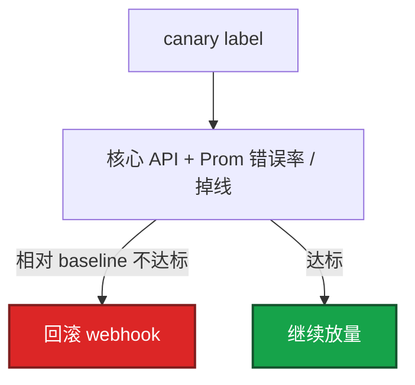
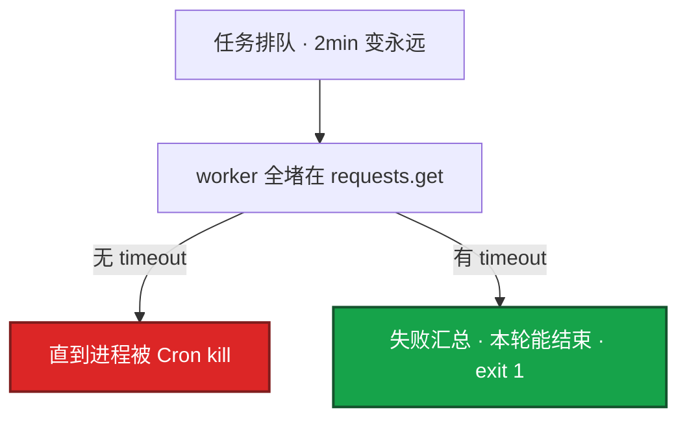

# 02｜Python 运维 · 练习题

先对照 [知识点](知识点.md) **面试怎么考** 自己口述，再对答案。关键字（dry-run、timeout、as_completed、incluster）要能点名。每题标了覆盖范围：

| 标记 | 含义 |
|------|------|
| **核心** | 不懂整章就没建立起来 |
| **必会** | 值班和面试都要能讲 |
| **常用** | 线上会反复碰到 |
| **常考** | 白板和追问的高频口径 |

## 本题目录

- [Q1 Cron 绿但没干活](#q1)
- [Q2 HTTP 超时与 POST 重试](#q2)
- [Q3 ThreadPool 200 workers](#q3)
- [Q4 K8s client 与 cluster-admin](#q4)
- [Q5 发布门禁 canary](#q5)
- [Q6 密钥与日志](#q6)
- [Q7 简历怎么讲](#q7)
- [Q8 线程池卡住](#q8)
- [Q9 云 API 分页](#q9)
- [Q10 YAML 未知字段](#q10)
- [合上书](#合上书)

---

## Q1

**★★★★★｜生产脚本最低标准是什么？Cron 显示成功但没干活先查什么？**

**覆盖**：核心 · 必会 · 常考

**对应**：知识点 §3.1 · 语法必会 §2

### 场景

每天凌晨巡检「全部成功」，活动日发现 20 个区服 Redis 规格检查根本没跑。脚本里有 `except Exception: pass`。Cron 页面全是绿色对勾，监控也没告警。

### 完整解答

**一句话**：生产脚本最低标准：argparse + logging + dry-run + 失败 sys.exit(1)，禁止 except pass。

最低标准四件：argparse、logging、`--dry-run`、失败 `sys.exit(1)`。Cron/CI **只看退出码**，不看日志里有没有 failed id。

```python
def main():
    logging.basicConfig(level=logging.INFO, format="%(asctime)s [%(levelname)s] %(message)s")
    args = parse_args()
    try:
        deploy(args)  # dry-run 时只打将要调用的 API
    except Exception:
        log.exception("failed")
        sys.exit(1)
```

Cron 绿但没干活先查：吞异常（`except pass`）、dry-run 反了、future 不 `result()`、`os.system` 丢退出码。虚拟环境：`python3 -m venv .venv && . .venv/bin/activate && pip install -r requirements.txt`。

### 再追问

dry-run 怎么证明它真的「没 apply」？——打印完整请求方法和 URL（token 打码）、目标 host、将写入的字段。生产第一次必须先 dry-run 贴到变更单里。和「吞异常」的区别：dry-run 是设计行为；except pass 是 bug。

---

## Q2

**★★★★★｜HTTP 调用有哪些硬要求？无 timeout 会怎样？POST 开服能默认重试吗？**

**覆盖**：核心 · 必会 · 常考

**对应**：知识点 §3.2 · 语法必会 §3–§4

### 场景

巡检线程池逐渐耗尽，机器 load 不高但巡检延迟到小时级。下游支付网关偶发卡住，`requests.get` 没设 timeout。另一次开服 POST 被 Retry 重试，出现两个相同 server_id。

### 完整解答

**一句话**：HTTP 必须 timeout=(连接,读取)；Retry 默认只给幂等 GET，POST 开服不盲重试。

`timeout=(3, 10)` 必设——连接 3s、读取 10s。无 timeout：worker 挂死在 socket read，巡检变故障，进程还在、CPU 很低。

```python
from requests.adapters import HTTPAdapter
from urllib3.util.retry import Retry

def session():
    s = requests.Session()
    r = Retry(
        total=3,
        backoff_factor=0.5,
        status_forcelist=(500, 502, 503, 504),
        allowed_methods=frozenset(["GET", "HEAD"]),  # POST 不在里面
    )
    s.mount("https://", HTTPAdapter(max_retries=r))
    return s

resp = session().get(
    url,
    timeout=(3, 10),
    headers={"Authorization": f"Bearer {os.environ['TOKEN']}"},
)
resp.raise_for_status()
```

POST 开服非幂等——Retry 默认会重试 POST，双写。429 退避，失败率 >30% 熔断本轮。token 不进日志。

### 再追问

内部网关失败率已经 30%，还继续重试吗？——停。失败率高就熔断本轮巡检，避免自己变成 DDoS。告警下游，不要加并发「多试几次」。token 不进日志。

---

## Q3

**★★★★★｜并发巡检/开服怎么写？200 并发行不行？**

**覆盖**：核心 · 必会 · 常考

**对应**：知识点 §3.3 · 语法必会 §5 · 生产模板 B

### 场景

活动前要开 50 服。脚本 `ThreadPoolExecutor(max_workers=200)` 打爆开服平台网关，一半 429，脚本仍然 `exit 0`。值班以为 50 服都开了，实际缺 25 个。

### 完整解答

**一句话**：IO 并发 workers 5–20，as_completed+result() 汇总失败；200 并发会打爆网关。

IO 用线程池，workers **5–20**。`as_completed` + `f.result()` 必须成对。failed 非空必须 `sys.exit(1)`。

```python
from concurrent.futures import ThreadPoolExecutor, as_completed

def batch(ids, workers=8):
    failed = []
    with ThreadPoolExecutor(max_workers=workers) as ex:
        futs = {ex.submit(work, i): i for i in ids}
        for f in as_completed(futs):
            i = futs[f]
            try:
                f.result()
            except Exception:
                log.exception("id=%s", i)
                failed.append(i)
    if failed:
        log.error("failed=%s", failed)
        sys.exit(1)
```

200 并发打爆网关——429 是限流信号。workers 5–20，要限流（令牌桶见 04）。已成功部分幂等可重入。

### 再追问

已成功的 30 服要不要回滚？——看门禁：若还没写目录，拆失败的即可，成功的可留。若已经对玩家可见，按开服回滚纪律处理（08）。脚本层至少保证失败可见、可重入。

---

## Q4

**★★★★★｜怎么调 K8s API 才合格？脚本能不能 cluster-admin？**

**覆盖**：核心 · 必会 · 常考

**对应**：知识点 §3.4 · 生产模板 C

### 场景

巡检 CronJob Pod 给了 cluster-admin ServiceAccount。有人用同一份 incluster 凭证在脚本里 `delete ns`。安全审计找上门。另一次笔记本脚本 `load_kube_config()` 连错 context，patch 了 staging 以为 patch 了 prod。

### 完整解答

**一句话**：K8s 用官方 client + 最小 SA；笔记本 kubeconfig，Pod 内 incluster；写操作走 GitOps。

```python
from kubernetes import client, config

try:
    config.load_incluster_config()   # Pod 内 · ServiceAccount token
except config.ConfigException:
    config.load_kube_config()        # 笔记本 · ~/.kube/config

apps = client.AppsV1Api()
# poll readyReplicas，deadline 到了当失败
```

cluster-admin 给脚本是事故。人手排障 kubectl；循环等待、失败汇总用库。poll + deadline，不要无限等。

### 再追问

和 kubectl 比，什么时候用库？——要循环等待、分支、失败汇总用库。一次性排障、还不确定 JSON 路径，用 kubectl。生产变更仍 GitOps。incluster 和 kubeconfig 不要混用——跑在 Pod 里就用 incluster。

---

## Q5

**★★★★☆｜发布后检查脚本做什么？为什么不能看集群均值？**

**覆盖**：必会 · 常用 · 常考

**对应**：知识点 §3.5

### 场景

金丝雀 5 个 Pod 错误率 20%，集群另外 95 个还是旧版且稳定，平均错误率看起来「只升了一点」。门禁脚本放行，全量后登录翻车。健康检查只打了 `/health`，200 OK 但登录接口 502。

### 完整解答

**一句话**：发布门禁对 canary label 查 Prom 相对 baseline，不用集群均值淹没金丝雀。

流程：金丝雀 Pod（canary label）→ 打**登录 / 核心 API** → 查 Prometheus **相对发布前 5min** 错误率 / 掉线 → 不达标调回滚 webhook。



集群均值会被大量稳定旧版 Pod 稀释——5 个金丝雀 20% 错误，95 个旧版 0.1%，平均可能只有 1%，看起来「还行」。这是**门禁代码化**，不另搞一套 CD。阈值参数化，活动日放宽写配置不要改代码。

### 再追问

活动日阈值要放宽怎么办？——做成 `--error-threshold` 参数或配置文件。放宽要写进变更窗口：错误预算不够仍应冻结。`/health` 通不等于对玩家开放。

---

## Q6

**★★★★☆｜密钥和日志怎么处理？打出 token 之后做什么？**

**覆盖**：必会 · 常用

**对应**：知识点 §3.1 · 踩坑清单

### 场景

`log.info("auth %s", headers)` 把 Bearer token 打进 ELK。群里还能搜到完整 JWT。对账脚本和发版工作流共用同一把 AK。

### 完整解答

**一句话**：密钥走环境变量，token 不进日志；泄漏立刻 rotate 并打码 filter。

密钥：环境变量或权限收紧的文件（600），禁止写进代码和 Git。结构化日志走 stdout + sidecar，不要脚本自己 `FileHandler` 打满 CI 盘。

```python
# 错误
log.info("auth %s", headers)

# 正确
log.info("auth Authorization=Bearer ***")
# 或 logging.Filter 打码敏感字段
```

打出 token 之后：

1. **立刻 rotate**——旧 token 作废
2. logging filter 打码 `Authorization`、`X-Api-Key`
3. 按合规要求清日志保留副本
4. 对账 AK 和发版 AK **分开**——对账只读；写操作另开 job + 审批

`log.exception` 带栈，但 filter 仍要拦 headers 里的 token。

### 再追问

对账脚本的 AK 能不能和工作流发版用同一把？——不能。泄漏面分开：对账只读凭证；写操作最小权限 + 审批。和 Ansible 分工：OS 期望状态 Ansible；API 编排 Python。

---

## Q7

**★★★★☆｜简历里 Python 运维项目怎么讲？不要讲 list/dict。**

**覆盖**：必会 · 常考

**对应**：知识点 §能力边界 · 必会·常考

### 场景

对方问「你 Python 运维做过什么」。有人开始背切片、推导式、装饰器。面试官打断：「说一个你写的生产脚本。」

### 完整解答

**一句话**：简历讲胶水项目和对账/开服/门禁的数字，不要背 list/dict 语法。

讲**胶水**不讲语法：开服检查（dry-run + 失败可见，50 服 40min→8min）、对账（paginator + 只读 AK）、发布门禁（canary label + Prom，拦截 3 次翻车）。强调 timeout、workers 上限、最小 SA。JSON/HTTP → Python；常驻 → Go。

### 再追问

为什么不用 Go 写开服检查？——要快迭代、调多个 HTTP JSON、团队都会 Python。常驻、单二进制、高并发连接再用 Go。边界说清即可，不要贬低 Python。

---

## Q8

**★★★★☆｜线程池卡住、下游偶发死锁，你怎么查？**

**覆盖**：必会 · 常用

**对应**：知识点 §3.2 · §3.3 · 踩坑清单

### 场景

巡检从 2 分钟变成「永远跑不完」。进程还在，CPU 很低，load 也不高。`ps` 看线程都在 `poll` 或 `read`。脚本没有 `timeout`，也没有 `f.result()`。

### 完整解答

**一句话**：线程池卡住先查 HTTP/SSH 无 timeout；必须 as_completed+result() 否则会吞异常。

排查：出站调用有没有 `timeout` → worker 是否全堵在同一下游 → 有没有 `f.result()` → 仍慢则限流/缩小并发/熔断。



不要加 worker 硬冲——200 workers 只会把下游打得更死。活动高峰失败率高就熔断本轮，缩小并发，失败 id 进通知。

### 再追问

`concurrent.futures` 里异常不 `result()` 会怎样？——异常在 future 里，主进程还可能 0 退出。必须 `as_completed` + `result()`。和 except pass 的区别：pass 是主线程吞；不 result 是子线程吞。

---

## Q9

**★★★☆☆｜分页拉云 API 和一次 List 全量差在哪？**

**覆盖**：常用 · 常考

**对应**：知识点 §语法必会 · 必会·常考

### 场景

对账脚本把账号下所有 ECS 一次 `DescribeInstances` 不带分页，接口超时 60s。偶发把 RAM API 限额打满，后续开服脚本也 429。对账 AK 还有写权限。

### 完整解答

**一句话**：云 API 用 paginator 按页拉 + 限流，不要一次 List 全量；对账用只读凭证。

用官方 SDK paginator，页间 sleep 或令牌桶限流。失败重试只针对 5xx，4xx 不要盲重试。

```python
import time

paginator = client.get_paginator("describe_instances")
for page in paginator.paginate():
    for reservation in page.get("Reservations", []):
        for inst in reservation.get("Instances", []):
            reconcile(inst)
    time.sleep(0.2)   # 页间限流
```

| 做法 | 风险 |
|------|------|
| 一次 List 全量 | 超时、RAM 限额 |
| paginator + sleep | 可控、可断点续跑 |

中途一页 503：记失败页，非 0 退出；不完整清单不当 CMDB 真相。对账用只读 AK。

### 再追问

对账和发版能不能共用 Session 里的 Retry？——可以，但 Retry 仍只对 GET。对账如果误用 POST 写 CMDB，同样不能默认重试。凭证必须分开。

---

## Q10

**★★★☆☆｜配置 YAML 多了一个未知字段，该失败还是忽略？**

**覆盖**：常用 · 常考

**对应**：知识点 §语法必会 §7 · 踩坑清单

### 场景

同事把 `env: proudction` 写错（多了个 d），脚本 schema 没校验，未知键被忽略，脚本用默认 `staging` 连库。以为做了 dry-run 安全，实际请求打到 staging API 但 CMDB 记的是 production。

### 完整解答

**一句话**：YAML 未知字段应失败，safe_load 后校验允许 key，静默忽略会让 env 配错仍以为成功。

`yaml.safe_load` 防代码执行，但不防拼写错误——必须再加 schema。

```python
ALLOWED = {"env", "region", "replicas", "timeout_sec"}
data = yaml.safe_load(open(path))
unknown = set(data) - ALLOWED
if unknown:
    raise SystemExit(f"unknown keys: {unknown}")
```

静默忽略会让 `env: proudction` 拼错仍用默认 staging。环境变量和 YAML 覆盖顺序写进 `--help`。

### 再追问

能不能用 pydantic / dataclass 代替手写 ALLOWED？——可以，面试说「schema 校验、未知字段 fail fast」即可。重点是不静默忽略，不是用什么库。

---

## 合上书

- [ ] 能默写 argparse + logging + dry-run + `sys.exit(1)`，禁止 `except pass`
- [ ] 能写 `timeout=(3, 10)` + Retry 只对 GET/HEAD；POST 开服不默认重试
- [ ] 能写 ThreadPool `as_completed` + `result()` + failed 非空非 0
- [ ] 能说出 incluster vs kubeconfig、canary label Prom、token rotate
- [ ] 简历能讲开服/对账/门禁项目 + 数字
