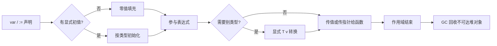
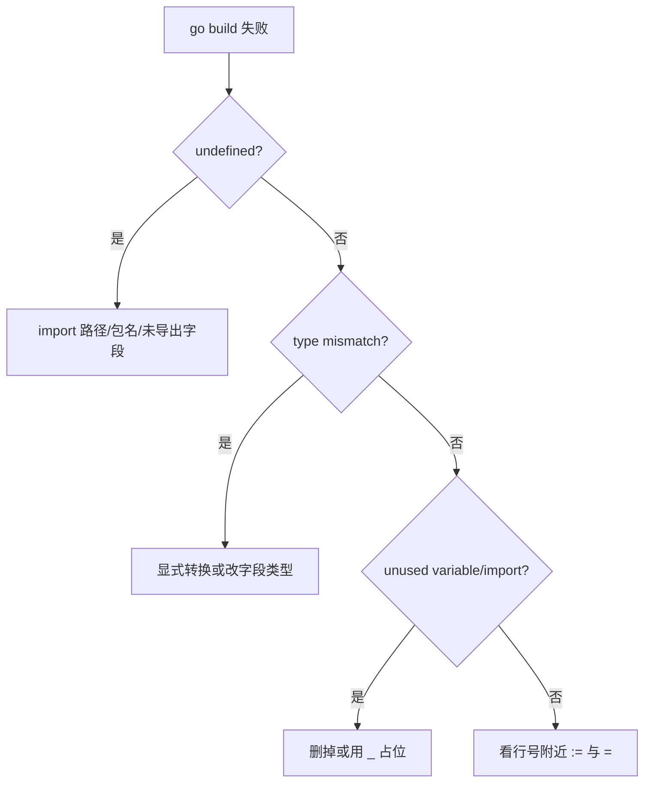

# 01｜基础语法与类型系统 · SRE 开发能力

> 值班同学写了个 `kubectl` 巡检小工具，编译报 `undefined: fmt`、把 `port := "8080"` 和 `int` 相加 panic、结构体字段首字母小写导致 JSON 序列化全空——根子是没看清**一个 Go 值从声明、类型检查到真正参与运算**的整条链。
> **本章回答**：一个 Go 值的一生——声明与初始化、静态类型、零值、值/指针、基础类型转换、结构体字段可见性，到第一次被 `fmt` 打印或传给函数。
> **本章不讲**：`go.mod` 与目录布局 → [02 工程结构与go-mod](../02-工程结构与go-mod/)；slice/map 共享陷阱 → [03 类型零值与slice-map陷阱](../03-类型零值与slice-map陷阱/)；`error` 与 `panic` → [04 错误处理与panic](../04-错误处理与panic/)；goroutine → [05 goroutine与调度模型](../05-goroutine与调度模型/)。

## 面试怎么考

| 标记 | 考点 |
|------|------|
| **核心** | 静态类型；`:=` vs `var`；零值；值类型 vs 指针；导出字段（首字母大写）；显式类型转换 |
| **必会** | `package` / `import`；`int` 与 `int64` 不能隐式混用；`&` 取址、`*` 解引用；`struct` 字面量 |
| **常用** | `const` / `iota`；`string` 与 `[]byte` 转换；`rune` 与 Unicode；`fmt.Sprintf` |
| **常考** | 未使用变量/导入编译不过；`:=` 左侧至少一个新变量；小写 struct 字段 JSON 为空 |

**30 秒怎么说**：Go 是**静态强类型**——每个值在编译期有确定类型，不能隐式把 `int` 和 `int64` 相加。变量用 `var` 或 `:=` 声明，未赋值则取**零值**（0、""、nil 等）。`&x` 得指针，`*p` 解引用。结构体字段首字母大写才导出，跨包和 `encoding/json` 才看得见。类型转换必须显式 `T(v)`。运维小工具从 `package main` + `func main()` 起步，先保证编译器满意，再谈业务。

---

## 能力边界

| 维度 | Go 类型系统 | Python 动态类型 | Shell 字符串 |
|------|-------------|-----------------|--------------|
| **适合** | 编译期抓错、单文件二进制交付、K8s controller/CLI | 快速脚本、JSON 一把梭 | 编排已有命令 |
| **不适合** | 5 行 ad-hoc（编译成本） | 高并发无类型约束 | 复杂数据结构 |
| **你要会** | 读懂编译错误、字段为何导不出 | 何时该换 Go | 何时 glue 即可 |

静态类型解决的是「接口传错类型编译失败」，但不解决运行时业务逻辑正确性。零值解决了「未初始化也有确定行为」，但不解决业务上「未配置」语义——需指针或 Optional 模式来区分。导出规则让 API 边界清晰，但不自动做 JSON 驼峰——还要配合 `json` tag。

> **记住**：Go 值的一生从**编译器通过**开始——未使用变量、错误类型转换、未导出字段，都是 SRE 写工具时第一批坑。

---

## 语言最小集

读任何运维 Go 片段，先认这 16 个零件：

| 零件 | 示例 | 含义 |
|------|------|------|
| package | `package main` | 源码文件归属的包；`main` 可执行入口 |
| import | `import "fmt"` | 引入标准库或模块路径 |
| var | `var port int = 8080` | 显式声明，可包级 |
| 短声明 | `host := "10.0.0.1"` | 函数内常用，左侧至少一个新名 |
| const | `const timeout = 30` | 编译期常量 |
| 零值 | `var n int` → 0 | 未赋值时的默认值 |
| 基础类型 | `int`, `int64`, `float64`, `bool`, `string` | 机器相关宽度要注意 |
| 指针 | `p := &x`; `*p = 1` | 共享底层存储 |
| struct | `type Host struct { Name string }` | 聚合字段 |
| 字面量 | `Host{Name: "a"}` | 按字段或顺序初始化 |
| 类型转换 | `int64(port)` | 必须显式，无隐式 |
| 比较 | `==`, `!=` | 同类型才可比（slice/map 除外见 03 章） |
| 控制流 | `if`, `for`, `switch` | `for` 是唯一循环关键字 |
| 函数 | `func ping(host string) error` | 多返回值常见 |
| 可见性 | `Name` vs `name` | 首字母大写 = 导出 |
| 打印 | `fmt.Println`, `fmt.Sprintf` | 调试与拼消息 |

```go
// 最小可读：声明 → 类型 → 使用
package main

import "fmt"

type Target struct {
    Host string // 导出字段，JSON/跨包可见
    port int    // 未导出，包外不可见
}

func main() {
    t := Target{Host: "api.internal"}
    fmt.Printf("check %s\n", t.Host)
}
```

---

## 一、一张图：一个 Go 值的一生 ⭐🔥

> 🎯 **一句话**：**声明（绑定名字与类型）→ 零值或初始化 → 类型检查与转换 → 传值/传址使用 → 离开作用域可回收**。



**读图**：从左上「声明」到「使用」是单变量路径；编译器在 **E→F** 处拦住隐式转换（`int` + `int64` 直接加不过）。监控 exporter 里常见：配置 struct 字段小写导致 Prometheus label 注册失败——问题出在**声明阶段的可见性**，不是运行时。

---

## 二、出生：package、import 与 main 入口 ⭐

> 🎯 **一句话**：每个 `.go` 文件属于一个 `package`；可执行程序必须是 `package main` 且含 `func main()`。

### package 与文件组织

```go
// cmd/healthcheck/main.go
package main   // 可执行：go build 产出二进制

import (
    "fmt"
    "os"
)
```

同目录下所有 `.go` 文件必须同一 `package` 名（测试文件 `_test.go` 除外，可为 `package main_test`）。

### import 规则

```go
import "fmt"                    // 单条
import (
    "context"
    "fmt"
    k8s "k8s.io/client-go/kubernetes" // 别名，避免包名冲突
)
```

> ⚠️ **别混**：**未使用的 import 编译报错**——不像 Python 能跑；CI `go build ./...` 会直接红。

### main 函数

```go
func main() {
    if err := run(); err != nil {
        fmt.Fprintf(os.Stderr, "fatal: %v\n", err)
        os.Exit(1)
    }
}
```

运维工具习惯：`main` 只做组装，逻辑放 `run()` 便于测试（见 02 章 `cmd/` 布局）。

> 🔍 **现场**：CI 里 `go build ./...` 报 `undefined: fmt`——不要慌，这是编译器告诉你「引用了 fmt 但没 import」。直接看报错文件头部，补上 `"fmt"` 即可。比 Shell 脚本静默失败强多了——Go 编译器是第一道防线。

> 📝 **面试**：「Go 可执行入口是 `package main` + `func main()`；库代码用非 main 包名，被 `go build` 成 archive。」

---

## 三、命名：var、const 与短变量声明 ⭐

> 🎯 **一句话**：`var` 可用于包级与函数内；`:=` 只能在函数内且**左侧至少有一个新变量名**。

### var 与初始化

```go
var (
    defaultTimeout = 30        // 类型推断为 int
    listenAddr     string    // 零值 ""
)

func initConfig() {
    var retries int           // 零值 0
    retries = 3
}
```

### 短变量声明 `:=`

```go
host := "10.0.0.1"           // 新变量
port, err := parsePort("8080") // 多返回值
port, err = parsePort("9090")  // 已有变量必须用 =
```

```go
// 编译错误：no new variables on left side of :=
port, err := 8080, nil
port, err := parsePort("x")
```

### const 与 iota

```go
const (
    SeverityInfo = iota  // 0
    SeverityWarn         // 1
    SeverityCritical     // 2
)
```

告警级别、退出码枚举用 `iota`；运维常量（默认端口、路径）用 `const` 避免魔数。

> 💡 **打个比方**：`:=` 像「边声明边装货」，变量名从无到有；`=` 像「往已有箱子里换货」，箱子必须先存在。写 `port, err := parsePort("x")` 第二次报错，就是因为箱子已经有了，你得换成 `=` 才合法。

---

## 四、类型与零值（⭐🔥常考）

> 🎯 **一句话**：Go 每个类型都有**零值**；变量声明后不用手动「置 nil」，但业务上要区分「零值」和「未配置」。

| 类型 | 零值 |
|------|------|
| 数值 `int/float` | 0 |
| `bool` | false |
| `string` | `""`（非 nil） |
| 指针、slice、map、chan、func、interface | nil |
| struct | 各字段零值组合 |

```go
var p *Pod
if p == nil { /* 未指向任何 Pod */ }

var s string
if s == "" { /* 空串，但 s 不是 nil */ }
```

> ⚠️ **别混**：`string` 零值是 `""`，**没有 nil string**（不像指针）。配置「可选字符串」常用 `*string` 或单独 `ok` 标志。

> 💡 **打个比方**：零值就像手机的「出厂设置」——买来就有，不用你设置，但也代表「用户还没动过」。数值出厂是 0、字符串出厂是空串、指针出厂是 nil。业务上「用户没配置」和「用户配了 0」是两件事，零值分不清这两者，所以才需要指针或 Optional 模式。

---

## 五、基础类型与显式转换 🔥

> 🎯 **一句话**：**不能隐式**在不同数值类型间转换；`int` 宽度随平台（32/64 位），跨平台用 `int64`。

```go
var a int = 10
var b int64 = 20
// sum := a + b        // 编译错误
sum := int64(a) + b   // OK

portStr := "8080"
port, _ := strconv.Atoi(portStr)  // string → int，见 strconv
```

### string 与 []byte

```go
b := []byte("metrics")
s := string(b)   // 拷贝；大流量注意分配
```

### rune 与字符

```go
for i, r := range "告警🚨" {
    fmt.Printf("%d %U\n", i, r) // 按 Unicode 码点
}

// rune 本质是 int32 的别名，表示一个 Unicode 码点
type myRune = rune // 别名示例
var emoji myRune = '✅'
fmt.Printf("%c %U\n", emoji, emoji) // ✅ U+2705
```

日志里含中文时，`len(s)` 是字节数不是字符数——用 `utf8.RuneCountInString` 或 `range`。

> 🔍 **现场**：SRE 巡检脚本从环境变量读端口 `port, err := strconv.Atoi(os.Getenv("PORT"))`——如果 `PORT` 没设或填了非数字，`err != nil` 必须处理，否则 `port` 是 0，后面 `http.ListenAndServe(":0", ...)` 会绑随机端口，排查到死。养成习惯：`strconv.Atoi` 之后永远检查 err。

---

## 六、值与指针 ⭐🔥

> 🎯 **一句话**：**传值复制**整个值；**传指针**共享底层数据，适合大 struct 或需要修改调用方变量。

```go
type Config struct {
    Timeout int
}

func bump(c Config) {
    c.Timeout++ // 只改副本
}

func bumpPtr(c *Config) {
    c.Timeout++ // 改原对象
}

cfg := Config{Timeout: 10}
bump(cfg)       // cfg.Timeout 仍为 10
bumpPtr(&cfg)   // cfg.Timeout 为 11
```

小 struct 且只读场景选传值即可；大 struct 或需要修改调用方变量时传指针 `*T`；可选字段「没设置」语义用 `*int` 等指针类型，nil 表示未设置。

> 📝 **面试**：「Go 没有 C++ 那种默认引用；是否共享看传的是值还是指针。」

> 💡 **打个比方**：传值就像「复印一份文档给同事」——他改的是复印件，你手里原件不变；传指针就像「发一个在线文档链接」——两个人看的是同一份，谁改都生效。大 struct 复印成本高，所以大结构体传指针，小结构体传值即可。

---

## 七、结构体与导出规则 ⭐🔥

> 🎯 **一句话**：字段/方法**首字母大写**才导出（public）；JSON 默认用字段名，常配合 struct tag。

```go
type Service struct {
    Name    string `json:"name"`
    Cluster string `json:"cluster"`
    replicas int   // 小写：json 编码忽略此字段
}
```

```go
data, _ := json.Marshal(Service{Name: "api", Cluster: "prod"})
// {"name":"api","cluster":"prod"}  —— replicas 不出现
```

跨包使用：只有 `Name`、`Cluster` 可被 `otherpkg` 访问；`replicas` 仅本包。

> 💡 **打个比方**：导出字段就像 REST API 的 `public` 端点——首字母大写=对外公开，跨包可以调；小写字段像 `internal` 实现——自己人用，外面看不到。JSON 编码器也是个「外部调用者」，所以小写字段序列化时直接消失，就像访问 internal 端点拿到 404。

### 嵌入（了解）

```go
type Base struct{ Region string }
type Node struct {
    Base
    IP string
}
// n.Region 提升访问
```

K8s client-go 里大量嵌入；SRE 写 CRD 控制器时会碰到。

---

## 八、控制流最小集 ⭐

> 🎯 **一句话**：`if` 可带短声明；`for` 是唯一循环；`switch` 默认不贯穿（无 fallthrough 除非写明）。

```go
if v, err := strconv.Atoi(os.Args[1]); err != nil {
    fmt.Fprintf(os.Stderr, "bad port: %v\n", err)
    os.Exit(2)
} else {
    fmt.Println(v)
}

for _, pod := range pods {
    if pod.Status != "Running" {
        continue
    }
    fmt.Println(pod.Name)
}

switch os.Getenv("ENV") {
case "prod":
    level = "error"
case "staging":
    level = "warn"
default:
    level = "debug"
}
```

运维脚本式循环：`for { select { ... } }` 留给 05/06 章（goroutine/channel）。

### switch fallthrough 补充

```go
switch level {
case "error", "fatal":    // 多值匹配，逗号分隔
    notifyOnCall()
    fallthrough          // 显式贯穿到下一 case
case "warn":
    log.Warn("degraded")
default:
    log.Info("ok")
}
```

Go 的 `switch` 默认**不贯穿**（每个 case 自带 break），这跟 C/Java 相反。只有在 case 末尾显式写 `fallthrough` 才会跳到下一个 case 体。运维代码里 99% 不需要 fallthrough——多值用逗号列表即可。

---

## 九、作战：读编译错误定责 🔧

> 🎯 **一句话**：值班改同事 Go 工具，**先读编译器输出**，再 grep 类型与导出。



| 报错片段 | 常见原因 | 修法 |
|----------|----------|------|
| `undefined: fmt` | 没 import | 加 `import "fmt"` |
| `cannot use x (type int) as int64` | 隐式转换 | `int64(x)` |
| `cannot refer to unexported field` | 小写字段 | 改大写或同包访问 |
| `no new variables on left side of :=` | 全旧变量 | 改 `=` |
| `imported and not used` | 多余 import | 删除或 `_` 引用 |

> 🔍 **现场**：值班改同事工具，`go build` 一堆报错不要从头逐行读——先扫 `undefined`、`cannot use`、`unused` 三个关键词，分类修。经验：一个文件的编译错误 80% 集中在 import 和类型转换上，修掉前两条后面可能自动消失（级联报错）。

### 收束：值的一生清单

- **声明**：`var` / `:=`；未使用变量不过编译
- **零值**：数值 0、bool false、引用类型 nil、string `""`
- **类型**：静态检查；转换必须 `T(v)`
- **使用**：值拷贝 vs 指针共享
- **边界**：导出 = 首字母大写；JSON 看 tag
- **结束**：作用域外不可达 → GC

**不保证什么**：零值不等于业务「未配置」；`int` 位数不保证跨平台——配置端口用 `int` 一般够，存 ID 用 `int64`。

---

## 生产模板 🔧

### 模板 1：最小健康检查 CLI

```go
// cmd/healthcheck/main.go
package main

import (
    "fmt"
    "net/http"
    "os"
)

func main() {
    url := os.Getenv("HEALTH_URL")
    if url == "" {
        url = "http://127.0.0.1:8080/healthz"
    }
    resp, err := http.Get(url)
    if err != nil {
        fmt.Fprintf(os.Stderr, "probe failed: %v\n", err)
        os.Exit(1)
    }
    defer resp.Body.Close()
    if resp.StatusCode != http.StatusOK {
        fmt.Fprintf(os.Stderr, "bad status: %s\n", resp.Status)
        os.Exit(1)
    }
    fmt.Println("ok")
}
```

### 模板 2：配置 struct + 默认值

```go
package config

type Server struct {
    Listen string // 导出：给 main 用
    Debug  bool
}

func Default() Server {
    return Server{
        Listen: ":8080",
        Debug:  false,
    }
}
```

### 模板 3：多返回值解析

```go
func parseHostPort(s string) (host string, port int, err error) {
    host, portStr, ok := strings.Cut(s, ":")
    if !ok {
        return "", 0, fmt.Errorf("want host:port, got %q", s)
    }
    port, err = strconv.Atoi(portStr)
    if err != nil {
        return "", 0, fmt.Errorf("bad port: %w", err)
    }
    return host, port, nil
}
```

### 模板 4：表格输出（值班肉眼扫）

```go
type Row struct {
    Name   string
    Status string
    Restarts int
}

func printTable(rows []Row) {
    fmt.Printf("%-40s %-12s %8s\n", "NAME", "STATUS", "RESTARTS")
    for _, r := range rows {
        fmt.Printf("%-40s %-12s %8d\n", r.Name, r.Status, r.Restarts)
    }
}
```

---

## 踩坑清单

| 现象 | 原因 | 修法 |
|------|------|------|
| JSON 某字段永远空 | 字段小写未导出 | 首字母大写 + `json:"name"` |
| `8080` + 1 类型错误 | string 与 int 相加 | `strconv.Atoi` 再算 |
| 改配置函数里不生效 | 传值 struct | 改 `*Config` 或返回新值 |
| CI 编译不过「imported not used」 | 调试 import 没删 | 删掉或 `import _ "embed"` |
| `:=` 报错 | 左侧无新变量 | 改用 `=` |
| 中文长度算错 | `len` 是字节 | `utf8` / `range` |
| 跨架构端口溢出 | `int` 在 32 位机 | 对外协议用 `int64`/`uint16` |
| `nil` 比较编译不过 | interface vs 具体类型 nil | 用 `errors.Is` 或类型断言 |
| `fallthrough` 放末尾报错 | 只能放 case 体内 | 别滥用，改用逗号多值匹配 |

---

## 必会 · 常考

| 说法 | 对错 | 口径 |
|------|:----:|------|
| Go 是动态类型 | 错 | 静态强类型 |
| 未赋值变量为零值 | 对 | 不能「未定义」 |
| `int` 与 `int64` 可隐式相加 | 错 | 必须显式转换 |
| 小写 struct 字段可 JSON 导出 | 错 | 未导出编码器跳过 |
| `:=` 可用于包级 | 错 | 仅函数内 |
| `string` 可以是 nil | 错 | 零值 `""` |
| `&` 取址、`*` 解引用 | 对 | 指针基础 |
| 未使用局部变量编译失败 | 对 | 强制整洁 |

**易混**：`var s string`（`""`）vs `var p *T`（nil）；传值 vs 传指针；`:=` vs `=`；导出 vs JSON tag（两者都要对）。

---

## 命令速查 🔧

```bash
go build -o /tmp/hc ./cmd/healthcheck/
go run ./cmd/healthcheck/

go vet ./...          # 常见错误
staticcheck ./...     # 若已安装

# 看类型
go doc strconv.Atoi
```

---

## 面试锚点

| 问 | 30 秒答 |
|----|---------|
| Go 变量未赋值是什么？ | 该类型的零值 |
| 如何导出字段？ | 首字母大写 |
| `:=` 和 `=` 区别？ | `:=` 声明+赋值，至少一个新名；`=` 仅赋值 |
| 值传递还是引用？ | 默认传值；指针传址 |
| 为何编译不过 unused import？ | Go 强制无死代码 |

---

## 合上书，问自己

- [ ] 画出「值的一生」：声明 → 零值/初值 → 类型转换 → 使用 → 作用域结束。
- [ ] `var p *int` 和 `var s string` 零值分别是什么？
- [ ] `int` 和 `int64` 相加要怎么写？为什么？
- [ ] 结构体字段 `name` 和 `Name` 对 JSON 和跨包有何不同？
- [ ] `bump(c Config)` 和 `bumpPtr(c *Config)` 谁改调用方？
- [ ] `:=` 在什么情况下必须改成 `=`？
- [ ] 未使用的 import 会怎样？运维 CI 如何应对？
- [ ] `package main` 和库 `package config` 各用于什么场景？

八题能口述，类型系统地基就过关。下一章把代码放进 **module 与目录**，能 `go build` 交付二进制。
