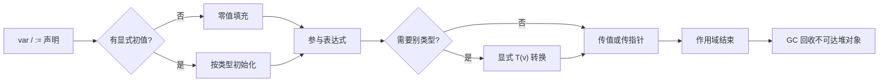
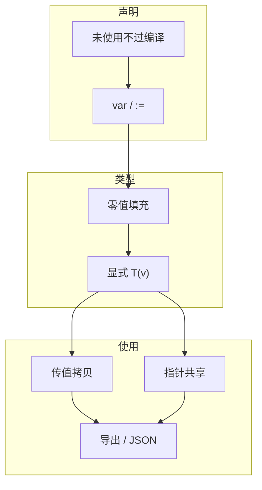
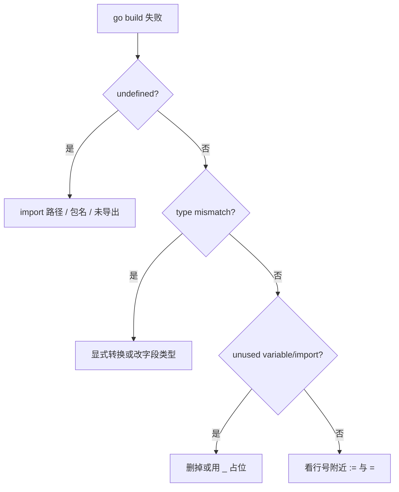

# 01｜基础语法与类型系统 · SRE 开发能力

> 值班同学写了个 `kubectl` 巡检小工具：`undefined: fmt` 过不了 CI；`port := "8080"` 跟 `int` 相加直接编译炸；结构体字段首字母小写——JSON 序列化全空。有人喊「先改类型再说」，手已经伸向回滚。
> **本章回答**：一个 Go 值的一生——声明与初始化、静态类型、零值、值/指针、显式转换、结构体导出，到第一次被 `fmt` 打印或传给函数。
> **不讲**：`go.mod` 与目录布局 → [02](../02-工程结构与go-mod/)；slice/map 共享陷阱 → [03](../03-类型零值与slice-map陷阱/)；`error` 与 `panic` → [04](../04-错误处理与panic/)；goroutine → [05](../05-goroutine与调度模型/)。

**标记**：🎯重点 · 🔥难点 · ⭐常考 · 🔧实操

---

## 面试怎么考

| 标记 | 考点 |
|------|------|
| **核心** | 静态类型；`:=` vs `var`；零值；值类型 vs 指针；导出字段（首字母大写）；显式类型转换 |
| **必会** | `package` / `import`；`int` 与 `int64` 不能隐式混用；`&` 取址、`*` 解引用；`struct` 字面量 |
| **常用** | `const` / `iota`；`string` 与 `[]byte` 转换；`rune` 与 Unicode；`fmt.Sprintf` |
| **常考** | 未使用变量/导入编译不过；`:=` 左侧至少一个新变量；小写 struct 字段 JSON 为空 |

**30 秒怎么说**：Go 是**静态强类型**——每个值在编译期有确定类型，不能隐式把 `int` 和 `int64` 相加。变量用 `var` 或 `:=` 声明，未赋值则取**零值**（0、`""`、nil 等）。`&x` 得指针，`*p` 解引用。结构体字段首字母大写才导出，跨包和 `encoding/json` 才看得见。类型转换必须显式 `T(v)`。运维小工具从 `package main` + `func main()` 起步，先保证编译器满意，再谈业务。

---

## 能力边界

| 维度 | Go 类型系统 | Python 动态类型 | Shell 字符串 |
|------|-------------|-----------------|--------------|
| **适合** | 编译期抓错、单文件二进制、K8s controller/CLI | 快速脚本、JSON 一把梭 | 编排已有命令 |
| **不适合** | 5 行 ad-hoc（编译成本） | 高并发无类型约束 | 复杂数据结构 |
| **你要会** | 读懂编译错误、字段为何导不出 | 何时该换 Go | 何时 glue 即可 |

- 🎭 **三件事各管一段**
  - **静态类型**：管「传错类型编译失败」——**不保证**业务逻辑对
  - **零值**：管「未初始化也有确定行为」——**不区分**「没配」与「配了 0」
  - **导出规则**：管 API / JSON 边界——**不自动**做驼峰，还要 `json` tag

> ⚠️ **别混**：类型系统是地基；slice/map 共享、error 包装、goroutine 都站在「值有类型、有零值、有可见性」之上。

---

## 语言最小集

读任何运维 Go 片段，先认这 16 个零件——认代码下限，不是语法大全。

| 零件 | 示例 | 含义 |
|------|------|------|
| package | `package main` | 源码归属；`main` 可执行入口 |
| import | `import "fmt"` | 引入标准库或模块路径 |
| var | `var port int = 8080` | 显式声明，可包级 |
| 短声明 | `host := "10.0.0.1"` | 函数内；左侧至少一个新名 |
| const | `const timeout = 30` | 编译期常量 |
| 零值 | `var n int` → 0 | 未赋值时的默认值 |
| 基础类型 | `int` / `int64` / `float64` / `bool` / `string` | `int` 宽度随平台 |
| 指针 | `p := &x`；`*p = 1` | 共享底层存储 |
| struct | `type Host struct { Name string }` | 聚合字段 |
| 字面量 | `Host{Name: "a"}` | 按字段或顺序初始化 |
| 类型转换 | `int64(port)` | 必须显式，无隐式 |
| 比较 | `==` / `!=` | 同类型才可比（slice/map 见 03） |
| 控制流 | `if` / `for` / `switch` | `for` 是唯一循环关键字 |
| 函数 | `func ping(host string) error` | 多返回值常见 |
| 可见性 | `Name` vs `name` | 首字母大写 = 导出 |
| 打印 | `fmt.Println` / `fmt.Sprintf` | 调试与拼消息 |

```go
package main

import "fmt"

type Target struct {
    Host string // 导出：JSON/跨包可见
    port int    // 未导出：包外不可见
}

func main() {
    t := Target{Host: "api.internal"}
    fmt.Printf("check %s\n", t.Host)
}
```

---

## 一、一张图：一个 Go 值的一生 ⭐🔥

> 🎯 **一句话**：**声明（绑定名字与类型）→ 零值或初始化 → 类型检查与转换 → 传值/传址使用 → 离开作用域可回收**。



- 📖 **读图**
  - 🛤️ 主线：声明 → 零值/初值 → 转换 → 传值/指针 → 作用域结束
  - 💥 运维「怪行为」多半出在 **F（隐式转换被拦）** 与 **声明时的可见性**：`int`+`int64` 不过编译；字段小写导致 JSON 空
  - CI / `go build` 照的是 **A→G**；运行时 JSON 空字段照的是**声明阶段导出规则**，不是序列化魔法坏了

本节对应练习题 Q13。

---

## 二、出生：package、import 与 main 入口 ⭐

> 🎯 **一句话**：每个 `.go` 文件属于一个 `package`；可执行程序必须是 `package main` 且含 `func main()`。

### 📦 package 与文件组织

```go
// cmd/healthcheck/main.go
package main   // 可执行：go build 产出二进制

import (
    "fmt"
    "os"
)
```

- 同目录下所有 `.go` 必须同一 `package` 名（`_test.go` 可为 `package main_test`）
- 运维工具习惯：`main` 只做组装，逻辑放 `run()` 便于测（目录布局见 [02](../02-工程结构与go-mod/)）

### 📥 import 规则

```go
import "fmt"
import (
    "context"
    "fmt"
    k8s "k8s.io/client-go/kubernetes" // 别名，避免包名冲突
)
```

#### ❓ 为什么未使用的 import 直接编译失败？

- 🧹 Go 强制**无死代码**：未用 import / 未用局部变量 = 编译错误，不像 Python 能跑
- 🛡️ 好处：CI `go build ./...` 第一道防线，少带脏依赖进二进制
- 🔧 修法：删掉，或调试期用 `_` 引用（如 `import _ "embed"`）

> ⚠️ **别混**：`undefined: fmt` ≠ 「标准库坏了」——多半是**引用了但没 import**，或包路径写错。

### 🚪 main 函数

```go
func main() {
    if err := run(); err != nil {
        fmt.Fprintf(os.Stderr, "fatal: %v\n", err)
        os.Exit(1)
    }
}
```

> 🔍 **现场**：CI 报 `undefined: fmt`——看报错文件头部补 `"fmt"`。比 Shell 静默失败强：编译器是第一道防线。

> 📝 **面试**：「可执行入口是 `package main` + `func main()`；库用非 main 包名，被 `go build` 成 archive。」⭐

本节对应练习题 Q1、Q2。

---

## 三、命名：var、const 与短变量声明 ⭐

> 🎯 **一句话**：`var` 可用于包级与函数内；`:=` 只能在函数内且**左侧至少有一个新变量名**。

### 🏷️ var 与初始化

```go
var (
    defaultTimeout = 30     // 类型推断为 int
    listenAddr     string   // 零值 ""
)

func initConfig() {
    var retries int         // 零值 0
    retries = 3
}
```

### ✏️ 短变量声明 `:=`

```go
host := "10.0.0.1"             // 新变量
port, err := parsePort("8080") // 多返回值
port, err = parsePort("9090")  // 已有变量必须用 =
```

```go
// 编译错误：no new variables on left side of :=
port, err := 8080, nil
port, err := parsePort("x") // 第二次全是旧名 → 炸
```

#### ❓ 为什么第二次还写 `:=` 会炸？

- 🆕 `:=` 语义是「**至少声明一个新名字**」——不是「每次都重新声明整行」
- 📦 口诀：**新名字用 `:=`，老名字用 `=`**
- 🔁 多返回值常见写法：第一次 `port, err := ...`；之后 `port, err = ...`（或只复用 `err`：`n, err := ...` 若 `n` 是新名仍合法）

> 💡 **打个比方**：`:=` 像「边声明边装货」；`=` 像「往已有箱子里换货」。箱子已经有了还硬开 `:=`，编译器直接拒收。

### 🔢 const 与 iota

```go
const (
    SeverityInfo = iota  // 0
    SeverityWarn         // 1
    SeverityCritical     // 2
)
```

- 告警级别、退出码枚举用 `iota`；默认端口/路径用 `const` 避魔数

本节对应练习题 Q5、Q9。

---

## 四、类型与零值（⭐🔥常考）

> 🎯 **一句话**：Go 每个类型都有**零值**；声明后不用手动「置 nil」，但业务上要区分「零值」和「未配置」。

- 🔥 大白话：**Go 没有「脏值」，声明即零值**
- 很多人答 `var n int` 是「未初始化」——错了，是 `0`

| 类型 | 零值 |
|------|------|
| 数值 `int` / `float` | 0 |
| `bool` | false |
| `string` | `""`（非 nil） |
| 指针、slice、map、chan、func、interface | nil |
| struct | 各字段零值组合 |

```go
var p *Pod
if p == nil { /* 未指向任何 Pod */ }

var s string
if s == "" { /* 空串，但 s 不是 nil */ }
```

#### ❓ 为什么零值不等于「未配置」？

- 🏭 零值 = 出厂设置：数值 0、字符串 `""`、指针 nil——**编译器保证有确定值**
- 🎚️ 业务「没配端口」和「端口就是 0」是两件事；零值**分不清**
- ✅ 可选字段用 `*int` / `*string`（nil = 未设置）或单独 `ok` / `Enabled` 标志

> ⚠️ **别混**：`string` 零值是 `""`，**没有 nil string**（不像指针）。可选字符串常用 `*string`。

> 💡 **打个比方**：零值像手机出厂设置——买来就有，但不代表用户配过。业务「没配」和「配了 0」要用指针或 Optional 分开。

本节对应练习题 Q3。

---

## 五、基础类型与显式转换 🔥

> 🎯 **一句话**：**不能隐式**在不同数值类型间转换；`int` 宽度随平台（32/64 位），跨平台存 ID 用 `int64`。

```go
var a int = 10
var b int64 = 20
// sum := a + b        // 编译错误
sum := int64(a) + b    // OK

portStr := "8080"
port, err := strconv.Atoi(portStr) // string → int；必须查 err
_ = port
_ = err
```

#### ❓ 为什么 `int` 和 `int64` 不能直接加？

- 🔒 静态强类型：不同命名类型即使底层都是整数，也**禁止隐式混用**——防截断 / 符号扩展 silently 出错
- ✅ 一律显式：`int64(a) + b` 或先统一成同一类型
- 🖥️ `int` 在 32 位机是 32 位、64 位机是 64 位；对外协议端口用 `uint16`/`int` 一般够，存大 ID 用 `int64`

### 🔤 string 与 []byte

```go
b := []byte("metrics")
s := string(b)   // 拷贝；大流量注意分配
```

### 🈶 rune 与字符

```go
for i, r := range "告警🚨" {
    fmt.Printf("%d %U\n", i, r) // 按 Unicode 码点
}
```

- **`rune`** = `int32` 的别名，一个 Unicode 码点
- `len(s)` 是**字节数**不是字符数——中文日志用 `utf8.RuneCountInString` 或 `range`

> 🔍 **现场**：`port, err := strconv.Atoi(os.Getenv("PORT"))`——`PORT` 没设或非数字时 `err != nil`，`port` 却是 0；不查 err 会 `ListenAndServe(":0", ...)` 绑随机端口，排查到死。

本节对应练习题 Q4、Q8。

---

## 六、值与指针 ⭐🔥

> 🎯 **一句话**：**传值复制**整个值；**传指针**共享底层数据——适合大 struct 或需要改调用方变量。

- 口诀：**传值改副本，传指针改本体**
- Go **没有** C++ 那种默认引用；是否共享只看传的是值还是指针

```go
type Config struct {
    Timeout int
}

func bump(c Config) {
    c.Timeout++ // 只改副本
}

func bumpPtr(c *Config) {
    c.Timeout++ // 改原对象
}

cfg := Config{Timeout: 10}
bump(cfg)       // cfg.Timeout 仍为 10
bumpPtr(&cfg)   // cfg.Timeout 为 11
```

#### ❓ 为什么传 struct 改字段，调用方常常不变？

- 📄 参数是**值拷贝**：函数里的 `c` 是另一份 `Config`
- 🔗 要改调用方：传 `*Config`，或**返回新值**由调用方接收
- 📏 选型：小 struct 只读 → 传值；大 struct / 要就地改 → 传指针；「没设置」语义 → `*int` 等（nil = 未设置）

> 💡 **打个比方**：传值像复印文档——同事改复印件，你原件不变；传指针像发在线文档链接——谁改都生效。

> 📝 **面试**：「Go 默认传值；共享看指针。没有隐式引用参数。」⭐

本节对应练习题 Q6、Q11。

---

## 七、结构体与导出规则 ⭐🔥

> 🎯 **一句话**：字段/方法**首字母大写**才导出（跨包可见）；JSON 默认跟导出字段走，常配合 struct tag。

- 很多人答「JSON 空是因为 tag 写错」——也可能只是**没导出**
- 🔥 口诀：**小写出不了包，也常出不了 JSON**

```go
type Service struct {
    Name     string `json:"name"`
    Cluster  string `json:"cluster"`
    replicas int    // 小写：json 编码忽略
}

data, _ := json.Marshal(Service{Name: "api", Cluster: "prod"})
// {"name":"api","cluster":"prod"}  —— replicas 不出现
```

#### ❓ 为什么小写字段 JSON 会「消失」？

- 🚪 **导出** = 首字母大写：跨包可访问；`encoding/json` 也是包外调用者
- 🙈 未导出字段编码器直接跳过——像访问 internal API 拿不到字段，不是 tag 语法坏了
- ✅ 要进 JSON：字段改大写 + `json:"name"`；纯包内状态才故意小写

> 💡 **打个比方**：大写字段像 REST `public` 端点；小写像 `internal`——外面（含 JSON）看不见。

### 📎 嵌入（了解）

```go
type Base struct{ Region string }
type Node struct {
    Base
    IP string
}
// n.Region 提升访问
```

- K8s client-go / CRD 控制器里常见嵌入；本章认语法即可

本节对应练习题 Q7。

---

## 八、控制流最小集 ⭐

> 🎯 **一句话**：`if` 可带短声明；`for` 是唯一循环；`switch` 默认不贯穿（除非写 `fallthrough`）。

```go
if v, err := strconv.Atoi(os.Args[1]); err != nil {
    fmt.Fprintf(os.Stderr, "bad port: %v\n", err)
    os.Exit(2)
} else {
    fmt.Println(v)
}

for _, pod := range pods {
    if pod.Status != "Running" {
        continue
    }
    fmt.Println(pod.Name)
}

switch os.Getenv("ENV") {
case "prod":
    level = "error"
case "staging":
    level = "warn"
default:
    level = "debug"
}
```

#### ❓ 为什么 Go 的 `switch` 默认不贯穿？

- 🛑 与 C/Java 相反：每个 case **自带 break**，写漏 break 不会串到下一 case
- ✅ 多值匹配用逗号：`case "error", "fatal":`
- ⚠️ 只有显式 `fallthrough` 才进入下一 case 体——运维代码 99% 不需要

```go
switch level {
case "error", "fatal":
    notifyOnCall()
    fallthrough // 显式贯穿
case "warn":
    log.Warn("degraded")
default:
    log.Info("ok")
}
```

- 运维脚本式 `for { select { ... } }` 留给 [05](../05-goroutine与调度模型/)/[06](../06-channel与select/)

本节对应练习题 Q10。

---

## 九、收束：值凭什么「编译过、用得对」🎯⭐

> 🎯 **一句话**：**声明纪律 + 零值约定 + 显式转换 + 传值/指针选型 + 导出边界** 决定工具会不会在 CI 或 JSON 上翻车。



- 📖 **读图**
  - 🧭 左：名字怎么来、闲变量拦不拦得住
  - 🔒 中：零值兜底 + 转换必须显式——卡住 `int`/`int64` 混加
  - 🚪 右：拷贝还是共享、字段出不出包——卡住「改配置不生效 / JSON 空」

**可背清单（六件套）**：

- 声明：`var` / `:=`；未使用变量 / import 不过编译
- 零值：数值 0、bool false、引用类型 nil、string `""`
- 类型：静态检查；转换必须 `T(v)`
- 使用：值拷贝 vs 指针共享
- 边界：导出 = 首字母大写；JSON 看导出 + tag
- 结束：作用域外不可达 → GC

> ⚠️ **别混**：零值 **≠** 业务「未配置」；`int` 位数 **不保证**跨平台一致——配置端口用 `int` 一般够，存 ID 用 `int64`。

> 📝 **面试**：按「声明 / 零值 / 转换 / 指针 / 导出」五组背六件套；再说清「不保证未配置语义、不保证 `int` 位宽」。⭐

本节对应练习题 Q12、Q13。

---

## 十、作战：读编译错误定责 🔧

> 🎯 **一句话**：值班改同事 Go 工具，**先读编译器输出**，再 grep 类型与导出——别先改业务逻辑。



- 📖 **读图**：先按关键词分流——`undefined` / `cannot use` / `unused` / `:=`；一个文件 80% 错集中在 import 与类型转换，修前两条后面常级联消失。

### 现象 · 先做 · 别做

| 现象 | 先做 | 别做 |
|------|------|------|
| `undefined: fmt` | 查 import | 重装 Go |
| `cannot use x (type int) as int64` | `int64(x)` | 改业务绕过类型 |
| `cannot refer to unexported field` | 改大写或同包 | 怪 json tag |
| `no new variables on left side of :=` | 改 `=` | 再套一层函数「消错」 |
| `imported and not used` | 删 import | 关掉 vet 蒙混 |
| JSON 某字段永远空 | 查字段是否导出 | 先怀疑编码器坏了 |

### 60 秒剧本 🔧

> 🔍 **现场**：接到「工具编不过 / JSON 空 / 改配置不生效」，60 秒走完再下结论。

```text
① 0–10s   扫 go build 输出：undefined / cannot use / unused
② 10–30s  修 import 与显式转换；看 := 是否全旧名
③ 30–45s  JSON 空 → 字段首字母 + json tag；配置不生效 → 传值还是指针
④ 45–60s  go vet ./... ；再 go build -o /tmp/x ./cmd/...
```

本节对应练习题 Q12。

---

## 生产模板 🔧

### 模板 1：最小健康检查 CLI

```go
// cmd/healthcheck/main.go
package main

import (
    "fmt"
    "net/http"
    "os"
)

func main() {
    url := os.Getenv("HEALTH_URL")
    if url == "" {
        url = "http://127.0.0.1:8080/healthz"
    }
    resp, err := http.Get(url)
    if err != nil {
        fmt.Fprintf(os.Stderr, "probe failed: %v\n", err)
        os.Exit(1)
    }
    defer resp.Body.Close()
    if resp.StatusCode != http.StatusOK {
        fmt.Fprintf(os.Stderr, "bad status: %s\n", resp.Status)
        os.Exit(1)
    }
    fmt.Println("ok")
}
```

### 模板 2：配置 struct + 默认值

```go
package config

type Server struct {
    Listen string // 导出：给 main 用
    Debug  bool
}

func Default() Server {
    return Server{
        Listen: ":8080",
        Debug:  false,
    }
}
```

### 模板 3：多返回值解析

```go
func parseHostPort(s string) (host string, port int, err error) {
    host, portStr, ok := strings.Cut(s, ":")
    if !ok {
        return "", 0, fmt.Errorf("want host:port, got %q", s)
    }
    port, err = strconv.Atoi(portStr)
    if err != nil {
        return "", 0, fmt.Errorf("bad port: %w", err)
    }
    return host, port, nil
}
```

### 模板 4：表格输出（值班肉眼扫）

```go
type Row struct {
    Name     string
    Status   string
    Restarts int
}

func printTable(rows []Row) {
    fmt.Printf("%-40s %-12s %8s\n", "NAME", "STATUS", "RESTARTS")
    for _, r := range rows {
        fmt.Printf("%-40s %-12s %8d\n", r.Name, r.Status, r.Restarts)
    }
}
```

---

## 踩坑清单

| 现象 | 原因 | 修法 |
|------|------|------|
| JSON 某字段永远空 | 字段小写未导出 | 首字母大写 + `json:"name"` |
| `8080` + 1 类型错误 | string 与 int 相加 | `strconv.Atoi` 再算 |
| 改配置函数里不生效 | 传值 struct | 改 `*Config` 或返回新值 |
| CI「imported not used」 | 调试 import 没删 | 删掉或 `import _ "embed"` |
| `:=` 报错 | 左侧无新变量 | 改用 `=` |
| 中文长度算错 | `len` 是字节 | `utf8` / `range` |
| 跨架构端口/ID 溢出 | `int` 在 32 位机 | 对外协议用 `int64`/`uint16` |
| `fallthrough` 放错位置 | 只能放 case 体内 | 多用逗号多值匹配 |

---

## 必会 · 常考 ⭐常考

| 说法 | 对错 | 口径 |
|------|:----:|------|
| Go 是动态类型 | 错 | 静态强类型 |
| 未赋值变量为零值 | 对 | 不能「未定义」 |
| `int` 与 `int64` 可隐式相加 | 错 | 必须显式转换 |
| 小写 struct 字段可 JSON 导出 | 错 | 未导出编码器跳过 |
| `:=` 可用于包级 | 错 | 仅函数内 |
| `string` 可以是 nil | 错 | 零值 `""` |
| `&` 取址、`*` 解引用 | 对 | 指针基础 |
| 未使用局部变量编译失败 | 对 | 强制整洁 |
| `switch` 默认贯穿 | 错 | 默认不贯穿 |

**易混**：`var s string`（`""`）vs `var p *T`（nil）；传值 vs 传指针；`:=` vs `=`；导出 vs JSON tag（两者都要对）。

---

## 收口

### 命令速查 🔧

```bash
go build -o /tmp/hc ./cmd/healthcheck/
go run ./cmd/healthcheck/

go vet ./...          # 常见错误
staticcheck ./...     # 若已安装

# 看类型
go doc strconv.Atoi
```

### 面试锚点

遮住右列自问自答，卡壳的行回去重读对应小节。

| 问 | 30 秒答 |
|----|---------|
| Go 变量未赋值是什么？ | 该类型的零值 |
| 如何导出字段？ | 首字母大写 |
| `:=` 和 `=` 区别？ | `:=` 声明+赋值，至少一个新名；`=` 仅赋值 |
| 值传递还是引用？ | 默认传值；指针传址 |
| 为何 unused import 不过编译？ | Go 强制无死代码 |
| 为何 JSON 缺字段？ | 未导出或 tag；先查首字母 |

### 易错一句话对照

- Go 是动态类型 → 静态强类型，转换必须 `T(v)`
- 未赋值 = 未定义 / 脏值 → 该类型零值
- `int` 与 `int64` 能直接加 → 必须显式转换
- 小写字段能进 JSON → 未导出，编码器跳过
- `:=` 可写在包级 → 仅函数内
- `string` 可以是 nil → 零值是 `""`
- 传 struct 改字段调用方必变 → 默认传值改副本；要变传指针或返回新值
- `switch` 像 C 会贯穿 → 默认不贯穿，要贯穿写 `fallthrough`
- 零值 = 业务未配置 → 分不清；可选语义用指针 / 标志

### 数字墙

> 零值：数值 **0** · bool **false** · string **`""`** · 指针/slice/map/chan/func/interface **nil**  
> `:=`：左侧至少 **1** 个新变量名；仅函数内  
> 导出：首字母大写；JSON 默认只看导出字段  
> `int`：平台相关 32/64；跨平台 ID 用 **int64**  
> `rune` = **int32** 别名；`len(string)` = **字节数**  
> `switch`：默认不贯穿；多值用逗号；可背清单 **6** 件套

---

## 合上书

对着第一节主图口述一遍，卡住就回对应小节。开头那些 `undefined: fmt`、类型加不上、JSON 全空——各自卡在值的一生哪一站，现在该能说清了。

- [ ] **默画主图**：声明 → 零值/初值 → 显式转换 → 传值/指针 → 作用域结束；指出怪行为多在转换与导出两站。（→ Q13）
- [ ] **口述入口**：`package main` + `func main()`；为何 unused import 直接红。（→ Q1 · Q2）
- [ ] **口述命名**：`:=` vs `=`；第二次为何必须改 `=`。（→ Q5 · Q9）
- [ ] **口述零值**：`var p *int` 与 `var s string`；为何零值 ≠ 未配置。（→ Q3）
- [ ] **口述转换**：`int` + `int64` 怎么写；`len` 与中文字符数。（→ Q4 · Q8）
- [ ] **口述指针**：`bump(Config)` vs `bumpPtr(*Config)` 谁改调用方。（→ Q6 · Q11）
- [ ] **口述导出**：`name` vs `Name` 对 JSON / 跨包的差别。（→ Q7）
- [ ] **定责**：60 秒剧本——编译关键词 → import/转换 → 导出/指针 → vet/build。（→ Q12）

全部打勾后，找同事十分钟讲清开头巡检现场。讲得下来，你就是下一个能拦住「乱改类型」的人。

下一章：[工程结构与go-mod](../02-工程结构与go-mod/)。
