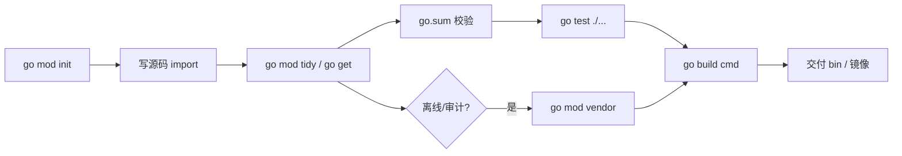
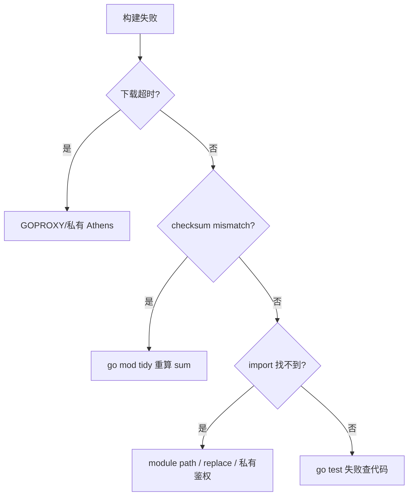

# 02｜工程结构与 go mod · SRE 开发能力

> 大家好，欢迎来到这次分享。开讲之前，先带大家回到一个很多值班同学都踩过的现场：
> 新人 clone 巡检仓库后直接 `go build main.go`，依赖拉不下来；有人把 `go.mod` 里的 `replace` 提交进 Git，同事本机构建指向了不存在的路径；CI 缓存了旧 `go.sum` 导致 `checksum mismatch`——根子是没看清**一个 Go 模块从 init、拉依赖到 build 交付**的整条链。
> 这一章讲完，你会知道当时那几个人各自错在哪——模块从 init、sum、目录布局到 replace，站站都能让同事 clone 后编不过。
> **本章回答的问题**：模块的一生——`go mod init`、module path、`require`/`go.sum`、目录布局（`cmd`/`internal`/`pkg`）、`go build`/`go test`、版本与 `replace`/`vendor`。
> **本章不讲**：值类型与零值 → [01 基础语法与类型系统](../01-基础语法与类型系统/)；slice/map 陷阱 → [03 类型零值与slice-map陷阱](../03-类型零值与slice-map陷阱/)；交叉编译与 `-ldflags` 细节 → [15 编译交付与读源码](../15-编译交付与读源码/)。

**怎么听这场分享**：先把「一个 Go 模块的一生」主图装进脑子——init → tidy → test → build；放慢 go.sum 与 replace；作战节回到开头 checksum / 错误 replace 现场。每一节讲完会提示对应练习题，趁热打铁。

## 面试怎么考

| 标记 | 考点 |
|------|------|
| **核心** | `go.mod` 三要素；`cmd/` 放 main；`internal/` 防外部 import；`go build ./...` |
| **必会** | `go mod tidy`；`go.sum` 作用；语义化版本 `v0/v1`；`replace` 仅本地调试 |
| **常用** | 多模块 `go.work`；`vendor` 离线构建；`//go:build` 条件编译 |
| **常考** | `GOPATH` 模式已过时；module path 与 import 路径一致；不能把私人 `replace` 提交 |

**30 秒怎么说**：Go 1.11+ 用 **module** 管依赖：`go.mod` 写 module 路径和 `require`，`go.sum` 记校验和。可执行入口放 `cmd/<tool>/main.go`，库放 `internal/`（仅本模块）或 `pkg/`（可被外部引）。日常 `go mod tidy` 整理依赖，`go build -o bin/ ./cmd/...` 出二进制。`replace` 指向本地路径只适合开发，别进主分支。CI 用 `go test ./...` + 固定 Go 版本。

---

## 能力边界

| 维度 | go mod 工程 | GOPATH 老项目 | 单文件 `go run` |
|------|-------------|---------------|-----------------|
| **适合** | 团队仓库、可复现构建、CI | 维护遗产时要会认 | 本地试语法 |
| **不适合** | 无版本锁定的随手脚本 | 新项目别再用 | 交付生产二进制 |
| **你要会** | 修 `sum` 冲突、目录规范 | 迁移到 module | 何时该建 module |

- **module path**：import 唯一前缀，不解决业务域名 DNS。
- **internal**：封装实现细节，不解决权限 ACL。
- **go.sum**：供应链校验，不解决漏洞扫描（另用 govulncheck）。

> **记住**：模块的一生在 **`go build` 通过且二进制可交付** 处收束——之前每一步（init、tidy、test）都是门禁。

---

## 语言最小集

| 零件 | 示例 | 含义 |
|------|------|------|
| go mod init | `go mod init github.com/org/sre-tools` | 创建 go.mod |
| module | `module github.com/org/sre-tools` | 本模块 import 前缀 |
| require | `require k8s.io/client-go v0.29.0` | 直接依赖及版本 |
| go.sum | 自动生成 | 模块 zip 校验和 |
| go mod tidy | 整理 require | 加缺删无用 |
| go get | `go get pkg@v1.2.3` | 升/降级依赖 |
| replace | `replace x => ../x` | 本地覆盖路径 |
| cmd | `cmd/exporter/main.go` | 多个可执行入口 |
| internal | `internal/store/` | 父树外不可 import |
| build tag | `//go:build linux` | 条件编译 |
| go build | `go build -o bin/t ./cmd/t` | 编译包 |
| go test | `go test ./...` | 跑测试 |
| go.work | `go work init` | 本地多模块联调 |
| vendor | `go mod vendor` | 依赖进仓库 |

```bash
# 最小工程流
go mod init github.com/example/k8s-patrol
mkdir -p cmd/patrol internal/k8s
go build -o bin/patrol ./cmd/patrol/
```

---

## 一、一张图：一个 Go 模块的一生 ⭐🔥

> 🎯 **一句话**：**init 定身份 → tidy/get 锁依赖 → 写代码 import → test 验证 → build 出二进制 →（可选）vendor/发布**。



**读图**：从 `init` 到 `build` 是主路径；**C→D** 若 `sum` 与代理不一致，CI 红在下载阶段而非业务逻辑。SRE 平台化要把 `go test` 和 `go build` 都进流水线，别只 `go build` 跳过测试。


好，主图装进脑子了。接下来从 `go mod init` 与 module path 开始。

本节对应练习题 Q13。

---

## 二、出生：go mod init 与 module path ⭐

> 🎯 **一句话**：**module 行 = 别人 import 你代码时的 URL 路径前缀**；应用仓库常用 `github.com/<org>/<repo>`。

```bash
mkdir -p ~/sre/k8s-patrol && cd $_
go mod init github.com/moonton/k8s-patrol
```

```go
// go.mod
module github.com/moonton/k8s-patrol

go 1.22
```

```go
// internal/k8s/client.go
package k8s

// 被同模块引用：
// import "github.com/moonton/k8s-patrol/internal/k8s"
```

> ⚠️ **别混**：module path **不必**真有 GitHub 仓库，但要**全局唯一**且团队统一；私有库用公司域名 `go.company.com/team/tool`。

### go 版本行

`go 1.22` 表示**最低语言特性/toolchain**；CI 的 `setup-go` 版本应 ≥ 该行。

> 📝 **面试**：「GOPATH 时代 import 路径要在 GOPATH/src 下；module 模式路径写在 go.mod，代码可在任意目录。」


身份定了。下一节看 require 与 go.sum 怎么锁依赖。

本节对应练习题 Q1。

---

## 三、成长：require、go get 与 go.sum ⭐🔥

> 🎯 **一句话**：`require` 列**直接依赖**；`go.sum` 记录模块内容与哈希，**提交进 Git**。

大家想想：go.sum 要不要提交？很多人会答「生成文件别提交」——错了。⭐ **sum 是可复现构建的指纹**，必须进 Git。

```go
require (
    k8s.io/apimachinery v0.29.2
    github.com/prometheus/client_golang v1.19.0
)
```

```bash
go get k8s.io/client-go@v0.29.2   # 加/升级
go get github.com/foo/bar@v1.2.3  # 指定版本
go mod tidy                       # 删未用、补间接依赖
```

### go.sum 是什么

- 每个模块版本对应 `go.mod` hash + `.zip` hash
- `go build` 下载时校验，防篡改
- **冲突**：两人各改依赖合并后跑 `go mod tidy` 再提交

> 💡 **打个比方**：`go.sum` 就像超市购物小票——上面记录了每件商品（依赖）的条码和价格（哈希）。结账（`go build`）时收银员会逐件核对，小票上没记录的或对不上的，一律拒收。所以小票必须随购物车（代码仓库）一起提交，不然别人结账就过不了。

```text
# 典型 CI 失败
verifying module: checksum mismatch
    downloaded: h1:abc...
    go.sum:     h1:def...
```

修法：`go clean -modcache`（慎用）→ `go mod tidy` → 提交新 sum；或对齐 GOPROXY。

> 🔍 **实操**：CI 里看到 `checksum mismatch` 时，先看是不是有人手动改了 `go.sum`（Git blame 最后一行），再看是不是 GOPROXY 指向了不同镜像——同一模块版本在不同镜像偶尔有细微差异（如被重新打包）。最快修法是删掉 `go.sum` 里冲突那几行，跑 `go mod tidy` 重新生成，提交。

### 间接依赖 indirect

```go
require github.com/spf13/cobra v1.8.0 // indirect
```

`tidy` 自动标注；主模块代码未直接 import 但传递需要。


依赖锁讲完。⭐ go.sum **要进 Git**；mismatch 别瞎删硬撑。

本节对应练习题 Q2、Q5、Q10。

---

## 四、目录布局：cmd、internal、pkg ⭐🔥

> 🎯 **一句话**：**cmd 一个子目录一个二进制**；**internal 禁止模块外 import**；**pkg 可选对外库**。

⭐ 面试必考。口诀：**cmd 入口，internal 内脏，pkg 对外**。

```text
k8s-patrol/
  go.mod
  go.sum
  cmd/
    patrol/            - 巡检 CLI
      main.go
    exporter/          - Prometheus exporter
      main.go
  internal/
    k8s/               - 仅本仓库用
    config/
  pkg/                 - 若别的仓库要引再用
    version/
```

```go
// cmd/patrol/main.go
package main

import (
    "github.com/moonton/k8s-patrol/internal/k8s"
)

func main() {
    k8s.RunPatrol()
}
```

`cmd/` 是 `main` 包、可多个，是部署物入口；`internal/` 放实现细节，编译器强制不可被外模块引；`pkg/` 提供稳定公共 API，真要给外人用再放。

> 💡 **打个比方**：`cmd` 是机房入口闸机；`internal` 是机柜间只允许本楼员工；`pkg` 是对外开放的 API 文档层。


目录讲完。口诀：**cmd 放入口，internal 不外借，pkg 才对外**。

本节对应练习题 Q3、Q4。

---

## 五、构建与测试：go build / go test ⭐

> 🎯 **一句话**：**对包路径构建**，不是对单个 `.go` 文件（除非临时试）。

```bash
# 构建单个工具
go build -o bin/patrol ./cmd/patrol/

# 构建所有 cmd
go build -o bin/ ./cmd/...

# 全模块测试
go test ./...

# 带 race（并发代码，见 07 章）
go test -race ./internal/...
```

```bash
# 常见 CI
go vet ./...
go test -count=1 ./...
go build -trimpath -ldflags="-s -w" -o dist/patrol ./cmd/patrol/
```

`-trimpath` 去绝对路径；`-ldflags` 注入版本见 15 章。

### 包路径 vs 文件系统

```bash
go build ./internal/k8s    # 编译库包，不产生 cmd 级 main
```


构建讲完。`go build main.go` 和 `go build ./cmd/...` 不是一回事。

本节对应练习题 Q8。

---

## 六、replace、vendor 与 go.work 🔥

> 🎯 **一句话**：`replace` **本地覆盖**依赖路径；`vendor` **把依赖拷进仓库**；`go.work` **本地多模块联调**。

🔥 大白话：replace 像「我电脑上的捷径」；提交进 Git = 强迫同事走你的捷径。联调优先 go.work。

### replace（⚠️ 慎提交）

```go
replace github.com/moonton/lib => ../lib
```

适合：同时改两个仓库。合并前删除或仅 `go.work` 本地使用。

> 💡 **打个比方**：`replace` 就像电话呼叫转移——你本来要拨 `github.com/moonton/lib`（原号），但 `replace` 把呼叫转到 `../lib`（你的手机）。转移只在你的 `go.mod` 里生效，别人看不到这条转发规则，所以一旦提交进主分支，同事的机器上「转发目标」不存在，构建就断了。

### vendor

```bash
go mod vendor
go build -mod=vendor ./cmd/patrol/
```

 air-gap、审计要源码 tarball 时用；增大仓库体积。

### go.work

```bash
go work init ./k8s-patrol ./lib
```

多模块 monorepo 本地开发；`go.work` 通常 **gitignore**，不替代各子模块 `go.mod`。

> ⚠️ **go.work vs monorepo**：真正的 monorepo（如 Uber 的单一仓库）不需要 `go.work`——所有代码在同一个 `go.mod` 里。`go.work` 解决的是**多仓库同时改**：你有 `k8s-patrol` 和 `lib` 两个独立仓库，改 lib 时想看 patrol 是否兼容，用 `go.work` 把两者串起来，`replace` 都不用写。CI 里 `go.work` 存在会覆盖 `go.mod` 的依赖解析，**不要提交**。


本地覆盖讲完。🔥 replace 是本地创可贴，乱提交会让同事编不过。

本节对应练习题 Q6、Q7、Q9。

---

## 七、条件编译与构建标签 ⭐

> 🎯 **一句话**：`//go:build` 控制**哪些文件参与编译**；平台、功能开关常用。

```go
//go:build linux

package probe
```

```go
//go:build darwin

package probe
```

```bash
GOOS=linux GOARCH=amd64 go build ./cmd/patrol/
```

交叉编译默认开启（CGO 除外）。写 OS 专属探针（如 `iptables`）要拆文件。

### 常见 GOOS/GOARCH 组合

| GOOS | GOARCH | 典型场景 |
|------|--------|----------|
| `linux` | `amd64` | 生产服务器主流 |
| `linux` | `arm64` | AWS Graviton / 树莓派 |
| `darwin` | `arm64` | Apple Silicon 本地开发 |
| `windows` | `amd64` | 内网 Windows Agent |

```bash
# 同时交叉编译多平台
for pair in linux/amd64 linux/arm64 darwin/arm64; do
    os=${pair%/*}; arch=${pair#*/}
    GOOS=$os GOARCH=$arch go build -o bin/patrol-$os-$arch ./cmd/patrol/
done
```

CI 里配合 `matrix` 矩阵构建，每个 `GOOS/GOARCH` 产出独立二进制。


构建标签点到为止。下一节版本语义。

本节对应练习题 Q12。

---

## 八、版本语义与升级策略 ⭐

> 🎯 **一句话**：**v0/v1+ 语义化版本**；`v2+` 模块 path 要带 `/v2` 后缀。

```bash
go get example.com/foo@v1.4.0
go get example.com/foo@latest
```

- 生产依赖：钉 minor/patch，CI 定期 `govulncheck`
- k8s client-go：与集群 minor 对齐（查兼容表）
- 大版本：单独分支升级 + 全量 test

`go list -m -u all` 看可升级项；别活动前 `latest` 一把梭。


版本策略讲完。下一节 CI 依赖故障剧本。

本节对应练习题 Q12。

---

## 九、作战：CI 与依赖故障剧本 🔧🔥

> 🎯 **一句话**：**先区分是代理/网络、sum 冲突还是代码 import 错**。



| 现象 | 原因 | 修法 |
|------|------|------|
| `410 Gone` on proxy | 版本被撤回 | 换版本或直连 sumdb |
| 私有库 401 | 无 GOPRIVATE/ssh | `GOPRIVATE=*.corp.com` + git 凭据 |
| `use of internal` | 跨模块引 internal | 改 pkg 或合模块 |
| 二进制无版本信息 | 未 ldflags | 15 章注入 `main.version` |

### 收束：模块一生清单

- init：定 module path，建 `cmd/`
- 依赖：`go get` + `tidy`，提交 `go.sum`
- 布局：main 在 cmd，逻辑在 internal
- 验证：`go vet` + `go test ./...`
- 交付：`go build` 出 bin / 打镜像
- 可选：vendor / work / replace 仅本地

**不保证什么**：`go.mod` 不锁**间接**漏洞；`replace` 不解决 fork 维护成本。

> 🔍 **实操**：每次合并 PR 后的标准动作——`go mod tidy && go mod verify && go test ./...`。`tidy` 会自动清理被删除代码遗留的无用 `require`、补上新增 import 的间接依赖；`verify` 验证 `go.sum` 与缓存一致。如果 `tidy` 后 `git diff` 里有大量变动，说明分支间依赖版本差异大，合并前先对齐版本再合。

---

本节对应练习题 Q12。

现在再看群里那句「replace 提交进 Git / checksum mismatch」，你知道该怎么拦住他了——先分本地联调还是可复现构建，再动 go.mod。下面是可复制的生产模板（代码块一字不改，直接拿走）。

## 生产模板 🔧

### 模板 1：标准仓库骨架

```text
# 一次性初始化
go mod init github.com/moonton/sre-patrol
mkdir -p cmd/patrol internal/{config,k8s} scripts
```

```go
// cmd/patrol/main.go
package main

import (
    "os"

    "github.com/moonton/sre-patrol/internal/k8s"
)

func main() {
    if err := k8s.Run(); err != nil {
        os.Exit(1)
    }
}
```

### 模板 2：Makefile 门禁

```makefile
.PHONY: test build
test:
	go vet ./...
	go test -race -count=1 ./...

build:
	go build -trimpath -o bin/patrol ./cmd/patrol/
```

### 模板 3：GitHub Actions 片段

```yaml
- uses: actions/setup-go@v5
  with:
    go-version: '1.22'
- run: go mod download
- run: go test ./...
- run: go build -o patrol ./cmd/patrol/
```

### 模板 4：version 子包（pkg）

```go
// pkg/version/version.go
package version

var (
    Version = "dev"
    Commit  = "none"
)
```

`main` 通过 `-ldflags` 覆盖（15 章）。

---

## 踩坑清单

| 现象 | 原因 | 修法 |
|------|------|------|
| `cannot find module` | 无 go.mod / path 错 | `go mod init` 或改 import |
| `checksum mismatch` | sum 与代理不一致 | `go mod tidy` |
| 提交了 `replace ../` | 别人路径不存在 | 删 replace 或 go.work |
| `go build main.go` 缺依赖 | 只编译单文件 | `go build ./cmd/...` |
| 外部引 internal | 违反封装 | 抽到 pkg 或复制 API |
| vendor 过期 | 依赖升了没 vendor | `go mod vendor` |
| Go 版本不一致 | 本地 1.23 CI 1.21 | 对齐 `go` 行与 CI |
| `go.work` 提交了 | 本地联调文件污染 CI | `gitignore` 掉 `go.work` |
| `duplicate module` | 被引入的依赖有两个 `go.mod` | 合并子目录或删多余 `go.mod` |

---

## 必会 · 常考

| 说法 | 对错 | 口径 |
|------|:----:|------|
| GOPATH 是新项目默认 | 错 | module 模式 |
| go.sum 要提交 Git | 对 | 可复现构建 |
| internal 可被外模块 import | 错 | 编译器禁止 |
| `go mod tidy` 删无用依赖 | 对 | 合并 PR 后必跑 |
| replace 适合长期生产 | 错 | 仅本地调试 |
| `cmd/` 只能有一个 main | 错 | 可多个子目录 |
| `go test ./...` 测所有包 | 对 | 含子模块需注意 |
| vendor 可 `-mod=vendor` 构建 | 对 | 离线场景 |

**易混**：module path vs import path（通常一致）；`go get -u` vs 钉版本；`pkg` vs `internal`。

---

## 十、GOPROXY、GOMODCACHE 与可复现构建 ⭐🔥

> 🎯 **一句话**：依赖下载走 **GOPROXY**；缓存落在 **GOMODCACHE**；**GOSUMDB** 校验 sum——三者决定 CI 能否稳定 `go build`。

```bash
go env GOPROXY GOMODCACHE GOSUMDB GOPRIVATE
# 常见默认
# GOPROXY=https://proxy.golang.org,direct
# GOMODCACHE=$HOME/go/pkg/mod
```

- **GOPROXY**：模块代理链，SRE 注意内网用 Athens/Artifactory。
- **GOPRIVATE**：绕过代理与 sumdb 的域，私有 module 必设。
- **GOMODCACHE**：本机模块缓存，CI 可缓存此目录加速。
- **GOSUMDB**：校验 sum 数据库，离线环境需 `GOSUMDB=off`（慎用）。

```bash
# 团队 .envrc 或 CI 注入
export GOPRIVATE=go.corp.com,github.com/moonton/*
export GOPROXY=https://goproxy.corp.com,direct
```

> 🔍 **实操**：新人入职第一步排查依赖问题，先跑 `go env` 看完整环境。关键看这几行：`GOPROXY` 是否指向公司内网代理、`GOPRIVATE` 是否包含私有域名、`GONOSUMCHECK` 是否误设、`GOVERSION` 是否与 CI 一致。`go env -w GOPRIVATE=go.corp.com` 可永久写入 `~/.config/go/env`（不用每次 export），但 CI 里仍要显式 export。

**读图**：`go mod download` 先查 `GOMODCACHE`，miss 再走 `GOPROXY`；sum 对不上在**写入 cache 前**就失败——所以「本地能编 CI 不能」常是 proxy/私有鉴权差异，不是代码逻辑。

### go list 读依赖图

```bash
go list -m -json all | head   # 全部模块及版本
go mod graph | head           # require 边
why() { go mod why -m "$1"; } # 谁引入了某依赖
```

活动前升级 client-go：先 `go mod why -m k8s.io/apimachinery` 看清传递链，再钉版本 + 全量 test。

```bash
# go mod why 示例输出
$ go mod why -m k8s.io/apimachinery
# k8s.io/apimachinery
github.com/moonton/k8s-patrol/internal/k8s
k8s.io/client-go/kubernetes
k8s.io/apimachinery/pkg/apis/meta/v1
```

看到第二条路径就知道：`apimachinery` 是被 `client-go` 传递引入的，升级 `client-go` 时 `apimachinery` 会跟着变——别手动钉 `apimachinery` 版本，让它随 `client-go` 的 `go.mod` 走。

---

## 命令速查 🔧

```bash
go mod init github.com/org/tool
go mod tidy
go mod download
go mod verify
go list -m all
go list -m -u all
go mod graph
go mod why -m github.com/foo/bar
go env GOPROXY GOMOD GOPATH GOPRIVATE
go build -o bin/t ./cmd/t/
go test -race ./...
go mod vendor && go build -mod=vendor ./...
govulncheck ./...   # 漏洞扫描（可选 CI 阶段）
```

---

## 面试锚点

遮住右列自问自答，卡壳的行回去重读对应小节——能讲出来才算会，看着答案点头不算。

| 问 | 30 秒答 |
|----|---------|
| go.mod 干什么？ | 声明 module 路径与依赖版本 |
| go.sum 能删吗？ | 不能随意删；冲突 tidy 重算 |
| cmd 和 internal？ | cmd 入口；internal 仅模块内 |
| 如何加依赖？ | `go get` + `tidy` |
| replace 能提交吗？ | 一般不提交主分支 |

---

## 合上书，问自己

学到这里，先别急着翻下一章。合上书，试试下面这几件事能不能做到——能做到，这章才算真的听懂了。卡住的那一条，就回到对应的小节再听一遍：

- [ ] 画出模块一生：init → tidy → test → build。（对应练习题 Q13）
- [ ] `go.mod` 与 `go.sum` 各解决什么？（Q2）
- [ ] 为什么 main 放 `cmd/` 而不是根目录？（Q3、Q8）
- [ ] `internal` 和 `pkg` 选型一句话？（Q4）
- [ ] `checksum mismatch` 你怎么处理？（Q10）
- [ ] `replace` 和 `go.work` 区别？（Q6、Q9）
- [ ] CI 最少跑哪三条 go 命令？（Q12）
- [ ] `GOOS=linux go build` 与 module 有关系吗？（作战/第十节）

全部打勾之后，给自己出一个终极测试：找一位同事，十分钟讲清「开头 checksum mismatch / 错误 replace 现场怎么拆」。讲得下来，你就是下一个能拦住「乱改 go.mod」的人。

八题能口述，工程化交付就过关。下一章 [03 类型零值与slice-map陷阱](../03-类型零值与slice-map陷阱/)。
