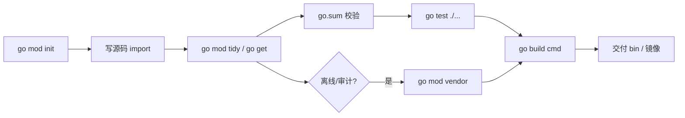
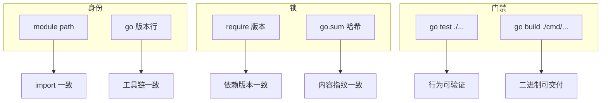
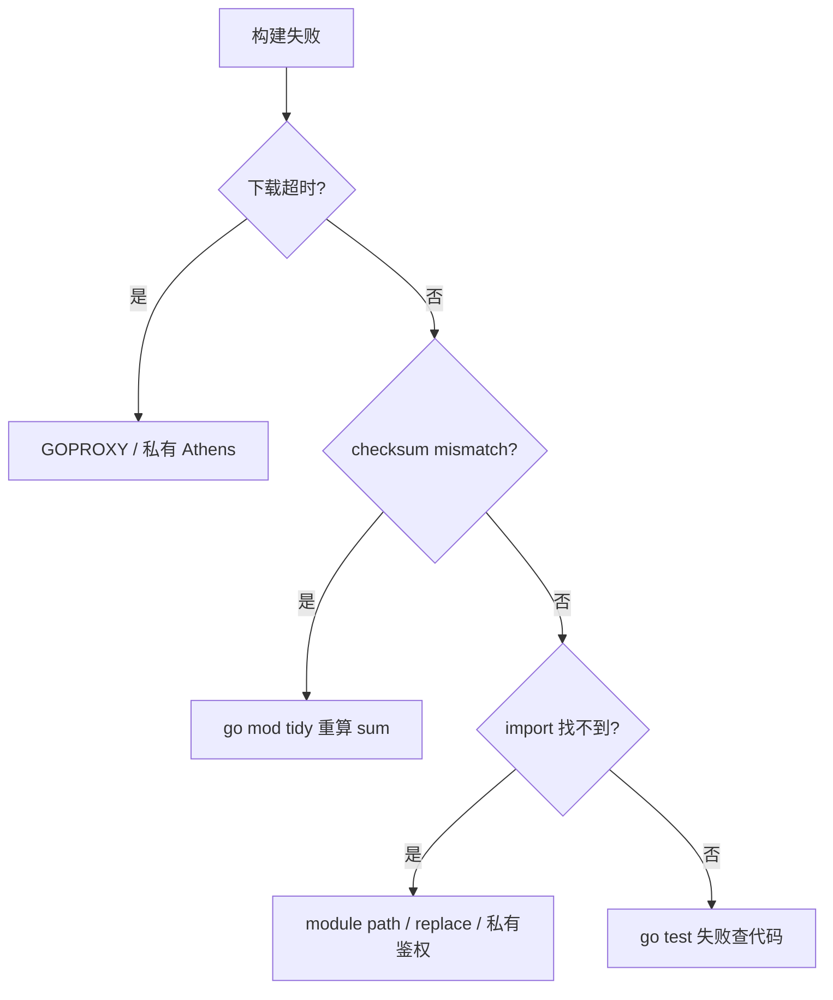

# 02｜工程结构与 go mod · SRE 开发能力

> 新人 clone 巡检仓直接 `go build main.go`，依赖拉不下来；有人把 `go.mod` 里的 `replace ../lib` 提交进 Git，同事本机构建指向不存在的路径；CI 缓存了旧 `go.sum` 报 `checksum mismatch`——群里已经有人喊「清缓存重跑」。
> **本章回答**：一个 Go 模块从 `init`、锁依赖、目录布局到 `build` 交付的整条链——谁定身份、谁锁指纹、谁别进主分支。
> **不讲**：值类型与零值 → [01](../01-基础语法与类型系统/)；slice/map 陷阱 → [03](../03-类型零值与slice-map陷阱/)；交叉编译与 `-ldflags` 细节 → [15](../15-编译交付与读源码/)。

**标记**：🎯重点 · 🔥难点 · ⭐常考 · 🔧实操

---

## 面试怎么考

| 标记 | 考点 |
|------|------|
| **核心** | `go.mod` 三要素；`cmd/` 放 main；`internal/` 防外部 import；`go build ./...` |
| **必会** | `go mod tidy`；`go.sum` 作用；语义化版本 `v0/v1`；`replace` 仅本地调试 |
| **常用** | 多模块 `go.work`；`vendor` 离线构建；`//go:build` 条件编译 |
| **常考** | `GOPATH` 模式已过时；module path 与 import 路径一致；不能把私人 `replace` 提交 |

**30 秒怎么说**：Go 1.11+ 用 **module** 管依赖：`go.mod` 写 module 路径和 `require`，`go.sum` 记校验和。可执行入口放 `cmd/<tool>/main.go`，库放 `internal/`（仅本模块）或 `pkg/`（可被外部引）。日常 `go mod tidy` 整理依赖，`go build -o bin/ ./cmd/...` 出二进制。`replace` 指向本地路径只适合开发，别进主分支。CI 用 `go test ./...` + 固定 Go 版本。

---

## 能力边界

| 维度 | go mod 工程 | GOPATH 老项目 | 单文件 `go run` |
|------|-------------|---------------|-----------------|
| **适合** | 团队仓库、可复现构建、CI | 维护遗产时要会认 | 本地试语法 |
| **不适合** | 无版本锁定的随手脚本 | 新项目别再用 | 交付生产二进制 |
| **你要会** | 修 `sum` 冲突、目录规范 | 迁移到 module | 何时该建 module |

- 🧰 **四个名词各管一层**
  - **module path**：import 唯一前缀——不解决业务域名 DNS
  - **`internal/`**：编译器强制封装——不解决权限 ACL
  - **`go.sum`**：供应链校验指纹——不解决漏洞扫描（另用 `govulncheck`）
  - **`replace`**：本地路径覆盖——不解决 fork 长期维护

> 🎯 **一句话**：模块的一生在 **`go build` 通过且二进制可交付** 处收束——之前每一步（init、tidy、test）都是门禁。

---

## 语言最小集

读运维 Go 仓库的 14 个「零件」——认仓下限，不是工具链大全。

| 零件 | 示例 | 含义 |
|------|------|------|
| go mod init | `go mod init github.com/org/sre-tools` | 创建 go.mod |
| module | `module github.com/org/sre-tools` | 本模块 import 前缀 |
| require | `require k8s.io/client-go v0.29.0` | 直接依赖及版本 |
| go.sum | 自动生成 | 模块 zip 校验和 |
| go mod tidy | 整理 require | 加缺删无用 |
| go get | `go get pkg@v1.2.3` | 升/降级依赖 |
| replace | `replace x => ../x` | 本地覆盖路径 |
| cmd | `cmd/exporter/main.go` | 多个可执行入口 |
| internal | `internal/store/` | 父树外不可 import |
| build tag | `//go:build linux` | 条件编译 |
| go build | `go build -o bin/t ./cmd/t` | 编译包 |
| go test | `go test ./...` | 跑测试 |
| go.work | `go work init` | 本地多模块联调 |
| vendor | `go mod vendor` | 依赖进仓库 |

```bash
# 最小工程流（README 里写死）
go mod init github.com/example/k8s-patrol
mkdir -p cmd/patrol internal/k8s
go build -o bin/patrol ./cmd/patrol/
```

---

## 一、一张图：一个 Go 模块的一生

> 🎯 **一句话**：**init 定身份 → tidy/get 锁依赖 → 写代码 import → test 验证 → build 出二进制 →（可选）vendor/发布**。



- 📖 **读图**
  - 🛤️ 主线：init → 写代码 → tidy → sum 校验 → test → build → 交付
  - 💣 **C→D** 若 sum 与代理不一致，CI 红在下载阶段而非业务逻辑；跳过 **E** 只 `go build` = 把测试甩给生产

本节对应练习题 Q13。身份定了，先看 module path 怎么起。

---

## 二、出生：go mod init 与 module path ⭐

> 🎯 **一句话**：**module 行 = 别人 import 你代码时的 URL 路径前缀**；应用仓库常用 `github.com/<org>/<repo>`。

```bash
mkdir -p ~/sre/k8s-patrol && cd $_
go mod init github.com/moonton/k8s-patrol
cat go.mod
# module github.com/moonton/k8s-patrol
# go 1.22
```

```go
// internal/k8s/client.go
package k8s

// 被同模块引用：
// import "github.com/moonton/k8s-patrol/internal/k8s"
```

- 🪪 **module path 三件事**
  - 全局唯一、团队统一——私有库用公司域名 `go.company.com/team/tool`
  - **不必**真有 GitHub 仓库，但 import 字符串必须与 module 行一致
  - `go` 版本行 = 最低语言特性 / toolchain；CI `setup-go` 应 ≥ 该行

#### ❓ 为什么 module path 不必是真实 URL？

- 🧭 **它是 import 前缀，不是 DNS 解析目标**——工具按路径字符串匹配模块，不先 `curl` 仓库首页
- ✅ **团队约定唯一即可**；真要 `go get` 私有库，靠 `GOPRIVATE` + git 凭据，不是靠 path「能打开网页」
- ⚠️ 随意改 path = 全仓 import 要跟着改——起名时当契约，不当临时标签

> ⚠️ **别混**：GOPATH 时代 import 路径要在 `GOPATH/src` 下；module 模式路径写在 `go.mod`，代码可在任意目录。

> 📝 **面试**：问「module path 干什么」——答「别人 import 你时的唯一前缀；与仓库目录树相对路径拼成完整 import」。⭐

本节对应练习题 Q1。身份定了，下一站锁依赖。

---

## 三、成长：require、go get 与 go.sum ⭐🔥

> 🎯 **一句话**：`require` 列**直接依赖**；`go.sum` 记录模块内容与哈希，**必须提交进 Git**。

```go
require (
    k8s.io/apimachinery v0.29.2
    github.com/prometheus/client_golang v1.19.0
)
```

```bash
go get k8s.io/client-go@v0.29.2   # 加/升级
go get github.com/foo/bar@v1.2.3  # 指定版本
go mod tidy                       # 删未用、补间接依赖
```

### 🧾 go.sum 是什么 🔥

- 每个模块版本对应 `go.mod` hash + `.zip` hash
- `go build` 下载时校验，防篡改
- **冲突**：两人各改依赖合并后跑 `go mod tidy` 再提交

> 💡 **打个比方**：`go.sum` 像超市购物小票——每件商品（依赖）的条码和价格（哈希）。结账（`go build`）时收银员逐件核对；小票必须随购物车（仓库）一起提交，不然别人结账过不了。

#### ❓ 为什么 go.sum 必须提交、不能当「生成文件」丢掉？

- ❌ **「生成物别进 Git」**：对 `bin/`、`vendor/`（可选）成立，对 **sum 不成立**——sum 是**可复现构建的指纹契约**
- ✅ 同事 / CI 用同一份 sum 才能证明「下到的 zip 就是当初锁的那份」
- 🧨 删了 sum 再 tidy：可能 silently 接受代理上另一份同版本内容（或修掉冲突），**diff 必须进 PR 评审**

```text
# 典型 CI 失败
verifying module: checksum mismatch
    downloaded: h1:abc...
    go.sum:     h1:def...
```

- 🔍 **现场**：先 `git blame` 冲突行 → 再比 `GOPROXY` 是否与本地一致 → 删冲突行后 `go mod tidy` 重算并提交；慎用 `go clean -modcache`（清全机缓存）

### 📎 间接依赖 `indirect`

```go
require github.com/spf13/cobra v1.8.0 // indirect
```

- `tidy` 自动标注：主模块代码未直接 import，但传递需要
- 升级时用 `go mod why -m <pkg>` 看清是谁引进来的（见收口 `go list`）

> ⚠️ **别混**：`require` 锁的是**版本选择**；`go.sum` 锁的是**内容哈希**——只改一边不够。

本节对应练习题 Q2、Q5、Q10。依赖锁住了，目录怎么摆？

---

## 四、目录布局：cmd、internal、pkg ⭐🔥

> 🎯 **一句话**：**cmd 一个子目录一个二进制**；**internal 禁止模块外 import**；**pkg 可选对外库**。

⭐ 口诀：**cmd 入口，internal 内脏，pkg 对外**。

```text
k8s-patrol/
  go.mod
  go.sum
  cmd/
    patrol/            ← 巡检 CLI
      main.go
    exporter/          ← Prometheus exporter
      main.go
  internal/
    k8s/               ← 仅本仓库用
    config/
  pkg/                 ← 若别的仓库要引再用
    version/
```

```go
// cmd/patrol/main.go
package main

import (
    "github.com/moonton/k8s-patrol/internal/k8s"
)

func main() {
    k8s.RunPatrol()
}
```

- 🚪 **`cmd/`**：`package main`，可多个子目录——每个是部署物入口
- 🔒 **`internal/`**：实现细节；编译器强制：父树外模块 **不可** import
- 📚 **`pkg/`**：稳定公共 API；真要给外人用再放——别先空建

> 💡 **打个比方**：`cmd` 是机房入口闸机；`internal` 是机柜间只允许本楼员工；`pkg` 是对外开放的 API 文档层。

#### ❓ 为什么 main 放 `cmd/` 而不是仓库根目录？

- 📦 **一个仓库多个工具**时，根目录一个 `main.go` 会挤成一团；`cmd/patrol`、`cmd/exporter` 各自独立入口
- 🧪 `go build ./cmd/...` / `go test ./...` 路径语义清晰——对**包**构建，不是对散落文件
- 🏗️ 库代码进 `internal/`，入口只做组装——CI 矩阵、镜像 `ENTRYPOINT` 都好对上

> ⚠️ **别混**：`use of internal package not allowed` = 跨模块引了 `internal`——抽到 `pkg` 或把代码合进同一 module，别「改权限绕过」。

> 📝 **面试**：cmd 放入口、internal 编译器禁止外引、pkg 才对外——三句话背完。⭐

本节对应练习题 Q3、Q4。目录好了，怎么编、怎么测？

---

## 五、构建与测试：go build / go test ⭐

> 🎯 **一句话**：**对包路径构建**，不是对单个 `.go` 文件（除非临时试）。

```bash
go build -o bin/patrol ./cmd/patrol/     # 单个工具
go build -o bin/ ./cmd/...               # 所有 cmd
go test ./...                            # 全模块测试
go test -race ./internal/...             # 并发代码（→ 07）
```

```bash
# 常见 CI 门禁
go vet ./...
go test -count=1 ./...
go build -trimpath -ldflags="-s -w" -o dist/patrol ./cmd/patrol/
# ← -trimpath 去绝对路径；-ldflags 注入版本见 15 章
```

#### ❓ 为什么 `go build main.go` 常常不够？

- 📄 **单文件模式**：只编译列出来的文件，**不走完整 module 解析习惯**——缺同包其它 `.go`、依赖易诡异
- ✅ **包路径**：`go build ./cmd/patrol/` 编译该目录整个包 + 按 `go.mod` 拉依赖
- 🏭 交付物应对 `./cmd/...`，别把「试语法的 `go run x.go`」写进 CI

```bash
go build ./internal/k8s    # 编译库包，不产生可执行文件
# ← 库包无 main；要二进制必须对着 cmd
```

本节对应练习题 Q8。本地联调三件套：replace / vendor / go.work。

---

## 六、replace、vendor 与 go.work 🔥

> 🎯 **一句话**：`replace` **本地覆盖**依赖路径；`vendor` **把依赖拷进仓库**；`go.work` **本地多模块联调**。

🔥 大白话：replace 像「我电脑上的捷径」；提交进 Git = 强迫同事走你的捷径。联调优先 `go.work`。

### 🔀 replace（⚠️ 慎提交）

```go
replace github.com/moonton/lib => ../lib
```

> 💡 **打个比方**：`replace` 像电话呼叫转移——本该拨 `github.com/moonton/lib`，转到 `../lib`。转移只在你的 `go.mod` 生效；提交进主分支，同事机器上目标路径不存在，构建直接断。

#### ❓ 为什么联调优先 go.work，而不是提交 replace？

- 🩹 **`replace` 写进 go.mod** = 污染模块契约，CI / 同事一起受害
- 🧰 **`go.work`**：本地把多个独立 module 串起来联调，**通常 gitignore**，不改各子模块 `go.mod`
- 🏢 真 monorepo（单一 `go.mod`）不需要 `go.work`——`go.work` 解的是**多仓库同时改**

```bash
go work init ./k8s-patrol ./lib
# go.work 进 .gitignore；CI 里若存在会覆盖 go.mod 解析——不要提交
```

### 📦 vendor

```bash
go mod vendor
go build -mod=vendor ./cmd/patrol/
```

- 适用：air-gap、审计要源码 tarball
- 代价：仓库体积涨；依赖升了忘 `go mod vendor` = vendor 过期

> ⚠️ **别混**：`go.work` ≠ monorepo；`vendor` ≠ 替代 `go.sum`（sum 仍要提交）。

本节对应练习题 Q6、Q7、Q9。

---

## 七、条件编译与版本语义 ⭐

> 🎯 **一句话**：`//go:build` 控制**哪些文件参与编译**；**v2+** 模块 path 要带 `/v2` 后缀。

### 🏷️ 构建标签

```go
//go:build linux
package probe
```

```bash
GOOS=linux GOARCH=amd64 go build ./cmd/patrol/
```

- 写 OS 专属探针（如 `iptables`）拆文件；交叉编译默认可用（CGO 除外）
- 常见组合：`linux/amd64` 生产、`linux/arm64` Graviton、`darwin/arm64` 本机

```bash
for pair in linux/amd64 linux/arm64 darwin/arm64; do
  os=${pair%/*}; arch=${pair#*/}
  GOOS=$os GOARCH=$arch go build -o bin/patrol-$os-$arch ./cmd/patrol/
done
```

### 📌 版本与升级

```bash
go get example.com/foo@v1.4.0
go list -m -u all          # 可升级项
```

- 生产：钉 minor/patch；CI 定期 `govulncheck`
- k8s `client-go`：与集群 minor 对齐（查兼容表）
- **v2+**：module path 必须带 `/v2`（或 `/v3`…）——这是 Go modules 的语义化版本规则

#### ❓ 为什么 v2+ 要在 path 里带 `/v2`？

- 📐 **import 路径即版本身份**：`v2` 与 `v1` 当成**不同 module**，允许同仓并存、避免 silent 大破坏性升级
- ❌ 只把 git tag 打成 `v2.0.0` 但不改 module path → `go get` / import 会乱
- ✅ 大版本单独分支升级 + 全量 `go test`；别活动前 `@latest` 一把梭

本节对应练习题 Q12。机制齐了——收成「可复现」清单。

---

## 八、收束：模块凭什么可复现 🔥

> 🎯 **一句话**：可复现 = **同一份 go.mod/go.sum + 同一 Go 版本 + 同一套 tidy/test/build 命令**。



- 📖 **读图**
  - 🪪 **身份**（path + go 行）解决「import / 语言特性对齐」
  - 🔒 **锁**（require + sum）解决「跨机下到同一份依赖」
  - 🚪 **门禁**（test + build）解决「能编 ≠ 能过测」

**可背清单（六件套）**：

1. `go mod init` 定 path，建 `cmd/`
2. `go get` + `tidy`，**提交 `go.sum`**
3. main 在 `cmd/`，逻辑在 `internal/`
4. CI：`go vet` + `go test ./...` + `go build`
5. `replace` / `go.work` 仅本地；主分支干净
6. 固定 CI Go 版本 ≥ `go.mod` 的 `go` 行

> ⚠️ **别混**：`go.mod` **不锁间接漏洞**——要 `govulncheck`；工程结构也不保证业务正确。

### 🌐 GOPROXY / GOPRIVATE（一眼）

```bash
go env GOPROXY GOMODCACHE GOSUMDB GOPRIVATE
# GOPROXY=https://proxy.golang.org,direct
# GOMODCACHE=$HOME/go/pkg/mod
```

- **GOPROXY**：模块代理链；内网用 Athens / Artifactory
- **GOPRIVATE**：绕过代理与 sumdb 的域——私有 module 必设
- **GOMODCACHE**：本机缓存；CI 可缓存加速
- **本地能编 CI 不能**：常是 proxy / 私有鉴权差异，不是业务代码

```bash
export GOPRIVATE=go.corp.com,github.com/moonton/*
export GOPROXY=https://goproxy.corp.com,direct
```

```bash
go mod why -m k8s.io/apimachinery
# 看清谁传递引入——升级 client-go 时让 apimachinery 跟着走，别手钉打架
```

本节对应练习题 Q13。回到开头那三类事故——作战。

---

## 九、作战：CI 与依赖故障剧本 🔧🔥

> 🎯 **一句话**：**先区分是代理/网络、sum 冲突还是代码 import 错**。



- 📖 **读图**：超时走代理；mismatch 走 tidy；找不到模块走 path/replace/GOPRIVATE；其余才是代码。

### 现象 · 先做 · 别做

| 现象 | 先做 | 别做 |
|------|------|------|
| `checksum mismatch` | blame sum → tidy 重算 | 瞎删整个 sum 不看 diff |
| 提交了 `replace ../` | 删 replace 或改用 go.work | 让同事改本机路径迁就你 |
| `cannot find module` | 有无 go.mod；import 是否对齐 path | 回到 GOPATH 模式硬扛 |
| `use of internal` | 抽 pkg 或合模块 | 复制源码绕编译器 |
| 私有库 401 | `GOPRIVATE` + git 凭据 | 把 token 写进 go.mod |
| `410 Gone` on proxy | 换版本或直连 sumdb | 关 sumdb 当长期方案 |

### 60 秒剧本 🔧

> 🔍 **现场**：接到「清缓存重跑」之前，60 秒走完这条线。

```text
① 0–10s   go env GOPROXY GOPRIVATE GOVERSION；对齐 CI
② 10–25s  看报错：timeout / mismatch / cannot find / internal
③ 25–45s  mismatch → tidy；replace → 删；401 → GOPRIVATE
④ 45–60s  go mod verify && go test ./... && go build ./cmd/...
```

```bash
go mod tidy && go mod verify && go test ./...
# ← tidy 清无用 require、补间接；verify 对 sum 与缓存；test 别跳
```

本节对应练习题 Q10、Q12。

---

## 生产模板（🔧实操）

### 模板 1：标准仓库骨架

```text
go mod init github.com/moonton/sre-patrol
mkdir -p cmd/patrol internal/{config,k8s} scripts
```

```go
// cmd/patrol/main.go
package main

import (
    "os"

    "github.com/moonton/sre-patrol/internal/k8s"
)

func main() {
    if err := k8s.Run(); err != nil {
        os.Exit(1)
    }
}
```

### 模板 2：Makefile 门禁

```makefile
.PHONY: test build
test:
	go vet ./...
	go test -race -count=1 ./...

build:
	go build -trimpath -o bin/patrol ./cmd/patrol/
```

### 模板 3：GitHub Actions 片段

```yaml
- uses: actions/setup-go@v5
  with:
    go-version: '1.22'
- run: go mod download
- run: go test ./...
- run: go build -o patrol ./cmd/patrol/
```

### 模板 4：version 子包（pkg）

```go
// pkg/version/version.go
package version

var (
    Version = "dev"
    Commit  = "none"
)
```

`main` 通过 `-ldflags` 覆盖（→ [15](../15-编译交付与读源码/)）。

---

## 踩坑清单

| 现象 | 原因 | 修法 |
|------|------|------|
| `cannot find module` | 无 go.mod / path 错 | `go mod init` 或改 import |
| `checksum mismatch` | sum 与代理不一致 | `go mod tidy` |
| 提交了 `replace ../` | 别人路径不存在 | 删 replace 或 go.work |
| `go build main.go` 缺依赖 | 只编译单文件 | `go build ./cmd/...` |
| 外部引 internal | 违反封装 | 抽到 pkg 或合模块 |
| vendor 过期 | 依赖升了没 vendor | `go mod vendor` |
| Go 版本不一致 | 本地 1.23 CI 1.21 | 对齐 `go` 行与 CI |
| `go.work` 提交了 | 本地联调污染 CI | `gitignore` 掉 `go.work` |

---

## 必会 · 常考（⭐常考）

| 说法 | 对错 | 口径 |
|------|:----:|------|
| GOPATH 是新项目默认 | 错 | module 模式 |
| go.sum 要提交 Git | 对 | 可复现构建指纹 |
| internal 可被外模块 import | 错 | 编译器禁止 |
| `go mod tidy` 删无用依赖 | 对 | 合并 PR 后必跑 |
| replace 适合长期生产 | 错 | 仅本地调试 |
| `cmd/` 只能有一个 main | 错 | 可多个子目录 |
| `go test ./...` 测所有包 | 对 | CI 最少三条之一 |
| vendor 可 `-mod=vendor` 构建 | 对 | 离线场景 |

---

## 十、收口

### 命令速查 🔧

```bash
go mod init github.com/org/tool
go mod tidy
go mod download
go mod verify
go list -m all
go list -m -u all
go mod graph
go mod why -m github.com/foo/bar
go env GOPROXY GOMODCACHE GOPRIVATE
go build -o bin/t ./cmd/t/
go test -race ./...
go mod vendor && go build -mod=vendor ./...
govulncheck ./...
```

### 面试锚点

| 问 | 30 秒答 |
|----|---------|
| go.mod 干什么？ | 声明 module 路径与依赖版本 |
| go.sum 能删吗？ | 不能随意删；冲突 tidy 重算 |
| cmd 和 internal？ | cmd 入口；internal 仅模块内 |
| 如何加依赖？ | `go get` + `tidy` |
| replace 能提交吗？ | 一般不提交主分支 |
| go.work 呢？ | 本地多模块联调，通常 gitignore |

### 易错一句话对照

- `go.sum` 是生成物别提交 → **必须提交**，它是内容指纹
- `replace ../lib` 进主分支方便联调 → 强迫同事走你捷径；用 `go.work`
- `go build main.go` 和 `go build ./cmd/...` 一样 → 前者单文件，后者才是模块交付
- 外部仓库 import 你的 `internal/` → 编译器禁止；公开 API 放 `pkg`
- GOPATH 还是新项目默认 → 已过时；新仓 `go mod init`
- 本地能编就够 → CI 还要对齐 Go 版本、`GOPROXY`/`GOPRIVATE`
- `@latest` 活动前一把梭 → 钉版本 + 全量 test；v2+ path 带 `/v2`
- 关 `GOSUMDB` 当长期方案 → 只应急；修代理/鉴权才是正道

### 数字墙

> module 模式：Go **1.11+**；新项目默认不再走 GOPATH
> CI 最少三条：`go vet ./...` · `go test ./...` · `go build ./cmd/...`
> `go` 行 vs CI：`setup-go` 版本应 **≥** `go.mod` 里的 `go` 行
> 语义化：`v0/v1` path 无后缀；**v2+** path 必须带 `/v2`
> `cmd/`：一个子目录 = 一个二进制入口；可多个
> 合并 PR 后标准三连：`go mod tidy && go mod verify && go test ./...`

---

## 合上书

对着第一节主图口述一遍，卡住就回对应小节。开头那个 checksum / 错误 replace / `go build main.go` 现场——各自错在哪，现在该能说清了。

- [ ] **默画主图**：init → tidy → sum → test → build → 交付。（→ Q13）
- [ ] **口述身份**：module path 是什么？为何不必是真实 URL？（→ Q1）
- [ ] **口述指纹**：`go.mod` 与 `go.sum` 各锁什么？为何 sum 必须进 Git？（→ Q2 · Q10）
- [ ] **口述布局**：为什么 main 放 `cmd/`？`internal` 与 `pkg` 怎么选？（→ Q3 · Q4 · Q8）
- [ ] **口述联调**：`replace` 与 `go.work` 区别？谁可以进主分支？（→ Q6 · Q9）
- [ ] **口述构建**：`go build main.go` 为什么不够？（→ Q8）
- [ ] **定责**：`checksum mismatch` 60 秒怎么拆？（→ Q10 · Q12）
- [ ] **口述版本**：v2+ 为何 path 要带 `/v2`？CI 最少哪三条命令？（→ Q12）

全部打勾后，十分钟给同事讲清「开头 checksum mismatch / 错误 replace 现场怎么拆」。讲得下来，你就是下一个能拦住「乱改 go.mod」的人。

下一章：[类型零值与slice-map陷阱](../03-类型零值与slice-map陷阱/)。
