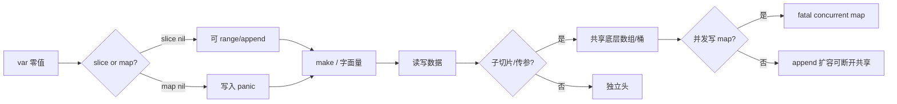
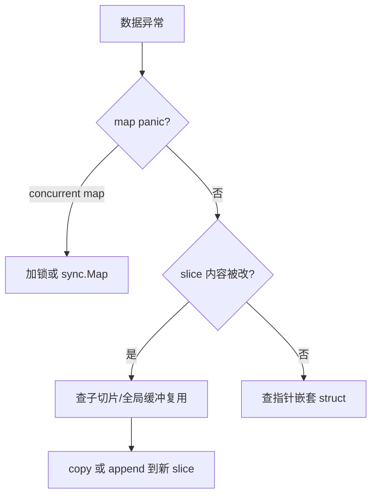

# 03｜类型零值与 slice/map 陷阱 · SRE 开发能力

> 巡检结果 `append` 到共享 slice 后别的 goroutine 数据乱了；`var m map[string]int` 直接赋值 panic；`json.Unmarshal` 到 nil slice 得到 `null` 而 `make([]T,0)` 得到 `[]`——群里已经有人喊「先加锁再说」，手就放在重启键上。
> **本章回答**：slice/map 从零值、共享底层到并发写的一生——谁还握着底层数据，站站都能让数据「莫名被改」。
> **不讲**：基础类型声明 → [01](../01-基础语法与类型系统/)；goroutine 调度 → [05](../05-goroutine与调度模型/)；竞态检测细节 → [07](../07-sync原子与竞态检测/)。

**标记**：🎯重点 · 🔥难点 · ⭐常考 · 🔧实操

---

## 面试怎么考

| 标记 | 考点 |
|------|------|
| **核心** | nil slice 可 range/append；nil map 不能写；slice 传参共享底层；`make` vs `new` |
| **必会** | `len/cap`；`append` 可能 realloc；`copy`；`maps.Clone`（1.21+） |
| **常用** | 截取 `s[low:high]` 仍共享数组；深拷贝要逐层 `copy`/序列化 |
| **常考** | `==` 不能比 slice（除 nil）；map 并发写 panic；空 slice JSON `[]` vs `null` |

**30 秒怎么说**：**零值**里 slice/map/channel 是 nil 头。nil slice 能 `len==0`、`append` 会分配；nil map **写入 panic**，必须先 `make`。slice 是「指针+len+cap」三元组，传参复制头但**共享底层数组**，子切片 `append` 可能踩别人数据。map 非并发安全，并发用 `sync.Map` 或加锁。要独立数据用 `copy`、`maps.Clone`、`slices.Clone`。

---

## 能力边界

| 维度 | 懂 slice/map 语义 | 只会背 append | Python list 习惯 |
|------|-------------------|---------------|------------------|
| **适合** | collector 聚合、批处理缓冲 | 单 goroutine 小脚本 | — |
| **不适合** | 替代 DB 事务 | 多 goroutine 无锁共享 map | 直接套用 |
| **你要会** | 判断数据是否被共享 | — | 何时深拷 |

- 🔑 **三件工具各管一段**
  - **`make`**：分配可用的 slice/map，**不做**元素深拷贝
  - **`copy` / `slices.Clone`**：只拷一层元素；嵌套 slice 内部仍可能共享
  - **`sync.Map`**：读多写少缓存场景，不是通用 map 的万能替代

> ⚠️ **别混**：slice/map 的一生在「**谁还握着底层数据的引用**」上收束——别名和子切片是 SRE 工具里最难查的 silent bug。

---

## 语言最小集

读运维 Go 片段，先认这 12 个零件：

| 零件 | 示例 | 含义 |
|------|------|------|
| 零值 slice | `var s []int` | nil，len=0 cap=0 |
| 空 slice | `make([]int, 0)` / `[]int{}` | 非 nil，len=0 |
| 零值 map | `var m map[string]int` | nil，不可写 |
| make slice | `make([]int, 0, 100)` | len=0 cap=100 |
| make map | `make(map[string]int, 64)` | 可写，容量提示 |
| new | `new(int)` | 分配零值，返回 `*int` |
| append | `s = append(s, x)` | 可能扩容换底层 |
| 切片 | `s[1:3]` | 共享底层 |
| copy | `copy(dst, src)` | 拷到已分配 dst |
| 判 nil | `s == nil` | 可与 nil 比 |
| maps.Clone | `maps.Clone(m)` | 浅拷 map（1.21+） |
| 并发 map | — | 写必须同步 |

```go
var hosts []string                      // nil
hosts = append(hosts, "10.0.0.1")       // OK，分配新底层

m := make(map[string]int)
m["cpu"] = 90
```

---

## 一、一张图：slice/map 的一生 ⭐🔥

> 🎯 **一句话**：**声明零值 → make/字面量 → 读写/append →（可能）共享底层 → 传参/返回别名 → 并发或子切片踩坑**。



- 📖 **读图**
  - ☠️ **D** 是 map 专属死亡点——未 `make` 就写
  - 🔥 **H→L** 是 slice 面试重灾区：`s[:0]` 复用缓冲与 `append` 是否换底层
  - 📊 Exporter 批指标若共享 slice，「上一批尾部污染这一批」就卡在 **H**

本节对应练习题 Q13。

---

## 二、出生：零值、make 与 new ⭐

> 🎯 **一句话**：**make** 初始化 slice/map/channel；**new** 分配单个零值并返回指针。

### 📮 零值对照

- 🔑 **slice**
  - `var s []int` → nil，len=0，**append 可以分配**新底层
  - `s := []int{}` / `make([]int,0)` → **非 nil** 空 slice，len=0
- 🔑 **map**
  - `var m map[K]V` → nil，**写入 panic**
  - `m := map[K]V{}` / `make(map[K]V)` → 非 nil 空 map，可读写

```go
var s []int
fmt.Println(s == nil)     // true
s = append(s, 1)          // OK

var m map[string]int
// m["k"] = 1             // panic: assignment to entry in nil map
m = make(map[string]int)
m["k"] = 1                // OK
```

#### ❓ 为什么 nil slice 能 append，nil map 不能写？

- 🧠 **slice 头是三元组** `(ptr, len, cap)`：`append` 发现 cap 不够就**新分配数组并返回新头**——nil 只是 `ptr==nil, len=0, cap=0`，合法起点
- 🧠 **map 头指向哈希表**：写入要改桶、可能 rehash——**没有表就无处可写**，runtime 直接 panic
- ✅ **口诀**：nil slice 可读可 append；nil map **读可以、写 panic**（读不存在键得零值）
- 📝 **面试**：「nil slice 像空遥控器还能换新电视；nil map 连表都没有，写就是往空气里塞。」⭐

### 🧰 make 容量提示

```go
buf := make([]byte, 0, 4096)        // len 0, cap 4096，少 realloc
idx := make(map[string]int, 1000)   // 减少 rehash（提示非硬上限）
```

### 🆕 new vs make

```go
p := new(int)   // *int，值为 0
// make 只用于 slice, map, chan
```

> 💡 **打个比方**：`make` 像拿到已装修好的房间——进去就能住；`new` 像拿到空盒子地址，里面是零值，你得自己塞东西。

> 📝 **面试**：「make 返回已初始化的引用类型；new(T) 返回 *T 零值。」

本节对应练习题 Q1、Q2、Q3。

---

## 三、slice 内幕：头、子切片与 append ⭐🔥

> 🎯 **一句话**：slice 是**指向底层数组的窗口**；`append` 超 cap 会**新数组**，否则原地写。

> 💡 **打个比方**：slice 头是遥控器，底层数组才是电视机；两个遥控可以对同一台电视。窗户有起始（ptr）、宽度（len）、最大视野（cap）——改一块砖，另一扇窗也看见。

```go
a := []int{1, 2, 3, 4}
b := a[1:3]   // [2, 3]，共享底层
b[0] = 99
fmt.Println(a)  // [1, 99, 3, 4]

c := append(b, 100) // cap 够则写在底层，可能改 a
```

```text
底层数组: [1, 99, 3, 4]
a:  |[1, 99, 3, 4]|  len=4
b:     |[99, 3]|     len=2  ← 与 a 共享
```

- 📖 **读图**：`b` 只是窗口缩窄，**不是**新数组；`b[0]=99` 改的是同一块内存。

#### ❓ 为什么子切片改元素会影响原 slice？

- ❌ **误以为**：「切片是拷贝，改 b 不动 a」
- ✅ **实际**：`a[1:3]` 只复制**头**，`ptr` 仍指向同一底层数组的偏移位置
  - 改元素 = 改共享内存 → 所有别名都看见
  - 要隔离：`append([]T(nil), s...)` / `slices.Clone` / `copy` 到新缓冲
- 🔥 同一 goroutine 内别名 bug **`-race` 抓不到**——竞态检测只管并发访问

#### ❓ 为什么 append 有时换底层、有时不换？

- 📏 **cap 够**：原地写 `len` 之后的槽位 → **仍共享**，可能踩父 slice / 兄弟子切片
- 📦 **cap 不够**：分配更大数组、拷旧元素、返回**新头** → 与旧底层断开
- ⚠️ **别混**：依赖「这次会不会扩容」做隔离 = 定时炸弹；要隔离就显式 `copy`
- 📈 **扩容策略**（了解即可）：Go 1.18+ 渐进增长（小 cap 近翻倍 → 大 cap ~1.25×）；`cap` 只增不减，**不会自动缩容**；批量采集仍应 `make([]T, 0, n)` 预分配

> 🔍 **现场**：子切片 `append` 后别人数据被改——在关键 append 前后打 `len/cap`；cap 未变 → 确认共享底层。

### ✂️ 安全截取与三索引

```go
sub := append([]int(nil), orig[:n]...)  // 独立副本

a := []int{1, 2, 3, 4, 5}
b := a[1:3]      // len=2, cap=4 — append 可能写入 a[3:]
c := a[1:3:3]    // len=2, cap=2 — append 必然新分配
```

- 🔑 **三索引** `s[low:high:max]`：把 cap 钉死在 `max-low`，从源头阻止 append 回写父 slice
- ⚠️ `max` 不能超过原 cap，否则 runtime panic

> 💡 **实战**：更常见的别名坑是 `for _, item := range results { out = append(out, &item) }`——迭代变量复用同一地址，`&item` 全是最后一个。修法：`item := item` 或取 `results[i]`。

本节对应练习题 Q4、Q5。

---

## 四、传参：slice 与 map 的「头拷贝」 ⭐🔥

> 🎯 **一句话**：函数参数 slice **复制 slice 头**，底层仍共享；map 同理是**引用头**。

> 💡 **打个比方**：传参像递名片——上面写着办公室地址（ptr）、大小（len）、整层面积（cap）。对方能改办公室里的东西；他自己在名片上画的扩建（新头）不会自动传回，除非把新名片还你（返回值）或一开始给 `*[]T`。

```go
func addHost(hosts []string, h string) {
    hosts = append(hosts, h) // 可能只改局部头，调用方 len 不变
}

func addHostPtr(hosts *[]string, h string) {
    *hosts = append(*hosts, h)
}

func tag(m map[string]int, k string) {
    m[k] = 1 // 调用方可见，共享同一 map
}
```

#### ❓ 为什么函数里 append 外面 len 不变？

- ❌ **高频错答**：「slice 是引用传递，append 外面一定变」
- ✅ **头拷贝了**：`append` 返回的新头（新 len/cap，甚至新 ptr）写在**形参局部变量**上
  - 调用方看见元素改动（共享底层、cap 够时）
  - **看不见**形参上的新 len——除非 `s = append(s, x)` 赋回，或传 `*[]T`
- 🗺️ **map**：改键值调用方可见；要**换成另一张表**仍须返回新 map 让调用方接收

> ⚠️ **别混**：`append` 返回值要**赋回** `s = append(s, x)`；忽略返回值是经典 bug。

本节对应练习题 Q6。

---

## 五、map 行为：遍历、删除与并发 ⭐🔥

> 🎯 **一句话**：map 遍历**无序**；删键 `delete(m,k)`；读不存在键得**零值**；并发写 = fatal。

```go
cpu := map[string]int{"a": 1}
v, ok := cpu["b"]  // v=0, ok=false
delete(cpu, "a")

for k, v := range cpu {
    _ = k; _ = v // 顺序随机
}
```

- 🔑 **nil map 不对称**
  - 写 → panic
  - 读 → 零值 + `ok=false`，不 panic（像「只读空表」）
  - 建议仍 `make` 明确意图，避免维护者误写
- 🔑 **`delete` 不存在的键**：静默无操作，不 panic
- 🔑 **遍历顺序故意随机**：要稳定顺序 → 先收集 keys 再 `sort`

### 💥 并发（⭐常考）

```go
// fatal error: concurrent map read and map write
go func() { m["x"] = 1 }()
go func() { _ = m["x"] }()
```

- 修法：`sync.Mutex` + map；或 `sync.Map`；或 channel 串行化；用 `go test -race` 抓（[07](../07-sync原子与竞态检测/)）

#### ❓ 为什么并发写 map 是 fatal，不是返回 error？

- 🧠 **哈希表 rehash 时**另一 goroutine 仍在读写旧桶 → 内存损坏，不是「业务可恢复错误」
- ✅ runtime **主动 fatal**：保护进程，而不是返回 `error` 让人忽略
- 💡 **比方**：两人同时改同一份 Excel，一人正在 resize 表结构——没有协调就会踩到搬迁中的内存

> 🔍 **现场**：`fatal error: concurrent map writes` → `curl …/debug/pprof/goroutine?debug=2`，按 `mapassign`/`mapaccess` 过滤定位写入点。

### 📋 浅拷与内存不缩

```go
import "maps"
m2 := maps.Clone(m1) // Go 1.21+；值含 slice 仍共享内部引用
```

#### ❓ 为什么 delete 后 map 内存不降？

- 📦 **桶只增不缩**：`delete` / `clear`（1.21+）清键值，**不归还**已占桶内存给 OS
- ✅ **要缩内存**：新建 map，迁需要的键值，旧 map 交 GC
- 🔥 长生命周期 IP 热度表批量删除后仍占峰值——常见「假泄漏」

本节对应练习题 Q7。

---

## 六、nil vs 空：JSON 与 Unmarshal ⭐🔥

> 🎯 **一句话**：`nil` slice → JSON 常为 **`null`**；`make([]T,0)` → **`[]`**；Unmarshal 到 nil slice 可能仍是 nil。

```go
var a []int
b := make([]int, 0)
json.Marshal(a) // null
json.Marshal(b) // []

var pods []Pod
json.Unmarshal(data, &pods) // 空数组时可能仍 nil → 再 Marshal 又是 null
pods = make([]Pod, 0)
json.Unmarshal(data, &pods) // 保持 []

var m map[string]int
json.Unmarshal(data, &m)     // 须 &m；nil map 会被分配
```

- 🔑 **平行规则**：nil map → `null`；空 `make(map[K]V)` → `{}`
- 🔑 **前端**：`null` 上 `.map` 易炸；`[]`/`{}` 可安全遍历

### omitempty 陷阱

```go
type Resp struct {
    Items []int `json:"items,omitempty"`
    Data  []int `json:"data"`
}
var r Resp
json.Marshal(r) // {"data":null} — items 被省略，data 仍 null
```

#### ❓ 为什么 omitempty 对 nil 和空一视同仁？

- 📜 **`omitempty` 看「空值」**：nil slice 与 `len==0` 的非 nil slice **都算空** → 字段直接消失
- ✅ **运维 API 习惯**：解码前 `Items: make([]Item, 0)`，空结果统一 `[]` 语义清晰
- ⚠️ **别混**：要区分「字段不存在」和「空数组」时，不要对 slice 盲目 `omitempty`

### slices 包（Go 1.21+）

```go
import "slices"
dup := slices.Clone(hosts)   // 新 slice，一层浅拷
ok := slices.Equal(a, b)
slices.Sort(names)
```

本节对应练习题 Q8、Q10、Q11。

---

## 七、数组 vs slice（边界）

> 🎯 **一句话**：`[N]T` **值类型**，赋值拷贝整块；`[]T` 是引用头。

```go
var arr [3]int
sli := arr[:] // slice 指向 arr；逃逸后可能上堆
```

- SRE 几乎只用 slice；数组见于 `[32]byte` 固定缓冲、哈希摘要
- 数组可 `==`（元素可比时）；slice 不能互比（只能与 nil）
- 大数组传参拷贝整块 → 函数签名几乎总是 `[]T`

---

## 八、作战：共享底层与并发 map 定责 🔧🔥

> 🎯 **一句话**：数据「莫名被改」先查 **子切片与 append**；panic `concurrent map` 查 **多 goroutine 写**。



- 📖 **读图**
  - 🗺️ 先分叉：**有没有 fatal 报错**——有则 map 并发；无则 slice 别名更隐蔽
  - 🔍 slice 污染像「上一批指标尾部混入这一批」——在批边界打 `len/cap` + 元素指纹

| 现象 | 先做 | 别做 |
|------|------|------|
| 上一批数据残留 | 确认无别名持有 `buf[:0]` 复用缓冲 | 假设 `[:0]` 等于清空引用 |
| append 后别的 slice 变 | `copy` / 新 slice / 三索引钉 cap | 赌这次会扩容 |
| nil map 写 panic | `make` 或字面量 | 先写再补 make |
| JSON `null` | `make([]T,0)` | 让前端吞 null |
| concurrent map | Mutex / sync.Map / race 定位 | 重启碰运气 |

### ⏱️ 60 秒剧本 🔧

- **0–10s**：看报错是不是 `concurrent map` / `assignment to entry in nil map`
- **10–30s**：map → pprof goroutine 找 `mapassign`；slice → 复现批边界，打 `len/cap`
- **30–45s**：确认共享点（全局缓冲、子切片返回、未赋回的 append）
- **45–60s**：临时修法：入口 `clone` / 加锁；登记永久修法（Pool 拷贝出库、结构体预 make）

### 收束：slice/map 一生清单

```text
零值     slice nil 可读可 append；map nil 不可写
初始化   make 或字面量
共享     子切片/传参共享底层；map 共享哈希表
隔离     copy / append(nil,s...) / maps.Clone
并发     slice 自管同步；map 禁止并发写
比较     仅可与 nil 用 ==
JSON     nil→null；空 make→[] / {}
```

> ⚠️ **别混**：清单保证「看得见谁握着数据」——**不保证**嵌套指针/嵌套 slice 自动深拷。

> 📝 **面试**：按「零值 → 共享 → 隔离 → 并发 → JSON」五段背，别从语法清单背起。

本节对应练习题 Q12。

---

## 生产模板 🔧

### 模板 1：预分配指标缓冲

```go
func collect(n int) []float64 {
    out := make([]float64, 0, n)
    for i := 0; i < n; i++ {
        out = append(out, scrape(i))
    }
    return out
}
```

### 模板 2：复用 buffer 且避免别名泄漏

```go
var bufPool = sync.Pool{
    New: func() any { return make([]byte, 0, 4096) },
}

func formatLine() []byte {
    b := bufPool.Get().([]byte)
    b = b[:0]
    b = append(b, "metric 1\n"...)
    out := append([]byte(nil), b...) // 拷贝再给调用方
    bufPool.Put(b)
    return out
}
```

### 模板 3：主机列表防御性拷贝

```go
func cloneHosts(in []string) []string {
    return append([]string(nil), in...)
}
```

### 模板 4：并发安全计数 map

```go
type SafeCounts struct {
    mu sync.Mutex
    m  map[string]int
}

func (s *SafeCounts) Inc(key string) {
    s.mu.Lock()
    defer s.mu.Unlock()
    if s.m == nil {
        s.m = make(map[string]int)
    }
    s.m[key]++
}
```

### 模板 5：解析行时每行新 slice

```go
func parseLines(all string) (header []string, rows [][]string) {
    lines := strings.Split(strings.TrimSpace(all), "\n")
    if len(lines) == 0 {
        return nil, nil
    }
    header = strings.Fields(lines[0])
    rows = make([][]string, 0, len(lines)-1)
    for _, ln := range lines[1:] {
        if ln == "" {
            continue
        }
        row := append([]string(nil), strings.Fields(ln)...)
        rows = append(rows, row)
    }
    return header, rows
}
```

### 模板 6：三索引钉死 cap

```go
a := []int{1, 2, 3, 4, 5}
b := a[1:3:3] // len=2 cap=2，append b 不会写进 a[3:]
```

- 日常浅拷：`append([]T(nil), s...)`；公共库视图：三索引；批量：`slices.Clone`（1.21+）——都是一层浅拷

---

## 踩坑清单

| 现象 | 原因 | 修法 |
|------|------|------|
| assignment to nil map | 未 make | make / literal |
| append 无效 | 未接收返回值 | `s = append(s,x)` |
| 子 goroutine 数据串 | 共享 slice | 传入前 clone |
| concurrent map writes | 无锁 | Mutex / sync.Map |
| `==` 两个 slice | 编译错误 | `slices.Equal` / 循环 |
| Unmarshal 后仍 null | nil slice | 先 `make([]T,0)` |
| 大 map 内存不降 | delete 不缩桶 | 重建 map |
| `s[:0]` 复用后数据串 | 别名仍握旧 cap | 出库前 copy |
| JSON 输出 null | nil 字段 | `make` 或自定义 Marshal |
| range 取地址全相同 | 迭代变量复用 | `item := item` 或索引取址 |
| 三索引 panic | `max` 超原 cap | 保证 `max <= cap(s)` |

---

## 必会 · 常考 ⭐

| 说法 | 对错 | 口径 |
|------|:----:|------|
| nil slice len 为 0 | 对 | 可 range |
| nil map 可读可写 | 错 | 写 panic |
| slice 赋值拷贝全部元素 | 错 | 只拷头 |
| append 总换底层 | 错 | cap 够则原地 |
| map 遍历有序 | 错 | 随机 |
| delete 不存在键 panic | 错 | 安全 |
| slice 可与 nil 比较 | 对 | map 同理 |
| maps.Clone 深拷贝值 | 错 | 浅拷键值 |

**易混**：nil vs 空 slice；make vs new；传 slice vs `*[]T`；浅拷 vs 深拷。

**口诀**：slice nil 能 append，map nil 写入挂；子切片同底层，并发 map 必须锁。

---

## 收口

### 命令速查 🔧

```bash
go test -race ./...        # 抓 map 并发 / 并发 append
go run -gcflags=-m .       # 逃逸分析（见 11 章）
```

```text
WARNING: DATA RACE
... two goroutine stacks ...
==================          # ← 退出码非 0；无竞态则 PASS
```

> 🔍 **现场**：`-race` 会放大 CPU 开销，短期排查用；**抓不到**单 goroutine 内 slice 别名。

### 面试锚点

| 问 | 30 秒答 |
|----|---------|
| nil slice 和空 slice？ | nil 未分配；空 `make([]T,0)` 非 nil；JSON `null` vs `[]` |
| nil map 能写吗？ | 不能，panic；可读得零值 |
| slice 传参共享吗？ | 共享底层；头里的 len 扩容结果要赋回才看见 |
| 如何拷贝 slice？ | `copy` / `append([]T(nil), s...)` / `slices.Clone` |
| map 并发怎么办？ | 锁或 sync.Map；`-race` 定位 |

### 易错一句话对照

- 「slice 是引用，append 外面一定变」→ **头拷贝；须赋回或 `*[]T`**
- 「子切片是独立拷贝」→ **共享底层数组**
- 「append 总会换新数组」→ **cap 够则原地**
- 「nil map 完全不能碰」→ **读可以；写才 panic**
- 「delete 会释放内存」→ **不缩桶；要缩就重建**
- 「omitempty 只省略 nil」→ **空 slice 一并省略**
- 「`-race` 能抓别名污染」→ **只管并发；同 goroutine 别名抓不到**

### 数字墙

> **三元组**：ptr + len + cap · **nil 不对称**：slice 可 append / map 写 panic · **JSON**：null vs `[]`/`{}` · **Clone**：一层浅拷 · **race**：并发 5～10× CPU · **扩容**：只增不减

---

## 合上书

- [ ] **默画** slice/map 一生主图，标出 nil map 写入 panic（D）与共享底层（H）。（Q13）
- [ ] `var s []int` 与 `make([]int,0)` 区别？JSON 各出什么？（Q1、Q8）
- [ ] 子切片改元素为何影响原 slice？（Q4）
- [ ] `append` 何时断开共享底层？为何不能赌扩容？（Q5）
- [ ] 为何 `m["k"]=1` 在 `var m` 上 panic？（Q2）
- [ ] 函数里 append 为何外面 len 不变？（Q6）
- [ ] 并发写 map 报什么？怎么修？（Q7）
- [ ] `maps.Clone` 解决什么、不解决什么？（Q10）
- [ ] `range` 取地址为何总得到最后一个元素？
- [ ] `delete` 后 map 内存会释放吗？怎么处理？

全部打勾后：十分钟给同事讲清「共享 slice 乱数据 / nil map panic，根因各在哪一站」。下一章 [04 错误处理与panic](../04-错误处理与panic/)。
