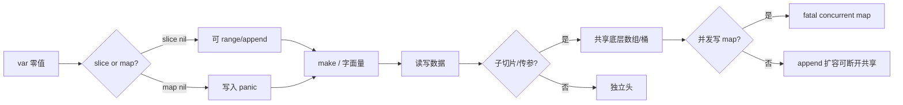
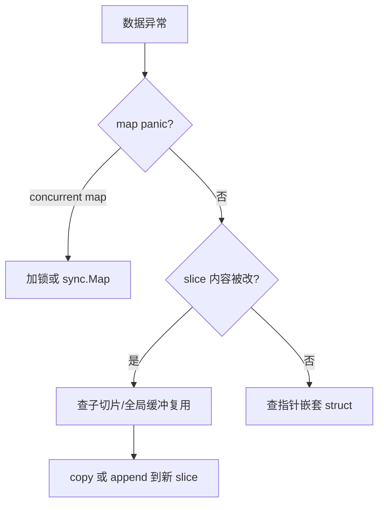

# 03｜类型零值与 slice/map 陷阱 · SRE 开发能力

> 巡检结果 `append` 到共享 slice 后别的 goroutine 数据乱了；`var m map[string]int` 直接赋值 panic；`json.Unmarshal` 到 nil slice 得到 null 而 `make([]T,0)` 得到 `[]`——根子是没看清 **slice/map 从创建、共享底层数组到并发读写** 的整条链。
> **本章回答**：零值语义、nil vs 空、make/new、slice 头与扩容、底层数组共享、map 写入与并发、安全拷贝与传参习惯。
> **本章不讲**：基础类型声明 → [01 基础语法与类型系统](../01-基础语法与类型系统/)；goroutine 并发模型 → [05 goroutine与调度模型](../05-goroutine与调度模型/)；竞态检测 → [07 sync原子与竞态检测](../07-sync原子与竞态检测/)。

## 面试怎么考

| 标记 | 考点 |
|------|------|
| **核心** | nil slice 可 range/append；nil map 不能写；slice 传参共享底层；`make` vs `new` |
| **必会** | `len/cap`；`append` 可能 realloc；`copy`；`maps.Clone`（1.21+） |
| **常用** | 截取 `s[low:high]` 仍共享数组；深拷贝要逐层 `copy`/序列化 |
| **常考** | `==` 不能比 slice（除 nil）；map 并发写 panic；空 slice JSON `[]` vs null |

**30 秒怎么说**：**零值**里 slice/map/channel 是 nil 指针头。nil slice 能 `len==0`、`append` 会分配；nil map **写入 panic**，必须先 `make`。slice 是「指针+len+cap」三元组，传参复制头但**共享底层数组**，子切片 `append` 可能踩别人数据。map 非并发安全，并发用 `sync.Map` 或加锁。要独立数据用 `copy`、`maps.Clone`、`slices.Clone`。

---

## 能力边界

| 维度 | 懂 slice/map 语义 | 只会背 append | Python list 习惯 |
|------|-------------------|---------------|------------------|
| **适合** | 写 collector 聚合、批处理缓冲 | 单 goroutine 小脚本 | — |
| **不适合** | 替代 DB 事务 | 多 goroutine 无锁共享 map | 直接套用 |
| **你要会** | 判断数据是否被共享 | — | 何时深拷 |

**make** 分配可用的 slice/map 但不做元素深拷贝；**copy** 只拷一层元素，嵌套 slice 内部仍共享引用；**sync.Map** 适合读多写少的缓存场景，不是通用 map 的替代品。

> **记住**：slice/map 的一生在「**谁还握着底层数据的引用**」上收束——别名和子切片是 SRE 工具里最难查的 silent bug。

---

## 语言最小集

| 零件 | 示例 | 含义 |
|------|------|------|
| 零值 slice | `var s []int` | nil，len=0 cap=0 |
| 空 slice | `s := make([]int, 0)` 或 `[]int{}` | 非 nil，len=0 |
| 零值 map | `var m map[string]int` | nil，不可写 |
| make slice | `make([]int, 0, 100)` | len=0 cap=100 |
| make map | `make(map[string]int, 64)` | 可写，可选容量提示 |
| new | `new(int)` | 分配零值，返回 `*int` |
| append | `s = append(s, x)` | 可能扩容换底层 |
| 切片 | `s[1:3]` | 共享底层 |
| copy | `copy(dst, src)` | 拷贝元素到已分配 dst |
| 判 nil | `s == nil` | slice/map 可与 nil 比 |
| maps.Clone | `maps.Clone(m)` | 浅拷 map（1.21+） |
| 并发 map | — | 写必须同步 |

```go
var hosts []string           // nil
hosts = append(hosts, "10.0.0.1") // OK，分配新底层

m := make(map[string]int)
m["cpu"] = 90
```

---

## 一、一张图：slice/map 的一生 ⭐🔥

> 🎯 **一句话**：**声明零值 → make/字面量分配 → 读写/append →（可能）共享底层 → 传参/返回别名 → 并发或子切片踩坑**。



**读图**：**D** 是 map 专属死亡点；**H→L** 是 slice 面试重灾区——`s[:0]` 复用缓冲与 `append` 扩容时机。Exporter 批指标缓冲若共享 slice，会出现「上一批尾部污染这一批」。

---

## 二、出生：零值、make 与 new ⭐

> 🎯 **一句话**：**make** 初始化 slice/map/channel；**new** 分配单个零值并返回指针。

### 零值对照

`var s []int` 零值为 nil，len 为 0，append 可以分配新底层。`s := []int{}` 是非 nil 的空 slice，len 同样为 0，可直接写入。`var m map[K]V` 零值为 nil，**写入会 panic**，必须先 make。`m := map[K]V{}` 是非 nil 的空 map，len 为 0，可正常读写。

```go
var s []int
fmt.Println(s == nil)     // true
s = append(s, 1)          // OK

var m map[string]int
// m["k"] = 1             // panic: assignment to entry in nil map
m = make(map[string]int)
m["k"] = 1                // OK
```

### make 容量提示

```go
buf := make([]byte, 0, 4096)   // len 0, cap 4096，少 realloc
idx := make(map[string]int, 1000) // 减少 rehash（提示非硬上限）
```

### new vs make

```go
p := new(int)   // *int，值为 0
// make 只用于 slice, map, chan
```

> 📝 **面试**：「make 返回已初始化的引用类型；new(T) 返回 *T 零值。」

> 💡 **类比**：`make` 像是拿到一间已经装修好的房间——水电接通、家具到位，进去就能住；`new` 像是拿到一个空盒子地址，盒子里面什么都没有（零值），你得自己往里塞东西。make 专管 slice/map/chan 这三种「引用类型」的初始化，new 管所有类型的零值分配，两者不可混用。

---

## 三、slice 内幕：头、子切片与 append ⭐🔥

> 🎯 **一句话**：slice 是**指向底层数组的窗口**；`append` 超 cap 会**新数组**，否则原地写。

> 💡 **类比**：slice 不是独立的数据容器，而是「贴在底层数组上的一扇窗户」。窗户有起始位置（ptr）、宽度（len）和最大视野（cap）。多个 slice 可以贴在同一面墙上（共享同一底层数组），透过各自的窗户看到不同区域，但它们看到的是同一批砖。你透过窗户改了一块砖，另一扇窗户也能看到改动——这就是子切片副作用。

```go
a := []int{1, 2, 3, 4}
b := a[1:3]   // [2, 3]，共享底层
b[0] = 99
fmt.Println(a)  // [1, 99, 3, 4]

c := append(b, 100) // cap 够则扩在底层，可能改 a
```

```text
底层数组: [1, 99, 3, 4]
a:  |[1, 99, 3, 4]|  len=4
b:     |[99, 3]|     len=2  ← 与 a 共享
```

### append 扩容（了解）

超 cap 分配新数组，**与旧底层断开**——依赖 cap 的「是否共享」不稳定，要隔离就 `copy` 或 `append([]T(nil), s...)`。

Go 1.18 前，slice 扩容策略简单：cap小于 1024 时翻倍，cap>=1024 时增长 1.25 倍。Go 1.18+ 改为渐进式增长曲线，从约 2.0 倍平滑过渡到约 1.25 倍，避免了小 slice 浪费和大 slice 频繁 realloc。具体来说，新策略在小 slice（cap ≤ 256）时仍接近翻倍，但随着 cap 增大，增长倍数平滑下降，过渡区间比旧的 1024 阈值更细腻。这意味着大 slice 的扩容开销更可预测，但绝对值仍不可控——`cap` 只增不减，slice 永远不会自动缩容。SRE 批量采集指标时，**预分配 cap**（`make([]T, 0, n)`）仍是最有效的优化——内部增长策略不应被依赖，它只保证「够用」，不保证「不换底层」。

> 🔍 **排查**：当子切片 `append` 后其他 slice 数据被篡改，用 `go test -race ./...` 未必能抓到——竞态检测器主要管并发访问，同一 goroutine 内的别名 bug 不在其覆盖范围。更有效的办法：在关键 append 前后打印 `cap(s)` 和 `len(s)`，若 cap 未变则确认共享底层；或在测试中对结果 slice 做 `copy` 后比对是否还有残留引用。

### 安全截取

```go
// 只要前 n 个且不想影响原 slice 后续 append
sub := append([]int(nil), orig[:n]...)
```

### 三索引切片表达式（进阶）

```go
a := []int{1, 2, 3, 4, 5}
b := a[1:3]      // len=2, cap=4 — append 可能写入 a[3]、a[4]
c := a[1:3:3]    // len=2, cap=2 — append 必然新分配，不影响 a
```

三索引切片 `s[low:high:max]` 把 cap 钉死在 `max-low`，从源头阻止 append 回写父 slice 的数据区。库作者常用它返回「只读视图」，巡检工具从大 slice 里切一段独立副本时也值得借鉴。注意 `max` 不能超过原 cap，否则运行时 panic。

> 💡 **实战提示**：SRE 巡检脚本中最常见的 slice 别名 bug 不是三索引切片，而是 `for _, item := range results { out = append(out, &item) }`——`item` 是迭代变量，每次循环复用同一地址，`&item` 取到的全是最后一个元素的指针。修法是 `item := item`（显式拷贝）或用索引 `results[i]` 取地址。这个 bug 不在 `-race` 检测范围内，因为它发生在单 goroutine 内。

---

## 四、传参：slice 与 map 的「头拷贝」 ⭐🔥

> 🎯 **一句话**：函数参数 slice **复制 slice 头**，底层仍共享；map 同理是**引用头**。

> 💡 **类比**：slice 传参就像递出一张名片——名片上写着办公室地址（ptr）、办公室大小（len）和整层楼的面积（cap）。拿到名片的人能进去改办公室里的东西，但他自己在名片上画的新扩建计划（append 返回的新头）不会自动传回给你。要让对方「扩建后通知你」，必须让他把新名片还回来（返回值）或一开始就给他一个能改的指针（`*[]T`）。

```go
func addHost(hosts []string, h string) {
    hosts = append(hosts, h) // 可能只改局部头，调用方 len 不变
}

func addHostPtr(hosts *[]string, h string) {
    *hosts = append(*hosts, h)
}

func tag(m map[string]int, k string) {
    m[k] = 1 // 调用方可见，共享同一 map
}
```

追加并让调用方看见时，返回新 slice 或传 `*[]T` 指针；只读扫描直接传 slice 值即可，底层共享但调用方不感知 append 的新头；函数内想替换整个 map，无法改调用方的变量绑定，只能返回新 map 让调用方接收。

> ⚠️ **别混**：`append` 返回值要**赋回** `s = append(s, x)`；忽略返回值是经典 bug。

---

## 五、map 行为：遍历、删除与 nil ⭐🔥

> 🎯 **一句话**：map 遍历**无序**；删键 `delete(m,k)`；读不存在键得**零值**。

```go
cpu := map[string]int{"a": 1}
v, ok := cpu["b"]  // v=0, ok=false
delete(cpu, "a")

for k, v := range cpu {
    _ = k; _ = v // 顺序随机
}
```

nil map 虽然不能写，但**可以读**——`var m map[string]int; m["x"]` 返回零值且不 panic，`v, ok := m["x"]` 中 `ok` 为 false。这一不对称设计常被忽略：nil map 表现为一个「只读的空 map」。SRE 工具中如果只需要查询某个键是否存在而不需要写入，直接用 nil map 做占位是合法的，但容易误导后续维护者以为可以写入，建议仍用 `make` 明确意图。

`delete(m, k)` 删除不存在的键也不会 panic——静默无操作。map 遍历顺序每次运行都不同，这是 Go 刻意的设计（防止依赖顺序），如果需要稳定顺序须手动排序 keys 后遍历。

### 并发（⭐常考）

```go
// fatal error: concurrent map read and map write
go func() { m["x"] = 1 }()
go func() { _ = m["x"] }()
```

修法：`sync.Mutex` + map；或 `sync.Map`；或 channel 串行化。`go test -race` 抓（07 章）。

> 💡 **类比**：map 并发写就像两个人同时在编辑同一份共享 Excel——没有协调机制时，A 刚在 B3 格写完值，B 正在 resize 整个表结构，底层 hashtable 正在 rehash，A 的写入落到了旧桶里或踩到了正在搬迁的内存，程序直接 fatal。Go runtime 检测到这种「搬迁中的并发写入」就会主动 panic，这是保护而非缺陷。

> 🔍 **排查**：生产环境看到 `fatal error: concurrent map writes` 时，pprof goroutine profile 通常能看到多个 goroutine 卡在 `mapassign` 或 `mapaccess` 上。用 `curl pprof/goroutine?debug=2` 抓全量 goroutine 栈，按 `mapassign` 过滤定位写入点，再用 `sync.Mutex` 包裹或迁移到 `sync.Map`。

### 浅拷贝 map

```go
import "maps"
m2 := maps.Clone(m1) // Go 1.21+
// 旧：for k,v := range m1 { m2[k]=v }
```

值若含 slice，仍共享内部 slice。深层隔离需逐层 Clone 或序列化往返（`json.Marshal` → `Unmarshal`）。

### map 不缩内存

Go map 的底层 hashtable 只增不缩——`delete(m, k)` 删除键后，桶的数量不会减少，内存不会归还 OS。大量删除后如果需要释放内存，唯一办法是新建 map 并把需要的键值迁移过去，再让旧 map 被 GC 回收。SRE 场景中，长生命周期的缓存 map（如 IP 热度表）在批量删除后仍占着原峰值内存，这是内存泄漏的常见来源。

> ⚠️ **注意**：`clear(m)`（Go 1.21+）清空所有键值，但底层桶数组仍不缩——它等效于循环 `delete`，不释放已占用的桶内存。要真正缩内存，仍需重建 map。

---

## 六、nil vs 空：JSON 与 API 语义 ⭐

> 🎯 **一句话**：`nil` slice 编码 JSON 常为 **`null`**；`make([]T,0)` 为 **`[]`**。

```go
var a []int
b := make([]int, 0)
json.Marshal(a) // null
json.Marshal(b) // []
```

运维 API 要约定：「无结果」用 `[]` 还是省略字段。指针 slice `[]*Pod` 同理。nil map 编码 JSON 时同样输出 `null`，而 `make(map[K]V)` 的空 map 输出 `{}`——与 slice 的 `null` vs `[]` 完全平行。前端解析 `null` 会触发 `TypeError: Cannot read property 'map' of null`，而 `{}` 和 `[]` 则能安全遍历。

### omitempty 的陷阱

```go
type Resp struct {
    Items []int `json:"items,omitempty"`
    Data  []int `json:"data"`
}

var r Resp
json.Marshal(r) // {"data":null} — omitempty 让 items 字段消失，data 输出 null
```

`omitempty` 对 nil slice 和空 slice **一视同仁**——字段直接从 JSON 里消失。前端拿到 `{"data":null}` 会报 `data is not iterable`；拿到 `{}`（items 被 omitempty 省略）则需判断字段是否存在。SRE 导出 API 最佳实践：返回 slice 时在 struct 初始化阶段就 `make([]T, 0)`，配合 `omitempty` 可让空结果统一输出 `[]` 而非 `null`，同时省略字段也有明确语义。

---

## 七、数组 vs slice（边界）

> 🎯 **一句话**：`[N]T` **值类型**，赋值拷贝整块；`[]T` 是引用头。

```go
var arr [3]int
sli := arr[:] // slice 指向 arr 栈数组，逃逸后 arr 可能堆上
```

SRE 代码几乎只用 slice；数组见于 `[32]byte` 固定缓冲、`[16]byte` 哈希摘要。数组赋值是值拷贝，不会产生别名问题——这是它和 slice 最大的行为差异。但数组传参同样拷贝整块，大数组传参性能差，所以函数签名几乎总是用 `[]T` 而非 `[N]T`。数组可用 `==` 直接比较（元素可比时），slice 不行——这也是值类型带来的便利。

---

## 七点五、encoding/json 与 slice/map 陷阱 🔥

> 🎯 **一句话**：`Unmarshal` 到 **nil slice** 往往仍是 nil；到 **map 指针** 会分配；**嵌套** 结构共享引用。

```go
var pods []Pod
json.Unmarshal(data, &pods) // pods 可能仍为 nil → 编码 null

pods = make([]Pod, 0)
json.Unmarshal(data, &pods) // 空数组时 json []

var m map[string]int
// json.Unmarshal(data, m)   // 错：需 &m
json.Unmarshal(data, &m)     // nil map 会被分配
```

| 目标 | 未初始化 | Unmarshal 后 |
|------|----------|--------------|
| `var s []T` | nil | 常有元素则非 nil；无元素可能仍 nil |
| `s := make([]T,0)` | 非 nil | 保持 `[]` |
| `var m map[K]V` | nil | 有键则分配 map |
| struct 内含 slice | 字段零值 | 嵌套 slice 可能与全局模板共享（若用指针） |

运维 API 客户端：响应 struct 里 `Items []Item` 若需「永远数组」，在解码前 `Items: make([]Item, 0)` 或自定义 `UnmarshalJSON`。

### slices 包（Go 1.21+）

```go
import "slices"

dup := slices.Clone(hosts)          // 新 slice，拷贝元素
ok := slices.Equal(a, b)            // 元素比较
slices.Sort(names)                  // 原地排序
```

比手写 `append([]T(nil), s...)` 更清晰；仍是一层浅拷。`slices.Compact` 去重连续重复元素，`slices.Reverse` 原地翻转，`slices.Contains` 线性查找——这些在 Go 1.21+ 后替代了手写循环，减少出错面。

---

## 八、作战：共享底层与并发 map 定责 🔧🔥

> 🎯 **一句话**：数据「莫名被改」先查 **子切片与 append**；panic `concurrent map` 查 **多 goroutine 写**。

> 🔍 **排查**：生产环境「数据莫名被改」的排查路径——先确认是 map panic 还是 slice 污染。map panic 有明确报错，直接定位。slice 污染更隐蔽：表现为「上一批指标尾部混入这一批」或「goroutine A 写的数据出现在 B 的输出里」。排查时在每批数据边界打印 `cap/len` 和前几个元素指纹，若 cap 恒定且内容异常变化，确认是共享底层；在采集函数入口对输入 slice 做 `copy` 或使用 `sync.Pool` 隔离每批缓冲。



| 现象 | 原因 | 修法 |
|------|------|------|
| 上一批数据残留 | `buf = buf[:0]` 复用 cap | 确认无别名持有 buf |
| append 后别的 slice 变 | 共享 cap | `copy` 或新 slice |
| nil map 写 panic | 未 make | `make` 或 `map literal` |
| JSON null | nil slice | `make([]T,0)` 或自定义 Marshal |

### 收束：slice/map 一生清单

- 零值：slice 为 nil 可读可 append；map 为 nil **不可写**
- 初始化：两者均用 make 或字面量
- 共享：slice 子切片与传参共享底层；map 传参共享哈希表
- 隔离：slice 用 copy 或 `append(nil,s...)`；map 用 `maps.Clone`
- 并发：slice 需自行同步元素；map **禁止**并发写
- 比较：两者仅可与 nil 用 `==` 比较

---

## 生产模板 🔧

### 模板 1：预分配指标缓冲

```go
func collect(n int) []float64 {
    out := make([]float64, 0, n)
    for i := 0; i < n; i++ {
        out = append(out, scrape(i))
    }
    return out // 新 slice 头，底层可被调用方持有
}
```

### 模板 2：复用 buffer 且避免别名泄漏

```go
var bufPool = sync.Pool{
    New: func() any { return make([]byte, 0, 4096) },
}

func formatLine() []byte {
    b := bufPool.Get().([]byte)
    b = b[:0]
    b = append(b, "metric 1\n"...)
    out := append([]byte(nil), b...) // 拷贝再给调用方
    bufPool.Put(b)
    return out
}
```

### 模板 3：主机列表防御性拷贝

```go
func cloneHosts(in []string) []string {
    return append([]string(nil), in...)
}
```

### 模板 4：并发安全计数 map

```go
type SafeCounts struct {
    mu sync.Mutex
    m  map[string]int
}

func (s *SafeCounts) Inc(key string) {
    s.mu.Lock()
    defer s.mu.Unlock()
    if s.m == nil {
        s.m = make(map[string]int)
    }
    s.m[key]++
}
```

### 模板 5：从 kubectl 表解析行（slice 复用）

```go
func parseLines(all string) (header []string, rows [][]string) {
    lines := strings.Split(strings.TrimSpace(all), "\n")
    if len(lines) == 0 {
        return nil, nil
    }
    header = strings.Fields(lines[0])
    rows = make([][]string, 0, len(lines)-1)
    for _, ln := range lines[1:] {
        if ln == "" {
            continue
        }
        // 每行新 slice，避免共享底层
        row := append([]string(nil), strings.Fields(ln)...)
        rows = append(rows, row)
    }
    return header, rows
}
```

### 模板 6：三索引切片去掉 cap 共享（高级）

```go
// 只要数据不要共享后续 cap：full slice expression（了解）
a := []int{1, 2, 3, 4, 5}
b := a[1:3:3] // len=2 cap=2，append b 不会写进 a[3:]
```

活动前读 client 代码看到 `s[low:high:max]`：第三索引 **限制 cap**，防止 append 踩父 slice——库作者常用，巡检工具拷贝子集时可借鉴。

> 💡 **选择指南**：日常代码用 `append([]T(nil), s...)` 做浅拷贝足够；库或公共工具里用三索引切片 `s[low:high:max]` 更显式；批量场景用 `slices.Clone`（1.21+）最清晰。三者都是一层浅拷，嵌套结构需逐层处理。

---

## 踩坑清单

| 现象 | 原因 | 修法 |
|------|------|------|
| assignment to nil map | 未 make | make / literal |
| append 无效 | 未接收返回值 | `s = append(s,x)` |
| 子 goroutine 数据串 | 共享 slice | 传入前 clone |
| concurrent map writes | 无锁 | Mutex / sync.Map |
| `==` 两个 slice | 编译错误 | 用 `bytes.Equal` 或循环 |
| Unmarshal 后不能 append | nil slice | 先 `make` 或指针接收 |
| 大 map 内存不降 | delete 不缩桶 | 重建 map 或换结构 |
| `s[:0]` 复用后数据串 | cap 未清零元素 | 复用前 `copy` 或不复用存指针的 slice |
| `json.Marshal` 输出 null | nil slice 字段 | 初始化 `make([]T,0)` 或 `omitempty` |
| 三索引切片 panic | `max` 超原 cap | 确认 `max <= cap(s)` |
| append 跨 goroutine race | 无同步并发 append | `go test -race` 抓，加锁或 channel 串行 |
| range 取地址全相同 | 迭代变量地址复用 | 每次循环拷贝值再取址 |
| 大 map 不缩内存 | delete 只删键不缩桶 | 新建 map 迁移键值，旧 map 交 GC |

---

## 必会 · 常考

| 说法 | 对错 | 口径 |
|------|:----:|------|
| nil slice len 为 0 | 对 | 可 range |
| nil map 可读可写 | 错 | 写 panic |
| slice 赋值拷贝全部元素 | 错 | 只拷头 |
| append 总换底层 | 错 | cap 够则原地 |
| map 遍历有序 | 错 | 随机 |
| delete 不存在键 panic | 错 | 安全 |
| slice 可与 nil 比较 | 对 | map 同理 |
| maps.Clone 深拷贝值 | 错 | 浅拷键值 |

**易混**：nil vs 空 slice；make vs new；传 slice 与传 `*[]T`；浅拷 vs 深拷。

### slice vs map 对照

**零值**：slice 为 nil 仍可 append；map 为 nil **写入直接 panic**。**初始化**：slice 用 `make` 或 `[]T{}`；map 用 `make` 或 `map[K]V{}`。**比较**：两者都只能与 nil 用 `==`，不能互比。**传参**：slice 共享底层数组，map 共享哈希表，调用方均能看到写入侧改动。**并发写**：slice 元素同步由开发者自管；map **必须**加锁或用 `sync.Map`。**空 JSON**：slice nil 编码为 `null`，空 slice 为 `[]`；map 同理，nil 为 `null`，空 map 为 `{}`。

**口诀**：slice nil 能 append，map nil 写入挂；子切片同底层，并发 map 必须锁。

---

## 命令速查 🔧

```bash
go test -race ./...     # 抓 map 并发
go run -gcflags=-m .      # 逃逸（11 章）

# 小实验
go run <<'EOF'
package main
import "fmt"
func main() {
    var s []int
    fmt.Println(s, len(s), cap(s), s == nil)
    s = append(s, 1)
    fmt.Println(s, s == nil)
}
EOF
```

> `go test -race` 输出格式：检测到竞态时，会打印 `WARNING: DATA RACE`，紧跟两个冲突 goroutine 的完整调用栈，最后以 `==================` 分隔。退出码为 66（非零即失败）。无竞态时正常输出 `PASS`/`FAIL`，退出码 0 或 1。生产环境也可用 `-race` 编译二进制做在线检测，但 race detector 会使 CPU 开销增大 5-10 倍，仅建议短期排查使用。

---

## 面试锚点

| 问 | 30 秒答 |
|----|---------|
| nil slice 和空 slice？ | nil 未分配；空 `make([]T,0)` 非 nil；JSON 不同 |
| nil map 能写吗？ | 不能，panic |
| slice 传参共享吗？ | 共享底层，不共享头里的 len 扩容结果除非赋回 |
| 如何拷贝 slice？ | `copy` 或 `append([]T(nil), s...)` |
| map 并发怎么办？ | 锁或 sync.Map |

---

## 合上书，问自己

- [ ] 画出 slice/map 一生主图，标 nil map 写入 panic。
- [ ] `var s []int` 与 `s := make([]int,0)` 区别？
- [ ] 子切片改元素为何影响原 slice？
- [ ] `append` 何时断开共享底层？
- [ ] 为何 `m["k"]=1` 在 var m 上 panic？
- [ ] JSON `null` 和 `[]` 对应哪种 slice？
- [ ] 并发写 map 报什么错？怎么修？
- [ ] `maps.Clone` 解决什么问题、不解决什么？
- [ ] Go 1.18+ 扩容策略和旧策略有何不同？
- [ ] `range` 取地址为何总得到最后一个元素？
- [ ] `delete` 后 map 内存会释放吗？怎么处理？

十一题能口述，再进 [04 错误处理与panic](../04-错误处理与panic/)。并发 slice 与 05/07 章连读。
