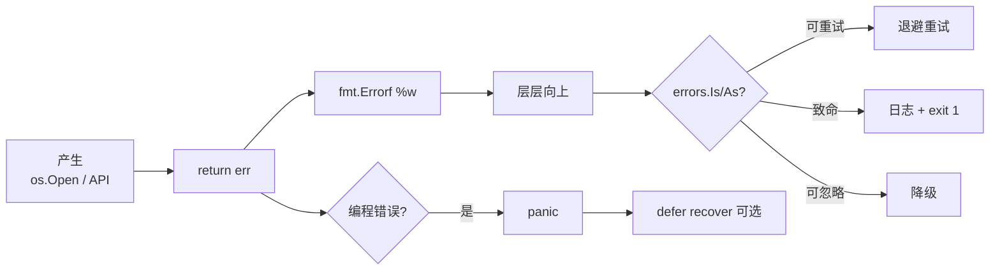
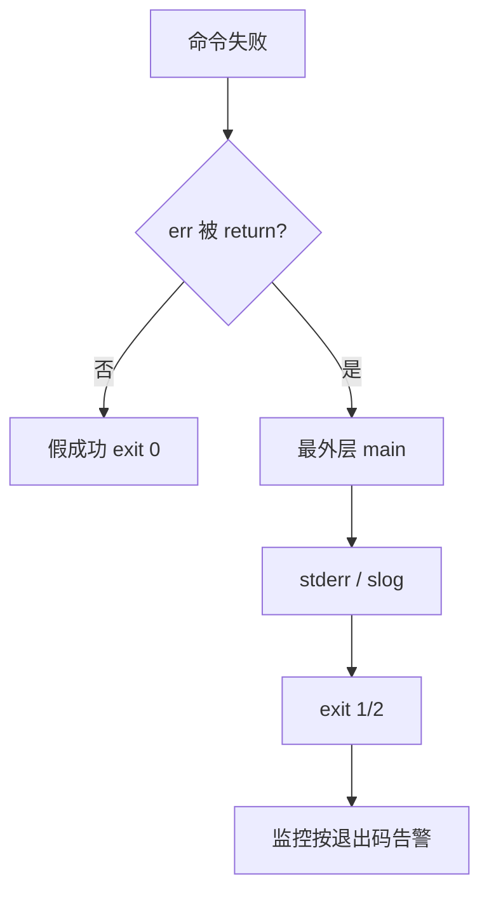

# 04｜错误处理与 panic · SRE 开发能力

> 巡检 CLI 把 `kubectl` 失败吞了还 exit 0；日志只有 `connection refused` 不知道哪台主机；有人 `panic(err)` 把整进程打崩；`errors.Is` 永远 false——中间层 `fmt.Errorf("%v")` 剪断了链。群里三个人分别喊「加日志」「改 panic」「字符串匹配 timeout」。
> **本章回答**：一个 **error** 从产生、`%w` 包装、`Is`/`As` 决策到日志/退出码——以及 panic/recover 的边界。
> **不讲**：多返回值语法 → [01](../01-基础语法与类型系统/)；context 超时 → [08](../08-context取消与超时传播/)；errgroup 聚合 → [09](../09-errgroup与并发限流/)。

**标记**：🎯重点 · 🔥难点 · ⭐常考 · 🔧实操

---

## 面试怎么考

| 标记 | 考点 |
|------|------|
| **核心** | `error` 是接口；`if err != nil`；`fmt.Errorf("...: %w", err)`；`errors.Is` / `errors.As` |
| **必会** | 错误向上传不吞；`defer` 关资源；`panic` 仅不可恢复；`recover` 不能跨 goroutine |
| **常用** | 哨兵 `var ErrNotFound`；自定义类型 + `Unwrap`；边界 `slog` / 非零退出 |
| **常考** | `%v` 断链；`recover` 须在 defer；`os.Exit` 跳过 defer；typed nil |

> 📝 **面试（30 秒）**：Go 用**返回值 error** 表达失败。底层 `return fmt.Errorf("probe %s: %w", host, err)` 保链；上层 `errors.Is`/`As` 决策。资源 `defer Close()`。`panic` 留给编程错误与 init Must；业务 return。`recover` 只在 defer、救不了别的 G。CLI：`main` 打日志 + 非零退出。

---

## 能力边界

| 维度 | Go error 链 | panic / recover | 只打日志不 return |
|------|-------------|-----------------|-------------------|
| **适合** | 可预期失败、可重试、可测 | 不变量破坏、模板 init | 临时脚本 |
| **不适合** | 每层都打栈（边界选点） | 「文件不存在」当 bug | 生产库函数 |
| **你要会** | wrap + Is/As | 何时不该 panic | 错误与日志分工 |

- 🔑 **各管一段**
  - `%w`：保留 Unwrap 链——**不**自动重试
  - `errors.Is`：哨兵/值相等穿透——**不**做字符串子串匹配
  - `defer`：释放 fd/锁——**不**替代 context 取消
  - `recover`：本 G 善后——**不**当业务流程

> ⚠️ **别混**：error 的一生在**调用方能否做正确决策**处结束——吞掉、乱 wrap、只 log 不 return，都是 SRE 工具「假成功」之源。

---

## 语言最小集

| 零件 | 示例 | 含义 |
|------|------|------|
| error 接口 | `type error interface { Error() string }` | 实现者可当 error |
| 多返回 | `func f() (T, error)` | 惯用 |
| 判断 | `if err != nil { return err }` | 早返回 |
| 创建 | `errors.New("msg")` | 无底层 |
| wrap | `fmt.Errorf("ctx: %w", err)` | 可 Unwrap |
| Is | `errors.Is(err, ErrX)` | 链上含哨兵？ |
| As | `errors.As(err, &target)` | 链上含某类型？ |
| Join | `errors.Join(e1, e2)` | 多错误（1.20+） |
| defer | `defer f.Close()` | 返回前 LIFO |
| panic / recover | `panic("bug")` / `recover()` | 中止本 G / 仅 defer 捕获 |
| 哨兵 | `var ErrNotFound = errors.New(...)` | 用 Is 比 |
| 自定义 | `type OpError struct{...}` | 字段 + As |

```go
if err := run(); err != nil {
    fmt.Fprintf(os.Stderr, "fatal: %v\n", err)
    os.Exit(1)
}
```

零件认完，上主图。

---

## 一、一张图：一个 error 的一生 ⭐🔥

> 🎯 **一句话**：**底层产生 → return 向上 → 中层 `%w` 添上下文 → 顶层 Is/As 决策 → 日志 / 指标 / 退出码**。



- 📖 **读图**
  - 🛤️ 主路径是 **return error**；**J** 只留给不变量/init——Exporter 把 scrape 全 panic 会整进程挂，应 per-target 记指标继续跑
  - 🔪 开篇现场：吞错 exit 0 → 没走到 G；`Is` 永远 false → C 用了 `%v`；进程崩 → 误走 J（Q3、Q8、Q11）

本节对应练习题 Q13。

---

## 二、出生：error 接口与多返回值 ⭐

> 🎯 **一句话**：`error` 是**单方法接口**；`nil` error 表示成功。

```go
func statDisk(path string) (int64, error) {
    fi, err := os.Stat(path)
    if err != nil {
        return 0, fmt.Errorf("stat %q: %w", path, err)
    }
    return fi.Size(), nil
}
```

### 🧬 error 是什么

- 任何实现 `Error() string` 的类型都是 error——可用 struct 带 Code/Host，再给上层 `As`
- 惯用 `(v, nil)` 成功；`(zero, err)` 失败——别把「业务空值」和「出错」混成同一种返回

```go
type ExitError struct {
    Code int
    Msg  string
}

func (e *ExitError) Error() string {
    return fmt.Sprintf("exit %d: %s", e.Code, e.Msg)
}
```

### 🕳️ typed nil 陷阱 🔥

```go
var p *ExitError
var err error = p
if err != nil { } // true！interface 持 typed nil
```

#### ❓ 为什么 `err != nil` 却「看起来是 nil」？

- 🔥 interface 有**类型 + 值**两格：值是 nil 指针，类型仍是 `*ExitError` → 整格非 nil
- ✅ 失败返回 `return nil, err`（`err` 已是 `error` 接口）；**不要** `return nil, (*T)(nil)`
- 🛠️ Code Review 搜 `return nil, (*` —— 高频 typed nil 源

> 📝 **面试**：error 常是指向自定义类型的指针；nil interface ≠ typed nil。⭐（Q1、Q2）

本节对应练习题 Q1、Q2。失败用 error，别靠 panic 当业务分支——下一站：怎么 wrap。

---

## 三、包装：fmt.Errorf 与 %w ⭐🔥

> 🎯 **一句话**：`%w` **包装**底层、支持 Unwrap；`%v` 只拼字符串、**断链**。

> 💡 **打个比方**：`%w` 像把原信装进新信封转发——收件人还能拆开看原件；`%v` 是重新抄一遍——原信封丢了，上层再也 `Is` 不回去。

```go
if err := ping(host); err != nil {
    return fmt.Errorf("region %s host %s: %w", region, host, err)
}

// 上层——能认出底层，前提是中间用了 %w
if errors.Is(err, os.ErrNotExist) {
    // ...
}
```

#### ❓ 为什么 `%w` 而不是 `%v`？

- ❌ `%v` / `%s`：字符串化，**不可**对底层 `Is`/`As`
- ✅ `%w`：保留对象链，`errors.Is`/`As` 可穿透
- 🔍 **现场**：`Is` 永远 false → `rg 'fmt\.Errorf.*%v'` 搜仓库——多半中间层图省事写了 `%v`

```go
// 错误示范：Is 失效
return fmt.Errorf("failed: %v", err)
```

### 📦 wrap 怎么控量

- **有新上下文才 wrap**：`fmt.Errorf("probe %s: %w", host, err)` 加了 host；空包装 `fmt.Errorf("%w", err)` 不如原样 `return err`
- **别无脑 wrap 哨兵再 `==`**：`fmt.Errorf("ctx: %w", ErrNotFound)` 后 `err == ErrNotFound` 失效，但 `errors.Is` 仍可——团队统一用 Is
- **每层只添一次**：同一错误 `%w` 三遍，日志三层重复上下文

> 📝 **面试**：`%w` 保链供 Is/As；`%v` 断链——白板高频。⭐（Q3）

本节对应练习题 Q3。链保住了，怎么判断？

---

## 四、判断：errors.Is 与 errors.As ⭐🔥

> 🎯 **一句话**：**Is** 比哨兵/值相等；**As** 把链上某类型**赋给目标指针**。

```go
var ErrTimeout = errors.New("timeout")

func worker(ctx context.Context) error {
    return fmt.Errorf("worker: %w", ErrTimeout)
}

func handle(err error) {
    if errors.Is(err, ErrTimeout) {
        // 重试
    }
    var pathErr *os.PathError
    if errors.As(err, &pathErr) {
        log.Printf("path=%s", pathErr.Path)
    }
}
```

- 🔑 **Is vs As**
  - `errors.Is(err, target)`：`err == target` 或 unwrap 链含该哨兵
  - `errors.As(err, &ptr)`：链上存在可赋给 `ptr` 的类型，并写入字段

#### ❓ 为什么不能用 `strings.Contains(err.Error(), "timeout")`？

- 🔥 文案一变、本地化、多语言包装——立刻挂
- ✅ 哨兵 + `Is`，或自定义类型 + `As` 取字段
- ⚠️ **别混**：能和哨兵直接 `==` 吗？中间有 wrap 时往往不行——用 `Is`

### 🧩 errors.Join：聚合多错误（Go 1.20+）

```go
combined := errors.Join(err1, err2)
// Error() 多行；Is/As 可穿透每个子错误

var multi interface{ Unwrap() []error }
if errors.As(combined, &multi) {
    for _, e := range multi.Unwrap() {
        if errors.Is(e, ErrTimeout) { /* ... */ }
    }
}
```

#### ❓ 为什么 Join 和 `%w` 不是一回事？

- `%w`：包装**一个**底层；`Unwrap() error`
- `Join`：合并**多个**独立错误；`Unwrap() []error`
- 🛠️ 巡检多主机：一台超时一台 refused → Join 一个返回，上层仍能分别 `Is`

> 📝 **面试**：Join ≠ 单链 wrap；Join 保留多链，适合批量探针。⭐（Q4、Q5）

本节对应练习题 Q4、Q5。稳定判断靠哨兵与自定义类型。

---

## 五、哨兵错误与自定义类型 ⭐

> 🎯 **一句话**：包级 `var ErrX = errors.New(...)` 给**稳定判断**；复杂错误用 struct + `As`。

```go
var (
    ErrNotFound   = errors.New("not found")
    ErrPermission = errors.New("permission denied")
)
```

- 哨兵要**文档化、少而精**——别 `errors.New("error")` 满天飞
- CMDB / HTTP：自定义带 `Code`，`As` 后 4xx 不重试、5xx 重试

```go
type ProbeError struct {
    Host    string
    Port    int
    Op      string // "ping" / "dial" / "scrape"
    Wrapped error
}

func (e *ProbeError) Error() string {
    return fmt.Sprintf("%s %s:%d: %v", e.Op, e.Host, e.Port, e.Wrapped)
}

func (e *ProbeError) Unwrap() error { return e.Wrapped }
```

#### ❓ 为什么自定义类型还要写 `Unwrap`？

- 没有 `Unwrap`：`Is`/`As` 碰到它就**断链**，认不出底层 `ErrTimeout`
- 有了：结构化字段（Host/Port/Op）进 metrics labels，同时链还能穿透
- ✅ 核心价值是**字段**，不是再发明一套字符串格式

> 📝 **面试**：简单稳定码用哨兵；要 Host/Code 等字段用 struct + `Unwrap` + `As`。（Q6）

本节对应练习题 Q6。下一节：资源与 panic 清理——`defer`。

---

## 六、defer：资源与 panic 清理 ⭐🔥

> 🎯 **一句话**：`defer` **LIFO** 执行；常用于 `Close()`、`Unlock()`、`recover`。

> 💡 **打个比方**：defer 是「先登记逃生路线再开会」——不论后面 return 还是 panic，清理都会跑（`os.Exit` 除外，见七节）。

```go
f, err := os.Open(path)
if err != nil {
    return err
}
defer f.Close()

mu.Lock()
defer mu.Unlock()
```

### 📝 命名返回值合并 Close 错误

```go
func write() (err error) {
    f, e := os.Create("/tmp/x")
    if e != nil {
        return e
    }
    defer func() {
        if e := f.Close(); e != nil && err == nil {
            err = e
        }
    }()
    _, err = f.WriteString("ok")
    return err
}
```

#### ❓ 为什么别在循环里 `defer Close`？

```go
// 错：defer 攒到函数结束 → fd 泄漏 / 打满
for _, p := range paths {
    f, _ := os.Open(p)
    defer f.Close()
}

// 对：抽小函数，每次进函数再 defer
func process(p string) error {
    f, err := os.Open(p)
    if err != nil {
        return err
    }
    defer f.Close()
    // ...
    return nil
}
```

- 🔥 defer 登记到**当前函数**结束才跑——循环 N 次就 N 个未关 fd
- ✅ 运维 CLI 热路径开销可忽略；**泄漏 fd 不可忽略**

> 🔍 **现场**：`lsof -p $(pidof your-cli) | wc -l` 狂涨 + 循环里 Open → 先查有没有循环 defer。

本节对应练习题 Q7、Q10。

---

## 七、panic 与 recover：边界 ⭐🔥

> 🎯 **一句话**：**panic 中止当前 goroutine 栈展开**；`recover` 只在 **defer 里**有效，且**不能救其他 goroutine**。

> 💡 **打个比方**：panic 是急刹，recover 是翻车前抓方向盘做善后——**不是方向盘**。业务失败用 return error 转向。

```go
func safeHandler(fn func()) {
    defer func() {
        if r := recover(); r != nil {
            log.Printf("recovered: %v", r)
        }
    }()
    fn()
}
```

### ✅ / ❌ 何时 panic

| 适合 panic | 不适合 panic |
|------------|--------------|
| 不变量破坏 / 不可能分支 | 文件不存在、网络超时 |
| `init` 配置不可能解析 | 用户输入错误 |
| 模板/`Must`（启动期） | HTTP handler 业务失败（应 500+err） |

```go
// 标准库风格：Must 仅用于 init
var templateMust = template.Must(template.New("t").Parse(`{{.}}`))
```

#### ❓ 为什么业务错误不该 `panic(err)`？

- panic 展开栈 → 未 recover 则**整 G 死**；main G 死则**进程挂**
- 巡检一台 host 失败不应带走整个 exporter
- ✅ 预期失败 return；真 bug / 启动必炸才 panic

#### ❓ 为什么 recover 救不了别的 goroutine？

- 每个 G **自己的栈**；A 的 defer recover 看不见 B 的 panic
- ✅ 每个 worker 自己 `defer recover`，或用 errgroup（→ [09](../09-errgroup与并发限流/)）
- 🔍 **现场**：日志 `panic:` 堆栈、无 recover 记录 → 某后台 G 静默崩——进程还在、任务已停，比整进程挂更阴

### 🚪 os.Exit 与 defer

```go
defer cleanup()
os.Exit(1) // defer 不执行！
```

#### ❓ 为什么 `os.Exit` 会跳过 defer？

- `os.Exit` **直接终止进程**，不走函数返回路径 → defer 队列不跑
- ✅ CLI 用 `run() error`，`main` 里统一 log + `os.Exit`；或 Exit 前显式 cleanup
- ⚠️ **别混**：`return err` 会跑 defer；`os.Exit` 不会——假成功的近亲是「Exit 前资源没关」

> 📝 **面试**：业务 return；panic = bug；recover = 最后一道网，不是流程控制；救不了别的 G。⭐（Q8、Q9）

本节对应练习题 Q8、Q9。边界清楚了——作战：假成功。

---

## 八、作战：日志、退出码与「假成功」 🔧🔥

> 🎯 **一句话**：**错误在产生点 wrap，在边界打日志 + 退出码**；中间层别只 `log.Println` 不 return。

🔥 **假成功** = 日志红了、进程却 exit 0。运维 CLI 最毒的坑——CI 以为过了。



- 📖 **读图**：分叉在「有没有 return」——开篇 `_ = cmd.Run()` 直接掉进 C；修法是走到 D→F

| 反模式 | 后果 | 修法 |
|--------|------|------|
| `_ = cmd.Run()` | 失败当成功 | 检查 err |
| `log.Printf` 不 return | 继续脏数据 | 早返回 |
| `%v` 一路 wrap | Is 失效 | 改 `%w` |
| handler 里 panic | 连接断 / 进程险 | return error |
| 所有错误 panic | 进程挂 | 分级处理 |

### 📋 收束：error 一生清单

- **产生**：`return fmt.Errorf("ctx: %w", err)`
- **传递**：不吞；需要时添 host / region / requestID
- **判断**：`errors.Is` / `errors.As`
- **记录**：边界一次打全链（`%v` 或 slog）
- **结束**：CLI 退出码；服务 `errors_total`
- **panic**：仅 bug；recover 不替代 error

#### ❓ 为什么只在边界打日志？

- 中间三层各 `log` 一次 → 平台三条重复、告警阈值翻倍
- ✅ 中间 wrap + return；`main` / HTTP handler / worker 入口统一打
- 🔍 **现场**：`rg '_ = |_,'` 找被忽略的返回值——假成功最大来源

### 📊 结构化日志：slog（Go 1.21+）

```go
slog.SetDefault(slog.New(slog.NewJSONHandler(os.Stderr, &slog.HandlerOptions{
    Level: slog.LevelInfo,
})))

slog.Error("probe failed",
    "err", err,
    "host", host,
    "cluster", cluster,
    "duration_ms", elapsed,
    "request_id", reqID,
)
```

> 📝 **面试**：slog 出 JSON，ELK/Loki 按字段滤；`log.Printf` 靠正则。生产 slog，本地可用 TextHandler。（Q12）

本节对应练习题 Q12。下面是可复制模板。

---

## 生产模板 🔧

### 模板 1：run 模式 main

```go
package main

import (
    "fmt"
    "log/slog"
    "os"
)

func main() {
    slog.SetDefault(slog.New(slog.NewJSONHandler(os.Stderr, nil)))
    if err := run(os.Args[1:]); err != nil {
        slog.Error("fatal", "err", err)
        os.Exit(1)
    }
}

func run(args []string) error {
    if len(args) < 1 {
        return fmt.Errorf("usage: patrol <cluster>")
    }
    if err := probe(args[0]); err != nil {
        return fmt.Errorf("probe: %w", err)
    }
    return nil
}
```

### 模板 2：可重试 vs 致命

```go
var ErrTimeout = errors.New("timeout")

func callWithPolicy(err error) error {
    if errors.Is(err, ErrTimeout) || errors.Is(err, context.DeadlineExceeded) {
        return fmt.Errorf("retryable: %w", err)
    }
    return fmt.Errorf("fatal: %w", err)
}
```

### 模板 3：defer 关闭

```go
func readConfig(path string) ([]byte, error) {
    f, err := os.Open(path)
    if err != nil {
        return nil, err
    }
    defer func() { _ = f.Close() }()
    return io.ReadAll(f)
}
```

### 模板 4：HTTP handler 返回错误（预览 10 章）

```go
func handleHealth(w http.ResponseWriter, r *http.Request) {
    if err := check(); err != nil {
        http.Error(w, err.Error(), http.StatusServiceUnavailable)
        return
    }
    w.WriteHeader(http.StatusOK)
}
```

### 模板 5：多主机错误聚合

```go
func probeAll(hosts []string) error {
    var errs []error
    for _, h := range hosts {
        if err := ping(h); err != nil {
            errs = append(errs, fmt.Errorf("%s: %w", h, err))
        }
    }
    if len(errs) == 0 {
        return nil
    }
    return fmt.Errorf("probe failed: %w", errors.Join(errs...))
}
```

`errors.Join` 合成一个 error；main 仍可 log 一次，metrics 打 `len(errs)`。

---

## 踩坑清单

| 现象 | 原因 | 修法 |
|------|------|------|
| `errors.Is` 永远 false | 中间 `%v` | 改 `%w` |
| defer 没执行 | `os.Exit` | main 统一 exit |
| goroutine panic 进程挂 | recover 不跨 G | 每 G defer 或 errgroup |
| 日志重复三层 | 每层都 log | 只在边界 log |
| typed nil `err != nil` | `return nil, (*T)(nil)` | `return nil, err` |
| 循环 defer 泄漏 fd | defer 堆积 | 抽函数 |
| `panic(err)` 生产 | 业务当 bug | return err |
| 自定义类型断链 | 忘 `Unwrap` | 实现 `Unwrap() error` |

---

## 必会 · 常考

| 说法 | 对错 | 口径 |
|------|:----:|------|
| error 是接口 | 对 | `Error() string` |
| 应用该用异常 throw | 错 | return error |
| `%w` 支持 unwrap | 对 | Go 1.13+ |
| recover 任意处可调 | 错 | 仅 defer 内 |
| panic 能被别的 G recover | 错 | 各自栈 |
| `errors.Is` 比 `==` 更稳 | 对 | 对 wrap 链 |
| defer 先于 return 执行 | 对 | LIFO |
| `os.Exit` 跑 defer | 错 | 不跑 |

**易混**：`%v` vs `%w`；`Is` vs 字符串匹配；panic vs fatal log；defer vs `os.Exit`。

---

## 收口

### 命令速查 🔧

```bash
# 代码里看 wrap 链（标准库 %v 已多层；pkg/errors 风格可用 %+v）
# fmt.Printf("%v\n", err)

go test -run TestErrors ./...
go vet ./...                    # 含部分 error 检查
rg 'fmt\.Errorf.*%v'            # 断链嫌疑
rg '_ = |_, _ :='               # 假成功嫌疑
```

### 面试锚点

| 问 | 30 秒答 |
|----|---------|
| Go 怎么处理错误？ | 多返回值 error；`if err != nil` |
| `%w` 干什么？ | wrap 保留 Unwrap，供 Is/As |
| Is 和 As？ | Is 哨兵相等；As 类型断言链上字段 |
| 何时 panic？ | 编程错误、init Must；业务用 error |
| recover 限制？ | defer 内；本 goroutine |
| 假成功是什么？ | 失败却 exit 0；查吞 err 与非零退出 |

### 易错一句话对照

```text
错：%v wrap 一样能 Is
对：%v 断链；必须 %w

错：strings.Contains(err.Error(), "timeout")
对：哨兵 + errors.Is

错：panic(err) 当业务分支
对：预期失败 return error

错：recover 写在普通函数体
对：只在 defer 里调用才有效

错：一个 recover 罩住所有 goroutine
对：每个 G 各自栈，各自 defer

错：os.Exit(1) 会跑完 defer
对：直接杀进程，defer 跳过

错：循环里 defer f.Close()
对：抽函数或即时 Close

错：每层都 log 再 return
对：边界打一次，中间只 wrap

错：return nil, (*OpError)(nil)
对：typed nil；应 return nil, err
```

### 数字墙

> `error` 单方法接口 · wrap 自 **Go 1.13**（`%w` / Is / As）· `errors.Join` 自 **1.20** · `log/slog` 自 **1.21** · CLI 成功退出码 **0**，失败常用 **1**，用法错常用 **2** · recover **仅** defer · `os.Exit` **0** 个 defer 会跑。

---

## 合上书

对着第一节主图口述一遍，卡住就回对应小节。开头吞错 exit 0 / `%w` 断链 / 误 panic——各自错在哪，现在该能说清。

- [ ] **默画** error 一生：产生 → wrap → Is/As → 退出；旁路 panic/recover（Q13）
- [ ] `%w` 和 `%v` 对 `errors.Is` 有何不同？（Q3）
- [ ] 何时用哨兵、何时用自定义 struct + `Unwrap`？（Q6）
- [ ] defer 执行顺序？循环里 defer 有何问题？（Q7）
- [ ] panic 和 return error 选型一句话？（Q8）
- [ ] recover 为什么救不了别的 goroutine？（Q9）
- [ ] `os.Exit` 和 defer 关系？（Q10）
- [ ] 什么叫「假成功」？运维 CLI 怎么防？（Q11、Q12）

全部打勾后，找同事十分钟讲清「吞错 exit 0 / `%w` 断链现场怎么查」。讲得下来，你就是下一个能拦住假成功的人。

下一章：[05 goroutine与调度模型](../05-goroutine与调度模型/)。
