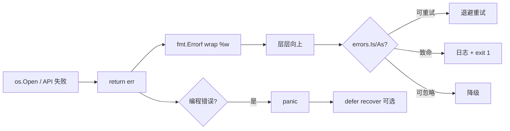
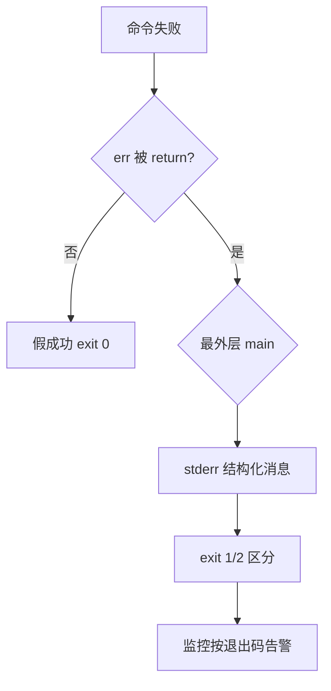

# 04｜错误处理与 panic · SRE 开发能力

> 巡检 CLI 把 `kubectl` 失败吞了还 exit 0；日志只有 `connection refused` 不知道哪台主机；有人 `panic(err)` 把整进程打崩；`errors.Is` 判断失败因为中间层换了 `fmt.Errorf` 没 `%w`——根子是没看清 **一个 error 从产生、向上传递、包装到最终处理** 的整条链。
> **本章回答**：`error` 接口、`errors.New`/`fmt.Errorf`、`%w` 与 `errors.Is`/`errors.As`、`defer`/`recover` 边界、何时 return error vs panic。
> **本章不讲**：基础函数多返回值语法 → [01 基础语法与类型系统](../01-基础语法与类型系统/)；context 超时取消 → [08 context取消与超时传播](../08-context取消与超时传播/)；errgroup 聚合 → [09 errgroup与并发限流](../09-errgroup与并发限流/)。

## 面试怎么考

| 标记 | 考点 |
|------|------|
| **核心** | `error` 是接口；`if err != nil`；`fmt.Errorf("...: %w", err)`；`errors.Is` / `errors.As` |
| **必会** | 错误向上传不吞；`defer` 关闭资源；`panic` 仅不可恢复；`recover` 不能跨 goroutine |
| **常用** | 哨兵错误 `var ErrNotFound`；自定义 `Error()` 类型；日志打 `%+v` 看 wrap 链 |
| **常考** | `%v` 不 unwrap；`panic(recover)` 无效；main 里 `os.Exit` 跳过 defer |

**30 秒怎么说**：Go 用**返回值 error** 表达失败，不用异常控制流。底层 `return fmt.Errorf("probe %s: %w", host, err)` 保留原因链；上层用 `errors.Is(err, ErrTimeout)` 判断。资源用 `defer Close()`。`panic` 只留给编程错误和 init 失败；业务错误 return。`recover` 只在 defer 里、且救不了别的 goroutine。CLI 最终 `main` 打日志 + 非零退出码。

---

## 能力边界

| 维度 | Go error 链 | panic/recover | 日志代替 error |
|------|-------------|---------------|----------------|
| **适合** | 可预期失败、可重试、可测试 | 不变量破坏、模板 init | 临时脚本 |
| **不适合** | 每个 if 都打栈（应用层选点打） | 业务「文件不存在」 | 生产库函数 |
| **你要会** | wrap + Is/As | 何时不该 panic | 错误与日志分工 |

`%w` 保留 unwrap 链但不会自动重试；`errors.Is` 判断哨兵相等但不做字符串子串匹配；`defer` 负责释放 fd/锁但不能替代 context 取消。

> **记住**：error 的一生在**调用方能否做正确决策**处结束——吞掉、乱 wrap、只打日志不 return 都是 SRE 工具「假成功」之源。

---

## 语言最小集

| 零件 | 示例 | 含义 |
|------|------|------|
| error 接口 | `type error interface { Error() string }` | 任何实现者可当 error |
| 多返回 | `func f() (T, error)` | 惯用模式 |
| 判断 | `if err != nil { return err }` | 早返回 |
| 创建 | `errors.New("msg")` | 无底层 |
| 格式化 | `fmt.Errorf("ctx: %w", err)` | 可 wrap |
| Is | `errors.Is(err, ErrX)` | 链上是否含哨兵 |
| As | `errors.As(err, &target)` | 链上是否含某类型 |
| defer | `defer f.Close()` | 函数返回前执行 |
| panic | `panic("bug")` | 中止当前 goroutine |
| recover | `recover()` | 仅在 defer 中捕获 panic |
| 哨兵 | `var ErrNotFound = errors.New(...)` | 用 Is 比较 |
| 自定义 | `type OpError struct{...}` | 携带字段，As 提取 |

```go
if err := run(); err != nil {
    fmt.Fprintf(os.Stderr, "fatal: %v\n", err)
    os.Exit(1)
}
```

---

## 一、一张图：一个 error 的一生 ⭐🔥

> 🎯 **一句话**：**底层产生 → return 向上传 → 中层 `%w` 包装添上下文 → 顶层 `Is`/`As` 决策 → 日志/指标/退出码**。



**读图**：主路径是 **return error**；**J** 仅少数场景。Exporter 把 scrape 错误全 panic 会导致整个进程挂——应 per-target 记指标继续跑。

---

## 二、出生：error 接口与多返回值 ⭐

> 🎯 **一句话**：`error` 是**单方法接口**；nil error 表示成功。

> 💡 **理解**：error 本质上是一个接口——任何类型只要实现了 `Error() string` 方法，就是 error。这意味着你可以用 struct、指针甚至基本类型来携带丰富的上下文，只要带上那个方法。nil error 表示成功，但要注意 typed nil 陷阱（后面讲）。

```go
func statDisk(path string) (int64, error) {
    fi, err := os.Stat(path)
    if err != nil {
        return 0, fmt.Errorf("stat %q: %w", path, err)
    }
    return fi.Size(), nil
}
```

### nil error

```go
var err error = nil
if err != nil { } // 不进
```

返回 `(v, nil)` 是惯用；别返回 `(zero, nil)` 与 `(zero, err)` 搞混。

### 实现 error

```go
type ExitError struct {
    Code int
    Msg  string
}

func (e *ExitError) Error() string {
    return fmt.Sprintf("exit %d: %s", e.Code, e.Msg)
}
```

> 📝 **面试**：「error 是值，常是指向自定义类型的指针；nil interface 与 typed nil 陷阱要了解。」

---

## 三、包装：fmt.Errorf 与 %w（⭐常考）🔥

> 🎯 **一句话**：`%w` **包装**底层 error，支持 `Unwrap`；`%v` 只拼字符串**断了链**。

> 💡 **理解**：`%w` 和 `%v` 的区别就像「把信装进新信封转发」与「重新打一遍内容」——`%w` 保留原始信封（底层 error 对象），收件人还能拆开看原始信息；`%v` 只留下一份抄件，原始信封丢了，上层再也 `Is` 不回去了。

```go
if err := ping(host); err != nil {
    return fmt.Errorf("region %s host %s: %w", region, host, err)
}
```

```go
// 上层
if errors.Is(err, os.ErrNotExist) {
    // 能认出底层，前提是中间用了 %w
}
```

`%w` 会 wrap 底层 error，`errors.Is`/`errors.As` 可穿透；`%v` 只做字符串化，**不可**对底层 `Is`；`%s` 对 error 的效果同 `%v`。

```go
// 错误示范
return fmt.Errorf("failed: %v", err) // Is 失效
```

Go 1.20+ `errors.Join(errs...)` 合并多个错误（了解）。

> 🔍 **线上排查**：Code Review 时 grep `fmt.Errorf.*%v` 是高频排查项——如果调用方用了 `errors.Is` 却永远返回 false，多半是中间层有人图省事写了 `%v` 而不是 `%w`，把错误链悄悄剪断了。一句话搜全仓库就能发现这类隐患。

### 错误包装最佳实践

- **只在有新上下文时 wrap**：`fmt.Errorf("probe %s: %w", host, err)` 比 `return err` 好，因为加了 host；但 `return err` 原样透传比 `fmt.Errorf("%w", err)` 空包装好——空包装只是噪音。
- **别 wrap 哨兵**：`fmt.Errorf("ctx: %w", ErrNotFound)` 会让 `err == ErrNotFound` 失效，但 `errors.Is` 仍可——可以接受，只是要团队统一。
- **wrap 一次就够**：同一错误从底层到顶层被 `%w` 三次，日志会打印三层重复上下文。只在自己的层级添一次，透传别人的。

---

## 四、判断：errors.Is 与 errors.As ⭐🔥

> 🎯 **一句话**：**Is** 比哨兵/值相等；**As** 把链上某类型**赋给目标指针**。

```go
var ErrTimeout = errors.New("timeout")

func worker(ctx context.Context) error {
    // ...
    return fmt.Errorf("worker: %w", ErrTimeout)
}

func handle(err error) {
    if errors.Is(err, ErrTimeout) {
        // 重试
    }
    var pathErr *os.PathError
    if errors.As(err, &pathErr) {
        log.Printf("path=%s", pathErr.Path)
    }
}
```

`errors.Is(err, target)` 判断 `err == target` 或 unwrap 链上是否含该哨兵；`errors.As(err, &ptr)` 检查链上是否存在可赋给 `ptr` 的类型。

> ⚠️ **别混**：不要用 `strings.Contains(err.Error(), "timeout")` 代替 Is——文案一变就挂。

### errors.Join：聚合多错误（Go 1.20+）

```go
err1 := ping("host1")  // timeout
err2 := ping("host2")  // connection refused

combined := errors.Join(err1, err2)
// combined.Error() 输出：
// host1: timeout
// host2: connection refused

// 遍历拆解
var multi interface{ Unwrap() []error }
if errors.As(combined, &multi) {
    for _, e := range multi.Unwrap() {
        if errors.Is(e, ErrTimeout) {
            // 逐个判断
        }
    }
}
```

`errors.Join` 不同于手动拼接：它保留了每个子错误的 unwrap 链，`Is`/`As` 可以穿透到每一个子错误。巡检多台主机时尤其有用——一台超时一台网络不通，合成一个 error 返回，上层仍能分别判断。

> 📝 **面试**：「errors.Join 和 fmt.Errorf `%w` 区别？Join 合并多个独立错误，`%w` 包装一个底层错误；Join 的 Unwrap 返回 `[]error`，`%w` 的 Unwrap 返回单个 error。」

### typed nil 陷阱（了解）

```go
var p *OpError
var err error = p
if err != nil { } // true！interface 持 typed nil
```

返回具体类型指针时，失败应 `return nil, err` 不要 `return nil, (*T)(nil)`。

---

## 五、哨兵错误与自定义类型 ⭐

> 🎯 **一句话**：包级 `var ErrX = errors.New(...)` 给**稳定判断**；复杂错误用 struct + `As`。

```go
var (
    ErrNotFound   = errors.New("not found")
    ErrPermission = errors.New("permission denied")
)
```

哨兵要**文档化**、少而精；别 `errors.New("error")` 满天飞。

```go
type HTTPStatusError struct {
    Code int
    Body string
}

func (e *HTTPStatusError) Error() string {
    return fmt.Sprintf("http %d", e.Code)
}
```

CMDB API：用 `As` 取 `Code` 决定 4xx 不重试、5xx 重试。

### 自定义错误类型带字段

```go
type ProbeError struct {
    Host    string
    Port    int
    Op      string // "ping" / "dial" / "scrape"
    Wrapped error  // 底层原因
}

func (e *ProbeError) Error() string {
    return fmt.Sprintf("%s %s:%d: %v", e.Op, e.Host, e.Port, e.Wrapped)
}

func (e *ProbeError) Unwrap() error {
    return e.Wrapped
}
```

实现了 `Unwrap()` 后，`errors.Is(probeErr, ErrTimeout)` 仍然可以穿透到 `Wrapped`。自定义类型的核心价值是携带结构化字段（Host、Port、Op），上层用 `errors.As` 提取后可以直接打进 metrics labels，不需要正则解析错误字符串。

---

## 六、defer：资源与 panic 清理 ⭐🔥

> 🎯 **一句话**：`defer` **LIFO** 执行；常用于 `Close()`、`Unlock()`、`recover`。

> 💡 **理解**：defer 的精髓是「先登记清理、再干活」——拿到资源的第一件事就是 defer 它的关闭，而不是写完逻辑再补 Close。这样无论后续哪一步 return 甚至 panic，资源都不会泄漏。就像消防演习先说好逃生路线再开始活动，而不是等活动结束了才想怎么撤离。

```go
f, err := os.Open(path)
if err != nil {
    return err
}
defer f.Close()

mu.Lock()
defer mu.Unlock()
```

### defer 与命名返回值

```go
func write() (err error) {
    f, e := os.Create("/tmp/x")
    if e != nil {
        return e
    }
    defer func() {
        if e := f.Close(); e != nil && err == nil {
            err = e
        }
    }()
    _, err = f.WriteString("ok")
    return err
}
```

### defer 成本

热路径大量 defer 有微小开销；运维 CLI 可忽略。循环里 `defer` 会堆到函数结束才执行——**别在循环里 defer Close 不关**：

```go
// 错：defer 累积到函数结束
for _, p := range paths {
    f, _ := os.Open(p)
    defer f.Close()
}

// 对：小函数或即时 Close
func process(p string) error {
    f, err := os.Open(p)
    if err != nil { return err }
    defer f.Close()
    // ...
}
```

---

## 七、panic 与 recover：边界 ⭐🔥

> 🎯 **一句话**：**panic 中止当前 goroutine 栈展开**；`recover` 只在 **defer 里**有效，且**不能救其他 goroutine**。

> 💡 **理解**：panic 和 recover 是「紧急刹车」而不是「方向盘」——panic 表示「出了不该出的问题，立刻停下」，recover 是「在彻底翻车前抓住最后一点控制权做善后」。业务逻辑的正常失败应该用 return error 控制，像方向盘一样随时可调方向。用 panic 做流程控制等于每次转弯都踩急刹。

```go
func safeHandler(fn func()) {
    defer func() {
        if r := recover(); r != nil {
            log.Printf("recovered: %v", r)
        }
    }()
    fn()
}
```

**适合 panic**：不变量破坏/不可能分支、`init` 配置不可能解析、模板/Must 函数（启动期）。
**不适合 panic**：文件不存在/网络超时、用户输入错误、HTTP handler 里（应 500+err）。

```go
// 标准库风格：Must 仅用于 init
var templateMust = template.Must(template.New("t").Parse(`{{.}}`))
```

HTTP Server：handler 内 panic 由 `net/http` 默认 recover 成 500；别依赖——应 return error。

> 🔍 **线上排查**：生产日志里突然出现 `panic:` 开头的堆栈且没有后续 recover 日志，说明有 goroutine 直接崩了。排查步骤：看堆栈定位到哪个函数，检查该 goroutine 是否缺少 defer recover，如果是后台 worker 还要确认是否用了 errgroup 兜底。goroutine 静默崩溃比进程挂掉更危险——进程还在但任务停了。

> 📝 **面试**：「业务错误 return error；panic 表示 bug；recover 是最后一道网，不是流程控制。」

### os.Exit 与 defer

```go
defer cleanup()
os.Exit(1) // defer 不执行！
```

CLI 要在 Exit 前显式 cleanup 或用 `run() error` 在 main 里统一处理。

---

## 八、作战：日志、退出码与「假成功」 🔧🔥

> 🎯 **一句话**：**错误要在产生点 wrap，在边界打日志+退出码**；中间层别只 `log.Println` 不 return。



| 反模式 | 后果 | 修法 |
|--------|------|------|
| `_ = cmd.Run()` | 失败当成功 | 检查 err |
| `log.Printf` 不 return | 继续脏数据 | 早返回 |
| `%v` 一路 wrap | Is 失效 | 改 `%w` |
| handler 里 panic | 连接断 | return error |
| 所有错误 panic | 进程挂 | 分级处理 |

> 🔍 **线上排查**：定期 grep `_ =` 和 `_, _ :=` 找被忽略的返回值——这是「假成功」的最大来源。运维 CLI 如果把 `cmd.Run()` 的 error 丢了，失败时 exit 0，上游监控以为一切正常，等用户投诉才发现问题。一个命令行检查就能暴露大量这类隐患。

### 收束：error 一生清单

- **产生**：`return fmt.Errorf("ctx: %w", err)`
- **传递**：不吞；需要时添 host/region/requestID
- **判断**：`errors.Is` / `errors.As`
- **记录**：边界一次打全链 `%v` 或 slog
- **结束**：CLI exit 码；服务 metrics `errors_total`
- **panic**：仅 bug；recover 不替代 error

### 结构化日志：slog 实践

生产环境的错误日志不能只打 `err.Error()` 字符串——运维和告警系统需要结构化字段才能聚合、过滤、画图。Go 1.21+ 的 `log/slog` 是标准答案：

```go
// 初始化（JSON 输出到 stderr，便于采集）
slog.SetDefault(slog.New(slog.NewJSONHandler(os.Stderr, &slog.HandlerOptions{
    Level: slog.LevelInfo,
})))

// 打错误：err 作为字段，附带 requestID / host 等上下文
slog.Error("probe failed",
    "err", err,            // err 对象，可被采集器解析
    "host", host,
    "cluster", cluster,
    "duration_ms", elapsed,
    "request_id", reqID,
)
```

关键原则：**只在边界打一次**。中间层 wrap 完 `return` 走人，最外层 `main` 或 HTTP handler 统一打日志。同一错误在三层各 `log` 一次，日志平台会出现三条重复记录，告警阈值翻三倍。

> 📝 **面试**：「slog 比 log.Println好在哪？输出是结构化 JSON，ELK / Loki 可直接按字段过滤；`log.Printf` 输出的是非结构化文本，解析靠正则。生产用 slog，本地调试用 `slog.NewTextHandler`。」

---

## 生产模板 🔧

### 模板 1：run 模式 main

```go
package main

import (
    "errors"
    "fmt"
    "os"

    "log/slog"
)

func main() {
    slog.SetDefault(slog.New(slog.NewJSONHandler(os.Stderr, nil)))
    if err := run(os.Args[1:]); err != nil {
        slog.Error("fatal", "err", err)
        os.Exit(1)
    }
}

func run(args []string) error {
    if len(args) < 1 {
        return fmt.Errorf("usage: patrol <cluster>")
    }
    if err := probe(args[0]); err != nil {
        return fmt.Errorf("probe: %w", err)
    }
    return nil
}
```

### 模板 2：可重试 vs 致命

```go
var ErrTimeout = errors.New("timeout")

func callWithPolicy(err error) error {
    if errors.Is(err, ErrTimeout) || errors.Is(err, context.DeadlineExceeded) {
        return fmt.Errorf("retryable: %w", err)
    }
    return fmt.Errorf("fatal: %w", err)
}
```

### 模板 3：defer 关闭 + 错误合并

```go
func readConfig(path string) ([]byte, error) {
    f, err := os.Open(path)
    if err != nil {
        return nil, err
    }
    defer func() {
        _ = f.Close()
    }()
    return io.ReadAll(f)
}
```

### 模板 4：HTTP handler 返回错误（预览 10 章）

```go
func handleHealth(w http.ResponseWriter, r *http.Request) {
    if err := check(); err != nil {
        http.Error(w, err.Error(), http.StatusServiceUnavailable)
        return
    }
    w.WriteHeader(http.StatusOK)
}
```

### 模板 5：多主机错误聚合（巡检）

```go
func probeAll(hosts []string) error {
    var errs []error
    for _, h := range hosts {
        if err := ping(h); err != nil {
            errs = append(errs, fmt.Errorf("%s: %w", h, err))
        }
    }
    if len(errs) == 0 {
        return nil
    }
    return fmt.Errorf("probe failed: %w", errors.Join(errs...))
}
```

`errors.Join`（Go 1.20+）把多个失败合成一个 error；`Unwrap` 得 `[]error`。main 里仍可 `log` 一次，metrics 打 `len(errs)`。

---

## 踩坑清单

| 现象 | 原因 | 修法 |
|------|------|------|
| `errors.Is` 永远 false | 中间用 `%v` | 改 `%w` |
| defer 没执行 | `os.Exit` | main 统一 exit |
| goroutine panic 进程挂 | recover 不跨 goroutine | 每 goroutine defer recover 或 errgroup |
| 日志重复三层 | 每层都 log | 只在边界 log |
| typed nil `err != nil` | 返回 `(nil, *T(nil))` | 返回 `nil, err` |
| 循环 defer 泄漏 fd | defer 堆积 | 抽函数或即时 Close |
| `panic(err)` 生产 | 把业务当 bug | return err |
| `errors.Join` 后 `Is` 失效 | 忘了它支持多链穿透 | 用 `Unwrap()[]error` 遍历 |
| 自定义类型 `Error()` 里忘了 `Unwrap` | `Is`/`As` 碰到它就断链 | 实现 `Unwrap() error` |

---

## 必会 · 常考

| 说法 | 对错 | 口径 |
|------|:----:|------|
| error 是接口 | 对 | Error() string |
| 应用该用异常 throw | 错 | return error |
| %w 支持 unwrap | 对 | Go 1.13+ |
| recover 任意处可调 | 错 | 仅 defer 内 |
| panic 能被别的 goroutine recover | 错 | 各自栈 |
| errors.Is 比 == 更稳 | 对 | 对 wrap 链 |
| defer 先于 return 执行 | 对 | LIFO |
| os.Exit 跑 defer | 错 | 不跑 |

**易混**：`%v` vs `%w`；`Is` vs 字符串匹配；panic vs fatal log；defer vs finally。

---

## 命令速查 🔧

```bash
# 看错误链（代码里）
fmt.Printf("%+v\n", err) // 若用 pkg/errors 风格；标准库 %v 打印 wrap 多层

go test -run TestErrors ./...
go vet ./...  # 含部分 error 检查
```

---

## 面试锚点

| 问 | 30 秒答 |
|----|---------|
| Go 怎么处理错误？ | 多返回值 error；if err != nil |
| %w 干什么？ | wrap 保留 Unwrap，供 Is/As |
| Is 和 As？ | Is 哨兵相等；As 类型断言链 |
| 何时 panic？ | 编程错误、init Must；业务用 error |
| recover 限制？ | defer 内；本 goroutine |

---

## 合上书，问自己

- [ ] 画出 error 一生：产生 → wrap → Is/As → 退出。
- [ ] `%w` 和 `%v` 对 `errors.Is` 有何不同？
- [ ] 何时用哨兵、何时用自定义 struct？
- [ ] defer 执行顺序？循环里 defer 有何问题？
- [ ] panic 和 return error 选型一句话？
- [ ] recover 为什么救不了别的 goroutine？
- [ ] `os.Exit` 和 defer 关系？
- [ ] 什么叫「假成功」？运维 CLI 怎么防？

八题能口述，错误链就过关。下一章 [05 goroutine与调度模型](../05-goroutine与调度模型/) 把并发接上；超时用 [08 context](../08-context取消与超时传播/)。
