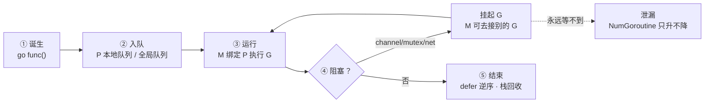
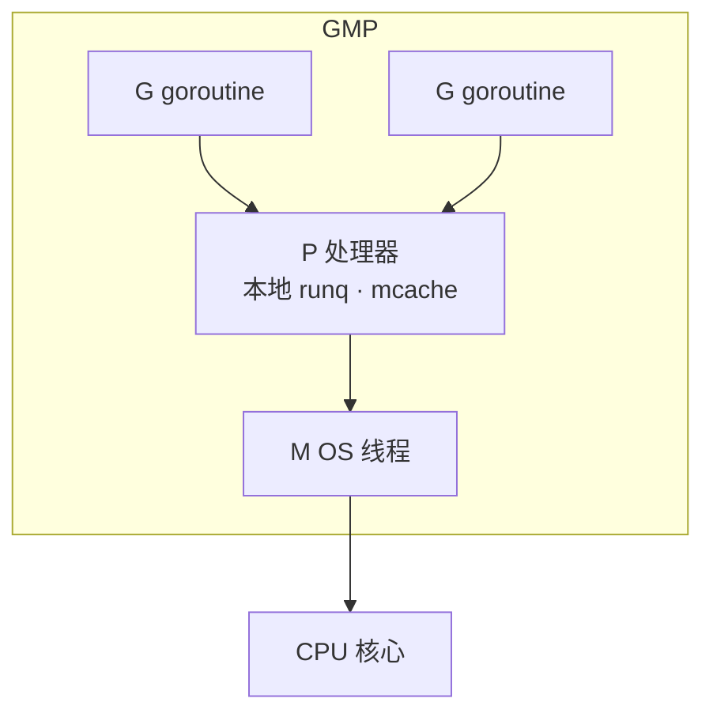
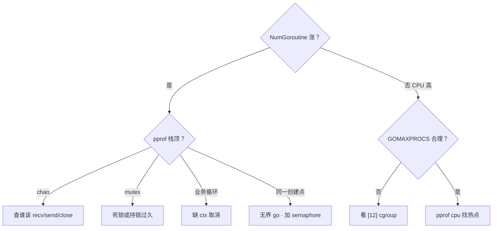
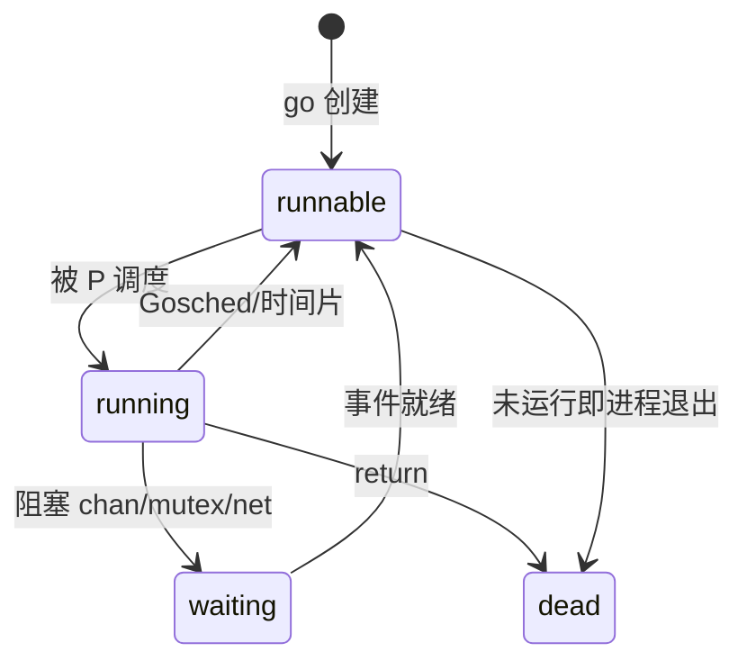

# 05 goroutine与调度模型 · 知识点

> 活动高峰后内存曲线只升不降，`pprof goroutine` 里几万条卡在 `chan receive`；有人把 `for _, item := range list { go process(item) }` 当「并发优化」，结果 CPU 打满、下游被冲垮；还有人 `GOMAXPROCS=1` 以为能限流，goroutine 照样疯长。
> **本章回答**：一个 **goroutine** 从 `go` 诞生到正常结束（或泄漏）的一生——谁创建、谁调度、在哪阻塞、怎么收尾、泄漏长什么样。
> **不讲**：channel 收发细节 → [06](../06-channel与select/)；`sync.Mutex` / `-race` → [07](../07-sync原子与竞态检测/)；`context` 取消链 → [08](../08-context取消与超时传播/)；`errgroup` 编排 → [09](../09-errgroup与并发限流/)；容器里 `GOMAXPROCS` 与 cgroup → [12](../12-GOMAXPROCS与容器cgroup/)。

**标记**：🎯重点 · 🔥难点 · ⭐常考 · 🔧实操

## 面试怎么考

| 标记 | 考点 |
|------|------|
| **核心** | goroutine 不是 OS 线程；G/M/P 分工；`go` 后函数何时真正跑 |
| **必会** | 泄漏三类根因（等不到、退不出、闭包抓错变量）；`WaitGroup` 配对 |
| **常用** | 阻塞点：channel / mutex / syscall / `LockOSThread` |
| **常考** | GMP 口述；抢占式调度从 Go 1.14 起；`runtime.NumGoroutine()` 排障 |

**30 秒怎么说**：goroutine 是用户态轻量协程，启动成本约 KB 栈、纳秒级调度，由 **GMP** 模型挂在少量 OS 线程上跑——**G** 是任务，**M** 是 OS 线程，**P** 是本地队列和运行上下文。`go f()` 只负责把 G 丢进队列，不保证立刻执行。一生四段：诞生 → 就绪/运行 → 阻塞（让出 M）→ 结束或泄漏。泄漏不是「goroutine 太多」，是**永远等不到退出条件**——无人收 channel、无 `ctx` 取消、`WaitGroup` 少 `Done`。限并发用 worker pool / semaphore，别靠 `GOMAXPROCS` 挡 goroutine 数量。

---

## 能力边界

| 维度 | goroutine | OS 线程 | 进程 |
|------|-----------|---------|------|
| **创建成本** | ~2KB 栈起，可扩 | MB 级栈 | 独立地址空间 |
| **调度者** | Go runtime（用户态） | 内核 | 内核 |
| **适合** | 海量 I/O 并发、短任务 | CPU 密集且要真并行 | 隔离、崩溃边界 |
| **不适合** | 无界 `go` 风暴、无退出条件的后台任务 | 百万级创建 | 共享内存细粒度协作 |

运维读 Go 服务：看到 goroutine 暴涨，先分**阻塞栈**（在等什么）还是**忙循环**（在烧 CPU），再追创建点——多半是泄漏或无限 `go`，不是「Go 慢」。

### goroutine vs OS 线程：成本量级 🔧

```text
创建 1 个 goroutine：  ~2KB 栈 + ~1µs 调度开销
创建 1 个 OS 线程：    ~1–8MB 栈 + ~10–50µs 内核切换
```

实测在普通 Linux 机器上：

- 10 万 goroutine：内存 ~200–400MB，创建耗时秒级内，正常服务可承载。
- 10 万 OS 线程：内存 GB 级，`ulimit -u` 撞墙，内核调度延迟肉眼可见。

> 📝 **面试**：被问「为什么 Go 能扛百万并发」——核心不是「goroutine 快」，而是「阻塞不占线程」+「栈按需扩缩」+「调度在用户态无内核介入」。百万 goroutine 里大多数在 netpoller 上挂着，活跃的只有 `GOMAXPROCS` 个在真跑。

---

## 一、一张图：一个 goroutine 的一生

> 🎯 **一句话**：`go` 诞生 → 进队列等 P → 运行或阻塞 → `return` 结束；卡在中间某步不回来 = 泄漏。



**读图**：主轴线跟一次 `go worker()`——编译器把闭包变成 G，runtime 找空闲 P 塞进本地 runq；P 绑定的 M 从队列头取 G 执行。遇到 channel 收不到、锁拿不到、网络 read 没数据，G 进入等待队列，**M 不会傻等**，去偷别的 P 的 G 或从全局队列拿活。函数 `return` 后 defer 跑完，G 结构回收。若阻塞点永远不满足（没人 send、没 Unlock、没 ctx.Done），G 永远挂在图上虚线——`pprof` 里同一栈重复几万次就是这类。

---

## 二、诞生：`go` 到底做了什么 ⭐

> 🎯 **一句话**：`go f()` 只负责**异步投递**一个 G，不等待 `f` 跑完，也不保证执行顺序。

```go
func main() {
    go func() {
        fmt.Println("worker")
    }()
    fmt.Println("main")
}
```

可能输出 `main` 先于 `worker`——主 goroutine 不等人。`go` 后面必须是**函数调用**（含字面量闭包），不能 `go x` 其中 `x` 是未调用的函数值。

### 闭包与循环变量 🔥

```go
// 经典坑：10 个 goroutine 可能全打印 10
for i := 0; i < 10; i++ {
    go func() {
        fmt.Println(i) // ← 闭包抓的是 i 的引用，循环结束时 i==10
    }()
}
```

Go 1.22+ 起每轮 `for` 迭代有**独立**的 `i` 变量，老代码仍建议显式传参：

```go
for i := 0; i < 10; i++ {
    go func(n int) {
        fmt.Println(n)
    }(i)
}
```

> ⚠️ **别混**：「闭包捕获值」vs「捕获变量地址」——传参 `func(n int)(i)` 是值拷贝进闭包；直接读外层 `i` 是共享变量，并发下还是 data race（见 [07](../07-sync原子与竞态检测/)）。

### Go 1.22 loopvar 语义详解 🔥

Go 1.22 之前，`for i := 0; ...` 的 `i` 在整个循环中是**同一个变量**，每轮只是赋新值——闭包捕获的是地址，所有 G 看到最终值。Go 1.22 起，编译器为每轮迭代创建**新的 `i`**，等效于隐式 `i := i`：

```go
// Go 1.22+：下面这段不再有坑，每个 goroutine 打印自己的 i
for i := 0; i < 5; i++ {
    go func() { fmt.Println(i) }()
}
```

但要注意三点：

- **range 语义同步变化**：`for k, v := range slice` 的 `k`/`v` 也每轮独立，闭包安全。
- **旧代码传参仍推荐**：团队可能混用 1.21/1.22 编译（`go.mod` 的 `go` 指令决定语义），显式传参是跨版本最稳的写法。
- **并发安全 ≠ 无 data race**：即使 `i` 独立，若循环体里对**同一个外部变量**并发写，仍需 `sync` 或 channel 保护。

> 📝 **面试加分**：主动说出「Go 1.22 前后 loopvar 语义不同，`go.mod` 的 `go 1.22` 指令控制是否启用」，比只说「1.22 修了」更准确。

> 📝 **面试**：`go` 和线程的区别？——goroutine 栈初始约 2KB、调度在用户态、数量可达百万；线程由内核调度、默认栈 MB 级、数量上千就吃力。`go` 不复制调用栈给新 G，只复制**启动帧**。

### 启动时机

新 G 先进入当前 P 的本地队列；本地满了（默认 256）才一半偷到全局队列。因此**连续 `go` 大量任务**时，后创建的 G 可能稍晚才被调度——不能用来做精确时序同步，同步用 channel / `WaitGroup` / `context`。

> 🔍 **现场**：

```bash
GODEBUG=schedtrace=1000,scheddetail=1 ./app 2>&1 | head -5
# ← 每 1s 打印 P/M/G 数量与调度事件，看是否 runnable 堆积
```

---

## 三、调度：GMP 模型怎么转 ⭐🔥

> 🎯 **一句话**：**G** 干活，**M** 真跑在 CPU 上，**P** 提供本地队列和内存分配上下文；M 必须绑 P 才能执行 Go 代码。



**读图**：全局有很多 G，但只有 `GOMAXPROCS` 个 P 同时「在跑」——每个 P 同一时刻最多一个 G 在 M 上执行。G 多了就排队；M 少了 runtime 会起新 M（上限约 1 万），多了会休眠。P 是调度的锚：没有 P 的 M 只能阻塞或退出，不能执行 Go 代码。

### 工作窃取

本 P 的 runq 空了，会**随机偷**别的 P 队列尾部一半 G——保证 CPU 不闲。全局队列也有兜底，防止饿死。

### 抢占式调度 ⭐

Go 1.14 前：G 只在函数调用边界协作式让出，死循环 G 能占满一个 P。  
Go 1.14+：**异步抢占**——sysmon 监控线程发现 G 跑太久（约 10ms）会发抢占信号，运行时在安全点挂起，把 P 让给别的 G。

> 💡 **打个比方**：P 像收银台，G 像排队顾客，M 是收银员本人。收银员可以换台（M 换 P），但同一时间一个台只能结一单。有人霸占柜台不挪（死循环），店长（sysmon）现在会强制换班。

> 📝 **面试**：口述 GMP——G 是 goroutine 结构含栈和状态；M 是 `pthread`；P 是 `GOMAXPROCS` 个逻辑处理器，带本地 G 队列和 `mcache`。调度目标：把 G 尽快铺到空闲 CPU，阻塞时释放 M。

### GOMAXPROCS

```go
runtime.GOMAXPROCS(0) // 返回当前值；0 表示查询
// 默认 = 逻辑 CPU 数；容器内可能被 automaxprocs 改成 cgroup 配额 → [12]
```

`GOMAXPROCS=1` 只限制**同时跑在 CPU 上的 G 数量**，不限制**已创建**的 G 总数——一万个 `go` 照样存在，只是排队更严重。

---

## 四、运行：栈、defer 与 panic 边界

> 🎯 **一句话**：goroutine 有独立栈，从小栈起步按需扩容；`return` 前 defer 逆序执行；未 recover 的 panic 只杀当前 G。

### 栈增长

初始栈约 2KB，不够时 runtime **复制栈**到新更大内存（通常翻倍），更新指针。因此深递归不会立刻爆进程，但极端深度仍 `stack overflow`。

### defer

```go
func worker() {
    defer fmt.Println("cleanup")
    // ...
}
```

defer 注册进当前 G 的 defer 链表，`return` 或 panic 时逆序执行。多个 defer 按 LIFO。

### panic 只向上冒当前 G

```go
go func() {
    panic("boom") // ← 整个进程崩溃，除非 recover
}()
```

`recover()` 只在**同一 G** 的 defer 里有效；别的 G panic 接不住。生产 HTTP 服务靠 `net/http` 每层 recover，自己 `go` 的长任务要在入口 `defer recover` 或把 error 送回 channel。

---

## 五、阻塞：G 在哪卡住 ⭐

> 🎯 **一句话**：阻塞时 G 挂起，M 往往让给别人；分清「等 I/O」「等锁」「等 channel」决定排障方向。

| 阻塞类型 | 典型栈顶 | G 状态 | M 是否释放 |
|----------|----------|--------|------------|
| channel | `chan receive` / `chan send` | waiting | 通常释放 |
| mutex | `sync.(*Mutex).Lock` | waiting | 释放 |
| 网络 I/O | `internal/poll.runtime_pollWait` | waiting | 释放（netpoller） |
| syscall | `syscall.Syscall` | 可能阻塞 M | 可能占着 M |
| `runtime.Gosched` | 主动让出 | runnable | 释放 |

**netpoller**：网络 fd 就绪由 epoll/kqueue 唤醒，不占 OS 线程干等——所以百万 goroutine 阻塞在 read 仍可行。

**同步 syscall**（如部分磁盘 IO、CGO）：M 可能整线程进内核，P 会另起 M 或偷活——syscall 太久会占调度资源。

### CGO 阻塞的特殊性 🔥

CGO 调用进入 C 代码后，Go runtime **无法抢占**该 G——C 栈不受 Go 调度器管理，sysmon 发的抢占信号被忽略。这意味着：

- 一个 CGO 调用如果 C 侧死循环或长时间阻塞，绑定的 M 整个被钉住。
- runtime 会 `startm` 新建 M 接管释放出的 P，M 数量可能飙升，极端情况撞 `GOMAXPROCS` × 线程上限。
- `cgo` 大量短调用也有开销：每次约 100ns–1µs 的栈切换 + TLS 保存恢复，密集调用会吃 CPU。

> ⚠️ **别混**：CGO 的 `//go:cgo_unsafe_args` 或 `//go:nosplit` 注解影响的是编译器行为，**不能**绕过 M 阻塞问题——C 代码本身要控制耗时或回调 Go 侧做异步。

> 📝 **面试**：CGO 为什么可能让 goroutine 调度退化？——C 栈不可抢占 → M 钉住 → P 被迫换 M → M 数暴涨。解法：C 侧用回调 + Go 侧 `runtime.Cgocall` 异步化，或限制 CGO 并发数。

> 🔍 **现场**（看谁卡住）：

```bash
curl -s localhost:6060/debug/pprof/goroutine?debug=2 | head -80
# ← 看 stack 顶部函数名；大量相同栈 = 同一类阻塞/泄漏
```

```bash
go tool pprof -top http://localhost:6060/debug/pprof/goroutine
# ← 按栈聚合，找占比最高的创建点
```

---

## 六、结束：正常退出与 WaitGroup

> 🎯 **一句话**：G 自然死亡只有函数跑完；`main` 退出会杀全进程，不等别的 G——必须显式 `WaitGroup` / channel 等待。

```go
var wg sync.WaitGroup

func main() {
    for i := 0; i < 3; i++ {
        wg.Add(1)
        go func(n int) {
            defer wg.Done()
            work(n)
        }(i)
    }
    wg.Wait() // ← 等所有 Done
}
```

> ⚠️ **别混**：`wg.Add` 必须在 `go` **之前**或 goroutine **刚开始**完成——在 `go` 里 `Add` 有 race；`Done` 次数必须等于 `Add`。`WaitGroup` 不能重用直到 `Wait` 返回。

`main` 结束 → 所有 G 被终止，defer 不一定跑完——所以后台任务要么 `wg.Wait()`，要么交给 graceful shutdown（[10](../10-HTTP-Server与优雅退出/)）。

---

## 七、泄漏：从「多」到「永远不回来」🔥⭐

> 🎯 **一句话**：泄漏 = G 还活着且**永远阻塞**在等一个不会来的事件；`NumGoroutine` 单调涨是信号，不是根因。

### 三类高频根因

**① channel 无人收发**

```go
ch := make(chan int)
go func() {
    ch <- 1 // ← 无缓冲且无接收者，永久阻塞
}()
```

**② 无取消的阻塞循环**

```go
go func() {
    for {
        doPoll() // ← 没有 ctx.Done()、没有 break
    }
}()
```

**③ 锁顺序死锁**

```go
go func() { muA.Lock(); muB.Lock() }()
go func() { muB.Lock(); muA.Lock() }()
```

### 闭包引用导致 GC 不掉

goroutine 捕获了大 map / `*http.Request`，即使逻辑上「跑完了」若仍阻塞，整个对象图被 G 引用着——堆内存与 goroutine 一起涨。

### 怎么认

```go
import "runtime"

log.Printf("goroutines=%d", runtime.NumGoroutine())
```

配合定时 pprof：同一 `chan receive` 栈从 100 涨到 5000，基本坐实泄漏。

> 💡 **打个比方**：goroutine 泄漏就像一群人进了房间却没有门出去——每条泄漏的 goroutine 是一个永远卡在 `chan receive` 走廊里的人，pprof 的重复栈就是「同一批人在同一扇打不开的门前排队」的照片。修复 = 给他们一扇门（`close(ch)` / `ctx.Cancel()`），不是把门焊死（`kill -9`）。

> 📝 **面试**：怎么查 goroutine 泄漏？——`pprof goroutine` 看重复栈 → 找阻塞点（channel/锁/select）→ 追谁该 send/close/cancel 没做 → 补 `ctx`、buffered channel、worker 上限。`-race` 查 data race，不查泄漏。

---

## 八、生产写法：别无限 `go` ⭐🔧

> 🎯 **一句话**：并发度 = **同时活跃**的任务数，不是 goroutine 创建次数；用 worker pool 或 semaphore 封顶。

```go
sem := make(chan struct{}, 50) // 最多 50 并发
var wg sync.WaitGroup
for _, job := range jobs {
    wg.Add(1)
    sem <- struct{}{} // 占坑
    go func(j Job) {
        defer wg.Done()
        defer func() { <-sem }() // 还坑
        process(j)
    }(job)
}
wg.Wait()
```

`for _, x := range xs { go ... }` 在 xs 十万级时等于瞬间十万 G——下游 DB/HTTP 先挂。限流语义完整版见 [09](../09-errgroup与并发限流/)。

### runtime 钩子

```go
go func() {
    for range time.Tick(time.Minute) {
        log.Printf("goroutines=%d", runtime.NumGoroutine())
    }
}()
```

生产更推荐 Prometheus `go_goroutines` 指标 + 告警阈值。

---

## 九、收束：goroutine 凭什么能「轻」

> 🎯 **一句话**：用户态调度 + 小栈 + netpoller 把阻塞从线程上剥掉，代价是你要自己管生命周期。


**可背清单**：

- `go` = 投递 G，不保证顺序、不等待完成
- P 个数 ≈ 并行度，`GOMAXPROCS` 不 cap goroutine 总数
- 阻塞释放 M，syscall/CGO 是例外
- 结束要靠 `Wait`/`ctx`/close，main 不会等人
- 泄漏 = 永久阻塞，查 pprof 重复栈

> ⚠️ **别混**：goroutine 多 ≠ 泄漏；**只升不降**才是。goroutine 多 + CPU 低 → 多半 I/O 阻塞正常；多 + CPU 高 → 忙循环或调度风暴。

---

## 十、作战：goroutine 暴涨怎么定责



| 现象 | 先做 | 别做 |
|------|------|------|
| 内存涨 + goroutine 涨 | `goroutine?debug=2` 看栈 | 盲目重启掩盖 |
| 活动后缓慢涨 | 对比两次 pprof 差分 | 只盯 heap 不看 goroutine |
| CPU 100% 且 G 不多 | `pprof cpu` | 加 `GOMAXPROCS=1` 当限流 |

**60 秒剧本** 🔧：

- **0–10s**：`curl :6060/debug/pprof/goroutine?debug=1` 看总数  
- **10–30s**：`debug=2` 抽 3 条重复栈，记函数名  
- **30–45s**：代码搜 `go ` 创建点 + 对应 channel/ctx  
- **45–60s**：决定 hotfix：加超时 ctx / 关 channel / 限并发  

---

## 十一、生产模板：可观测 goroutine 🔧

> 🎯 **一句话**：`runtime` 指标 + pprof 端点 + 创建点注释 = 三板斧，泄漏能在曲线上涨前预警。

### 暴露 pprof（仅内网）

```go
import _ "net/http/pprof"

func main() {
    go func() {
        log.Println(http.ListenAndServe("127.0.0.1:6060", nil))
    }()
    // ...
}
```

K8s 里用 `kubectl port-forward pod/x 6060:6060` 拉 profile，**不要**把 6060 暴露公网。

### Prometheus 指标

```go
import "github.com/prometheus/client_golang/prometheus"

var goroutines = prometheus.NewGaugeFunc(prometheus.GaugeOpts{
    Name: "app_goroutines",
}, func() float64 { return float64(runtime.NumGoroutine()) })
```

告警：`app_goroutines` 较基线 **持续 +30% 超 15min** 且非活动期 → 拉 goroutine profile。

### 创建点日志（调试版）

```go
const debugG = false

func spawn(name string, fn func()) {
    if debugG {
        log.Printf("spawn %s total=%d", name, runtime.NumGoroutine())
    }
    go fn()
}
```

发布前关掉 `debugG`；排障时临时打开，对照「谁 spawn 了谁」。

### 与容器 CPU 的关系

goroutine 多但 **CPU 低** → 多半 I/O 等待，先查下游 RT 和 fd。goroutine 多且 **CPU 高** → 忙循环或调度风暴，配合 [12](../12-GOMAXPROCS与容器cgroup/) 看 P 是否过少导致 runnable 堆积。

> 📝 **面试**：SRE 看 Go 服务不只盯 RSS——`go_goroutines` 和 `GOGC` 一样是指纹。

---

## 十二、调度状态机：G 的几种状态 ⭐

> 🎯 **一句话**：G 在 **idle / runnable / running / waiting / dead** 间转；pprof 里 waiting 占大头通常是正常的 I/O。



**读图**：`debug=2` 栈里 `runtime.gopark` 表示 waiting；`runtime.schedule` 附近是调度器本身。别把「waiting 多」直接等同于泄漏——要看 **waiting 原因是否随时间只增不减**。

### sysmon 与 netpoller

**sysmon**：不绑定 P 的 M，周期性检查：网络就绪、抢占长任务、释放闲置 P。  
**netpoller**：把网络 fd 阻塞从 M 上剥离，fd ready 时 G 变 runnable。

> ⚠️ **别混**：file I/O 部分路径仍可能占 M；纯磁盘密集要控制并发或线程池（少见）。

### 调度延迟补充

Go 调度器在**正常路径**下的延迟极低——G 从 runnable 到 running 通常在微秒级（本地 runq 直接弹队列，无内核参与）。但以下场景延迟会显著增大：

- **全局队列 fallback**：本地 runq 空且窃取失败时走全局队列，需要加锁，延迟翻一个量级。
- **sysmon 间隔**：sysmon 检查周期约 20µs 起步递增，网络就绪唤醒可能延迟到下个周期。
- **GC stop-the-world**：STW 期间所有 G 暂停（Go 1.14+ 通常 小于 1ms），尾延迟 P99 受影响。

> 📝 **面试**：Go 调度延迟为什么比线程低？——本地 runq 无锁操作 + 用户态切换无 syscall + netpoller 把 I/O 等待从 M 上剥离。但 GC STW 和全局队列是两个延迟来源，尾延迟敏感场景要注意。

---

## 十三、常见面试代码题口径 🔥

### `go func() { fmt.Println(i) }()` 循环

见 [二、闭包与循环变量]；Go 1.22+ 语义变化要在面试里说清版本。

### 两个 goroutine 打印字母顺序

无法保证——除非 channel 同步。考的是 **不假设 `go` 顺序**。

### `runtime.GOMAXPROCS(1)` 还能并发吗

能创建无数 G，但同一时刻只有一个 P 在执行 Go 代码；I/O 阻塞时别的 G 仍可跑（netpoller）。

### `select {}` 在 main

main 永久阻塞，进程不退出——偶见 hold 住测试进程；生产别用。

---

## 十四、收口

### 命令速查 🔧

```bash
runtime.NumGoroutine()                    # 代码内
curl localhost:6060/debug/pprof/goroutine?debug=2
go tool pprof -top :6060/debug/pprof/goroutine
GODEBUG=schedtrace=1000 ./app             # 调度 trace
```

### 面试锚点

| 问 | 30 秒答 |
|----|---------|
| GMP 是什么 | G 任务 M 线程 P 逻辑核+本地队列；M 需绑 P 执行 Go 代码 |
| `go` 后何时执行 | 入队后由调度器分配 P，不保证立刻、不保证顺序 |
| 和线程区别 | 更轻、用户态调度、数量大；并行度受 P 限制 |
| 怎么泄漏 | channel/锁/无 ctx 的循环永久阻塞；pprof 看重复栈 |
| GOMAXPROCS 作用 | 同时运行的 P 数，不是 goroutine 上限 |

### 易错一句话

- 错：`go` 会开新线程一对一 → 对：多 G 复用少量 M  
- 错：`GOMAXPROCS=1` 防止 goroutine 太多 → 对：只减并行，不减数量  
- 错：main 结束 goroutine 会继续 → 对：进程退出全杀  
- 错：goroutine 多就是泄漏 → 对：看是否只升不降 + 栈是否同一阻塞点  
- 错：循环里直接 `go func(){ use(i) }()` 永远安全 → 对：Go 1.22 前必传参  

### 数字墙

```text
初始栈 ~2KB · 本地 runq 256 满则偷全局 · sysmon 抢占 ~10ms
默认 GOMAXPROCS = 逻辑 CPU 数 · M 上限 ~10000
goroutine 创建 ~1µs · OS 线程创建 ~10–50µs · CGO 切换 ~100ns–1µs
栈扩容翻倍 · 栈缩容 GC 时收缩到实际使用量 · netpoller epoll/kqueue
```

---

## 合上书

- [ ] **默画** goroutine 一生：spawn → 入队 → 运行 → 阻塞/结束，标出泄漏岔路  
- [ ] 口述 GMP 三角关系，说明 M 为何必须绑 P  
- [ ] 解释 `go` 与 OS 线程的三点差异（成本、调度者、数量级）  
- [ ] 写一段带 `WaitGroup` 的正确 `go` 循环，并说明 `Add` 放哪  
- [ ] 循环变量闭包坑怎么修（传参 vs Go 1.22）  
- [ ] 列举三类泄漏根因，各给一个 pprof 栈特征  
- [ ] 说明 `GOMAXPROCS` **不能**当并发限流用的原因  
- [ ] 接到 goroutine 暴涨告警，60 秒内敲哪两条命令、看什么  
- [ ] 区分 channel 阻塞与死锁在栈上的不同表现  
- [ ] 说明 main 退出对后台 `go` 的影响，graceful 要靠什么  
