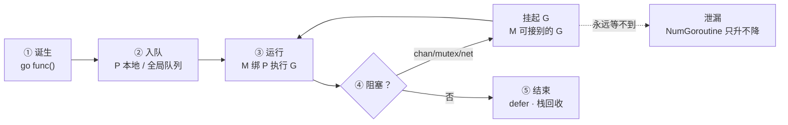
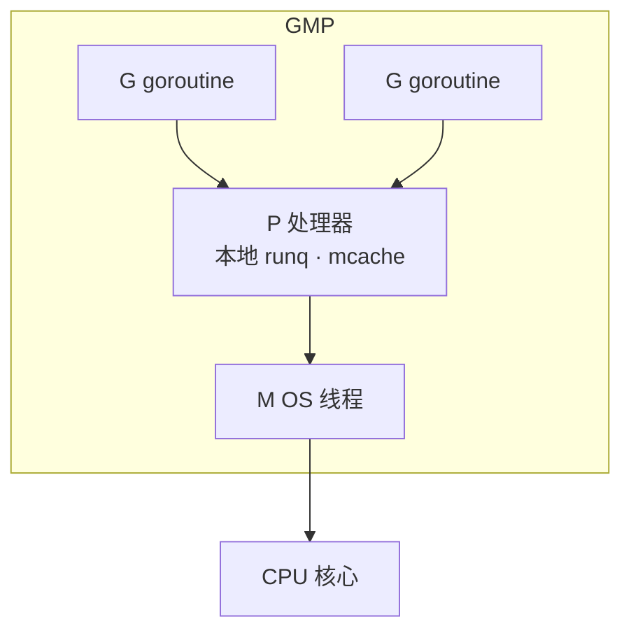
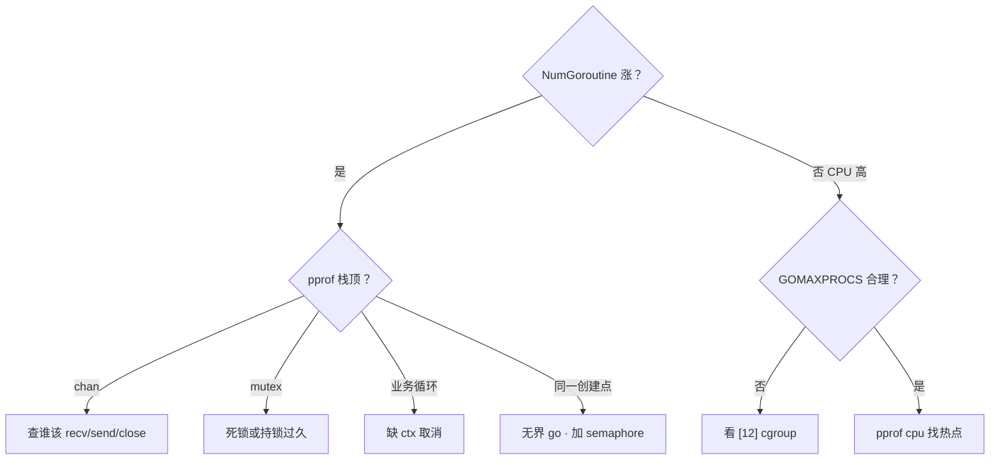
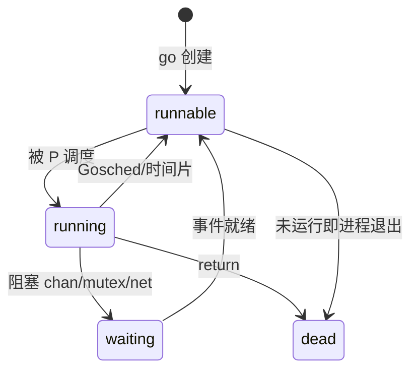

# 05｜goroutine与调度模型 · SRE 开发能力

> 活动高峰后内存只升不降，`pprof goroutine` 里几万条卡在 `chan receive`；有人把 `for _, item := range list { go process(item) }` 当「并发优化」，CPU 打满、下游被冲垮；还有人 `GOMAXPROCS=1` 以为能限流，goroutine 照样疯长。
> **本章回答**：一个 **goroutine** 从 `go` 诞生到正常结束（或泄漏）——谁创建、谁调度、在哪阻塞、怎么收尾、泄漏长什么样。
> **不讲**：channel 收发细节 → [06](../06-channel与select/)；`sync.Mutex` / `-race` → [07](../07-sync原子与竞态检测/)；`context` 取消链 → [08](../08-context取消与超时传播/)；`errgroup` 编排 → [09](../09-errgroup与并发限流/)；容器里 `GOMAXPROCS` 与 cgroup → [12](../12-GOMAXPROCS与容器cgroup/)。

**标记**：🎯重点 · 🔥难点 · ⭐常考 · 🔧实操

---

## 面试怎么考

| 标记 | 考点 |
|------|------|
| **核心** | goroutine 不是 OS 线程；G/M/P 分工；`go` 后函数何时真正跑 |
| **必会** | 泄漏三类根因（等不到、退不出、闭包抓错变量）；`WaitGroup` 配对 |
| **常用** | 阻塞点：channel / mutex / syscall / `LockOSThread` |
| **常考** | GMP 口述；抢占式调度从 Go 1.14 起；`runtime.NumGoroutine()` 排障 |

> 📝 **面试（30 秒）**：goroutine 是用户态轻量协程，约 KB 栈、纳秒级调度，由 **GMP** 挂在少量 OS 线程上——**G** 任务、**M** 线程、**P** 本地队列与运行上下文。`go f()` 只投递入队，不保证立刻执行。一生：诞生 → 就绪/运行 → 阻塞（让出 M）→ 结束或泄漏。泄漏不是「G 太多」，是**永远等不到退出条件**。限并发用 worker / semaphore，别靠 `GOMAXPROCS` 挡个数。

---

## 能力边界

| 维度 | goroutine | OS 线程 | 进程 |
|------|-----------|---------|------|
| **创建成本** | ~2KB 栈起，可扩 | MB 级栈 | 独立地址空间 |
| **调度者** | Go runtime（用户态） | 内核 | 内核 |
| **适合** | 海量 I/O 并发、短任务 | CPU 密集真并行 | 隔离、崩溃边界 |
| **不适合** | 无界 `go` 风暴、无退出条件后台任务 | 百万级创建 | 共享内存细粒度协作 |

- 🔑 **各管一段**
  - `go`：投递 G——**不**保证顺序、不等待完成
  - `GOMAXPROCS`：同时跑 Go 代码的 **P 数**——**不** cap 已创建 G 总数
  - netpoller：网络阻塞从 M 上剥离——**不**让 syscall/CGO 也免费
  - pprof：看重复栈找泄漏——**不**用 `-race` 查泄漏

> ⚠️ **别混**：看到 goroutine 暴涨，先分**阻塞栈**（在等什么）还是**忙循环**（在烧 CPU），再追创建点——多半是泄漏或无限 `go`，不是「Go 慢」。

### 成本量级 🔧

```text
创建 1 个 goroutine：  ~2KB 栈 + ~1µs 调度开销
创建 1 个 OS 线程：    ~1–8MB 栈 + ~10–50µs 内核切换
```

- 10 万 goroutine：内存 ~200–400MB，创建耗时秒级内，正常服务可承载
- 10 万 OS 线程：内存 GB 级，`ulimit -u` 撞墙，内核调度延迟肉眼可见

> 📝 **面试**：为什么 Go 能扛百万并发？——「阻塞不占线程」+「栈按需扩缩」+「用户态调度」。百万 G 里大多挂在 netpoller，活跃的只有约 `GOMAXPROCS` 个在真跑。

---

## 语言最小集

| 零件 | 示例 | 含义 |
|------|------|------|
| 启动 | `go f()` / `go func(){...}()` | 异步投递，必须是调用 |
| 等待 | `wg.Add` / `Done` / `Wait` | 等一组 G 结束 |
| 限流 | `sem := make(chan struct{}, N)` | 信号量占坑还坑 |
| 查询 | `runtime.NumGoroutine()` | 当前 G 数（含系统 G） |
| 并行度 | `runtime.GOMAXPROCS(n)` | 设/查 P 数；`0` 表示查询 |
| 让出 | `runtime.Gosched()` | 主动让出当前 P |
| 栈 | 初始 ~2KB，按需复制扩容 | 深递归仍可能 overflow |
| 排障 | `pprof/goroutine?debug=2` | 看重复阻塞栈 |

```go
var wg sync.WaitGroup
wg.Add(1)
go func() {
    defer wg.Done()
    work()
}()
wg.Wait()
```

零件认完，上主图。

---

## 一、一张图：一个 goroutine 的一生 ⭐🔥

> 🎯 **一句话**：`go` 诞生 → 进队列等 P → 运行或阻塞 → `return` 结束；卡在中间不回来 = 泄漏。



- 📖 **读图**
  - 🛤️ 主线跟一次 `go worker()`：编译器把闭包变 G → 塞进当前 P 的 runq → M 取头执行
  - 🔀 虚线是泄漏岔路：阻塞点永远不满足（没人 send / 没 Unlock / 没 `ctx.Done`）→ `pprof` 同一栈重复几万次（Q2、Q7）

本节对应练习题 Q2。

---

## 二、诞生：`go` 到底做了什么 ⭐

> 🎯 **一句话**：`go f()` 只负责**异步投递**一个 G，不等待 `f` 跑完，也不保证执行顺序。

```go
func main() {
    go func() {
        fmt.Println("worker")
    }()
    fmt.Println("main")
}
```

可能输出 `main` 先于 `worker`——主 goroutine 不等人。`go` 后面必须是**函数调用**（含字面量闭包），不能 `go x`（`x` 是未调用的函数值）。

### 🪤 闭包与循环变量 🔥

```go
// 经典坑：10 个 goroutine 可能全打印 10
for i := 0; i < 10; i++ {
    go func() {
        fmt.Println(i) // ← 闭包抓的是 i 的引用，循环结束时 i==10
    }()
}
```

Go 1.22+ 起每轮 `for` 迭代有**独立**的 `i`；老代码 / 混用版本仍建议显式传参：

```go
for i := 0; i < 10; i++ {
    go func(n int) {
        fmt.Println(n)
    }(i)
}
```

> ⚠️ **别混**：「闭包捕获值」vs「捕获变量」——传参 `func(n int)(i)` 是值拷贝；直接读外层 `i` 是共享变量，并发下仍可能 data race（见 [07](../07-sync原子与竞态检测/)）。

#### ❓ 为什么 Go 1.22 前后 loopvar 不一样？

- 📜 **1.22 前**：整个循环共用一个 `i`，每轮只赋新值——闭包抓的是地址，所有 G 看到最终值
- ✅ **1.22+**：每轮迭代新建 `i`（等效隐式 `i := i`）；`range` 的 `k`/`v` 同步独立
- 🧭 **跨版本最稳**：显式传参——`go.mod` 的 `go` 指令决定语义，团队可能混用 1.21/1.22
- ⚠️ **独立 ≠ 无 race**：即使 `i` 独立，循环体对**同一外部变量**并发写仍要 `sync` / channel

> 📝 **面试**：主动说「`go.mod` 的 `go 1.22` 指令控制 loopvar」比只说「1.22 修了」更准。`go` 与线程：栈约 2KB、用户态调度、数量可达百万；`go` 不复制整栈，只起启动帧。

### ⏱️ 启动时机

- 新 G 先入当前 P **本地队列**；本地满（默认 256）才一半偷到**全局队列**
- 连续大量 `go` 时，后创建的可能稍晚才被调度——**不能**当精确时序；同步用 channel / `WaitGroup` / `context`

> 🔍 **现场**：

```bash
GODEBUG=schedtrace=1000,scheddetail=1 ./app 2>&1 | head -5
# ← 每 1s 打印 P/M/G 数量与调度事件，看是否 runnable 堆积
```

口诀：**go 很轻，但不是免费；main 退了后台也没了**。

本节对应练习题 Q3、Q4。

---

## 三、调度：GMP 模型怎么转 ⭐🔥

> 🎯 **一句话**：**G** 干活，**M** 真跑在 CPU 上，**P** 提供本地队列和内存分配上下文；M 必须绑 P 才能执行 Go 代码。

> 💡 **打个比方**：P 是收银台（队列+工具），M 是收银员，G 是工单。收银员可以换台（M 换 P），同一时间一个台只能结一单。有人霸占柜台不挪（死循环），店长（sysmon）现在会强制换班。



- 📖 **读图**
  - 全局很多 G，同时「在跑」的只有 `GOMAXPROCS` 个 P——每 P 同一时刻最多一个 G 在 M 上
  - G 多了排队；M 少了 runtime 起新 M（上限约 1 万），多了休眠；**无 P 的 M 不能执行 Go 代码**

### 🔄 工作窃取与抢占

- **工作窃取**：本 P runq 空了，随机偷别的 P 队列尾部一半——CPU 不闲；全局队列兜底防饿死
- **抢占（Go 1.14+）**：sysmon 发现 G 跑太久（约 10ms）发抢占信号，安全点挂起，把 P 让给别的 G
  - 1.14 前只在函数调用边界协作式让出——死循环能占满一个 P

#### ❓ 为什么要有 P？M 不够吗？

- ❌ 「P 就是 CPU」不精确——P 是**工位**（runq + `mcache`），不是物理核
- ✅ M 没绑 P → 只能阻塞或退出，**跑不了 Go 用户代码**
- 🎯 调度目标：把 G 尽快铺到空闲 CPU；阻塞时释放 M 去接别的活

### GOMAXPROCS

```go
runtime.GOMAXPROCS(0) // 返回当前值；0 表示查询
// 默认 = 逻辑 CPU 数；容器内可能被 automaxprocs 改成 cgroup 配额 → [12]
```

#### ❓ 为什么 `GOMAXPROCS=1` 挡不住 goroutine 暴涨？

- `GOMAXPROCS` 只限制**同时跑在 CPU 上的 Go 代码并行度**（P 数）
- 一万个 `go` 照样存在——只是排队更严重，内存照涨
- 限「同时活跃任务数」要用 worker pool / semaphore（八节）

> 📝 **面试**：口述 GMP——G 含栈与状态；M 是 `pthread`；P 是 `GOMAXPROCS` 个逻辑处理器，带本地 G 队列和 `mcache`。并行度 ≈ P 个数，不是 G 个数。

本节对应练习题 Q1、Q9。

---

## 四、运行：栈、defer 与 panic 边界

> 🎯 **一句话**：goroutine 有独立栈，从小栈起步按需扩容；`return` 前 defer 逆序执行；未 recover 的 panic 只杀当前 G，但默认会拖垮整个进程。

### 📚 栈增长

初始栈约 2KB，不够时 runtime **复制栈**到更大内存（通常翻倍）并更新指针。深递归不会立刻爆进程，极端深度仍 `stack overflow`。

### defer

```go
func worker() {
    defer fmt.Println("cleanup")
    // ...
}
```

- defer 挂进当前 G 的 defer 链表，`return` 或 panic 时 **LIFO** 执行
- 多个 defer 逆序——先注册的后跑

### panic 边界

```go
go func() {
    panic("boom") // ← 未 recover → 整个进程崩溃
}()
```

- `recover()` **只在同一 G 的 defer** 里有效；别的 G panic 接不住
- 生产 HTTP 靠 `net/http` 每层 recover；自己 `go` 的长任务要在入口 `defer recover`，或把 error 送回 channel（见 [04](../04-错误处理与panic/)）

#### ❓ 为什么别的 goroutine 的 panic 接不住？

- 每个 G 有**独立栈与 defer 链**——`recover` 只扫本栈
- 一个 G panic 且无人 recover → runtime 认为不可恢复 → **整进程退出**
- 解法：每个入口各自 `defer recover`，或用 errgroup 把错误收回（[09](../09-errgroup与并发限流/)）

本节对应练习题 Q11、Q13。

---

## 五、阻塞：G 在哪卡住 ⭐

> 🎯 **一句话**：阻塞时 G 挂起，M 往往让给别人；分清「等 I/O」「等锁」「等 channel」决定排障方向。

| 阻塞类型 | 典型栈顶 | G 状态 | M 是否释放 |
|----------|----------|--------|------------|
| channel | `chan receive` / `chan send` | waiting | 通常释放 |
| mutex | `sync.(*Mutex).Lock` | waiting | 释放 |
| 网络 I/O | `internal/poll.runtime_pollWait` | waiting | 释放（netpoller） |
| syscall | `syscall.Syscall` | 可能阻塞 M | 可能占着 M |
| `runtime.Gosched` | 主动让出 | runnable | 释放 |

- 🌐 **netpoller**：fd 就绪由 epoll/kqueue 唤醒，不占 OS 线程干等——百万 G 阻塞在 read 仍可行
- 🧱 **同步 syscall**（部分磁盘 IO、CGO）：M 可能整线程进内核，P 另起 M 或偷活——太久会占调度资源

### 🔥 CGO 阻塞

CGO 进入 C 后，Go runtime **无法抢占**该 G——C 栈不受调度器管：

- C 侧死循环 / 长阻塞 → 绑定的 M 整根钉住
- runtime `startm` 新建 M 接管 P → M 数可能飙升
- 大量短 CGO 也有开销：约 100ns–1µs 栈切换 + TLS，密集调用吃 CPU

> ⚠️ **别混**：`//go:cgo_unsafe_args` / `//go:nosplit` 改的是编译行为，**不能**绕过 M 阻塞——C 侧要控耗时或回调 Go 做异步。

> 📝 **面试**：CGO 为何让调度退化？——C 栈不可抢占 → M 钉住 → P 换 M → M 数暴涨。解法：C 回调 + Go 异步，或限 CGO 并发。

> 🔍 **现场**：

```bash
curl -s localhost:6060/debug/pprof/goroutine?debug=2 | head -80
# ← 看 stack 顶部函数名；大量相同栈 = 同一类阻塞/泄漏

go tool pprof -top http://localhost:6060/debug/pprof/goroutine
# ← 按栈聚合，找占比最高的创建点
```

本节对应练习题 Q12。

---

## 六、结束：正常退出与 WaitGroup

> 🎯 **一句话**：G 自然死亡只有函数跑完；`main` 退出会杀全进程，不等别的 G——必须显式 `WaitGroup` / channel 等待。

```go
var wg sync.WaitGroup

func main() {
    for i := 0; i < 3; i++ {
        wg.Add(1)
        go func(n int) {
            defer wg.Done()
            work(n)
        }(i)
    }
    wg.Wait() // ← 等所有 Done
}
```

#### ❓ 为什么 `Add` 不能塞进 goroutine 里抢？

- `wg.Add` 必须在 `go` **之前**（或刚进 G、`Done` 之前就完成）——在 `go` 里 `Add` 与 `Wait` 有 race
- `Done` 次数必须等于 `Add`；`WaitGroup` 不能重用直到 `Wait` 返回
- `main` 结束 → 所有 G 被终止，defer **不一定**跑完——后台任务要么 `wg.Wait()`，要么 graceful shutdown（[10](../10-HTTP-Server与优雅退出/)）

> ⚠️ **别混**：`WaitGroup` 管「等结束」；限并发数另用 semaphore / worker（八节）。取消链用 `context`（[08](../08-context取消与超时传播/)）。

本节对应练习题 Q5。

---

## 七、泄漏：从「多」到「永远不回来」🔥⭐

> 🎯 **一句话**：泄漏 = G 还活着且**永远阻塞**在等一个不会来的事件；`NumGoroutine` 单调涨是信号，不是根因。

> 💡 **打个比方**：泄漏像一群人进了房间却没有门出去——每条泄漏 G 卡在 `chan receive` 走廊；pprof 重复栈是「同一扇打不开的门前排队」的照片。修法 = 给门（`close(ch)` / `ctx.Cancel()`），不是 `kill -9`。

### 三类高频根因

**① channel 无人收发**

```go
ch := make(chan int)
go func() {
    ch <- 1 // ← 无缓冲且无接收者，永久阻塞
}()
```

**② 无取消的阻塞循环**

```go
go func() {
    for {
        doPoll() // ← 没有 ctx.Done()、没有 break
    }
}()
```

**③ 锁顺序死锁**

```go
go func() { muA.Lock(); muB.Lock() }()
go func() { muB.Lock(); muA.Lock() }()
```

### 闭包拖住堆

G 捕获大 map / `*http.Request`，若仍阻塞，对象图被 G 引用——堆与 goroutine 一起涨。

### 怎么认

```go
log.Printf("goroutines=%d", runtime.NumGoroutine())
```

定时 pprof：同一 `chan receive` 栈从 100 涨到 5000 → 基本坐实泄漏。

#### ❓ 为什么「goroutine 多」不等于泄漏？

- 多 + **CPU 低** → 多半 I/O 阻塞正常（netpoller 上挂着）
- 多 + **CPU 高** → 忙循环或调度风暴
- 泄漏签名是 **只升不降** + **同一阻塞栈随时间膨胀**——不是绝对值高

> 📝 **面试**：怎么查泄漏？——`pprof goroutine` 看重复栈 → 找阻塞点 → 追谁该 send/close/cancel → 补 `ctx`、buffered channel、worker 上限。`-race` 查 data race，**不**查泄漏。

本节对应练习题 Q7、Q8。

---

## 八、生产写法：别无限 `go` ⭐🔧

> 🎯 **一句话**：并发度 = **同时活跃**的任务数，不是 goroutine 创建次数；用 worker pool 或 semaphore 封顶。

```go
sem := make(chan struct{}, 50) // 最多 50 并发
var wg sync.WaitGroup
for _, job := range jobs {
    wg.Add(1)
    sem <- struct{}{} // 占坑
    go func(j Job) {
        defer wg.Done()
        defer func() { <-sem }() // 还坑
        process(j)
    }(job)
}
wg.Wait()
```

- `for _, x := range xs { go ... }` 在 xs 十万级时 = 瞬间十万 G——下游 DB/HTTP 先挂
- 限流语义完整版见 [09](../09-errgroup与并发限流/)

### runtime 钩子

```go
go func() {
    for range time.Tick(time.Minute) {
        log.Printf("goroutines=%d", runtime.NumGoroutine())
    }
}()
```

生产更推荐 Prometheus `go_goroutines` + 告警阈值。

口诀：**无界 go 等于无界炸弹**。

本节对应练习题 Q6、Q10。

---

## 九、收束：goroutine 凭什么能「轻」

> 🎯 **一句话**：用户态调度 + 小栈 + netpoller 把阻塞从线程上剥掉，代价是你要自己管生命周期。


- 📖 **读图**：①②③ 让「轻」成立；④ 是你付的账——生命周期与竞态要自己管

**可背清单**：

- `go` = 投递 G，不保证顺序、不等待完成
- P 个数 ≈ 并行度，`GOMAXPROCS` 不 cap G 总数
- 阻塞释放 M，syscall/CGO 是例外
- 结束靠 `Wait`/`ctx`/close，main 不会等人
- 泄漏 = 永久阻塞，查 pprof 重复栈

> ⚠️ **别混**：goroutine 多 ≠ 泄漏；**只升不降**才是。

本节对应练习题 Q1。

---

## 十、作战：goroutine 暴涨怎么定责



- 📖 **读图**：先问「涨没涨」→ 涨了看栈顶分流；不涨却 CPU 高 → 查 P / cpu profile

| 现象 | 先做 | 别做 |
|------|------|------|
| 内存涨 + goroutine 涨 | `goroutine?debug=2` 看栈 | 盲目重启掩盖 |
| 活动后缓慢涨 | 对比两次 pprof 差分 | 只盯 heap 不看 goroutine |
| CPU 100% 且 G 不多 | `pprof cpu` | 加 `GOMAXPROCS=1` 当限流 |

**60 秒剧本** 🔧：

- **0–10s**：`curl :6060/debug/pprof/goroutine?debug=1` 看总数
- **10–30s**：`debug=2` 抽 3 条重复栈，记函数名
- **30–45s**：代码搜 `go ` 创建点 + 对应 channel/ctx
- **45–60s**：决定 hotfix：加超时 ctx / 关 channel / 限并发

本节对应练习题 Q7、Q12。

---

## 十一、调度状态机：G 的几种状态 ⭐

> 🎯 **一句话**：G 在 **idle / runnable / running / waiting / dead** 间转；pprof 里 waiting 占大头通常是正常 I/O。



- 📖 **读图**：`debug=2` 里 `runtime.gopark` ≈ waiting；别把「waiting 多」直接当泄漏——看原因是否**随时间只增不减**

### sysmon · netpoller · 延迟

- **sysmon**：不绑 P 的 M，周期性检查网络就绪、抢占长任务、释放闲置 P
- **netpoller**：把网络 fd 阻塞从 M 剥离，ready 时 G → runnable
- 本地 runq 弹队列通常微秒级；全局队列加锁、sysmon 间隔、GC STW 会抬尾延迟

> ⚠️ **别混**：file I/O 部分路径仍可能占 M；纯磁盘密集要控并发。

> 📝 **面试**：调度延迟为何比线程低？——本地 runq 无锁 + 用户态切换 + netpoller。尾延迟注意 GC STW 与全局队列。

---

## 生产模板 🔧

### 模板 1：暴露 pprof（仅内网）

```go
import _ "net/http/pprof"

func main() {
    go func() {
        log.Println(http.ListenAndServe("127.0.0.1:6060", nil))
    }()
    // ...
}
```

K8s：`kubectl port-forward pod/x 6060:6060`——**不要**把 6060 暴露公网。

### 模板 2：semaphore 限并发

```go
func mapLimited(jobs []Job, limit int, fn func(Job)) {
    sem := make(chan struct{}, limit)
    var wg sync.WaitGroup
    for _, job := range jobs {
        wg.Add(1)
        sem <- struct{}{}
        go func(j Job) {
            defer wg.Done()
            defer func() { <-sem }()
            fn(j)
        }(job)
    }
    wg.Wait()
}
```

### 模板 3：Prometheus 指标

```go
var goroutines = prometheus.NewGaugeFunc(prometheus.GaugeOpts{
    Name: "app_goroutines",
}, func() float64 { return float64(runtime.NumGoroutine()) })
```

告警：较基线 **持续 +30% 超 15min** 且非活动期 → 拉 goroutine profile。

### 模板 4：创建点日志（调试版）

```go
const debugG = false

func spawn(name string, fn func()) {
    if debugG {
        log.Printf("spawn %s total=%d", name, runtime.NumGoroutine())
    }
    go fn()
}
```

发布前关 `debugG`；排障临时开，对照「谁 spawn 了谁」。

- 多 + CPU 低 → 先查下游 RT / fd
- 多 + CPU 高 → 忙循环或调度风暴，配合 [12](../12-GOMAXPROCS与容器cgroup/) 看 P 是否过少

> 📝 **面试**：SRE 看 Go 服务不只盯 RSS——`go_goroutines` 和 `GOGC` 一样是指纹。

---

## 踩坑清单

| 现象 | 原因 | 修法 |
|------|------|------|
| `NumGoroutine` 只升不降 | 永久阻塞 / 无取消 | pprof 找栈，补 close/ctx |
| 循环全打印同一值 | 闭包抓共享 `i` | 传参；确认 go 1.22+ |
| 下游被冲垮 | 无界 `go` | semaphore / worker pool |
| `GOMAXPROCS=1` 仍内存涨 | 只限并行不限个数 | 限任务并发，不是砍 P |
| main 一退后台没了 | 进程退出杀全 G | `wg.Wait` / graceful shutdown |
| CGO 后 M 飙升 | C 不可抢占钉 M | 限 CGO 并发 / 异步化 |
| Wait 永久卡住 | `Add`/`Done` 不配 | Add 在 go 前；defer Done |
| panic 整进程挂 | 某 G 未 recover | 入口 defer recover |

---

## 必会 · 常考

| 说法 | 对错 | 口径 |
|------|:----:|------|
| goroutine = OS 线程一对一 | 错 | 多 G 复用少量 M |
| `go` 保证立刻执行 | 错 | 只入队，调度器分配 |
| M 必须绑 P 才能跑 Go 代码 | 对 | 无 P 不能执行用户代码 |
| `GOMAXPROCS` 限制 G 总数 | 错 | 只限 P / 并行度 |
| Go 1.14+ 异步抢占 | 对 | sysmon ~10ms |
| waiting 多 = 一定泄漏 | 错 | 看是否只升不降 |
| recover 可跨 G | 错 | 仅本 G defer |
| main 等人跑完再退 | 错 | 默认不等，要 Wait |

**易混**：并行度 vs G 个数；泄漏 vs 正常 I/O 阻塞；loopvar 1.22 前后；CGO 钉 M vs 普通 channel 阻塞。

---

## 收口

### 命令速查 🔧

```bash
runtime.NumGoroutine()                         # 代码内
curl localhost:6060/debug/pprof/goroutine?debug=2
go tool pprof -top :6060/debug/pprof/goroutine
GODEBUG=schedtrace=1000 ./app                  # 调度 trace
```

### 面试锚点

| 问 | 30 秒答 |
|----|---------|
| GMP 是什么 | G 任务 M 线程 P 逻辑核+本地队列；M 需绑 P 执行 Go 代码 |
| `go` 后何时执行 | 入队后由调度器分配 P，不保证立刻、不保证顺序 |
| 和线程区别 | 更轻、用户态调度、数量大；并行度受 P 限制 |
| 怎么泄漏 | channel/锁/无 ctx 的循环永久阻塞；pprof 看重复栈 |
| GOMAXPROCS 作用 | 同时运行的 P 数，不是 goroutine 上限 |

### 易错一句话对照

```text
错：go 会开新线程一对一
对：多 G 复用少量 M

错：GOMAXPROCS=1 防止 goroutine 太多
对：只减并行，不减数量

错：main 结束 goroutine 会继续
对：进程退出全杀

错：goroutine 多就是泄漏
对：看是否只升不降 + 栈是否同一阻塞点

错：循环里直接 go func(){ use(i) }() 永远安全
对：Go 1.22 前必传参；跨版本仍建议传参

错：waiting 多 = 泄漏
对：正常 I/O 也会 waiting；看趋势与重复栈

错：recover 罩住所有 goroutine
对：每个 G 各自栈、各自 defer
```

### 数字墙

> 初始栈 **~2KB** · 本地 runq **256** 满则偷全局 · sysmon 抢占 **~10ms** · 默认 `GOMAXPROCS` = 逻辑 CPU 数 · M 上限 **~10000** · goroutine 创建 **~1µs** · OS 线程创建 **~10–50µs** · CGO 切换 **~100ns–1µs** · 栈扩容翻倍 · netpoller **epoll/kqueue** · 异步抢占自 **Go 1.14** · loopvar 每轮独立自 **Go 1.22**。

---

## 合上书

对着第一节主图口述一遍，卡住就回对应小节。开头 goroutine 暴涨 / 无限 go / `GOMAXPROCS=1`——各自错在哪，现在该能说清。

- [ ] **默画** goroutine 一生：spawn → 入队 → 运行 → 阻塞/结束，标出泄漏岔路（Q2、Q7）
- [ ] 口述 GMP 三角关系，说明 M 为何必须绑 P（Q1）
- [ ] 解释 `go` 与 OS 线程的三点差异（Q2）
- [ ] 写一段带 `WaitGroup` 的正确 `go` 循环，并说明 `Add` 放哪（Q5）
- [ ] 循环变量闭包坑怎么修（传参 vs Go 1.22）（Q3）
- [ ] 列举三类泄漏根因，各给一个 pprof 栈特征（Q7、Q8、Q12）
- [ ] 说明 `GOMAXPROCS` **不能**当并发限流用的原因（Q6）
- [ ] 接到 goroutine 暴涨告警，60 秒内敲哪两条命令、看什么（Q7）
- [ ] 区分 channel 阻塞与死锁在栈上的不同表现（Q12）
- [ ] 说明 main 退出对后台 `go` 的影响（Q4）

全部打勾后，找同事十分钟讲清「开头 goroutine 暴涨现场，60 秒怎么查、怎么改」。讲得下来，你就是下一个能拦住「再 go 一点」的人。

下一章：[06 channel与select](../06-channel与select/)。
