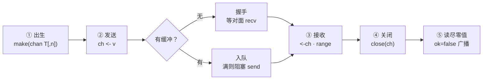
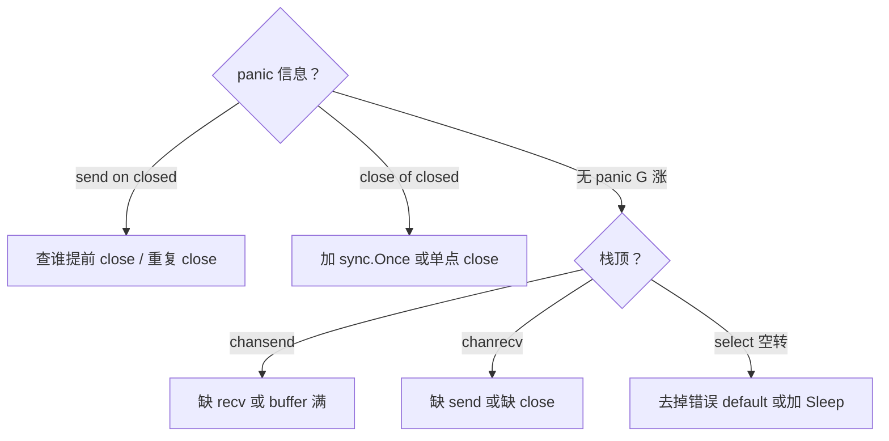

# 06｜channel与select · SRE 开发能力

> 发布系统用 channel 传状态：有人 `close` 后还在 `send` 直接 panic；有人把无缓冲当「同步银弹」把吞吐打到个位数；`select` 里裸 `default` 空转，监控里 G 不多但某一核 100%。群里三个人分别喊「加大 buffer」「加 recover」「再开几个 worker」。
> **本章回答**：一次 **channel 通信**从 `make` 到 `close` 的一生——send 怎么堵、recv 怎么等、`select` 怎么仲裁、关闭后各端什么行为。
> **不讲**：goroutine 调度与泄漏总论 → [05](../05-goroutine与调度模型/)；`Mutex` / `-race` → [07](../07-sync原子与竞态检测/)；`ctx` 取消 → [08](../08-context取消与超时传播/)；`errgroup` 编排 → [09](../09-errgroup与并发限流/)。

**标记**：🎯重点 · 🔥难点 · ⭐常考 · 🔧实操

---

## 面试怎么考

| 标记 | 考点 |
|------|------|
| **核心** | 无缓冲 = 同步握手；有缓冲 = 异步到满；`close` 广播唤醒 |
| **必会** | 只 close 不 send；`range` 退出条件；nil channel 永久阻塞 |
| **常用** | `select` + `ctx.Done()`；fan-in / worker pool |
| **常考** | 向 closed channel 发送 panic；`v, ok := <-ch`；select 多就绪伪随机 |

> 📝 **面试（30 秒）**：channel 是带类型的并发队列，语法只有 `ch <- v`、`<-ch`、`close(ch)`。无缓冲必须收发**同时到场**；有缓冲未满时 send 只写槽。`close` = 再也没有新值——`range` drain 完退出，多读者都能收到零值+`ok=false`。`select` 多路复用，多 case 就绪时**伪随机**选一个。关闭是发送方的责任；向已关闭 channel 发送会 panic。用 channel 传数据、用 `ctx` 传取消，别混。

---

## 能力边界

| 工具 | 适合 | 不适合 |
|------|------|--------|
| **无缓冲 channel** | 同步点、信号量(1)、严格握手 | 高吞吐流水线 |
| **有缓冲 channel** | 削峰、固定深度队列 | 无界堆积（应用 cap） |
| **Mutex** | 保护共享内存、计数器 | 编排多阶段流水线 |
| **select** | 等多个事件之一、超时、非阻塞探测 | 替代 if-else 业务分支 |

- 🔑 **各管一段**
  - channel：CSP「通过通信共享内存」——**不**是无限队列
  - `select`：多 channel / timer / `ctx` 仲裁——**不**做值分支（那是 `switch`）
  - `close`：宣告「不会再进货」——**不**用来传一条业务消息
  - Mutex：保护同一块内存——任务分发仍优先 channel（十一节）

> ⚠️ **别混**：channel 深度、关闭权、谁在阻塞，都要设计；「开了 channel 就线程安全」救不了 close 竞态 panic。

---

## 语言最小集

| 零件 | 示例 | 含义 |
|------|------|------|
| 无缓冲 | `make(chan T)` | 收发必须握手 |
| 有缓冲 | `make(chan T, n)` | n 个槽，满则堵 send |
| nil | `var ch chan T` | 读写永久阻塞；`close` panic |
| 发送 | `ch <- v` | 拷贝值入队/交接 |
| 接收 | `v := <-ch` | 阻塞到有值或 closed |
| ok 判别 | `v, ok := <-ch` | `ok=false` = 已关且 drained |
| range | `for v := range ch` | 自动 drain 到 close |
| 关闭 | `close(ch)` | 只一次；发送方关 |
| select | `select { case ... }` | 任一就绪；多就绪随机 |
| default | `default:` | 非阻塞试探；循环里易空转 |
| 单向 | `chan<- T` / `<-chan T` | 编译期只写/只读 |
| 信号 | `chan struct{}` | 零成本「完成/退出」 |

```go
ch := make(chan int, 8)
ch <- 1
v, ok := <-ch
close(ch)
for x := range ch { _ = x } // drained 后退出
```

零件认完，上主图。

---

## 一、一张图：一次 channel 通信的一生 ⭐🔥

> 🎯 **一句话**：`make` 出生 → send/recv 交接或排队 → `close` 宣告结束 → 读者 drain 后离场。



- 📖 **读图**
  - 🛤️ 左跟一条消息：`make` 决定有没有仓库；无缓冲像当面递货，有缓冲先放槽、满才等
  - 🪧 `close` 不是销毁，是贴告示「不再进货」——队列里的还能读完；整条命结束在**没有读写双方卡死**
  - 🔪 开篇现场：close 后还 send → ④之后误走 ②；裸 default 空转 → 卡在 ③ 的错误姿势（Q1、Q8、Q14）

本节对应练习题 Q1、Q14。主线有了——先从 `make` / nil 出生。

---

## 二、出生：`make` 与 nil channel ⭐

> 🎯 **一句话**：`make(chan T)` 无缓冲；`make(chan T, n)` 有 n 个槽；**nil channel 读写永远阻塞**。

```go
ch1 := make(chan int)      // 无缓冲
ch2 := make(chan int, 100) // 缓冲 100
var ch3 chan int           // nil，不能直接当工作队列用
```

| 状态 | send | recv | close |
|------|------|------|-------|
| nil | 阻塞 | 阻塞 | panic |
| open | 规则见三/四节 | 规则见三/四节 | 合法（一次） |
| closed | **panic** | 零值, ok=false | panic |

> ⚠️ **别混**：未 `make` 的 **nil** 和已 `close` 的 channel——前者永远等，后者能读零值。口诀：**「nil 永远等，closed 能读零」**。

### 🔌 禁用一路：select 里置 nil

```go
var ch chan int // nil
select {
case <-ch:        // 永不就绪
case <-ctx.Done():
    return
}
```

#### ❓ 为什么要故意用 nil channel？

- 🎛️ 在 `select` 里把某个 case 的 channel **设为 nil** = 临时拔掉那一路，比 `bool` flag 干净
- ✅ 动态开关：某路关掉就 `ch = nil`，再打开就重新赋有效 channel
- ❌ 误用：`var ch chan int` 后直接 `ch <- 1` 当工作队列——永久阻塞，像泄漏（回 [05](../05-goroutine与调度模型/)）

> 📝 **面试**：nil channel 有什么用？——在 `select` 里临时「拔掉」一路。⭐（Q4）

本节对应练习题 Q4。出生清楚了，看发送。

---

## 三、发送：无缓冲 vs 有缓冲 ⭐🔥

> 🎯 **一句话**：无缓冲 send **等 recv 到场**才拷贝；有缓冲 send 在未满时**只写槽**不等人。

### 🤝 无缓冲：同步点

```go
ch := make(chan int)
go func() {
    ch <- 42 // ← 阻塞直到 main 执行 <-ch
}()
v := <-ch
```

- 🔗 一次成功通信 = **happens-before**：send 完成先于 recv 收到（内存可见性基础，[07](../07-sync原子与竞态检测/)）
- 💡 **打个比方**：无缓冲像当面交快递——你举着包裹（send 阻塞）直到对方伸手（recv）

#### ❓ 为什么「改成无缓冲更同步」反而把吞吐打穿？

- 🔥 无缓冲是**每一次交接都要对齐**——流水线没有仓库，产能被握手次数卡住
- ✅ 「同步」≠「更快」；要背压用小缓冲或无缓冲**故意**让上游慢，不是当银弹
- 📊 高吞吐阶段管道：有缓冲削峰；严格同步点（就绪信号）再用无缓冲

### 📦 有缓冲：异步到满

```go
ch := make(chan int, 2)
ch <- 1
ch <- 2
ch <- 3 // ← 第三次阻塞，直到有人 <-ch
```

- `len(ch)` = 当前元素数，`cap(ch)` = 槽位数——**仅调试参考**，并发下随时变
- 发送 **拷贝** 值进 channel（指针则拷贝地址）；大结构体考虑 `*T` 或 pool

> 🔍 **现场**（怀疑 send 堵死）：

```bash
# pprof goroutine 栈顶 runtime.chansend
curl -s localhost:6060/debug/pprof/goroutine?debug=2 | grep -A5 chansend
# ← 同一行重复几千次 = 缺 recv 或 buffer 满
```

> 📝 **面试**：无缓冲 = 同步握手；有缓冲 = 满才堵 send。⭐（Q1、Q13）

本节对应练习题 Q1、Q13。发送懂了，看接收。

---

## 四、接收：`<-ch`、`ok` 与 `range` ⭐

> 🎯 **一句话**：`<-ch` 阻塞到有事或 close；`v, ok := <-ch` 区分真零值与已关闭；`range` 自动 drain 到 close。

```go
v, ok := <-ch
if !ok {
    // channel 已关闭且 drained
}

for v := range ch {
    process(v)
}
// close 且队列空后循环退出
```

> ⚠️ **别混**：从 closed channel 读 **不 panic**，得类型零值 + `ok=false`；**向 closed send 才 panic**。

### 📢 只关闭、不发送

- `close(ch)` 后所有阻塞的 recv 被唤醒，读到零值 `ok=false`
- 常用作 **广播「结束了」**——多个 worker `range` 同一 channel，close 一次全员退出
- **规则**：谁 send 谁 close（或专门协调者）；**不要** recv 方 close（除非协议约定且发送方已停）

#### ❓ 为什么 `range` 不 close 就永远不退出？

- 🔁 `range` 语义 =「一直读到 **close 且队列空**」
- ❌ 只停生产者、忘 `close` → 消费者卡在 `chanrecv`，G 泄漏（[05](../05-goroutine与调度模型/)）
- ✅ 发送方 `defer close(ch)` 或协调者单点 close；用 `ok` 时显式判 `!ok` 退出

本节对应练习题 Q2、Q7。接收会了，看 close 事故。

---

## 五、关闭：`close` 的语义与事故 ⭐🔥

> 🎯 **一句话**：`close` = 不会再有 send；重复 close 或向 closed send → panic。

#### ❓ 为什么 send on closed 直接崩，而不是静默丢掉？

- 🛡️ 防你以为对方还在收——静默丢数据比 panic 更难查
- ✅ 读 closed **不** panic，是为了让 `range` 能 drain 干净
- 🔥 设计刻意不对称：**写 closed 崩，读 closed 安全**

```go
close(ch)   // 合法一次
close(ch)   // panic: close of closed channel
ch <- 1     // panic: send on closed channel（若已 close）
```

### 🛡️ 安全模式

```go
// 发送方
defer close(ch)
for _, item := range items {
    ch <- item
}

// 防重复 close
var once sync.Once
once.Do(func() { close(ch) })
```

### 📋 收束：关闭权清单

- 通常 **发送方 close**
- 多生产者：`ctx` 取消 + 单独 `done`，或 merge 后**单点** close
- recv 方只 `range` / `ok`，不 close 除非协议写明
- 不要用 close 传「数据」——只传结束信号；数据用普通 send

> 📝 **面试**：为什么向 closed 发送 panic？——防止静默丢数据；读端还能 drain。口诀：**「只 close 不 send；读 closed 安全，写 closed panic」**。⭐（Q2、Q3、Q8）

本节对应练习题 Q2、Q3、Q8。关闭钉死，进 select。

---

## 六、select：多路仲裁 ⭐🔥

> 🎯 **一句话**：`select` 阻塞到**任一 case 就绪**；多个就绪时**伪随机**选一个；`default` 非阻塞。

> 💡 **打个比方**：`select` = 同时盯几扇门，哪扇先开进哪扇；两扇同时开就掷骰子——**不是**「写在上面的优先」。

```go
select {
case v := <-ch1:
    handle(v)
case ch2 <- x:
    sent()
case <-time.After(3 * time.Second):
    timeout()
case <-ctx.Done():
    return ctx.Err()
}
```

### 🎲 公平性

- 多个 case 同时就绪 → Go **伪随机**选一个，避免饥饿
- 不要依赖书写顺序当优先级——要优先级用嵌套 select 或单独 goroutine

#### ❓ 为什么多 case 就绪不按书写顺序？

- ⚖️ 固定顺序会饿死下面的 case（上面永远抢先）
- ✅ 随机 ≈ 公平；需要优先级就**显式**写两层 select，别假装「上面优先」
- ⭐ 高频错答：「写在上面的 case 优先」——面试直接减分

### ⚠️ default：忙等陷阱

```go
for {
    select {
    case v := <-ch:
        handle(v)
    default:
        // 无数据时立即走这里 → CPU 空转
    }
}
```

- `default` 做 **非阻塞试探**（试一次就走）
- 循环里应阻塞 select，或 `time.Sleep` / 等真正事件——开篇「某一核 100%」多半是这个

```go
select {} // 空 select：永久阻塞，占一个 G——偶尔 hold main
```

### 🔧 与 ctx 组合

```go
select {
case <-ctx.Done():
    return ctx.Err()
case job, ok := <-jobs:
    if !ok {
        return nil
    }
    process(job)
}
```

取消和收活同一层仲裁——[08](../08-context取消与超时传播/) 详讲 ctx。

> 📝 **面试**：`select` vs `switch`？——`select` 专用于 channel/`default`；`switch` 是值分支。多就绪伪随机。⭐（Q5、Q6、Q14）

本节对应练习题 Q5、Q6、Q14。仲裁会了，看流水线模式。

---

## 七、模式：fan-in、fan-out、pipeline ⭐

> 🎯 **一句话**：fan-out 多 worker 读同一 jobs；fan-in 多路 merge 到一根 out；pipeline 阶段用 channel 串起来。

### 🏊 Worker pool

```go
jobs := make(chan Job, 100)
var wg sync.WaitGroup
for i := 0; i < 8; i++ {
    wg.Add(1)
    go func() {
        defer wg.Done()
        for j := range jobs {
            handle(j)
        }
    }()
}
for _, j := range list {
    jobs <- j
}
close(jobs)
wg.Wait()
```

- 固定 8 个 G 消费，jobs 缓冲削峰——比每条 `go handle` 可控（[05](../05-goroutine与调度模型/)）
- 谁 close `jobs`：生产者（发完列表的那一方）

### 🔀 fan-in（merge）

```go
func merge(cs ...<-chan int) <-chan int {
    out := make(chan int)
    var wg sync.WaitGroup
    for _, c := range cs {
        wg.Add(1)
        go func(ch <-chan int) {
            defer wg.Done()
            for v := range ch {
                out <- v
            }
        }(c)
    }
    go func() {
        wg.Wait()
        close(out)
    }()
    return out
}
```

#### ❓ 为什么 merge 的 `out` 无缓冲时容易互相堵？

- 🧱 多个 merge G 同时 `out <- v`，下游慢 → 全堵在 send；`wg.Wait` 的 close 协程也等不到
- ✅ 给 `out` 加小缓冲，或保证下游持续消费；close 仍由 **WaitGroup 后的单点** 做
- 🕳️ 泄漏形态：`wg.Wait` 后 `close(out)` 但无人读 out → merge G 卡在 send（踩坑清单）

### ➡️ 单向 channel 类型

```go
func producer(out chan<- int) { /* 只能 send */ }
func consumer(in <-chan int)  { /* 只能 recv */ }
```

编译期约束只读/只写，API 自文档化。

本节对应练习题 Q9、Q11、Q12。模式有了，看方向与容量。

---

## 八、方向与容量设计 🔧

> 🎯 **一句话**：缓冲深度 = 你愿意积压多少；0 = 强同步；过大 = 掩盖背压、占内存。

| 场景 | 建议 |
|------|------|
| 严格同步 | 无缓冲 |
| 突发流量 | 小缓冲 + 监控 `len` |
| 背压 | 无缓冲或满时阻塞上游 |
| 广播退出 | `close` + `range` |

#### ❓ 为什么不能 `make(chan T, 999999)` 当无限队列？

- 💣 堆在内存里，OOM 在等你；延迟被「假吞吐」掩盖
- ✅ 真背压靠 **阻塞 send** 让上游慢下来，不是无限 buffer
- 📈 `len(jobs) > cap(jobs)*8/10` 可打饱和指标——并发下仅近似，看趋势

### 📐 设计三问（写在声明上方）

```go
// 1. 生产者：8 个 worker，ctx 取消时退出
// 2. 消费者：主 goroutine range，close 后退出
// 3. close：WaitGroup 等所有 worker 停 → 单点 close(out)
out := make(chan Result, 64)
```

本节对应练习题 Q10、Q11。三问记住，进作战。

---

## 九、作战：channel 相关故障定责 🔧🔥

> 🎯 **一句话**：先看 panic 文案，再看 goroutine 栈顶是 `chansend` / `chanrecv` / select 空转。



- 📖 **读图**：开篇三种事故分别落 A1、A3（无缓冲过密）、A5；先走左列 panic，再走右列栈顶

| 现象 | 先做 | 别做 |
|------|------|------|
| 吞吐骤降 | 看无缓冲握手是否过多 | 盲目加大 buffer |
| CPU 高 G 不多 | 搜 `select`+`default` 循环 | 加 goroutine |
| 偶发 panic | 搜 `close` 与 send 竞态 | recover 吞 panic |

**60 秒剧本** 🔧：

- **0–10s**：拿 panic 栈或 goroutine profile
- **10–30s**：定位 `chansend`/`chanrecv` 文件行
- **30–45s**：画生产者 / 消费者 / 谁 close
- **45–60s**：补 `ctx`、改缓冲、或改 Mutex

本节对应练习题 Q8、Q12。定责完，看关闭协议与选型。

---

## 十、关闭协议、背压与定时器 ⭐

> 🎯 **一句话**：channel 设计三问——**谁生产、谁消费、谁 close**；深度是背压，不是越大越好。

### 📜 关闭协议模板

```go
type Result struct {
    Val int
    Err error
}

func worker(ctx context.Context, in <-chan Job, out chan<- Result) {
    defer close(out) // 唯一发送方负责 close out
    for {
        select {
        case <-ctx.Done():
            return
        case job, ok := <-in:
            if !ok {
                return
            }
            out <- Result{Val: handle(job)}
        }
    }
}
```

- 协调者：`close(in)` 等 worker 退出——**不要** worker 去 close `in`（发送方关 `in`）

### ⏱️ 定时器 + channel

```go
select {
case <-ctx.Done():
    return
case <-time.After(5 * time.Second):
    return errors.New("timeout")
case v := <-ch:
    use(v)
}
```

> ⚠️ **别混**：`time.Tick` / 紧循环 `time.After` 创建的 timer **不可回收或易堆积**。长寿命用 `time.NewTicker` / `NewTimer` 并 `Stop`；超时优先 `ctx`（[08](../08-context取消与超时传播/)）。

```go
ticker := time.NewTicker(time.Second)
defer ticker.Stop()
for {
    select {
    case <-ticker.C:
        doWork()
    case <-ctx.Done():
        return
    }
}
```

> 📝 **面试**：「用 channel 做队列」要说出 **close 权** 和 **缓冲深度**，否则等于没设计。⭐（Q9、Q10）

本节对应练习题 Q9、Q10。背压讲完，对比 Mutex。

---

## 十一、对比：channel vs Mutex 何时换 ⭐

> 🎯 **一句话**：任务分发、广播退出用 channel；保护 map/计数器用 Mutex / atomic。

| 需求 | channel | Mutex |
|------|---------|-------|
| 任务分发 | ✅ worker pool | ❌ |
| 保护 map/struct | ❌ | ✅ |
| 广播退出 | ✅ close + range | ✅ `sync.Cond` 少见 |
| 精确计数器 | 过重 | ✅ atomic 更好 |
| API 边界取消 | 配合 ctx | 配合 ctx |

- ❌ 用 channel 模拟 mutex（`make(chan struct{}, 1)`）可以但可读性差，除非刻意限 1 并发
- ✅ 信号惯用法：`done := make(chan struct{})` → `close(done)` 零成本传「完成」

```go
done := make(chan struct{})
go func() {
    work()
    close(done)
}()
select {
case <-done:
case <-time.After(time.Minute):
    log.Fatal("stuck")
}
```

本节对应练习题 Q13。选型清了，上可复制模板。

---

## 生产模板 🔧

### 模板 1：worker pool + 单点 close

```go
func RunPool(ctx context.Context, n int, jobs <-chan Job) error {
    var wg sync.WaitGroup
    errCh := make(chan error, 1)
    for i := 0; i < n; i++ {
        wg.Add(1)
        go func() {
            defer wg.Done()
            for {
                select {
                case <-ctx.Done():
                    return
                case j, ok := <-jobs:
                    if !ok {
                        return
                    }
                    if err := handle(j); err != nil {
                        select {
                        case errCh <- err:
                        default:
                        }
                    }
                }
            }
        }()
    }
    done := make(chan struct{})
    go func() { wg.Wait(); close(done) }()
    select {
    case <-done:
        return nil
    case err := <-errCh:
        return err
    case <-ctx.Done():
        return ctx.Err()
    }
}
```

### 模板 2：非阻塞试探（正确用 default）

```go
select {
case jobs <- j:
    // 入队成功
default:
    // 队列满：打指标 / 拒绝 / 降级，不要空转 for
    metrics.Dropped.Inc()
}
```

### 模板 3：信号 done + 超时

```go
func WaitOrTimeout(done <-chan struct{}, d time.Duration) error {
    t := time.NewTimer(d)
    defer t.Stop()
    select {
    case <-done:
        return nil
    case <-t.C:
        return errors.New("timeout")
    }
}
```

---

## 踩坑清单

| 现象 | 原因 | 修法 |
|------|------|------|
| send on closed | close 后仍 send | Once close / ctx 停 worker |
| 死锁 single G | buffer 满再 send 无 recv | 加 goroutine 或改缓冲 |
| range 永不退出 | 未 close | 发送方 close |
| CPU 100% | select+default 空转 | 阻塞 select 或 sleep |
| 顺序乱 | 多 G 写同一 ch | fan-in 单 writer 或加锁 |
| nil 被误用 | var 后未 make | 初始化 make 或显式 nil 用法 |
| merge G 泄漏 | out 无 reader | 加缓冲或保证下游消费 |
| timer 泄漏 | 紧循环 `time.After`/`Tick` | `NewTimer`/`NewTicker` + Stop |

---

## 必会 · 常考

| 说法 | 对错 | 口径 |
|------|:----:|------|
| 无缓冲 = 收发同时到场 | 对 | 同步握手 |
| 有缓冲永远不堵 | 错 | 满则堵 send |
| 读 closed 会 panic | 错 | 零值 + ok=false |
| 写 closed 会 panic | 对 | send on closed |
| select 上面 case 优先 | 错 | 多就绪伪随机 |
| nil channel 可禁用 select 一路 | 对 | 永不就绪 |
| close 由发送方负责 | 对 | 多生产者单点协调 |
| buffer 越大越快 | 错 | 掩盖背压、增延迟 |

**易混**：nil vs closed；send panic vs recv 安全；`select` vs `switch`；`time.Tick` vs `NewTicker`。

---

**回到开头那个现场**：close 后还 send、无缓冲当银弹、`select`+`default` 空转。正确剧本是：发送方单点 close → 缓冲深度按背压设 → select 阻塞等或带 ctx，别裸 default 转 CPU。

## 收口

### 命令速查 🔧

```bash
# goroutine 栈里 chan 相关
curl -s localhost:6060/debug/pprof/goroutine?debug=2 | grep -E 'chan|select'

# 代码里搜危险点
rg 'select \{' -A20 | rg 'default:'   # 忙等嫌疑
rg 'close\('                           # 谁在关
rg 'time\.(After|Tick)\('              # timer 堆积嫌疑
```

### 面试锚点

| 问 | 30 秒答 |
|----|---------|
| 无缓冲 vs 有缓冲 | 无缓冲必须收发同时；有缓冲满才堵 send |
| close 后读写 | 读零值+ok=false；send panic |
| 谁 close | 发送方；不要 recv close（除非约定） |
| nil channel | 读写永久阻塞；select 里可禁用一路 |
| select 多就绪 | 伪随机选一个 |
| 设计三问 | 谁生产、谁消费、谁 close |

### 易错一句话对照

```text
错：close 用来通知「一条消息」
对：close 表结束，消息用 send

错：channel 线程安全所以可随便关
对：close 竞态仍 panic

错：range 不用 close 也能停
对：不 close 永远阻塞在 range

错：buffer 越大越快
对：过大掩盖背压、增延迟

错：用 channel 做共享 map
对：数据进 channel 拷贝，共享状态用 Mutex

错：select 上面的 case 优先
对：多就绪伪随机；优先级要显式嵌套
```

### 数字墙

```text
无缓冲 cap=0 · len≤cap · close 只一次 · select 多就绪随机
worker 数有界 · buffer 按背压 · nil=永久等 · closed=能读零
```

本节对应练习题 Q1～Q14。

---

## 合上书

- [ ] **默画** channel 通信一生：make → send/recv → close → drain（标有/无缓冲分叉）
- [ ] 口述无缓冲握手与 happens-before
- [ ] 说明 closed channel 上 send vs recv 的差异
- [ ] 写 worker pool：`jobs` + `close` + `WaitGroup`
- [ ] 解释 nil channel 在 `select` 里的用法
- [ ] 指出 `select`+`default` 忙等怎么改
- [ ] 说明 fan-in merge 时为何要缓冲或单 writer
- [ ] 谁该 close、重复 close 会怎样
- [ ] `v, ok := <-ch` 何时必须用
- [ ] 接到 `chansend` 泄漏栈，排查三步（栈 → 谁收发 → 谁 close）
