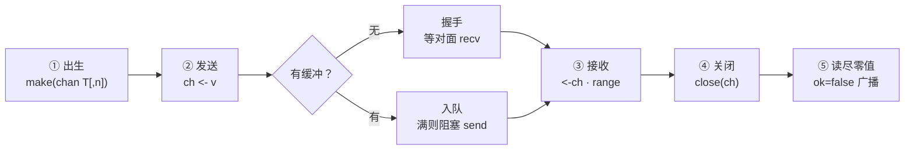
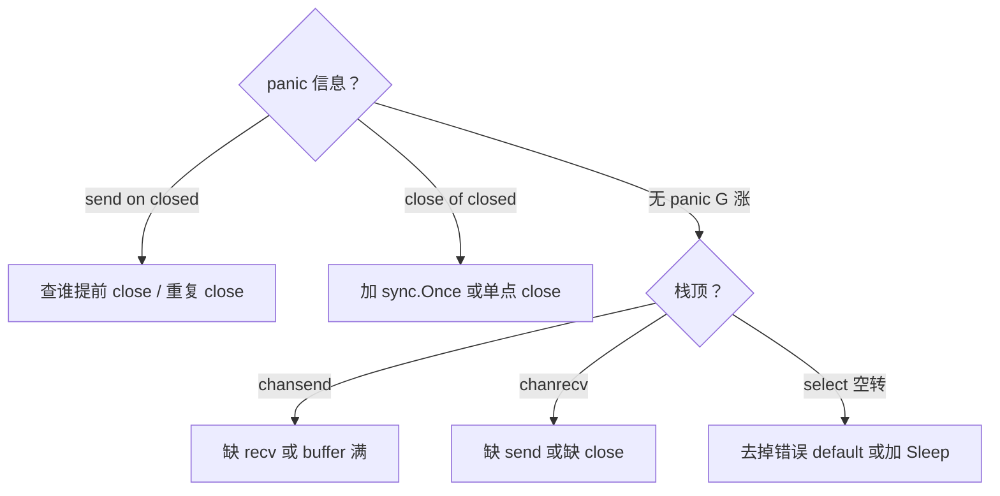

# 06 channel与select · 知识点

> 大家好，欢迎来到这次分享。开讲之前，先带大家回到一个很多值班同学都踩过的现场：
> 发布系统用 channel 传状态，有人 `close` 了还在 send 直接 panic；有人用无缓冲 channel「同步」却把吞吐量打到个位数；`select` 里 `default` 写错导致 CPU 空转，监控里 goroutine 不多但某一核 100%。
> 这一章讲完，你会知道当时那几个人各自错在哪——channel 的关闭权、缓冲深度和 select 怎么写，不能靠感觉。
> **本章回答**：一次 **channel 通信**从 `make` 到 `close` 的一生——send 怎么堵、recv 怎么等、`select` 怎么仲裁、关闭后各端什么行为。
> **不讲**：goroutine 调度与泄漏总论 → [05](../05-goroutine与调度模型/)；`Mutex` / `-race` → [07](../07-sync原子与竞态检测/)；`ctx` 取消 → [08](../08-context取消与超时传播/)；`errgroup` 编排 → [09](../09-errgroup与并发限流/)。这些都有专门的章节，本章只在用到时点到为止。

**标记**：🎯重点 · 🔥难点 · ⭐常考 · 🔧实操

**怎么听这场分享**：咱们先看第一节「一次 channel 通信的一生」主图，把 make → send/recv → close → drain 装进脑子；后面按出生、发送、接收、关闭、select、模式一站一站展开；作战节专门拆开头那个 close 后还 send、default 空转的现场。05 章特例：骨架不动，生产模板代码一字不改。每一节讲完都会提示对应练习题。

## 面试怎么考

| 标记 | 考点 |
|------|------|
| **核心** | 无缓冲 = 同步握手；有缓冲 = 异步到满；close 广播唤醒 |
| **必会** | 只 close 不 send；range 退出条件；nil channel 永久阻塞 |
| **常用** | `select` + `ctx.Done()`；fan-in / worker pool |
| **常考** | 向 closed channel 发送 panic；`v, ok := <-ch`；select 随机公平 |

**30 秒怎么说**：channel 是带类型的并发队列，语法只有 `ch <- v`、`<-ch`、`close(ch)`。无缓冲 channel 发送和接收必须**同时到场**才算一次交接；有缓冲在未满时 send 不阻塞。`close` 表示**再也没有新值**——读端 `range` 会 drain 完后退出，多读者都能收到零值+`ok=false`。`select` 多路复用，多 case 就绪时**伪随机**选一个。关闭 channel 是发送方的责任；向已关闭 channel 发送会 panic。用 channel 传数据、用 `ctx` 传取消，别混。


本节对应练习题目录先扫一眼。面试表装进脑子，进能力边界。

---

## 能力边界

| 工具 | 适合 | 不适合 |
|------|------|--------|
| **无缓冲 channel** | 同步点、信号量(1)、严格握手 | 高吞吐流水线 |
| **有缓冲 channel** | 削峰、固定深度队列 | 无界堆积（应用 cap） |
| **Mutex** | 保护共享内存、计数器 | 编排多阶段流水线 |
| **select** | 等多个事件之一、超时、非阻塞探测 | 替代 if-else 业务分支 |

channel 表达的是 **CSP「通过通信共享内存」**；不是万能队列——深度、关闭权、泄漏都要设计。


本节对应练习题 Q1。边界清了——看主线一张图。

---

## 一、一张图：一次 channel 通信的一生

> 🎯 **一句话**：`make` 出生 → send/recv 交接或排队 → `close` 宣告结束 → 读者 drain 后离场。



**读图**：从左跟一条消息——`make` 决定有没有仓库（buffer）；无缓冲时 send 和 recv 像面对面递东西，缺一就挂起；有缓冲时 send 先把货放进槽，recv 慢慢取，槽满 send 才等。`close` 不是「销毁」，是贴告示「不会再进货」——已在队列里的还能读完，`range` 自动退出。整条命结束在**没有读者也没有发送者阻塞**；若只 send 不 recv 或反过来，G 卡在②③（回 [05](../05-goroutine与调度模型/) 查泄漏）。


本节对应练习题 Q1、Q14。主线有了——先从 make / nil 出生。

---

## 二、出生：`make` 与 nil channel ⭐

> 🎯 **一句话**：`make(chan T)` 无缓冲；`make(chan T, n)` 有 n 个槽；**nil channel 读写永远阻塞**。

```go
ch1 := make(chan int)      // 无缓冲
ch2 := make(chan int, 100) // 缓冲 100
var ch3 chan int           // nil，不能直接用
```

| 状态 | send | recv | close |
|------|------|------|-------|
| nil | 阻塞 | 阻塞 | panic |
| open | 规则见下 | 规则见下 | 合法（一次） |
| closed | **panic** | 得零值, ok=false | panic |

> ⚠️ **别混**：未 `make` 的 nil channel 和已 `close` 的 channel——前者永远等，后者能读零值。

**禁用 channel**：`select` 里把某个 case 设为 nil channel，该路永不就绪——动态开关某条接收的惯用手法。

```go
var ch chan int // nil
select {
case <-ch:        // 永不执行
case <-ctx.Done():
    return
}
```

> 📝 **面试**：nil channel 有什么用？——在 `select` 里临时「拔掉」一路，比 bool flag 更干净。


口诀：**「nil 永远等，closed 能读零」**。练习题 Q4。出生清楚了，看发送。

---

## 三、发送：无缓冲 vs 有缓冲 ⭐🔥

> 🎯 **一句话**：无缓冲 send **等 recv 到场**才拷贝；有缓冲 send 在未满时**只写槽**不等人。

### 无缓冲：同步点

```go
ch := make(chan int)
go func() {
    ch <- 42 // ← 阻塞直到 main 执行 <-ch
}()
v := <-ch
```

一次成功通信 = **happens-before** 关系：send 完成先于 recv 收到（内存可见性基础，[07](../07-sync原子与竞态检测/) 会用到）。

> 💡 **打个比方**：无缓冲像当面交快递——你举着包裹（send 阻塞）直到对方伸手（recv）。

大家想想：为啥「改成无缓冲更同步」反而把吞吐打穿？很多人会答「同步就该慢一点」——**不完整**。无缓冲是**每一次交接都要对齐**，流水线没有仓库，产能被握手次数卡住。

### 有缓冲：异步到满

```go
ch := make(chan int, 2)
ch <- 1
ch <- 2
ch <- 3 // ← 第三次阻塞，直到有人 <-ch
```

`len(ch)` 当前元素数，`cap(ch)` 槽位数——仅调试参考，并发下随时变。

### 值语义

发送 **拷贝** 值进 channel（指针则拷贝指针地址）。大结构体考虑传 `*T` 或 pool，避免频繁拷贝。

> 🔍 **现场**（怀疑 send 堵死）：

```bash
# pprof goroutine 栈顶 runtime.chansend
curl -s localhost:6060/debug/pprof/goroutine?debug=2 | grep -A5 chansend
```


⭐ 面试必考：无缓冲=同步握手，有缓冲=满才堵。练习题 Q1。发送懂了，看接收。

---

## 四、接收：`<-ch`、`ok` 与 `range` ⭐

> 🎯 **一句话**：`<-ch` 阻塞到有事或 close；`v, ok := <-ch` 区分真零值与已关闭；`range` 自动 drain 到 close。

```go
v, ok := <-ch
if !ok {
    // channel 已关闭且 drained
}
```

```go
for v := range ch {
    process(v)
}
// close 且队列空后循环退出
```

> ⚠️ **别混**：从 closed channel 读 **不 panic**，得类型零值 + `ok=false`；**向 closed send 才 panic**。

### 只关闭、不发送

`close(ch)` 后所有阻塞的 recv 被唤醒，读到零值 `ok=false`。常用作 **广播「结束了」**——多个 worker `range` 同一 channel，close 一次全员退出。

**规则**：谁 send 谁 close（或专门协调者 close）；**不要** recv 方 close（除非协议约定且发送方已停）。


本节对应练习题 Q2、Q7。接收会了，看 close 事故。

---

## 五、关闭：`close` 的语义与事故 ⭐🔥

> 🎯 **一句话**：`close` = 不会再有 send；重复 close 或向 closed send → panic。

大家想想：为啥语言要让 send on closed **直接崩**，而不是静默丢掉？——防你以为对方还在收。读 closed 不 panic，是为了让 range 能 drain 干净。

```go
close(ch)   // 合法一次
close(ch)   // panic: close of closed channel
ch <- 1     // panic: send on closed channel（若已 close）
```

安全模式：

```go
// 发送方
defer close(ch)
for _, item := range items {
    ch <- item
}

// 或显式：生产结束 close，消费者 range
```

**sync.Once 关 channel**（防止重复 close）：

```go
var once sync.Once
once.Do(func() { close(ch) })
```

> 📝 **面试**：为什么向 closed channel 发送 panic？——防止静默丢数据；读端还能 drain 已有数据。

### 收束：关闭权清单

- 通常 **发送方 close**  
- 多生产者：用 `ctx` 取消 + 单独 `done` channel，或 merge 后单点 close  
- recv 方只 `range` 或 `ok` 判断，不 close 除非协议写明  
- 不要用 close 传「数据」——只传结束信号；数据用普通 send  


口诀：**「只 close 不 send；读 closed 安全，写 closed panic」**。练习题 Q2、Q3、Q8。关闭钉死，进 select。

---

## 六、select：多路仲裁 ⭐🔥

> 🎯 **一句话**：`select` 阻塞到**任一 case 就绪**；多个就绪时**伪随机**选一个；`default` 非阻塞。

🔥 大白话先拆：**select = 同时盯几扇门，哪扇先开进哪扇；两扇同时开就掷骰子**。很多人以为「写在上面的 case 优先」——这是 ⭐ 高频错答。

```go
select {
case v := <-ch1:
    handle(v)
case ch2 <- x:
    sent()
case <-time.After(3 * time.Second):
    timeout()
case <-ctx.Done():
    return ctx.Err()
}
```

### 公平性

多个 case 同时就绪，Go **随机**选一个，避免饥饿。不要依赖固定优先级——要优先级用嵌套 select 或单独 goroutine。

### default：忙等陷阱

```go
for {
    select {
    case v := <-ch:
        handle(v)
    default:
        // 无数据时立即走这里 → CPU 空转
    }
}
```

应用 `default` 做 **非阻塞试探**；循环里应 `time.Sleep` 或阻塞 select。

### 空 select

```go
select {} // 永久阻塞，占一个 G——偶尔做 hold main
```

### 与 ctx 组合 🔧

```go
select {
case <-ctx.Done():
    return ctx.Err()
case job, ok := <-jobs:
    if !ok {
        return nil
    }
    process(job)
}
```

取消和收活同一层仲裁——[08](../08-context取消与超时传播/) 详讲 ctx 传播。

> 📝 **面试**：`select` 和 `switch`？——`select` 专用于 channel/`default`；`switch` 是值分支。


⭐ 高频错答：select 多 case 就绪不是按书写顺序。练习题 Q5、Q6、Q14。仲裁会了，看流水线模式。

---

## 七、模式：fan-in、fan-out、pipeline ⭐

> 🎯 **一句话**：fan-out 多 worker 读同一 jobs；fan-in 多路 merge 到一根 out；pipeline 阶段用 channel 串起来。

### Worker pool

```go
jobs := make(chan Job, 100)
var wg sync.WaitGroup
for i := 0; i < 8; i++ {
    wg.Add(1)
    go func() {
        defer wg.Done()
        for j := range jobs {
            handle(j)
        }
    }()
}
// 生产者
for _, j := range list {
    jobs <- j
}
close(jobs)
wg.Wait()
```

固定 8 个 G 消费，jobs 缓冲削峰——比每条 `go handle` 可控（[05](../05-goroutine与调度模型/)）。

### fan-in（merge）

```go
func merge(cs ...<-chan int) <-chan int {
    out := make(chan int)
    var wg sync.WaitGroup
    for _, c := range cs {
        wg.Add(1)
        go func(ch <-chan int) {
            defer wg.Done()
            for v := range ch {
                out <- v
            }
        }(c)
    }
    go func() {
        wg.Wait()
        close(out)
    }()
    return out
}
```

注意 `out` 无缓冲时 merge goroutine 可能互相堵在 send——加缓冲或单独 writer。

### 单向 channel 类型

```go
func producer(out chan<- int) { ... }
func consumer(in <-chan int) { ... }
```

编译期约束只读/只写，API 自文档化。


本节对应练习题 Q9、Q12。模式有了，看方向与容量。

---

## 八、方向与容量设计 🔧

> 🎯 **一句话**：缓冲深度 = 你愿意积压多少；0 = 强同步；过大 = 掩盖背压、占内存。

| 场景 | 建议 |
|------|------|
| 严格同步 | 无缓冲 |
| 突发流量 | 小缓冲 + 监控 `len` |
| 背压 | 无缓冲或满时阻塞上游 |
| 广播退出 | `close` + `range` |

**不要** `make(chan T, 999999)` 当无限队列——OOM 在等你。


本节对应练习题 Q10、Q11。设计三问记住，进作战。

---

## 九、作战：channel 相关故障定责



| 现象 | 先做 | 别做 |
|------|------|------|
| 吞吐骤降 | 看无缓冲握手是否过多 | 盲目加大 buffer |
| CPU 高 G 不多 | 搜 `select`+`default` 循环 | 加 goroutine |
| 偶发 panic | 搜 `close` 与 send 竞态 | recover 吞 panic |

**60 秒剧本** 🔧：

- **0–10s**：拿 panic 栈或 goroutine profile  
- **10–30s**：定位 `chansend`/`chanrecv` 文件行  
- **30–45s**：画生产者/消费者/谁 close  
- **45–60s**：补 `ctx`、改缓冲、或改 Mutex  


本节对应练习题 Q8、Q12。定责完，进阶背压。

---

## 十、进阶：容量、背压与关闭协议 ⭐

> 🎯 **一句话**：channel 设计三问——**谁生产、谁消费、谁 close**；深度是背压，不是越大越好。

### 关闭协议模板

```go
type Result struct {
    Val int
    Err error
}

func worker(ctx context.Context, in <-chan Job, out chan<- Result) {
    defer close(out) // worker 负责 close out（唯一发送方）
    for {
        select {
        case <-ctx.Done():
            return
        case job, ok := <-in:
            if !ok {
                return
            }
            out <- Result{Val: handle(job)}
        }
    }
}
```

协调者：`close(in)` 等 worker 退出，**不要** worker 去 close `in`（发送方 close `in`）。

### 背压与监控

```go
if len(jobs) > cap(jobs)*8/10 {
    metrics.ChannelSaturation.Inc()
}
```

`len` 并发下仅近似；但能发现「消费者跟不上」趋势。真正背压靠 **阻塞 send** 让上游慢下来，而不是无限 buffer。

### 定时器 + channel

```go
select {
case <-ctx.Done():
    return
case <-time.After(5 * time.Second):
    return errors.New("timeout")
case v := <-ch:
    use(v)
}
```

`time.After` 在紧循环里会堆积 timer——长寿命用 `time.NewTimer` 并 `Stop` 重用（[08](../08-context取消与超时传播/) 用 ctx 超时更统一）。

> 📝 **面试**：「用 channel 做队列」要说出 **close 权** 和 **缓冲深度**，否则等于没设计。


本节对应练习题 Q9、Q10。背压讲完，对比 Mutex。

---

## 十一、对比：channel vs Mutex 何时换 ⭐

| 需求 | channel | Mutex |
|------|---------|-------|
| 任务分发 | ✅ worker pool | ❌ |
| 保护 map/struct | ❌ | ✅ |
| 广播退出 | ✅ close + range | ✅ `sync.Cond` 少见 |
| 精确计数器 | 过重 | ✅ atomic 更好 |
| API 边界取消 | 配合 ctx | 配合 ctx |

**不要**用 channel 模拟 mutex（`ch := make(chan struct{}, 1); ch<-struct{}{}` 可以但可读性差，除非刻意限 1 并发）。

### 信号 channel 惯用法

```go
done := make(chan struct{})
go func() {
    work()
    close(done)
}()
select {
case <-done:
case <-time.After(time.Minute):
    log.Fatal("stuck")
}
```

`struct{}` 零成本，只传「完成」信号。


本节对应练习题 Q13。选型清了，踩坑清单扫一眼。

---

## 十二、踩坑清单

| 现象 | 原因 | 修法 |
|------|------|------|
| send on closed | close 后仍 send | Once close / ctx 停 worker |
| 死锁 single G | buffer 满再 send 无 recv | 加 goroutine 或改缓冲 |
| range 永不退出 | 未 close | 发送方 close |
| CPU 100% | select+default 空转 | 阻塞 select 或 sleep |
| 顺序乱 | 多 goroutine 写同一 ch | fan-in 单 writer 或加锁 |
| nil channel 被误用 | var ch 后未 make 直接 send/recv | 初始化 make 或显式 nil 用法 |
| merge goroutine 泄漏 | wg.Wait 后 close out 但 out 无 reader | 加缓冲或确保下游持续消费 |
| timer 泄漏 | 紧循环 `time.After` 不 Stop | 长寿命用 `time.NewTimer` 手动 Stop |

### time.Tick vs time.NewTicker

`time.Tick` 返回一个只读 channel，运行时**无法停止**——仅在短命程序或测试里用。长寿命服务里用 `time.NewTicker`，退出时 `Stop()` 释放 timer 资源。

```go
// ❌ 长寿命场景：无法 Stop，timer 堆积
for {
    select {
    case <-time.Tick(time.Second): // 每次循环都创建新 timer，不回收
    case <-ctx.Done():
        return
    }
}

// ✅ 正确：复用 ticker，退出 Stop
ticker := time.NewTicker(time.Second)
defer ticker.Stop()
for {
    select {
    case <-ticker.C:
        doWork()
    case <-ctx.Done():
        return
    }
}
```

> ⚠️ **别混**：`time.Tick` 不是「语法糖」——它内部创建的 timer **不可回收**。紧循环里反复调用 `time.After` 同理，每次 `select` 新建一个 timer，短循环里很快堆满 runtime timer 堆。

### 收束：channel 的设计三问

写任何 channel 流水线前，先回答这三问，写在注释里：

- **谁生产？** —— send 的 goroutine 数量、生命周期
- **谁消费？** —— recv 的 goroutine 数量、退出条件
- **谁 close？** —— 唯一 close 方，用 `sync.Once` 或协调者

```go
// 设计三问（写在 channel 声明上方）
// 1. 生产者：8 个 worker，ctx 取消时退出
// 2. 消费者：主 goroutine range，close 后退出
// 3. close：WaitGroup 等所有 worker 停 → 单点 close(out)
out := make(chan Result, 64)
```


本节对应练习题 Q6、Q8。踩坑钉死，收口。

---

**回到开头那个现场**：close 后还 send、无缓冲当「同步银弹」、`select`+`default` 空转。正确剧本是：发送方单点 close → 缓冲深度按背压设 → select 阻塞等或带 ctx，别裸 default 转 CPU。现在再看群里那几句，你知道该怎么拦住他们了。

## 十三、收口

### 命令速查 🔧

```bash
# goroutine 栈里 chan 相关
curl -s localhost:6060/debug/pprof/goroutine?debug=2 | grep -E 'chan|select'
```

### 面试锚点

遮住右列自问自答，卡壳的行回去重读对应小节——能讲出来才算会：

| 问 | 30 秒答 |
|----|---------|
| 无缓冲 vs 有缓冲 | 无缓冲必须收发同时；有缓冲满才堵 send |
| close 后读写的行为 | 读零值+ok=false；send panic |
| 谁 close | 发送方；不要 recv close（除非约定） |
| nil channel | 读写永久阻塞；select 里可禁用一路 |
| select 多就绪 | 伪随机选一个 |

### 易错一句话

- 错：close 用来通知「一条消息」→ 对：close 表结束，消息用 send  
- 错：channel 线程安全所以可随便关 → 对：close 竞态仍 panic  
- 错：`range` 不用 close 也能停 → 对：不 close 永远阻塞在 range  
- 错：buffer 越大越快 → 对：过大掩盖背压、增延迟  
- 错：用 channel 做共享 map → 对：数据进 channel 拷贝，共享状态用 Mutex  

### 数字墙

```text
无缓冲 cap=0 · len≤cap · close 只一次 · select 多就绪随机
```


本节对应练习题 Q1～Q14。现在回开头那个现场。

---

## 合上书

- [ ] **默画** channel 通信一生：make → send/recv → close → drain  
- [ ] 口述无缓冲握手与 happens-before  
- [ ] 说明 closed channel 上 send vs recv 的差异  
- [ ] 写 worker pool：`jobs` + `close` + `WaitGroup`  
- [ ] 解释 nil channel 在 `select` 里的用法  
- [ ] 指出 `select`+`default` 忙等怎么改  
- [ ] 说明 fan-in merge 时为何要缓冲或单 writer  
- [ ] 谁该 close、重复 close 会怎样  
- [ ] `v, ok := <-ch` 何时必须用  
- [ ] 接到 chansend 泄漏栈，排查三步  
