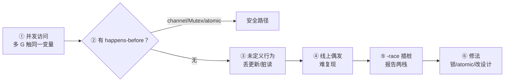
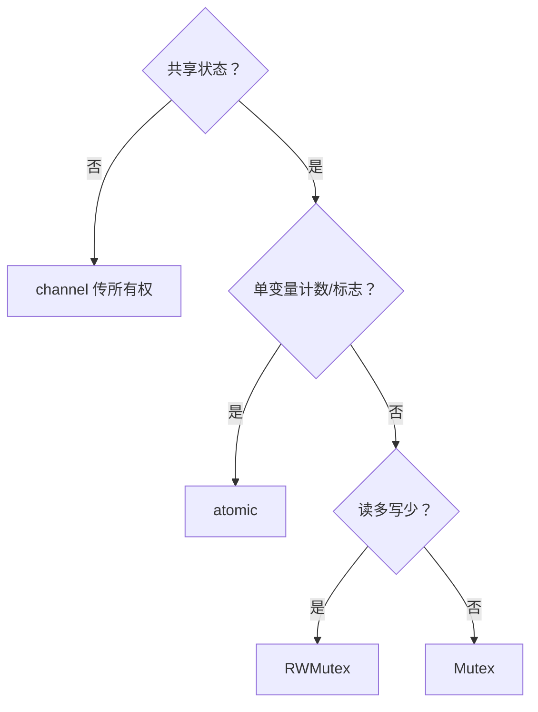
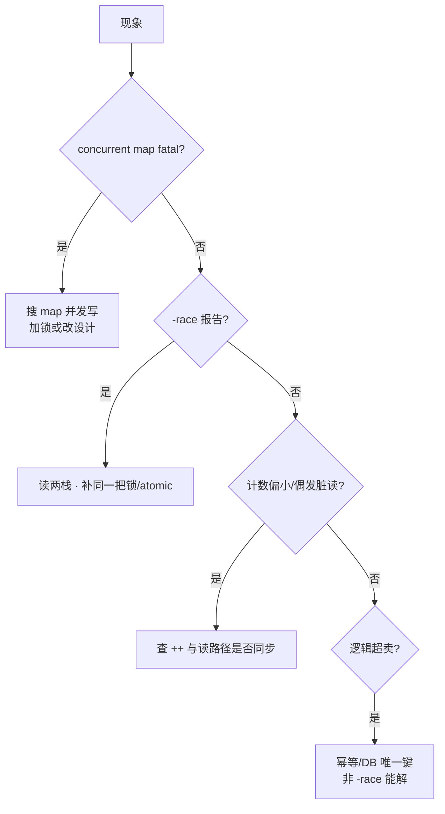

# 07｜sync原子与竞态检测 · SRE 开发能力

> 压测绿、一上 `-race` CI 全红；领奖偶发双发，两 G 同时读到 `count==0`；有人 Mutex 只包写、读路径裸奔，半夜 `fatal error: concurrent map writes`。群里喊「偶发逻辑 bug」「先关掉 race」「recover 住 map panic」。
> **本章回答**：一次 **data race** 从并发读写、到无 happens-before、到 `-race` 抓栈——`Mutex`/`RWMutex`、`atomic`、`Once`/`Pool` 各守哪一段。
> **不讲**：goroutine 调度 → [05](../05-goroutine与调度模型/)；channel 同步 → [06](../06-channel与select/)；`ctx` 超时 → [08](../08-context取消与超时传播/)。

**标记**：🎯重点 · 🔥难点 · ⭐常考 · 🔧实操

---

## 面试怎么考

| 标记 | 考点 |
|------|------|
| **核心** | data race 四要素；happens-before；Mutex 不可重入 |
| **必会** | `-race` CI 开法；读写同锁；`RWMutex` 读多写少 |
| **常用** | `atomic` 计数；`sync.Once` 初始化；`Pool` 减分配 |
| **常考** | map 并发写 fatal；atomic vs Mutex；check-then-act |

> 📝 **面试（30 秒）**：**data race** = 两 G **并发**访问同一内存，**至少一写**，且无 happens-before——结果未定义。修法三路：**Mutex 护共享结构**、**channel 交所有权**、**atomic 改单字**。`go test -race` 插桩，约 **5–10×** 慢/内存，只 CI 与复现开。Mutex **不可重入**；map 内置非线程安全，并发写直接 fatal。

---

## 能力边界

| 机制 | 保护什么 | 代价 | 典型场景 |
|------|----------|------|----------|
| `Mutex` | 任意临界区 | 阻塞、死锁风险 | map、复合状态 |
| `RWMutex` | 读多写少 | 写仍独占 | 配置缓存 |
| `atomic` | 单个整型/指针 | 无锁快 | 计数、标志位 |
| `channel` | 所有权转移 | 可能阻塞 | 流水线、任务分发 |
| `-race` | 发现 race | 运行时开销 | CI、本地复现 |

- 🔑 **各管一段**
  - Mutex / RWMutex：护**整块不变量**——读路径也要进同一把锁
  - atomic：单变量可见性 + 原子读写——**不**替代复合事务
  - channel：传所有权（见 [06](../06-channel与select/)）——少共享就少 race
  - `-race`：抓 data race——**不**抓死锁、泄漏、逻辑超卖

> ⚠️ **别混**：能不用共享内存就不用；必须共享则**一种同步手段守全部访问路径**——读也要锁。

---

## 语言最小集

| 零件 | 示例 | 含义 |
|------|------|------|
| Mutex | `mu.Lock(); defer mu.Unlock()` | 互斥临界区 |
| RWMutex | `RLock` / `Lock` | 多读或一写 |
| atomic | `atomic.Int64{}.Add(1)` | 单变量原子 |
| Once | `once.Do(init)` | 只跑一次 |
| Pool | `pool.Get()` / `Put` | 临时对象复用 |
| WaitGroup | `Add` / `Done` / `Wait` | 等一组结束 |
| Cond | `Wait` / `Signal` | 等条件（少用） |
| `-race` | `go test -race ./...` | 插桩检 race |

```go
var mu sync.Mutex
var n int
mu.Lock()
n++
mu.Unlock()
```

零件认完，上主图。

---

## 一、一张图：竞态从发生到被 -race 抓住的一生

> 🎯 **一句话**：并发读写无同步 → 内存可见性乱序 → 业务诡异 → `-race` 在访问点插桩报两栈。



- 📖 **读图**
  - 🛤️ 主线：① 两 worker 同触一址 → ② 有无 hb → 无则 ③ UB → ④ 压测可能绿 → ⑤ CI `-race` 出两栈 → ⑥ 按栈补同步
  - 🚪 分叉在②：Mutex/`Unlock→Lock`、channel 交接、atomic 同变量，都能建 hb；缺了就进 UB（Q1、Q14）

本节对应练习题 Q1、Q14。主线有了——先钉 data race 定义。

---

## 二、诞生：什么是 data race ⭐🔥

> 🎯 **一句话**：**并发 + 同一地址 + 至少一方写 + 无同步** = data race；与 **race condition**（逻辑竞态）不是一回事。

```go
var count int

func add() {
    count++ // 读-改-写三步非原子
}

func main() {
    go add()
    go add()
}
```

`count++` 编译后是多条指令，两 G 交错 → 可能只涨 1。

#### ❓ 为什么压测绿、`-race` 却红？

- ❌ 很多人答「偶发逻辑 bug」——**错了**：data race 是**语言内存模型非法**，不是「偶尔错一点」
- ✅ `-race` 抓的是**无 hb 的并发写/读写**；压测路径未必撞上冲突交错
- 🎭 **race condition**：库存先查后改超卖——逻辑时序错，`-race` **不一定**抓得到，要幂等/DB 唯一键
- 🔒 **死锁**：都在等锁——不是 data race

> ⚠️ **别混**：
> - **data race**：内存模型，`-race` 能抓
> - **race condition**：业务时序，靠设计
> - **死锁**：互等，看 pprof 卡 `Lock`

### 🔗 happens-before 从哪来

- channel：无缓冲 send 完成先于 recv 完成
- `sync.Mutex`：`Unlock` 先于下一次 `Lock`
- `sync/atomic`：原子写先于后续原子读（同一变量）
- `sync.Once`：`Do` 内先于 `Do` 返回后
- goroutine 创建：`go` 前的写先于新 G 开始

> 📝 **面试**：「线程安全」在 Go 里常指 **无 data race** + 逻辑正确；`map` 并发写连「安全」都谈不上，直接 fatal。⭐（Q1、Q2）

口诀：**「data race 是内存模型；race condition 是业务时序」**。定义清了，看 Mutex。

---

## 三、Mutex：互斥锁的一生 ⭐

> 🎯 **一句话**：`Lock` 进临界区，`Unlock` 出；**同一把锁**护住**所有**读写路径。

```go
var (
    mu    sync.Mutex
    count int
)

func add() {
    mu.Lock()
    count++
    mu.Unlock()
}
```

### 🔁 不可重入 🔥

```go
mu.Lock()
mu.Lock() // 死锁：同 G 阻塞在自己身上
```

#### ❓ 为什么 Go 的 Mutex 不可重入？

- 🔥 **同 G 二次 `Lock`** = 等自己 Unlock → 永久堵死
- ✅ Go **没有**递归锁；拆函数就抽「已持锁」的内部函数（`func (x *T) addLocked()`）
- ⚠️ 别从 Java/C++ 惯性带「可重入锁」

### 🧷 defer 解锁

```go
mu.Lock()
defer mu.Unlock()
// 早 return 也释放，防忘 Unlock
```

### 🐢 别在持锁时做慢 IO

```go
mu.Lock()
data := loadFromDB() // ← 持锁调 DB，全体排队
mu.Unlock()
```

- 🔑 锁只护 **内存状态**；IO 在锁外做，结果再短时写回
- 🔍 **现场**（死锁栈）：

```bash
curl -s localhost:6060/debug/pprof/goroutine?debug=2 | grep -A3 Mutex
# ← 多个 G 卡在 Lock，互等顺序反了 / 或同 G 可重入
```

> 📝 **面试**：同一把锁护住所有读写；只锁写不锁读 = 仍可能 race。⭐（Q3、Q4、Q13）

Mutex 会了，看 RWMutex。

---

## 四、RWMutex：读多写少 ⭐

> 🎯 **一句话**：**多个读** 或 **一个写**；写锁独占，读锁共享。

```go
var (
    rw  sync.RWMutex
    cfg Config
)

func Get() Config {
    rw.RLock()
    defer rw.RUnlock()
    return cfg // ← 返回拷贝，别返回内部指针引用的可变对象
}

func Set(c Config) {
    rw.Lock()
    defer rw.Unlock()
    cfg = c
}
```

#### ❓ 为什么 `RLock` 期间不能升级成 `Lock`？

- ❌ 持读锁再 `Lock` → 等写锁；写锁又等所有读锁放完 → **自己跟自己死锁**
- ✅ 要「升级」：先 `RUnlock`，再 `Lock`（中间可能被别人改——用 copy-on-write / 整体替换更稳）
- 📊 读多写少时比 `Mutex` 省竞争；**写频繁**则普通 `Mutex` 往往更轻（RWMutex 更重）

> ⚠️ **别混**：`Get` 返回内部 `*map` / slice 引用 = 锁外仍可变 → 等于没锁。返回值拷贝或 immutable 快照。

本节对应练习题 Q9。读写锁懂了，看 atomic。

---

## 五、atomic：无锁改一个字 ⭐

> 🎯 **一句话**：`sync/atomic` 保证 **单个变量** 读改写一体，适合计数、标志、指针 publish。

```go
import "sync/atomic"

var n int64

func inc() {
    atomic.AddInt64(&n, 1)
}

func load() int64 {
    return atomic.LoadInt64(&n)
}
```

Go 1.19+ 推荐 **typed atomic**：

```go
var counter atomic.Int64
counter.Add(1)
v := counter.Load()
```

### 🎯 适用边界

- ✅ **适合**：全局 QPS 计数、`closed` 标志、指针 publish（一次性替换配置）
- ❌ **不适合**：多字段结构体一致性、`map` 并发、读-改-写依赖旧值的业务

#### ❓ 为什么 `if count < limit { count++ }` 不能只靠 `Add`？

- ❌ `Load` 再 `Add` 中间别人插队 → **check-then-act** 不是原子整体
- ✅ 整段用 Mutex，或 **CAS 循环**：

```go
for {
    old := atomic.LoadInt64(&n)
    if old >= limit {
        return false
    }
    if atomic.CompareAndSwapInt64(&n, old, old+1) {
        return true
    }
}
```

> 📝 **面试**：atomic 解决单变量 **可见性+原子性**；复合不变量仍要锁。⭐（Q5、Q11）

atomic 边界清了，看 Once/Pool。

---

## 六、sync.Once 与 sync.Pool

> 🎯 **一句话**：`Once` 保证函数 **只执行一次**（懒初始化）；`Pool` 是 **临时对象复用**，减轻 GC，不是缓存。

### 🧷 sync.Once

```go
var (
    once   sync.Once
    client *http.Client
)

func getClient() *http.Client {
    once.Do(func() {
        client = &http.Client{Timeout: 10 * time.Second}
    })
    return client
}
```

- ✅ `Do` 并发安全；内部 **panic 也算执行过**，不会重试
- ⚠️ Open 失败要处理返回的 `err`，或允许进程失败重启——Once 不会再跑一遍

### ♻️ sync.Pool

```go
var bufPool = sync.Pool{
    New: func() any { return make([]byte, 0, 4096) },
}

b := bufPool.Get().([]byte)
defer bufPool.Put(b[:0])
```

- 🔑 对象可能随时被 GC 清掉——**不能**当长期存储
- ✅ 适合 `bytes.Buffer`、解码临时 slice

> ⚠️ **别混**：`WaitGroup` 不是锁——`Add`/`Done`/`Wait` 配对等结束，**不传错误、不取消**；`Cond` 少用，必须 `for !ok { Wait() }` 循环检查。优先 channel 等事件。

本节对应练习题 Q10。Once 懂了，map 并发必炸。

---

## 七、map 与并发：必炸 ⭐🔥

> 🎯 **一句话**：**任何并发读写 map**（含一个写）→ 未定义行为，运行时可能 `fatal error: concurrent map read and map write`。

```go
m := make(map[string]int)
go func() { m["a"] = 1 }()
go func() { _ = m["a"] }() // 读也算
```

#### ❓ 为什么是 fatal，不是 `-race` 报告？

- 🔥 内置 map **故意**在检测到并发写时直接 crash——比静默腐数据更安全
- ✅ `-race` 也能报，但线上没开 race 时常见的是 **fatal** 把进程干掉
- 🛠️ 修法四选一：
  - `Mutex` / `RWMutex` 包 map
  - `sync.Map`（读多、key 稳定、写少的 cache 型）
  - **不共享**：每 G 本地 map，结果 channel 合并
  - 分片 map（进阶；生产多数场景 Mutex 一层更清晰）

```go
type SafeMap struct {
    mu sync.RWMutex
    m  map[string]int
}
```

> 📝 **面试**：`sync.Map` 不是万能线程安全 map；API 别扭，适合 cache 型读多写少。⭐（Q6、Q12）

口诀：**「map 并发写 = fatal，不是普通业务 err」**。map 钉死，看 `-race`。

---

## 八、-race：从插桩到报告 ⭐🔧

> 🎯 **一句话**：编译器插桩记录每次内存访问；发现冲突打印 **两个栈** 和变量名。

```bash
go test -race ./...
go build -race -o app.race .
./app.race
```

### 📡 特性

- **开销**：CPU/内存约 **5–10×**——仅 CI、压测复现；**生产镜像禁止** `-race` 链接
- **覆盖**：抓 data race，**不抓** 死锁、泄漏、逻辑超卖
- **要求**：必须实际跑到冲突路径才报——顺序单测可能绿

```text
WARNING: DATA RACE
Write at 0x00c0000b4030 by goroutine 7:
  main.add()
      /tmp/race.go:10 +0x38

Previous read at 0x00c0000b4030 by goroutine 8:
  main.main.func1()
      /tmp/race.go:15 +0x44
```

- 📖 **读报告**：变量地址/名 → 两栈谁写谁读 → 缺 Mutex 还是该用 channel 转移所有权

### 🧪 CI 工作流 🔧

```makefile
test:
	go test -race -count=1 -timeout 10m ./...

race-build:
	go build -race -o bin/app.race ./cmd/...
```

```yaml
# 伪示例
- go test -race -count=1 ./...
```

- PR 必过 `-race`；压测环境可夜间 `race-build` 复现
- 并发单测要 **真正并行**（`t.Parallel()`）才容易触发

#### ❓ 为什么 `-race` 通过仍可能线上有 race？

- ❌ 通过 ≠ 无 bug——**没跑到的路径**仍可能 race
- ✅ 覆盖关键并发路径；偶发用 stress + `-race` 复现
- ⚠️ 别把「本地偶尔开一下」当闸门——CI **必开**

> 📝 **面试**：读报告先找变量与两栈，再定缺锁还是改设计。⭐（Q7、Q8）

检测会了，看选型。

---

## 九、选型：锁、atomic、channel 怎么选 ⭐

> 🎯 **一句话**：先问「要不要共享」；共享则「单字还是结构」；结构再问「读多写少吗」。



- 📖 **读图**
  - 🚪 第一问「共享？」——能 channel 交所有权就别共享内存（[06](../06-channel与select/)）
  - 🛤️ 共享后：单字 → atomic；复合 → 读多写少 RWMutex，否则 Mutex

- 🗺️ **场景速配**：任务队列 → channel；in-flight 计数 → `atomic.Int64`；配置热更新 → `RWMutex` + 整体替换；缓存 map → Mutex 或 `sync.Map`；懒单例 → `sync.Once`

#### ❓ 为什么别 Mutex 和 atomic 混着护同一不变量？

- ❌ 读者看不清「哪条路径有锁」——容易漏路径 → race
- ✅ **一种手段守全部路径**；混用必须有清晰发布协议（如指针 atomic publish + 不可变快照）

本节对应练习题 Q5。选型清了——可见性真难点，再作战。

---

## 十、内存模型与可见性 🔥

> 🎯 **一句话**：没有 happens-before 的写，**别的 G 可能永远看不到**——不是「稍晚看到」，是语言允许任意重排。

> 💡 **打个比方**：你在白板上写完答案再举手（Store）；对面只盯着手是否举起（Load）。没举手约定时，对面可以永远当没看见答案——CPU/编译器合法重排。

### 🕳️ 未同步的 flag

```go
var ready bool
var data int

go func() {
    data = 42
    ready = true
}()

for !ready {
}
fmt.Println(data) // 可能打印 0
```

### ✅ 修法：atomic 建立可见性

```go
var ready atomic.Bool
var data int

go func() {
    data = 42
    ready.Store(true) // 原子写，建立 happens-before
}()

for !ready.Load() {
}
fmt.Println(data) // 一定打印 42
```

#### ❓ 为什么只给 `ready` 加 atomic，`data` 就一定可见？

- 🔗 `Store(true)` **happens-before** 后续成功的 `Load()==true`；`data=42` 不能被重排到 `Store` 之后
- ⚠️ 若 `data` 仍被**第三路**无同步改写，另当别论——关键是 Store/Load 对建了 hb 链
- 📨 无缓冲 `ch <- v` 完成 **hb** `<-ch` 收到 v——channel 传数据自带同步（所有权完全转移时不必再锁）

> 📝 **面试**：「volatile 呢？」——Go **没有** volatile；用 atomic 或 sync。⭐（Q2）

可见性讲完，作战定责。

---

## 十一、作战：并发诡异 bug 定责 🔧

> 🎯 **一句话**：先分 data race / map fatal / 业务竞态，再按两栈或 panic 点补同步——别 recover 继续写。



- 📖 **读图**：分叉先认「fatal vs race 报告 vs 逻辑」——开篇三种现场各走一条支路

| 现象 | 先做 | 别做 |
|------|------|------|
| `concurrent map` panic | 搜 map 并发写，加锁或改设计 | recover 继续写 |
| 计数偏小 | `-race` + 查 `++` 是否原子 | 以为 int 天然原子 |
| 偶发脏读 | 查是否缺读锁 | 仅加写锁 |
| CI race 红 | 按两栈修同步 | `-race` 只在本地偶发开 |

**60 秒剧本** 🔧：

- **0–10s**：保存 panic / race 报告全文
- **10–30s**：定位变量与两个 goroutine 栈顶
- **30–45s**：画访问路径，标缺 Lock 的读
- **45–60s**：补 Mutex 或改 channel 所有权

本节对应练习题 Q13、Q14。定责完——生产模板（代码一字不改）。

---

**回到开头那个现场**：`-race` CI 全红、领奖超发、`concurrent map writes`。正确剧本：先分清 data race vs 业务竞态 → 读写路径同一把锁或 atomic → map 用锁/`sync.Map` → CI 必开 `-race`。

## 生产模板：线程安全计数与缓存 🔧

### 指标计数（推荐 atomic）

```go
type Metrics struct {
    inflight atomic.Int64
    total    atomic.Uint64
}

func (m *Metrics) Begin() { m.inflight.Add(1) }
func (m *Metrics) End()   { m.inflight.Add(-1) }
```

### 配置快照（RWMutex + 整体替换）

```go
type ConfigStore struct {
    mu   sync.RWMutex
    snap Config
}

func (c *ConfigStore) Load() Config {
    c.mu.RLock()
    defer c.mu.RUnlock()
    return c.snap // 值拷贝，调用方只读
}

func (c *ConfigStore) Store(cfg Config) {
    c.mu.Lock()
    c.snap = cfg
    c.mu.Unlock()
}
```

**读路径零分配**靠 immutable 替换：更新时换新 struct，读者持旧快照。

### 单例 DB（sync.Once）

```go
var (
    dbOnce sync.Once
    db     *sql.DB
    dbErr  error
)

func DB() (*sql.DB, error) {
    dbOnce.Do(func() {
        db, dbErr = sql.Open("mysql", dsn)
    })
    return db, dbErr
}
```

`Once` 里 Open 失败不会重试——要处理 `dbErr` 或允许进程失败重启。

本节对应练习题 Q3、Q6、Q10。模板拿走，扫踩坑。

---

## 踩坑清单

| 现象 | 原因 | 修法 |
|------|------|------|
| CI `-race` 红、压测绿 | 冲突路径未稳定撞上 | CI 必开；按两栈补同步 |
| `concurrent map writes` | 读写缺同一把锁 | Mutex/`sync.Map`/不共享 |
| 同 G 二次 Lock 卡死 | Mutex 不可重入 | 抽 `xxxLocked` |
| 计数偶发偏小 | `++` 非原子 / 缺锁 | atomic 或 Mutex |
| check-then-act 超限 | Load 与 Add 非整体 | CAS 循环或锁 |
| `-race` 绿仍线上怪 | 路径未覆盖 / 逻辑竞态 | 扩测；幂等键 |
| Pool 当缓存用 | 对象被 GC 清 | 真缓存另建 |
| 持锁调 RPC | 临界区过长 | IO 锁外 |

---

## 必会 · 常考

| 说法 | 对？ | 一句 |
|------|------|------|
| 两 G 只读同一 int 算 data race | ❌ | 至少一方写才算 |
| Mutex 可重入 | ❌ | 同 G 二次 Lock 死锁 |
| 只锁写就够 | ❌ | 读也要同一路径 |
| atomic 能护整结构 | ❌ | 单变量；复合用锁 |
| map 并发写报 error | ❌ | 可能直接 fatal |
| `-race` 过 = 无 bug | ❌ | 覆盖有限；不抓逻辑竞态 |
| `sync.Map` 万能 | ❌ | 多数场景 Mutex 更清晰 |
| data race = race condition | ❌ | 前者内存模型，后者业务 |

---

## 收口

### 命令速查 🔧

```bash
go test -race ./pkg/...
go build -race -o /tmp/app .
GORACE="log_path=/tmp/stress" ./app  # 可选日志
curl -s localhost:6060/debug/pprof/goroutine?debug=2 | grep -A3 Mutex
```

### 面试锚点

遮住右列自问自答，卡壳的行回去重读对应小节——能讲出来才算会：

| 问 | 30 秒答 |
|----|---------|
| data race 定义 | 并发访问同一内存，至少一写，无 happens-before |
| Mutex 可重入吗 | 不可，同 G 二次 Lock 死锁 |
| atomic vs Mutex | 单变量原子操作用 atomic；复合结构用 Mutex |
| map 并发 | 禁止；用锁或 sync.Map 或 channel |
| -race 代价 | 5–10× 慢，CI 开，生产二进制别开 |

### 易错一句话对照

- 错：只锁写不锁读 → 对：所有访问同一路径
- 错：atomic 包整个事务 → 对：check-then-act 仍要锁或 CAS
- 错：`-race` 过了就上线 → 对：覆盖路径有限
- 错：`sync.Map` 取代所有 map → 对：多数场景 Mutex 更清晰
- 错：data race = race condition → 对：前者内存模型，后者业务时序
- 错：RLock 升级 Lock → 对：先放读锁再拿写锁（或整体替换）

### 数字墙

```text
-race 开销约 5–10× CPU/内存 · Mutex 不可重入 · map 并发写 fatal
```

本节对应练习题 Q1～Q14。现在回开头那个现场。

---

## 合上书

- [ ] **默画** 竞态一生：并发访问 → 无 hb → UB → `-race` 抓 → 修
- [ ] 口述 data race 四要素；区分 race condition
- [ ] 说明 Mutex 不可重入及死锁场景
- [ ] 何时 `RWMutex` 优于 `Mutex`；为何不能 RLock 升级
- [ ] `atomic` 适用与不适用的例子各一；口述 CAS 限流
- [ ] map 并发为什么 fatal，三种修法
- [ ] 读一份 `-race` 报告找变量与两栈
- [ ] 说明 `sync.Once` 与 `sync.Pool` 用途边界
- [ ] 选型：计数器、配置缓存、任务队列各用什么
- [ ] 口述可见性：为何 `atomic.Bool` 能带走 `data` 的可见性
