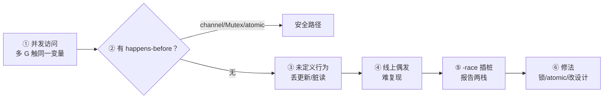
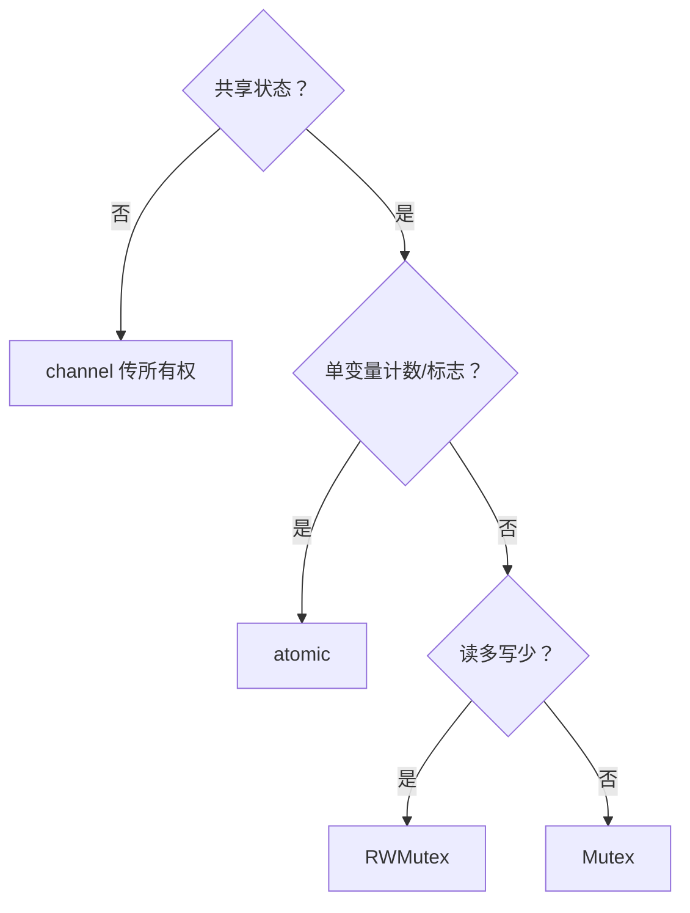

# 07 sync原子与竞态检测 · 知识点

> 大家好，欢迎来到这次分享。开讲之前，先带大家回到一个很多值班同学都踩过的现场：
> 压测通过，一上 `-race` CI 全红；线上偶发「同一用户领两次奖」，日志里两个 goroutine 同时读到 `count==0`；有人把 `map` 包在 `Mutex` 外却忘了读路径也加锁，半夜 `fatal error: concurrent map writes`。
> 这一章讲完，你会知道当时那几个人各自错在哪——data race 不是「偶发逻辑 bug」，是内存模型层面的非法，要用锁/atomic/channel 建立 happens-before。
> **本章回答**：一次 **data race** 从并发读写发生、到内存乱序、到 `go test -race` 抓住的一生——`Mutex`/`RWMutex`、`atomic`、`Once`/`Pool` 各管哪一段。
> **不讲**：goroutine 调度 → [05](../05-goroutine与调度模型/)；channel 同步 → [06](../06-channel与select/)；`ctx` 超时 → [08](../08-context取消与超时传播/)。这些都有专门的章节，本章只在用到时点到为止。

**标记**：🎯重点 · 🔥难点 · ⭐常考 · 🔧实操

**怎么听这场分享**：咱们先看「竞态从发生到被 -race 抓住」主图；后面按 data race、Mutex、RWMutex、atomic、map、`-race` 一站一站展开；作战节拆「压测过、上 race 全红」。生产模板代码一字不改。每一节讲完提示对应练习题。

## 面试怎么考

| 标记 | 考点 |
|------|------|
| **核心** | data race 定义；happens-before；Mutex 不是可重入 |
| **必会** | `-race` 怎么用、CI 里开；`RWMutex` 读多写少 |
| **常用** | `atomic` 计数器；`sync.Once` 初始化；`Pool` 减分配 |
| **常考** | 为什么 map 不能并发写；`atomic` vs `Mutex` 选型 |

**30 秒怎么说**：**data race** = 两个 goroutine **并发**访问同一内存，**至少一个是写**，且没有 happens-before 关系——结果是未定义的，不是「偶尔错一点」。修法三条路：**Mutex 保护共享结构**、**channel 传递所有权**、**atomic 改单个字**。`go test -race` / `go build -race` 插桩检测，**约 5–10× 慢、内存 5–10×**，只该在 CI 和复现环境开。`Mutex` 不可重入，同 G 二次 `Lock` 死锁。map 内置非线程安全，并发写直接 crash。


本节对应练习题目录先扫一眼。

---

## 能力边界

| 机制 | 保护什么 | 代价 | 典型场景 |
|------|----------|------|----------|
| `Mutex` | 任意临界区 | 阻塞、死锁风险 | map、复合状态 |
| `RWMutex` | 读多写少 | 写仍独占 | 配置缓存 |
| `atomic` | 单个整型/指针 | 无锁快 | 计数、标志位 |
| `channel` | 所有权转移 | 可能阻塞 | 流水线、任务分发 |
| `-race` | 发现 race | 运行时开销 | CI、本地复现 |

**原则**：能不用共享内存就不用；必须共享则**一种同步手段守全部访问路径**——读也要锁。


本节对应练习题 Q1。边界清了——看主图。

---

## 一、一张图：竞态从发生到被 -race 抓住的一生

> 🎯 **一句话**：并发读写无同步 → 内存可见性乱序 → 业务诡异 → `-race` 在访问点插桩报栈。



**读图**：① 两个 worker 同时 `count++` 或 map 写入；② 若中间没有 Mutex.Lock、channel 交接、atomic 等建立 **happens-before**，则进入③——CPU/编译器可重排，你看到的不是「最后一次写」。④ 压测可能过，流量形态一变就炸。⑤ 开发态开 `-race`，运行时记录访问顺序，发现冲突打印**两个 goroutine 栈**。⑥ 按栈修，别只改症状。


本节对应练习题 Q1、Q14。主线有了——先钉 data race 定义。

---

## 二、诞生：什么是 data race ⭐🔥

> 🎯 **一句话**：**并发 + 同一地址 + 至少一方写 + 无同步** = data race；与 **race condition**（逻辑竞态）不是一回事。

大家想想：压测绿、上 `-race` 却红，根因是啥？很多人会说「偶发逻辑 bug」——**错了**。data race 是语言规定的非法内存访问；逻辑超卖叫 race condition，`-race` 不一定抓得到。

```go
var count int

func add() {
    count++ // 读-改-写三步非原子
}

func main() {
    go add()
    go add()
}
```

`count++` 编译后是多条指令，两 G 交错 → 可能只涨 1。**即使没有 race，逻辑也可能错**（先查后改超卖）——那叫 race condition，要用业务锁或事务；**data race** 是语言内存模型层面的非法。

> ⚠️ **别混**：
> - **data race**：内存模型，`-race` 能抓  
> - **race condition**：业务时序，要靠设计（幂等、DB 唯一键）  
> - **死锁**：都在等锁，不是 data race  

> 📝 **面试**：「线程安全」在 Go 里常指 **无 data race** + 逻辑正确；`map` 并发写连「安全」都谈不上，直接 fatal。

### happens-before 从哪来

| 来源 | 例子 |
|------|------|
| channel | 无缓冲 send 先于 recv 完成 |
| `sync.Mutex` | `Unlock` 先于下一次 `Lock` |
| `sync/atomic` | 原子写先于后续原子读（同一变量） |
| `sync.Once` | `Do` 内先于 `Do` 返回后 |
| goroutine 创建 | `go` 前的写先于新 G 开始 |


口诀：**「data race 是内存模型；race condition 是业务时序」**。练习题 Q1、Q2。定义清了，看 Mutex。

---

## 三、Mutex：互斥锁的一生 ⭐

> 🎯 **一句话**：`Lock` 进临界区，`Unlock` 出；**同一把锁**护住**所有**读写路径。

```go
var (
    mu    sync.Mutex
    count int
)

func add() {
    mu.Lock()
    count++
    mu.Unlock()
}
```

### 不可重入 🔥

```go
mu.Lock()
mu.Lock() // 死锁：同 G 阻塞在自己身上
```

Go 的 `Mutex` **没有**递归锁。要拆函数就抽「已持锁」的内部函数，或换 `sync.RWMutex` 注意升级死锁。

🔥 大白话：**同一 goroutine 对同一把 Mutex 再 Lock 一次 = 自己跟自己死锁**。别从别的语言惯性带「可重入锁」。

### defer 解锁

```go
mu.Lock()
defer mu.Unlock()
// 早 return 也释放，防忘 Unlock
```

### 别在持锁时做慢 IO

```go
mu.Lock()
data := loadFromDB() // ← 持锁调 DB，全体排队
mu.Unlock()
```

锁只护 **内存状态**，IO 在锁外做，结果再短时写回。

> 🔍 **现场**（死锁栈）：

```bash
curl -s localhost:6060/debug/pprof/goroutine?debug=2 | grep -A3 Mutex
# ← 多个 G 卡在 Lock，互等顺序反了
```


⭐ 面试必考：同一把锁护住所有读写。练习题 Q3、Q4。Mutex 会了，看 RWMutex。

---

## 四、RWMutex：读多写少 ⭐

> 🎯 **一句话**：**多个读** 或 **一个写**；写锁独占，读锁共享。

```go
var (
    rw   sync.RWMutex
    cfg  Config
)

func Get() Config {
    rw.RLock()
    defer rw.RUnlock()
    return cfg // ← 返回拷贝，别返回内部指针引用的可变对象
}

func Set(c Config) {
    rw.Lock()
    defer rw.Unlock()
    cfg = c
}
```

> ⚠️ **别混**：`RLock` 期间不能 `Lock` 升级——会死锁。要升级：释放读锁再拿写锁（可能丢一致性，用 copy-on-write）。

读多写少时比 `Mutex` 省竞争；写频繁则不如普通 `Mutex`（RWMutex 更重）。


本节对应练习题 Q5。读写锁懂了，看 atomic。

---

## 五、atomic：无锁改一个字 ⭐

> 🎯 **一句话**：`sync/atomic` 保证 **单个变量** 读改写一体，适合计数、标志、指针 publish。

```go
import "sync/atomic"

var n int64

func inc() {
    atomic.AddInt64(&n, 1)
}

func load() int64 {
    return atomic.LoadInt64(&n)
}
```

Go 1.19+ 推荐 **typed atomic**：

```go
var counter atomic.Int64
counter.Add(1)
v := counter.Load()
```

### 适用边界

| 适合 atomic | 不适合 atomic |
|-------------|---------------|
| 全局 QPS 计数 | 多字段结构体一致性 |
| `closed` 标志位 | `map` 并发 |
| 指针 publish（一次性替换配置） | 读-改-写依赖旧值的业务 |

`count++` 用 atomic 可以；`if count < limit { count++ }` **不是**原子整体，仍要 Mutex 或 CAS 循环：

```go
for {
    old := atomic.LoadInt64(&n)
    if old >= limit {
        return false
    }
    if atomic.CompareAndSwapInt64(&n, old, old+1) {
        return true
    }
}
```

> 📝 **面试**：atomic 解决 **可见性+原子性** 对单变量；复合不变量仍要锁。


本节对应练习题 Q6、Q7。atomic 边界清了，看 Once/Pool。

---

## 六、sync.Once 与 sync.Pool

> 🎯 **一句话**：`Once` 保证函数 **只执行一次**（懒初始化）；`Pool` 是 **临时对象复用**，减轻 GC，不是缓存。

### sync.Once

```go
var (
    once sync.Once
    client *http.Client
)

func getClient() *http.Client {
    once.Do(func() {
        client = &http.Client{Timeout: 10 * time.Second}
    })
    return client
}
```

`Do` 并发安全；内部 panic 也算执行过，不会重试。

### sync.Pool

```go
var bufPool = sync.Pool{
    New: func() any { return make([]byte, 0, 4096) },
}

b := bufPool.Get().([]byte)
defer bufPool.Put(b[:0])
```

对象可能随时被 GC 清掉——**不能**当长期存储。适合 `bytes.Buffer`、解码临时 slice。


本节对应练习题 Q8。Once 懂了，map 并发必炸。

---

## 七、map 与并发：必炸 ⭐🔥

> 🎯 **一句话**：**任何并发读写 map**（含一个写）→ 未定义行为，运行时可能 `fatal error: concurrent map read and map write`。

```go
m := make(map[string]int)
go func() { m["a"] = 1 }()
go func() { _ = m["a"] }() // 读也算
```

修法：

- `sync.Mutex` / `RWMutex` 包 map  
- `sync.Map`（只读多、key 稳定、写少场景）  
- **不要共享**：每 G 本地 map，结果 channel 合并  
- Go 1.24+ 实验性 `sync.Map` 替代或分片——生产仍以 Mutex 包一层最稳

```go
type SafeMap struct {
    mu sync.RWMutex
    m  map[string]int
}
```

> 📝 **面试**：`sync.Map` 不是万能线程安全 map；API 别扭，适合 cache 型读多写少。


口诀：**「map 并发写 = fatal，不是 data race 报告」**。练习题 Q9。map 钉死，看 -race。

---

## 八、-race：从插桩到报告 ⭐🔧

> 🎯 **一句话**：编译器插桩记录每次内存访问；发现冲突打印 **两个栈** 和变量名。

```bash
go test -race ./...
go build -race -o app.race .
./app.race
```

### 特性

- **开销**：CPU/内存约 5–10×，**仅 CI、压测复现**  
- **覆盖**：抓 data race，**不抓** 死锁、泄漏、逻辑超卖  
- **要求**：必须实际跑到冲突路径才报  

```text
WARNING: DATA RACE
Write at 0x00c0000b4030 by goroutine 7:
  main.add()
      /tmp/race.go:10 +0x38

Previous read at 0x00c0000b4030 by goroutine 8:
  main.main.func1()
      /tmp/race.go:15 +0x44
```

**读报告**：先看 **变量地址/名** → 两个栈谁写谁读 → 缺 Mutex 还是该用 channel 转移所有权。

### CI 建议

```yaml
# 伪示例
- go test -race -count=1 ./...
```

集成测试、并发单测必开；全链路压测可另 job 夜间跑。

> ⚠️ **别混**：`-race` 通过 ≠ 无 bug；没跑到路径仍可能线上 race。


⭐ CI 必开 `-race`。练习题 Q10、Q11。检测会了，看选型。

---

## 九、选型：锁、atomic、channel 怎么选 ⭐



| 场景 | 推荐 |
|------|------|
| 任务队列 | channel |
| 全局 in-flight 数 | `atomic.Int64` |
| 配置热更新 | `RWMutex` + 整体替换 |
| 缓存 map | `Mutex` 包 map 或 `sync.Map` |
| 懒初始化单例 | `sync.Once` |

**同一块数据不要 Mutex 和 atomic 混用不同字段无设计**——读者要一眼看懂不变量。


本节对应练习题 Q12。选型清了，作战定责。

---

## 十、作战：并发诡异 bug 定责

| 现象 | 先做 | 别做 |
|------|------|------|
| `concurrent map` panic | 搜 map 并发写，加锁或改设计 | recover 继续写 |
| 计数偏小 | `-race` + 查 `++` 是否原子 | 以为 int 天然原子 |
| 偶发脏读 | 查是否缺读锁 | 仅加写锁 |
| CI race 红 | 按两栈修同步 | `-race` 只在本地偶发开 |

**60 秒剧本** 🔧：

- **0–10s**：保存 panic / race 报告全文  
- **10–30s**：定位变量与两个 goroutine 栈顶  
- **30–45s**：画访问路径，标缺 Lock 的读  
- **45–60s**：补 Mutex 或改 channel 所有权  


本节对应练习题 Q13。定责完，可见性进阶。

---

## 十一、内存模型与可见性 🔥

> 🎯 **一句话**：没有 happens-before 的写，**别的 G 可能永远看不到**——不是「稍晚看到」，是语言允许任意重排。

### 例子：未同步的 flag

```go
var ready bool
var data int

go func() {
    data = 42
    ready = true
}()

for !ready {
}
fmt.Println(data) // 可能打印 0
```

即使 `ready` 为 true，`data` 仍可能不可见——要用 `atomic.Store`/`atomic.Load` 或 Mutex。

### 修法：atomic 建立可见性

```go
var ready atomic.Bool
var data int

go func() {
    data = 42
    ready.Store(true) // 原子写，建立 happens-before
}()

for !ready.Load() { // 原子读，保证看到写
}
fmt.Println(data) // 一定打印 42
```

`atomic.Store` 在写者和后续 `atomic.Load` 之间建立 happens-before；`data = 42` 不会被重排到 `Store` 之后。注意 `data` 本身仍非原子——合法是因为 `Store` 先于 `Load`，读者看到 `ready==true` 时 `data` 必可见。

> ⚠️ **别混**：只给 `ready` 加 atomic 而 `data` 仍裸读写且无 hb 关系——仍可能读到旧值；关键是 Store/Load 对建立了 hb 链。

### channel 建立的 hb

无缓冲 `ch <- v` 完成 **happens-before** `<-ch` 收到 v——所以用 channel 传数据自带同步，不必再锁（若所有权完全转移）。

### 编译器优化

`-race` 也防编译器重排导致的可见性问题；纯 `Mutex` 正确用法下编译器不能乱序越过 Lock。

> 📝 **面试**：「volatile 呢？」——Go **没有** volatile；用 atomic 或 sync。


本节对应练习题 Q2。可见性讲完——生产模板（代码一字不改）。

---

**回到开头那个现场**：`-race` CI 全红、领奖超发、`concurrent map writes`。正确剧本是：先分清 data race vs 业务竞态 → 读写路径同一把锁或 atomic → map 用 sync.Map/自带锁 → CI 必开 `-race`。现在再看群里那几句，你知道该怎么拦住他们了。

## 十二、生产模板：线程安全计数与缓存 🔧

### 指标计数（推荐 atomic）

```go
type Metrics struct {
    inflight atomic.Int64
    total    atomic.Uint64
}

func (m *Metrics) Begin() { m.inflight.Add(1) }
func (m *Metrics) End()   { m.inflight.Add(-1) }
```

### 配置快照（RWMutex + 整体替换）

```go
type ConfigStore struct {
    mu   sync.RWMutex
    snap Config
}

func (c *ConfigStore) Load() Config {
    c.mu.RLock()
    defer c.mu.RUnlock()
    return c.snap // 值拷贝，调用方只读
}

func (c *ConfigStore) Store(cfg Config) {
    c.mu.Lock()
    c.snap = cfg
    c.mu.Unlock()
}
```

**读路径零分配**靠 immutable 替换：更新时换新 struct，读者持旧快照。

### 单例 DB（sync.Once）

```go
var (
    dbOnce sync.Once
    db     *sql.DB
    dbErr  error
)

func DB() (*sql.DB, error) {
    dbOnce.Do(func() {
        db, dbErr = sql.Open("mysql", dsn)
    })
    return db, dbErr
}
```

`Once` 里 Open 失败不会重试——要处理 `dbErr` 或允许进程失败重启。


本节对应练习题 Q3、Q6。模板拿走，扫 Cond/WaitGroup。

---

## 十三、sync.Cond 与 WaitGroup 边界

**WaitGroup**：等一组 G 结束，**不传错误、不取消**。  
**Cond**：等某个条件成立，少用，易错在 `for !cond { Wait() }` 必须循环检查。  
**channel**：等事件或数据，优先于 Cond。

> ⚠️ **别混**：`WaitGroup` 不是锁；`Add` 与 `Wait` 之间别让 counter 变负。


本节对应练习题 Q10。边界扫完，CI 工作流。

---

## 十四、CI 与本地工作流 🔧

```makefile
test:
	go test -race -count=1 -timeout 10m ./...

race-build:
	go build -race -o bin/app.race ./cmd/...
```

- PR 必过 `-race`  
- 压测环境夜间 `race-build` 复现  
- 生产镜像 **禁止** `-race` 链接  

并发单测要 **真正并行**（`t.Parallel()`）才容易触发 race；顺序跑可能绿。


本节对应练习题 Q11。工作流钉死，收口。

---

## 十五、收口

### 命令速查 🔧

```bash
go test -race ./pkg/...
go build -race -o /tmp/app .
GORACE="log_path=/tmp/stress" ./app  # 可选日志
```

### 面试锚点

遮住右列自问自答，卡壳的行回去重读对应小节——能讲出来才算会：

| 问 | 30 秒答 |
|----|---------|
| data race 定义 | 并发访问同一内存，至少一写，无 happens-before |
| Mutex 可重入吗 | 不可，同 G 二次 Lock 死锁 |
| atomic vs Mutex | 单变量原子操作用 atomic；复合结构用 Mutex |
| map 并发 | 禁止；用锁或 sync.Map 或 channel |
| -race 代价 | 5–10× 慢，CI 开，生产二进制别开 |

### 易错一句话

- 错：只锁写不锁读 → 对：所有访问同一路径  
- 错：atomic 包整个事务 → 对：check-then-act 仍要锁或 CAS  
- 错：`-race` 过了就上线 → 对：覆盖路径有限  
- 错：`sync.Map` 取代所有 map → 对：多数场景 Mutex 更清晰  
- 错：data race = race condition → 对：前者内存模型，后者业务时序  

### 数字墙

```text
-race 开销约 5–10× CPU/内存 · Mutex 不可重入 · map 并发写 fatal
```


本节对应练习题 Q1～Q14。现在回开头那个现场。

---

## 合上书

- [ ] **默画** 竞态一生：并发访问 → 无 hb → UB → -race 抓 → 修  
- [ ] 口述 data race 四要素  
- [ ] 区分 data race 与 race condition  
- [ ] 说明 Mutex 不可重入及死锁场景  
- [ ] 何时 `RWMutex` 优于 `Mutex`  
- [ ] `atomic` 适用与不适用的例子各一  
- [ ] map 并发为什么 fatal，三种修法  
- [ ] 读一份 `-race` 报告找变量与两栈  
- [ ] 说明 `sync.Once` 与 `sync.Pool` 用途  
- [ ] 选型：计数器、配置缓存、任务队列各用什么  
