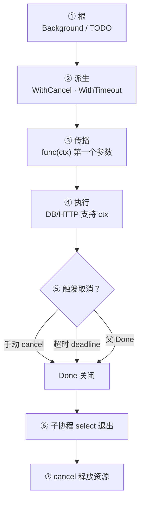
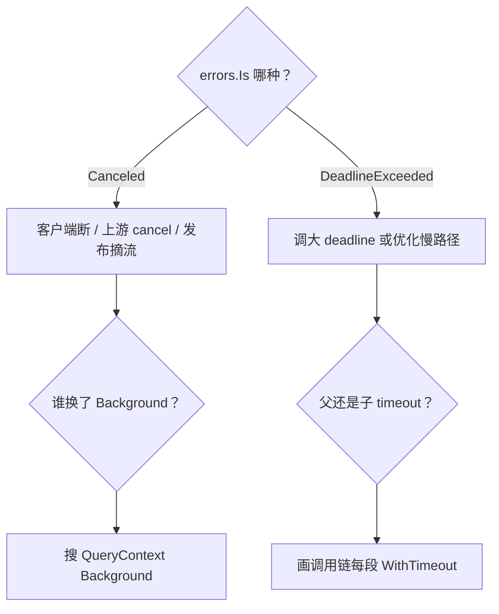

# 08 context取消与超时传播 · 知识点

> 滚动发布时旧 Pod 的 RPC 还在跑，新请求已经 504；有人 `context.Background()` 传到底层 DB，取消发布等于 `kill -9`；子任务 `WithTimeout` 5s 父任务 3s，到底听谁的——线上日志一片 `context canceled` 却没人知道谁 cancel 的。
> **本章回答**：一个 **context** 从 `WithCancel`/`WithTimeout` 创建到 `Done` 关闭、沿调用链传播的一生——谁派生、谁负责 `cancel()`、超时怎么叠、值该怎么用。
> **不讲**：goroutine 泄漏总论 → [05](../05-goroutine与调度模型/)；`select` 语法 → [06](../06-channel与select/)；`errgroup` 编排 → [09](../09-errgroup与并发限流/)；HTTP 优雅退出全貌 → [10](../10-HTTP-Server与优雅退出/)。

**标记**：🎯重点 · 🔥难点 · ⭐常考 · 🔧实操

## 面试怎么考

| 标记 | 考点 |
|------|------|
| **核心** | 树形派生；父 cancel 子全 cancel；`ctx.Err()` 判因 |
| **必会** | `defer cancel()`；别把 ctx 存 struct；超时用 `WithTimeout` |
| **常用** | `http.Request.Context()`；gRPC metadata 透传 |
| **常考** | `WithValue` 滥用；Background vs TODO；取消不是杀 goroutine |

**30 秒怎么说**：`context` 管 **取消信号和截止时间** 沿调用链向下传，不管数据（数据走参数/channel）。根用 `Background()`/`TODO()`；派生 `WithCancel`（手动停）、`WithTimeout`/`WithDeadline`（到时自动 cancel）。**谁派生谁 `defer cancel()`**，否则 timer 泄漏。父 `Done` 关闭，所有子 ctx 的 `Done` 也关——一次取消整棵子树。`ctx` 作函数**第一个参数** `ctx context.Context`，不存成员字段。取消只发信号，** goroutine 要自己 `select ctx.Done()` 退出**。

---

## 能力边界

| 机制 | 管什么 | 不管什么 |
|------|--------|----------|
| `context` | 取消、超时、截止、请求级元数据（慎用 Value） | 数据载荷、错误聚合 |
| `channel` | 数据、任务、所有权 | 跨 API 边界标准取消 |
| `WaitGroup` | 等 goroutine 结束 | 超时、原因传递 |
| `errgroup` | 多任务 + 首错取消（[09](../09-errgroup与并发限流/)） | 单独用时需自己绑 ctx |

标准库 HTTP、gRPC、database/sql 都把 `ctx` 当取消入口——运维读 trace 时 `context canceled` 要会往上追谁 timeout。

---

## 一、一张图：context 从派生到传播的一生

> 🎯 **一句话**：根 ctx → `With*` 派生子 ctx → 业务层层传参 → `Done` 关闭 → 各层 `select` 退出 → `cancel()` 释放 timer。



**读图**：入口 `main` 或 `ListenAndServe` 拿到请求 ctx（或自建 `WithCancel`）；每层 `fetchUser(ctx)` → `queryDB(ctx)` 原样往下传，**不要**中途换成 `Background()`。触发可以是：上游断开、`cancel()`、deadline 到、父 ctx 已取消。`Done` 是只读 channel，关闭后 `<-ctx.Done()` 立刻返回。最后调用派生时拿到的 `cancel()` 函数，通常 `defer cancel()` 在函数退出时释放 timer（即使已自然完成也要调，幂等）。

---

## 二、根：Background 与 TODO ⭐

> 🎯 **一句话**：`Background()` 是空根 ctx，永不过期；`TODO()` 占位，语义上「还没定用哪个父 ctx」。

```go
ctx := context.Background()
ctx := context.TODO()
```

| 函数 | 用途 |
|------|------|
| `Background()` | `main`、测试根、库函数缺省 |
| `TODO()` | 重构中、接口尚未接上游 ctx |

两者行为几乎相同，**区别是意图**。生产 `main` 用 `Background()` 再 `WithCancel` 派生应用生命周期 ctx。

> ⚠️ **别混**：需要可取消时别长期用 `Background()`——派生一层 `WithCancel`。

---

## 三、派生：WithCancel ⭐🔥

> 🎯 **一句话**：`WithCancel(parent)` 返回 `(ctx, cancel)`；调 `cancel()` 或 parent 取消 → 本 ctx `Done` 关闭。

```go
ctx, cancel := context.WithCancel(context.Background())
defer cancel() // ← 必须，释放子树资源

go worker(ctx)

// 某处
cancel() // 通知 worker 停
```

### 规则

- **谁 `WithCancel` 谁 `defer cancel()`**（在创建派生的那层函数）  
- `cancel()` **可多次调用**，幂等  
- 不把 `cancel` 传给不熟的控制流——只在本层或明确 owner 调  

```go
func run(ctx context.Context) error {
    ctx, cancel := context.WithCancel(ctx)
    defer cancel()
    // ...
}
```

子 ctx 取消**不会**向上取消父 ctx；父取消**会**向下取消所有子孙。

> 💡 **打个比方**：父 ctx 是总闸刀，子 ctx 是分闸——拉总闸，全楼断电；只拉分闸，不影响别的楼层。

> 📝 **面试**：`WithCancel` 不杀 goroutine，只关 channel；worker 必须监听 `Done`。

---

## 四、派生：WithTimeout 与 WithDeadline ⭐🔥

> 🎯 **一句话**：到时自动 `cancel()`；`WithTimeout` = `WithDeadline(now+d)`。

```go
ctx, cancel := context.WithTimeout(parent, 3*time.Second)
defer cancel()

req, err := http.NewRequestWithContext(ctx, "GET", url, nil)
```

```go
deadline := time.Now().Add(5 * time.Second)
ctx, cancel := context.WithDeadline(parent, deadline)
defer cancel()
```

### 超时叠加 ⭐

子 deadline **不能晚于**父——取**更早**的截止：

```go
parent, _ := context.WithTimeout(bg, 10*time.Second)
child, _ := context.WithTimeout(parent, 30*time.Second)
// child 实际 ~10s 就死，听父的
```

```go
parent, _ := context.WithTimeout(bg, 10*time.Second)
child, _ := context.WithTimeout(parent, 3*time.Second)
// child ~3s
```

**读图**：想象父 deadline 是硬顶，子只能更严不能更松。

### 不 defer cancel 的泄漏

`WithTimeout` 内部有 timer；**不 `cancel()`** 且 ctx 未自然到期 → timer 挂到堆直到触发——高 QPS 下泄漏。

> 🔍 **现场**：

```go
if deadline, ok := ctx.Deadline(); ok {
    log.Printf("deadline=%v", deadline)
}
```

---

## 五、传播：函数签名与 HTTP ⭐

> 🎯 **一句话**：`ctx` 放**第一个参数**；`http.Request.Context()` 从入口一路传到底。

```go
func Handle(w http.ResponseWriter, r *http.Request) {
    ctx := r.Context()
    if err := service.Do(ctx, r.URL.Query()); err != nil {
        if errors.Is(err, context.Canceled) {
            // 客户端断开，常打 499 或不记 error
            return
        }
        http.Error(w, err.Error(), 500)
    }
}
```

```go
func (s *Service) Do(ctx context.Context, q url.Values) error {
    return s.repo.Query(ctx, q.Get("id"))
}
```

### 反模式：存 struct

```go
type Bad struct {
    ctx context.Context // ← 不要
}
```

ctx 生命周期绑定**单次请求**；存 struct 易活到下次请求或泄漏旧 cancel 树。

### 反模式：换 Background

```go
func query(ctx context.Context) {
    db.QueryContext(context.Background(), sql) // ← 上游取消传不下去
}
```

客户端走了，DB 还查——浪费连接、拖慢发布。

> 📝 **面试**：`NewRequestWithContext`、`QueryContext`、`DialContext` 族函数是标准传播点。

---

## 六、接收端：怎么听取消 ⭐🔧

> 🎯 **一句话**：阻塞操作用 `ctx` 版 API；自写循环用 `select` + `Done`。

```go
select {
case <-ctx.Done():
    return ctx.Err()
case result := <-ch:
    return handle(result)
}
```

```go
for {
    if err := ctx.Err(); err != nil {
        return err
    }
    // 短步进工作
}
```

长循环别只开头查一次——每轮或每 N 次查 `ctx.Err()`。

### ctx.Err() 含义

| 错误 | 含义 |
|------|------|
| `context.Canceled` | 手动 `cancel()` 或客户端断开 |
| `context.DeadlineExceeded` | 超时 |

```go
if errors.Is(err, context.Canceled) { ... }
if errors.Is(err, context.DeadlineExceeded) { ... }
```

日志里区分：**Canceled** 常是正常（用户关页面）；**DeadlineExceeded** 常要告警调超时。

### 取消不中断正在进行的 syscall

`QueryContext` 会尽量取消网络等待，但**已进内核**或忽略 ctx 的库可能拖到完。graceful 还要配合连接池超时、应用 deadline。

---

## 七、WithValue：能不用就不用 ⭐

> 🎯 **一句话**：`WithValue` 传**请求级元数据**（trace id）；不是泛型 map，键要用**未导出类型**防冲突。

```go
type traceKey struct{}

ctx = context.WithValue(parent, traceKey{}, traceID)
v := ctx.Value(traceKey{})
```

官方建议：优先函数参数；Value 只放跨 API 边界的诊断信息。OpenTelemetry 等会挂 trace。

> ⚠️ **别混**：Value **不参与**取消树；别用 Value 传 `*User` 大对象——生命周期和可见性都难控。

```go
// 反模式
ctx = context.WithValue(ctx, "user", user) // string key 易冲突
```

---

## 八、与 goroutine、channel 协作 ⭐

> 🎯 **一句话**：`cancel` 后还要 `Wait` goroutine 真退出；`select` 里 `Done` 与业务 channel 并列。

```go
ctx, cancel := context.WithCancel(parent)
defer cancel()

var wg sync.WaitGroup
wg.Add(1)
go func() {
    defer wg.Done()
    for {
        select {
        case <-ctx.Done():
            return
        case job := <-jobs:
            process(job)
        }
    }
}()

cancel()
wg.Wait()
```

只 `cancel` 不 `Wait` → 发布时 goroutine 可能还在写（[05](../05-goroutine与调度模型/) 泄漏/数据损坏）。`errgroup.WithContext` 把 cancel+wait+首错 打包 → [09](../09-errgroup与并发限流/)。

### 父任务等多子任务

```go
ctx, cancel := context.WithTimeout(parent, 5*time.Second)
defer cancel()

errCh := make(chan error, 2)
go func() { errCh <- taskA(ctx) }()
go func() { errCh <- taskB(ctx) }()

for i := 0; i < 2; i++ {
    select {
    case <-ctx.Done():
        return ctx.Err()
    case err := <-errCh:
        if err != nil {
            cancel() // 一脚踩停另一条
            return err
        }
    }
}
```

---

## 九、生产模板：HTTP 客户端超时链 🔧

> 🎯 **一句话**：外层请求 ctx 定总预算；内层 `http.Client` 设 `Timeout` 作兜底，两层取更严。

```go
func fetch(ctx context.Context, url string) ([]byte, error) {
    ctx, cancel := context.WithTimeout(ctx, 2*time.Second)
    defer cancel()

    req, err := http.NewRequestWithContext(ctx, http.MethodGet, url, nil)
    if err != nil {
        return nil, err
    }
    client := &http.Client{
        Timeout: 3 * time.Second, // 兜底，应 ≥ 或配合 ctx
    }
    resp, err := client.Do(req)
    if err != nil {
        return nil, err
    }
    defer resp.Body.Close()
    return io.ReadAll(resp.Body)
}
```

**最佳实践**：`Client.Timeout` 覆盖整个交换；`Request.Context` 更细——两者都设时，**先触发的赢**。生产倾向 **只信 ctx**，`Client.Timeout` 设略大于 ctx 防 hung。

### gRPC

```go
ctx, cancel := context.WithTimeout(ctx, time.Second)
defer cancel()
resp, err := client.Ping(ctx, &pb.Req{})
```

metadata /trace 通过 `metadata.NewOutgoingContext` 挂，不是 Value 乱塞。

---

## 十、优雅退出：应用级 context 🔧

> 🎯 **一句话**：`main` 派生 `appCtx`，信号 `cancel()`，HTTP `Shutdown` 用同一 ctx 限时。

```go
func main() {
    ctx, cancel := context.WithCancel(context.Background())
    defer cancel()

    srv := &http.Server{Addr: ":8080", Handler: mux}
    go func() {
        sig := make(chan os.Signal, 1)
        signal.Notify(sig, syscall.SIGINT, syscall.SIGTERM)
        <-sig
        cancel()
        shutCtx, shutCancel := context.WithTimeout(context.Background(), 30*time.Second)
        defer shutCancel()
        _ = srv.Shutdown(shutCtx)
    }()
    _ = srv.ListenAndServe()
}
```

请求 handler 用 `r.Context()`，与 `appCtx` 在 Shutdown 时一并取消——完整剧本 [10](../10-HTTP-Server与优雅退出/)。

---

## 十一、作战：context canceled 泛滥怎么查 ⭐🔥



| 现象 | 先做 | 别做 |
|------|------|------|
| 发布时大量 canceled | 查 handler 是否传 ctx 到下游 | 当 500 重试风暴 |
| DB 慢 + canceled | 看 deadline 是否短于 P99 | 无限加大 timeout |
| timer 泄漏 | 搜 `WithTimeout` 缺 `defer cancel` | 只盯 goroutine 不盯 timer |

**60 秒剧本** 🔧：

- **0–10s**：日志里 `Canceled` vs `DeadlineExceeded` 比例  
- **10–30s**：trace 找最外层 `WithTimeout` 谁设的  
- **30–45s**：搜 `Background()` 在业务路径的滥用  
- **45–60s**：核对 `defer cancel()` 与 `Shutdown` 超时  

---

## 十二、收束：context 凭什么能统一取消

> 🎯 **一句话**：树形派生 + `Done` channel + 标准库全族 `*Context` API = 一条取消线拉到底。

**可背清单**：

- 根：`Background`/`TODO`  
- 派生：`WithCancel` / `WithTimeout` / `WithDeadline`  
- 规则：`defer cancel()`；ctx 第一参；不存 struct  
- 传播：父 cancel → 子全死；子 deadline ≤ 父  
- 接收：`select Done` 或 `*Context` API  
- Value：仅 trace 类元数据，私有 key  

> ⚠️ **别混**：取消 ≠ 杀进程；goroutine 要合作退出。context **线程安全**，可多 goroutine 读 `Done`/`Err`。

---

## 十三、标准库中的 context 入口 ⭐

> 🎯 **一句话**：凡阻塞/可能慢的 API，找 `XxxContext(ctx, ...)` 变体——没有就怀疑库太老。

| 包 | 函数 |
|----|------|
| `database/sql` | `QueryContext`, `ExecContext` |
| `net/http` | `NewRequestWithContext`, `Request.Context()` |
| `net` | `DialContext`, `ListenConfig` |
| `os/exec` | `CommandContext` |
| `gRPC` | 每个 RPC 第一个参数 `ctx` |

```go
rows, err := db.QueryContext(ctx, "SELECT id FROM users WHERE id=?", id)
if err != nil {
    if errors.Is(err, context.Canceled) {
        return nil // 或特殊处理
    }
    return err
}
```

### http.Server 与 BaseContext

```go
srv := &http.Server{
    Addr: ":8080",
    BaseContext: func(net.Listener) context.Context {
        return appCtx // 给每个请求的根（少用，一般 r.Context 来自连接）
    },
}
```

多数场景 handler 用 `r.Context()` 足够；`BaseContext` 用于注入服务级值（仍慎用 Value）。

---

## 十四、超时预算怎么拆 🔧

> 🎯 **一句话**：**端到端 deadline** 在入口设一次，内层用 **剩余时间** 或按比例分配，别每层都满额 `WithTimeout(parent, 5s)`。

```go
func handler(ctx context.Context) error {
    // 入口 middleware 已 WithTimeout(3s)
    return callDownstream(ctx) // 不要再叠 3s，用同一 ctx
}

func callDownstream(ctx context.Context) error {
    if deadline, ok := ctx.Deadline(); ok {
        log.Printf("remaining=%v", time.Until(deadline))
    }
    return rpc(ctx)
}
```

**反模式**：每层各 `WithTimeout(5s)`，父只有 3s——内层以为有 5s，实际 3s 就死，日志难读。

### 客户端断开识别

```go
if errors.Is(err, context.Canceled) && ctx.Err() == context.Canceled {
    // 可能是 client disconnect
}
```

配合 `http.ResponseController`（Go 1.20+）或反向代理 `499` 日志。

---

## 十五、测试里的 context

```go
func TestFetch(t *testing.T) {
    ctx, cancel := context.WithTimeout(context.Background(), time.Second)
    defer cancel()
    err := fetch(ctx, server.URL)
    require.NoError(t, err)
}
```

测试超时要 **短**，逼出 hang。`context.Background()` 在测试根 OK，测取消用 `WithCancel` 手动 `cancel()`。

```go
func TestCancel(t *testing.T) {
    ctx, cancel := context.WithCancel(context.Background())
    done := make(chan struct{})
    go func() {
        <-ctx.Done()
        close(done)
    }()
    cancel()
    select {
    case <-done:
    case <-time.After(time.Second):
        t.Fatal("not canceled")
    }
}
```

---

## 十六、踩坑清单

| 现象 | 原因 | 修法 |
|------|------|------|
| timer 涨 | 无 defer cancel | 每个 With* defer |
| 取消无效 | Background 调下游 | QueryContext |
| 子超时更长 | 误解 deadline | 画父子链 |
| goroutine 泄漏 | 只 cancel 不 Wait | wg / errgroup |
| Value 冲突 | string key | 私有类型 key |

---

## 十七、收口

### 命令速查 🔧

```bash
# 代码审查
rg 'context\.Background\(\)' --glob '*.go'
rg 'WithTimeout|WithCancel' -A2 --glob '*.go' | rg -v 'defer cancel'
```

### 面试锚点

| 问 | 30 秒答 |
|----|---------|
| Background vs TODO | 行为同，意图不同；可取消任务别长期 Background |
| 为何要 defer cancel | 释放 timer；WithCancel 也建议 defer |
| 父 10s 子 30s | 子仍 ~10s，取更早 deadline |
| 取消如何传到 DB | `QueryContext(ctx, ...)` |
| WithValue 怎么用 | 少用最；未导出 key；不传业务大对象 |

### 易错一句话

- 错：cancel 会自动停 goroutine → 对：只关 Done，要 select  
- 错：ctx 存全局变量 → 对：按请求传递  
- 错：子 timeout 能超过父 → 对：父是硬顶  
- 错：WithValue 当参数包 → 对：显式函数参数  
- 错：Canceled 都当错误告警 → 对：客户端断开常正常  

### 数字墙

```text
ctx 第一参数 · defer cancel 每次 With* · 子 deadline ≤ 父
Shutdown 常用 30s grace（见 [10]）· Done 关闭后 recv 立即返回
```

---

## 合上书

- [ ] **默画** context 一生：派生 → 传播 → Done → cancel 清理  
- [ ] 口述 `WithCancel` 与 `WithTimeout` 区别及 defer 原因  
- [ ] 父 10s 子 3s / 父 10s 子 30s 各多少秒死  
- [ ] 写 handler 把 `r.Context()` 传到 `QueryContext` 的骨架  
- [ ] 说明取消为何不自动杀 goroutine，要怎么写退出  
- [ ] `Canceled` 与 `DeadlineExceeded` 各代表什么  
- [ ] 列举两个 ctx 反模式（存 struct、换 Background）  
- [ ] `WithValue` 正确用途与 string key 为何不好  
- [ ] HTTP 发布时 context canceled 排查三步  
- [ ] 说明 `errgroup.WithContext` 与裸 ctx 的关系（链到 [09]）  
